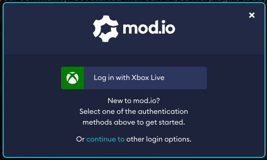

import CrossLink from '@site/src/components/CrossLink'

# Xbox One & Xbox Series X/S 

Requirements for Xbox One & Xbox Series X/S typically include:
* UGC cannot run scripts or execute code, unless sufficient mitigations are demonstrated to be in place (e.g. sandboxing or manual curation of content)
* UGC must work without the need for manual installation
* All “words” must be run through the Xbox word filter
* All data must be XR-012 (secure data transfer) compliant
* User consent is required the first time before authenticating an Xbox user
* If the Xbox user has UGC parental controls disabled, the UGC menu and any UGC installed must be disabled

We recommend contacting your Microsoft representative to establish their rules for UGC on their platform and any specific requirements you will need to meet. We can assist you with this process, and introduce you to our contact Vince Loiseleur (Developer Partner Manager) if this would be helpful, to get these approvals processed.

## SDK Access

In order to allow access to the GDK Support modules for Xbox, we need to verify your status with Microsoft as an approved developer via our account manager.

To do this, please notify your contact at mod.io that you require this access and provide us with the following details as they would be recorded by Microsoft:
* Your Company Name
* Your Title/Game Name
* The email domain/address registered with Microsoft. (eg. \*@mod.io)

Once our account manager confirms your status, we will provide you with the support module for your integration solution.

## Moderation

On Xbox, only UGC which follows the rules should be made available to download and play. Our moderation tools and web dashboard allow you to control this process and manage the types of UGC available on the Xbox Platform without any additional development required.

## Authentication

On Xbox platforms, you can authenticate the user via our Xbox Live authentication flow, or using their email address. We highly recommend using Xbox Live authentication where possible, as it is instant vs email which is not. 

If your implementation displays the mod.io website or custom web app through a browser overlay, we recommend adding the following query strings to the URL depending on the authentication method you have chosen to support:
* Xbox Live Authentication: `?portal=xboxlive&login=auto`
* Email Authentication: `?portal=email`

This will provide users with a streamlined login experience tailored to the appropriate login method (example below):

Please contact us for further instructions for authenticating with Xbox Live: [developers@mod.io](mailto:developers@mod.io)

## Consent

If you choose to use Xbox Live authentication (this isn’t required for email), it is a requirement from Microsoft that consent is collected before a user is authenticated for the first time. So when a user clicks the “UGC” button in-game, you must display an acceptance dialog similar to the one explained [Terms & User Consent](/user-consent/) guide.

## Networking & Storage

Storage space available for UGC will be limited, and allocation for space dedicated to UGC will require an entry in your MicrosoftGame.config file. We recommend using ‘Growable Persistent Local Storage’ to allocate the space you require for UGC, as this reduces the up-front storage required on the device. All games that implement mod.io services will require space for storing cached and downloaded data, as well as space for storing user-specific data.