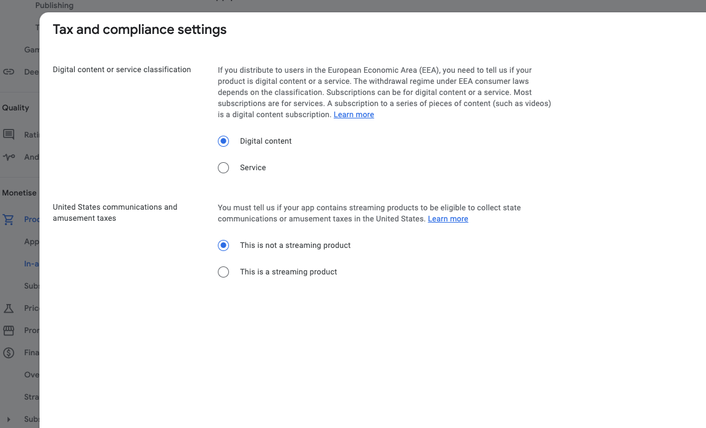
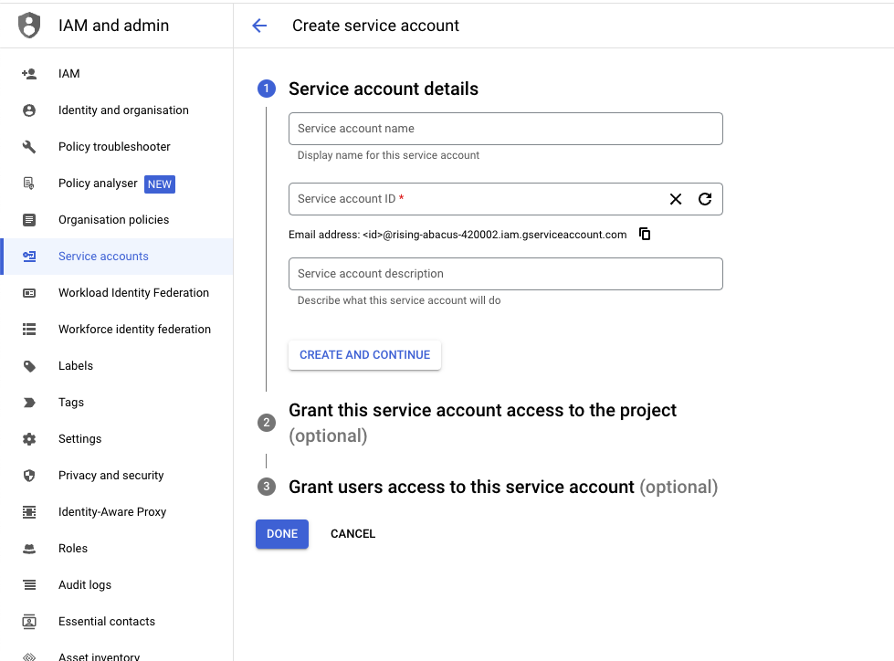
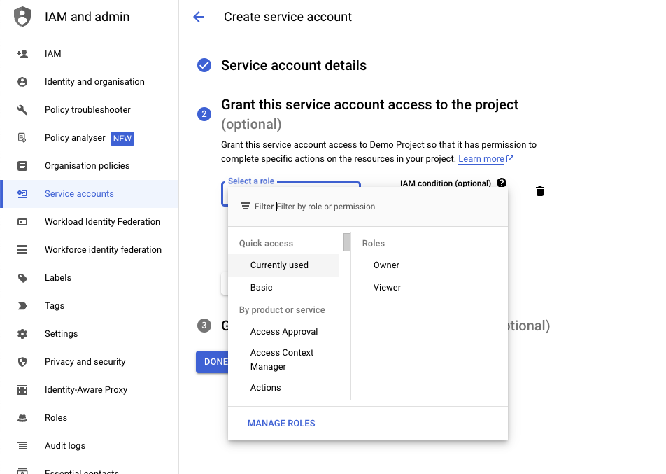
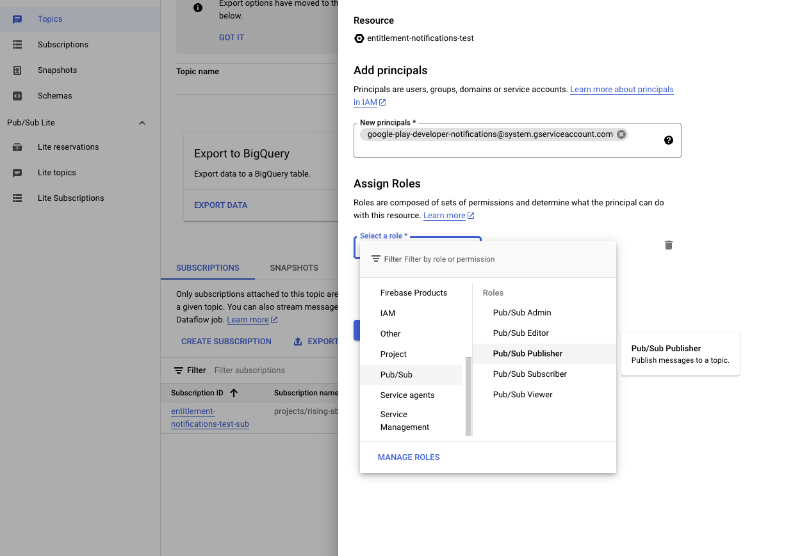

import CrossLink from '@site/src/components/CrossLink'

# Google

Typical requirements for using mod.io on Google Play games include:
* Requires users accept the app's terms of use and/or user policy before users can create or upload UGC
* Defines objectionable content and behaviors (in a way that complies with Google Play Developer Program Policies), and prohibits them in the app’s terms of use or user policies
* Conducts UGC moderation, as is reasonable and consistent with the type of UGC hosted by the app. This includes providing an in-app system for reporting and blocking objectionable UGC and users, and taking action against UGC or users where appropriate
* Provide in-app functionality to report content and users
* Provides safeguards to prevent in-app monetization from encouraging objectionable user behavior
* A Google Cloud console account
* A Google Play console account

## Setting up Google SSO

This guide will show you how to setup authentication to mod.io using Google SSO for their players on Android devices.

To begin, we require the following scopes to authenticate a user against your Google project credentials:
* .../auth/userinfo.email
* .../auth/userinfo.profile
* .../auth/games
* .../auth/games_lite
* .../auth/drive.appdata
* openid

:::note
Play games services version 2 (PGSV2) no longer supports additional OAuth2.0 scopes out of the box, therefore it is recommended to use Google sign-in SDK as outlined here: [OAuth scopes on PGSV2](https://developer.android.com/games/pgs/signin#oauth-scopes) and here: [OAuth scopes and PGSV1](https://developers.google.com/games/services/common/concepts/v1/sign-in#oauth-scopes).
:::

To authenticate to mod.io via a Google Play account, we support the following credential flows:
* Server Authentication Code
* ID Token

### Setting up your Google Console Project

1. Create or open a project on Google’s APIs Console: [Google API Console](https://console.cloud.google.com/).

2. Navigate to the OAuth consent screen page and fill out the App Information that will display on the consent screen for users of your Game.

3. Fill out the **App Information** section with your **App Name**, **User support email** and upload an **App logo**.

4. Next, fill out the **App domain** section by inserting your application homepage, privacy policy and terms of service URLs.

5. Enter your developer contact information then, click **save and continue**.

6. Next, select the scopes required for your project by clicking **Add or Remove Scopes**, make sure you select .../auth/userinfo.email, .../auth/userinfo.profile, .../auth/games, .../auth/drive.appdata and .../auth/games_lite, openid then click **save and continue**.

7. Cross-check the OAuth consent screen page to verify that the information there is correct for your project.

8. Navigate to the credentials page and create credentials, making sure you select OAuth Client ID as the credential type.

9. Create an OAuth ClientID set application type as web application, add a name, and an authorised Redirect URI. Click create (note your Client ID, Redirect URI and Client Secret as these are required to [enter on mod.io later](#configuring-your-games-google-client-id-secret-and-redirect-uri-on-modio)).

10. Create an OAuth ClientID for Android - select application type as Android from the dropdown, for the package name enter the name of your game as appears in your [AndroidManifest.xml](https://developer.android.com/guide/topics/manifest/manifest-intro) file, and [SHA-1 fingerprint](https://developers.google.com/android/guides/client-auth).

### Setting Up Play Games Services

1. Navigate to the Google Play Console and sign in.

2. Create a game or select your app/game from the list of games ([official guide](https://support.google.com/googleplay/android-developer/answer/9859152)).

3. Within the console of your game, navigate to **Play Games Services > Setup and management > Configuration** tab. Select **Create new Play Games Services project** then use the dropdown to select the Google cloud project we set up in previous steps, or if you have and click **use**.

4. Click on **Edit properties** and fill out the display name, description, category, icon, feature graphic and scroll down to make sure that the cloud project platform project is listed under **External Integrations** for your game, **save changes**.

5. Click on **Add Credential** then select **Game Server**. On the following page, fill out the details and select the OAuth 2.0 client ID set up (on Step 4, previous section) **save changes**.

6. Return to the play games services setup page and click on **Add Credential**, then select the **Android** option and the Android OAuth2.0 client ID from the dropdown (Step 5, previous section) **save changes**.

### Configuring your games Google Client ID, Secret and Redirect URI on mod.io

1. On the mod.io website, navigate to your [game's admin dashboard](https://mod.io/content) and go to the **Settings** tab.

2. Under **Admin > General Settings** find and click on the **Platform Authentication**.

3. Enter the **Google Client ID**, **Google Client Secret**, and **Google Redirect URI** and **Save Changes**.

### Sign in players to mod.io using Google

If your game is using the official mod.io SDK, Unreal or Unity plugin, follow the instructions provided with it to authenticate players using Google SSO, or other supported platform authentication methods.

If you are building something custom using the mod.io REST API, follow the [instructions provided here](https://docs.mod.io/restapiref/#google) to authenticate players using Google SSO, by calling the `/external/googleauth` endpoint.

### References

* [Enabling Google Play Games Services](https://developers.google.com/games/services/console/enabling)
* [Set Up Google Play Console](https://support.google.com/googleplay/android-developer/answer/9859152)
* [Google Play Games Services Offline Access](https://developers.google.com/games/services/android/offline-access)
* [Google Play Games Services Android Offline Access](https://developers.google.com/games/services/v1/android/offline-access)

## Setting up Google Play Entitlements

This guide will show you how to set up your game up on Google Play Console and mod.io website for mod.io to process entitlements on your behalf. The mod.io platform will use the Google Play Android Developer API to verify purchases and grant associated entitlements to users who have purchased [mio tokens](#glossary-of-terms) in your game. Conversely, if a user requests a refund, mod.io will revoke the entitlements associated with the refunded purchase.

:::note
To revoke entitlements after refunds, you must tick the remove entitlements checkbox in the refund request, you can also set this value to true programmatically. [Voided Purchases Documentation](https://developers.google.com/android-publisher/voided-purchases).
:::

### Glossary of Terms

* **Google Play Android Developer API**: The Google Play Developer API allows you to perform a variety of publishing and app-management tasks. It provides the functionality to manage in-app products and subscriptions.
* **Service Account**: A service account is a special type of Google account intended to represent a non-human user that needs to authenticate and be authorized to access data in Google APIs.
* **Service Account Credentials**: Service account credentials are used to authenticate the service account when it calls the Google Play Android Developer API. This refers to a JSON file generated on the Google console that contains information to authorize mod.io's servers to communicate with Google Play API on your behalf (To get information about an in-app purchase for verification or consumption purposes).
* **Google Play Console**: The console provided by Google that allows developers to publish and manage applications or games and in-app products on Google Play.
* **Package Name**: The package name is a unique name for your game on the Google Play Store. It is also known as the application ID.
* **Product Id**: The product id is a unique identifier for an in-app product on Google Play. It is used to identify the product when making purchases.
* **mios**: mios are consumable digital tokens that can be purchased within your game and exchanged for game mods on the mod.io platform.

### Use cases
In-app mio purchases for a game published on Google Play Store running on an android mobile device. Mios are consumable in-app digital products that can be used to purchase mods on mod.io.

### Prerequisites

* A play console developer account with a published game on Google Play.
* A game APK uploaded to Google Play Console. For more instructions on how to upload an APK, see the [official documentation](https://support.google.com/googleplay/android-developer/answer/9859152#zippy=%2Cproduct-details).
* You will also need to have a Google Cloud Console account to create a service account and enable the Google Play Android Developer API.
* A game set up on mod.io with monetization marketplace enabled.

### Setting In App Products on Google Play Console
This section assumes you have a game set up on Google play console. Follow the [official guide](https://support.google.com/googleplay/android-developer/answer/9859152#zippy=%2Cproduct-details) if that's not the case.

1. To set up in-app products on Google play console, go into your game's dashboard, then navigate to the **Monetise > In-app products** section on the Google Play Console and click **Create product**.

2. Fill in the product id, name, description and price for the product.

3. Under tax and compliance settings, select **Digital content**, then select **This is not a streaming product** and then click **Apply**.

4. Click **Save** to save the product then click **Activate** to make the product available for purchase.

5. Repeat steps 1-4 as needed based on how many products you offer for purchase in your game. Take note of the product ids as you will [need it later](#register-your-product-on-modio).

### Register your product on mod.io

1. Go to the mod.io dashboard and navigate to **Admin > Monetization**, marketplace must be enabled to access this screen.

2. Navigate to **Settings > Manage Skus** and select the token pack you'd like to associate with the Google Play product.

3. Select Google from the dropdown and enter the Google Product Id(s) from Google Play Console ([from the previous section](#setting-in-app-products-on-google-play-console)), click **save**.

   
### Processing Google Play entitlements on mod.io

1. Go to Google Cloud Console and select your project. On the Enabled APIs and Services tab, click **Enable APIs & Services**.

2. Select Google Play Android developer API and enable it for the project.

 
3. Click **create credentials** and select **application data** as the option value, then click **next**.

4. On the service account screen, fill out the required information i.e., Service account name, id, and description. Click **Create and continue** 

5. Grant this service account access to the project as either an editor or owner in the roles dropdown as illustrated below, click **done**. 

 
6. Next, go to **Credentials > Service accounts** and select the service account we just created. Click the **keys** tab and **add key**.
 

7. Select the JSON option and click **Create** to generate a service account JSON file. Save this file securely to be used [later on mod.io](#configuring-your-games-google-client-id-and-package-name-on-modio).

8. Go to the menu tab and scroll down through the available products to the pubsub service, click on it.

9. Create a topic, you can use the default settings provided by Google console.

10. Navigate to the topic created and click on the **add subscription** button, fill in the subscription name, select push and insert `https://mod.io/v1/notifications/google` as the **endpoint url** then click **create**.

11. Go into the subscription we just created and add `google-play-developer-notifications@system.gserviceaccount.com` as a principal to the subscription, granting it the role of **pubsub publisher** and **save**.

12. Navigate to Google Play console and select **users and permissions**, add the service account email address to the list of users with access to the Google Play Console from **Step 7**.

13. Go to the **App Permissions** tab click on the **Add app** button, select your app and click apply.

14. Go to the **Account Permissions** tab and grant the service account access to **Financial data, orders, and cancellation survey responses**, click **invite user**. On the next screen, click **send invitation**.

15. Select your app and navigate to monetization setup, scroll down to real time developer notifications and click **edit**. Enable the notifications and select the topic we created in **Step 9**. Click send test message to verify your setup. Select **Get all notifications for subscriptions and one-time products** then **save changes**.

### Configuring your games Google Client ID and Package Name on mod.io

1. On the mod.io website, navigate to your [game's admin dashboard](https://mod.io/content) and go to the **Settings** tab.

2. Under **Admin > General Settings** find and click on the **Platform Entitlements**.

3. Enter the **Google Client ID**, **Google Package Name** and **service account JSON file contents** we saved in **Step 7**, and **Save Changes**.

### References

* [Creating and setting up your app](https://support.google.com/googleplay/android-developer/answer/9859152#zippy=%2Cproduct-details)
* [Getting started with Android Publisher](https://developers.google.com/android-publisher/getting_started)
* [Voided Purchases](https://developers.google.com/android-publisher/voided-purchases)
* [Real Time Developer Notifications](https://developer.android.com/google/play/billing/getting-ready#configure-rtdn)