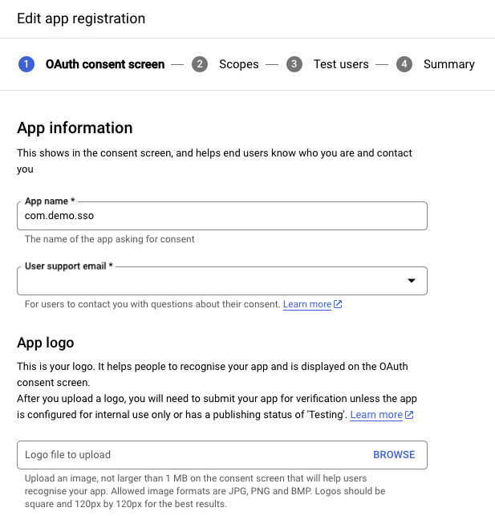
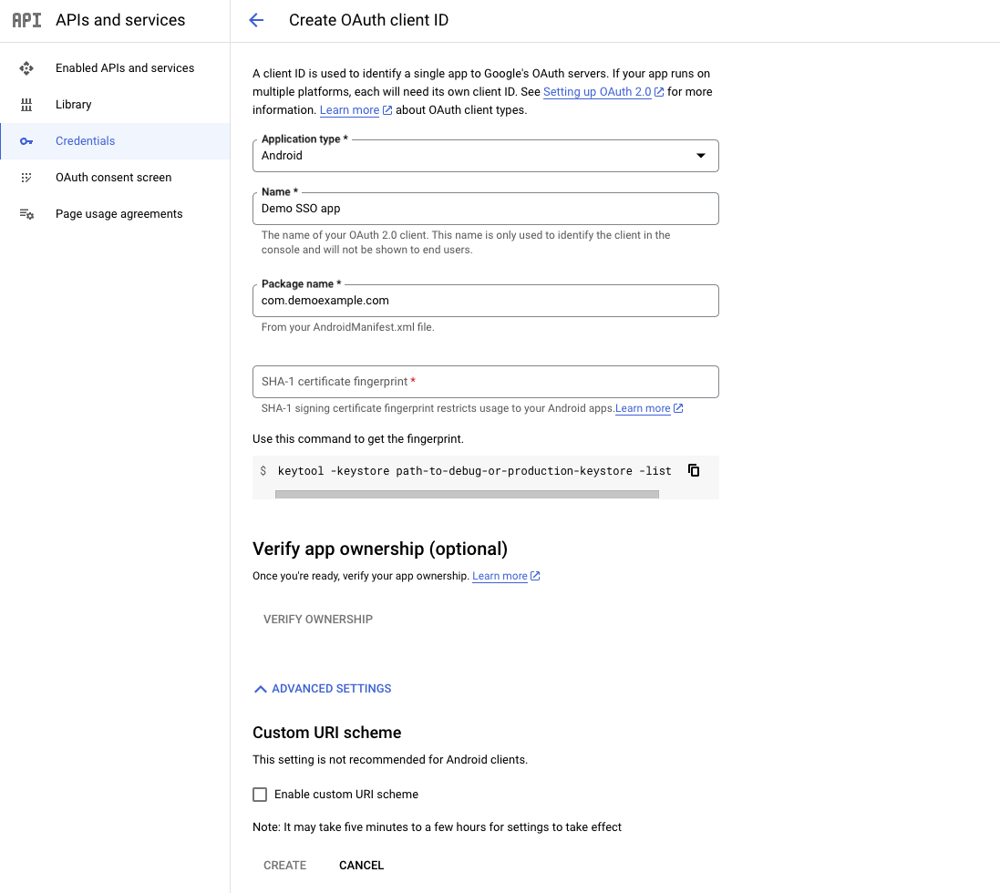
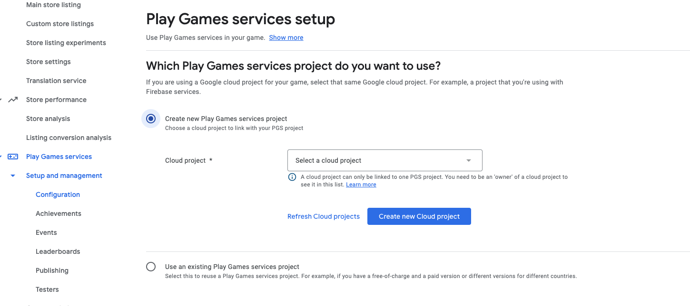
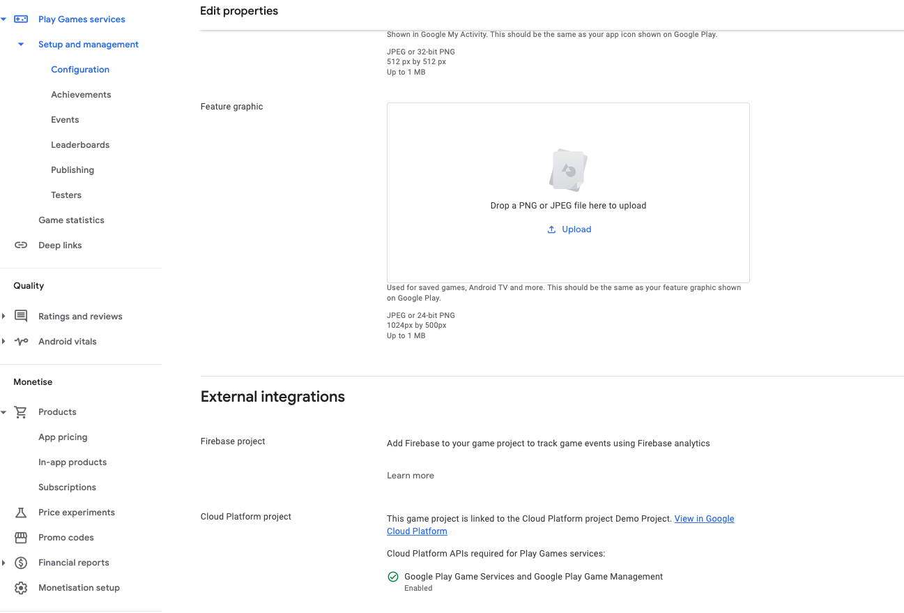
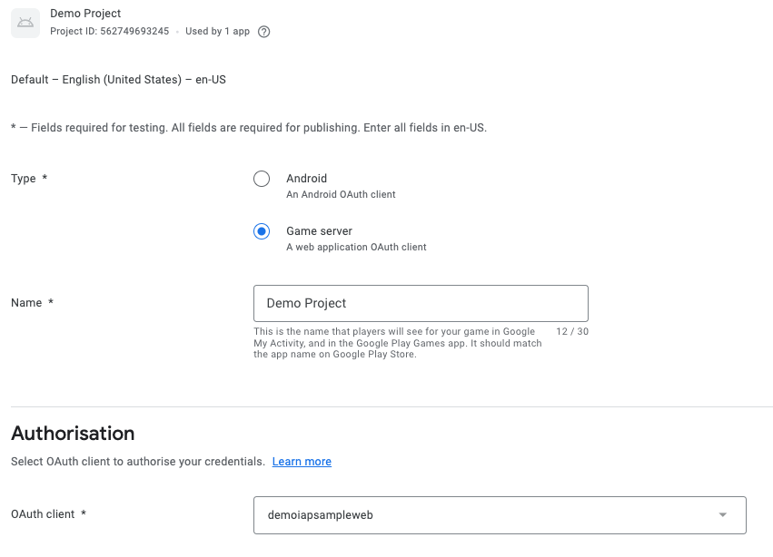

import CrossLink from '@site/src/components/CrossLink'

# Google

Typical requirements for using mod.io on Google Play games include:
* Requires users accept the app's terms of use and/or user policy before users can create or upload UGC
* Defines objectionable content and behaviors (in a way that complies with Google Play Developer Program Policies), and prohibits them in the app’s terms of use or user policies
* Conducts UGC moderation, as is reasonable and consistent with the type of UGC hosted by the app. This includes providing an in-app system for reporting and blocking objectionable UGC and users, and taking action against UGC or users where appropriate
* Provide in-app functionality to report content and users
* Provides safeguards to prevent in-app monetization from encouraging objectionable user behavior
* A Google Cloud console account
* A Google Play console account

The purpose of this documentation, is for games who want to setup authentication to mod.io using Google SSO for their players on Android devices.

## Setting up Google SSO

We require the following scopes to authenticate a user against your Google project credentials:
* .../auth/userinfo.email
* .../auth/userinfo.profile
* .../auth/games
* .../auth/games_lite
* .../auth/drive.appdata
* openid

:::note
Play games services version 2 (PGSV2) no longer supports additional OAuth2.0 scopes out of the box, therefore it is recommended to use Google sign-in SDK as outlined here: [OAuth scopes on PGSV2](https://developer.android.com/games/pgs/signin#oauth-scopes) and here: [OAuth scopes and PGSV1](https://developers.google.com/games/services/common/concepts/v1/sign-in#oauth-scopes).
:::

To authenticate to mod.io via a Google Play account, we support the following credential flows:
* Server Authentication Code
* ID Token

### Setting up your Google Console Project

1. Create or open a project on Google’s APIs Console: [Google API Console](https://console.cloud.google.com/).

2. Navigate to the OAuth consent screen page and fill out the App Information that will display on the consent screen for users of your Game.

3. Fill out the **App Information** section with your **App Name**, **User support email** and upload an **App logo**.

4. Next, fill out the **App domain** section by inserting your application homepage, privacy policy and terms of service URLs.

5. Enter your developer contact information then, click **save and continue**.

6. Next, select the scopes required for your project by clicking **Add or Remove Scopes**, make sure you select .../auth/userinfo.email, .../auth/userinfo.profile, .../auth/games, .../auth/drive.appdata and .../auth/games_lite, openid then click **save and continue**.

7. Cross-check the OAuth consent screen page to verify that the information there is correct for your project.

8. Navigate to the credentials page and create credentials, making sure you select OAuth Client ID as the credential type.

9. Create an OAuth ClientID set application type as web application, add a name, and an authorised Redirect URI. Click create (note your Client ID, Redirect URI and Client Secret as these are required to [enter on mod.io later](#configuring-your-games-google-client-id-secret-and-redirect-uri-on-modio)).

10. Create an OAuth ClientID for Android - select application type as Android from the dropdown, for the package name enter the name of your game as appears in your [AndroidManifest.xml](https://developer.android.com/guide/topics/manifest/manifest-intro) file, and [SHA-1 fingerprint](https://developers.google.com/android/guides/client-auth).

### Setting Up Play Games Services

1. Navigate to the Google Play Console and sign in.

2. Create a game or select your app/game from the list of games ([official guide](https://support.google.com/googleplay/android-developer/answer/9859152)).

3. Within the console of your game, navigate to **Play Games Services > Setup and management > Configuration** tab. Select **Create new Play Games Services project** then use the dropdown to select the Google cloud project we set up in previous steps, or if you have and click **use**.

4. Click on **Edit properties** and fill out the display name, description, category, icon, feature graphic and scroll down to make sure that the cloud project platform project is listed under **External Integrations** for your game, **save changes**.

5. Click on **Add Credential** then select **Game Server**. On the following page, fill out the details and select the OAuth 2.0 client ID set up (on Step 4, previous section) **save changes**.

6. Return to the play games services setup page and click on **Add Credential**, then select the **Android** option and the Android OAuth2.0 client ID from the dropdown (Step 5, previous section) **save changes**.

## Configuring your games Google Client ID, Secret and Redirect URI on mod.io

1. On the mod.io website, navigate to your [game's admin dashboard](https://mod.io/content) and go to the **Settings** tab.

2. Under **Admin > General Settings** find and click on the **Platform Authentication**.

3. Enter the **Google Client ID**, **Google Client Secret**, and **Google Redirect URI** and **Save Changes**.

## Sign in players to mod.io using Google

If your game is using the official mod.io SDK, Unreal or Unity plugin, follow the instructions provided with it to authenticate players using Google SSO, or other supported platform authentication methods.

If you are building something custom using the mod.io REST API, follow the [instructions provided here](https://docs.mod.io/restapiref/#google) to authenticate players using Google SSO, by calling the `/external/googleauth` endpoint.

## References

* [Enabling Google Play Games Services](https://developers.google.com/games/services/console/enabling)
* [Set Up Google Play Console](https://support.google.com/googleplay/android-developer/answer/9859152)
* [Google Play Games Services Offline Access](https://developers.google.com/games/services/android/offline-access)
* [Google Play Games Services Android Offline Access](https://developers.google.com/games/services/v1/android/offline-access)