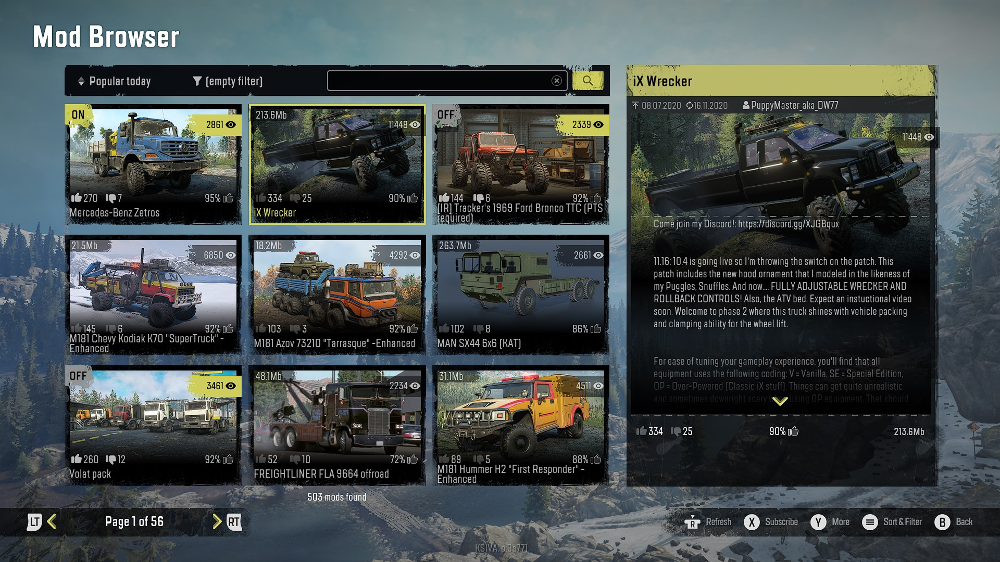

import CrossLink from '@site/src/components/CrossLink'

# Supporting Console Platforms

mod.io is a fully authorized middleware provider for Xbox, PlayStation®4, PlayStation®5 and Nintendo Switch.

|      | **Service Availability** | **Certification Support** | **Native SDK** | **Single Sign-On** |
|------|------|------|------|------|
| **Xbox One**        | ✓ | ✓ | ✓ | ✓ |
| **Xbox Series X**   | ✓ | ✓ | ✓ | ✓ |
| **Nintendo Switch** | ✓ | ✓ | ✓ | ✓ |
| **PlayStation®4**   | ✓ | ✓ | ✓ | ✓ |
| **PlayStation®5**   | ✓ | ✓ | ✓ | ✓ |

You can see examples of mod.io running on consoles in the following titles today:
* SnowRunner - Xbox, PS4™/PS5®, Switch (https://mod.io/g/snowrunner)
* Space Engineers - Xbox (https://mod.io/g/spaceengineers)
* Skater XL - Xbox, PS4/PS5 (https://mod.io/g/skaterxl)

If you would like to see an example of mod.io working in any of these games or other titles, please contact developers@mod.io for demonstration keys.

## mod.io Console Featureset

We provide a number of tools and features, built directly into our dashboard, APIs and SDKs that are designed to make it easy to support UGC on console platforms. These include:

* SDKs and engine plugins for Unity and Unreal that have abstracted networking and data storage layers to allow any platform or future system to be supported with minimal engineering effort required
* Fully compliant moderation systems that allow you to control UGC released onto each platform
* Ability to upload platform-specific UGC files, helpful if you need to “compile” UGC to work with each respective platform
* Tagging and metadata systems to manage UGC on a per-platform basis
* [Platform and portal headers](https://docs.mod.io/restapiref/#platforms) used to localize content (i.e. display names) and other settings automatically
* Word filtering and other processes required by each platform
* Support for onboarding, and certification requirements around UGC
* Advanced metrics and reporting so you can compare the usage of UGC, trending content and other key stats across all platforms your games are released
* Rules based moderation flows to streamline and automate moderation depending on the platform(s) targeted

Future functionality to include:
* Monetization that is compliant with each platforms rules and payment flows

_Example Implementation: SnowRunner in-game UGC browser on Xbox_

## Getting Started

Before embarking on UGC support with any new platform, your first step should be to speak to your account manager and let them know you intend on supporting UGC using mod.io. This allows you to begin the process of understanding what rules exist and information they require from you, in-order for your plans to pass certification.

If you need an introduction to our account managers who understand mod.io and UGC, let us know and we will connect you with:
* Sony Interactive Entertainment: Antonio Grasso - Global Technology Partnerships
* Microsoft Xbox: Vince Loiseleur - Developer Partner Manager
* Nintendo Switch: Ulysse Richert-Botté - Developer Relations

_Example Implementation: Skater XL in-game UGC Browser on PS4/PS5_

A well managed UGC implementation should work cross-platform, with minimal additional effort, since our tools solve the engineering side, and our REST API and web dashboards solves the moderation, reporting and processing side. Most of the work to pass certification is documentation and ensuring your UGC implementation follows the rules you agreed to with each respective platform.

The process we recommend to bring UGC to consoles is:
1. Contact your platform account manager and draft a document which explains how UGC will function in your game, and answers any questions they raise. We can help with the preparation and review of this document. Key sections your platform account manager will want to see addressed include:
    * Storage systems and space required
    * Your moderation and reporting process
    * How UGC is created (in-game or via 3rd party editing tools)
    * How players engage with UGC (in-game and by subscribing via your UGC Hub website)
    * How content delivery happens (using mod.io secured APIs)
    * Type of UGC being shared (levels, skins, configs)
    * Does the UGC execute scripts
1. Begin work on your implementation, which should follow your documentation, and adhere to each platforms requirements, which typically are:
    * No scripts, or approved / sandboxed scripts only
    * No network, filesystem access, or approved / sandboxed access only
    * UGC should be stored in an appropriate location and not mixed or overwriting game files
    * If UGC has the potential to crash your game, users must be able to disable it on launch (or ideally only initialize UGC when playing with them)
    * You must have a way for users to report UGC, and a process for reported UGC to be taken down (we solve this)
    * Consoles have limited filespace. Expect to be working with a limited storage allocation for UGC installation (our plugins make it easy to manage this allocation)
    * Users with parental controls that disable UGC cannot have access to UGC
    * Users' consent must be collected prior to providing access to UGC
    * If you know the users platform display name, you must show it alongside their content (we solve this)

The overall complexity is quite low once you’ve got your game loading and running custom content. Ideally complete your UGC implementation on PC first, before expanding your implementation to other platforms with all of the above in place, to ensure certification is streamlined and efficient.

## Moderation

Our moderation dashboard provides you with all the tools required to comply with the content management rules required by Microsoft, Sony and Nintendo. You can choose to allow all content automatically, or require content be approved before being made available.

#### Allowing all content automatically

This is the default used by most games, especially those where content creation happens in-game. Other games typically allow all content automatically on PC (with no moderation), but approve content before it appears on console using our per-platform file moderation system. This is our recommended approach as it gives your community maximum flexibility, is the simplest to manage, allows you to adhere to console guidelines, and is proven from a DMCA perspective.

#### Moderating all content

If you prefer to control all content prior to going live, you can turn on a full moderation system. This is generally used by games that want to control what is released across all platforms. Speak to us if you would like to experiment with our rules based moderation flow, or community moderation queue as a more automated way of moderating all content.

An introduction to our moderation flow [is provided in our blog](https://blog.mod.io/how-to-effectively-moderate-user-generated-content-mods-ceb2a05eeeed), and a how-to guide [is available here](https://blog.mod.io/how-moderating-works-9a7e923c625a). We can provide training for your team or take full responsibility for moderation if that is your preferred approach.

### Reporting

A requirement of all consoles, and a critical piece for maintaining a safe UGC environment is supporting a reporting process for content. This process must always be running, and pair with the moderation process chosen above. It must allow the community to report content that is “in-compatible, offensive, stolen or false” and also allow IP rights holders to submit DMCA notices.

Users can report content via the mod.io website (see: [https://mod.io/report](https://mod.io/report)). Games can either link to that report interface, or implement their own in-game which our SDK and engine plugins support if using the UI we provide for Unity and Unreal.

A dashboard interface is available to all game moderators, who are responsible for actioning reports that come in. These reports are also shown to mod.io staff, who will support your team and take action as per our negotiated terms.

You can also set automatic thresholds, which will hide content automatically and hold it for review once a predefined number of reports have been submitted (decided by you).

### Content Submission Flow

User-generated content can be created either through in-game tools, out-of-game tools that are provided by you, or third-party tools (such as blender). The types of content you wish to support, and how these are created, are at your discretion, as long as they comply with the rules of each platform.
  
Where an in-game editor isn’t provided, content will generally be created on PC using in-house or third-party development software and tools. This content is then submitted into the mod.io system either through your tools interface, or via the mod.io web interface. Content is then moderated and approved for consoles.

