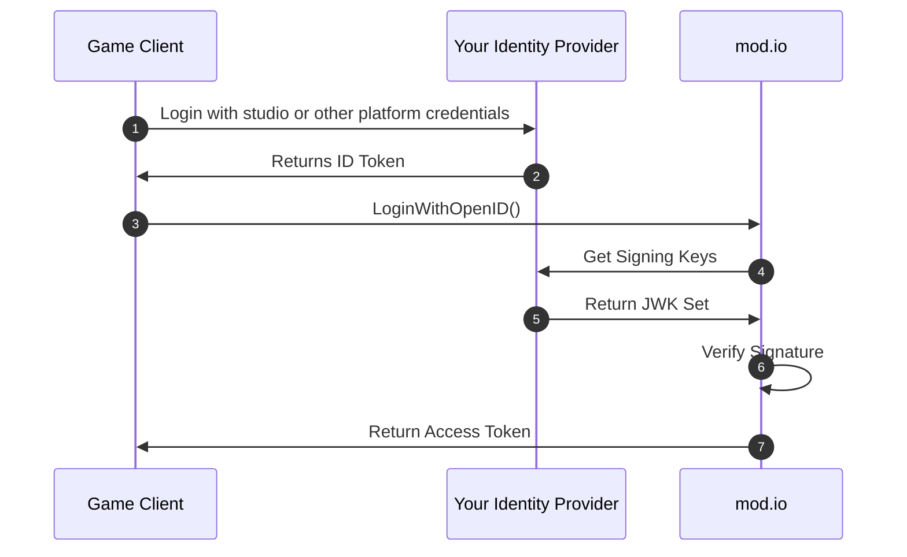
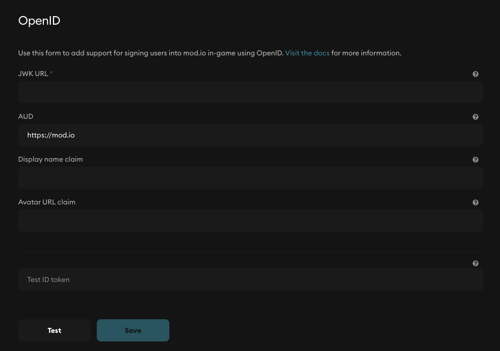

# Custom SSO (In-Game)

Custom SSO uses your studio's identity provider as the single required authentication source for a user to access UGC in your game. This is one of our premium features, and the recommended authentication method for any studio with an established login system.

:::note[Premium Feature]
If you are interested in activating this feature, contact us at developers@mod.io.
:::

For more auth methods, check out our [Authentication](/authentication) guide.

This guide covers:

* [How it works](#how-it-works)
* [Glossary](#glossary)
* [Use cases](#use-cases)
* [Prerequisites](#prerequisites)
* [Authentication process](#authentication-process)
* [Configuration](#configuration)
* [Recommendations](#recommendations)
* [References](#references)

## How it works

Custom SSO is part of the OpenID Connect (OIDC) specification, enabling your game to log a user into mod.io with an existing session with your identity provider. OpenID authentication is stateless and a great candidate for game clients that cannot rely on traditional OAuth 2.0 web-based redirect flows.

Upon a user signing into your identity provider, your web service can generate an ID Token which can then be shared with other services (such as mod.io) whilst keeping the credentials that ID Token is derived from private. Furthermore, by verifying the signature of the ID Token, mod.io can be guaranteed that only the holder of the private key (in this case, your web service) created the token and it has not been tampered with.

OIDC has proven to be a less complicated, modern SSO solution than SAML 2.0 and is the recommended in-game authentication solution if your implementation requires your web service to act as the identity provider.

:::note[What about Web SSO?]
For single sign-on web functionality that uses your studio's identity provider, check out [**Custom SSO (Web)**](/authentication/openid-website).
:::

## Glossary

- Identity Provider: Your account system, which is expected to generate signed ID Tokens for players after they have authenticated with your game client / web service.
- JWK Set: JSON Web Key Set, which contains one or more public keys that your service used to sign the ID Tokens.

## Use cases

- **In-Game**: Due to the stateless nature of ID Tokens, they are an excellent candidate for being used in-exchange for a mod.io access token as they do not rely on web-redirects to obtain and furthermore it is independent from how a player authenticates with your service to generate the ID Token.
- **Embed Hub**: If you are embedding a hub into one or more of your domains, and you already have sign in functionality within your domain against your identity provider, you can use the `openid` to get an `id_token` returned, which you can then pass to our Embed Hub for frictionless SSO.

## Prerequisites

To use ID Token authentication, you must satisfy the following criteria:

- Host an identity provider that implements the [OpenID Connect specification](https://openid.net/developers/how-connect-works/) functionality.
- A mechanism in which you log in players to your service and then return an ID Token to [send to mod.io](/restapi/docs/authenticate-via-openid).

## Authentication process



1. Game client authenticates the player with your web service, using your identity provider.
2. Your identity provider issues an [ID Token](https://openid.net/specs/openid-connect-core-1_0.html#IDToken) to the game client.
3. Game client passes¹ the OpenID token to mod.io.
4. mod.io [fetches your JWK keyset](#configuring-your-jwk-endpoint) from your registered JWK URL.
5. Your Identity Provider returns JWK set to mod.io
6. mod.io [verifies the signature](#id-token-validation-process) of the ID Token.
7. mod.io returns a mod.io access token to call protected APIs.

¹ _OpenID functions and APIs are supported by official mod.io tools._

## Configuration

### Configuring your JWK endpoint

To use ID Tokens for authentication, you must host a JWK endpoint that [contains a keyset](https://datatracker.ietf.org/doc/html/rfc7517#appendix-A) encapsulating the JWK (RFC 7517) that signed the ID Token. Upon receiving an ID Token Authentication request from your game client, mod.io will attempt to fetch your signing keys from the JWK URL that is configured in your game administrator portal.

:::tip
When fetching your public JWK set, mod.io will respect the `Cache-Control` response header if returned by your application and cache the keyset internally to prevent unnecessary load on your web server with a max TTL of 86400 (one day) unless the value is lower as defined by your application's response. In the event that a signature check against an ID Token fails due to a cached signing key that has since been replaced, mod.io will re-attempt to fetch the JWK set from your web server to ensure players are not impacted by rotating keysets.
:::

As JWK sets are static json-encoded objects, it's highly recommended that you host your keyset on an object store such as Amazon S3 and share the direct link to the file, instead of a dynamic endpoint powered by a runtime that could cause unnecessary load on your application. Below is an example of our format in which the keyset is formatted, adhering to the RFC 7517 standard.

#### Request to your registered JWK endpoint

```
GET https://accounts.your-web-service.com/jwk/keys.json
```

#### Expected response with a JSON body

```
{
  "keys": [
    {
      "kty": "RSA",
      "e": "AQAB",
      "kid": "WMS7EnkIGpcH9DGZsv2WcY9xsuFnZCtxZjj4Ahb-_8E",
      "alg": "RS256",
      "n": "l6XI48ujknQQlsJgpGXg4l2i_DuUxuG2GXTzkOG7UtX4MqkVBCfW1t1JIIc8q0kCInC2oBwhC599ZCmd-cOi0kS7Aquv68fjERIRK9oCUnF_lJg296jV8xcalFY0FOWX--qX3xGKL33VjJBMIrIu7ETjj06s-v4li22CnHmu2lDkrp_FPTVzFscn-XRIojqIFb7pKRFPt27m12FNE_Rd9bqlVCkvMNuE7VTpTOrSfKk5B01M5IuXKXk0pTAWnelqaD9bHjAExe2I_183lp_uFhNN4hLTjOojxl-dK8Jy2OCPEAsg5rs9Lwttp3zZ--y0sM7UttN2dE0w3F2f352MNQ"
    }
  ]
}
```

:::info
Maintained packages exist to handle generating and publishing JWK sets. It's highly recommended you use an existing package for your language of choice for simplicity and to prevent unintended security holes.
:::

### Setting up your OpenID on the mod.io dashboard

To add your JWK URL to the mod.io dashboard follow these steps:

- Go to your [game profile](https://mod.io/content#games) on mod.io whilst logged in as a team member
- Click the manage button next to the game you want to setup OpenID for
- On the left-hand side menu, click 'Studio Authentication'
- Scroll to the OpenID form and fill in the details
- Save the details



### Required token claims

Once the signature of the ID token has been verified, mod.io will then extract claims from the ID Token to create an account for the player. The following claims are required:

- `sub`: Subject claim. This value MUST be the unique identifier for the player within your identity provider.
- `aud`: Audience claim. This value must be set to either `https://mod.io` or `https://g-{your-game-id}.modapi.io`. If you set the audience to your game's URL, the token will only work within that URL and won't be valid on any other [mod.io](https://mod.io) domain.

### Optional claims mappings

A few additional claim mappings are supported for sharing additional context with mod.io such as

- The players display name (string)
- A URL to the players avatar (string)

Within your OpenID configuration panel, you can configure mappings which are the **claim names within the ID token** that map to any of the above. As an example, if you issue an ID Token with a claim titled `username` containing a vanity display name for the user that you wish to associate with the mod.io account, you should supply `username` as the _Display name claim_ within the config panel.

### ID token validation process

For an OpenID authentication request to be successful, mod.io will make the following checks, in the shown order before considering the ID token valid for creating a mod.io access token.

1. The signing keys exposed by the JWK URL must either be Elliptic Curve (EC) with `256` and `512` being supported curves, or RSA with `RS256` being supported. The `alg` parameter is mandatory both in the JWK endpoint and the OpenID token that is being verified.
2. At least one of the signing keys exposed in the JWK URL must have signed the supplied ID Token.
3. The `sub` claim must be present and a non-empty string or positive integer. In the event an integer datatype is encountered, this value will be cast to a string internally.
4. The `aud` claim must be set to either `https://mod.io` or `https://g-{your-game-id}.modapi.io`. If you use your game's URL, it must match the API host exactly.
5. The `iat` claim cannot be greater than the current epoch unix timestamp with a 10 second buffer to account for clock skew.
6. The `exp` claim must be greater than the current epoch unix timestamp with a 10 second buffer to account for clock skew.

## Recommendations

OpenID offers a powerful method in which game studios can take an existing session (ID Token) generated by your web service, and use the same session to authenticate your players in mod.io in a frictionless manner. To ensure a smooth experience for both your maintainers and your players, we recommend the following:

- The `sub` claim – which acts as a unique identifier for your player – should not be the user's ID from another portal, such as Steam, Xbox Live and others and be your identity provider's native ID. Instead, your identity provider should maintain a mapping table between your native user ID and the user's connections to such platforms and share the native ID with mod.io in the sub claim. This is to prevent a scenario where a studio implements the website login flow in the future, and your players using another linked platform to login - preventing mod.io from being able to account link and subsequently creating a duplicate account.
- The stateless nature of ID Token authentication should not circumvent obtaining user consent from the player prior to sending ID Tokens to mod.io. See [Terms & User Consent](/terms).

## Error reference

| **Error Ref** | **Meaning**                                                                              |
| ------------- |------------------------------------------------------------------------------------------|
| 11086         | The OpenID configuration in your game's dashboard has not been completed.                |
| 11089         | The signature check against the supplied ID token failed.                                |
| 11090         | mod.io was unable to obtain the JWK set from the registered JWK URL.                     |
| 11092         | The ID token is not valid yet, indicating an invalid `nbf` claim value.                  |
| 11093         | The ID token has expired, indicating an invalid `exp` claim value.                       |
| 11094         | The value of the audience claim (aud) did not match the expected value.                  |

## References

- [REST API OpenID Endpoint](/restapi/docs/authenticate-via-openid) - The API endpoint your game client (or web app) sends the ID Token to.
- [OIDC Specification](https://openid.net/developers/how-connect-works/) - OpenID Connect specification.
- [jwt.io](https://jwt.io) - Useful tool for inspecting JWT tokens which may assist in debugging.
