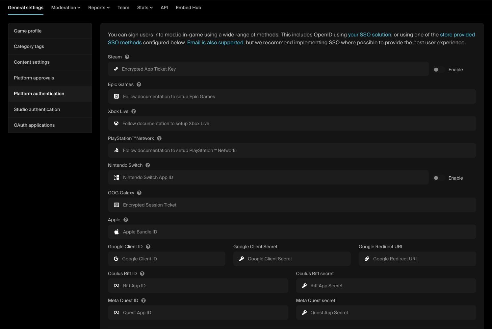

# Platform SSO

Platform Single Sign-On uses the existing OpenID Authentication of the active gaming platform (such as *Steam* or *PlayStation)* to verify users. This is the recommended method for games where [Custom SSO](/authentication/openid) isn't a viable option.

With this method, the user will be able to access your game's UGC by signing into the native system of the platform they are playing the game on. These platforms include *Steam, PlayStation™Network, Xbox Live, Nintendo Switch Online, Epic Games, GOG Galaxy, Meta Quest, iOS and Android*.

As this method uses each platform's native authentication system, it offers a single sign-on solution for *each* platform, as opposed to a single sing-on solution for *all* platforms.

## Setup process

The implementation requirements differ slightly for each platform. The typical setup flow is:

1. On the mod.io website, navigate to your [game's admin dashboard](https://mod.io/content) and go to the **Settings** tab.

2. Under **Admin > General Settings** find and click on the **Platform Authentication**.

3. Follow the platform specific setup instructions. These depend on if you are doing your own implementation using our REST API, or using our engine SDKs which have built in support. The links for each is provided below:

    **PC**:
    - [Steam](/platforms/steam/authentication)
    - [Epic Games](/platforms/epic/authentication)
    - [GOG Galaxy](/platforms/gog/authentication)

    **Console**:
    - [PlayStation™Network](https://docs.mod.io/partners/ps5/authentication)* 
    - [Xbox Live](https://docs.mod.io/partners/xbox/authentication)*
    - [Nintendo Switch Online](https://docs.mod.io/partners/switch/authentication)*

    **These platforms require [NDA access](/platforms/console-sdks) before being able to view the documentation.**

    **VR**:
    - [Meta Quest](/platforms/meta/authentication)

    **Mobile**:
    - [Apple (iOS)](/platforms/apple/authentication)
    - [Google Play (Android)](/platforms/google/authentication)

:::warning[Authentication Troubleshooting]
You currently cannot sign in to mod.io using ***Apple***, ***Meta Quest*** or ***Nintendo Switch Online*** accounts. If you authenticate players using these methods in-game, their accounts will be headless and orphaned unless you provide an optional email during the authentication process. Where possible, we recommend giving players the option to provide their email.
:::
