# Cloud Cooking Configuration

To onboard to Cloud Cooking, you need to start with the relevant [Cloud Cooking Setup Guides](/cloud-cooking#supported-enginessetup-guides) tooling to work with the mod.io infrastructure and Cloud Cooking process. This differs per engine, and we recommend performing these steps and locally validating your engine before configuring Cloud Cooking on mod.io.

The following is a high level overview of the order of operations of the configuration process, explained in more detail throughout this document.

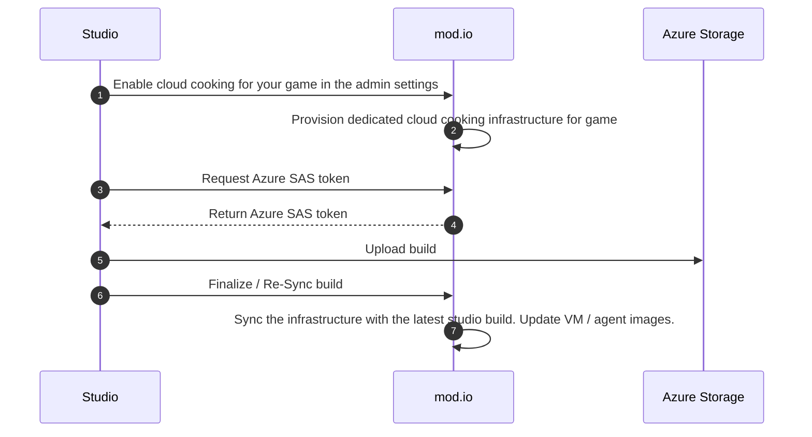

## Enabling Cloud Cooking for your game

Once Cloud Cooking has been enabled for your game, you can begin the onboarding process. To begin the onboarding process, navigate to your **Game Admin** page and select **Cloud Cooking** from the top navigation bar. Select your game engine from the dropdown, and click **Enable Cloud Cooking**. This will begin the process of provisioning the infrastructure.

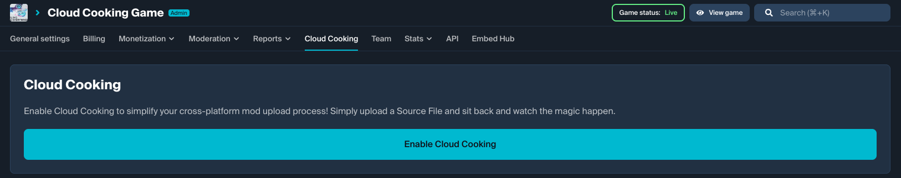

:::note
Depending on your billing agreement with mod.io, you may begin to incur monthly costs as soon as this infrastructure is provisioned.
:::

Provisioning the infrastructure takes a little bit of time. You can check back to this page later for the next step in the process, which is to upload your build.
This is a one time step to provision the core infrastructure for your game.

## Uploading your build

Once infrastructure has been provisioned, you will be presented with a prompt to upload your build to Azure Storage. This data is used to provision the virtual machine images to run the cook. What you need to provide to mod.io depends on what engine you are using - follow the appropriate game preparation guides for how to prepare your build for this step. The SAS Token provided in this step allows you to connect to the Azure Storage Container to provide your build.

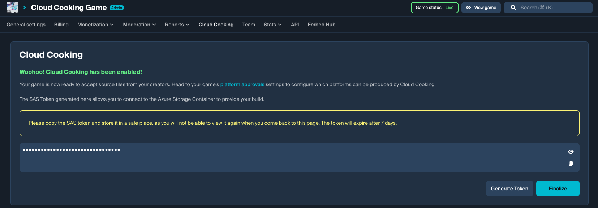

Start by downloading and installing [Azure Storage Explorer](https://azure.microsoft.com/en-us/products/storage/storage-explorer#Download-4). Once you have installed Azure Storage Explorer, select **Attach to Resource** to connect to your container.

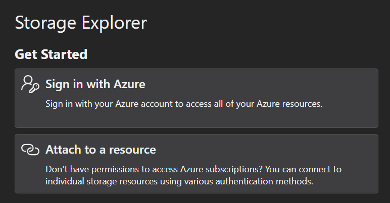

The resource you want to attach to is a Blob Container or Directory.

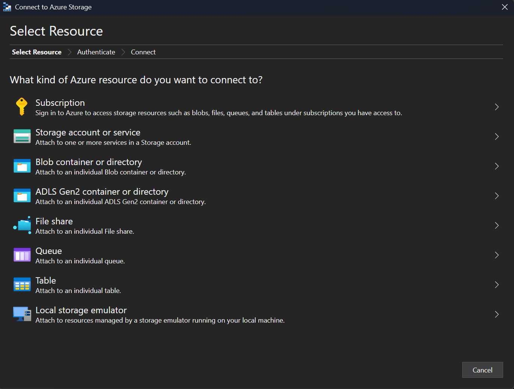

Select the option to connect using a SAS.

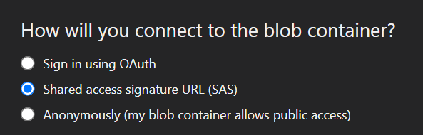

Complete the setup by entering the SAS from your Cloud Cooking page.

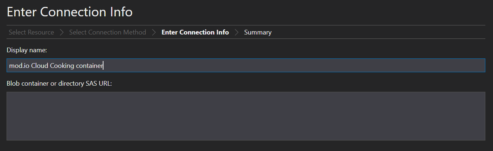

:::note
The generated SAS token is valid for 7 days. Treat this SAS like a secret.
:::

Once you have connected, you can upload your build to the available Cloud Cooking container as detailed in the Preparing Your Game section.

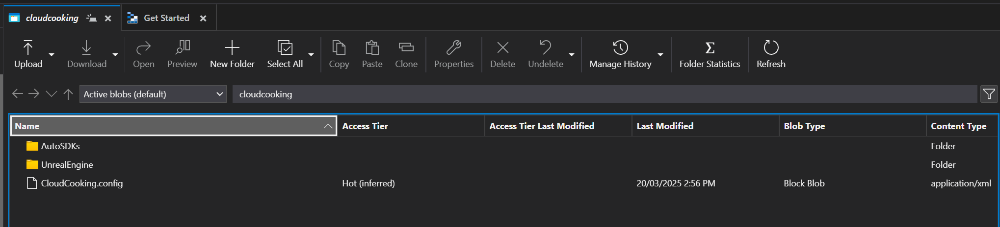

## Finalizing your build

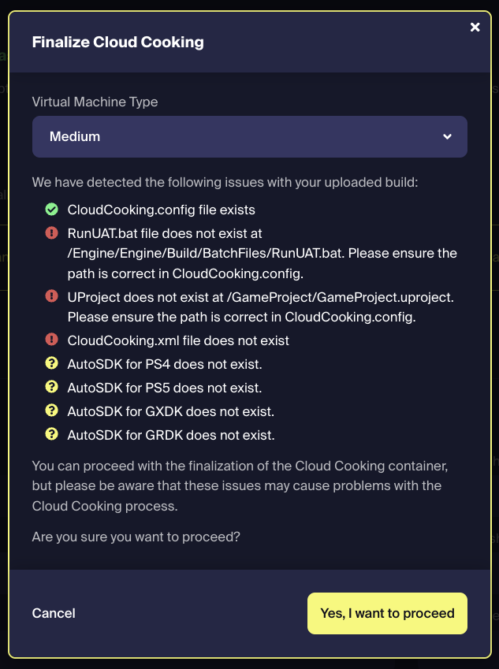

Once you have uploaded your build, click **Finalize** and you will be presented with details on your uploaded build, including any issues that were found. If there are any issues, please make sure to resolve them before proceeding.

Select the appropriate VM size, click **Yes, I want to proceed** and mod.io will generate a virtual machine image for the Cloud Cooking build agents. This can take some time, particularly if your build is large. You can return to the configuration page to verify once the imaging and provisioning process is complete and Cloud Cooking is available for use.

## Configuring Cloud Cooking platforms

Once the provisioning process has been completed, your game is now ready to accept source files from your creators. To configure which platforms can be produced by Cloud Cooking, navigate to your **Game Admin** page > **General Settings** > **Platform Approvals**.

Any platform which is **Locked** is available for creators to submit a file to for Cloud Cooking. Locked platforms cannot have content uploaded to them as part of the normal file upload flow.

As an example, the following configuration would allow content creators to upload their own files for Windows, but require PS4 and PS5 to go through the Cloud Cooking process.

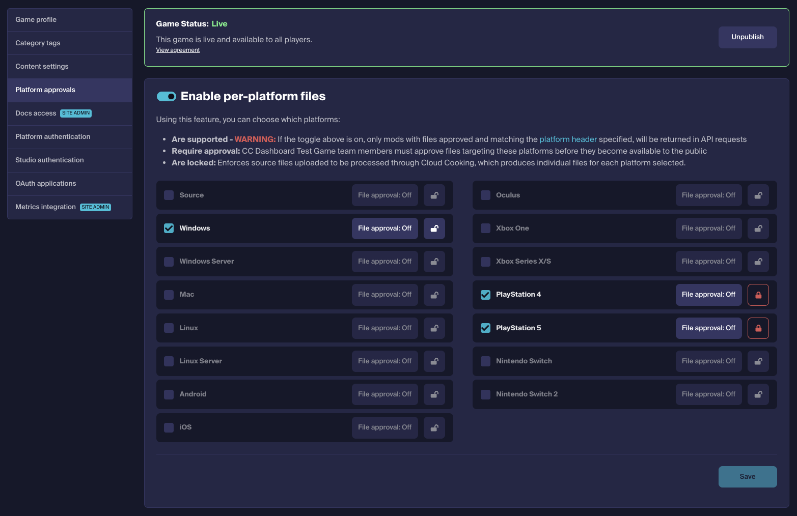

### Source file upload

Once you have enabled Cloud Cooking and locked the target platforms, content creators will be able to add files targeting those platforms in their mod's File Management page through the standard File Upload flow.

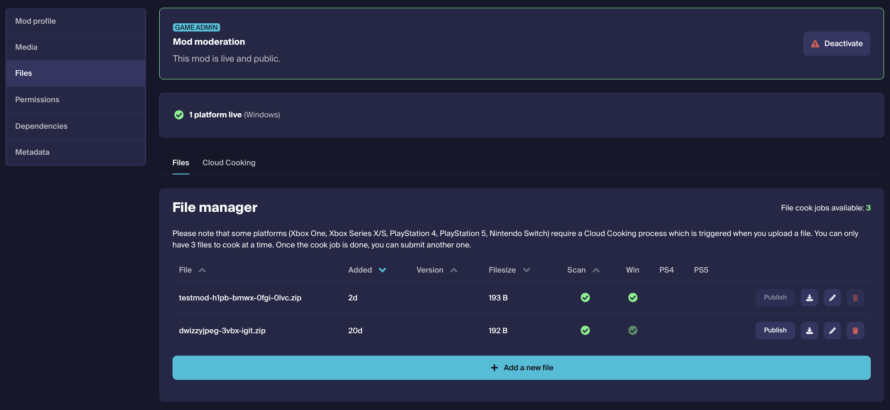

When uploading files, creators will now be given a **With Cloud Cooking** option. In this mode, all Locked platforms (the platforms intended to be targets for Cloud Cooking) are made available for selection. Any details filled in by the creator are copied to the output platform mod file as part of the Cloud Cooking process.

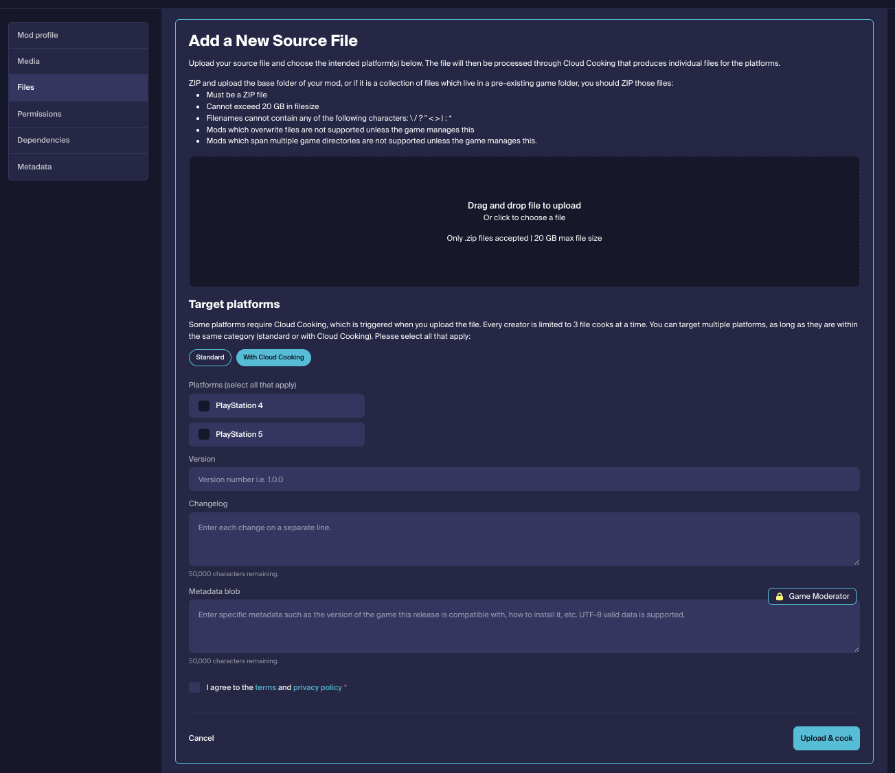

:::note
Platform files that are produced by Cloud Cooking are subject to the same scanning, approval and moderation workflows as any other file that are uploaded to mod.io.
:::

### Cloud Cooking progress and status reporting

Once a file has been queued for Cloud Cooking, content creators can view the status of their files - whether they are pending cook, in the process of being cooked, and success or failure of the cook process. Once a cook has been completed, full logs are available for viewing in the Details pane for each cook job.

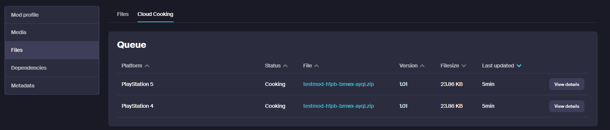

## CI integration

If you're looking to integrate the steps above into a programattic workflow, such as a CI/CD pipeline where you generate new tooling and builds to upload to the Azure Storage instance for your game, you can follow these steps.

### Step 1

Obtain a [Service Token](/authentication/s2s#obtaining-a-service-token) with the `update` scope.

```bash
curl -L -g -X POST 'https://g-{your-game-id}.modapi.io/v1/oauth/token' \
-H 'Accept: application/json' \
-H 'Content-Type: application/x-www-form-urlencoded' \
-d 'client_id=<client_id_goes_here>' \
-d 'client_secret=<client_secret_goes_here>' \
-d 'grant_type=client_credentials' \
-d 'scope=update'
```

### Step 2

[Generate an Azure SAS token](/restapi/docs/generate-cloud-cooking-sas-token) to upload your build tool to the dedicated Azure Storage for your games cloud cooking infrastructure.
Use the token generated from the proceeding step in the `Authorization` header.

```bash
curl -L -g -X POST 'https://g-{your-game-id}.modapi.io/v1/games/:game-id/cloud-cooking/sas-token' \
-H 'Accept: application/json' \
-H 'Content-Type: application/x-www-form-urlencoded' \
-H 'Authorization: Bearer <token>' \
-d 'valid_for_days=7' # must be between 1 and 365
```

### Step 3

Upload your build to Azure Storage using the token generated above, following the instructions and guidelines in [Cloud Cooking Setup Guides](/cloud-cooking#supported-enginessetup-guides)
to ensure your build provides everything required to cook a mod file.

### Step 4

Call the [Cloud Cooking Finalization Endpoint](/restapi/docs/finalize-cloud-cooking).
This endpoint should be called each time you upload new builds in order for the cook agents to reflect your changes.
This is an asynchronous operation which can take 2 hours+ (depending on engine and provisioning scripts) to create a new virtual machine image.
It will transition your games `cloud_cooking_status` to finalizing.

```bash
curl -L -g -X POST 'https://g-{your-game-id}.modapi.io/v1/games/:game-id/cloud-cooking/finalization' \
-H 'Authorization: Bearer <token>'
```

### Step 5

Configure a webhook to be notified of the success or failure of the finalize operation.
This can be found under the **Moderation** > **Automation** menu item in your game admin settings.
Add a new rule to the ruleset.
The action should be **Cloud Cooking Webhook**, it should fire a webhook, and the when condition should match the payload field as illustrated:

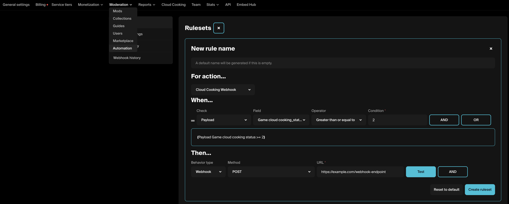

The webhook will receive a response in the following shape:

```json
{
  // Other fields will also be present on the payload.
  // Refer to our "Rules Engine" documentation for details
  "event_body": {
    "game_id": 7049,
    "workflow": "finalize",
    "status": 200 // 200 for success, 422 for failure
  }
}
```

As implied, a success of `200` indicates the finalization operation succeeded. Whereas a `422` indicates failure.

A visual representation of this flow is as follows.

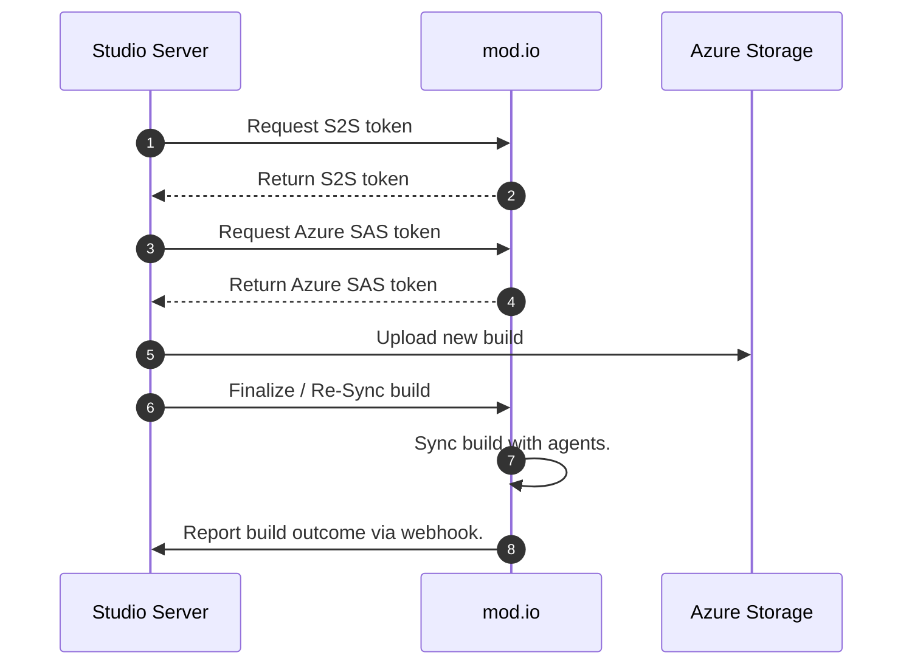
