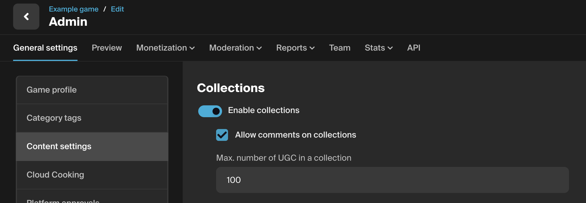
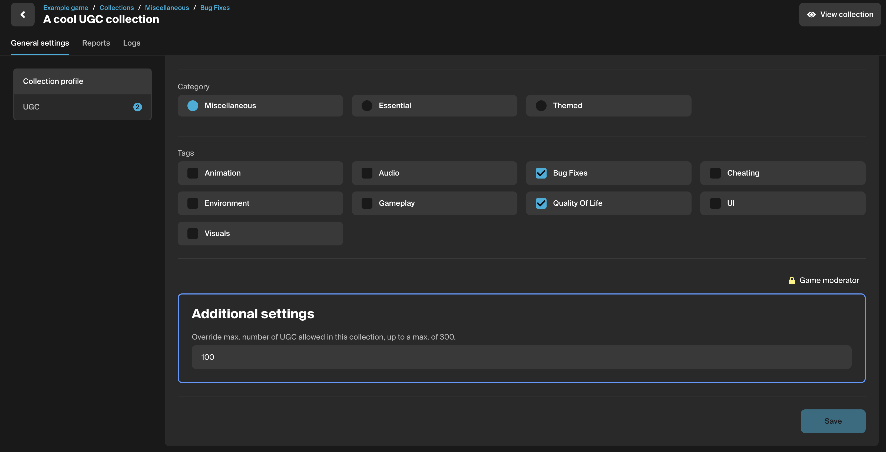

# Collections Configuration

Within your **game admin settings** (found by clicking the "Manage" button on the [My Content](https://mod.io/content) page), you can set up Collections using the Content Settings tab. 

Here, you have the ability to:

* Enable or disable collections.
* Allow or disallow comments on collections.
* Set a maximum limit for UGC items within a single collection.

## Additional settings
Users with moderation permissions for your game can allow a collection to exceed the game-wide UGC limit.
You can find the override setting for this in the collection admin dashboard via the Collection profile tab.

