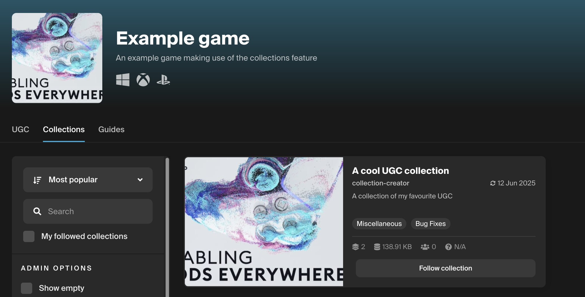
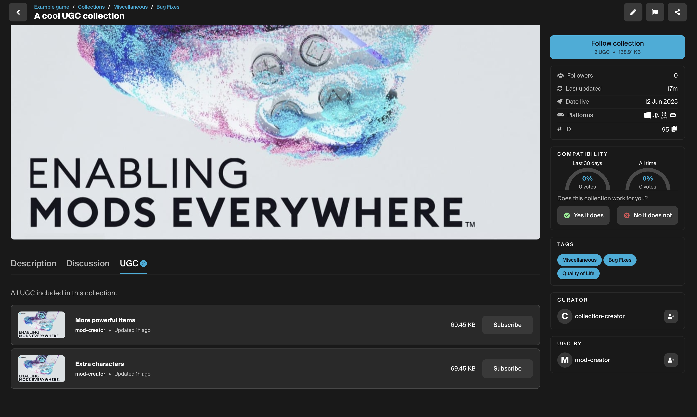

# Collections

The Collections feature allows users to curate and organize their own playlists of user-generated content (UGC) for players to discover and subscribe to. These collections are displayed on both the user's game profile and creator profile pages, making them easy to share. Users can follow a collection, and optionally subscribe to the UGC it contains. 

:::tip
Collections are a fantastic way to grow your games reach, as they allow influencers, to share their favorite combinations of UGC for their viewers and friends to play.
:::

## Features

Collections can be configured with the following settings:

* Can be enabled or disabled from the game admin content settings.
* Comments can be allowed or disallowed for collections added to your game.
* A UGC limit can be configured for your game to set a maximum limit for the number of UGC items that can be added into collections.
* The collection UGC limit can be overridden for selected collections from the collection settings dashboard. This setting is available to game administrators only, for any required special cases.

## How it works
When enabled, a Collections tab will appear on your game's mod.io profile page, allowing users to create and manage collections of UGC for your game directly on the mod.io website.

## Supported engines/setup guides

Below is a list of the supported engines and the relevant setup guides. Collections doesn't require any configuration within the engine itself. Simply head to the [Collections Configuration](/collections/configuration) guide to get started.

| Engine    | Supported | Guide |
| -------- | ------- | ------- |
| [Unreal Engine](/unreal)  | Yes    | N/A   |
| [Unity](/unity) | Yes    | N/A   |
| [Custom Engine](/cppsdk)   | Yes    | N/A   |
