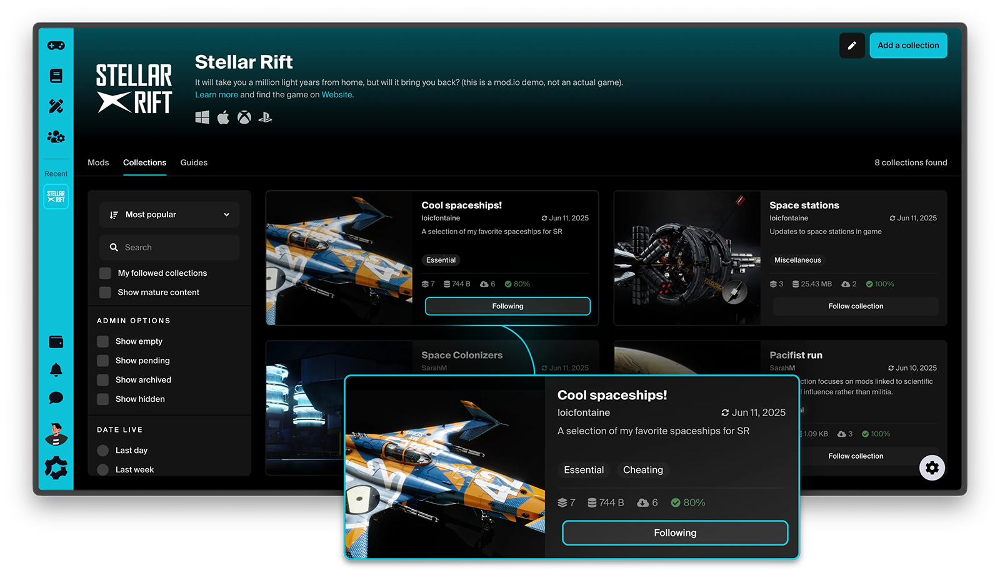
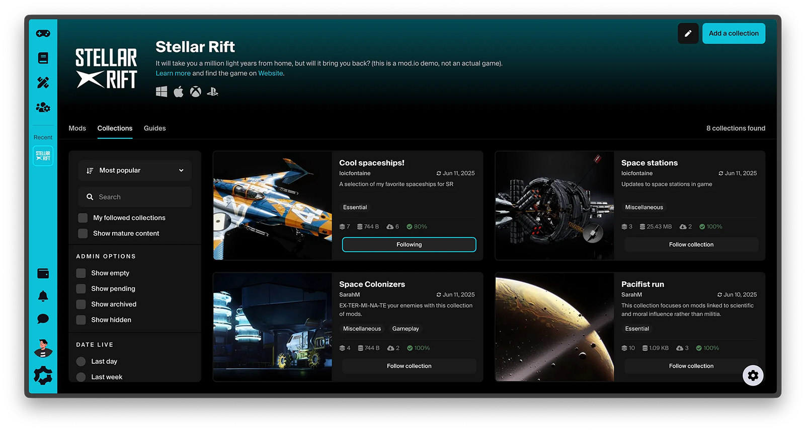
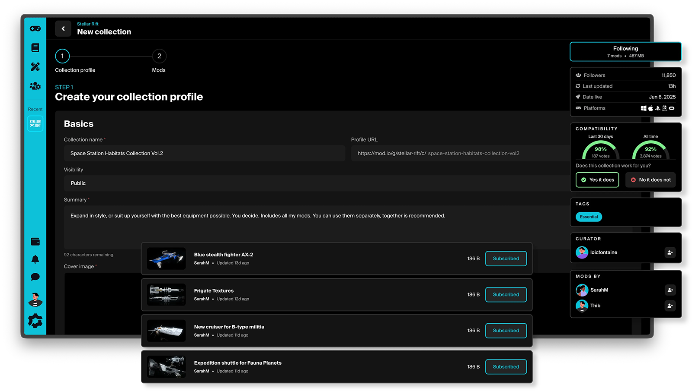
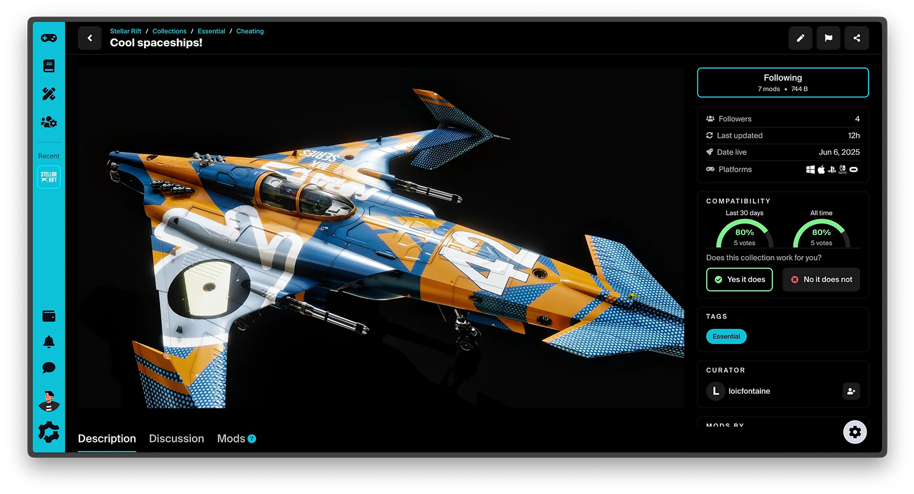

# Collections

The Collections feature allows users to curate and organize their own playlists of user-generated content (UGC) for players to discover and subscribe to. These collections are displayed on both the user's game profile and creator profile pages, making them easy to share. Users can follow a collection, and optionally subscribe to the UGC it contains. 

:::tip
Collections are a fantastic way to [grow your games reach](https://blog.mod.io/ugc-collections-18f7f5985e25), as they allow influencers, to share their favorite combinations of UGC for their viewers and friends to play.
:::

## Features

Collections can be configured with the following settings:

* Can be enabled or disabled from the game admin content settings.
* Comments can be allowed or disallowed for collections added to your game.
* A UGC limit can be configured for your game to set a maximum limit for the number of UGC items that can be added into collections.
* The collection UGC limit can be overridden for selected collections from the collection settings dashboard. This setting is available to game administrators only, for any required special cases.

## How it works
When enabled, you'll see a new Collections tab on your [game page](https://mod.io/g) where users can browse public collections and manage collections they are subscribed to via [their Library](https://mod.io/library#collections). Any user can create [their own collections](https://mod.io/content#collections) and choose to keep them hidden for their own use, or make them publicly available for others to pick them up and subscribe.

Creating a collection is pretty easy and straightforward: hit the collection button on any mod, enter a collection name, description and cover picture, then add more mods. Users can either search for content to add to their collection while editing it, or add mods to a collection on the fly while browsing any mod page.

While anyone can curate and share a collection of content, we always showcase the mods creators! When browsing a collection, you’ll see a list of the people whose content has been added to it. We also added some other practical features, such as a compatibility voting system, allowing users to confirm the compatibility between the mods that are part of a collection.

Subscribing to a collection gets you subscribed to all the mods included in it, which means next time you load in-game while logged in with your account connected to mod.io, you’ll have it automatically downloaded and installed (the exact experience may vary based on specificities of in-game integration).

## Supported engines/setup guides

Below is a list of the supported engines and the relevant setup guides. Collections doesn't require any configuration within the engine itself. Simply head to the [Collections Configuration](/collections/configuration) guide to get started.

| Engine    | Supported | Guide |
| -------- | ------- | ------- |
| [Unreal Engine](/unreal)  | Yes    | N/A   |
| [Unity](/unity) | Yes    | N/A   |
| [Custom Engine](/cppsdk)   | Yes    | N/A   |
