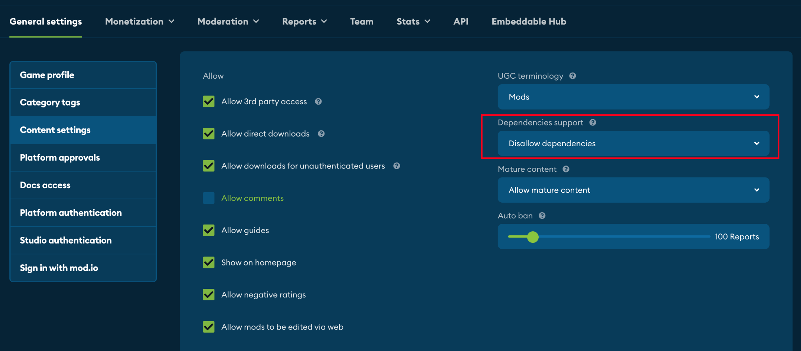
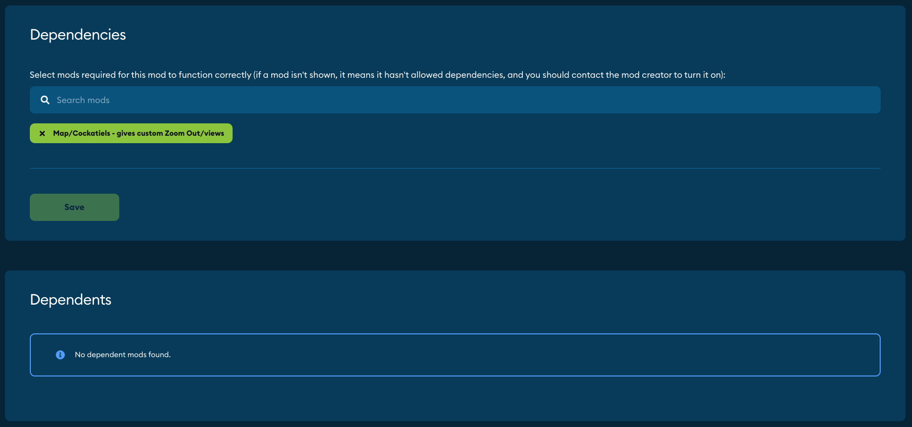

# Dependencies Configuration

## Game Dependency Settings

All games start with depenency support turned off. To enable it, go into the 'Content settings' section of the 'General settings' tab on the Game Admin dashboard. 

The 'Dependency support' dropdown has four options:

1. Disallow dependencies
1. Allow dependencies opt-in
1. Allow dependencies opt-out
1. Allow dependencies with no restrictions

These options can be changed at any time. 

#### Disallow dependencies

All games start with this setting. All UGC must be self-contained, and neither have dependents nor rely on other UGC.  

:::note
If you change to 'disallow dependencies' while UGC in your game already have dependencies, the individual settings for each UGC will not change, so you will be able to revert this change in future. However, the mod.io API will return 'no dependencies' for each UGC, overwriting the individual UGC settings for as long as this option is enabled. 
:::

#### Allow dependencies opt-in

UGC will start with dependencies disallowed, but may choose to allow other UGC to list them as a dependency. Under this setting, UGC that opts into dependencies will not be able to monetize. 

#### Allow dependencies opt-out

UGC will start with dependencies allowed, and must opt-out from allowing other UGC to list them as a dependency. Under this setting, UGC must first opt-out of dependencies before being able to monetize. 

#### Allow dependencies with no restrictions

Under this setting, UGC may always list other UGC as a dependency. No UGC may opt out - creators can never prevent other content from nominating their UGC as a dependency. Furthermore, a game cannot be monetized as long as this setting is enabled. 

:::warning
With the 'no restrictions' setting enabled, UGC *can* be deleted even if it has content depending on it. This can make that other content unusable. 
:::

## UGC Dependency Settings

If the game supports dependencies, UGC creators can manage their dependencies in their admin dashboard. 

#### Add dependencies

In the first box on this page, the UGC creator can search and add content they depend on. If another piece of content has opted out of dependencies, then it won't appear in the search. 

#### Dependents

If the Game Admin has chosen opt-in or opt-out, the second box starts with an option to allow or disallow dependents. This defaults to the appropriate option as described by the Game Dependency Settings above. If the Game Admin has chosen 'Disallow dependencies' or 'Allow dependencies with no restrictions' then the option to allow or disallow will not appear here. 

Below this, any content that depends on this UGC will also show here. 

## Dependency Endpoint

Once dependency support is enabled, our [REST API](/restapi/docs/get-mod-dependencies) and plugins can be used to query a UGC's dependencies and dependents. All dependencies of a UGC can be fetched, with an option to recursively fetch nested dependencies that each dependent UGC may also rely on.

When using the dependency support in our official plugins, when a player subscribes to UGC with dependents, they will be automatically subscribed to the required UGC. 

:::warning
We recommend using the official mod.io plugins for dependency support where possible. Recursive dependency fetching can result in players downloading multiple UGC at once, so appropriate safeguards need to ensure UGC suitability and synchronization. These safeguards are built into our plugins. 
:::