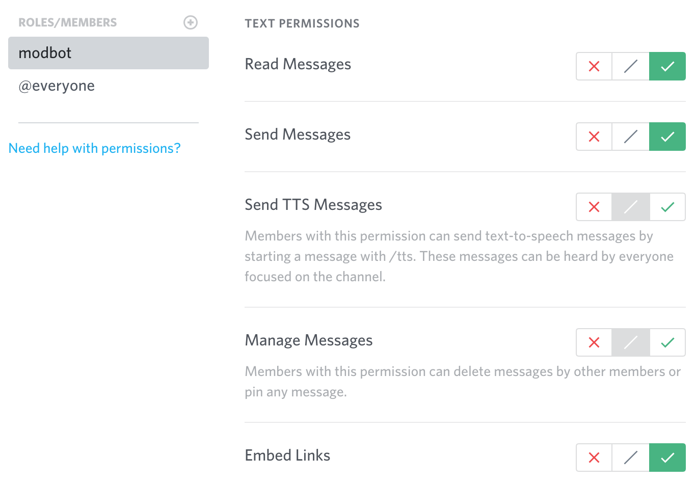

# Discord Configuration

There are two ways you can go about setting up the ModBot: you can invite the officially hosted ModBot to join your Discord server, or you can build and install your own version.

This guide covers:

* [Simple setup](#simple-setup)
* [Discord commands](#discord-commands)
* [Build and install your own](#build-and-install-your-own)
* [License](#license)

## Simple setup

1. Invite the ModBot using the following URL: https://discordbot.mod.io/.
2. View the games list <code>/games</code> and set the default game <code>/settings default-game ID</code>.
3. In the channel(s) you want the bot to post updates (mod added / edited), run the command <code>/subs add [GameID]</code>.

4. Ensure the bot has <code>Send Messages</code> and <code>Embed Links</code> permissions in the channel(s) it is in to be able to function correctly.



## Discord commands

Once you have invited ModBot to your server, you can set the default game using the command <code>/settings [defaultGameID or defaultGameName]</code>.

Now when a user issues the command <code>/mods</code>, all of the UGC for the game you specified will be returned. You can change the default game at any time.

We recommend you also apply <code>/subs add [GameID]</code> to games you are interested in receiving push notifications from. For example in our [#bot channel](https://discord.gg/QR7DGD7), we have subscribed to a bunch of games and whenever a mod is updated, the channel is notified.


Popular commands include:

* <code>/game</code> return information about the default game
* <code>/games [search]</code> return a list of all games
* <code>/mods [ID|Name]</code> return a list of all mods belonging to the default game
* <code>/popular</code>return a list of mods ordered by popularity
* <code>/settings default-game < ID|Name ></code> set the default game
* <code>/subs add [ID|Name] [Tag..] [Type]</code> subscribe to a game for updates (mods added/edited)

    *EG:*


    ```
    /sub add 51
    /sub add OpenXcom
    /sub add OpenXcom tags:"UFO Defense",Major
    /sub add "Skate XL" tags:"Real World Spot"
    /sub add Skate* tags:Gear,Deck
    ```

* <code>/subs list</code> see all games subscribed too
* <code>/subs rm < ID|Name > [Tag..] [Type]</code> unsubscribe from a game

    *EG:*

    ```
    /subs rm 51
    /subs rm OpenXcom
    /subs rm OpenXcom tags:"UFO Defense",Major
    /subs rm "Skate XL" tags:"Real World Spot"
    /subs rm skate tags:Gear,Deck
    ```

* <code>/subs mods mute < Game > < Mod ></code> mute a mod from update notifications
* <code>/subs mods muted</code> return a list of all muted mods
* <code>/subs mods unmute < Game > < Mod ></code> unmute a mod from update notifications 

## Build and install your own

### Building

ModBot is written in Rust, so you'll need to grab a [Rust installation](https://www.rust-lang.org/tools/install) in order to compile it. 

Building is easy from the [Github repo](https://github.com/nickelc/modio-bot):

```
$ git clone https://github.com/nickelc/modio-bot
$ cd modio-bot
$ cargo build --release
$ ./target/release/modbot
```

#### Building with bundled sqlite3

Use the feature <code>sqlite-bundled</code> to compile sqlite3 from source and link against that.

```
$ cargo build --features sqlite-bundled
```

### Installation

You can install the latest version from https://crates.io.

```
$ cargo install modbot
$ $HOME/.cargo/bin/modbot
```

Install modbot from the <code>master</code> branch.

```
$ cargo install --git https://github.com/nickelc/modio-bot
$ $HOME/.cargo/bin/modbot
```

### Usage

Create a <code>bot.toml</code> config file in the working directory.

```
[bot]
token="your discord bot token"
database_url="/path/to/sqlite.db"

[modio]
api_key="your mod.io api key"
```

An example is provided as <code>bot.example.toml</code>.

#### Running the bot

```
./path/to/modbot

./path/to/modbot --config path/to/bot.toml
```

#### Logging

Logging can be configured via environment variables.

```
RUST_LOG=modio=debug,modbot=debug
```

#### Metrics

By default, the metrics are exposed via Prometheus endpoint listing on <code>http://127.0.0.1:8080/metrics</code>.

```
[metrics]
addr = "127.0.0.1:3000"
```

## License

Licensed under either of

* Apache License, Version 2.0 ([LICENSE-APACHE](https://github.com/modio/modio-discord-bot/blob/master/LICENSE-APACHE) or http://apache.org/licenses/LICENSE-2.0)
* MIT license ([LICENSE-MIT](https://github.com/modio/modio-discord-bot/blob/master/LICENSE-MIT) or http://opensource.org/licenses/MIT)

### Contribution

Unless you explicitly state otherwise, any contribution intentionally submitted for inclusion in the work by you, as defined in the Apache-2.0 license, shall be dual licensed as above, without any additional terms or conditions.