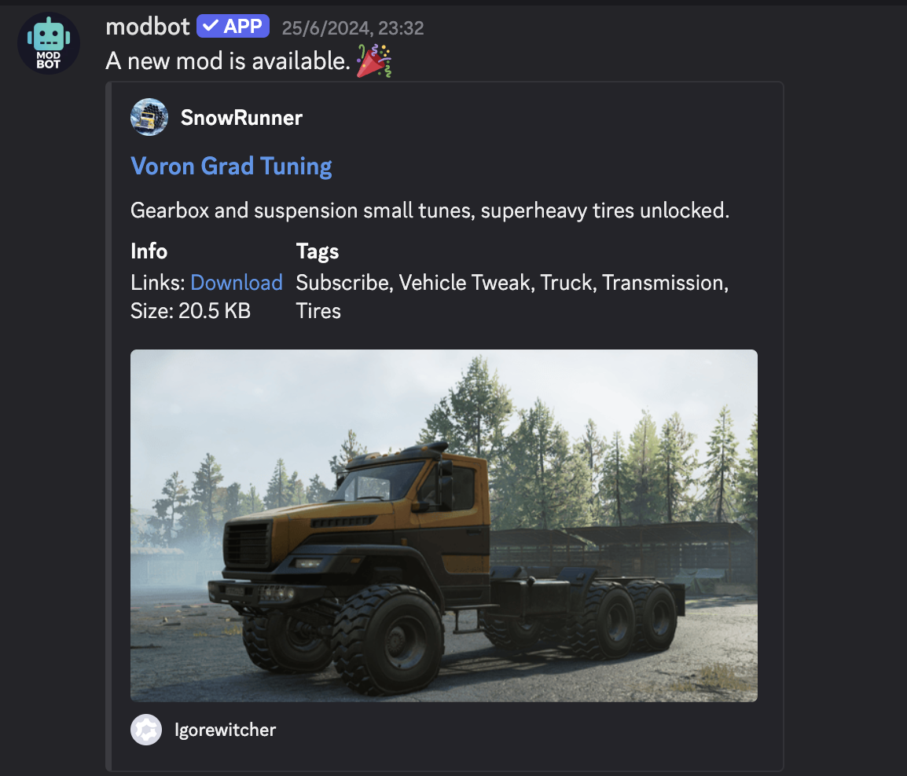
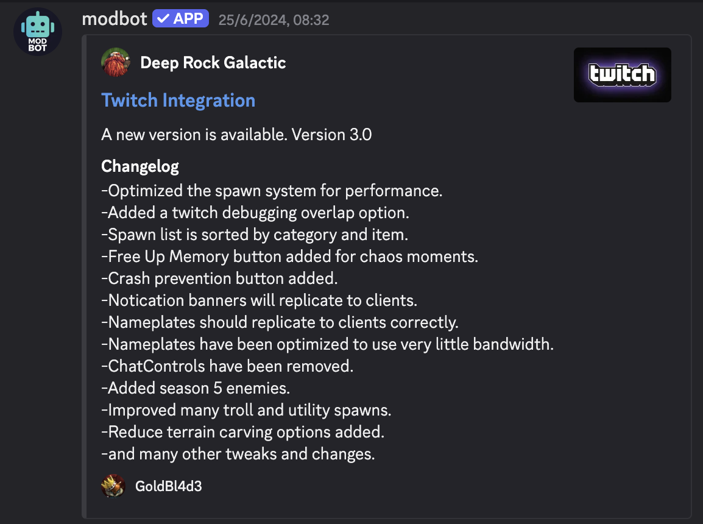

# ModBot for Discord

ModBot is a Discord bot for mod.io using [modio-rs](https://github.com/nickelc/modio-rs) and [twilight](https://github.com/twilight-rs/twilight). By adding ModBot to your Discord server, your community will be automatically notified whenever new UGC goes live.

You can follow the instructions to [invite ModBot](/discord/configuration) to your Discord Server, or you can fork and self-host the Discord bot via the [GitHub Repo](https://github.com/modio/modio-discord-bot).

If you are interested in learning more about the Discord bot, you can join the [ModBot Discord Channel](https://discord.gg/XNX9665). For all questions about using mod.io in your game, join the [official mod.io Discord channel](https://discord.mod.io).

## ModBot examples

ModBot has a variety of functions that can be called in Discord. Below are a few examples of ModBot in action.

### New UGC notification

Modbot can notify users when new UGC has been created. 

### UGC updates

ModBot can be used to notify users when existing UGC has been updated.

