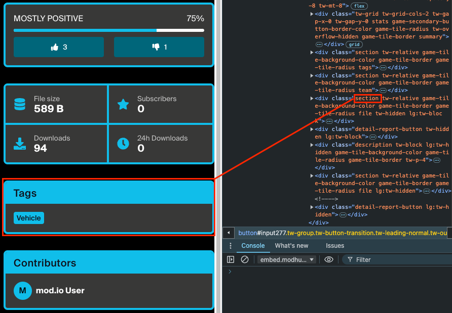

# Custom CSS

If the style and settings options in the previous sections are insufficient, you can directly override Embed Hub's CSS for even more control over your site's look and feel. Using this feature you can create [highly stylized UI's](/embed-hub#on-the-web) such as the Baldur's Gate 3 example.

Embed Hub provides various semantic class names to assist in applying style to common elements on the page. These are detailed below. Alternatively, you can use your browser's developer tools to inspect the element you wish to style and look for an appropriate class name.



Don't forget that you can preview your customizations immediately using the preview button at the bottom of each tab.

:::note
If your game is not live, the _'Visible when game is hidden'_ checkbox on the [settings page](/embed-hub/settings) must be checked.
:::

## CSS classes
```
.avatar
.base-button-icon
.basics-form
.browse
.buttons
.comment
.comments
.container
.content
.contributor
.credits-form
.date-icon
.dependencies-form
.dependencies
.dependency-subscribe-button
.description
.detail-report-button
.detail-subscribe-button
.detail-thumbs-down-button
.detail-thumbs-up-button
.detail-thumbs-up-icon
.file-divider
.file
.files-form
.filters
.gallery-image
.game-tile-grid
.game-tile-image
.game-tile-subscribe-button
.hero-image
.library
.loading-modal
.login-email-modal
.login-options-modal
.media-form
.modal-close-button
.navbar
.one-quarter-column
.online-icon
.popup
.rating-bar
.releases-content
.releases-link
.releases-previous-button
.section
.statbox
.stats
.steps
.summary
.tab
.tags-form
.tags
.team-member-badge
.team
.three-quarter-column
.tile-author
.tile-guide-stats
.tile-mod-stats
.tile-summary
.tile-tag-list
.tile-tag
.tile-title
.tile-updated-date
.tile
.tooltip
.user-navbar
```
