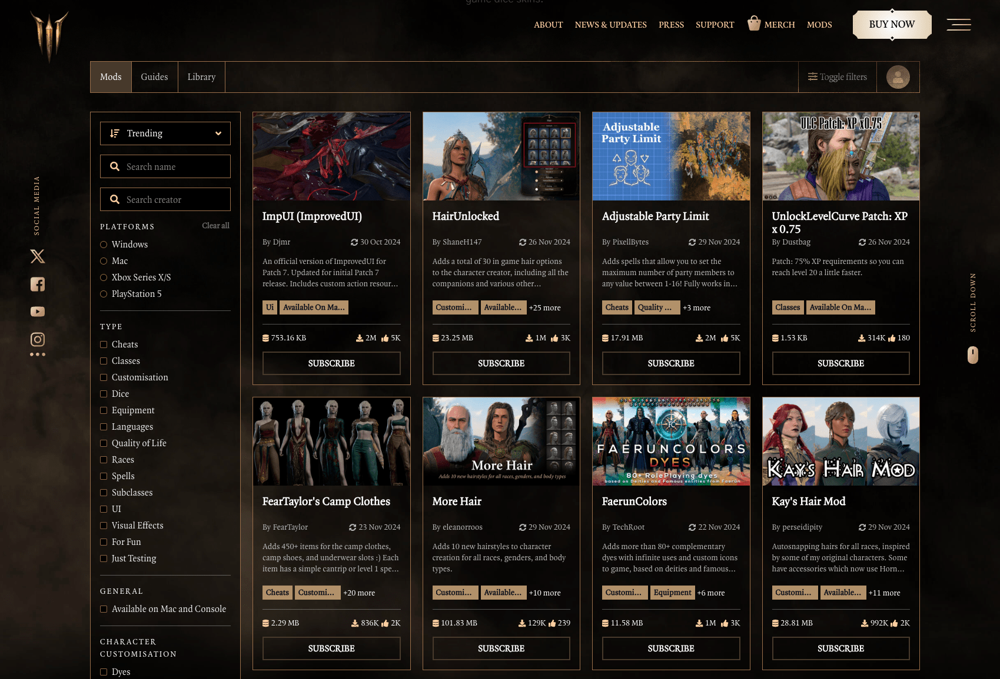

# Embed Hub

Embed Hub gives you the ability to embed the [mod.io](https://mod.io/) browser into your site, launcher or game. It is highly customizable, offering many style options and control over which features are enabled or disabled.

:::note[Premium Feature]
Embed Hub is a premium feature. If you are interested in mod.io premium features, please contact developers@mod.io.
:::

## Setup

Once you've gained access to Embed Hub, you'll find the settings in your game's Admin Dashboard. When you navigate to the page, you'll be prompted to set up a hub which takes a few minutes:

1. Name your hub and [configure the theme](/embed-hub/theme).
2. Adjust hub layout, enabled features and authentication method [via settings](/embed-hub/settings).
3. Make advanced changes by setting [custom CSS](/embed-hub/custom-css)
4. Copy the embed code or URL to [deploy Embed Hub](/embed-hub/deployment).
5. Optional advanced features can be achieved by [communicating with Embed Hub](/embed-hub/communication).

You can preview your hub at any time during the set up process. You can also create multiple hubs, if you want different designs for use in-game, on your homepage, corporate site, and launcher.

:::info[Customization]
The mod.io team can be engaged to design Embed Hub to match your homepage or style guide, and assist with advanced features such as SSO (single-sign on) support using your account system. If you are interested in support, please contact developers@mod.io.
:::

## Demonstration

### On the web

You can see a live example of Embed Hub running on the [Baldur's Gate 3](https://baldursgate3.game/mods#/) official homepage. It shows the level of customization possible, to match the look and feel of the Baldur's Gate 3 site, and also uses Larian Accounts to sign in.

Another example is [Anno 1800](https://www.anno-union.com/mods/), a Ubisoft game.

### Embedded in-game

Embed Hub can also be used as an in-game UI or overlay for browsing and managing a user's UGC collection. The [Javascript API](/embed-hub/communication#javascript-api) can be used to communicate between the game client and the web UI. The Anno 1800 team also used Embed Hub as their in-game UI, embedding it natively using the [Ultralight](https://ultralig.ht) plugin, an HTML renderer. You can view the hub in your [browser here](https://anno1800.modhub.io/) and see how it looks in-game in the video below.

<video width="100%" height="auto" controls poster="/video/embed_hub_demo_anno_1800_poster.jpg">
  <source src="/video/embed_hub_demo_anno_1800.mp4" type="video/mp4" />
</video>

## Supported engines/setup guides

Below is a list of the supported engines and the relevant setup guides. Embed Hub as a web browser is available for all games. Embedding the hub in the game itself has different requirements depending on the engine. Contact us at developers@mod.io to learn more.

| Engine    | Supported | Guide |
| -------- | ------- | ------- |
| [Unreal Engine](/unreal)  | Yes    | N/A   |
| [Unity](/unity) | Yes    | N/A   |
| [Custom Engine](/cppsdk)   | Yes    | N/A   |
