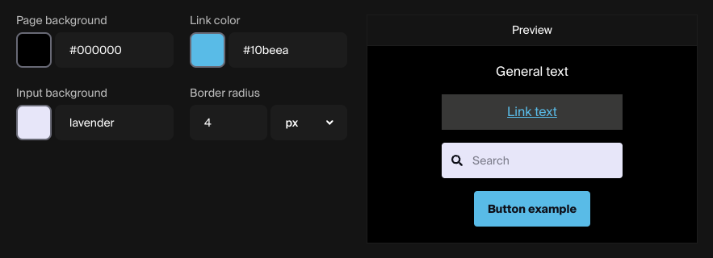
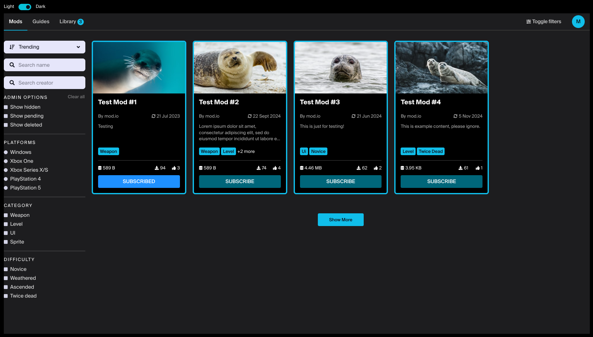

# Theme

Modifying Embed Hub's theme is easy. Simply adjust the different inputs and preview the changes in real-time to the side.

## Colors

You can select the colors you want by clicking on the colored box to bring up a selector and dropper or, by entering any valid CSS color into the input box. Valid CSS colors include hex, RGB/RGBA and HTML colors such as 'red' or even 'transparent'.

### Hover states

The buttons in the preview section can be hovered to see their hover state. If a hover color input is left empty, a suitable color will be chosen from the main color.

## Border width & radius

To modify button and tile's border width and radius, enter a number into the first input field and then select a unit of measurement from the dropdown.

## Preview

In addition to the preview boxes to the right of each section, there is a button at the bottom of the form to preview the entire Embed Hub site as it would appear with the current settings.

:::note
If you are creating a new Embed Hub, your changes must be saved at least once in order to use the preview button. Additionally, if your game is not live, the _'Visible when game is hidden'_ checkbox on the [settings page](/embed-hub/settings) must be checked.
:::

