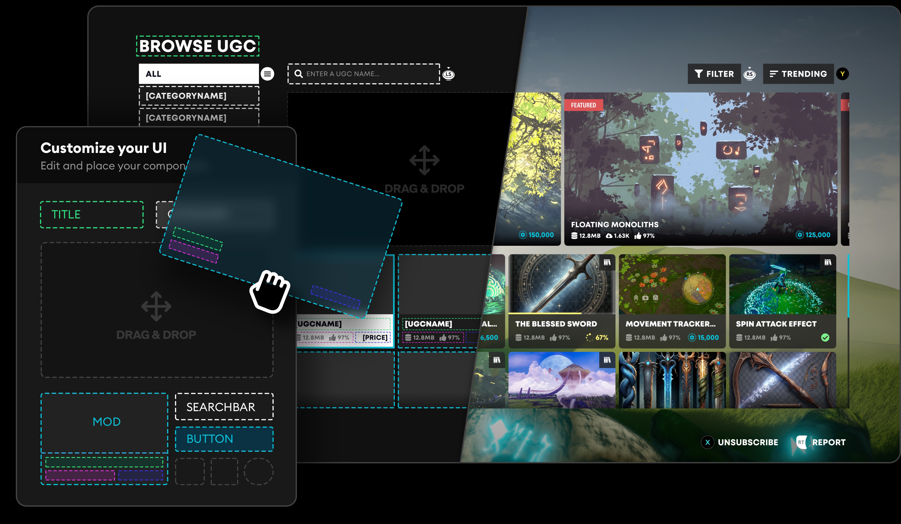

# In-Game User Interface

We offer a variety of UI solutions for both our **Unity** and **Unreal Engine** plugins. Whether you are interested in building a custom experience that natively adheres to your game's brand, or require an instant solution to get UGC into your user's hands, the below options are designed to get your game looking and feeling just right.

  <SimpleCard
    shadow="tl"
    title="Component UI"
    image="/img/icon_cui.svg"
    text="A UI framework that gives you complete control over your UI implementation, allowing you to create a white label system that perfectly suits your game."
    moreLink="/in-game-ui/component"
  />
    <SimpleCard
    shadow="tl"
    title="Template UI"
    image="/img/icon_tui.svg"
    text="A ready-made UGC browser built using Component UI. It can be used as a functional template  or as a reference for implementing your own UI."
    moreLink="/in-game-ui/template"
  />

:::tip[Embed Hub]
For a streamlined browser experience, [Embed Hub](/embed-hub) is a premium feature that enables your studio to embed the mod.io browser into your site, launcher or game.
:::