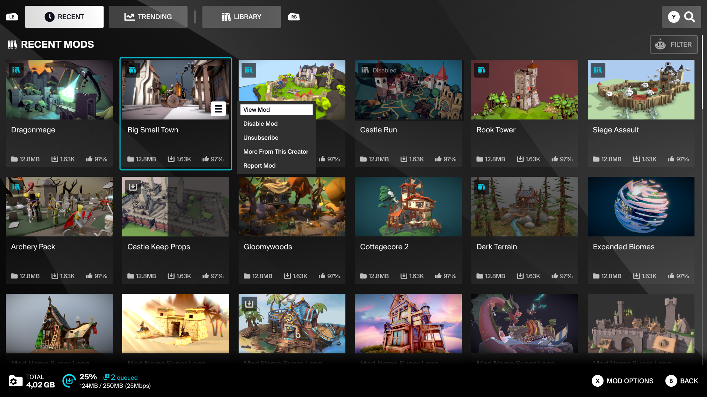

# Template UI

Template UI is a fully featured in-game UGC browser that's built using Component UI.

## Pre-built UGC browser for mod.io plugins 

Template UI is designed to be a user-friendly interface that can handle all the base functions required from a UGC browser for console and PC. Its visual design is clean and minimal, and can be customized and tweaked to suit your needs. 

It serves two main purposes: 

1. It can be used as a functional template right off the shelf if you are looking for a ready-made solution. 
2. It can act as a reference for when you are implementing components into their own UI.

:::note[Component UI]
For complete control over your UI implementation, check out **[Component UI](/in-game-ui/component)**.
:::

## Supported engines/setup guides

Below is a list of the supported engines and the relevant setup guides.

| Engine    | Supported | Guide |
| -------- | ------- | ------- |
| [Unreal Engine](/unreal)  | Yes    | [Documentation](/unreal/template-ui)   |
| [Unity](/unity) | Yes    | [Documentation](/unity/template-ui)   |
| [Custom Engine](/cppsdk)   | No    | N/A   |
