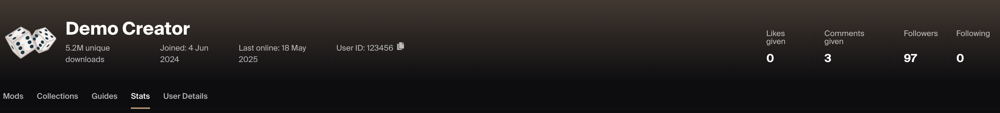
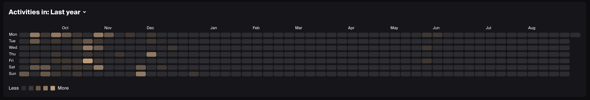
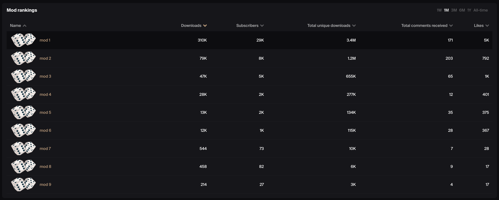

# Creator Dashboard

The Creator Dashboard provides an at-a-glance summary of an individual creator’s impact across the UGC ecosystem. It consolidates engagement, content output, and audience reach into a single view.

## Definitions

### Downloads

**What it measures**  
The total number of times UGC files are downloaded. 

**How it's measured**  
Download events are recorded whenever a file is downloaded, regardless of whether the user is authenticated or not.

**Deduplication**  
To avoid inflating totals from repeated requests, events are deduplicated on a 24-hour period based on the combination of:

* User IP  
* UGC ID  
* Platform

This ensures that repeated downloads of the same file by the same user on the same platform within 24 hours count only once.

### Subscriptions

**What it measures**  
The net number of subscriptions to UGC, reflecting both subscribing and unsubscribing. Positive values indicate growth (more subscribing than unsubscribing); negative values indicate decline.

**How it's measured**  
Subscription movement is recorded whenever a player subscribes or unsubscribes.

### UGC Comments

**What it measures**  
The total number of comments posted on UGC by users.

### Likes Received

**What it measures**  
The total number of likes received across all of a creator’s UGC. Also shows the creator’s average mod rating (%).

### Likes Given

**What it measures**  
The total number of likes a creator has given to other UGC.

### Comments Given

**What it measures**  
The total number of comments a creator has posted on other UGC.

### Followers

**What it measures**  
The total number of users following the creator’s profile.

### Following

**What it measures**  
The total number of other users this creator is following.

## Insights

### Activity Timeline

Heatmap of creator activity over the past 12 months.

* Each square represents a day, with color intensity reflecting how active the creator was.
* Activity includes publishing new UGC, making updates, or uploading files.
* The default view shows activity over the past 12 months, but you can also switch to specific calendar years for a broader historical view.
* Useful for spotting patterns in consistency, active streaks, and quieter periods.
* Helps identify long-term trends in creator productivity and engagement cycles.

### Item Rankings

Table of the creator’s published UGC ranked by performance.

* Shows downloads, subscribers, unique downloads, comments received, and rating %.  
* Allows comparison across all UGC to identify top-performing mods.  
* Highlights breakout content versus UGC with low engagement.  
* Useful for evaluating creator impact, content quality, and audience reception.

### Download Locations

Interactive world map showing downloads by country or continent.

* Accompanied by a table view with exact counts and percentages.  
* Can be viewed across different time periods (1W, 1M, 3M, 6M, 1Y, All-time).  
* Useful for understanding regional adoption patterns and audience distribution.
