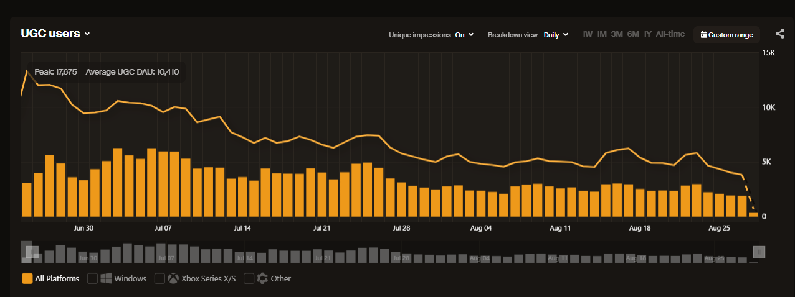

# Game Dashboard

Game studios have access to a suite of interactive dashboards that deliver end-to-end visibility into their UGC ecosystem. These dashboards make it simple to track performance, understand player behavior, and monitor platform health.

Together, they provide a comprehensive view of creation, engagement, and player activity, helping studios spot trends, address issues, and optimize their UGC strategy.

Your game's data is available directly on mod.io dashboards. To access them:

* Click the ‘Stats’ icon at the top-right of your game page on the mod.io website, or
* Go to https://mod.io/g/gamename/admin/stats, replacing gamename with your game’s name.

By default, you’ll first see the UGC Dashboard, and you can switch to other dashboards using the ‘Stats’ dropdown in the game admin menu.

## UGC Metrics

Measure downloads, subscriptions, UGC creation, updates, files added, and bandwidth consumption, with deep dives into top UGC, top creators, and regional adoption.

### Definitions

Below is a breakdown of how each metric is measured, collected, and transformed.

#### Downloads

**What it measures**  
The total number of times UGC files are downloaded. 

**How it's measured**  
Download events are recorded whenever a file is downloaded, regardless of whether the user is authenticated or not.

**Deduplication**  
To avoid inflating totals from repeated requests, events are deduplicated on a 24-hour period based on the combination of:

* User IP  
* UGC ID  
* Platform

This ensures that repeated downloads of the same file by the same user on the same platform within 24 hours count only once.

#### Subscriptions

**What it measures**  
The net number of subscriptions to UGC, reflecting both new subscriptions and unsubscriptions. Positive values indicate growth (more subscribing than unsubscribing); negative values indicate decline.

**How it's measured**  
Subscription movement is recorded whenever a player subscribes or unsubscribes.

**Deduplication**  
No deduplication is applied. Each successful subscribe or unsubscribe action is counted individually.

#### UGC Added 

**What it measures**  
The total number of new UGC created by creators. Each entry represents a brand-new UGC published into the ecosystem.

**How it's measured**  
An event is recorded whenever a creator creates a UGC.

#### UGC Updated

**What it measures**  
The total number of updates made to existing UGC.

**How it's measured**  
An event is recorded whenever a creator publishes an update to an already existing UGC.

#### Files Added

**What it measures**  
The total number of new files uploaded across all UGC.

**How it's measured**  
An event is recorded whenever a creator uploads a new file to a UGC.

#### Bandwidth

**What it measures**  
The total amount of data transferred from mod.io servers to users as part of file downloads.

**How it's measured**  
Bandwidth usage is recorded at the network level for every file download request. For each event, the download count is multiplied by the file size to calculate the volume of data transferred.

**Transformation**  
 Results are aggregated into time buckets (daily or monthly) and converted into terabytes (TB) for readability. This metric represents the total traffic consumed, not the number of downloads.

### Insights

#### Top Creators

Leaderboard of the most active creators, ranked by UGC created and downloaded.

* Shows creator name, number of UGC created, and total downloads.  
* Includes rank movement indicators to highlight emerging or declining creators.  
* Can be viewed across different time periods (1W, 1M, 3M, 6M, 1Y, All-time).  
* Supports filtering by platform, category, and tag, allowing focused analysis of specific creator segments.

:::note[Premium Feature]
Filtering UGC Metrics by Category and Tag is a premium feature. Sign up to one of our [advanced service tiers](https://mod.io/pricing) which includes [Play Sessions](/metrics/game#play-sessions) to activate detailed data analytics, or contact us at developers@mod.io for more information.
:::

#### Top UGC

Leaderboard of the most downloaded UGC within the selected range.

* Shows rank, UGC name, and total downloads.  
* Includes rank movement indicators to highlight new entries, climbs, or drops.  
* Can be viewed across different time periods (1W, 1M, 3M, 6M, 1Y, All-time).  
* Supports filtering by platform, category, and tag to refine results by audience or content type.

:::note[Premium Feature]
Filtering UGC Metrics by Category and Tag is a premium feature. Sign up to one of our [advanced service tiers](https://mod.io/pricing) which includes [Play Sessions](/metrics/game#play-sessions) to activate detailed data analytics, or contact us at developers@mod.io for more information.
:::

#### Locations

Interactive world map showing downloads by country or continent.

* Accompanied by a table view with exact counts and percentages.  
* Can be viewed across different time periods (1W, 1M, 3M, 6M, 1Y, All-time).  
* Useful for understanding regional adoption patterns and audience distribution.

## User Activity Metrics

Monitor UGC users, comments, guide engagement, and creator growth, with segmentation by logged-in vs. anonymous users and geographic breakdowns.

### Definitions

#### UGC MAU

**What it measures**  
The number of unique users for the current and previous month. 

**How it's measured**  
An UGC user is defined as anyone performing a qualifying action such as downloading, subscribing, rating, or commenting on a UGC.

**Deduplication**  
Events are deduplicated on a 24-hour rolling period based on the combination of:

* User IP  
* UGC ID  
* Platform

#### UGC Users

**What it measures**  
The number of unique users within the game's UGC ecosystem. 

**How it's measured**  
An UGC user is defined as anyone performing a qualifying action such as downloading, subscribing, rating, or commenting on a UGC.

**Deduplication**  
Events are deduplicated on a 24-hour rolling period based on the combination of:

* User IP  
* UGC ID  
* Platform

This ensures that multiple interactions by the same user with the same UGC on the same platform within a day count only once toward UGC user totals.

#### Impressions

**What it measures**  
The number of unique users who have received information or interacted with a game’s UGC via the mod.io API. This includes both:

* Exposure events such as visiting a game profile, browsing mod lists, or viewing mod details.  
* Engagement events also used in UGC Users (e.g., downloading, subscribing, rating, or commenting).

**How it's measured**  
 An impression is recorded whenever a user’s client makes a qualifying API request that returns UGC-related information for a game. This includes endpoints that power browsing experiences as well as those that log direct user interactions.

**Deduplication**  
Events are deduplicated on a 24-hour rolling period based on the combination of:

* User IP  
* UGC ID  
* Platform

This ensures that repeated impressions of the same UGC by the same user on the same platform within a single day are counted only once toward impression totals.

#### UGC Comments

**What it measures**  
The total number of comments posted on UGC by users.

**How it's measured**  
An event is recorded whenever a user submits a comment on a UGC.

#### Guide Comments

**What it measures**  
The total number of comments posted on guides by users.

**How it's measured**  
An event is recorded whenever a user submits a comment on a guide.

#### Creators Joined

**What it measures**  
The number of new creators recorded for the game, measured when they publish their first UGC in that game.

**How it's measured**  
 An event is triggered when a user creates their first UGC, establishing them as a creator.

**Deduplication**  
Each creator is counted once, at the time of their first published UGC.

### Insights

#### UGC User Locations

Interactive world map showing subscriptions by country or continent.

* Accompanied by a table view with exact counts and percentages.  
* Can be viewed across different time periods (1W, 1M, 3M, 6M, 1Y, All-time).  
* Useful for understanding regional adoption patterns and audience distribution.

#### Timeseries Graph Impressions Trendline

An impressions trend line is overlaid on the UGC Users timeseries graph, allowing you to compare audience exposure (impressions) with direct engagement (UGC users).

#### Unique Impressions vs. UGC Users

The graph overlays these metrics, stacking logged-in and anonymous impressions with a UGC user trend line, making it easy to compare overall reach against actual engagement.

## Health Metrics

Monitor the integrity of the ecosystem through UGC and user reports, report resolution, and deletions, with filters for report categories (e.g., DMCA, stolen content, inappropriate content).

### Definitions

#### UGC Reports Opened

**What it measures**  
The total number of reports submitted against UGC by users (e.g., DMCA claims, not working, stolen content, inappropriate content).

**How it's measured**  
An event is logged whenever a user submits a report against a UGC.

#### UGC Reports Closed

**What it measures**  
The number of UGC reports that have been reviewed and resolved (closed) by moderators or automated systems.

**How it's measured**  
An event is recorded whenever a previously opened report is marked as closed, regardless of the resolution outcome.

#### UGC Deleted

**What it measures**  
The total number of UGC permanently removed from mod.io.

**How it's measured**  
An event is recorded whenever a UGC is deleted, whether by the creator, a game admin, or automated enforcement.

#### User Reports Opened

**What it measures**  
The number of reports submitted against users, such as abuse, harassment, or other policy violations.

**How it's measured**  
An event is logged whenever a user or moderator submits a report against another user.

## Play Sessions

Gain insights into real play behavior, including concurrent players, sessions, playtime, and UGC usage per session, with breakdowns by session length, platform, and most played UGC.

:::note[Premium Feature]
Play Sessions is a premium feature. Sign up to one of our [advanced service tiers](https://mod.io/pricing) to activate detailed data analytics, or contact us at developers@mod.io for more information.
:::

### Definitions

#### Concurrent Players

**What it measures**  
The number of players simultaneously active in play sessions at a given point in time.

**How it's measured**  
Concurrent player counts are recorded continuously from live session data. A player is considered “online” if they have been active within the last 30 minutes, across any supported platform.

**Deduplication**  
Each player is counted once per measurement interval, regardless of how much UGC they are playing.

#### Concurrent UGC

**What it measures**  
The number of unique UGC being actively played in sessions at a given point in time.

**How it's measured**  
Concurrent UGC counts are recorded continuously from live session data. A UGC is considered “active” if it is being played in at least one session within the last 30 minutes, across any supported platform.

**Deduplication**  
Each UGC is counted once per measurement interval, even if multiple players are running it simultaneously.

#### Total Sessions

**What it measures**  
The total number of play sessions started during the selected time period.

**How it's measured**  
An event is recorded each time a player launches a session with one or more UGC enabled.

#### Total Players

**What it measures**  
The number of unique players who started at least one play session during the selected period.

**How it's measured**  
Logged whenever a player launches their first session in the period.

**Deduplication**  
Each player is counted once per time bucket, regardless of how many sessions they play.

#### Playtime per Session

**What it measures**  
The average duration of a play session, showing how long players typically remain engaged.

**How it's measured**  
Measured from session start to end across all platforms.

#### UGC Played per Session

**What it measures**  
The average number of UGC active in each play session.

**How it's measured**  
Recorded whenever a session starts, capturing the total number of UGC enabled for that playthrough.

### Insights

#### Play Sessions Length

Breakdown of sessions by duration within the selected range.

* Groups play sessions into time brackets (0–5 mins, 5–30 mins, 30–60 mins, 1–2 hrs, 2+ hrs).  
* Shows the distribution of playtime lengths to understand how long players typically stay engaged.  
* Useful for identifying quick drop-offs vs. long-term engagement.

#### What Platforms Are Players On?

Distribution of total playtime across platforms.

* Shows which platforms (e.g., Windows, Mac, PlayStation, Xbox, Switch, Other) players are using.  
* Reports share of playtime and total minutes played by platform.  
* Helps studios understand audience platform preferences and optimise support accordingly.

#### Most Played Mods

Leaderboard of the mods with the highest playtime during the selected range.

* Shows rank, mod name, and total playtime.  
* Includes rank movement indicators to highlight new entries, climbs, or drops.  
* Can be viewed across different time periods (1W, 1M, 3M, 6M, 1Y, All-time).  
* Supports filtering by platform to reveal platform-specific favorites.

#### Top Creators by Playtime Generated

Leaderboard of creators ranked by the total playtime generated by their mods.

* Shows creator name, total playtime, and ranking.  
* Includes rank movement indicators to highlight rising, falling, or new creators.  
* Can be viewed across different time periods (1W, 1M, 3M, 6M, 1Y, All-time).  
* Supports filtering by platform for more detailed insights.

#### Player Locations by Playtime

Breakdown of total playtime by geographic region.

* Displays playtime aggregated by country or continent.  
* Shows the share (%) of total playtime alongside absolute values.  
* Can be viewed across different time periods (LIVE, 1W, 1M, 3M, 6M, 1Y, All-time).  
* In LIVE view, counts reflect players active within the last 30 minutes.  
* Useful for understanding regional engagement patterns, identifying strong markets, and spotting areas of growth.
