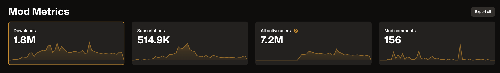
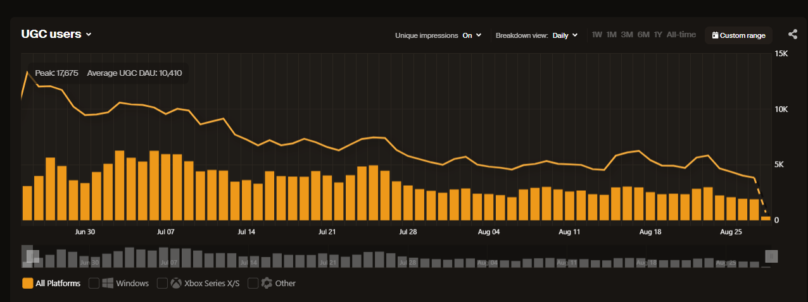

# UGC Dashboard

The UGC Metrics dashboard gives creators powerful insights into how players are engaging with their content. It highlights key stats such as downloads, subscriptions, UGC users, and comments, with interactive charts that reveal trends over time. Monthly summaries, day-of-week comparisons, and regional breakdowns make it easy to spot growth opportunities, understand audience behavior, and plan releases for maximum impact.

## Definitions

### Downloads

**What it measures**  
The total number of times UGC files are downloaded. 

**How it's measured**  
Download events are recorded whenever a file is downloaded, regardless of whether the user is authenticated or not.

**Deduplication**  
To avoid inflating totals from repeated requests, events are deduplicated on a 24-hour period based on the combination of:

* User IP  
* UGC ID  
* Platform

This ensures that repeated downloads of the same file by the same user on the same platform within 24 hours count only once.

### Subscriptions

**What it measures**  
The net number of subscriptions to UGC, reflecting both subscribing and unsubscribing. Positive values indicate growth (more subscribing than unsubscribing); negative values indicate decline.

**How it's measured**  
Subscription movement is recorded whenever a player subscribes or unsubscribes.

#### UGC MAU

**What it measures**  
The number of unique users for the current and previous month. 

**How it's measured**  
An UGC user is defined as anyone performing a qualifying action such as downloading, subscribing, rating, or commenting on a UGC.

**Deduplication**  
Events are deduplicated on a 24-hour rolling period based on the combination of:

* User IP  
* UGC ID  
* Platform

### UGC Users

**What it measures**  
The number of unique users within the UGC ecosystem. 

**How it's measured**  
An UGC user is defined as anyone performing a qualifying action such as downloading, subscribing, rating, or commenting on a UGC.

**Deduplication**  
Events are deduplicated on a 24-hour rolling period based on the combination of:

* User IP  
* UGC ID  
* Platform

This ensures that multiple interactions by the same user with the same UGC on the same platform within a day count only once toward UGC user totals.

### Impressions

**What it measures**  
The number of unique users who have received information or interacted with a game’s UGC via the mod.io API. This includes both:

* Exposure events such as visiting a game profile, browsing mod lists, or viewing mod details.  
* Engagement events also used in UGC Users (e.g., downloading, subscribing, rating, or commenting).

**How it's measured**  
 An impression is recorded whenever a user’s client makes a qualifying API request that returns UGC-related information for a game. This includes endpoints that power browsing experiences as well as those that log direct user interactions.

**Deduplication**  
Events are deduplicated on a 24-hour rolling period based on the combination of:

* User IP  
* UGC ID  
* Platform

This ensures that repeated impressions of the same UGC by the same user on the same platform within a single day are counted only once toward impression totals.

### UGC Comments

**What it measures**  
The total number of comments posted on UGC by users.

**How it's measured**  
An event is recorded whenever a user submits a comment on a UGC.

## Insights

### Timeseries Graph Impressions Trendline

An impressions trend line is overlaid on the UGC Users timeseries graph, allowing you to compare audience exposure (impressions) with direct engagement (UGC users).

