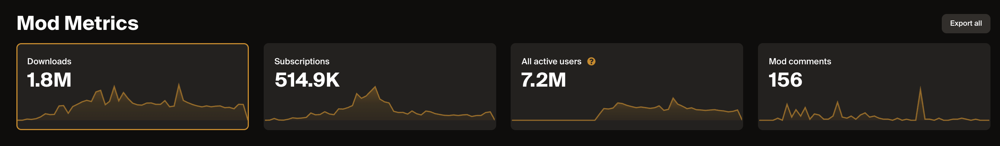
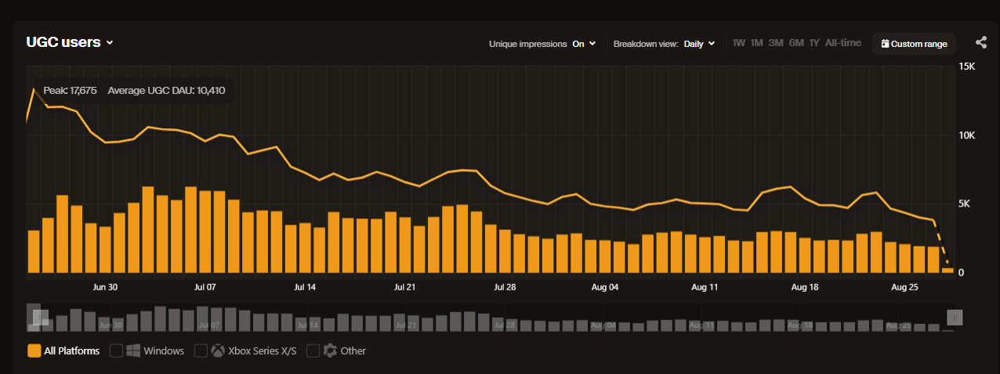

# UGC Dashboard

The UGC Metrics dashboard gives creators powerful insights into how players are engaging with their content. It highlights key stats such as downloads, subscriptions, UGC MAU, and comments, with interactive charts that reveal trends over time. Monthly summaries, day-of-week comparisons, and regional breakdowns make it easy to spot growth opportunities, understand audience behavior, and plan releases for maximum impact.

## Definitions

### Downloads

**What it measures**  
The total number of times UGC files are downloaded.

**How it's measured**  
Download events are recorded whenever a file is downloaded, regardless of whether the user is authenticated or not.

**Deduplication**  
To avoid inflating totals from repeated requests, events are deduplicated on a 24-hour period based on the combination of:

- User IP
- UGC ID
- Platform

This ensures that repeated downloads of the same file by the same user on the same platform within 24 hours count only once.

### Subscriptions

**What it measures**  
The net number of subscriptions to UGC, reflecting both subscribing and unsubscribing. Positive values indicate growth (more subscribing than unsubscribing); negative values indicate decline.

**How it's measured**  
Subscription movement is recorded whenever a player subscribes or unsubscribes.

### UGC MAU

**What it measures**  
The number of unique monthly active users (MAU) for the current and previous calendar month.

**How it's measured**  
A UGC MAU is a unique user identity that performs at least one qualifying action on UGC.

**Qualifying actions**

- Downloading UGC
- Subscribing to UGC
- Unsubscribing from UGC
- Rating UGC
- Commenting on UGC

**Deduplication**
Events are deduplicated over a rolling 24-hour period using the combination of:

- User IP
- User ID, when available
- UGC ID
- Platform

Including User ID preserves separate authenticated and anonymous observations using the same IP and prevents different authenticated users behind a shared IP from being treated as the same observation.
An authenticated user using multiple IP addresses may produce multiple retained events. These events are resolved to one User ID during DAU/MAU aggregation.

**Daily Aggregation**
Across a calendar day:

- Each authenticated User ID is counted once.
- An IP address is counted as an anonymous identity only when it was not associated with an authenticated User ID during that day.
- Identities are combined and deduplicated across UGC and platforms before calculating the unfiltered DAU total. Per-UGC or per-platform unique counts are not added together.

**Monthly Aggregation**
Across a calendar month:

- Each authenticated User ID is counted once, even when the user interacts on multiple days, IP addresses, UGC items or platforms.
- An IP address is counted once as an anonymous identity only when it was not associated with an authenticated User ID during that month.
- Monthly unique identities are calculated across the complete timeframe. MAU is not calculated by summing daily unique-user totals.

**Platform Behaviour**
When viewing results by platform, each platform is calculated separately. If the same authenticated User ID or eligible anonymous IP is active on multiple platforms, it may appear once in each relevant platform count.
Without a platform filter, identities are combined across all platforms before DAU/MAU is calculated, so each authenticated User ID or eligible anonymous IP contributes once to the total.

**Authenticated DAU/MAU**
Authenticated DAU/MAU counts distinct positive User IDs only. It excludes anonymous IP identities.

### Impressions

**What it measures**  
The number of unique users who have received information or interacted with a game’s UGC via the mod.io API. This includes both:

- Exposure events such as visiting a game profile, browsing mod lists, or viewing mod details.
- Engagement events also used in UGC MAU (e.g., downloading, subscribing, unsubscribing, rating, or commenting).

**How it's measured**  
 An impression is recorded whenever a user’s client makes a qualifying API request that returns UGC-related information for a game. This includes endpoints that power browsing experiences as well as those that log direct user interactions.

**Deduplication**  
Events are deduplicated on a 24-hour rolling period based on the combination of:

- User IP
- UGC ID
- Platform

This ensures that repeated impressions of the same UGC by the same user on the same platform within a single day are counted only once toward impression totals.

### UGC Comments

**What it measures**  
The total number of comments posted on UGC by users.

**How it's measured**  
An event is recorded whenever a user submits a comment on a UGC.

## Insights

### Timeseries Graph Impressions Trendline

An impressions trend line is overlaid on the UGC MAU timeseries graph, allowing you to compare audience exposure (impressions) with direct engagement (UGC MAU).
