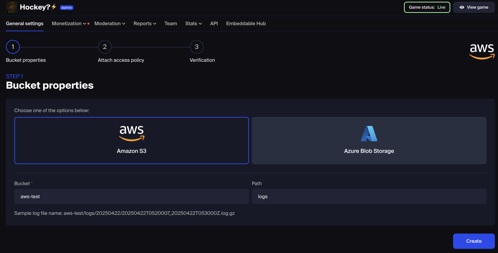
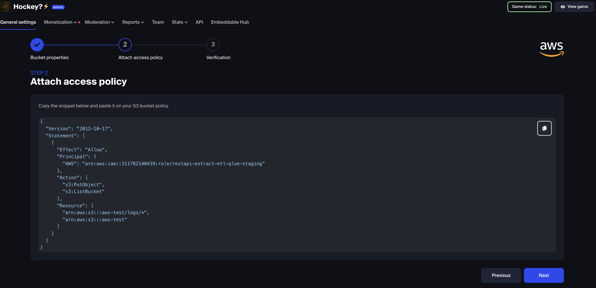
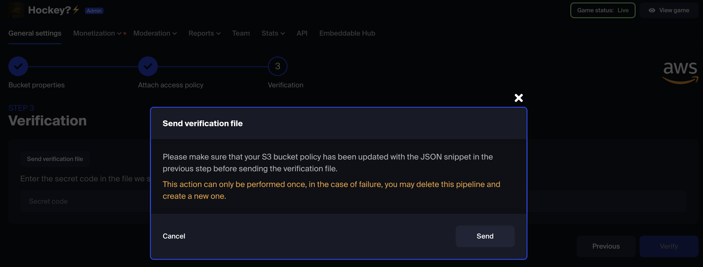
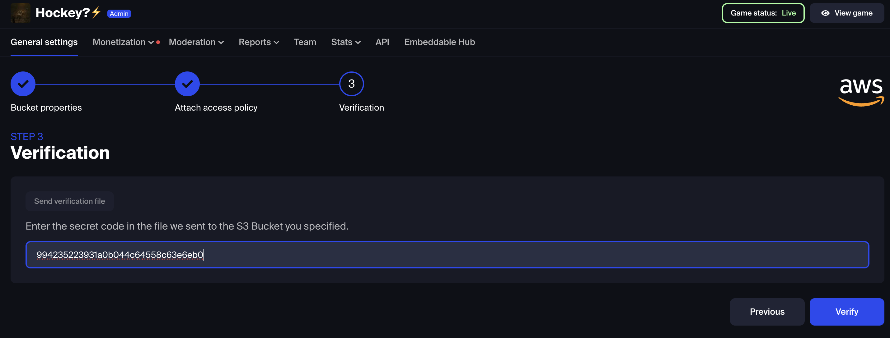
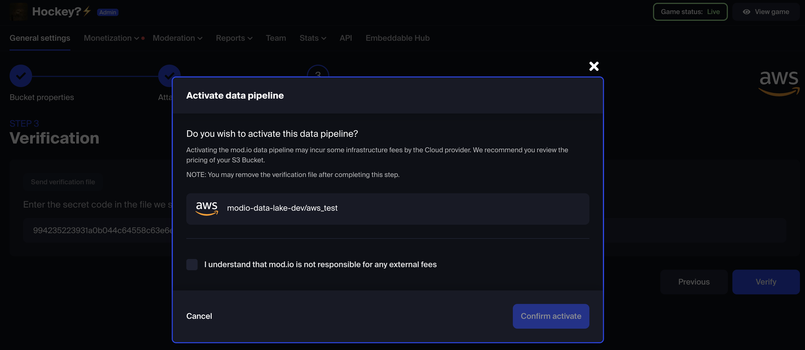
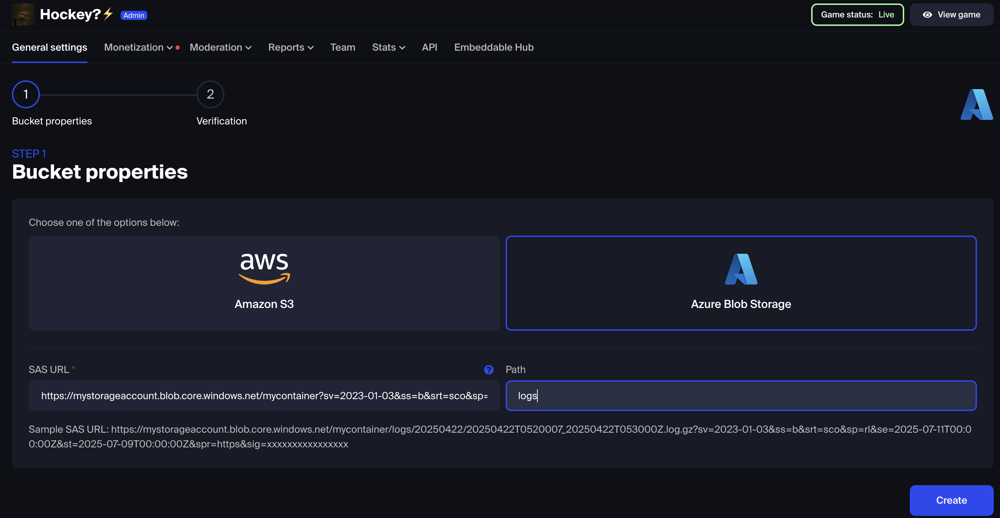
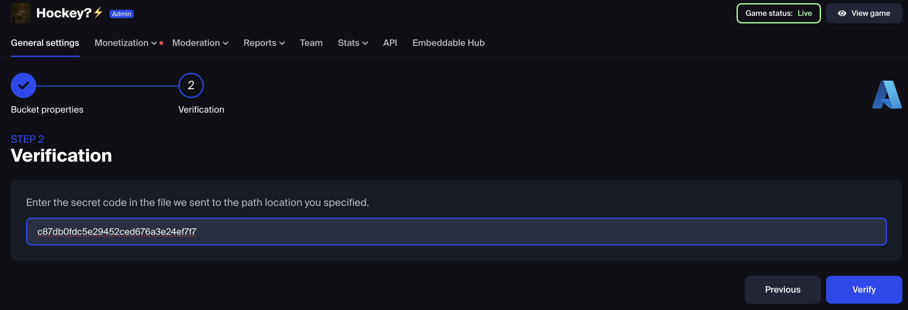
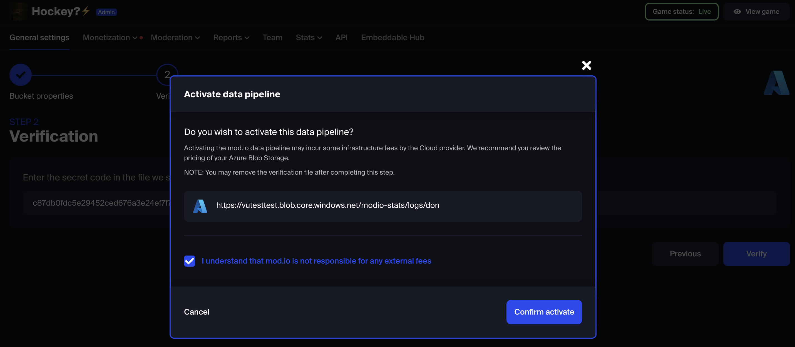

# Metrics Export

The Metrics Export feature enables game studios to receive detailed logs of player interactions on mod.io, delivered securely into your own cloud infrastructure. This data provides powerful insights that can be integrated into your internal analytics platforms and workflows.

:::note
Metrics Export is a premium feature. If you are interested in mod.io premium features, please contact developers@mod.io.
:::

## Key Benefits

#### In-depth player behavior analysis

Gain a deeper understanding of how players engage with UGC within your title(s) to improve player engagement.

#### Seamless data integration

Exported metrics can be ingested into your business intelligence tools, data lakes, or telemetry pipelines to build comprehensive dashboards and reports for your team.

#### Data ownership & control: 

mod.io exports the data directly to your controlled cloud environment. By receiving the data directly, your team retains full control over storage, processing, and access controls.

## How It Works

* Metrics are delivered once per day to your designated Amazon S3 bucket or Azure Blob Storage container.  
* Deliveries occur at midnight UTC, ensuring a consistent and reliable cadence of updates.  
* Data is provided in a near raw format, making it easy to process and transform to fit your internal needs.

## Supported Events

The following user activity types are captured and exported:

| Event Type | Description |
| :---- | :---- |
| Mod Download | User downloads a mod |
| Mod Subscribe | User subscribes to a mod |
| Mod Unsubscribe | User unsubscribes from a mod |
| Mod Comment | User posts a comment |
| Mod Page Visited | User views a mod page |
| Mods List Browsed | User browses available mods |
| Mods Created | A creator publishes a mod |
| Mods Updated | A creator updates a mod |

## Log Entry Format

Each log entry includes essential metadata to support reliable and privacy-conscious analysis. The provided standardized structure allows for robust filtering, aggregation, and cross-referencing with your own in-game telemetry or player records.

* Geographic Location: Country-level only (e.g., *Germany*, *USA*)  
* Anonymized User Identifiers:  
  * user_identifier: SHA-256 hash of the User ID (if available)  
  * guest_identifier: SHA-256 hash of the user's IP address (only present when useridentifier is null).  
  * sso_identifier *(coming soon)*: Enables studios to associate mod.io data with their internal player IDs when using Studio SSO.  
* Platform: Device type used (e.g., PC, XboxOne)  
* Timestamp: UTC timestamp of the player action (ISO 8601 format)  
* Mod ID (optional): Unique identifier of the mod involved in the interaction (included if available)

## Data Format & Delivery

* File Format: [Apache Parquet](https://parquet.apache.org/) \- columnar storage optimized for efficient analytics workflows.  
  Data is partitioned by dateid (in YYYYMMDD format) to support scalable querying and efficient retrieval.  
* Delivery Method: Direct push to your provided Amazon S3 bucket or Azure-compatible blob storage  
* Interval: Daily, delivered at midnight UTC (configurable upon request)  
* Retention: mod.io retains exportable data for 30 days (configurable on request)

## Cloud Setup: Exporting Metrics to AWS S3

This guide walks you through the process to configure your AWS S3 bucket to receive mod.io metrics exports.
:::warning
Buckets in China regions (cn-north-1, cn-northwest-1) are currently not supported.
:::
### Before You Begin

Ensure you are:

* A game team member on your mod.io game project.  
* On an eligible paid plan that includes metrics export.  
* Have access to your AWS account with permission to modify S3 policies.

### Step 1: Configure Your Bucket Properties
1. Navigate to Metrics Integration in your game settings.  
2. Click \+ Create New under "Your data pipelines".  

3. Select Amazon S3 as your cloud provider.  
4. Fill in the fields:

| Field | Example |
| :---- | :---- |
| Bucket | aws-bucket |
| Path | logs (optional folder prefix inside your bucker/container) |

5. Click Create.

### Step 2: Attach the Bucket Access Policy

1. After saving, you’ll see a pre-generated bucket policy snippet.  
2. Copy and paste this JSON into your bucket's permissions under:  
   S3 Console → Permissions → Bucket Policy

Example Policy
```JSON
{
  "Version": "2012-10-17",
  "Statement": [
    {
      "Effect": "Allow",
      "Principal": {
        "AWS": "arn:aws:iam::211782140439:role/restapi-extract-etl-glue"
      },
      "Action": [
        "s3:PutObject",
        "s3:ListBucket"
      ],
      "Resource": [
        "arn:aws:s3:::aws-bucket/logs/*",
        "arn:aws:s3:::aws-bucket"
      ]
    }
  ]
}

```
:::important
Replace "aws-bucket" with your actual bucket name. Replace "logs"with the path if used.
:::
### Step 3: Verification (Ownership Check)

To ensure that your studio controls the target S3 bucket:
1. Click Send verification file.  

2. Check your S3 bucket path (e.g., aws-bucket/logs/) \- a file will appear with a secret verification code inside.  
3. Open the file, copy the code.  

4. Paste the code back into the "Secret code" field in the UI.  
5. Click Verify.

### Step 4: Activate the Data Pipeline
1. A confirmation prompt will display your storage URL.  

2. Check the agreement box:  
   *"I understand that mod.io is not responsible for any external fees"*  
3. Click Confirm activate.
Once activated, mod.io will start delivering metrics logs to your container on a regular schedule.

## Cloud Setup: Exporting Metrics to Azure Blob Storage

This guide walks you through the 3-step process to configure your Azure Blob Storage container to receive mod.io metrics exports securely and reliably.
:::warning
Azure regions in China are not currently supported.
:::
### Before You Begin

Ensure you are:

* A game team member on your mod.io game project  
* On an eligible paid plan that includes metrics export  
* Able to create a valid SAS URL with required permissions  
* Using an Azure Blob Storage container that supports long-term access

Create and Get Access to a Blob Storage Container

mod.io uses a Shared Access Signature (SAS) token to gain access to your Azure Blob Storage container. You’ll need to:

* Grant read, add, create, write, delete, and list permissions  
* Set the expiration period to at least five years  
   (This ensures uninterrupted access to your logs over time)

To enable metrics export to Azure:

1. Create a Blob Storage container  
    Refer to official [Azure documentation](https://learn.microsoft.com/en-us/azure/storage/blobs/storage-quickstart-blobs-portal) for instructions.  
2. Generate a Shared Access Signature (SAS)  
    Use [Azure Storage Explorer](https://learn.microsoft.com/en-us/azure/storage/common/storage-explorer):  
   * Right-click on your container → "Get Shared Access Signature"  
   * Set expiry to at least 5 years from today  
   * Enable the following permissions:  
     * Read (r), Add (a), Create (c), Write (w), Delete (d), List (l)  
   * Click Generate and copy the full SAS URL  
3. Provide the SAS URL in mod.io  
    When prompted in the UI, paste your generated SAS URL and specify a path (e.g., logs) if desired.

### Step 1: Configure Your Bucket Properties
1. Go to Metrics Integration in your mod.io dashboard.  
2. Click \+ Create New under *Your data pipelines*.  

3. Select Azure Blob Storage.  
4. Enter the details:

| Field | Example |
| ----- | ----- |
| SAS URL | `https://mymodiologs.blob.core.windows.net/metrics-exports?...` |
| Path | logs (optional folder prefix) |

5. Click Create.

### Step 2: Verification (Ownership Check)
1. Click Send verification file.  
2. mod.io will place a test file with a one-time code into your specified container and path.  
3. Access the blob (via Azure Portal or Storage Explorer), open the file, and copy the secret code.  
4. Paste the code into the "Secret code" field in the UI.  

5. Click Verify.

### Step 3: Activate the Data Pipeline
1. A confirmation prompt will display your storage URL.  

2. Check the agreement box:  
    *"I understand that mod.io is not responsible for any external fees"*  
3. Click Confirm activate.
Once activated, mod.io will start delivering metrics logs to your container on a regular schedule.

## Troubleshooting & FAQ

This section addresses common setup issues and helps you interpret the status of your metrics export pipelines.

### Why isn’t my data showing up in my S3 bucket or Azure container?

Check the pipeline status in the mod.io dashboard under Metrics Integration. Here's what each status means:

#### Operational

Everything is set up correctly. mod.io is actively delivering logs to your cloud bucket/container.

#### To be verified

mod.io has successfully uploaded a verification file to your destination, but you haven’t entered the secret code yet. What to do:
1. Go to your S3 or Azure Blob container.  
2. Open the verification file in the path you specified (e.g., /logs/).  
3. Copy the secret code inside the file.  
4. Paste it into the confirmation field in the mod.io UI.  
5. Click Verify to complete setup.

#### Verification failed

mod.io couldn’t write the verification file to your destination. Common causes are:

* Invalid or expired SAS URL (Azure)  
* Incorrect bucket/container name  
* Missing required permissions on the target bucket

What to do:

* Click the trash icon to delete the failed job.  
* Double-check the following:  
  * For AWS:  
    * Your bucket policy includes `s3:PutObject` and `s3:ListBucket`
    * The path is valid (e.g., no typos in the folder name)  
  * For Azure:  
    * SAS URL includes all required permissions: r, a, c, w, d, l  
    * Expiry date is at least 5 years in the future  
    * URL is valid and points to a container, not a specific blob  
* Recreate the pipeline with corrected values

### Can I update my export destination?

Unfortunately you cannot update the export destination after the export pipeline has been created. If you must change the location you can simply create another pipeline.

### Can I have multiple pipelines?

Yes - multiple export pipelines can be created and each will be verified and managed independently.
:::warning
There is a limit of 100 pipelines per game. If you need more, please contact support via your mod.io studio channel or [email](mailto:developers@mod.io).
:::
