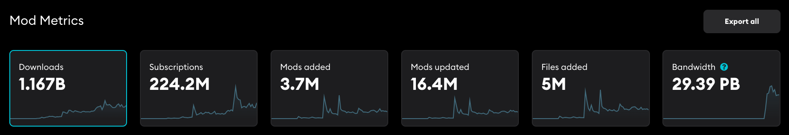
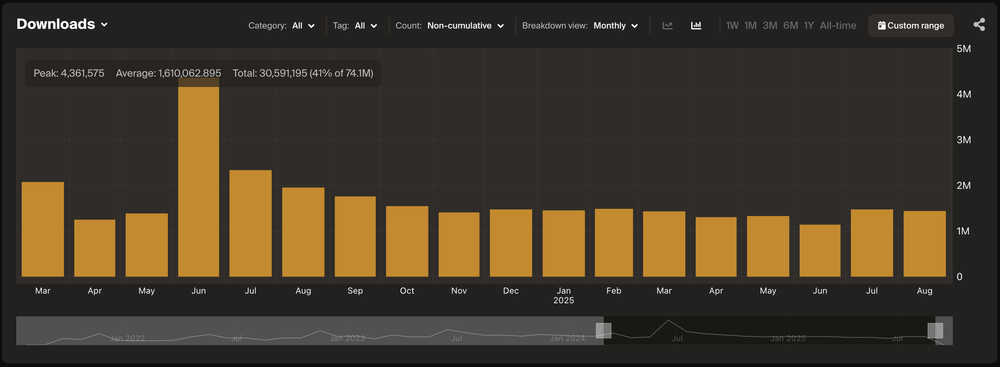
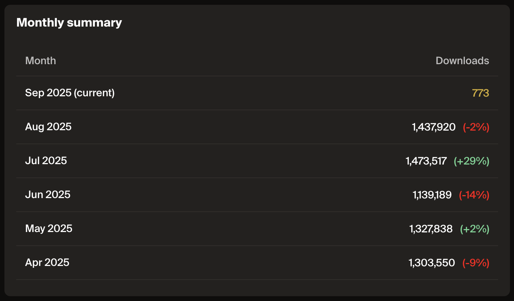
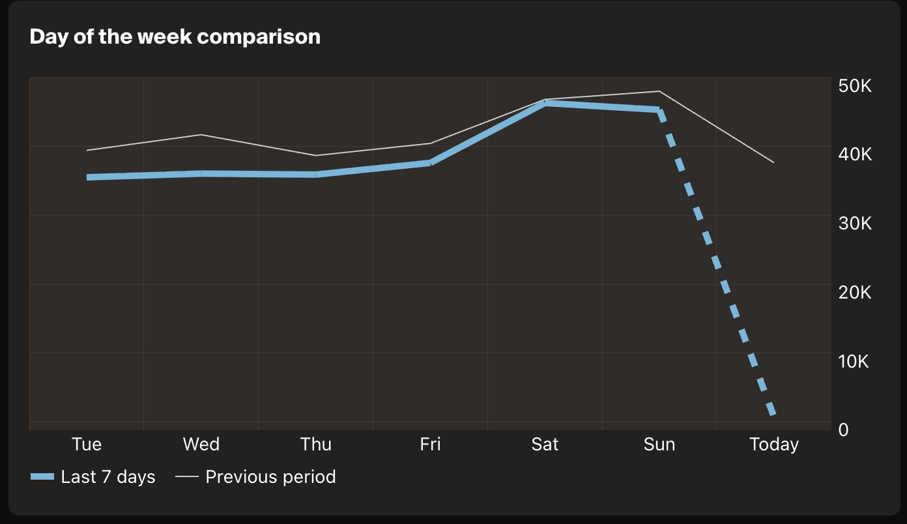

# How It Works

## Metric Tiles

Each dashboard presents a series of metric tiles that showcase key activity across your game’s UGC ecosystem.

* Each Tile displays the all-time total for its metric, along with a trend line that provides historical context.  
* Clicking a tile opens a dedicated detail page with graphs and charts tailored to that metric, including:  
  * A flexible time series view (daily or monthly, with months aligned to calendar months and days aligned to UTC).  
  * Monthly summaries highlighting growth or decline indicators.  
  * Day-of-week comparisons that reveal engagement patterns.  
  * Additional insights such as top UGC, leading creators, or regional breakdowns—depending on the metric.

This structure makes it easy to track long-term growth trends while also spotting short-term shifts in user engagement.

## Time Series Graph

Displays the selected metric over time (daily or monthly view).

* Shows Peak, Average, and Total values, each calculated based on the currently selected time period.  
* Supports Category, Tag, Platform, and Location filters.  
* Allows platform selection using checkboxes (e.g., Windows, Mac, Linux, Oculus, Other) to focus analysis on specific platforms.  
* Adjustable with predefined ranges (1W, 1M, 3M, 6M, 1Y, All-time) or a custom range.  
* Toggle between cumulative (running totals) or non-cumulative (per-period counts).

:::note[Premium Feature]
Filtering UGC Metrics by Category and Tag is a premium feature. Sign up to one of our [advanced service tiers](https://mod.io/pricing) which includes [Play Sessions](/metrics/game#play-sessions) to activate detailed data analytics, or contact us at developers@mod.io for more information.
:::

## Monthly Summary

The monthly summary presents a table of recent months with total counts for the selected metric.

* Shows percentage change compared to the previous month, with positive and negative shifts highlighted.  
* Makes it easy to spot growth trends, seasonal spikes, or declines at a glance.

## Day of the Week Comparison

The day-of-week comparison is a line graph that contrasts activity across the last 7 days against the previous period.

* Highlights engagement patterns across the week (e.g., weekend spikes, weekday dips).  
* Helps reveal behavioral rhythms in user activity, such as consistent peak days or drop-off points.  
* Supports better content planning and release timing by showing when your audience is most active.
