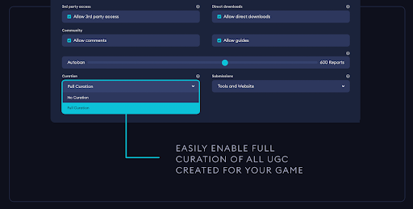
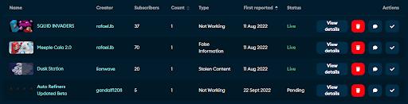
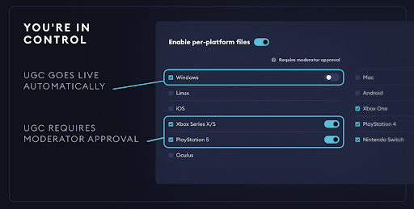

# Content Approval

Content Approval gives you the ability to manually configure the moderation and curation rules for all UGC content in your game. It forms one layer of our four layer [Moderation](/moderation) system, all of which are configured and managed via your game's admin dashboard.

This guide covers:

* [Moderation rules](#moderation-rules)
* [Curation rules](#curation-rules)

## Moderation rules

The first step is to invite users to moderate your games content. Moderation tools are operated hierarchically by team members that may consist of fellow employees and community members, with varying permission levels granted during account creation. These team members represent your relationship with Creators and Subscribers. Team size can vary, depending on the expected time required to moderate content, with no restrictions on the number of users you can set up as team members.

Team members may either be administrators, managers or moderators. 

|Role      | Permission Level                                       |
| ------------- |------------------------------------------------|
|Administrator        | Have permission to edit moderation policy, user management, and moderation tools, in addition to everything in manager and moderator roles.  |
|Manager  | Has access to everything in the Moderator role, in addition to additional game configuration options.  |
|Moderator     | Has permission to use core moderation tools (add, edit, delete mods, guides and comments), view and manage users, and view and manage the report queues.  |

### Content management & policy

mod.io provides oversight on live content which breaches our Acceptable Use Policy and DMCA. Your Moderators have access to our Customer Support teams for guidance and report resolution.

mod.io makes available to all studios, creators, and subscribers, our [Game Terms](https://mod.io/gameterms), [User Terms](https://mod.io/terms) and [Monetization Terms](https://mod.io/monetization). These are rules by which we operate, and expect the same of our partners. We recommend studios who utilise mod.io for their UGC formulate a policy for their own users, or follow the [Acceptable Use Policy](https://mod.io/aup) we use.

## Curation rules

After inviting your team, the second step is to review the curation rules in the Game Admin panel. These are:

|Option       | Functionality                                        |
| ------------- |------------------------------------------------|
|Mature Content        | Define how mature content will be handled. If the user flags their UGC as containing mature content, you can either **disallow** the content entirely, **allow** the content without restriction, or select **mature audiences only** to **restrict** it to users who are 18+, gated with a mature content warning.  |
|Allow Comments / Allow Guides  | These options disable or enable the ability for players to add comments on UGC pages, or contribute content to the guides section of the game page.  |
|Autoban     | You can define a **limit** of open user-created reports before the UGC is automatically taken down for review. Once a UGC hits this report threshold, it will automatically be **removed** until it has been reviewed by a member of your team.  |
|Curation | By default this is set to **No Curation**. UGC will appear live right away, and moderation is community driven (based on user reports). **Full Curation** means all mods will be moved to the pending queue, and must be manually approved by your team before going live.  |
|Submissions  | **Tools only** will disable the ability for users to upload mod content through the mod.io website. **Tools and Website** allows content submission through both your in-game editors / tools and our web-based upload tool. |

:::tip
Whilst it saves a lot of engineering time to allow submissions using our web-based upload tool, if you have built your own editor or submission pipeline, we recommend you restrict submissions to using **Tools only**. This will eliminate user error, and allow you to add validation and checks of your own during the submission process.
:::

### Full curation
mod.io provides studios with the option to curate all content submitted, by turning on **Full Curation** as shown in the image below. This is generally used by studios seeking to oversee all content available for their game, or have complex moddable content and want to verify mods work correctly across all platforms prior to going live.

Change the curation setting via the “Content” section on your games settings page.

When you turn this system on, all mods are hidden and go into your moderation queue by default. Content must be approved by a moderator prior to going live.

### No curation

The **No Curation** option doesn’t mean content cannot be moderated, it just means content can go-live immediately on submission. All content added to mod.io, even approved content can be put back into the moderation queue for curation, or deleted and removed from circulation as explained later in this guide.

:::tip
This is the default setting and recommended approach, unless you want to control when new mods go-live. This is how the largest comparable UGC platforms operate, including Youtube, Workshop, Roblox and others. Their aim is to automate the majority of moderation, allowing content to release immediately provided it passes all of the programmed checks. See the [Rules Engine](/moderation/rules-engine) for how programmed checks can be defined with mod.io.
:::

The majority of games using mod.io have **No Curation** enabled because it maximizes DMCA-compliance, streamlines resources needed to run UGC by leveraging community reporting, and is preferred by creators and players who appreciate content going live on submission. They focus their effort on rapidly responding to user reports and validating content post-submission. We recommend this effort be paired with the [Rules Engine](/moderation/rules-engine) to automate as much as possible. We also recommend using per-platform moderation on consoles and stores where curation is required, as explained in the next section.

:::note
You can always turn Full Curation on instantly anytime in the future, if you want new content to go into a queue for approval before going live.
:::

### Per-platform moderation

For games that have enabled mods or UGC on more than one platform (such as PC, consoles, VR, or mobile) you can define moderation policies based on each platform you support. This is a particularly powerful feature of mod.io, which gives you the ability to control which platforms each UGC is available on. It also enables each file uploaded to a UGC to target only the platforms it supports, which is critical if your game needs UGC to be built differently for each of the platforms.

On your games settings page via the Platforms section as shown above, you should **check the box of all platforms** your game will be using mod.io on. Doing this automatically activates certain requirements those platforms have, such as the Xbox Live word filtering service. You can also can **enable the per-platform files** toggle, which allows creators to specify which platforms they would like to release each file they upload on. 

To control which platforms UGC is released on, enable **Moderator Approval** using the toggle on the right-hand side next to each platform you have checked. Once enabled, all UGC files uploaded targeting these platforms will need to be manually approved by a member of your team before it appears on these platforms.

:::tip
Per-platform files should only be enabled if you want to curate files on a per-platform basis or if you need UGC to be built differently for each of the platforms.
:::

Otherwise, you should leave this setting turned off as it simplifies the UGC file submission process by not requiring the creator to specify the target platforms, since UGC will target all platforms by default. Most games that use turn this on will setup UGC to not require moderator approval on PC, but to require moderator approval on consoles so they can adhere to the platform rules they have agreed to with the platform owner.