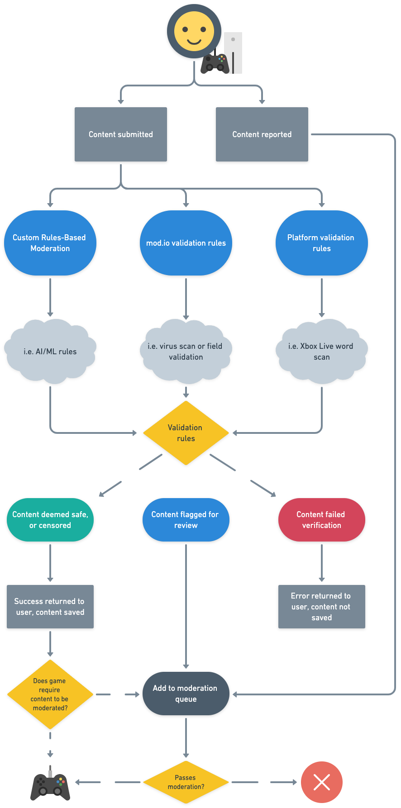

# Moderation

To ensure UGC in your game is operating and being used exactly how you intend, we offer a wide variety of moderation and reporting functions that work across a wide-rage of platforms. This is achieved through four levels of moderation:

1. [Automated Scanning](#automated-scanning) done by mod.io
2. [Rules-Based Moderation](#rules-based-moderation)
3. [Content Approval](#content-approval) for UGC curation
4. [Reporting](#content-approval) of inappropriate or illegal content

These moderation tools work together to ensure a high quality bar for the UGC utilized in your game.

## Moderation flow

## Automated Scanning

Every UGC submitted to mod.io is first passed through our [Automated Scanning](/moderation/automated-scanning) moderation. This consists of mod.io validation rules as well as platform validation rules. Depending on the validation rule applied, UGC may either be passed, censored, rejected or flagged for manual review.

mod.io validation rules involve:

* Virus and malware scanning
* File type and field validation
* Rate limit check

Platform validation rules typically cover profanity filters and 18+ content checks to protect minors from inappropriate content. mod.io runs these checks to ensure compliance with rules set down from platform owners.

## Rules-Based Moderation

[Rules-Based Moderation](/moderation/rules-engine/overview) is a premium feature that runs all UGC through a series of checks defined by you. For example, you can flag UGC from users with a history of stolen content, UGC with particular words in the title, particular file types detected inside the zip file, and many more options. The Rules Engine also allows you to define the action taken for each failed check. For example, to reject the UGC, flag it for manual moderation or call a webhook for custom actions.

## Content Approval

[Content Approval](/moderation/manual-curation) lets you define settings such as how mature content will be handled, whether comments will be allowed, whether UGC will be hidden once it has received a certain number of player reports and whether UGC requires manual approval before going live. These settings are applied to UGC after Automated Scanning and Rules-Based Moderation.

## Reporting

[Reporting](/moderation/community-reports) takes the form of a moderation dashboard that lets game teams review UGC. Content may appear on this dashboard through one of three reasons:

1. The content fails an automated validation rule that requires manual approval (usually a custom Rules Engine rule)
2. You have specified that you wish to curate UGC, instead of having it be automatically approved
3. A player has reported the content for a reason such as stolen content, illegal content or a DMCA issue

Team members given the ‘Moderator’ level permission or above may action reports that appear here. Moderators may approve, delete, or edit the UGC as appropriate. Moderators may also apply restrictions to users, for example, those who have repeatedly uploaded inappropriate content.