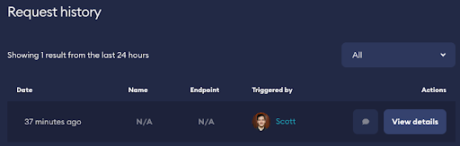
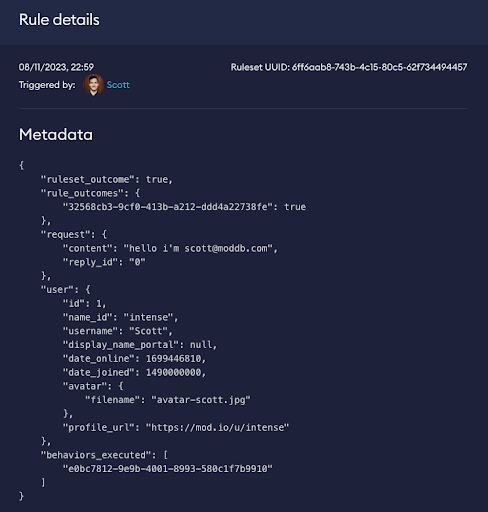

# Monitoring Rules

For a period of time (currently 24 hours), all requests which match at least one active rule can be found by browsing the Request history. These can be filtered by rule. This is particularly useful to see if your rules are working as expected, and what action they are taking. 

_An example of all matched requests_

_Viewing the details of the request shows you what the user submitted_