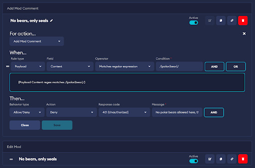

# Rules Engine

Rules-Based Moderation, or the Rules Engine, is a powerful tool that can enable you to effectively manage high volumes of UGC content, in a fully automated manner.

Rules-Based Moderation is:

* Proactive - Run automated actions based on user activity
* Flexible - Approve or deny content, or log and hold for review
* Smart - Connect any AI, file, content or malware vendor to run checks
* Efficient - Observe and deploy rules instantly, no development required
* 24/7 monitoring - Runs around the clock, view outcomes in real time

It forms one layer of our four layer [Moderation](/moderation) system, all of which are configured and managed via your game's admin dashboard.

Together, the four layers combine to give you 100% coverage and control over UGC appearing in your game. The goal is to automate the approval of as much content as possible with minimized human intervention, no matter how strict or sensitive your content safety requirements are.

## Use Cases

In practice, the Rules Engine is being used to test mod loading, generate messages in Slack channels for new content submissions, bolster platform-specific word filters, and stop users from editing mod profiles using the web dashboard. 

### Our Example

As an example, we have very basic rules set up for our test game. In our test game we only want Artic Seals friendly content, which means strictly no Polar Bears. To enforce this, we have set up two rules, one on Mod Comment, which denies the comment if their post includes the words “polar” or “bear”, and a similar rule which automatically reports any mod which is edited to include the words “polar” or “bear”.

_Regular expression check, which denies the user with a custom message_

_Comment is denied by rule for containing a forbidden word “Bear”_

### Live Examples

Significantly more advanced rules are being run by games using mod.io. Examples of these are explained below. 

* __Dying Light 2: Stay Human__ - On “Add Modfile” action, they have set up a webhook which calls an AWS Lambda function, which verifies and autobuilds the modfile to ensure cross-platform compatibility.
* __Park Beyond__ - They only want their UGC details and media to be editable using the in-game interface. To accomplish this, they have set up a rule against a number of actions “Edit Mod”, “Add Mod Tags”, “Add Mod Media”. These requests will be denied, if the user performing the action is not a game admin, and if the user-agent indicates the request was made from the web and not via the Unreal Engine game client.
* __Bonelab__ - On “Add Mod Comment” action, to catch toxic users, they have set up a bunch of word checks, which calls an IFTTT hosted webhook, which then posts a message into their Slack channel, for their moderators to monitor and action.

Other examples we are working on, include:

* __CRM__ - Automatically opening a support ticket on content submission, so UGC can be moderated using your preferred CRM software (i.e. JIRA, Zendesk etc). The CRM would make calls back to the API to perform actions.
* __Image Safety Checks__ - Using AI such as AWS Rekognition, to determine if the mod preview image contains inappropriate content, such as nudity or violence.
* __Textual Toxicity Checks__ - Using common moderation tooling such as Two Hat, to check text for profanities, slurs, or other scenarios which don’t adhere to your policies.