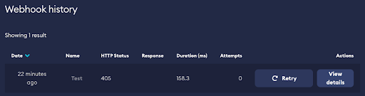
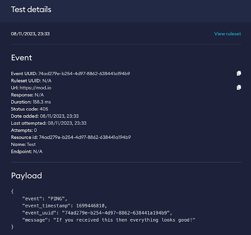

# Webhooks

Webhooks can be used as part of [Rules-Based Moderation](/moderation/rules-engine/overview) to connect any external vendor to run custom post processing and checks. The possibilities are endless, but examples we’ve seen include:

* Automation: Verify and auto build mod files
* Safety: Use AI to check image appropriateness, check for banned words or incorporate 3rd party moderation scanner
* Alert: Post messages to Discord / Slack
* Process: Open ticket in JIRA

This guide covers:

* [Set up](#set-up)
* [Logging Webhook calls](#logging-webhook-calls)
* [Retrying Webhook calls](#retrying-webhook-calls)

## Set up

All you need to do to set up Webhooks is enter the URL mod.io should call with the request data, which your webhook should then process.

To ensure the request to your URL originates from mod.io, a webhook security token is available for you to verify (which you should keep secret). It is specified in the X-Modio-Webhook-Token header in each request made by mod.io.

The webhook payload is always provided as JSON, following a format similar to the one provided below. There is also a “test” button, which you can use to send test payloads to your webhook URL to trial.

```
{
  "event_name": "ADD_MOD_COMMENT",
  "event_timestamp": 1683876030,
  "event_uuid": "5d9f92b8-ce56-42e8-8a1d-838f3c405981",
  "request_method": "POST",
  "request_resource": {
    "resource_type": "comment",
    "resource_id": 30,
    "resource_url": "https://mod.io/g/demo/m/aepyceros-volitans#30"
  },
  "request_secondary_resource": {
    "resource_type": "mod",
    "resource_id": 10,
    "resource_url": "https://mod.io/g/demo/m/aepyceros-volitans"
  },
  "request_user": {
    "user_id": 1,
    "username": "Admin",
    "profile_url": "https://mod.io/u/admin"
  },
  "event_body": {
    "content": "I am a bad apple!"
  }
}
```

## Logging Webhook calls

mod.io will log the webhook response code and response body your URL returns for a period of time (currently persistent). These logs are available by browsing the Webhook history.



_An example of logged webhook calls_



_Viewing the details of a call to a webhook_

## Retrying Webhook calls

mod.io will not automatically retry failed webhook calls, but via the webhook history, you can retry calls to your webhook.

:::warning
mod.io allows a maximum of 5 seconds for webhooks to process, so if you expect execution to take longer, we recommend you process it in the background whilst returning a successful response code as early as possible. Any response code within the range of 200-299 is treated as successful.
:::