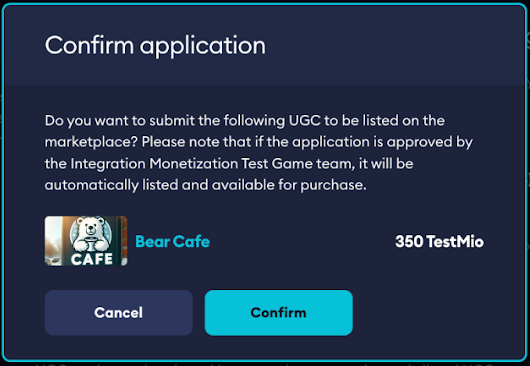
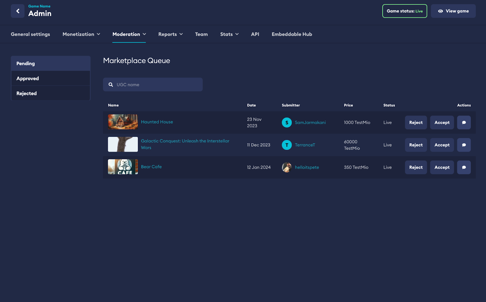
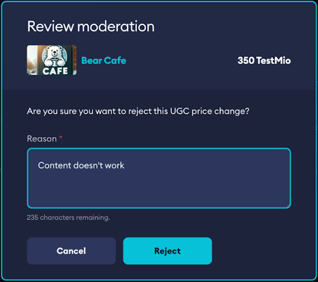

# Approving Premium UGC

Premium UGC is essentially UGC that can be monetized within your game. mod.io lets your team vet premium UGC to ensure it meets the quality bar as part of the [Moderation](/moderation) process before it hits the [Marketplace](/monetization/marketplace).

## Approval process

If **‘Enable manual moderation’** has been turned on as part of [Monetization settings](/monetization/onboarding#monetization-settings), then all premium UGC will need to be approved by the Studio before it can be purchased by other users.

Content pending approval will appear in your ‘Marketplace Queue’ under Moderation in your **Game Admin** dashboard on
mod.io. You will have full controls to Approve, Reject and manage previously approved or rejected content.

:::note
Creators will be notified that their content will need to be approved when submitted to the Marketplace.
:::

:::note
Game moderation team will be able to manage all pending, approved and rejected marketplace content.
:::

:::note
Game moderation team will be able to give a reason for rejection, which will be displayed to the Creator(s).
:::