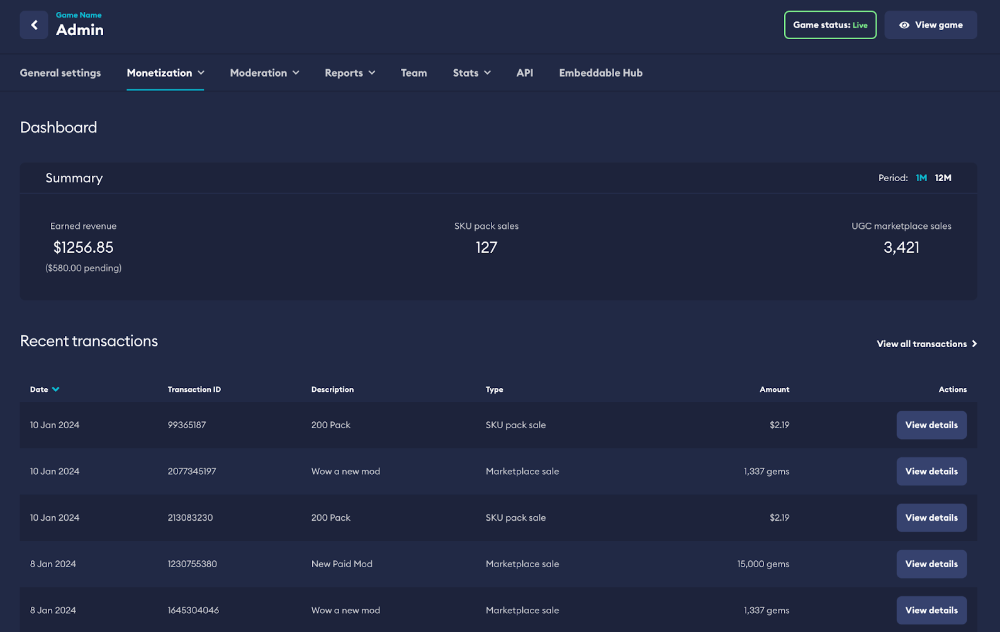
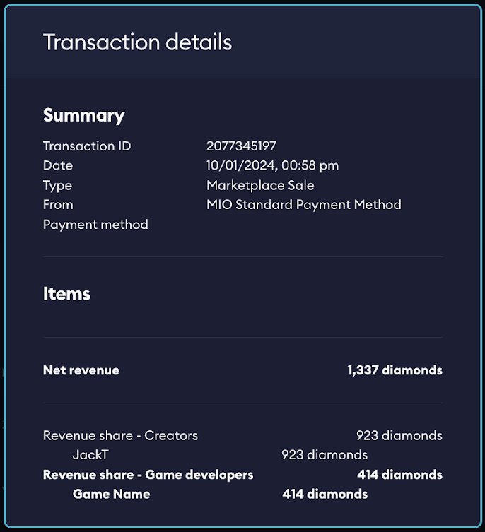

# Marketplace Dashboard

Once you’ve worked through the [Onboarding Guide](/monetization/onboarding) for [Marketplace](/monetization/marketplace), you should see new menu options appear in the Marketplace section of your mod.io **Game Admin** panel.

:::tip[Game Admin]
Your Game Admin settings can be accessed via your mod.io [My Content](https://mod.io/content) page.
:::

This guide covers:

* [Dashboard](#dashboard)
* [Settings](#settings)
* [Transactions](#transactions)
* [Entity Team](#entity-team-kyb-only)
* [Revenue share](#revenue-share-kyc-only)

## Dashboard

Your dashboard will show a snapshot of your Marketplace economy including a summary of your sales and earnings for the past month and year, as well as the most recent transactions.

:::note
Your dashboard provides you a snapshot into the latest activity within your marketplace.
:::

## Settings

- **Marketplace** - You will be able to adjust the settings you configured as part of your onboarding here. These are the same controls and options you enabled in [Monetization settings](/monetization/onboarding#monetization-settings). This is where you manage your SKUs, content pricing and revenue share.
- **Partner Program** - Direct access to the configuration of [Partner Program](/monetization/partner) settings can also be found here.
- **Financial Contact Info**  - If you wish to update or change the assigned Financial Contact, you can access these details at any time. We will use this information to send any invoices owing.
- **In-App Purchases** - To enable cross-platform functionality for Marketplace purchases, it's essential to configure your available platforms. Enter your API keys and pertinent details for these platforms in this section.

## Transactions

- **Transactions** - This section enables you to review all transactions carried out on the game marketplace. You can apply filters to distinguish between SKU sales and UGC sales, or delve into individual transactions to examine the revenue trail and, if applicable, process refunds for eligible transactions.
- **Invoices** - A full visible list of all pending and historical [invoices](/monetization/invoices) can be viewed in this section.

:::note
Explore detailed views of individual transactions to track the revenue trail, revealing comprehensive information about all parties involved in the transaction.
:::

## Entity team (KYB only)

You will have the ability to define who, from your game team on mod.io, will have full access to functions such as payouts, transaction details, and history. You will be able to adjust this at any time in this section.

## Revenue share (KYC only)

One of the benefits of the Monetization system is the ability to specify what portion of funds go to each individual member of your game team. This means if you have it set as receiving 60% as part of the revenue then at the time of transaction you will automatically receive 60% of the game team’s share of that transaction automatically to your own personal wallet.