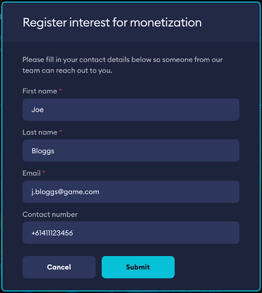
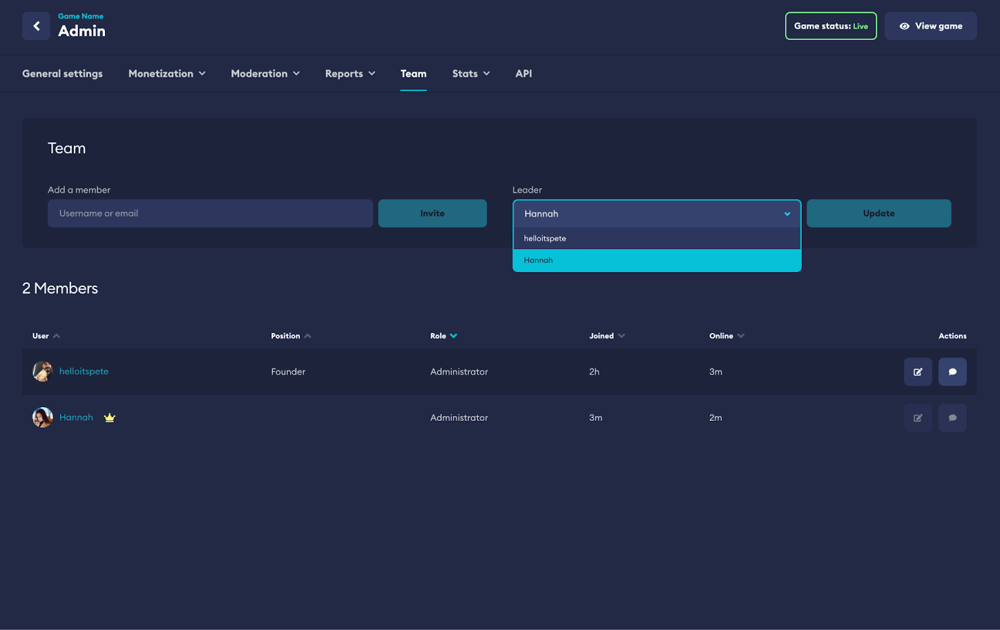

# Enabling Marketplace

You can request an introduction to [Marketplace](/monetization/marketplace) from your game’s dashboard. Our experts will work with you to help set up and integrate your game and dashboard with the Marketplace functionality.

:::tip[Game Dashboard]
Your game's dashboard settings can be accessed via your mod.io [**My Content**](https://mod.io/content) page.
:::

Once enabled by our team, you will be able to onboard, set up and control [Monetization](/monetization) functionalities through your game admin dashboard. These settings are only accessible if you are the team leader for your title.

:::note[We're here to help]
Requests go to our support team who will work directly with you every step of the way.
:::

:::tip
Team leader access can be managed through your Team page in your dashboard.
:::