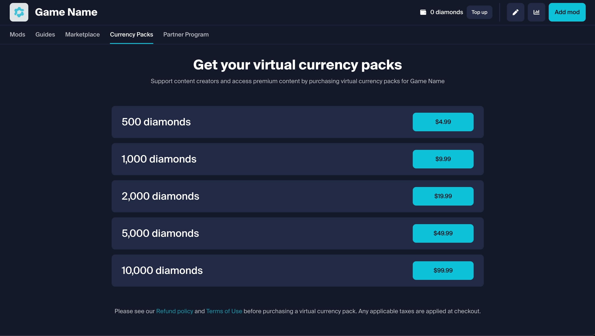
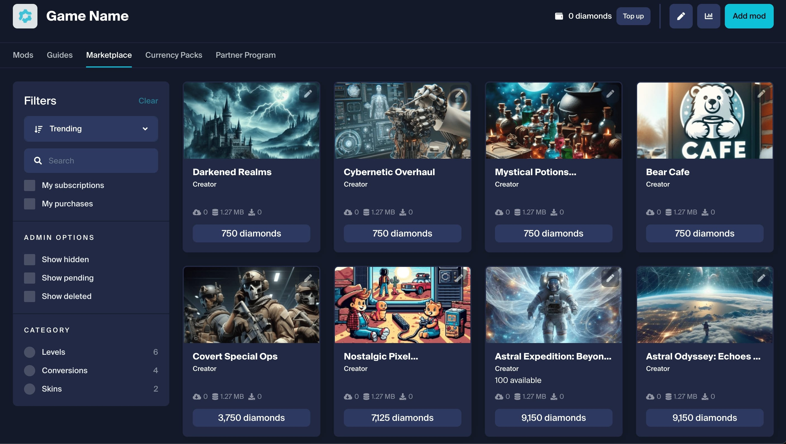
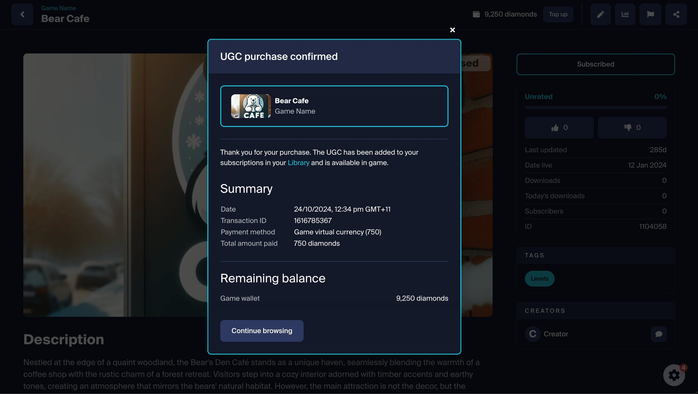
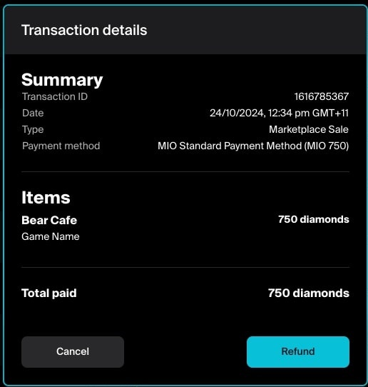

# Marketplace In Action

Now [Marketplace](/monetization/marketplace) is all set up, you can manage its flow from your **Game Admin** settings.

* [Marketplace tab](#marketplace-tab)
* [Purchase flow](#purchase-flow)
* [Refunds](#refunds)
* [Next steps](#next-steps)

## Marketplace tab

When Marketplace is enabled, a Marketplace tab will appear on your mod.io game profile. This will list all UGC that has been approved for sale.

As a studio you will have the ability to subscribe to all paid UGC automatically, or purchase it directly to support creators.

:::note
Players are able to purchase Virtual Currency credits to exchange for UGC content, or purchase content directly when set up with USD Pricing.
:::

:::note
Approved premium content is made available in the Marketplace.
:::

## Purchase flow

Creators are able to list content on the Marketplace for defined prices, once listed on the Marketplace, players are able to purchase said content using their credits (or perform direct purchases when set up with USD Pricing). Player credit balances are unique and specific to each game to meet compliance with external platforms.

:::note
Players can utilize their credit balance to exchange for premium UGC content.
:::

Once purchased, the player is automatically subscribed to the premium UGC and that UGC is made available for them in-game.

## Refunds

Players will be able to self-service refund any transactions they have made through their Account on mod.io, with some restrictions detailed below.

- **Virtual Currency Packs** - Players can request a refund for any unused Virtual Currency Packs they have purchased via the mod.io website within 30 days of purchase. If they've used any part of the credits purchased, it won't be eligible for a refund. One Virtual Currency Pack refund request is available automatically every year. If they've purchased Virtual Currency Packs through other platforms (ex: Steam, Microsoft Store, PlayStation™Store), they’ll need to request a refund through the relevant platform, and follow their own refund policy.

- **Premium UGC** - With marketplace using virtual currency, players can refund a premium UGC purchase via the mod.io website within 7 days of purchase. Up to eight refunds of premium UGC purchases are available automatically every year. When using USD pricing, the refund period of 30 days applies, same as for virtual currency packs.

The studio will also be able to refund transactions on behalf of the player if the transaction has been made within 30 days.

:::note
Self service refunds are available for all purchases within a set time frame.
:::

## Next steps

If you are selling mod.io virtual currency through a platform store, you'll likely need to set up a [Purchase Server](/monetization/purchase-servers).

Before things are in flight, you can also set up a [testing environment](/monetization/payment-testing) to explore Marketplace and test payments. 

Also make sure to get across our [Invoices](/monetization/invoices) and [Earnings & Payouts](/monetization/earnings) guides.