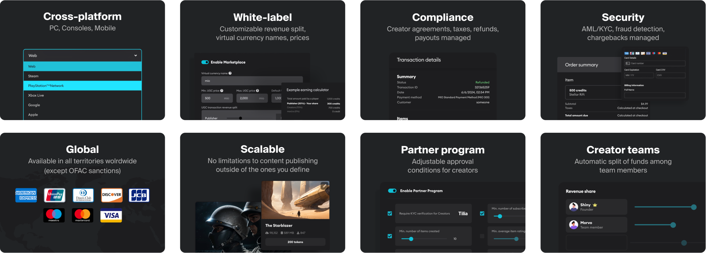

# Marketplace

The Marketplace functionality allows content creators to monetize premium UGC (User-Generated Content) in-game, on any platform, to a worldwide audience – generating new sources of revenue for game studios and content creators. This guide is designed for game studios and publishers pursuing Marketplace as a service offering for their game.

## Supported setup guides

Below is a list of the supported engines and the relevant setup guides.

| Engine    | Supported | Guide |
| -------- | ------- | ------- |
| [Unreal Engine](/unreal)  | Yes    | [Setup Guide](/unreal/marketplace)    |
| [Unity](/unity) | Yes     | [Setup Guide](/unity/marketplace)   |
| [C++ SDK](/cppsdk)   | Yes    | [Setup Guide](/cppsdk/marketplace)   |
| [REST API](/restapi)  |  Yes  | [Endpoints Guide](/restapi/monetization) |

## Marketplace at a glance

### Flexible and customizable

Studios define how revenue is split with their content creators. You have control to adjust to a model that works best for you and your community.

### White label solution

You can customize things to fit your game and brand, such as the name and amounts of virtual currency your players will purchase to buy UGC from your marketplace, and what prices are allowed for premium UGC. 

### Virtual Currency or USD Pricing

You can choose between using virtual currency for the transactions within Marketplace, or set fixed prices in USD (which will be converted to local currencies on external platforms).

### Secured and scalable 

Backed by a KYC/KYB verification process for all users and businesses, our system is entirely PSD2, PCI, and sales tax compliant, supporting payments in 180 countries. All regulatory obligations are managed through Thunes, our digital payment solution, ensuring a secure end-to-end payment with built-in fraud detection.

### Full control 

As a studio or publisher, you control the conditions for content to be sold on your Marketplace. Our Partner Program allows you to decide which creators in your community are able to monetize within your game. And your game admin dashboard gives a wide range of controls, metrics, and critical insights; allowing you to configure and optimize the creator economy for your game, and decide what content can be sold.

The mod.io Marketplace is currently accessible through invitation only. You can dive into the guide below for a walkthrough of the system's inner workings. To explore further, see a live demo, or kickstart your game's monetization journey, feel free to [contact us](/support/contacts) at any time.
