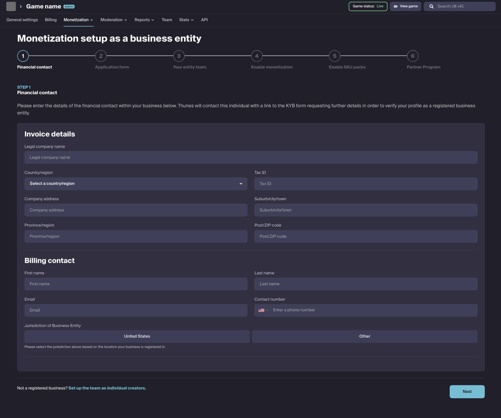
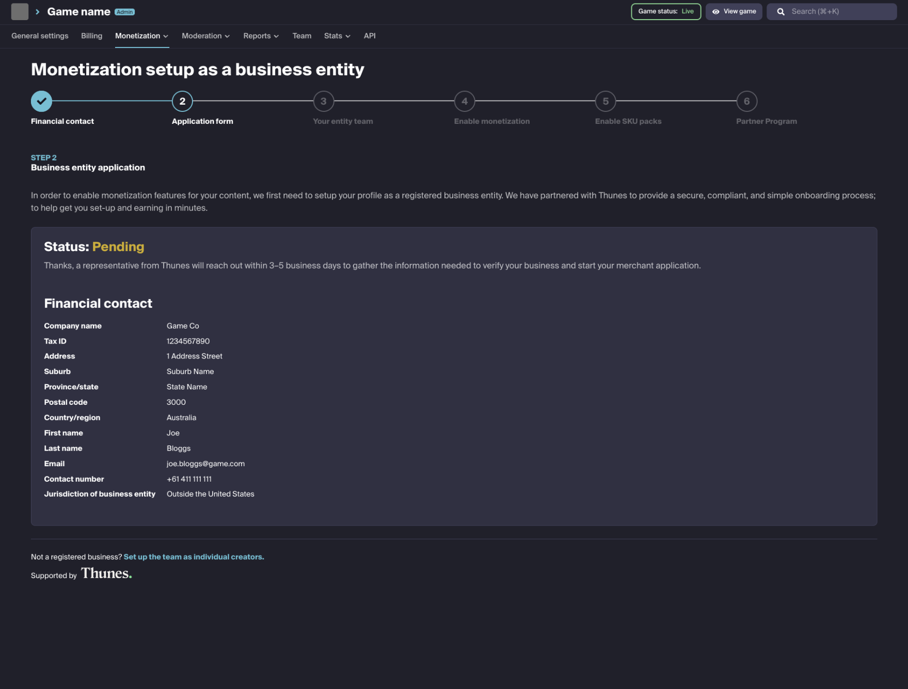
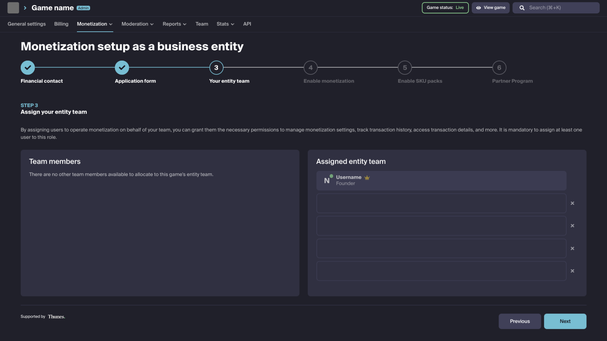
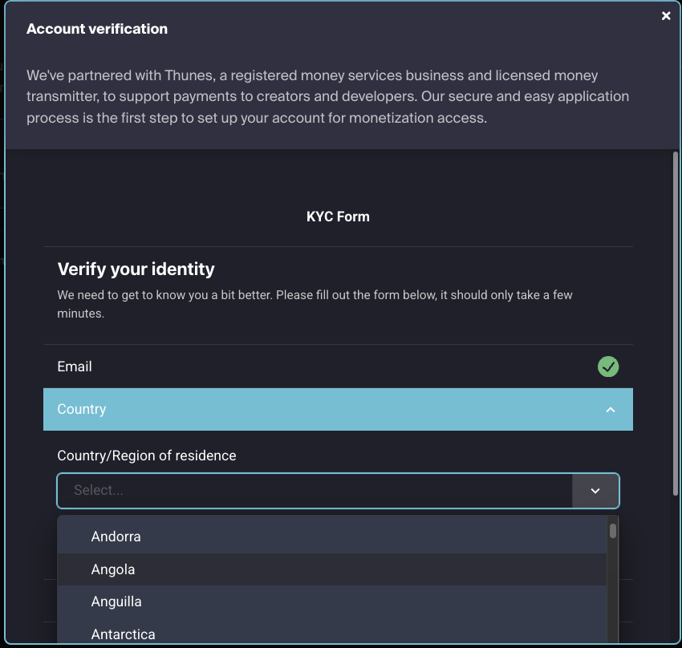
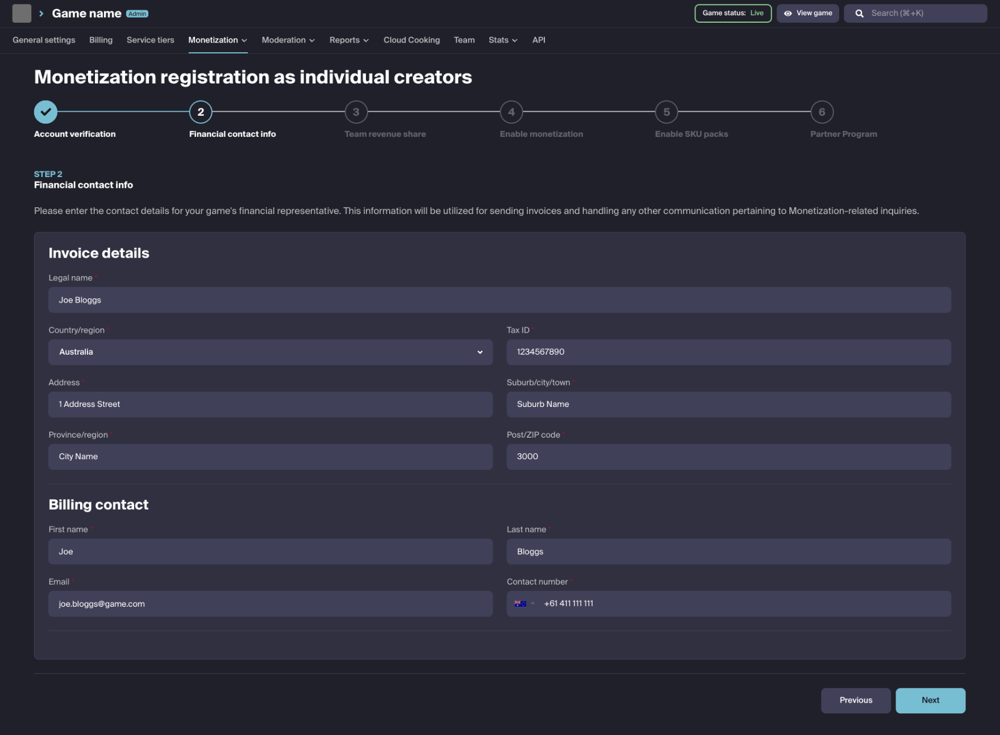
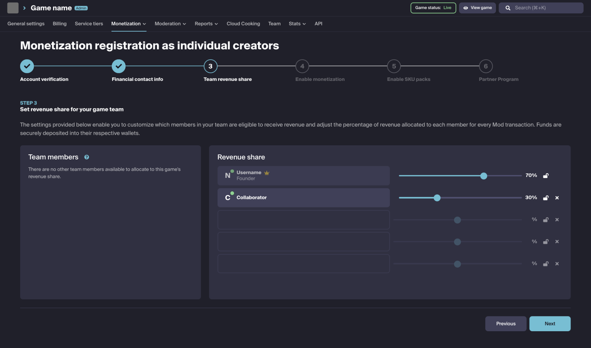
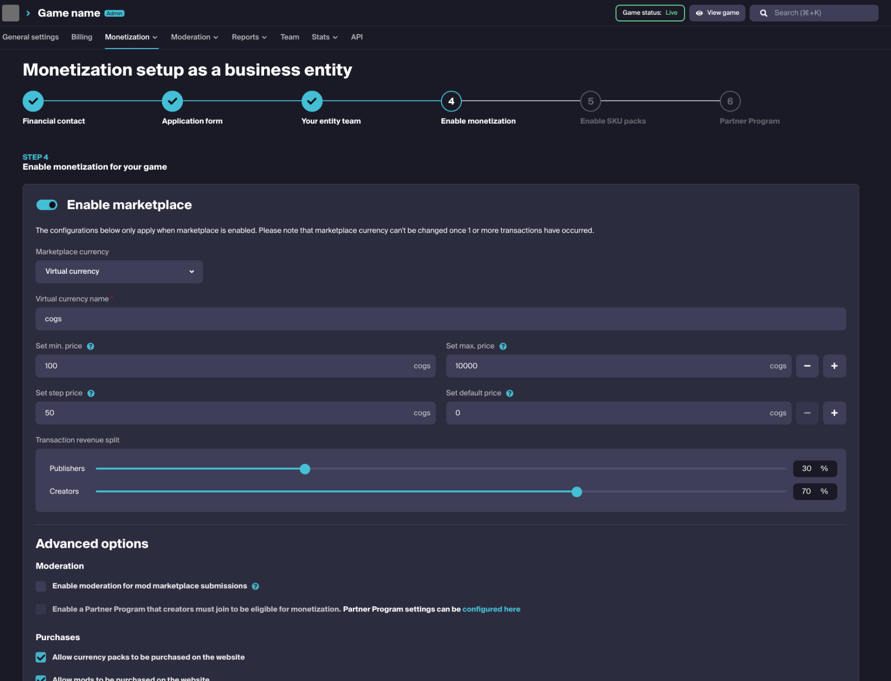
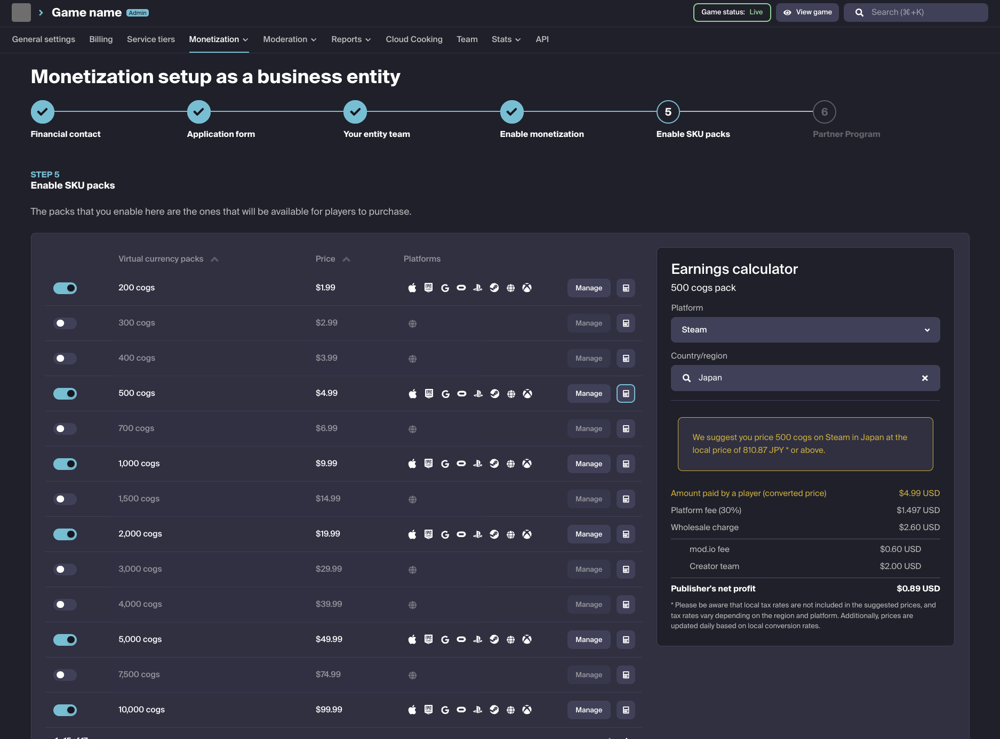

# Marketplace Onboarding

In order to meet global financial regulations and compliance requirements and ensure a secure ecosystem, we require all publishers to verify through one of two methods: as a **business entity** or as **individual creators**. 

### As a business entity

Our business entity flow is used when you’re setting up your studio for Monetization services as a business and ensure payments get made directly to the business itself. 

This uses the Know Your Business (KYB) financial verification process and will collect information about your business entity, such as its legal structure, registration details, ownership information, and any other relevant details. This is to prevent businesses from engaging in illegal or unethical activities.

### As individual creators

Our individual creator flow is used when you’re setting up your studio for Monetization services as an individual or group of individuals and ensure payments can be made directly to each individual. 

This uses the Know Your Customer (KYC) financial verification process and will collect information such as your name, address, date of birth, taxation and other relevant details. You will also need to provide supporting documentation like government-issued IDs, utility bills, and more, to verify your identity.

This guide covers:

* [Business entity onboarding](#business-entity-onboarding)
* [Individual creator onboarding](#individual-creator-onboarding)
* [Monetization settings](#monetization-settings)
* [Virtual Currency Packs](#virtual-currency-packs)

## Business entity onboarding

If you choose to onboard as a business entity, you will see the following steps in your onboarding process that are unique to setting up your business for monetization.

### Financial contact

You have the ability to designate someone within your organization as the financial contact.

This individual will be able to provide the required financial information about your business and also act as the billing contact. We will use this information to send the application form and any eventual invoices. 

:::tip
You can change this contact at any time through your monetization settings.
:::

:::note
The financial contact will be used for invoicing and onboarding purposes.
:::

### Application form

After you submit your financial contact details, a Thunes representative will contact you within 3–5 business days to collect the information needed to verify your business. This verification is a manual step and is required to begin your merchant application with our payment partner, Thunes.

:::note
Your status will show as Pending while Thunes reviews your application, and you won't be able to continue your monetization setup during this time. Your status updates to Approved automatically once the review is successful, allowing you to proceed.
:::

### Setup entity team

You will have the ability to define from your game team on mod.io who will have full access to functions such as payouts, transaction details, and history. You will be able to adjust this at any time through your monetization settings.

:::note
Anyone on your entity team will have full access to operate Marketplace functionality.
:::

## Individual creator onboarding

If you choose to onboard as (an) individual(s), you will see the following steps in your onboarding process.

### Team leader account verification

In order to start, we first need to verify your identity. We provide an easy-to-use automated solution with the help of our payment partner, Thunes. The verification process will ask you for information such as your email, location, tax and contact information. 

This information is stored confidentially and the process is automated, though in some cases, it can take up to 48 hours if a manual verification is required.

:::note
The verification services are provided by our partner Thunes.
:::

### Financial contact

You have the ability to specify a separate individual as the financial contact or fill this information in with your own details. We will use this information to send invoices. You will be able to change this contact at any time through your monetization settings.

:::note
The financial contact will be used for invoicing purposes.
:::

### Team revenue share

You are able to specify what portion of revenue goes to each individual member of your game team (if applicable). This split is applied on the revenue going to the game studio (after creator share, and other fees are applied), and will be received directly to your own personal wallet(s).

:::note
Revenue share splits can be adjusted at any time and will affect all future transactions.
:::

## Monetization settings

Now that you’ve verified and onboarded your team, you are able to turn on and adjust the marketplace functionality for your game:

- **Virtual Currency or USD Pricing** - Define if content will be sold with a price in virtual currency (players buy virtual currency packs, and then use that virtual currency to purchase content) or USD Pricing (players purchase content directly at a set price in USD or local currency on external platforms).
- **Virtual Currency name** - The default name for virtual currency is cogs, but you can change the name of your virtual currency to something that matches your game context. This name will be shown anywhere the virtual currency is referenced within your marketplace.
- **Minimum and maximum price** - These values restrict content sold in the marketplace to be limited to prices within this range.
- **Default price** - Sets the default/recommended value populated in the price field when creators set up their content for sale.
- **Transaction revenue split** - Allows you to change the default revenue share split between creators and you as the game publisher. You can see which share each party will get in the split calculator on the right side.
- **Enable moderation for mod marketplace submissions** - Activating this will require all content added to the Marketplace by creators to be [manually approved](/monetization/approving-premium-ugc) by your team.
- **Allow currency packs to be purchased on the website** - Allows the ability to disable purchasing of currency packs on the Web
- **Allow mods to be purchased on the website** - Allows the ability to disable purchasing of UGC on the Web.
- **Allow players to self-refund mod transactions on the website** - If this is enabled, it allows players to be able to refund UGC transactions from their dashboards within 30 days, and up to 8 times a year.
- **Hide marketplace for users not in the Partner Program** - If this is turned on, users will not be able to see marketplace related menus and content unless they are part of the Partner Program.
- **Enable selling mods in limited quantity** - If this is turned on, content sold on the marketplace can be limited to a quantity amount set by creators. Once that quantity has been exhausted, the mod will no longer be able to be sold on the marketplace. This is completely optional and controlled by creators unless force limited quantity is enabled.

:::note
Marketplace settings can be adjusted at any time through your dashboard.
:::

## Virtual Currency Packs

You are able to set up Virtual Currency Packs for users to purchase. Virtual Currency amounts and prices are predefined to prevent any possibilities of arbitrage within our platform, external platforms, and any games utilizing our Monetization services.

You can define the availability of each individual predefined Virtual Currency Pack, in addition to defining what platforms these Virtual Currency Packs are available on.

:::warning
You must ensure that the Virtual Currency Packs you make available on mod.io match the SKUs of any platforms you wish to make the Virtual Currency Pack available for purchase. We provide a way for you to map these Virtual Currency Packs with the ability to enter the SKU id provided by external platforms.
:::

This ensures we are able to correctly reconcile funds received on external platforms and pay out Creators. An example earnings calculator is visible to see what is received by whom on a sale of a Virtual Currency Pack.

:::note
Virtual Currency Packs can be mapped to Virtual Currency Pack SKUs sold on external platforms.
:::

## Regional Pricing

Please note that mod.io will always invoice $0.0052 for every Virtual Currency sold, regardless of the originating platform, country and currency of the customer.  Most platforms will charge customers in their local currency, such as the PlayStation Store, XBOX Games Store, Steam and Epic Games Store.  When setting up VC SKUs, platforms will also suggest local currency prices for those markets.  Please make sure when suggesting prices to your platform partners that the wholesale or local SRP is at a level to account for the cost of Virtual Currency granted in USD.  In rare cases, due to various economic reasons, some local market suggested prices may be insufficient.

We recommend paying particular attention to the following markets: Japan, Argentina, Indonesia, South Korea, Turkey, and Ukraine.

**Additional Notes**

- Transactions made through mod.io's web payment method are charged to the customer in USD. 
- If you use Steam's Steam Inventory System as recommended in our marketplace setup, prices are set to a USD standard that you provide.