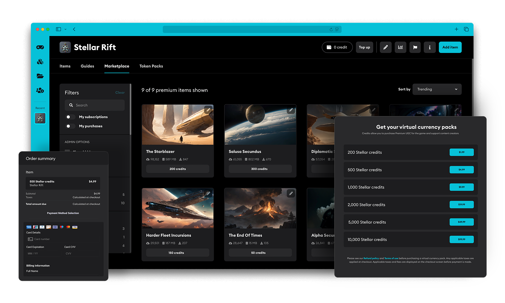

# Monetization

The inclusion of UGC in your game creates a few opportunities to generate revenue for your studio. Marketplace is our monetization solution for buying and selling UGC, and we currently have more monetization options in the works.

## Marketplace

mod.io provides a complete end-to-end UGC monetization strategy with [Marketplace](/monetization/marketplace) integration for your game. This solution supports everything from web-based transactions to in-game purchases.

## Partner Program

The [Partner Program](/monetization/partner) is an optional Monetization strategy that provides the ability to vet content creators who wish to monetize their UGC creations.

## Purchase servers

[Purchase Servers](/monetization/purchase-servers) are required if you are selling mod.io [Virtual Currency](/monetization/how-it-works) through a platform store, as you will need a service to consume the entitlements and apply them to players mod.io accounts. You can either set one up via mod.io or your game studio.

## Future Monetization

UGC offers a variety of monetization opportunities for studios and we are currently exploring a suite of extra monetization options such as patron donations and engagement payments. [Learn more](/monetization/next-steps#future-features).