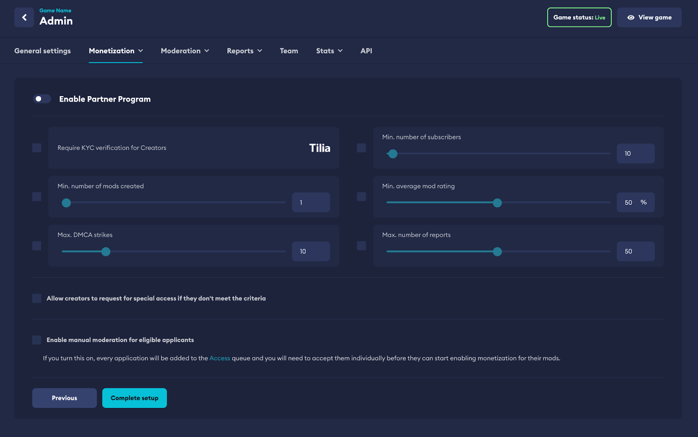

# Partner Program

The Partner Program is a [Monetization](/monetization) feature that provides the ability to vet content creators who wish to monetize their UGC creations. When used effectively, the Partner Program allows you to set the right bar for your content creators to be able to monetize content within your game, and manage the flow of premium UGC through your ecosystem.

## Set up criteria

It's up to you to define any criteria required for creators to be able to monetize their content for your game. This can all be done from your **Game Admin Dashboard** found via the [My Content](https://mod.io/content) page.

:::note
Make sure you have read the [Onboarding](/monetization/onboarding) section of the Marketplace documentation before proceeding.
:::

When setting up the Partner Program, the criteria you’re able to use is as follows:

- **Creator must be verified** - By toggling this requirement, it will force every creator to onboard via KYC. By default, KYC verification is only required for cash-out to prevent any hurdles to earning on the platform.
- **Min number of mods created** - Requires a creator to have this many mods uploaded to mod.io in order to apply. Mod counts are platform-wide and not game-specific.
- **Min number of subscribers** - Requires a creator to have this many subscribers on mod.io in order to apply. Subscriptions are platform-wide and not game-specific.
- **Min average mod rating** - Requires a creator to meet this minimum average rating for their content in order to apply.
- **Max DMCA strikes** - Defines the maximum amount of DMCA strikes a creator has had before they can be rejected. DMCA strikes are platform-wide and not game-specific.
- **Max number of reports** - Defines the maximum number of reports a creator can have before they can be rejected. Count is platform-wide and not game-specific.
- **Allow creators to request for special access** - Toggling this will allow creators to manually apply even if they don’t meet the pre-set criteria. Applications will go to the Partner Program queue under Moderation and need to be approved by the game team. This is helpful if you want to allow established creators to be able to apply to be a Monetization Partner.
- **Enable manual moderation** - Toggling this will require all applicants who have met the above criteria to be manually approved as the final step by the game team before they can be in the Partner Program (by default, applications meeting your set criteria are approved automatically). Applications will go to the Partner Program queue under Moderation and need to be approved by the game team.

:::note
The Partner Program is entirely optional and can be enabled or disabled at any time.
:::

:::note
Creators are able to see real time progress towards the criteria defined on the game’s profile page on mod.io.
:::