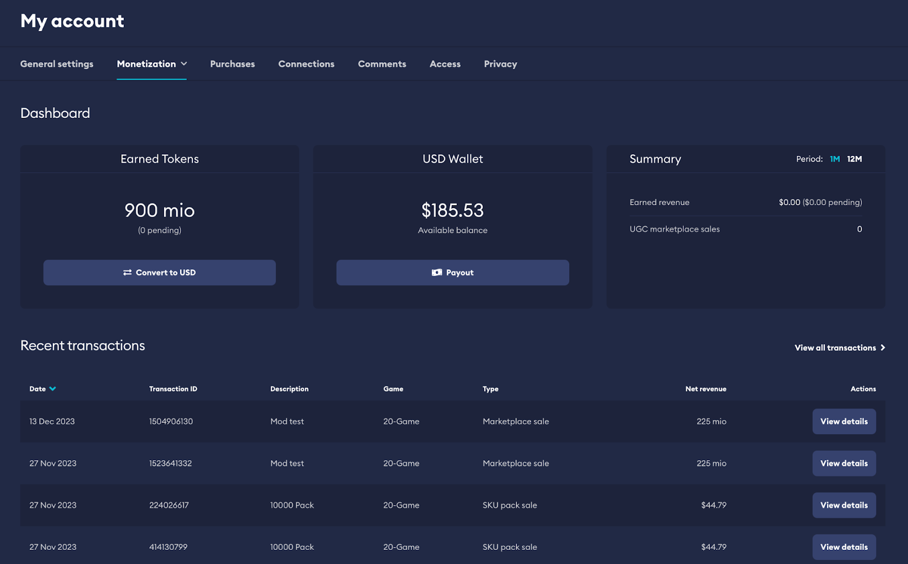
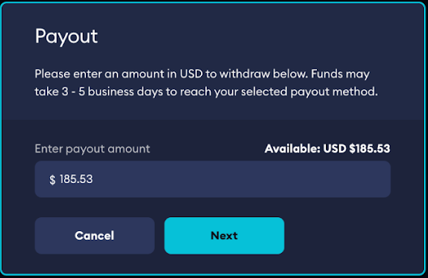

# Earnings & Payouts

If you have onboarded your game through KYB, any funds marked as available in your USD wallet will be paid out automatically every month via wire transfer by our payment partner, Thunes.

A representative from Thunes will reach out to the Financial Contact marked in your Monetization Settings to obtain the information needed.

You will be able to see your balance at any time through your Game Admin dashboard on mod.io.

If you have onboarded your game through KYC, you will be able to see your balance through your Account on mod.io.

:::note
Available and any pending balances are visible on your dashboard.
:::

You will be able to request funds to be paid out via the specified payout method of your choosing through an integrated payout process.

Any earnings received as part of premium UGC transactions will be earned as Creator Credits. Credits received are held for 30 days from the time of transction before they can be paid out. This is to account for any potential refunds. If a piece of content was purchased on external platforms, then credits are held until the invoice is paid by the studio or publisher.

Once credits are available, you are able to request funds to be paid out.

Credits convert at a fixed rate of USD$0.004 per credit as explained in [How It Works](/monetization/how-it-works).

:::note
You are able to cash out any available USD funds to a specified PayPal account.
:::