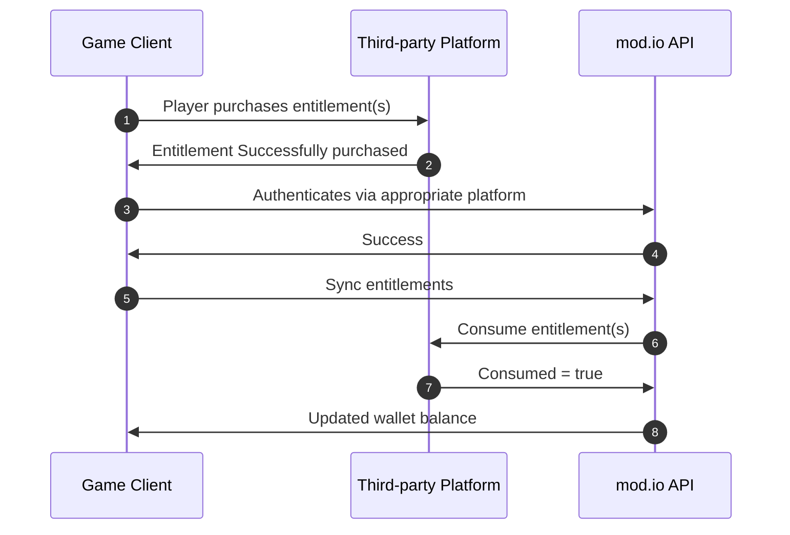
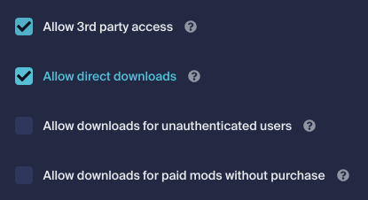

# mod.io as Purchase Server

mod.io operating as a [purchase server](/monetization/purchase-servers) is the most frictionless, and recommended approach for integrating [Marketplace](/monetization/marketplace) support into your title. When using any of our plugins, this is the flow that is used by default. If you require more control over the monetization of mods within your title, please see our guide for [operating your own purchase server](/monetization/studio-as-purchase-server).

This guide covers:

* [Prerequisites](#prerequisites)
* [Testing environment](#testing-environment)
* [Terminology](#terminology)
* [Concepts](#concepts)
* [Implementation](#implementation)
* [Securing access to Premium UGC downloads](#securing-access-to-premium-ugc-downloads)
* [Error reference](#error-reference)

## Prerequisites

To use mod.io Marketplace, you must have the following steps completed:

- A title registered within mod.io with [Marketplace functionality enabled](/monetization/enabling).
- SKU's registered to your mod.io game profile with [entitlements mapped](#entitlement-mapping), if you are using a third-party store.
- Platform authentication for the platform where you intend to enable marketplace (i.e. Login with Xbox Live).

We also strongly encourage developers to utilize our official plugins and SDKs whenever possible, as these tools are specifically designed to abstract away much of the underlying complexity and get you up and running sooner. For implementation details related to specific plugins and SDK's, please see the following implementation guides:

- [Unreal Engine](/unreal/marketplace)
- [Unity](/unity/marketplace)
- [C++ SDK](/cppsdk/marketplace)

## Testing environment

Please note the test environment domain is slightly different from production and should be called as follows:

```
https://g-{your-game-id}.test.mod.io/
```

For more on testing payments, see our [Monetization Testing](/monetization/payment-testing) guide.

## Terminology

There are a few terms to understand as you begin to implement monetization into your title(s). To make things a bit easier, here is a list of the most important entities and how they fit into our monetization solution.

Entity|What is it?|Controlled by
---|---|---
Premium UGC | User generated content that can be bought or sold from the Marketplace. | 
Virtual Currency | The currency that a player exchanges in return for premium UGC - irrespective of the vanity name your game uses for it. | mod.io
Currency Pack | A pre-configured pack containing a specific amount of virtual currency. | mod.io
Wallet | A wallet where any virtual currency you own resides. | mod.io
Entitlement | A user-purchased digital right to a currency pack, which is always purchased through platform stores such as Steam, Xbox Live, PlayStation™Network, Meta, etc and exchanged with mod.io for virtual currency. | Third-party platforms

## Concepts

### Entitlement mapping

Entitlement Mapping is the process of associating a third-party platform store entitlement with a mod.io currency pack. This step is essential for informing mod.io what amount of virtual currency should be attributed to a player when they purchase and [sync a platform store-purchased entitlement](#3-sync-platform-entitlements-to-modio). Depending on the store used, please see the following guides for registering the mappings.

- [Steam](/platforms/steam/marketplace)
- [PlayStation™Network](https://docs.mod.io/partners/ps5/marketplace) ([NDA access required](/platforms/console-sdks))
- [Xbox Live](https://docs.mod.io/partners/xbox/marketplace) ([NDA access required](/platforms/console-sdks))
- [Apple (iOS)](/platforms/apple/marketplace)
- [Google Play (Android)](/platforms/google/marketplace)
- [Meta Quest](/platforms/meta/marketplace)

## Implementation

### 1. User wallets

For a user to purchase premium UGC, they must first have a wallet. The intention is for this endpoint to be used in-game to:

- Register the user with the marketplace.
- Create or fetch a wallet for the user in your game.
- Read balances of the wallet.
- Read the deficit of a wallet. (Note: The deficit refers to any amount the user owes the marketplace in cases where a refund could not be fully processed.)

#### Get wallet

##### Request

`GET https://g-{your-game-id}.modapi.io/v1/me/wallets`

##### Headers

Header|Type|Required|Description
---|---|---|---|
Authorization|string|true|The user's mod.io access token.


```
GET https://g-{your-game-id}.modapi.io/v1/me/wallets HTTP/1.1
Accept: application/json
Authorization: Bearer {access-token}
```

##### Response

```json
{
    "type": "standard_mio",
    "currency": "mio",
    "payment_method_id": "81a9h105-63bf-16f2-9352-3fdac4662e7d",
    "balance": 200,
    "pending_balance": 0,
    "deficit": 0,
    "monetization_status": 33,
    "game_id": 2795
}
```

##### Response schema

Name|Type|Description
---|---|---
type | string | The type of the wallet.
payment_method_id | string | The payment_method_id of the wallet.
game_id | integer | The associated `game_id` if it's a game wallet.
currency | string | The currency of the wallet.
balance | integer | The balance of the wallet.
pending_balance | integer | The pending funds of the wallet that are not available to be spent.
deficit | integer | The deficit of the wallet.
monetization_status | integer | The status of a monetized user for the corresponding status. Possible values: <ul><li><strong>0</strong> = Unregistered</li><li><strong>1</strong> = Pending</li><li><strong>2</strong> = Rejected</li><li><strong>4</strong> = Review</li><li><strong>8</strong> = Action</li><li><strong>16</strong> = Approved</li><li><strong>32</strong> = Member</li></ul>

### 2. Purchasing entitlements & Virtual Currency

When it comes to a user purchasing virtual currency it depends on where your mod.io marketplace integration exists. The table illustrated below describes what store path you must take when enabling monetization within your title on mod.io.

<table>
  <tr>
    <th>Platform</th>
    <th>Type</th>
    <th>Step to convert to Virtual Currency</th>
  </tr>
  <tr>
    <td>mod.io Website</td>
    <td>Virtual Currency</td>
    <td>Player purchases tokens directly from the mod.io website, and is ready to be used to purchase mods either in-game or via the website. No entitlement sync necessary.</td>
  </tr>
  <tr>
    <td>Xbox Live</td>
    <td rowspan="4">Entitlement</td>
    <td rowspan="4">Player purchases consumable entitlement via platform store. Game client syncs entitlements to mod.io in-game, converting the entitlement(s) into mod.io virtual currency.</td>
  </tr>
  <tr>
    <td>PlayStation™Network</td>
  </tr>
  <tr>
    <td>Steam</td>
  </tr>
  <tr>
    <td>Meta</td>
  </tr>
</table>

It is important to note that the only purpose entitlements serve in the process is to provide a compliant, and familiar store front to user's which must go through platform checkout processes. Once entitlements are [sync'd with mod.io](#3-sync-platform-entitlements-to-modio) as described below, they are converted into virtual currency and the entitlements no longer exist.

### 3. Sync platform entitlements to mod.io

:::important
This step is only required if you purchased entitlements through a [platform's store](#2-purchasing-entitlements--virtual-currency) to convert the platform entitlements into virtual currency on mod.io. If you purchased virtual currency via the mod.io website, this step is not necessary.
:::

To sync entitlements between a platform and mod.io you must first purchase a [mapped entitlement](#entitlement-mapping) in-game via the respective platform store and you can then sync the user's platform entitlements to mod.io and the relevant entitlements in the players platform inventory will be converted into mod.io virtual currency.

The only supported type of entitlements is consumables. As part of the entitlement syncing process, mod.io will consume the entitlement on behalf of the user which will remove it from their inventory on the platform where it was purchased.

Below is a high-level diagram of the flow of how a platform store entitlement is converted into mod.io Virtual Currency.



1. The game client uses the native platform store to purchase one or more entitlements which are mapped to Token packs on mod.io.
2. Platform allocates entitlement to player upon purchase.
3. The game client authenticates with mod.io via the platform that tracks the entitlements. As an example, if you purchase an entitlement on the Microsoft Store, you *must* authenticate with mod.io via the Xbox Live authentication flow.
4. A mod.io access token is returned to the game client.
5. Game Client instructs mod.io to sync the users platform entitlements to their mod.io account.
6. mod.io consumes _mapped_ entitlements on behalf of the user against the platform's inventory system.
7. Platform consumes the entitlement on behalf of the user.
8. mod.io updates the players wallet balance relative to the value of the token packs mapped to the entitlement(s).

#### Xbox Live

##### Request

`POST https://g-{your-game-id}.modapi.io/v1/me/iap/xboxlive/sync`

##### Headers

Header|Type|Required|Description
---|---|---|---|
Authorization|string|true|The user's mod.io access token.

##### Body

Parameter|Type|Required|Description
-------|---|---|---|
xbox_token|string|true|The Xbox Live token returned from calling [GetTokenAndSignatureAsync(""POST"", "https://*.modapi.io")](https://docs.microsoft.com/en-us/dotnet/api/microsoft.xbox.services.system.xboxliveuser.gettokenandsignatureasync?view=xboxlive-dotnet-2017.11.20171204.01). __NOTE:__ Due to the encrypted app ticket containing special characters, you must URL encode the string before sending the request to ensure it is successfully sent to our servers otherwise you may encounter an `422 Unprocessable Entity` response. For example, [cURL](https://ec.haxx.se/index.html) will do this for you by using the `--data-urlencode` option.

```
POST https://g-{your-game-id}.modapi.io/v1/me/iap/xboxlive/sync HTTP/1.1
Content-Type: application/x-www-form-urlencoded
Accept: application/json
Authorization: Bearer {access-token}

xbox_token=ey32954mg490fejnf823
```

##### Response

```json
{
  "wallet": {
    "balance": 200
  },
  "data": [
    {
      "transaction_id": "3925648920",
      "transaction_state": 2,
      "sku_id": "PACK001",
      "entitlement_consumed": true,
      "entitlement_type": 1,
      "details": null
    }
  ]
}
```

##### Response schema

Name|Type|Description
---|---|---
wallet | object | Contains wallet data.
wallet.balance | integer | The amount of virtual currency in the wallet.
data | array | Contains entitlement data.
data[].transaction_id | string | The mod.io transaction ID for the entitlement transfer.
data[].transaction_state | integer | The mod.io transaction state from converting the portal entitlements into mod.io assets / currency. Possible values:<ul><li><strong>0</strong> = Failed</li><li><strong>1</strong> = Pending</li><li><strong>2</strong> = Fulfilled</li><li><strong>3</strong> = Consume Limit Exceeded</li></ul> 
data[].sku_id | string | The portal SKU ID associated with the transaction. This will be the ID as defined by the portal (i.e. Xbox Live).
data[].entitlement_consumed | boolean | Has the entitlement been consumed in the third-party portal?
data[].entitlement_type | integer | The entitlement type, once consumed and the entitlement is transferred to mod.io. Possible values:<ul><li><strong>0</strong> = Virtual Currency</li></ul>
details | object (nullable) | Additional information associated with the transaction.

#### PlayStation™Network

##### Request

`POST https://g-{your-game-id}.modapi.io/v1/me/iap/psn/sync`

##### Headers

Header|Type|Required|Description
---|---|---|---|
Authorization|string|true|The user's mod.io access token.

##### Body

Parameter|Type|Required|Description
-------|---|---|---|
auth_code|string|true|The auth code returned from the PlayStation™Network API.
env|integer|false|The PlayStation™Network environment you are targeting. If omitted, the request will default to targeting the production environment.
service_label|integer|false|The service label where the entitlements for mod.io reside. If omitted the default value will be 0.

```
POST https://g-{your-game-id}.modapi.io/v1/me/iap/psn/sync HTTP/1.1
Content-Type: application/x-www-form-urlencoded
Accept: application/json
Authorization: Bearer {access-token}

auth_code=v3.AbCdE&env=0&service_label=1
```

##### Response

```json
{
  "wallet": {
    "balance": 200
  },
  "data": [
    {
      "transaction_id": "3925648920",
      "transaction_state": 2,
      "sku_id": "PACK001",
      "entitlement_consumed": true,
      "entitlement_type": 1,
      "details": null
    }
  ]
}
```

##### Response schema

Name|Type|Description
---|---|---
wallet | object | Contains wallet data.
wallet.balance | integer | The amount of virtual currency in the wallet.
data | array | Contains entitlement data.
data[].transaction_id | string | The mod.io transaction ID for the entitlement transfer.
data[].transaction_state | integer | The mod.io transaction state from converting the portal entitlements into mod.io assets / currency. Possible values:<ul><li><strong>0</strong> = Failed</li><li><strong>1</strong> = Pending</li><li><strong>2</strong> = Fulfilled</li><li><strong>3</strong> = Consume Limit Exceeded</li></ul> 
data[].sku_id | string | The portal SKU ID associated with the transaction. This will be the ID as defined by the portal (i.e. Xbox Live).
data[].entitlement_consumed | boolean | Has the entitlement been consumed in the third-party portal?
data[].entitlement_type | integer | The entitlement type, once consumed and the entitlement is transferred to mod.io. Possible values:<ul><li><strong>0</strong> = Virtual Currency</li></ul>
details | object (nullable) | Additional information associated with the transaction.

#### Steam

##### Request

`POST https://g-{your-game-id}.modapi.io/v1/me/iap/steam/sync`

##### Headers

Header|Type|Required|Description
---|---|---|---|
Authorization|string|true|The user's mod.io access token.

##### Body

None

```
POST https://g-{your-game-id}.modapi.io/v1/me/iap/steam/sync HTTP/1.1
Accept: application/json
Authorization: Bearer {access-token}
```

##### Response

```json
{
  "wallet": {
    "balance": 200
  },
  "data": [
    {
      "transaction_id": "3925648920",
      "transaction_state": 2,
      "sku_id": "PACK001",
      "entitlement_consumed": true,
      "entitlement_type": 1,
      "details": null
    }
  ]
}
```

##### Response schema

Name|Type|Description
---|---|---
wallet | object | Contains wallet data.
wallet.balance | integer | The amount of virtual currency in the wallet.
data | array | Contains entitlement data.
data[].transaction_id | string | The mod.io transaction ID for the entitlement transfer.
data[].transaction_state | integer | The mod.io transaction state from converting the portal entitlements into mod.io assets / currency. Possible values:<ul><li><strong>0</strong> = Failed</li><li><strong>1</strong> = Pending</li><li><strong>2</strong> = Fulfilled</li><li><strong>3</strong> = Consume Limit Exceeded</li></ul> 
data[].sku_id | string | The portal SKU ID associated with the transaction. This will be the ID as defined by the portal (i.e. Xbox Live).
data[].entitlement_consumed | boolean | Has the entitlement been consumed in the third-party portal?
data[].entitlement_type | integer | The entitlement type, once consumed and the entitlement is transferred to mod.io. Possible values:<ul><li><strong>0</strong> = Virtual Currency</li></ul>
details | object (nullable) | Additional information associated with the transaction.

#### Meta

##### Request

`POST https://g-{your-game-id}.modapi.io/v1/me/iap/meta/sync`

##### Headers

Header|Type|Required|Description
---|---|---|---|
Authorization|string|true|The user's mod.io access token.

##### Body

Parameter|Type|Required|Description
-------|---|---|---|
device|string|true|The Meta device being used for authentication. Possible Options are `rift` and `quest`.
user_id|integer|true|The user's Meta Quest id providing by calling [ovr_GetLoggedInUserID()](https://developers.meta.com/horizon/documentation/native/ps-ownership) from the Meta Quest SDK.

```
POST https://g-{your-game-id}.modapi.io/v1/me/iap/meta/sync HTTP/1.1
Content-Type: application/x-www-form-urlencoded
Accept: application/json
Authorization: Bearer {access-token}

device=rift&user_id=32732194120
```

##### Response

```json
{
  "wallet": {
    "balance": 200
  },
  "data": [
    {
      "transaction_id": "3925648920",
      "transaction_state": 2,
      "sku_id": "PACK001",
      "entitlement_consumed": true,
      "entitlement_type": 1,
      "details": null
    }
  ]
}
```

##### Response schema

Name|Type|Description
---|---|---
wallet | object | Contains wallet data.
wallet.balance | integer | The amount of virtual currency in the wallet.
data | array | Contains entitlement data.
data[].transaction_id | string | The mod.io transaction ID for the entitlement transfer.
data[].transaction_state | integer | The mod.io transaction state from converting the portal entitlements into mod.io assets / currency. Possible values:<ul><li><strong>0</strong> = Failed</li><li><strong>1</strong> = Pending</li><li><strong>2</strong> = Fulfilled</li><li><strong>3</strong> = Consume Limit Exceeded</li></ul> 
data[].sku_id | string | The portal SKU ID associated with the transaction. This will be the ID as defined by the portal (i.e. Xbox Live).
data[].entitlement_consumed | boolean | Has the entitlement been consumed in the third-party portal?
data[].entitlement_type | integer | The entitlement type, once consumed and the entitlement is transferred to mod.io. Possible values:<ul><li><strong>0</strong> = Virtual Currency</li></ul>
details | object (nullable) | Additional information associated with the transaction.

### 4. Discovering Premium UGC

Now that we have an authenticated player with funds in their mod.io wallet, the player is now free to discover Premium UGC for purchase consideration. Discovery of Premium UGC on mod.io is effectively the same as non-monetized UGC where you call our [Get Mods API](/restapi/docs/get-mods), and ensure you are using the `revenue_type` filter so only Premium UGC is returned to the player as by default the endpoint will only return non-premium UGC.

:::info
This endpoint guide has been shortened and made specific to monetization filtering for brevity, for an exhaustive list of the filters available - please refer to the [API reference](/restapi/docs/get-mods).
:::

##### Request

`GET https://g-{your-game-id}.modapi.io/v1/games/{your-game-id}/mods?revenue_type=1`

##### Headers

Header|Type|Required|Description
---|---|---|---|
Authorization|string|true|The user's mod.io access token.

##### Body

Parameter|Type|Required|Description
-------|---|---|---|
revenue_type|integer|false|Finds all mods with or without a price. Defaults to free. Possible Values: <ul><li><strong>0</strong> = Free</li><li><strong>1</strong> = Paid</li><li><strong>2</strong> = Free & Paid</li></ul>


```
GET https://g-{your-game-id}.modapi.io/v1/games/{your-game-id}/mods HTTP/1.1
Accept: application/json
Authorization: Bearer {access-token}
```


```json
{
  "data": [
    {
      "id": 2,
      "game_id": 2,
      "status": 1,
      "visible": 1,
      "submitted_by": {
        "id": 1,
        "name_id": "xant",
        "username": "XanT",
        "display_name_portal": null,
        "date_online": 1509922961,
        "date_joined": 1509922961,
        "avatar": {
          "filename": "avatar.png",
          "original": "https://assets.modcdn.io/images/placeholder/avatar.png",
          "thumb_50x50": "https://assets.modcdn.io/images/placeholder/avatar_50x50.png",
          "thumb_100x100": "https://assets.modcdn.io/images/placeholder/avatar_100x100.png"
        },
        "timezone": "",
        "language": "",
        "profile_url": "https://mod.io/u/xant"
      },
      "date_added": 1492564103,
      "date_updated": 1499841487,
      "date_live": 1499841403,
      "maturity_option": 0,
      "community_options": 3,
      "monetization_options": 3,
      "credit_options": 0,
      "stock": 0,
      "price": 100,
      "tax": 0,
      "logo": {
        "filename": "card.png",
        "original": "https://assets.modcdn.io/images/placeholder/card.png",
        "thumb_320x180": "https://assets.modcdn.io/images/placeholder/card.png",
        "thumb_640x360": "https://assets.modcdn.io/images/placeholder/card.png",
        "thumb_1280x720": "https://assets.modcdn.io/images/placeholder/card.png"
      },
      "homepage_url": "https://www.rogue-hdpack.com/",
      "name": "Rogue Knight HD Pack",
      "name_id": "rogue-knight-hd-pack",
      "summary": "It's time to bask in the glory of beautiful 4k textures!",
      "description": "<p>Rogue HD Pack does exactly what you thi...",
      "description_plaintext": "Rogue HD Pack does exactly what you thi...",
      "metadata_blob": "rogue,hd,high-res,4k,hd textures",
      "profile_url": "https://mod.io/g/rogue-knight/m/rogue-knight-hd-pack",
      "media": {
        "youtube": [
          "https://www.youtube.com/watch?v=dQw4w9WgXcQ"
        ],
        "sketchfab": [
          "https://sketchfab.com/models/ef40b2d300334d009984c8865b2db1c8"
        ],
        "images": [
          {
            "filename": "card.png",
            "original": "https://assets.modcdn.io/images/placeholder/card.png",
            "thumb_320x180": "https://assets.modcdn.io/images/placeholder/card.png",
            "thumb_1280x720": "https://assets.modcdn.io/images/placeholder/card.png"
          }
        ]
      },
      "modfile": {
        "id": 2,
        "mod_id": 2,
        "date_added": 1499841487,
        "date_updated": 1499841487,
        "date_scanned": 1499841487,
        "virus_status": 0,
        "virus_positive": 0,
        "virustotal_hash": "",
        "filesize": 15181,
        "filesize_uncompressed": 16384,
        "filehash": {
          "md5": "2d4a0e2d7273db6b0a94b0740a88ad0d"
        },
        "filename": "rogue-knight-v1.zip",
        "version": "1.3",
        "changelog": "VERSION 1.3 -- Changes -- Fixed critical castle floor bug.",
        "metadata_blob": "rogue,hd,high-res,4k,hd textures",
        "download": {
          "binary_url": "https://*.modapi.io/v1/games/1/mods/1/files/1/download/c489a0354111a4d76640d47f0cdcb294",
          "date_expires": 1579316848
        },
        "platforms": [
          {
            "platform": "windows",
            "status": 1
          }
        ]
      },
      "dependencies": false,
      "platforms": [
        {
          "platform": "windows",
          "modfile_live": 1
        }
      ],
      "metadata_kvp": [
        {
          "metakey": "pistol-dmg",
          "metavalue": "800"
        }
      ],
      "tags": [
        {
          "name": "Unity",
          "name_localized": "Unity",
          "date_added": 1499841487
        }
      ],
      "stats": {
        "mod_id": 2,
        "popularity_rank_position": 13,
        "popularity_rank_total_mods": 204,
        "downloads_today": 327,
        "downloads_total": 27492,
        "subscribers_total": 16394,
        "ratings_total": 1230,
        "ratings_positive": 1047,
        "ratings_negative": 183,
        "ratings_percentage_positive": 91,
        "ratings_weighted_aggregate": 87.38,
        "ratings_display_text": "Very Positive",
        "date_expires": 1492564103
      }
    }
  ],
  "result_count": 1,
  "result_offset": 0,
  "result_limit": 100,
  "result_total": 1
}
```

### 5. Purchasing premium UGC

Now that you have virtual currency in your wallet, it is now possible to purchase premium UGC on behalf of an authenticated user. To purchase premium UGC, you can call the [Checkout API endpoint](/restapi/docs/purchase) which upon success will appear in the user's purchased mod library.

##### Request

`POST https://g-{your-game-id}.modapi.io/v1/games/{game-id}/mods/{mod-id}/checkout`

##### Headers

Header|Type|Required|Description
---|---|---|---|
Authorization|string|true|The user's mod.io access token.

##### Body

Parameter|Type|Required|Description
-------|---|---|---|
display_amount|integer|true|The amount that was shown to the user for the purchase.
idempotent_key|string|true|The use of the idempotency key is for if in the event of a connection error, you can confidently reattempt the request without the concern of inadvertently creating a duplicate purchase or executing the purchase twice. All idempotent keys last 24 hours.

```
POST https://g-{your-game-id}.modapi.io/v1/games/{game-id}/mods/{mod-id}/checkout HTTP/1.1
Content-Type: application/x-www-form-urlencoded
Accept: application/json
Authorization: Bearer {access-token}

display_amount=100&idempotent_key=de6382c1-f077-4a53-9805-b0fa3b79478e
```

##### Response

```json
{
  "transaction_id": 1274342921,
  "gateway_uuid": "123e4567-e89b-12d3-a456-426614174000",
  "gross_amount": 120,
  "net_amount": 120,
  "platform_fee": 30,
  "gateway_fee": 3,
  "transaction_type": "string",
  "meta": {},
  "purchase_date": 1626667557,
  "wallet_type": "string",
  "balance": 80,
  "deficit": 0,
  "payment_method_id": "string",
  "mod": {
    "id": 2,
    "game_id": 2,
    "status": 1,
    "visible": 1,
    "submitted_by": {
      "id": 1,
      "name_id": "xant",
      "username": "XanT",
      "display_name_portal": null,
      "date_online": 1509922961,
      "date_joined": 1509922961,
      "avatar": {
        "filename": "avatar.png",
        "original": "https://assets.modcdn.io/images/placeholder/avatar.png",
        "thumb_50x50": "https://assets.modcdn.io/images/placeholder/avatar_50x50.png",
        "thumb_100x100": "https://assets.modcdn.io/images/placeholder/avatar_100x100.png"
      },
      "timezone": "",
      "language": "",
      "profile_url": "https://mod.io/u/xant"
    },
    "date_added": 1492564103,
    "date_updated": 1499841487,
    "date_live": 1499841403,
    "maturity_option": 0,
    "community_options": 3,
    "monetization_options": 3,
    "credit_options": 0,
    "stock": 0,
    "price": 100,
    "tax": 0,
    "logo": {
      "filename": "card.png",
      "original": "https://assets.modcdn.io/images/placeholder/card.png",
      "thumb_320x180": "https://assets.modcdn.io/images/placeholder/card.png",
      "thumb_640x360": "https://assets.modcdn.io/images/placeholder/card.png",
      "thumb_1280x720": "https://assets.modcdn.io/images/placeholder/card.png"
    },
    "homepage_url": "https://www.rogue-hdpack.com/",
    "name": "Rogue Knight HD Pack",
    "name_id": "rogue-knight-hd-pack",
    "summary": "It's time to bask in the glory of beautiful 4k textures!",
    "description": "<p>Rogue HD Pack does exactly what you thi...",
    "description_plaintext": "Rogue HD Pack does exactly what you thi...",
    "metadata_blob": "rogue,hd,high-res,4k,hd textures",
    "profile_url": "https://mod.io/g/rogue-knight/m/rogue-knight-hd-pack",
    "media": {
      "youtube": [
        "https://www.youtube.com/watch?v=dQw4w9WgXcQ"
      ],
      "sketchfab": [
        "https://sketchfab.com/models/ef40b2d300334d009984c8865b2db1c8"
      ],
      "images": [
        {
          "filename": "card.png",
          "original": "https://assets.modcdn.io/images/placeholder/card.png",
          "thumb_320x180": "https://assets.modcdn.io/images/placeholder/card.png",
          "thumb_1280x720": "https://assets.modcdn.io/images/placeholder/card.png"
        }
      ]
    },
    "modfile": {
      "id": 2,
      "mod_id": 2,
      "date_added": 1499841487,
      "date_updated": 1499841487,
      "date_scanned": 1499841487,
      "virus_status": 0,
      "virus_positive": 0,
      "virustotal_hash": "",
      "filesize": 15181,
      "filesize_uncompressed": 16384,
      "filehash": {
        "md5": "2d4a0e2d7273db6b0a94b0740a88ad0d"
      },
      "filename": "rogue-knight-v1.zip",
      "version": "1.3",
      "changelog": "VERSION 1.3 -- Changes -- Fixed critical castle floor bug.",
      "metadata_blob": "rogue,hd,high-res,4k,hd textures",
      "download": {
        "binary_url": "https://g-3.modapi.io/v1/games/1/mods/1/files/1/download/c489a0354111a4d76640d47f0cdcb294",
        "date_expires": 1579316848
      },
      "platforms": [
        {
          "platform": "windows",
          "status": 1
        }
      ]
    },
    "dependencies": false,
    "platforms": [
      {
        "platform": "windows",
        "modfile_live": 1
      }
    ],
    "metadata_kvp": [
      {
        "metakey": "pistol-dmg",
        "metavalue": "800"
      }
    ],
    "tags": [
      {
        "name": "Unity",
        "name_localized": "Unity",
        "date_added": 1499841487
      }
    ],
    "stats": {
      "mod_id": 2,
      "popularity_rank_position": 13,
      "popularity_rank_total_mods": 204,
      "downloads_today": 327,
      "downloads_total": 27492,
      "subscribers_total": 16394,
      "ratings_total": 1230,
      "ratings_positive": 1047,
      "ratings_negative": 183,
      "ratings_percentage_positive": 91,
      "ratings_weighted_aggregate": 87.38,
      "ratings_display_text": "Very Positive",
      "date_expires": 1492564103
    }
  }
} 
```

##### Response schema

Name | Type | Description
---|---|---
transaction_id | integer | The mod.io transaction ID for the entitlement transfer.
gateway_uuid | string | The universally unique ID (UUID) that represents a unique transaction with the payment gateway. Default: `123e4567-e89b-12d3-a456-426614174000`
gross_amount | integer | The gross amount of the purchase in the lowest denomination of currency.
net_amount | integer | The net amount of the purchase in the lowest denomination of currency.
platform_fee | integer | The platform fee of the purchase in the lowest denomination of currency.
gateway_fee | integer | The gateway fee of the purchase in the lowest denomination of currency.
transaction_type | string | The state of the transaction that was processed. Possible values are `CANCELLED`, `CLEARED`, `FAILED`, `PAID`, `PENDING` and `REFUNDED`.
meta | object | The metadata that was given in the transaction.
purchase_date | integer | The time of the purchase. Default: `1626667557`
wallet_type | string | The type of wallet that was used for the purchase. E.g. `STANDARD_MIO`.
balance | integer | The balance of the wallet.
deficit | integer | The deficit of the wallet.
payment_method_id | string | The payment method id that was used.
mod | object | The mod that was purchased. See [Mod Object](/restapi/docs/schemas/mod-object).

### 6. Get purchased UGC

Once purchased, premium UGC is then available to the player by calling the [Get User Purchased](/restapi/docs/get-user-purchases) endpoint. This endpoint should be used to determine if a player owns a mod, and to act as a source of truth of if a player still owns the mod, for example in the event that the player refunds the transaction resulting in access to the Premium UGC being revoked.

##### Request

`GET https://g-{your-game-id}.modapi.io/v1/me/purchased`

##### Headers

Header|Type|Required|Description
---|---|---|---|
Authorization|string|true|The user's mod.io access token.

##### Body

See [API Reference](/restapi/docs/get-user-purchases) for full list of filters.


```
GET https://g-{your-game-id}.modapi.io/v1/me/purchased HTTP/1.1
Accept: application/json
Authorization: Bearer {access-token}
```


```json
{
  "data": [
    {
      "id": 2,
      "game_id": 2,
      "status": 1,
      "visible": 1,
      "submitted_by": {
        "id": 1,
        "name_id": "xant",
        "username": "XanT",
        "display_name_portal": null,
        "date_online": 1509922961,
        "date_joined": 1509922961,
        "avatar": {
          "filename": "avatar.png",
          "original": "https://assets.modcdn.io/images/placeholder/avatar.png",
          "thumb_50x50": "https://assets.modcdn.io/images/placeholder/avatar_50x50.png",
          "thumb_100x100": "https://assets.modcdn.io/images/placeholder/avatar_100x100.png"
        },
        "timezone": "",
        "language": "",
        "profile_url": "https://mod.io/u/xant"
      },
      "date_added": 1492564103,
      "date_updated": 1499841487,
      "date_live": 1499841403,
      "maturity_option": 0,
      "community_options": 3,
      "monetization_options": 3,
      "credit_options": 0,
      "stock": 0,
      "price": 100,
      "tax": 0,
      "logo": {
        "filename": "card.png",
        "original": "https://assets.modcdn.io/images/placeholder/card.png",
        "thumb_320x180": "https://assets.modcdn.io/images/placeholder/card.png",
        "thumb_640x360": "https://assets.modcdn.io/images/placeholder/card.png",
        "thumb_1280x720": "https://assets.modcdn.io/images/placeholder/card.png"
      },
      "homepage_url": "https://www.rogue-hdpack.com/",
      "name": "Rogue Knight HD Pack",
      "name_id": "rogue-knight-hd-pack",
      "summary": "It's time to bask in the glory of beautiful 4k textures!",
      "description": "<p>Rogue HD Pack does exactly what you thi...",
      "description_plaintext": "Rogue HD Pack does exactly what you thi...",
      "metadata_blob": "rogue,hd,high-res,4k,hd textures",
      "profile_url": "https://mod.io/g/rogue-knight/m/rogue-knight-hd-pack",
      "media": {
        "youtube": [
          "https://www.youtube.com/watch?v=dQw4w9WgXcQ"
        ],
        "sketchfab": [
          "https://sketchfab.com/models/ef40b2d300334d009984c8865b2db1c8"
        ],
        "images": [
          {
            "filename": "card.png",
            "original": "https://assets.modcdn.io/images/placeholder/card.png",
            "thumb_320x180": "https://assets.modcdn.io/images/placeholder/card.png",
            "thumb_1280x720": "https://assets.modcdn.io/images/placeholder/card.png"
          }
        ]
      },
      "modfile": {
        "id": 2,
        "mod_id": 2,
        "date_added": 1499841487,
        "date_updated": 1499841487,
        "date_scanned": 1499841487,
        "virus_status": 0,
        "virus_positive": 0,
        "virustotal_hash": "",
        "filesize": 15181,
        "filesize_uncompressed": 16384,
        "filehash": {
          "md5": "2d4a0e2d7273db6b0a94b0740a88ad0d"
        },
        "filename": "rogue-knight-v1.zip",
        "version": "1.3",
        "changelog": "VERSION 1.3 -- Changes -- Fixed critical castle floor bug.",
        "metadata_blob": "rogue,hd,high-res,4k,hd textures",
        "download": {
          "binary_url": "https://*.modapi.io/v1/games/1/mods/1/files/1/download/c489a0354111a4d76640d47f0cdcb294",
          "date_expires": 1579316848
        },
        "platforms": [
          {
            "platform": "windows",
            "status": 1
          }
        ]
      },
      "dependencies": false,
      "platforms": [
        {
          "platform": "windows",
          "modfile_live": 1
        }
      ],
      "metadata_kvp": [
        {
          "metakey": "pistol-dmg",
          "metavalue": "800"
        }
      ],
      "tags": [
        {
          "name": "Unity",
          "name_localized": "Unity",
          "date_added": 1499841487
        }
      ],
      "stats": {
        "mod_id": 2,
        "popularity_rank_position": 13,
        "popularity_rank_total_mods": 204,
        "downloads_today": 327,
        "downloads_total": 27492,
        "subscribers_total": 16394,
        "ratings_total": 1230,
        "ratings_positive": 1047,
        "ratings_negative": 183,
        "ratings_percentage_positive": 91,
        "ratings_weighted_aggregate": 87.38,
        "ratings_display_text": "Very Positive",
        "date_expires": 1492564103
      }
    }
  ],
  "result_count": 1,
  "result_offset": 0,
  "result_limit": 100,
  "result_total": 1
}
```

## Securing access to Premium UGC downloads

When it comes to downloading Premium UGC from mod.io, by default we do not require that the user be authenticated to be able to download a premium mod. Instead - depending on your needs for access to the downloads you can set what level of restrictions you want on the downloads links for Premium UGC available within your title. As an example, perhaps you have a multiplayer server that has purchased the premium UGC and all connecting players are able to download the mod despite not owning it themselves.

To configure the access levels for downloading Premium UGC, navigate to `General Settings > Content Settings` within your game dashboard where you can set the level of authorization imposed around Premium UGC Downloads



Once configured - within your game client you can ascertain the level of authorization configured for your title by inspecting the `api_access_options` bitwise value within the [Game Object](/restapi/docs/schemas/game-object) returned from our RESTAPI.

**Recommendation**

mod.io recommends that by default you set the level of access to the following:

- Third party access - Checked
- Direct Downloads - Checked
- Allow downloads for authenticated users - Unchecked
- Allow downloads for paid mods without purchase - Unchecked

## Error reference

| **Error Ref** | **Meaning**                                                                                |
| ------------- |--------------------------------------------------------------------------------------------|
| 900057        | The request access token is not associated with a monetization-enabled game.               |
| 11069         | The authenticated user does not have an account linked with the associated platform.       |
| 900054        | In-App Purchases have not been configured for entitlement syncing.                         |
| 900096        | mod.io failed to fetch the authenticated user's entitlements from the associated platform. |
