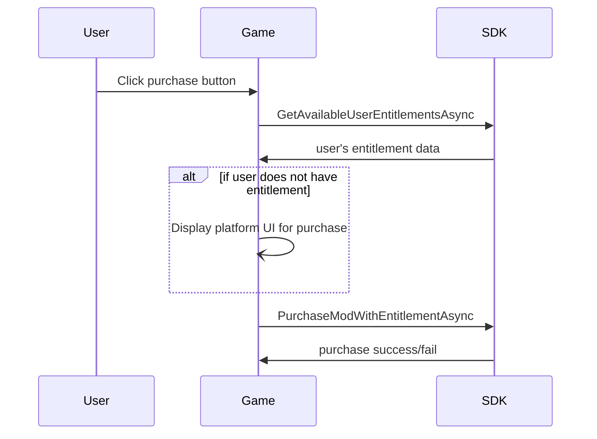

# Marketplace for C++ SDK

The C++ SDK supports a range of [Monetization](https://docs.mod.io/monetization) features, allowing your players to purchase UGC, with a share of the revenue split between creators and your studio.

[Marketplace](https://docs.mod.io/monetization/marketplace) is one such feature, exposing the data and functions required to build a UGC store in-game.

mod.io provides two different options for supporting marketplace features within your game - Virtual Currency, and USD Marketplace. You can toggle between these options on your game's monetization dashboard, but you can only ship with one of them enabled and used in your title.

Every platform requires specific setup for monetization features to work. Platform-specific information is available in the relevant [Platform Guides](https://docs.mod.io/getting-started#expand-with-cross-platform-functionality).

Monetization features need to be enabled through the web UI and, if using the virtual currency form of Marketplace through a platform store, will need a service to consume the virtual currency entitlements and apply them to player's mod.io account.

:::note
You can use our sandbox test environment at test.mod.io for testing monetization functionality, which allows for simulating real-world payments using dummy credit cards and credentials. When you initialize the SDK, use ``Modio::Environment::Test`` as the environment parameter, along with your test.mod.io title's GameID and APIKey.
:::

This guide covers:

* [Setup](#setup)
* [Querying & purchasing UGC](#querying--purchasing-ugc)

## Setup

### Initialization

The mod.io monetization features are enabled as part of the onboarding process on your game profile. Once that is setup, there is nothing further you need to do for initialization in the SDK.

Ensure that you have set the appropriate Portal when initializing the SDK for the portal you are using for purchasing - for instance, on Steam, you must initialize with Modio::Portal::Steam in order to redeem entitlements for Steam.

### Querying for Monetized Content

Regardless of whether you are using Virtual Currency or the USD marketplace model, the regular `<<ListAllModsAsync>>` method includes an additional filter for whether the results include paid content. By default, only free mods are shown, but you can set `RevenueType` on the `<<FilterParams>>` object passed to `<<ListAllModsAsync>>` to include free and paid content, or just paid content. If you are using Virtual Currency, then all mods returned will have a `Price` property, indicating the virtual currency price that must be paid in order to purchase. If you are using USD Marketplace, then each mod will have an associated set of `SKUMappings`, which map to the SKU pack that must be purchased and owned by the player in order to consume it for that piece of content.

```cpp
Modio::ListAllModsAsync(Modio::FilterParams().RevenueType(Modio::FilterParams::RevenueFilterType::FreeAndPaid), [](Modio::ErrorCode ec, Modio::Optional<Modio::ModInfoList> Results)
{
    if (ec)
    {
        // Error handling
    }
    else
    {
        for (Modio::ModInfo& CurrentModProfile : *Results)
        {
            std::cout << CurrentModProfile.Price;
        }
    }
});
```

### Showing user purchases

Even though all purchased mods are automatically subscribed, the user can still unsubscribe from them and uninstall them; however, they still remain owned and purchased by the user. They must re-subscribe to the mod in order to have it installed. This is facilitated by `<<FetchUserPurchasesAsync>>`, which will fetch a list of a users purchased mods. After a successful call, you can then display them with `<<QueryUserPurchases>>`, allowing re-subscription if necessary.

### Virtual Currency 

:::note
This functionality is demonstrated in example 09_MonetizationWalletManagement (for initialization and wallet management) and 10_MonetizationPurchase (for purchase functionality).
:::


#### Getting the user's wallet

On startup, you can make a call to `<<GetUserWalletBalanceAsync>>` to get the balance of the current user's wallet. If no wallet exists for the user, one will be created for them automatically. This call returns the users wallet balance for the current game. On startup is the only time you need to make this call.

We recommend that you cache the value of this result in your game code rather than making consistent calls to `<<GetUserWalletBalanceAsync>>` and update your local state from the return values of other calls that affect wallet balance.

```cpp
		Modio::GetUserWalletBalanceAsync([](Modio::ErrorCode ec, Modio::Optional<uint64_t> WalletBalance) {
			if (!ec && WalletBalance.has_value())
			{
				GlobalState.WalletAmount = WalletBalance.value();
			}
            else 
            {
                // Error handling
            }
		});
```

#### Syncing Virtual Currency Entitlements

:::note
This functionality is demonstrated in example 12_RefreshEntitlements.
For Steam, this functionality is demonstrated in advanced example 01_SteamAuthAndEntitlements.
For consoles, check the examples folder in the platform module.
:::

If you are supporting the purchase of virtual currency packs on platform storefronts, entitlement refreshing is the method by which those virtual currency packs are consumed and converted into mod.io virtual currency credits for users to purchase UGC with.

Each platform has a specific way of setting up entitlements for consumption, but generally speaking the way you consume those entitlements is the same. Read each platform's Marketplace documentation for how to configure entitlements and any platform-specific information for entitlement consumption.

You should always start by calling `GetUserWalletBalanceAsync` to ensure that a user has a wallet created, or entitlements cannot be consumed. To consume entitlements, call `RefreshUserEntitlementsAsync` as follows:

```cpp
const Modio::EntitlementParams EntitlementParams;
Modio::RefreshUserEntitlementsAsync(
	EntitlementParams,
	[&](Modio::ErrorCode ec, Modio::Optional<Modio::EntitlementConsumptionStatusList> Entitlements) {
		if (ec)
		{
			std::cout << "Failed to refresh user entitlements: " << ec.message() << std::endl;
		}
		else
		{
			if (Entitlements.has_value() && Entitlements->Size() > 0)
			{
				if (Entitlements->WalletBalance.has_value())
				{
					UserWalletBalance = Entitlements->WalletBalance->Balance;

					std::cout << "Entitlements consumed: " << Entitlements->Size() << std::endl;
					std::cout << "Updated UserWalletBalance is " << UserWalletBalance;
				}
			}
			else
			{
				std::cout << "No entitlements synced; nothing further to do." << std::endl;
			}
		}
	});
```

:::note
The `WalletBalance` returned in `Modio::EntitlementConsumptionStatusList` will be 0 if no entitlements have been consumed. You should conditionally update your local state based on whether any entitlements have actually been consumed.
:::

Generally speaking, you should do this on startup in case the user has made a purchase outside of the game, and after a user has made a purchase on a platform - most platforms will have some callback or indicator that this has occurred. Check that the `Modio::Optional<Modio::EntitlementConsumptionStatusList>` is valid and its size is greater than 0. 


#### Purchasing UGC with Virtual Currency

You can call `<<PurchaseModAsync>>` to purchase any given UGC. PurchaseModAsync takes two parameters = the ModID of the UGC to purchase, and the ExpectedPrice, which is the price displayed to the user from `<<ListAllModsAsync>>`. You must include this parameter for safety, so the user is not charged more or less than the price displayed to them in case the price of the UGC has changed between the call to ListAllModsAsync and purchase time.
Once UGC is purchased, it is automatically subscribed to for the user.

You should validate that the user has enough virtual currency to make the purchase by comparing it to the balance you received from `GetUserWalletBalanceAsync`. Note this is purely for user experience (ie for graying out the purchase button in the UI, or upselling the user a virtual currenct pack), and `PurchaseModAsync` will return an error if the user does not have enough in their wallet.

The updated wallet balance after the purchase amount is subtracted is returned in the callback of `<<PurchaseModAsync>>`.

```cpp
Modio::PurchaseModAsync(ModId, ModPrice, [](Modio::ErrorCode ec, Modio::Optional<Modio::TransactionRecord> Transaction) {
    if (ec)
    {
        // Error handling
    }
    else
    {
        if (Transaction.has_value())
        {
            GlobalState.WalletAmount =
                Transaction.value().UpdatedUserWalletBalance;
        }
    }
});
```

### USD Marketplace

:::warning
USD Marketplace is an experimental feature and is subject to change. If you are interested in using this feature, please contact us.
:::

#### Looking Up Platform SKUs

The first step for USD Marketplace is to look up and cache the SKUs for the platform that you are on. These SKU IDs are used for two purposes:
1. Localized Price Display for the mod that is going to be purchased
2. Opening the platform store for purchase of this SKU before exchanging it for a mod.

##### Platform SKUs: Steam

Steam SKU packs utilize the Steam Inventory Service for its purchase information.

To start, you have to call `SteamInventory()->RequestPrices()` to request all current prices for all applicable item definitions, with your Steam Callback as appropriate.

```
if (SteamInventory()) 
{
    SteamAPICall_t requestPriceCallbackHandle = SteamInventory()->RequestPrices();

    ModioTest::SteamAuthHelper::instance().m_SteamCallResultInventoryPrices.Set(
        requestPriceCallbackHandle, &ModioTest::SteamAuthHelper::instance(),
        &ModioTest::SteamAuthHelper::OnRequestPricesResponse);
}
```

Within this callback, you can then get the users localized currency for display purposes, and then get all item definitions with their associated localized prices.

```
void SteamAuthHelper::OnRequestPricesResponse(SteamInventoryRequestPricesResult_t* result, bool )
{
    GlobalSDKState.CurrencyCode = result->m_rgchCurrency;

    uint32_t len = SteamInventory()->GetNumItemsWithPrices();
    
    std::vector<SteamItemDef_t> itemDefs(len);
    std::vector<uint64> prices(len);
    std::vector<uint64> basePrices(len);

    SteamInventory()->GetItemsWithPrices(itemDefs.data(), prices.data(), basePrices.data(), len);

    if (!itemDefs.empty())
    {
        for (uint32_t i = 0; i < itemDefs.size(); i++)
        {
            PlatformSKUMapping skuMapping;
            skuMapping.Price = prices[i];
            skuMapping.SkuId = std::to_string(itemDefs[i]);
            GlobalSDKState.PlatformSKUMappings.push_back(skuMapping);
        }    
    }
}
```

You now have a mapping of SKU ID to Price that you can use for display and purchasing.

#### Displaying localized pricing

Inside of your UI, for each mod that you want to make available for purchase, you must display the localized price for the SKU that the mod is mapped to. When you are filtering for paid mods, any monetized mods will have a `SkuMappings` property which contains a list of all platform SKU Mappings.

To display the appropriate price, simply find the SKU Mapping for the current Portal that you are going to request the purchase on (ie Steam, PSN, XBoxLive) and look up that SKU ID from your Platform SKUs from the previous step.

#### Purchasing UGC with Entitlements

To perform a purchase in the USD marketplace flow, we recommend calling `<<GetAvailableUserEntitlementsAsync>>` first, to validate that the user has an available entitlement for the SKU of the mod that they want to purchase.
This method, and other USD marketplace functions, takes an EntitlementParams struct, which you should populate in the same fashion as though you were calling `<<RefreshUserEntitlementsAsync>>` from our virtual currency flow (refer to platform-specific documentation for information about what parameters need to be included). 

:::note
`<<RefreshUserEntitlementsAsync>>` itself does not need to be called by your game if you are using USD marketplace functionality - we consume entitlements on demand as part of a call to `<<PurchaseModWithEntitlementsAsync>>` rather than the batch consumption performed by `<<RefreshUserEntitlementsAsync>>`, which will not do anything if USD marketplace is enabled for your game.
:::

Purchasing with entitlements requires an exact matching SKU entitlement to be available, an available entitlement of a different value will not be consumed instead. If an entitlement for that SKU is not currently available, you can trigger the current platform's purchase UI to allow the user to purchase the correct SKU if necessary.
Once you have validated that a suitable entitlement is available, to perform a purchase, you can use the `<<PurchaseModWithEntitlementAsync>>` method, also passing in an EntitlementParams struct populated with the same information as for `<<GetAvailableUserEntitlementsAsync>>`. mod.io will then attempt to consume the applicable platform SKU for the mod, if the user owns one. If the user had an unconsumed entitlement, and our request to consume it is successful, the mod will be automatically subscribed to for the user. Otherwise, an error will be returned indicating whether the the user had an entitlement but that consumption failed, or that the user does not have the correct entitlement. In the latter case, `<<Modio::MonetizationError::AccountLacksEntitlement>> will be returned.`



### Getting a User Delegation Token

User Delegation Tokens can be used by a backend server for S2S (Server to Server) transactions/functionality. You can get one for the current user by calling `<<GetUserDelegationToken>>`, the callback for which contains the Token as a `std::string`.
