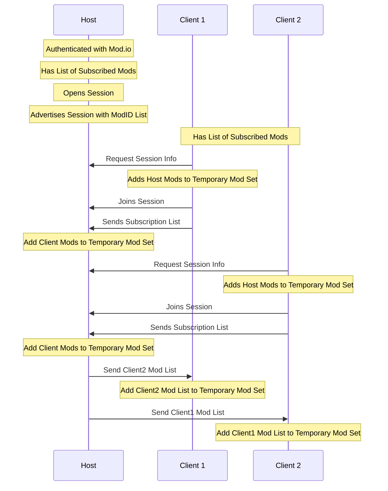
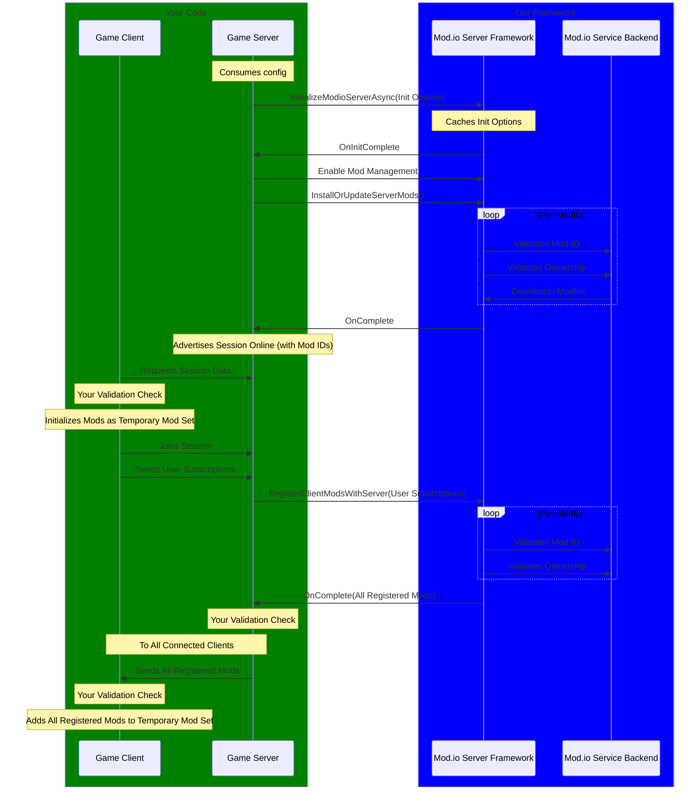

# Multiplayer

:::warning[Experimental Feature]
This is an experimental feature and is subject to change. 
:::

The mod.io SDK provides a framework of features to better support the utilization of UGC in the context of a Dedicated Server and P2P Multiplayer environments.

This framework does *not* take the place of any kind of online matchmaking, server advertising, joining, replication, communication, or any form of information transfer between clients and the server; it enables the authentication of the mod.io SDK in a headless environment, as well a providing helpers for tracking the use of UGC by players on your server, and providing a single source of truth for the full list of UGC in use by the Server and all Clients.

## P2P Servers

A P2P Server is expected to initialize in the exact same way a normal user would; the handling of UGC by joining clients (as well as the UGC in use by those clients) should be initialized as [Temporary Mod Sets](https://docs.mod.io/cppsdk/getting-started#temporary-mod-sets). P2P Servers are not intended to be used with the Mod.io Dedicated Server framework.

A basic example would be as follows:

None of this requires the use of the Dedicated Server Framework, and can be achieved with the standard mod.io SDK framework.

## Dedicated Servers

In the case of Dedicated Servers, the process of authentication and initialization requires an OAuth token to be created on the mod.io website which will provide the Server the same access and entitlements as the user (generally the Server owner) creating it, within the scope of the game in question, in a read-only capacity. This allows the Server to both initialize, download UGC, and access paid UGC that the user who created the OAuth token has access to, if the game itself allows it. This OAuth token can be created on your [API Settings](https://mod.io/me/access) page.

### Overview

A general overview of the mod.io Dedicated Server framework prescribed processes is as follows:

As you can see, our framework is intended to only be directly interacted with via the dedicated server itself; clients still authenticate and acquire mods via the conventional mod.io SDK, and it is up the the developer to get that list of subscribed mods to the server itself. The server can then utilize our framework to manage its UGC, as well as maintain an up-to-date list of client UGC across all clients.

At certain points in the above diagram you will note "Your Validation Step". These indicates places in the execution chain where you can insert you own steps for thing like validation, the accepting or refusing of UGC, and filtering based on things like tags and content. These steps allow you have more direct control over what UGC is utilized by both clients and the server. You could even add your own step to fully download all client UGC onto the server in a temporary mod set, if you wanted.

### Initialization Settings

In addition to the usual initialization options required in the base SDK, the mod.io dedicated server framework requires some additional settings to be correctly initialized. These additional options are required for proper initialization, and will differ between individual servers, and as such will need to be configurable upon launch or execution. The method of handling these settings is entirely up to your implementation; launch arguments, a config file, whatever suits your purposes best.

These additional options are, in brief:

**Mods Directory**: This is required to tell the SDK where to download Modfiles to, as we make no assumptions around what OS environment the SDK is operating in.

**Token**: This is required to allow the SDK to interact with the mod.io service without requiring human intervention in the authentication process. This Token needs to be generated on the mod.io website, and operates in a read-only capacity on behalf of the creating user. There should be a single token per dedicated server. You should ensure that this token cannot be accessed by clients at any point.

**Mods**: The list of ModIDs the server should download upon calling `InstallOrUpdateServerModsAsync()`. This list of ModIDs should generally be shared with every client as part of the joining process.
