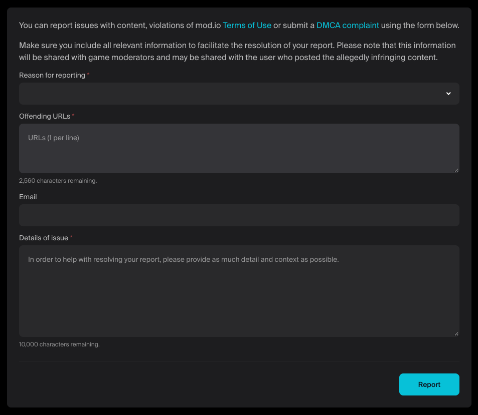

# Reports

## Report Form

:::warning
It is a requirement of the [Game Terms](https://mod.io/gameterms) with mod.io, and the platforms mod.io is used on (including but not limited to Steam, PlayStation, Nintendo and Xbox), to ensure all displayed content is reportable by users. You can enable a resource to be reported (by implementing a dialog similar to the example below) or linking to the report page on mod.io.
:::

Use the report endpoint to let users flag inappropriate content, dmca content, or broken content for review. Integrate a dialog or link directly to the [mod.io](https://mod.io/report) website to remain compliant with platform policies. See: [Submit Report](/restapi/docs/submit-report).

:::note
If implementing your own report dialog, the Terms of Use and Privacy Policy must be correctly linked, or displayed inline using the [agreements endpoints](/restapi/docs/get-current-agreement) to get the latest versions.

If you wish to display the agreements in a web browser overlay, we recommend using the following URLs:

- https://mod.io/legal/terms?no_links=true
- https://mod.io/legal/privacy?no_links=true

The __/legal__ part of the URL is optional and removes all menus and the __?no_links=true__ part of the URL is optional and removes all links.
:::

:::note
If you prefer to display the report page in a web browser overlay, and you know the resource you want to report, the best URL to use is: __https://mod.io/report/`resource`/`id`/widget__

For example to report a mod with an ID of 1 the URL would be: [https://mod.io/report/`mods`/`1`/widget](https://mod.io/report/mods/1/widget). If you don't know the ID of the resource you wish to report, you can use the generic report URL: [https://mod.io/report/widget](https://mod.io/report)
:::

:::tip
If you are a game owner or manager, you can [view all reports](https://mod.io/content) submitted for your game(s), and you are responsible for actioning reports. You can also configure in your game's control panel the number of reports required before content is automatically taken down for review.
:::

Read our [Terms of Use](https://mod.io/terms/widget) for information about what is/isn't acceptable.