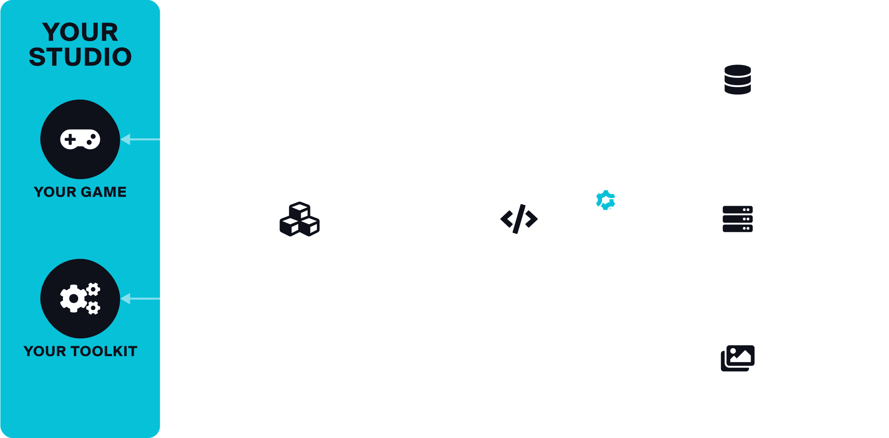

# REST API

The mod.io REST API is the foundation that allows you to add UGC support to your game. You can manage your game(s) via your [mod.io library dashboard](https://mod.io/library) and your [API access here](https://mod.io/me/access).

  <SimpleCard
    shadow="tl"
    title="mod.io REST API"
    image="/img/icon_modio.svg"
    text="A complete guide to mod.io's API functionality, such as authentication, integration and reference codes."
    moreLink="/restapi/introduction"
  />
    <SimpleCard
    shadow="tl"
    title="Features"
    image="/img/icon_tui.svg"
    text="Explore a variety of customizable offerings that work alongside the REST API to enhance UGC in your game."
    moreLink="/features"
  />

## How it works

Compatible with all builds of your game on all platforms and stores, mod.io is a clientless and standalone solution which gives you complete control over your modding ecosystem.

## Tools & implementation

Once you have completed the **Step 1** of the [mod.io Getting Started Guide](/getting-started#set-up-a-game-account), you can start integrating the mod.io REST API into your game, tools and sites. There are 3 options to get connected which you can use interchangeably depending on your needs. 

Here's the breakdown of each option:

Option | Usage | Suited for | Docs
---------- | ---------- | ---------- | ---------
__API__ | For connecting directly to the mod.io REST API. | Web apps that need a JSON REST API, or game developers that like a challenge and want control over their implementation. | [Documentation](/restapi)
__Official Plugins__ | If you've built your game using Unreal or Unity Engines, we have built bespoke plugins to streamline your UGC experience. | Any Unity or Unreal Engine game. | [Available below](#official-tools)
__SDK__ | Drop our [open source C/C++ SDK](https://github.com/modio/modio-sdk) into your game to call mod.io functionality. | Developers that want a SDK that abstracts the uploading, downloading and unzip flows behind easy to use function calls. | [Documentation](/cppsdk)
__Tools/Plugins__ | Use tools, plugins and wrappers created by the community to make implementation easy. | Game developers that want a pre-built modding solution for their engine (Unity, Unreal, GameMaker, Construct) of choice. | [Available below](#community-tools)

### Official tools

Plugins and wrappers made or supported by the mod.io team.

| &nbsp; | &nbsp; | &nbsp; | &nbsp;
-- | -- | -- | ---
 |  __Unity Plugin__ [SDK](https://github.com/modio/modio-unity) [Documentation](/unity) [Sample Project](https://github.com/modio/modio-unity-sample)  |  | __Unreal Plugin__ [SDK](https://github.com/modio/modio-ue) [Documentation](/unreal) [UE4 Sample Project](https://github.com/modio/modio-ue4-sample) [UE5 Sample Project](https://github.com/modio/modio-ue5-sample) 
|  | __C/C++ SDK__ [SDK](https://github.com/modio/modio-sdk) [Documentation](/cppsdk)  |  | __GameMaker__ [SDK](https://github.com/YoYoGames/GMEXT-mod.io) [Getting Started](https://github.com/YoYoGames/GMEXT-mod.io/wiki) 

### Community tools

Plugins and wrappers made by our passionate community. 

:::tip[Community Tools]
Is there a tool out there that should be added to the list? Let us know at developers@mod.io.
:::

| &nbsp; | &nbsp; | &nbsp; | &nbsp;
--- | --- | --- | ---
 | __Construct 2 Plugin__ [SDK](https://github.com/modio/modio-construct2) [Getting Started](https://github.com/modio/modio-construct2)  |  | __Haxe Wrapper__ [SDK](https://github.com/modio/modio-haxe) [Getting Started](https://github.com/Turupawn/modioOpenFLExample#openfl-integration) 
  | __Modio.NET__ [SDK](https://github.com/nickelc/modio.net) [Getting Started](https://github.com/nickelc/modio.net)  |  | __Rust Wrapper__ [SDK](https://crates.io/crates/modio) [Getting Started](https://github.com/nickelc/modio-rs) [Tutorials](https://github.com/nickelc/modio-rs/tree/master/examples) 
 | __Python Wrapper__ [SDK](https://github.com/ClementJ18/mod.io) [Getting Started](https://github.com/ClementJ18/mod.io#example) [Tutorials](https://github.com/ClementJ18/mod.io/tree/master/examples)  |  | __Common Lisp__ [Github](https://github.com/Shinmera/cl-modio) [Getting Started](https://shinmera.github.io/cl-modio/) 
 | __Command Line Tool__ [CMD](https://github.com/nickelc/modiom) [Getting Started](https://github.com/nickelc/modiom)  |  | __GitHub Action Mod Uploader__ [GitHub](https://github.com/nickelc/upload-to-modio) [Usage](https://github.com/nickelc/upload-to-modio#usage) 

## Explore the API

To explore what the API has to offer, head over to our complete [REST API Introduction](/restapi/introduction).

