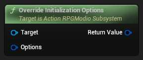
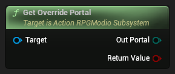
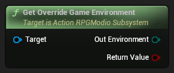
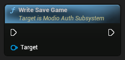
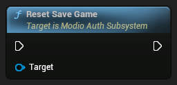
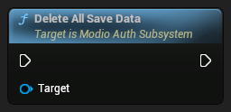
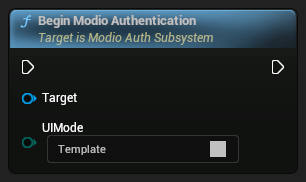
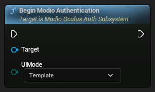
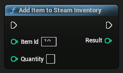

## Classes


### ActionRPGModioSubsystem 


##### Inheritance Hierarchy
-> EngineSubsystem-> DynamicSubsystem-> Subsystem-> Object


#### Override Initialization Options




```cpp
FModioInitializeOptions OverrideInitializationOptions(FModioInitializeOptions Options) const
```


##### Parameters
<RefTable colWidths={['30%', '70%']} stripes="odd">
| | |
|-|-|
|`Target`|`ActionRPGModioSubsystem`|
|`Options`|The initialization options to augment|
</RefTable>


##### Returns
A duplicate of the initialize options with override values


#### Get Override Portal




```cpp
bool GetOverridePortal(EModioPortal OutPortal) const
```


##### Parameters
<RefTable colWidths={['30%', '70%']} stripes="odd">
| | |
|-|-|
|`Target`|`ActionRPGModioSubsystem`|
|`Out Portal`|The output parameter to receive the portal value|
</RefTable>


##### Returns
true if the portal was overridden, false otherwise


#### Get Override Game Environment




```cpp
bool GetOverrideGameEnvironment(EModioEnvironment OutEnvironment) const
```


##### Parameters
<RefTable colWidths={['30%', '70%']} stripes="odd">
| | |
|-|-|
|`Target`|`ActionRPGModioSubsystem`|
|`Out Environment`|The environment to get|
</RefTable>


##### Returns
true if the environment was overridden, false otherwise


---

### ModioAuthSubsystem 


##### Inheritance Hierarchy
-> LocalPlayerSubsystem-> Subsystem-> Object


#### Write Save Game




```cpp
void WriteSaveGame()
```


#### Reset Save Game




```cpp
void ResetSaveGame()
```


#### Delete All Save Data




```cpp
void DeleteAllSaveData()
```


#### Begin Modio Authentication




```cpp
void BeginModioAuthentication(TEnumAsByte<EUIMode> UIMode)
```


---

### ModioOculusAuthSubsystem 


##### Inheritance Hierarchy
-> GameInstanceSubsystem-> Subsystem-> Object


#### Begin Modio Authentication




```cpp
void BeginModioAuthentication(TEnumAsByte<EUIMode> UIMode)
```


---


## Structs


## Functions 


### Add Item to Steam Inventory




```cpp
void AddItemToSteamInventory(int32 Result, int32 ItemId, int32 Quantity)
```


#### Parameters
<RefTable colWidths={['30%', '70%']} stripes="odd">
| | |
|-|-|
|`ItemId`|The ID of the Item to add, defaults to 101 which is the 200 token pack in the Monetization Test Game|
|`Quantity`|How many of the item to add to the user's inventory.|
|`Result`|The result returned from the Steam API, -1 indicates an error.|
</RefTable>


---


## Enums

### EUIMode {#EUIMode} 

Enum for selecting between Template UI screens and Example UI Screens


<RefTable colWidths={['30%', '70%']} stripes="odd">
| | |
|-|-|
| `Template` |  |
| `Example` |  |
</RefTable>

---


