## Classes

### ModioCommonTypesLibrary 

Utility functions for working with mod.io types

##### Inheritance Hierarchy
-> BlueprintFunctionLibrary-> Object


---

### ModioCreateModLibrary 

Utility functions for creating mod and mod file parameters

##### Inheritance Hierarchy
-> BlueprintFunctionLibrary-> Object


---

### ModioErrorCodeLibrary 

Utility functions for working with error codes

##### Inheritance Hierarchy
-> BlueprintFunctionLibrary-> Object


---

### ModioErrorConditionLibrary 

Utility functions for checking error conditions

##### Inheritance Hierarchy
-> BlueprintFunctionLibrary-> Object


---

### ModioExampleLibrary 


##### Inheritance Hierarchy
-> BlueprintFunctionLibrary-> Object


---

### ModioImageLibrary 

Utility functions for loading and managing images

##### Inheritance Hierarchy
-> BlueprintFunctionLibrary-> Object


---

### ModioModCollectionLibrary 

Utility functions for accessing and managing mod collection data

##### Inheritance Hierarchy
-> BlueprintFunctionLibrary-> Object


---

### ModioModDependenciesLibrary 

Utility functions for accessing and managing mod dependencies

##### Inheritance Hierarchy
-> BlueprintFunctionLibrary-> Object


---

### ModioModInfoListLibrary 

Utility functions for accessing and managing lists of mod information

##### Inheritance Hierarchy
-> BlueprintFunctionLibrary-> Object


---

### ModioModProgressInfoLibrary 

Utility functions for accessing and managing mod operation progress

##### Inheritance Hierarchy
-> BlueprintFunctionLibrary-> Object


---

### ModioModTagOptionsLibrary 

Utility functions for accessing and managing mod tag options

##### Inheritance Hierarchy
-> BlueprintFunctionLibrary-> Object


---

### ModioPlatformHelpersLibrary 

Blueprint library which contains a variety of Platform-based helpers for mapping initialization functionality (ie Auth, Portal, Platform etc) based off Platform.

##### Inheritance Hierarchy
-> BlueprintFunctionLibrary-> Object


---

### ModioPresetFilterParamsLibrary 

Blueprint library for working with preset filter parameters

##### Inheritance Hierarchy
-> BlueprintFunctionLibrary-> Object


---

### ModioReportLibrary 

Utility library for creating content reports within the mod.io platform.  This class contains methods for reporting various types of content (e.g., game, user, or mod).

##### Inheritance Hierarchy
-> BlueprintFunctionLibrary-> Object


---

### ModioSDKLibrary 

A utility class providing various helper functions for mod.io SDK integration in Unreal Engine.

##### Inheritance Hierarchy
-> BlueprintFunctionLibrary-> Object


---

### ModioStorageInfoLibrary 


##### Inheritance Hierarchy
-> BlueprintFunctionLibrary-> Object


---

### ModioSubmissionExtensionLibrary 


##### Inheritance Hierarchy
-> BlueprintFunctionLibrary-> Object


#### SubmitModChangesAsync

Edits the parameters of a mod, by updating any fields set in the Params object to match the passed-in values. Fields left empty on the Params object will not be updated. This method also accepts a Png binary file for uploading a new logo.


```cpp
void K2_SubmitModChangesFromMemoryAsync(FModioModID Mod, FModioEditModParams Params, TArray<uint8> PngData, FOnGetModInfoDelegate Callback)
```


##### Requirements
* _initialized-sdk_
* _authenticated-user_
* _no-rate-limiting_


##### Parameters
<RefTable colWidths={['30%', '70%']} stripes="odd">
| | |
|-|-|
|`Target`|`ModioSubmissionExtensionLibrary`|
|`Mod`|The ID of the mod you wish to edit|
|`Params`|Descriptor containing the fields that should be altered.|
|`PngData`||
|`Callback`|The callback invoked when the changes have been submitted, containing an optional updated ModInfo object if the edits were performed successfully|
</RefTable>


##### Error Values
<RefTable colWidths={['30%', '70%']} stripes="odd">
| | |
|-|-|
|GenericError::SDKNotInitialized|SDK not initialized
|UserDataError::InvalidUser|No authenticated user
|NetworkError|Couldn't connect to mod.io servers
|InvalidArgsError|Some fields in Params did not pass validation
</RefTable>


---

### ModioSubsystem 

`ModioSubsystem` is a thin wrapper around the mod.io SDK, wrapping all the functions available in the SDK's public header `modio/ModioSDK.h`.  This subsystem also converts mod.io SDK types to unreal-friendly types and caches some expensive operations.

##### Inheritance Hierarchy
-> EngineSubsystem-> DynamicSubsystem-> Subsystem-> Object


#### Set Log Level

Sets the global logging level.


```cpp
void SetLogLevel(EModioLogLevel UnrealLogLevel)
```


##### Parameters
<RefTable colWidths={['30%', '70%']} stripes="odd">
| | |
|-|-|
|`Target`|`ModioSubsystem`|
|`UnrealLogLevel`|Determines which messages to include in the log output. Messages with a log level below the specified value will not be displayed.|
</RefTable>


#### Run Pending Handlers

Runs any pending mod.io work on the calling thread and invokes any callbacks passed to asynchronous operations.


```cpp
void RunPendingHandlers()
```


##### Parameters
<RefTable colWidths={['30%', '70%']} stripes="odd">
| | |
|-|-|
|`Target`|`ModioSubsystem`|
</RefTable>


#### Query User Subscriptions

Fetches the local view of the user's subscribed mods, including mods that are subscribed but not yet installed


```cpp
TMap<FModioModID,FModioModCollectionEntry> QueryUserSubscriptions()
```


##### Parameters
<RefTable colWidths={['30%', '70%']} stripes="odd">
| | |
|-|-|
|`Target`|`ModioSubsystem`|
</RefTable>


##### Returns
`TMap<FModioID, FModioModCollectionEntry>` providing information about the subscribed mods


#### Query User Purchased Mods

Returns the user's purchased mods. [`FetchUserPurchasesAsync`](#fetchuserpurchasesasync) must be called first to populate the cache.


```cpp
TMap<FModioModID,FModioModInfo> QueryUserPurchasedMods()
```


##### Requirements
* _initialized-sdk_
* _authenticated-user_
* _no-rate-limiting_


##### Parameters
<RefTable colWidths={['30%', '70%']} stripes="odd">
| | |
|-|-|
|`Target`|`ModioSubsystem`|
</RefTable>


##### Returns
A `TMap<FModioModID, FModioModInfo>` of all purchases a user has made.


#### Query User Installations

Fetches the subset of the user's subscribed mods that are installed and ready for loading

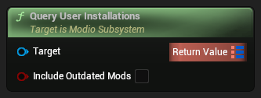

```cpp
TMap<FModioModID,FModioModCollectionEntry> QueryUserInstallations(bool bIncludeOutdatedMods)
```


##### Parameters
<RefTable colWidths={['30%', '70%']} stripes="odd">
| | |
|-|-|
|`Target`|`ModioSubsystem`|
|`bIncludeOutdatedMods`|Include subscribed mods that are installed but have an updated version on the server that has not yet been installed|
</RefTable>


##### Returns
`TMap<FModioID, FModioModCollectionEntry>` providing information about the subscribed mods


#### Query System Installations

Fetches all mods installed on the system, including those installed by other users.


```cpp
TMap<FModioModID,FModioModCollectionEntry> QuerySystemInstallations()
```


##### Parameters
<RefTable colWidths={['30%', '70%']} stripes="odd">
| | |
|-|-|
|`Target`|`ModioSubsystem`|
</RefTable>


##### Returns
A `TMap<FModioModID, FModioModCollectionEntry>` of all mods installed on the system, including those installed by other users.


#### Prioritize Transfer for Mod

Cancels or suspends the current mod update, installation, or upload, and begins processing a pending operation for the specified mod ID


```cpp
FModioErrorCode PrioritizeTransferForMod(FModioModID ModToPrioritize)
```


##### Requirements
* _initialized-sdk_
* _authenticated-user_


##### Parameters
<RefTable colWidths={['30%', '70%']} stripes="odd">
| | |
|-|-|
|`Target`|`ModioSubsystem`|
|`ModToPrioritize`|The ID for the mod to prioritize|
</RefTable>


##### Returns
Error code indicating the status of the prioritization request. Will be empty if the prioritization was successful or if the mod was already being processed


##### Error Values
<RefTable colWidths={['30%', '70%']} stripes="odd">
| | |
|-|-|
|`InvalidArgsError`|The supplied mod ID is invalid or not present in the list of pending operations
</RefTable>


#### Kill Background Thread

Kills the background thread if it is running


```cpp
void KillBackgroundThread()
```


##### Parameters
<RefTable colWidths={['30%', '70%']} stripes="odd">
| | |
|-|-|
|`Target`|`ModioSubsystem`|
</RefTable>


#### VerifyUserAuthenticationAsync

Queries the server to verify the state of the currently authenticated user if there is one present


```cpp
void K2_VerifyUserAuthenticationAsync(FOnErrorOnlyDelegate Callback)
```


##### Requirements
* _initialized-sdk_
* _no-rate-limiting_
* _authenticated-user_


##### Parameters
<RefTable colWidths={['30%', '70%']} stripes="odd">
| | |
|-|-|
|`Target`|`ModioSubsystem`|
|`Callback`|Callback invoked with the results of the verification process. An empty `ModioErrorCode` indicates successful verification i.e. the mod.io server was contactable and the user's authentication remains valid.|
</RefTable>


##### Error Values
<RefTable colWidths={['30%', '70%']} stripes="odd">
| | |
|-|-|
|`NetworkError`|Couldn't connect to mod.io servers
|`SDKNotInitialized`|SDK not initialized
|`UserNotAuthenticatedError`|No authenticated user
</RefTable>


#### UnsubscribeFromModAsync

Sends a request to the mod.io server to remove the specified mod from the user's list of subscriptions. If no other local users are subscribed to the specified mod this function will also mark the mod for uninstallation by the SDK.


```cpp
void K2_UnsubscribeFromModAsync(FModioModID ModToUnsubscribeFrom, FOnErrorOnlyDelegate OnUnsubscribeComplete)
```


##### Requirements
* _initialized-sdk_
* _authenticated-user_
* _no-rate-limiting_


##### Parameters
<RefTable colWidths={['30%', '70%']} stripes="odd">
| | |
|-|-|
|`Target`|`ModioSubsystem`|
|`ModToUnsubscribeFrom`|Mod ID of the mod requiring unsubscription.|
|`On Unsubscribe Complete`|Callback invoked when the unsubscription request is completed.|
</RefTable>


##### Error Values
<RefTable colWidths={['30%', '70%']} stripes="odd">
| | |
|-|-|
|`NetworkError`|Couldn't connect to mod.io servers
|`SDKNotInitialized`|SDK not initialized
|`EntityNotFoundError`|Specified mod does not exist or was deleted
|`UserNotAuthenticatedError`|No authenticated user
|`InvalidArgsError`|The supplied mod ID is invalid
</RefTable>


#### UnmuteUserAsync

Unmute a user. This allows mod.io to display mods authored by the now unmuted user when performing searches.


```cpp
void K2_UnmuteUserAsync(FModioUserID UserID, FOnErrorOnlyDelegate Callback)
```


##### Requirements
* _authenticated-user_
* _initialized-sdk_


##### Parameters
<RefTable colWidths={['30%', '70%']} stripes="odd">
| | |
|-|-|
|`Target`|`ModioSubsystem`|
|`UserID`|ID of the user to unmute|
|`Callback`|Callback providing a status code indicating success or failure of unmuting the user.|
</RefTable>


##### Error Values
<RefTable colWidths={['30%', '70%']} stripes="odd">
| | |
|-|-|
|`SDKNotInitialized`|SDK not initialized
|`UserNotAuthenticatedError`|No authenticated user
|`InvalidArgsError`|The supplied user ID is invalid
</RefTable>


#### SubscribeToModAsync

Sends a request to the mod.io server to add the specified mod to the user's list of subscriptions, and marks the mod for local installation by the SDK


```cpp
void K2_SubscribeToModAsync(FModioModID ModToSubscribeTo, bool IncludeDependencies, FOnErrorOnlyDelegate OnSubscribeComplete)
```


##### Requirements
* _initialized-sdk_
* _authenticated-user_
* _no-rate-limiting_


##### Parameters
<RefTable colWidths={['30%', '70%']} stripes="odd">
| | |
|-|-|
|`Target`|`ModioSubsystem`|
|`ModToSubscribeTo`|Mod ID of the mod requiring a subscription.|
|`IncludeDependencies`|Subscribe to all dependencies as well.|
|`On Subscribe Complete`|Callback invoked when the subscription request is completed.|
</RefTable>


##### Error Values
<RefTable colWidths={['30%', '70%']} stripes="odd">
| | |
|-|-|
|`NetworkError`|Couldn't connect to mod.io servers
|`SDKNotInitialized`|SDK not initialized
|`EntityNotFoundError`|Specified mod does not exist or was deleted
|`UserNotAuthenticatedError`|No authenticated user
|`InvalidArgsError`|The supplied mod ID is invalid
</RefTable>


#### SubmitNewModFileForMod

Queues the upload of a new modfile release for the specified mod using the submitted parameters. This function takes an `ModioCreateModFileParams` object to specify the path to the root folder of the new modfile. The plugin will compress the folder's contents into a .zip archive and queue the result for upload. When the upload completes, a mod management event will be triggered. Note the plugin is also responsible for decompressing the archive upon its installation at a later point in time.
:::warning[Experimental Feature]
This function is part of an experimental feature and is subject to change. 
:::


```cpp
void K2_SubmitNewModFileForMod(FModioModID Mod, FModioCreateModFileParams Params)
```


##### Requirements
* _initialized-sdk_
* _authenticated-user_
* _no-rate-limiting_


##### Parameters
<RefTable colWidths={['30%', '70%']} stripes="odd">
| | |
|-|-|
|`Target`|`ModioSubsystem`|
|`Mod`|The ID of the mod you are submitting a file for|
|`Params`|Information about the mod file being created, including the root path of the directory that will be archived|
</RefTable>


##### Error Values
<RefTable colWidths={['30%', '70%']} stripes="odd">
| | |
|-|-|
|`UserNotAuthenticatedError`|No authenticated user
|`InvalidArgsError`|The supplied mod ID is invalid
</RefTable>


#### SubmitNewModAsync

Requests the creation of a new mod on the server with the specified parameters
:::warning[Experimental Feature]
This function is part of an experimental feature and is subject to change. 
:::

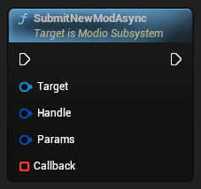

```cpp
void K2_SubmitNewModAsync(FModioModCreationHandle Handle, FModioCreateModParams Params, FOnSubmitNewModDelegate Callback)
```


##### Requirements
* _initialized-sdk_
* _authenticated-user_
* _no-rate-limiting_


##### Parameters
<RefTable colWidths={['30%', '70%']} stripes="odd">
| | |
|-|-|
|`Target`|`ModioSubsystem`|
|`Handle`|The `ModioModCreationHandle` for this submission. Once this method invokes your callback indicating success, the `ModioModCreationHandle` is invalid for the rest of the session. You should request a new one for the next submission attempt.|
|`Params`|Information about the new mod to create|
|`Callback`|Callback providing a status code and an optional `ModioModID` for the newly created mod|
</RefTable>


##### Error Values
<RefTable colWidths={['30%', '70%']} stripes="odd">
| | |
|-|-|
|`NetworkError`|Couldn't connect to mod.io servers
|`SDKNotInitialized`|SDK not initialized
|`InvalidArgsError`|Some fields in `Params` did not pass validation
|`UserNotAuthenticatedError`|No authenticated user
</RefTable>


#### SubmitModRatingAsync

Submits a rating for a mod on behalf of the current user. Submit a neutral rating to effectively clear a rating already submitted by a user. Submitting other values will overwrite any existing rating submitted by this user.

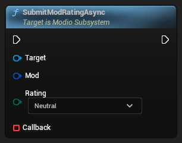

```cpp
void K2_SubmitModRatingAsync(FModioModID Mod, EModioRating Rating, FOnErrorOnlyDelegate Callback)
```


##### Requirements
* _initialized-sdk_
* _authenticated-user_
* _no-rate-limiting_


##### Parameters
<RefTable colWidths={['30%', '70%']} stripes="odd">
| | |
|-|-|
|`Target`|`ModioSubsystem`|
|`Mod`|The mod the user is rating|
|`Rating`|The rating the user wishes to submit|
|`Callback`|Callback providing a status code indicating success or failure of the rating submission|
</RefTable>


##### Error Values
<RefTable colWidths={['30%', '70%']} stripes="odd">
| | |
|-|-|
|`NetworkError`|Couldn't connect to mod.io servers
|`SDKNotInitialized`|SDK not initialized
|`EntityNotFoundError`|Specified mod does not exist or was deleted
|`UserNotAuthenticatedError`|No authenticated user
|`InvalidArgsError`|The supplied mod ID is invalid
</RefTable>


#### SubmitModChangesAsync

Edits the parameters of a mod by updating any fields set in the `Params` object to match the passed-in values. Fields left empty on the `Params` object will not be updated.


```cpp
void K2_SubmitModChangesAsync(FModioModID Mod, FModioEditModParams Params, FOnGetModInfoDelegate Callback)
```


##### Requirements
* _initialized-sdk_
* _authenticated-user_
* _no-rate-limiting_


##### Parameters
<RefTable colWidths={['30%', '70%']} stripes="odd">
| | |
|-|-|
|`Target`|`ModioSubsystem`|
|`Mod`|The ID of the mod you wish to edit|
|`Params`|Descriptor containing the fields that should be altered.|
|`Callback`|The callback invoked when the changes have been submitted containing an optional updated `ModioModInfo` object if the edits were performed successfully|
</RefTable>


##### Error Values
<RefTable colWidths={['30%', '70%']} stripes="odd">
| | |
|-|-|
|`NetworkError`|Couldn't connect to mod.io servers
|`SDKNotInitialized`|SDK not initialized
|`InvalidArgsError`|Some fields in `Params` did not pass validation
|`UserNotAuthenticatedError`|No authenticated user
|`InvalidArgsError`|The supplied mod ID is invalid
</RefTable>


#### ShutdownAsync

Cancels any running internal operations, frees SDK resources, and invokes any pending callbacks with an `OperationCanceled` error category. This function will NOT block while the deinitialization occurs.


```cpp
void K2_ShutdownAsync(FOnErrorOnlyDelegate OnShutdownComplete)
```


##### Parameters
<RefTable colWidths={['30%', '70%']} stripes="odd">
| | |
|-|-|
|`Target`|`ModioSubsystem`|
|`On Shutdown Complete`|Callback invoked when the plugin is shut down and calling [`RunPendingHandlers`](#run-pending-handlers) is no longer required|
</RefTable>


#### SetLanguage

Set language to get corresponding data from the server


```cpp
void K2_SetLanguage(EModioLanguage Locale)
```


##### Parameters
<RefTable colWidths={['30%', '70%']} stripes="odd">
| | |
|-|-|
|`Target`|`ModioSubsystem`|
|`Locale`|Language to set|
</RefTable>


#### RequestEmailAuthCodeAsync

Begins email authentication for the current session by requesting a one-time code be sent to the specified email address.


```cpp
void K2_RequestEmailAuthCodeAsync(FModioEmailAddress EmailAddress, FOnErrorOnlyDelegate Callback)
```


##### Requirements
* _initialized-sdk_
* _no-rate-limiting_
* _no-authenticated-user_


##### Parameters
<RefTable colWidths={['30%', '70%']} stripes="odd">
| | |
|-|-|
|`Target`|`ModioSubsystem`|
|`EmailAddress`|The email address to send the code to|
|`Callback`|Callback providing a status code indicating the outcome of the request|
</RefTable>


##### Error Values
<RefTable colWidths={['30%', '70%']} stripes="odd">
| | |
|-|-|
|`NetworkError`|Couldn't connect to mod.io servers
|`SDKNotInitialized`|SDK not initialized
|`UserAlreadyAuthenticatedError`|Current user is already authenticated. De-authenticate the current user with [`ClearUserDataAsync`](#clearuserdataasync), and re-initialize the SDK by calling [`ShutdownAsync`](#shutdownasync) then [`InitializeAsync`](#initializeasync).
</RefTable>


#### ReportContentAsync

Sends a content report to mod.io. When using this function, please inform your users that if they provide their contact name or details in the `Report` parameter, this data may be shared with the person responsible for the content being reported. For more information on what data in a report will be shared with whom, please see [our website's report form](https://mod.io/report).


```cpp
void K2_ReportContentAsync(FModioReportParams Report, FOnErrorOnlyDelegate Callback)
```


##### Requirements
* _initialized-sdk_


##### Parameters
<RefTable colWidths={['30%', '70%']} stripes="odd">
| | |
|-|-|
|`Target`|`ModioSubsystem`|
|`Report`|Information about the content being reported and a description of the report.|
|`Callback`|Callback providing a status code to indicate successful submission of the report.|
</RefTable>


##### Error Values
<RefTable colWidths={['30%', '70%']} stripes="odd">
| | |
|-|-|
|`NetworkError`|Couldn't connect to mod.io servers
|`InvalidArgsError`|Required information in the report did not pass validation
|`InvalidArgsError`|The mod ID, game ID, or user ID supplied to `Report` is invalid
</RefTable>


#### RemoveFromTempModSet

Remove mods from a temp mod set.  Every temp mod specified by `ModIds` will be uninstalled unless the user is already subscribed.


```cpp
FModioErrorCode K2_RemoveFromTempModSet(TArray<FModioModID> ModIds)
```


##### Requirements
* _initialized-sdk_
* _mod-management-enabled_
* _temp-mod-set-initialized_


##### Parameters
<RefTable colWidths={['30%', '70%']} stripes="odd">
| | |
|-|-|
|`Target`|`ModioSubsystem`|
|`ModIds`|TArray of `ModioModID`s to remove as temp mods|
</RefTable>


##### Returns
Error code indicating the status of the `TempModSet`. Will be empty if it was successful


##### Error Values
<RefTable colWidths={['30%', '70%']} stripes="odd">
| | |
|-|-|
|`SDKNotInitialized`|SDK not initialized
|`ModManagementDisabled`|Mod management not enabled
|`TempModSetNotInitialized`|`TempModSet` not initialized
</RefTable>


#### RefreshUserEntitlementsAsync

Requests mod.io refresh the available entitlements for the current user purchased through the portal and currently authenticated.


```cpp
void K2_RefreshUserEntitlementsAsync(FModioEntitlementParams Params, FOnRefreshUserEntitlementsDelegate Callback)
```


##### Requirements
* _initialized-sdk_
* _authenticated-user_
* _no-rate-limiting_


##### Parameters
<RefTable colWidths={['30%', '70%']} stripes="odd">
| | |
|-|-|
|`Target`|`ModioSubsystem`|
|`Params`|Additional parameters.|
|`Callback`|Callback providing an error code indicating success or failure of the refresh operation.|
</RefTable>


#### QueryUserProfile

Fetches the currently authenticated mod.io user profile if there is one


```cpp
FModioOptionalUser K2_QueryUserProfile()
```


##### Parameters
<RefTable colWidths={['30%', '70%']} stripes="odd">
| | |
|-|-|
|`Target`|`ModioSubsystem`|
</RefTable>


##### Returns
`ModioOptionalUser` object containing profile information


#### QueryTempModSet

Query every system and temp mod in `TempModSet`


```cpp
TMap<FModioModID,FModioModCollectionEntry> K2_QueryTempModSet()
```


##### Parameters
<RefTable colWidths={['30%', '70%']} stripes="odd">
| | |
|-|-|
|`Target`|`ModioSubsystem`|
</RefTable>


##### Returns
TMap using `ModioModID` as keys and `ModioModCollectionEntry` objects providing information about mods in `TempModSet`


#### QueryStorageInfo

Fetches storage related information, including total availability and how much is being consumed by mod installations.


```cpp
FModioStorageInfo K2_QueryStorageInfo()
```


##### Parameters
<RefTable colWidths={['30%', '70%']} stripes="odd">
| | |
|-|-|
|`Target`|`ModioSubsystem`|
</RefTable>


##### Returns
An `FModioStorageInfo` structure containing storage information


#### QueryCurrentModUpdate

Provides progress information for a mod installation or update operation if one is currently in progress.


```cpp
FModioOptionalModProgressInfo K2_QueryCurrentModUpdate()
```


##### Parameters
<RefTable colWidths={['30%', '70%']} stripes="odd">
| | |
|-|-|
|`Target`|`ModioSubsystem`|
</RefTable>


##### Returns
`ModioOptionalModProgressInfo` object containing information regarding the progress of the installation operation.


#### PurchaseModAsync

Purchases a mod for the current player


```cpp
void K2_PurchaseModAsync(FModioModID ModID, FModioUnsigned64 ExpectedPrice, FOnPurchaseModDelegate Callback)
```


##### Requirements
* _initialized-sdk_
* _authenticated-user_
* _no-rate-limiting_


##### Parameters
<RefTable colWidths={['30%', '70%']} stripes="odd">
| | |
|-|-|
|`Target`|`ModioSubsystem`|
|`ModID`|ID of the mod to purchase|
|`ExpectedPrice`|The price the user is expected to pay for the mod, generally [`ModioModInfo.Price`](#modiomodinfo). This ensures that there is consistency between the displayed price and the price in the backend. If there is a mismatch, the purchase will fail.|
|`Callback`|Callback invoked with purchase information once the purchase is completed.|
</RefTable>


#### PreviewExternalUpdatesAsync

Retrieve a list of updates between the users local mod state, and the server-side state. This allows you to identify which mods will be modified by the next call to [`FetchExternalUpdatesAsync`](#fetchexternalupdatesasync) in order to perform any content management (such as unloading files) that might be required.


```cpp
void K2_PreviewExternalUpdatesAsync(FOnPreviewExternalUpdatesDelegate OnPreviewDone)
```


##### Parameters
<RefTable colWidths={['30%', '70%']} stripes="odd">
| | |
|-|-|
|`Target`|`ModioSubsystem`|
|`On Preview Done`|Callback invoked when the external state has been retrieved. It contains a dictionary with ModID as keys and change maps as values. Empty when there are no differences between local and the mod.io API service|
</RefTable>


#### MuteUserAsync

Mute a user. This will prevent mod.io from returning mods authored by the muted user. when performing searches.


```cpp
void K2_MuteUserAsync(FModioUserID UserID, FOnErrorOnlyDelegate Callback)
```


##### Requirements
* _authenticated-user_
* _initialized-sdk_


##### Parameters
<RefTable colWidths={['30%', '70%']} stripes="odd">
| | |
|-|-|
|`Target`|`ModioSubsystem`|
|`UserID`|ID of the User to mute|
|`Callback`|Callback providing a status code indicating success or failure of muting the user.|
</RefTable>


##### Error Values
<RefTable colWidths={['30%', '70%']} stripes="odd">
| | |
|-|-|
|`SDKNotInitialized`|SDK not initialized
|`UserNotAuthenticatedError`|No authenticated user
|`InvalidArgsError`|The supplied user ID is invalid
</RefTable>


#### MetricsSessionStartAsync

Start a metrics play session
:::info[Premium Feature]
This function requires the **Metrics** premium feature. Please contact your mod.io representative for more details.
:::


```cpp
void K2_MetricsSessionStartAsync(FModioMetricsSessionParams Params, FOnErrorOnlyDelegate Callback)
```


##### Parameters
<RefTable colWidths={['30%', '70%']} stripes="odd">
| | |
|-|-|
|`Target`|`ModioSubsystem`|
|`Params`|`ModioMetricsSessionParams` struct containing information of what and how to start a metrics session|
|`Callback`|Callback providing an error code indicating success or failure of the session start operation|
</RefTable>


##### Error Values
<RefTable colWidths={['30%', '70%']} stripes="odd">
| | |
|-|-|
|`SDKNotInitialized`|SDK not initialized
|`RateLimited`|Too many frequent calls to the API. Wait some time and try again.
|`InvalidUser`|No authenticated user
|`SessionNotInitialized`|Metrics session has not yet been initialized
|`SessionIsActive`|Metrics session is currently active and running
|`BadParameter`|One or more values in the Metric Session Parameters are invalid
</RefTable>


#### MetricsSessionSendHeartbeatOnceAsync

Sends a single heartbeat to the mod.io server to indicate a session is still active
:::info[Premium Feature]
This function requires the **Metrics** premium feature. Please contact your mod.io representative for more details.
:::


```cpp
void K2_MetricsSessionSendHeartbeatOnceAsync(FOnErrorOnlyDelegate Callback)
```


##### Parameters
<RefTable colWidths={['30%', '70%']} stripes="odd">
| | |
|-|-|
|`Target`|`ModioSubsystem`|
|`Callback`|Callback providing an error code indicating success or failure of the session heartbeat operation|
</RefTable>


##### Error Values
<RefTable colWidths={['30%', '70%']} stripes="odd">
| | |
|-|-|
|`SDKNotInitialized`|SDK not initialized
|`InvalidUser`|No authenticated user
|`SessionNotInitialized`|Metrics session has not yet been initialized
|`SessionIsNotActive`|Metrics session is not currently running. Call [`MetricsSessionStartAsync`](#metricssessionstartasync) before attempting to sending a heartbeat.
</RefTable>


#### MetricsSessionSendHeartbeatAtIntervalAsync

Sends a constant heartbeat at a given interval to the mod.io server to indicate a session is still active


```cpp
void K2_MetricsSessionSendHeartbeatAtIntervalAsync(FModioUnsigned64 IntervalSeconds, FOnErrorOnlyDelegate Callback)
```


##### Parameters
<RefTable colWidths={['30%', '70%']} stripes="odd">
| | |
|-|-|
|`Target`|`ModioSubsystem`|
|`IntervalSeconds`|The frequency in seconds to send a heartbeat to the mod.io server|
|`Callback`|Callback providing an error code indicating success or failure of the session heartbeat operation|
</RefTable>


##### Error Values
<RefTable colWidths={['30%', '70%']} stripes="odd">
| | |
|-|-|
|`SDKNotInitialized`|SDK not initialized
|`InvalidUser`|No authenticated user
|`SessionNotInitialized`|Metrics session has not yet been initialized
|`SessionIsNotActive`|Metrics session is not currently running. Call [`MetricsSessionStartAsync`](#metricssessionstartasync) before attempting to sending a heartbeat.
</RefTable>


#### MetricsSessionEndAsync

Ends a metrics play session
:::info[Premium Feature]
This function requires the **Metrics** premium feature. Please contact your mod.io representative for more details.
:::


```cpp
void K2_MetricsSessionEndAsync(FOnErrorOnlyDelegate Callback)
```


##### Parameters
<RefTable colWidths={['30%', '70%']} stripes="odd">
| | |
|-|-|
|`Target`|`ModioSubsystem`|
|`Callback`|Callback providing an error code indicating success or failure of the session end operation|
</RefTable>


##### Error Values
<RefTable colWidths={['30%', '70%']} stripes="odd">
| | |
|-|-|
|`SDKNotInitialized`|SDK not initialized
|`RateLimited`|Too many frequent calls to the API. Wait some time and try again.
|`InvalidUser`|No authenticated user
|`SessionNotInitialized`|Metrics session has not yet been initialized
|`SessionIsNotActive`|Metrics session is not currently running. Call [`MetricsSessionStartAsync`](#metricssessionstartasync) before attempting to end a session.
</RefTable>


#### ListUserGamesAsync

Provides a list of games for the current user that match the parameters specified in the filter


```cpp
void K2_ListUserGamesAsync(FModioFilterParams Filter, FOnListUserGamesDelegate Callback)
```


##### Requirements
* _initialized-sdk_
* _no-rate-limiting_
* _authenticated-user_


##### Parameters
<RefTable colWidths={['30%', '70%']} stripes="odd">
| | |
|-|-|
|`Target`|`ModioSubsystem`|
|`Filter`|[`ModioFilterParams`](#modiofilterparams) object containing any filters that should be applied to the query|
|`Callback`|Callback invoked with a status code and an optional `ModioGameInfoList` providing game profiles|
</RefTable>


##### Error Values
<RefTable colWidths={['30%', '70%']} stripes="odd">
| | |
|-|-|
|`NetworkError`|Couldn't connect to mod.io servers
|`UserNotAuthenticatedError`|No authenticated user
|`SDKNotInitialized`|SDK not initialized
</RefTable>


#### ListUserCreatedModsAsync

Provides a list of mods that the user has submitted or is a team member of for the current game, applying the parameters specified in the filter.


```cpp
void K2_ListUserCreatedModsAsync(FModioFilterParams Filter, FOnListUserCreatedModsDelegate Callback)
```


##### Requirements
* _authenticated-user_
* _initialized-sdk_
* _no-rate-limiting_


##### Parameters
<RefTable colWidths={['30%', '70%']} stripes="odd">
| | |
|-|-|
|`Target`|`ModioSubsystem`|
|`Filter`|Filter to apply when listing the user's created mods.|
|`Callback`|Callback invoked when the call succeeds, or when an error occurs.|
</RefTable>


##### Error Values
<RefTable colWidths={['30%', '70%']} stripes="odd">
| | |
|-|-|
|`NetworkError`|Couldn't connect to mod.io servers
|`SDKNotInitialized`|SDK not initialized
|`RateLimited`|Too many frequent calls to the API. Wait some time and try again.
</RefTable>


#### ListAllModsAsync

Provides a list of mods for the current game that match the parameters specified in the filter


```cpp
void K2_ListAllModsAsync(FModioFilterParams Filter, FOnListAllModsDelegate Callback)
```


##### Requirements
* _initialized-sdk_
* _no-rate-limiting_


##### Parameters
<RefTable colWidths={['30%', '70%']} stripes="odd">
| | |
|-|-|
|`Target`|`ModioSubsystem`|
|`Filter`|[`ModioFilterParams`](#modiofilterparams) object containing any filters that should be applied to the query|
|`Callback`|Callback invoked with a status code and an optional `ModioModInfoList` providing mod profiles|
</RefTable>


##### Error Values
<RefTable colWidths={['30%', '70%']} stripes="odd">
| | |
|-|-|
|`NetworkError`|Couldn't connect to mod.io servers
|`SDKNotInitialized`|SDK not initialized
</RefTable>


#### InitTempModSet

Install every temp mod specified by `ModIds` if not already installed.


```cpp
FModioErrorCode K2_InitTempModSet(TArray<FModioModID> ModIds)
```


##### Requirements
* _initialized-sdk_
* _mod-management-enabled_


##### Parameters
<RefTable colWidths={['30%', '70%']} stripes="odd">
| | |
|-|-|
|`Target`|`ModioSubsystem`|
|`ModIds`|TArray of `ModioModID`s to install as temp mods|
</RefTable>


##### Returns
Error code indicating the status of the `TempModSet`. Will be empty if it was successful


##### Error Values
<RefTable colWidths={['30%', '70%']} stripes="odd">
| | |
|-|-|
|`SDKNotInitialized`|SDK not initialized
|`ModManagementDisabled`|Mod management not enabled
</RefTable>


#### InitializeAsync

Initializes the SDK for the given user. Loads the state of mods installed on the system as well as the set of mods the specified user has installed on this device


```cpp
void K2_InitializeAsync(FModioInitializeOptions InitializeOptions, FOnErrorOnlyDelegate OnInitComplete)
```


##### Parameters
<RefTable colWidths={['30%', '70%']} stripes="odd">
| | |
|-|-|
|`Target`|`ModioSubsystem`|
|`InitializeOptions`|Parameters to the function packed as a struct where all members needs to be initialized for the call to succeed|
|`On Init Complete`|Callback which will be invoked with the result of initialization|
</RefTable>


##### Error Values
<RefTable colWidths={['30%', '70%']} stripes="odd">
| | |
|-|-|
|`NetworkError`|Couldn't connect to mod.io servers
|`FilesystemError`|Couldn't create the user data or common data folders
|`ConfigurationError`|InitializeOptions contains an invalid value - inspect `ec.value()` to determine what was incorrect
|`SDKAlreadyInitialized`|SDK already initialized
</RefTable>


#### GetUserWalletBalanceAsync

Gets the users current wallet balance. This will also create a wallet for a user if one does not exist. You should ensure this is called prior to calling [`PurchaseModAsync`](#purchasemodasync) purchase will fail.


```cpp
void K2_GetUserWalletBalanceAsync(FOnGetUserWalletBalanceDelegate Callback)
```


##### Requirements
* _initialized-sdk_
* _authenticated-user_
* _no-rate-limiting_


##### Parameters
<RefTable colWidths={['30%', '70%']} stripes="odd">
| | |
|-|-|
|`Target`|`ModioSubsystem`|
|`Callback`|Callback invoked with the users wallet balance|
</RefTable>


#### GetUserMediaAsync (Avatar)

Downloads the avatar of the currently authenticated user. Will only perform a download if there is no local cache of the avatar or if that cached copy is out-of-date.


```cpp
void K2_GetUserMediaAvatarAsync(EModioAvatarSize AvatarSize, FOnGetMediaDelegate Callback)
```


##### Requirements
* _initialized-sdk_
* _no-rate-limiting_
* _authenticated-user_


##### Parameters
<RefTable colWidths={['30%', '70%']} stripes="odd">
| | |
|-|-|
|`Target`|`ModioSubsystem`|
|`AvatarSize`|Parameter specifying the size of avatar image to download|
|`Callback`|Callback providing a status code for the download and an optional path to the downloaded image|
</RefTable>


##### Error Values
<RefTable colWidths={['30%', '70%']} stripes="odd">
| | |
|-|-|
|`NetworkError`|Couldn't connect to mod.io servers
|`SDKNotInitialized`|SDK not initialized
|`UserNotAuthenticatedError`|No authenticated user
</RefTable>


#### GetUserDelegationTokenAsync

Get a user delegation token that can be used for S2S service calls


```cpp
void K2_GetUserDelegationTokenAsync(FOnGetUserDelegationTokenDelegate Callback)
```


##### Requirements
* _initialized-sdk_
* _authenticated-user_
* _no-rate-limiting_


##### Parameters
<RefTable colWidths={['30%', '70%']} stripes="odd">
| | |
|-|-|
|`Target`|`ModioSubsystem`|
|`Callback`|Callback invoked with purchase information once the purchase is completed.|
</RefTable>


#### GetTermsOfUseAsync

This function retrieves the information required for a game to display the mod.io terms of use to a player who wishes to create a mod.io account


```cpp
void K2_GetTermsOfUseAsync(FOnGetTermsOfUseDelegate Callback)
```


##### Requirements
* _initialized-sdk_


##### Parameters
<RefTable colWidths={['30%', '70%']} stripes="odd">
| | |
|-|-|
|`Target`|`ModioSubsystem`|
|`Callback`|Callback invoked with the terms of use data once retrieved from the server|
</RefTable>


##### Error Values
<RefTable colWidths={['30%', '70%']} stripes="odd">
| | |
|-|-|
|`NetworkError`|Couldn't connect to mod.io servers
|`SDKNotInitialized`|SDK not initialized
</RefTable>


#### GetMutedUsersAsync

List all the users that have been muted by the current user.


```cpp
void K2_GetMutedUsersAsync(FOnMuteUsersDelegate Callback)
```


##### Requirements
* _authenticated-user_
* _initialized-sdk_


##### Parameters
<RefTable colWidths={['30%', '70%']} stripes="odd">
| | |
|-|-|
|`Target`|`ModioSubsystem`|
|`Callback`|Callback providing a status code indicating success or failure of the operation, and an optional containing a list of muted users if successful.|
</RefTable>


##### Error Values
<RefTable colWidths={['30%', '70%']} stripes="odd">
| | |
|-|-|
|`SDKNotInitialized`|SDK not initialized
|`UserNotAuthenticatedError`|No authenticated user
</RefTable>


#### GetModTagOptionsAsync

Fetches the available tags used on mods for the current game. These tags can them be used in conjunction with the FilterParams passed to [`ListAllModsAsync`](#listallmodsasync) Will be cached when first received


```cpp
void K2_GetModTagOptionsAsync(FOnGetModTagOptionsDelegate Callback)
```


##### Requirements
* _initialized-sdk_
* _no-rate-limiting_


##### Parameters
<RefTable colWidths={['30%', '70%']} stripes="odd">
| | |
|-|-|
|`Target`|`ModioSubsystem`|
|`Callback`|Callback providing a status code and an optional `ModioModTagOptions` object containing the available tags|
</RefTable>


##### Error Values
<RefTable colWidths={['30%', '70%']} stripes="odd">
| | |
|-|-|
|`NetworkError`|Couldn't connect to mod.io servers
|`SDKNotInitialized`|SDK not initialized
</RefTable>


#### GetModMediaAsync (Logo)

Downloads the logo for the specified mod. Will use existing file if it is already present on disk


```cpp
void K2_GetModMediaLogoAsync(FModioModID ModId, EModioLogoSize LogoSize, FOnGetMediaDelegate Callback)
```


##### Requirements
* _initialized-sdk_
* _no-rate-limiting_


##### Parameters
<RefTable colWidths={['30%', '70%']} stripes="odd">
| | |
|-|-|
|`Target`|`ModioSubsystem`|
|`ModId`|Mod ID for use in logo retrieval|
|`LogoSize`|Parameter indicating the size of logo that's required|
|`Callback`|Callback providing a status code and an optional path object pointing to the location of the downloaded image|
</RefTable>


##### Error Values
<RefTable colWidths={['30%', '70%']} stripes="odd">
| | |
|-|-|
|`NetworkError`|Couldn't connect to mod.io servers
|`SDKNotInitialized`|SDK not initialized
|`EntityNotFoundError`|Specified mod media does not exist or was deleted
|`InsufficientSpace`|Not enough space for the file
|`InvalidArgsError`|The supplied mod ID is invalid
</RefTable>


#### GetModMediaAsync (Gallery Image)

Get a gallery image for the specified mod ID. If it already exists on disk the file will be reused unless it is outdated

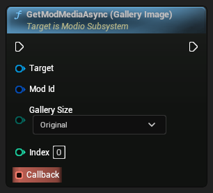

```cpp
void K2_GetModMediaGalleryImageAsync(FModioModID ModId, EModioGallerySize GallerySize, int32 Index, FOnGetMediaDelegate Callback)
```


##### Requirements
* _initialized-sdk_
* _no-rate-limiting_


##### Parameters
<RefTable colWidths={['30%', '70%']} stripes="odd">
| | |
|-|-|
|`Target`|`ModioSubsystem`|
|`ModId`|The mod you want to retrieve an image for|
|`GallerySize`|Size of the image you want to retrieve|
|`Index`|The zero-based index of the image you want to retrieve|
|`Callback`|Callback containing a status code and an Optional containing a path to the image file on disk|
</RefTable>


##### Error Values
<RefTable colWidths={['30%', '70%']} stripes="odd">
| | |
|-|-|
|`NetworkError`|Couldn't connect to mod.io servers
|`SDKNotInitialized`|SDK not initialized
|`EntityNotFoundError`|Specified mod media does not exist or was deleted
|`InsufficientSpace`|Not enough space for the file
|`InvalidArgsError`|The supplied mod ID is invalid
</RefTable>


#### GetModMediaAsync (Avatar)

Downloads the creator avatar for a specified mod. Will use existing file if it is already present on disk and not outdated


```cpp
void K2_GetModMediaAvatarAsync(FModioModID ModId, EModioAvatarSize AvatarSize, FOnGetMediaDelegate Callback)
```


##### Requirements
* _initialized-sdk_
* _no-rate-limiting_


##### Parameters
<RefTable colWidths={['30%', '70%']} stripes="odd">
| | |
|-|-|
|`Target`|`ModioSubsystem`|
|`ModId`|ID of the mod the creator avatar will be retrieved for|
|`AvatarSize`|Parameter indicating the size of avatar image that's required|
|`Callback`|Callback providing a status code and an optional path object pointing to the location of the downloaded image|
</RefTable>


##### Error Values
<RefTable colWidths={['30%', '70%']} stripes="odd">
| | |
|-|-|
|`NetworkError`|Couldn't connect to mod.io servers
|`SDKNotInitialized`|SDK not initialized
|`EntityNotFoundError`|Specified mod media does not exist or was deleted
|`InsufficientSpace`|Not enough space for the file
|`InvalidArgsError`|The supplied mod ID is invalid
</RefTable>


#### GetModInfoAsync

Fetches detailed information about the specified mod, including description and file metadata for the most recent release


```cpp
void K2_GetModInfoAsync(FModioModID ModId, FOnGetModInfoDelegate Callback)
```


##### Requirements
* _initialized-sdk_
* _no-rate-limiting_


##### Parameters
<RefTable colWidths={['30%', '70%']} stripes="odd">
| | |
|-|-|
|`Target`|`ModioSubsystem`|
|`ModId`|Mod ID of the mod to fetch data|
|`Callback`|Callback providing a status code and an optional `ModioModInfo` object with the mod's extended information|
</RefTable>


##### Error Values
<RefTable colWidths={['30%', '70%']} stripes="odd">
| | |
|-|-|
|`NetworkError`|Couldn't connect to mod.io servers
|`SDKNotInitialized`|SDK not initialized
|`EntityNotFoundError`|Specified mod does not exist or was deleted
|`InvalidArgsError`|The supplied mod ID is invalid
</RefTable>


#### GetModDependenciesAsync

For a given Mod ID, fetches a list of any mods that the creator has marked as dependencies
:::warning[Experimental Feature]
This function is part of an experimental feature and is subject to change. 
:::

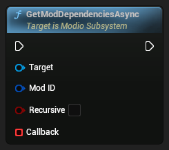

```cpp
void K2_GetModDependenciesAsync(FModioModID ModID, bool Recursive, FOnGetModDependenciesDelegate Callback)
```


##### Requirements
* _initialized-sdk_
* _no-rate-limiting_


##### Parameters
<RefTable colWidths={['30%', '70%']} stripes="odd">
| | |
|-|-|
|`Target`|`ModioSubsystem`|
|`ModID`|The mod to retrieve dependencies for|
|`Recursive`|Fetches dependencies recursively up to a depth of 5|
|`Callback`|Callback providing a status code and an optional `ModioModTagOptions` object containing the available tags|
</RefTable>


##### Error Values
<RefTable colWidths={['30%', '70%']} stripes="odd">
| | |
|-|-|
|`NetworkError`|Couldn't connect to mod.io servers
|`SDKNotInitialized`|SDK not initialized
|`InvalidArgsError`|The supplied mod ID is invalid
</RefTable>


#### GetModCreationHandle

Gets a new mod handle for use with [`SubmitNewModAsync`](#submitnewmodasync).
:::warning[Experimental Feature]
This function is part of an experimental feature and is subject to change. 
:::


```cpp
FModioModCreationHandle K2_GetModCreationHandle()
```


##### Parameters
<RefTable colWidths={['30%', '70%']} stripes="odd">
| | |
|-|-|
|`Target`|`ModioSubsystem`|
</RefTable>


#### GetLanguage

Get the currently applied language


```cpp
EModioLanguage K2_GetLanguage()
```


##### Parameters
<RefTable colWidths={['30%', '70%']} stripes="odd">
| | |
|-|-|
|`Target`|`ModioSubsystem`|
</RefTable>


##### Returns
Current language


#### GetGameInfoAsync

Fetches detailed information about the specified game


```cpp
void K2_GetGameInfoAsync(FModioGameID GameID, FOnGetGameInfoDelegate Callback)
```


##### Requirements
* _initialized-sdk_
* _no-rate-limiting_


##### Parameters
<RefTable colWidths={['30%', '70%']} stripes="odd">
| | |
|-|-|
|`Target`|`ModioSubsystem`|
|`GameID`|Game ID of the game data to fetch|
|`Callback`|Callback providing a status code and an optional `ModioGameInfo` object with the game's extended information|
</RefTable>


##### Error Values
<RefTable colWidths={['30%', '70%']} stripes="odd">
| | |
|-|-|
|`SDKNotInitialized`|SDK not initialized
|`NetworkError`|Couldn't connect to mod.io servers
|`EntityNotFoundError`|Specified game does not exist
|`InvalidArgsError`|The supplied game ID is invalid
</RefTable>


#### ForceUninstallModAsync

Forcibly uninstalls a mod from the system. This can be used when the host application requires additional space for other mods. The current user must not be subscribed to the mod to force uninstall. To remove a mod the current user is subscribed to, first use [`UnsubscribeFromModAsync`](#unsubscribefrommodasync). If the mod does not uninstall (due to a different user on the same system remaining subscribed), `ForceUninstallModAsync` can be called next.


```cpp
void K2_ForceUninstallModAsync(FModioModID ModToRemove, FOnErrorOnlyDelegate Callback)
```


##### Parameters
<RefTable colWidths={['30%', '70%']} stripes="odd">
| | |
|-|-|
|`Target`|`ModioSubsystem`|
|`ModToRemove`|The mod ID to force uninstall.|
|`Callback`|Callback invoked indicating success or failure of the uninstallation.|
</RefTable>


##### Error Values
<RefTable colWidths={['30%', '70%']} stripes="odd">
| | |
|-|-|
|`SDKNotInitialized`|SDK not initialized
|`UserNotAuthenticatedError`|No authenticated user
|ApiErrorRefSuccess|User is still subscribed to the specified mod
|`InvalidArgsError`|The supplied mod ID is invalid
</RefTable>


#### FetchUserPurchasesAsync

Fetches the user's purchases. This populates a runtime cache of purchase information that can be accessed using [`QueryUserPurchasedMods`](#query-user-purchased-mods).


```cpp
void K2_FetchUserPurchasesAsync(FOnFetchUserPurchasesDelegate Callback)
```


##### Requirements
* _initialized-sdk_
* _authenticated-user_
* _no-rate-limiting_


##### Parameters
<RefTable colWidths={['30%', '70%']} stripes="odd">
| | |
|-|-|
|`Target`|`ModioSubsystem`|
|`Callback`|Callback invoked once the call has been completed.|
</RefTable>


#### FetchExternalUpdatesAsync

Synchronises the local list of the current user's subscribed mods with the server. Any mods that have been externally subscribed will be automatically marked for installation, and mods that have been externally removed from the user's subscriptions may be uninstalled if no other local users have a current subscription.


```cpp
void K2_FetchExternalUpdatesAsync(FOnErrorOnlyDelegate OnFetchDone)
```


##### Parameters
<RefTable colWidths={['30%', '70%']} stripes="odd">
| | |
|-|-|
|`Target`|`ModioSubsystem`|
|`On Fetch Done`|Callback invoked when the external state has been retrieved and merged with the local data|
</RefTable>


#### EnableModManagement

Enables the automatic management of installed mods on the system based on the user's subscriptions.


```cpp
FModioErrorCode K2_EnableModManagement(FOnModManagementDelegate Callback)
```


##### Parameters
<RefTable colWidths={['30%', '70%']} stripes="odd">
| | |
|-|-|
|`Target`|`ModioSubsystem`|
|`Callback`|This callback handler will be invoked with a [`ModioModManagementEvent`](#modiomodmanagementevent) for each mod operation performed by the SDK|
</RefTable>


##### Returns
An error code indicating success or failure of enabling mod management.  Note that this is independent of error codes for mod management events.  Inspect the `Callback` for information on each mod management event.


##### Error Values
<RefTable colWidths={['30%', '70%']} stripes="odd">
| | |
|-|-|
|`SDKNotInitialized`|SDK not initialized
|`ModManagementAlreadyEnabled`|Mod management was already enabled. The mod management callback has not been changed.
</RefTable>


#### DeleteModDependenciesAsync

Deletes dependencies from a specified mod, unlinking it from other mods that are no longer required.


```cpp
void K2_DeleteModDependenciesAsync(FModioModID ModID, TArray<FModioModID> Dependencies, FOnErrorOnlyDelegate Callback)
```


##### Requirements
* _initialized-sdk_
* _no-rate-limiting_
* _authenticated-user_


##### Parameters
<RefTable colWidths={['30%', '70%']} stripes="odd">
| | |
|-|-|
|`Target`|`ModioSubsystem`|
|`ModID`|The mod to delete dependencies from|
|`Dependencies`|List of mod IDs to delete as dependencies|
|`Callback`|Callback providing a status code to indicate if the dependencies were deleted successfully|
</RefTable>


##### Error Values
<RefTable colWidths={['30%', '70%']} stripes="odd">
| | |
|-|-|
|GenericError::SDKNotInitialized|SDK not initialized
|UserDataError::InvalidUser|No authenticated user
|HttpError::RateLimited|Too many frequent calls to the API. Wait some time and try again.
|GenericError::BadParameter|The supplied mod ID is invalid
|NetworkError|Couldn't connect to mod.io servers
|EntityNotFoundError|Specified mod could not be found
</RefTable>


#### CloseTempModSet

Uninstall every temp mod unless the user is subscribed.


```cpp
FModioErrorCode K2_CloseTempModSet()
```


##### Requirements
* _initialized-sdk_
* _mod-management-enabled_
* _temp-mod-set-initialized_


##### Parameters
<RefTable colWidths={['30%', '70%']} stripes="odd">
| | |
|-|-|
|`Target`|`ModioSubsystem`|
</RefTable>


##### Returns
Error code indicating the status of the `TempModSet`. Will be empty if it was successful


##### Error Values
<RefTable colWidths={['30%', '70%']} stripes="odd">
| | |
|-|-|
|`SDKNotInitialized`|SDK not initialized
|`ModManagementDisabled`|Mod management not enabled
|`TempModSetNotInitialized`|`TempModSet` not initialized
</RefTable>


#### ClearUserDataAsync

De-authenticates the current mod.io user for the current session, and clears all user-specific data stored on the current device. Any subscribed mods that are installed but do not have other local users subscribed will be uninstalled


```cpp
void K2_ClearUserDataAsync(FOnErrorOnlyDelegate Callback)
```


##### Requirements
* _initialized-sdk_
* _no-rate-limiting_
* _authenticated-user_


##### Parameters
<RefTable colWidths={['30%', '70%']} stripes="odd">
| | |
|-|-|
|`Target`|`ModioSubsystem`|
|`Callback`|Callback providing a status code indicating the outcome of clearing the user data. Error codes returned by this function are informative only - it will always succeed.|
</RefTable>


##### Error Values
<RefTable colWidths={['30%', '70%']} stripes="odd">
| | |
|-|-|
|`SDKNotInitialized`|SDK not initialized
|`UserNotAuthenticatedError`|No authenticated user
</RefTable>


#### AuthenticateUserExternalAsync

Uses platform-specific authentication to associate a mod.io user account with the current platform user


```cpp
void K2_AuthenticateUserExternalAsync(FModioAuthenticationParams User, EModioAuthenticationProvider Provider, FOnErrorOnlyDelegate Callback)
```


##### Requirements
* _initialized-sdk_
* _no-rate-limiting_
* _no-authenticated-user_


##### Parameters
<RefTable colWidths={['30%', '70%']} stripes="odd">
| | |
|-|-|
|`Target`|`ModioSubsystem`|
|`User`|Authentication payload data to submit to the provider|
|`Provider`|The provider to use to perform the authentication|
|`Callback`|Callback invoked once the authentication request has been made|
</RefTable>


##### Error Values
<RefTable colWidths={['30%', '70%']} stripes="odd">
| | |
|-|-|
|`NetworkError`|Couldn't connect to mod.io servers
|`ConfigurationError`|The SDK's configuration is not valid
|`InvalidArgsError`|The arguments passed to the function have failed validation
|`UserTermsOfUseError`|The user has not yet accepted the mod.io Terms of Use
|`SDKNotInitialized`|SDK not initialized
|`UserAlreadyAuthenticatedError`|Current user is already authenticated. De-authenticate the current user with [`ClearUserDataAsync`](#clearuserdataasync), and re-initialize the SDK by calling [`ShutdownAsync`](#shutdownasync) followed by [`InitializeAsync`](#initializeasync).
</RefTable>


#### AuthenticateUserEmailAsync

Completes email authentication for the current session by submitting the one-time code sent to the user's email address


```cpp
void K2_AuthenticateUserEmailAsync(FModioEmailAuthCode AuthenticationCode, FOnErrorOnlyDelegate Callback)
```


##### Requirements
* _initialized-sdk_
* _no-rate-limiting_
* _no-authenticated-user_


##### Parameters
<RefTable colWidths={['30%', '70%']} stripes="odd">
| | |
|-|-|
|`Target`|`ModioSubsystem`|
|`AuthenticationCode`|User's authentication code|
|`Callback`|Callback providing a status code indicating if authentication was successful or not|
</RefTable>


##### Error Values
<RefTable colWidths={['30%', '70%']} stripes="odd">
| | |
|-|-|
|`NetworkError`|Couldn't connect to mod.io servers
|`SDKNotInitialized`|SDK not initialized
|`UserAlreadyAuthenticatedError`|Current user is already authenticated. De-authenticate the current user with [`ClearUserDataAsync`](#clearuserdataasync), and re-initialize the SDK by calling [`ShutdownAsync`](#shutdownasync) then [`InitializeAsync`](#initializeasync).
</RefTable>


#### ArchiveModAsync

Archives a mod. This mod will no longer be able to be viewed or retrieved via the SDK, but it will still exist should you choose to restore it at a later date. Archiving is restricted to team managers and administrators only. Note that restoration and permanent deletion of a mod is possible only via web interface.


```cpp
void K2_ArchiveModAsync(FModioModID Mod, FOnErrorOnlyDelegate Callback)
```


##### Requirements
* _authenticated-user_
* _initialized-sdk_
* _no-rate-limiting_


##### Parameters
<RefTable colWidths={['30%', '70%']} stripes="odd">
| | |
|-|-|
|`Target`|`ModioSubsystem`|
|`Mod`|The mod to be archived.|
|`Callback`|Callback providing a status code indicating success or failure of archiving the mod.|
</RefTable>


##### Error Values
<RefTable colWidths={['30%', '70%']} stripes="odd">
| | |
|-|-|
|`InsufficientPermissions`|The authenticated user does not have permission to archive this mod. This action is restricted to team managers and administrators only.
|`NetworkError`|Couldn't connect to mod.io servers
|`SDKNotInitialized`|SDK not initialized
|`EntityNotFoundError`|Specified mod does not exist or was deleted
|`InvalidArgsError`|The supplied mod ID is invalid
</RefTable>


#### AddToTempModSet

Add mods to a Temp Mod Set.  Every temp mod specified by `ModIds` will be installed if not already installed.


```cpp
FModioErrorCode K2_AddToTempModSet(TArray<FModioModID> ModIds)
```


##### Requirements
* _initialized-sdk_
* _mod-management-enabled_
* _temp-mod-set-initialized_


##### Parameters
<RefTable colWidths={['30%', '70%']} stripes="odd">
| | |
|-|-|
|`Target`|`ModioSubsystem`|
|`ModIds`|TArray of `ModioModID`s to install as temp mods|
</RefTable>


##### Returns
Error code indicating the status of the `TempModSet`. Will be empty if it was successful


##### Error Values
<RefTable colWidths={['30%', '70%']} stripes="odd">
| | |
|-|-|
|`SDKNotInitialized`|SDK not initialized
|`ModManagementDisabled`|Mod management not enabled
|`TempModSetNotInitialized`|`TempModSet` not initialized
</RefTable>


#### AddModDependenciesAsync

Adds dependencies to a specified mod, linking it with other mods that are required for it to function


```cpp
void K2_AddModDependenciesAsync(FModioModID ModID, TArray<FModioModID> Dependencies, FOnErrorOnlyDelegate Callback)
```


##### Requirements
* _initialized-sdk_
* _no-rate-limiting_
* _authenticated-user_


##### Parameters
<RefTable colWidths={['30%', '70%']} stripes="odd">
| | |
|-|-|
|`Target`|`ModioSubsystem`|
|`ModID`|The mod to add dependencies to|
|`Dependencies`|List of mod dependencies to add|
|`Callback`|Callback providing a status code to indicate if the dependencies were added successfully|
</RefTable>


##### Error Values
<RefTable colWidths={['30%', '70%']} stripes="odd">
| | |
|-|-|
|GenericError::SDKNotInitialized|SDK not initialized
|UserDataError::InvalidUser|No authenticated user
|HttpError::RateLimited|Too many frequent calls to the API. Wait some time and try again.
|GenericError::BadParameter|The supplied mod ID is invalid
|NetworkError|Couldn't connect to mod.io servers
|EntityNotFoundError|Specified mod could not be found
</RefTable>


#### Is Using Background Thread

Returns if the background thread is being used or not


```cpp
bool IsUsingBackgroundThread()
```


##### Parameters
<RefTable colWidths={['30%', '70%']} stripes="odd">
| | |
|-|-|
|`Target`|`ModioSubsystem`|
</RefTable>


#### Is Mod Management Busy

Checks if the automatic management process is currently installing or removing mods


```cpp
bool IsModManagementBusy()
```


##### Parameters
<RefTable colWidths={['30%', '70%']} stripes="odd">
| | |
|-|-|
|`Target`|`ModioSubsystem`|
</RefTable>


##### Returns
True if automatic management is currently performing an operation


#### Get Storage Quota

Get the storage quota for a given `EModioStorageLocation` if one has been set.


```cpp
FModioOptionalUInt64 GetStorageQuota(EModioStorageLocation Location)
```


##### Parameters
<RefTable colWidths={['30%', '70%']} stripes="odd">
| | |
|-|-|
|`Target`|`ModioSubsystem`|
|`Location`|The type of storage to get the quota for. *|
</RefTable>


##### Returns
`FModioOptionalUInt64` of the storage quota in bytes for the specified `EModioStorageLocation`. Empty if no quota is set.


#### Get Last Validation Error

If the last request to the mod.io servers returned a validation failure, this function returns extended information describing the fields that failed validation.


```cpp
TArray<FModioValidationError> GetLastValidationError()
```


##### Requirements
* _initialized-sdk_


##### Parameters
<RefTable colWidths={['30%', '70%']} stripes="odd">
| | |
|-|-|
|`Target`|`ModioSubsystem`|
</RefTable>


##### Returns
Collection of `ModioValidationError` objects, or empty collection if there were no validation failures


#### Disable Mod Management

Disables automatic installation or uninstallation of mods based on the user's subscriptions. Allows currently processing installation to complete. Will cancel any pending operations when called.


```cpp
void DisableModManagement()
```


##### Parameters
<RefTable colWidths={['30%', '70%']} stripes="odd">
| | |
|-|-|
|`Target`|`ModioSubsystem`|
</RefTable>


---

### ModioTokenPackLibrary 

Blueprint function library for interacting with ModioTokenPack objects

##### Inheritance Hierarchy
-> BlueprintFunctionLibrary-> Object


---

### ModioUIEnumLocalizationLibrary 

Utility functions for UI enum localization in mod.io

##### Inheritance Hierarchy
-> BlueprintFunctionLibrary-> Object


---

### ModioUILocalizationLibrary 

Utility functions for UI localization in mod.io

##### Inheritance Hierarchy
-> BlueprintFunctionLibrary-> Object


---

### ModioUnsigned64Library 

Library class for operations on FModioUnsigned64

##### Inheritance Hierarchy
-> BlueprintFunctionLibrary-> Object


---


## Structs

### ModioGameInfoList 

Strong type struct to wrap multiple GameInfo indexed by a paged result


---

### ModioGameInfo 

Full game profile with extended information


##### Variables
<RefTable colWidths={['10%', '10%', '20%']} stripes="odd">
| | | |
|-|-|-|
| `FModioGameID` | `GameID` | Unique Game ID |
| `FDateTime` | `DateAdded` | Unix timestamp of date the game was registered |
| `FDateTime` | `DateUpdated` | Unix timestamp of date the game was updated |
| `FDateTime` | `DateLive` | Unix timestamp of date the game was set live |
| `FString` | `UgcName` | Word used to describe user-generated content (mods, items, add-ons etc) |
| `FModioIcon` | `Icon` | Contains media URLs to the icon for the game |
| `FModioLogo` | `Logo` | Contains media URLs to the logo for the game |
| `FModioHeaderImage` | `HeaderImage` | Contains media URLs to the preview header image for the game |
| `FString` | `Name` | Name of the game |
| `FString` | `Summary` | Summary of the game's mod support |
| `FString` | `Instructions` | A guide about creating and uploading mods for this game to mod.io |
| `FString` | `InstructionsUrl` | Link to a mod.io guide, modding wiki, or a page where modders can learn how to make and submit mods to this game's profile |
| `FString` | `ProfileUrl` | URL to the game |
| `FModioTheme` | `Theme` | Theme color values for the game |
| `FModioGameStats` | `Stats` | Numerous aggregate stats for the game |
| `TArray<FModioOtherUrl>` | `OtherUrls` | Creator defined URLs to share |
| `TArray<EModioModfilePlatform>` | `Platforms` | Platforms that are supported by this title |
| `bool` | `bAllowNegativeRatings` | Whether or not the game allows negative ratings |
| `EGameMonetizationFlags` | `GameMonetizationOptions` | Monetization options for the game |
| `EGameMaturityFlags` | `GameMaturityOptions` | Maturity options for the game |
| `FString` | `VirtualTokenName` | Name of the Virtual Tokens for this game |
| `TArray<FModioGamePlatform>` | `PlatformSupport` | Platforms that are supported by this title |
| `TArray<FModioModTagInfo>` | `TagOptions` | Tags available for this game |
</RefTable>


---

### ModioModTagInfo 

Metadata about a group of tags that can be used for filtering mods


##### Variables
<RefTable colWidths={['10%', '10%', '20%']} stripes="odd">
| | | |
|-|-|-|
| `FString` | `TagGroupName` | Raw unlocalized tag group name |
| `TArray<FString>` | `TagGroupValues` | Valid raw unlocalized tag values this group contains |
| `TMap<FString,FText>` | `TagGroupNameLocalizationData` | Culture code -> localized tag category name mapping for all configured languages |
| `TArray<FModioModTagLocalizationData>` | `TagGroupValueLocalizationData` | Localization data for this tag category's values in all configured languages |
| `bool` | `bAllowMultipleSelection` | True if multiple tags from the group can be used simultaneously |
| `bool` | `bHidden` | True if only visible by admins |
| `bool` | `bLocked` | True if only editable by admins |
</RefTable>


---

### ModioLocalizedTagCategory 

Struct containing pre-localized display strings for a tag group


##### Variables
<RefTable colWidths={['10%', '10%', '20%']} stripes="odd">
| | | |
|-|-|-|
| `FString` | `GroupName` | Localized display string for this tag category's name |
| `TArray<FString>` | `Tags` | Localized display strings for all valid values in this tag category |
</RefTable>


---

### ModioModTagLocalizationData 

Localization data for an individual tag value


##### Variables
<RefTable colWidths={['10%', '10%', '20%']} stripes="odd">
| | | |
|-|-|-|
| `FString` | `Tag` | The original raw unlocalized tag value used by the REST API |
| `TMap<FString,FText>` | `Translations` | Culture code -> Localized tag value string mapping for all configured languages. |
</RefTable>


---

### ModioGamePlatform 

Details about a platform that a Game supports


##### Variables
<RefTable colWidths={['10%', '10%', '20%']} stripes="odd">
| | | |
|-|-|-|
| `EModioModfilePlatform` | `Platform` | A platform supported by a title |
| `bool` | `Locked` | Whether or not this platform is locked from having files submitted to it by players |
| `bool` | `Moderated` | Whether or not this platform's file submissions are moderated |
</RefTable>


---

### ModioOtherUrl 

Strong type struct representing creator defined urls to share


##### Variables
<RefTable colWidths={['10%', '10%', '20%']} stripes="odd">
| | | |
|-|-|-|
| `FString` | `Label` | Label of the link you are sharing |
| `FString` | `Url` | The URL to be associated with the label |
</RefTable>


---

### ModioGameStats 

Numerous aggregate stats for the game


##### Variables
<RefTable colWidths={['10%', '10%', '20%']} stripes="odd">
| | | |
|-|-|-|
| `FModioGameID` | `GameID` | Unique game id |
| `int64` | `ModCountTotal` | Available mod count for the game |
| `int64` | `ModDownloadsToday` | Mods downloaded today for the game |
| `int64` | `ModDownloadsTotal` | Total mods downloaded for the game |
| `int64` | `ModDownloadsDailyAverage` | Average mods downloaded on a daily basis |
| `int64` | `ModSubscribersTotal` | Number of total users who have subscribed to the mods for the game |
| `int64` | `DateExpires` | Unix timestamp until this game's statistics are considered stale |
</RefTable>


---

### ModioGameID 

Strong type struct to wrap a GameID to uniquely identify a single game in mod.io


---

### ModioTheme 

Theme color values for the game


##### Variables
<RefTable colWidths={['10%', '10%', '20%']} stripes="odd">
| | | |
|-|-|-|
| `FString` | `Primary` | The primary hex color code |
| `FString` | `Dark` | The dark hex color code |
| `FString` | `Light` | The light hex color code |
| `FString` | `Success` | The success hex color code |
| `FString` | `Warning` | The warning hex color code |
| `FString` | `Danger` | The danger hex color code |
</RefTable>


---

### ModioHeaderImage 

Contains media URLs to the preview header image for the game


##### Variables
<RefTable colWidths={['10%', '10%', '20%']} stripes="odd">
| | | |
|-|-|-|
| `FString` | `Filename` | Header image filename including extension |
| `FString` | `Original` | URL to the full-sized header image |
</RefTable>


---

### ModioLogo 

Contains media URLs to the logo for the game


##### Variables
<RefTable colWidths={['10%', '10%', '20%']} stripes="odd">
| | | |
|-|-|-|
| `FString` | `Filename` | Logo filename including extension. |
| `FString` | `Original` | URL to the full-sized logo. |
| `FString` | `Thumb320x180` | URL to the small logo thumbnail. |
| `FString` | `Thumb640x360` | URL to the medium logo thumbnail. |
| `FString` | `Thumb1280x720` | URL to the large logo thumbnail. |
</RefTable>


---

### ModioIcon 

Contains media URLs to the icon for the game


##### Variables
<RefTable colWidths={['10%', '10%', '20%']} stripes="odd">
| | | |
|-|-|-|
| `FString` | `Filename` | Icon filename including extension |
| `FString` | `Original` | URL to the full-sized icon |
| `FString` | `Thumb64x64` | URL to the small icon thumbnail |
| `FString` | `Thumb128x128` | URL to the medium icon thumbnail |
| `FString` | `Thumb256x256` | URL to the large icon thumbnail |
</RefTable>


---

### ModioPagedResult 

Strong type struct to acknowledge the position of a result relative to the API endpoint's results


##### Variables
<RefTable colWidths={['10%', '10%', '20%']} stripes="odd">
| | | |
|-|-|-|
| `int32` | `PageIndex` | The index of this page |
| `int32` | `PageSize` | The amount of results allowed to be displayed within a page |
| `int32` | `PageCount` | The total amount of pages |
| `int32` | `TotalResultCount` | The total amount of results |
| `int32` | `ResultCount` | The amount of results for this page |
</RefTable>


---

### ModioModInfoList 

Strong type struct to wrap multiple ModInfo indexed by a paged result


---

### ModioModInfo 

Full mod profile including current release information, media links, and stats


##### Variables
<RefTable colWidths={['10%', '10%', '20%']} stripes="odd">
| | | |
|-|-|-|
| `FModioModID` | `ModId` | Unique Mod ID |
| `FString` | `ProfileName` | Name of the mod |
| `FString` | `ProfileSummary` | Summary of the mod |
| `FString` | `ProfileDescription` | Detailed description in HTML format |
| `FString` | `ProfileDescriptionPlaintext` | Detailed description in plaintext |
| `FString` | `ProfileURL` | URL to the mod profile |
| `FModioUser` | `ProfileSubmittedBy` | Information on the user who submitted the mod |
| `FDateTime` | `ProfileDateAdded` | Unix timestamp of the date the mod was registered |
| `FDateTime` | `ProfileDateUpdated` | Unix timestamp of the date the mod was updated |
| `FDateTime` | `ProfileDateLive` | Unix timestamp of the date the mod was marked live |
| `EModioMaturityFlags` | `ProfileMaturityOption` | Flags for maturity options. Maturity options are flagged by the mod developer. This is only relevant if the parent game allows mods to be labeled as mature. |
| `EModioModCommunityOptionsFlags` | `CommunityOptions` | Community options for the mod |
| `bool` | ~`bVisible_DEPRECATED`~ | Deprecated as of 2023.6 release. Please use `EModioObjectVisibilityFlags Visibility` instead. |
| `EModioObjectVisibilityFlags` | `Visibility` | Enum parameter to signal the backend if the mod to upload would be publicly visible. Default value is Public |
| `bool` | `Dependencies` | If this mod has any dependencies |
| `FString` | `MetadataBlob` | Stored property to the metadata string |
| `FModioFileMetadata` | `FileInfo` | Information about the mod's most recent public release |
| `TArray<FModioMetadata>` | `MetadataKvp` | Arbitrary key-value metadata set for this mod |
| `TArray<FModioModTag>` | `Tags` | Tags this mod has set |
| `int32` | `NumGalleryImages` | Number of images in the mod's media gallery |
| `FModioYoutubeURLList` | `YoutubeURLs` | List of youtube links provided by the creator of the mod |
| `FModioSketchfabURLList` | `SketchfabURLs` | List of sketchfab links provided by the creator of the mod |
| `FModioModStats` | `Stats` | Stats and rating information for the mod |
| `EModioModServerSideStatus` | `ModStatus` | Status of the mod |
| `FModioUnsigned64` | `Price` | Price of this mod |
</RefTable>


---

### ModioUnsigned64 

Trivial Blueprint-compatible wrapper around an unsigned 64-bit integer


---

### ModioModStats 

Contains download stats and ratings for a mod


##### Variables
<RefTable colWidths={['10%', '10%', '20%']} stripes="odd">
| | | |
|-|-|-|
| `int64` | `PopularityRankPosition` | Current rank of the mod. |
| `int64` | `PopularityRankTotalMods` | Number of ranking spots the current rank is measured against. |
| `int64` | `DownloadsTotal` | Number of total mod downloads. |
| `int64` | `SubscribersTotal` | Number of total users who have subscribed to the mod. |
| `int64` | `RatingTotal` | Number of times this mod has been rated. |
| `int64` | `RatingPositive` | Number of positive ratings. |
| `int64` | `RatingNegative` | Number of negative ratings. |
| `int64` | `RatingPercentagePositive` | Number of positive ratings, divided by the total ratings to determine its percentage score. |
| `float` | `RatingWeightedAggregate` | Overall rating of this item calculated using the [Wilson score confidence interval](https://www.evanmiller.org/how-not-to-sort-by-average-Ratinghtml). This column is good to sort on, as it will order items based on number of ratings and will place items with many positive ratings above those with a higher score but fewer ratings. We actually get a double back from the server, but it's converted to a float for blueprint support |
| `FString` | `RatingDisplayText` | Textual representation of the rating in format: Overwhelmingly Positive -> Very Positive -> Positive -> Mostly Positive -> Mixed -> Negative -> Mostly Negative -> Very Negative -> Overwhelmingly Negative -> Unrated |
</RefTable>


---

### ModioSketchfabURLList 

Struct to store links and metadata associated to Sketchfab URLs for Blueprint


---

### ModioYoutubeURLList 

Struct to store links and metadata associated to YouTube URLs for Blueprint


---

### ModioModTag 

Strong type struct to wrap a Mod tag


##### Variables
<RefTable colWidths={['10%', '10%', '20%']} stripes="odd">
| | | |
|-|-|-|
| `FString` | `Tag` | A string that represents a mod tag |
| `FText` | `TagLocalized` | A localized tag string |
</RefTable>


---

### ModioMetadata 

Strong type struct to represent key-value pairs for mod metadata


##### Variables
<RefTable colWidths={['10%', '10%', '20%']} stripes="odd">
| | | |
|-|-|-|
| `FString` | `Key` | Key of the metadata |
| `FString` | `Value` | Value of the metadata |
</RefTable>


---

### ModioFileMetadata 

Metadata for a release archive for a mod


##### Variables
<RefTable colWidths={['10%', '10%', '20%']} stripes="odd">
| | | |
|-|-|-|
| `FModioFileMetadataID` | `MetadataId` | Unique modfile id. |
| `FModioModID` | `ModId` | Unique mod id. |
| `FDateTime` | `DateAdded` | Unix timestamp of date file was added. |
| `EModioVirusScanStatus` | `CurrentVirusScanStatus` | Current virus scan status of the file. For newly added files that have yet to be scanned this field will change frequently until a scan is complete |
| `EModioVirusStatus` | `CurrentVirusStatus` | Was a virus detected? |
| `FModioUnsigned64` | `Filesize` | Size of the file in bytes. |
| `FModioUnsigned64` | `FilesizeUncompressed` | Total size of all files in the mod after installation. |
| `FString` | `Filename` | Filename including extension. |
| `FString` | `Version` | Release version this file represents. |
| `FString` | `Changelog` | Changelog for the file. |
| `FString` | `MetadataBlob` | Metadata stored by the game developer for this file. |
</RefTable>


---

### ModioModID 

Strong type struct to wrap a ModID to uniquely identify user-generated content


---

### ModioFileMetadataID 

Strong type struct to store the associated metadata to a mod file


---

### ModioUser 

Object representing a mod.io user profile information


##### Variables
<RefTable colWidths={['10%', '10%', '20%']} stripes="odd">
| | | |
|-|-|-|
| `FModioUserID` | `UserId` | User's unique ID |
| `FString` | `Username` | Name chosen by the user |
| `FDateTime` | `DateOnline` | Unix timestamp of the last time the user was online |
| `FString` | `ProfileUrl` | URL of the user's mod.io profile |
| `FString` | `DisplayNamePortal` | Display name of this User for the given Portal, if their account is linked |
</RefTable>


---

### ModioUserID 

Strong type struct to wrap a UserID which uniquely identifies a user in mod.io


---

### ModioModTagOptions 

Strong type struct to wrap multiple ModTagInfo indexed by a paged result


---

### ModioTokenPackList 

Strong type struct to wrap multiple TokenPacks indexed by a paged result


---

### ModioTokenPack 

A wrapper type around the Unreal Engine type FOnlineStoreOffer, representing a platform-agnostic store offer/product, e.g a Premium Currency pack.


---

### ModioErrorCode 

Wrapper around `Modio::ErrorCode`


---

### ModioOptionalGameInfo 

Strong type struct to store an optional GameInfo parameter


---

### ModioOptionalImage 

Strong type struct to wrap Image data as an optional value


---

### ModioOptionalModDependencyList 

Strong type struct to wrap a ModDependencyList data as an optional value


---

### ModioOptionalModInfo 

Strong type struct to store an optional ModInfo parameter


---

### ModioOptionalModTagOptions 

Strong type struct that wraps mod tag options in an optional value


---

### ModioOptionalTerms 

Struct to store an optional value for the terms of service


---

### ModioOptionalUInt64 

Strong type struct to wrap uint64 as an optional value


---

### ModioOptionalModInfoList 

Struct to wrap ModInfoList into an optional parameter


---

### ModioOptionalGameInfoList 

Struct to wrap GameInfoList into an optional parameter


---

### ModioModManagementEvent 

Simple struct representing the outcome of a mod management operation


##### Variables
<RefTable colWidths={['10%', '10%', '20%']} stripes="odd">
| | | |
|-|-|-|
| `FModioModID` | `ID` | ID for the mod that the event occurred on |
| `EModioModManagementEventType` | `Event` | What type of event occurred |
| `FModioErrorCode` | `Status` | Empty if operation completed successfully, truthy/contains error code if operation failed |
</RefTable>


---

### ModioOptionalUserList 

Struct to wrap UserList into an optional parameter


---

### ModioOptionalModChangeMap 

Strong type struct to wrap a ModDependencyList data as an optional value


---

### ModioOptionalTransactionRecord 

Struct to store an optional value for the transaction record


---

### ModioOptionalEntitlementConsumptionStatusList 

Optional class representing a list of entitlement consumption statuses that may be a page from a larger set of results


---

### ModioOptionalModID 

Strong type struct to wrap ModID as an optional value


---

### ModioAuthenticationParams 

Struct to encapsulate data passed to external authentication systems * This struct is used to store authentication parameters required by various external  authentication providers. These parameters are used to authenticate users with  external systems (e.g., Xbox, Steam, Google, etc.).


##### Variables
<RefTable colWidths={['10%', '10%', '20%']} stripes="odd">
| | | |
|-|-|-|
| `FString` | `AuthToken` | Stored property of the authentication token This token is required for authentication with the external provider. |
| `FString` | `UserEmail` | Stored property of the user email This is the email address of the user, which is used for authentication  purposes in certain external systems. |
| `bool` | `bUserHasAcceptedTerms` | Boolean that signals if the user has accepted the terms of service This flag is used to indicate whether the user has agreed to the terms of service  required by the external authentication provider. |
| `TMap<FString,FString>` | `ExtendedParameters` | Stored property of extended parameters required by some providers This map holds additional key-value pairs for authentication that might be  required by specific authentication providers. These could include things like  additional credentials or metadata. |
</RefTable>


---

### ModioApiKey 

Strong type struct to wrap an ApiKey, used to communicate with the mod.io service


---

### ModioGuid 

Strong type struct to wrap a Guid, used to communicate with the mod.io metrics service


---

### ModioOptionalGuid 

Strong type struct to wrap Guid as an optional value


---

### ModioEmailAddress 

Strong type struct to wrap an email address


---

### ModioEmailAuthCode 

Strong type struct to wrap the code sent to the email address to obtain an authentication token


---

### ModioEntitlementParams 

Simple struct to encapsulate portal-specific data required when consuming entitlements


---

### ModioMetricsSessionParams 

Simple struct to store metric session specific parameters


---

### ModioTokenPackID 

Strong type struct to wrap Token Pack ID


---

### ModioCreateModFileParams 

Strong type for the parameters needed to create a mod file


##### Variables
<RefTable colWidths={['10%', '10%', '20%']} stripes="odd">
| | | |
|-|-|-|
| `FString` | `PathToModRootDirectory` | The file system path that references the directory with the mod files. The plugin will compress the contents of this path into a .zip archive. |
</RefTable>


---

### ModioCreateModParams 

Strong type for the parameters needed to create a mod file


##### Variables
<RefTable colWidths={['10%', '10%', '20%']} stripes="odd">
| | | |
|-|-|-|
| `FString` | `PathToLogoFile` | The file system path to the file used as the mod logo |
| `FString` | `Name` | The name for the mod to create |
| `FString` | `Summary` | Brief description for the mod to create |
</RefTable>


---

### ModioEditModParams 

Struct type to specify the fields to update for a mod


---

### ModioEntitlementWalletBalance 

Updated wallet balance from the sync entitlements call


##### Variables
<RefTable colWidths={['10%', '10%', '20%']} stripes="odd">
| | | |
|-|-|-|
| `FModioUnsigned64` | `Balance` | The updated balance of the wallet |
</RefTable>


---

### ModioOptionalEntitlementWalletBalance 

Optional updated wallet balance from the sync entitlements call


---

### ModioEntitlementConsumptionVirtualCurrencyDetails 

Further details about a Virtual Currency entitlement that was consumed


##### Variables
<RefTable colWidths={['10%', '10%', '20%']} stripes="odd">
| | | |
|-|-|-|
| `int32` | `TokensAllocated` | Amount of tokens that were issued for this specific entitlement consumption |
</RefTable>


---

### EntitlementConsumptionStatus 

The result of an entitlement's consumption


##### Variables
<RefTable colWidths={['10%', '10%', '20%']} stripes="odd">
| | | |
|-|-|-|
| `FString` | `TransactionId` | ID of the transaction to redeem this entitlement |
| `EModioEntitlementConsumptionState` | `TransactionState` | State of the transaction |
| `FString` | `SkuId` | ID of the SKU that we attempted to consume |
| `bool` | `EntitlementConsumed` | Whether this entitlement was consumed or not |
| `EModioEntitlementType` | `EntitlementType` | Type of Entitlement that was consumed |
| `FModioEntitlementConsumptionVirtualCurrencyDetails` | `VirtualCurrencyDetails` | Details about virtual currency entitlement consumption |
</RefTable>


---

### ModioEntitlementConsumptionStatusList 

Class representing a list of entitlement consumption statuses that may be a page from a larger set of results


##### Variables
<RefTable colWidths={['10%', '10%', '20%']} stripes="odd">
| | | |
|-|-|-|
| `FModioPagedResult` | `PagedResult` | Stored property for a paged result, which provides context on the entitlement consumption status list |
| `TArray<FEntitlementConsumptionStatus>` | `InternalList` | Stored property for the dependency list |
| `FModioOptionalEntitlementWalletBalance` | `WalletBalance` | Updated wallet balance from syncing entitlements |
</RefTable>


---

### ModioFilterParams 

Class storing a set of filter parameters for use in [`ListAllModsAsync`](#listallmodsasync)


---

### ModioPresetFilterParams 

Helper struct for named preset filter parameters


##### Variables
<RefTable colWidths={['10%', '10%', '20%']} stripes="odd">
| | | |
|-|-|-|
| `FText` | `PresetName` | Preset name |
| `TArray<FString>` | `Tags` | List of tags to filter on |
| `TArray<FString>` | `ExcludedTags` | List of tags to exclude from filtering |
| `EModioSortDirection` | `Direction` | Sorting direction (default is ascending) |
| `EModioSortFieldType` | `SortField` | Field to use for sorting (default is ID) |
| `int64` | `Count` | Number of results to return |
</RefTable>


---

### ModioImageWrapper 

Strong type struct to wrap image data returned by the mod.io API


##### Variables
<RefTable colWidths={['10%', '10%', '20%']} stripes="odd">
| | | |
|-|-|-|
| `FString` | `ImagePath` | The path on disk to the image |
</RefTable>


---

### ModioInitializeOptions 

Struct type to store the initialization options used by the mod.io SDK


##### Variables
<RefTable colWidths={['10%', '10%', '20%']} stripes="odd">
| | | |
|-|-|-|
| `FModioGameID` | `GameId` | The mod.io-provided ID for the game |
| `FModioApiKey` | `ApiKey` | The mod.io-provided API key for your application or game |
| `EModioEnvironment` | `GameEnvironment` | The mod.io environment you want to run the SDK on |
| `EModioPortal` | `PortalInUse` | The portal your title is running through |
| `TMap<FString,FString>` | `ExtendedInitializationParameters` | Extended platform-specific initialization parameters. Refer to the platform documentation for valid keys and their values. Unrecognized values will be ignored |
| `bool` | `bUseBackgroundThread` | Set mod.io to run with background thread |
</RefTable>


---

### ModioModChangeMap 

Strong type struct to wrap mod change information


##### Variables
<RefTable colWidths={['10%', '10%', '20%']} stripes="odd">
| | | |
|-|-|-|
| `TMap<FModioModID,EModioModChangeType>` | `Changes` | A map representing mod change types for each mod ID |
</RefTable>


---

### ModioModCollectionEntry 

Struct representing a mod which is installed locally


---

### ModioModCreationHandle 

Struct type to store the handle when a new mod is created


---

### ModioModDependency 

Basic reference data about a dependency relationship to another mod


:::warning[Experimental Feature]
This class is part of an experimental feature and is subject to change. 
:::


##### Variables
<RefTable colWidths={['10%', '10%', '20%']} stripes="odd">
| | | |
|-|-|-|
| `FModioModID` | `ModID` | The ID of the mod dependency |
| `FString` | `ModName` | The name of the mod dependency |
| `FDateTime` | `DateAdded` | Unix timestamp of the date the mod was registered |
| `FDateTime` | `DateUpdated` | Unix timestamp of the date the mod was updated |
| `uint8` | `DependencyDepth` | The level at which this dependency sits. When greater than zero (0), it means that this dependency relies on additional dependencies. |
| `FModioLogo` | `Logo` | Media data related to the mod logo |
| `FModioFileMetadata` | `FileInfo` | Information about the mod's most recent public release |
| `EModioModServerSideStatus` | `Status` | The current ModStatus on the server: Accepted, NotAccepted, or Deleted. |
| `EModioObjectVisibilityFlags` | `Visibility` | The visibility status of the mod, default to Public |
</RefTable>


---

### ModioModDependencyList 

Strong type struct to wrap multiple ModDependency indexed by a paged result


:::warning[Experimental Feature]
This class is part of an experimental feature and is subject to change. 
:::


##### Variables
<RefTable colWidths={['10%', '10%', '20%']} stripes="odd">
| | | |
|-|-|-|
| `FModioPagedResult` | `PagedResult` | Stored property for a paged result, which provides context on the dependency list |
| `TArray<FModioModDependency>` | `InternalList` | Stored property for the dependency list |
| `FModioUnsigned64` | `TotalFilesize` | Total size of all the dependency files in bytes. |
| `FModioUnsigned64` | `TotalFilesizeUncompressed` | Total size of the uncompressed dependency files in bytes. |
</RefTable>


---

### ModioModProgressInfo 

Strong type struct representing the progress of a mod installation or update


##### Variables
<RefTable colWidths={['10%', '10%', '20%']} stripes="odd">
| | | |
|-|-|-|
| `FModioModID` | `ID` | The mod ID of the mod being processed |
</RefTable>


---

### ModioOptionalModProgressInfo 

Struct strong type to wrap an optional value for the ModProgressInfo


---

### ModioReportParams 

Struct type to store the parameters used to report a mod


---

### StorageInfoKey 


##### Variables
<RefTable colWidths={['10%', '10%', '20%']} stripes="odd">
| | | |
|-|-|-|
| `EModioStorageLocation` | `Location` |  |
| `EModioStorageUsage` | `Usage` |  |
</RefTable>


---

### ModioStorageInfo 


---

### ModioLink 

Strong type struct to store links and metadata associated with a mod


##### Variables
<RefTable colWidths={['10%', '10%', '20%']} stripes="odd">
| | | |
|-|-|-|
| `FString` | `Text` | The user-facing text for the link |
| `FString` | `URL` | The actual URL for the link |
| `bool` | `bRequired` | Is displaying this link mandatory? |
</RefTable>


---

### ModioTerms 

Struct with the strings to display to a user when showing the terms of use and the reference URLs to mod.io user account page


##### Variables
<RefTable colWidths={['10%', '10%', '20%']} stripes="odd">
| | | |
|-|-|-|
| `FString` | `AgreeButtonText` | Text to display on the affirmative/OK button |
| `FString` | `DisagreeButtonText` | Text to display on the negative/cancel button |
| `FModioLink` | `WebsiteLink` | Link to the mod.io website |
| `FModioLink` | `TermsLink` | Link to the mod.io terms of use |
| `FModioLink` | `PrivacyLink` | Link to the mod.io Privacy Policy |
| `FModioLink` | `RefundLink` | Link to the mod.io Refund Policy |
| `FModioLink` | `ManageLink` | Link to the mod.io Manage User Account page |
| `FString` | `TermsText` | The plaintext version of the mod.io terms of use |
</RefTable>


---

### ModioOptionalTokenPack 

Strong type struct to store an optional ModInfo parameter


---

### ModioOptionalTokenPackList 

Struct to wrap ModInfoList into an optional parameter


---

### ModioTransactionRecord 

Contains information about a successful transaction for a mod


##### Variables
<RefTable colWidths={['10%', '10%', '20%']} stripes="odd">
| | | |
|-|-|-|
| `FModioModID` | `AssociatedModID` | The mod the purchase was for |
| `FModioUnsigned64` | `Price` | The price the mod was purchased for |
| `FModioUnsigned64` | `UpdatedUserWalletBalance` | The updated balance in the user's wallet after the transaction |
</RefTable>


---

### ModioOptionalUser 

Struct wrapper for an optional ModioUser


---

### ModioUserList 

Strong type struct to wrap multiple Users indexed by a paged result


##### Variables
<RefTable colWidths={['10%', '10%', '20%']} stripes="odd">
| | | |
|-|-|-|
| `FModioPagedResult` | `PagedResult` | A paged result property |
| `TArray<FModioUser>` | `InternalList` | Internal array of users |
</RefTable>


---

### ModioValidationError 

Wrapper struct containing information about a field validation error


##### Variables
<RefTable colWidths={['10%', '10%', '20%']} stripes="odd">
| | | |
|-|-|-|
| `FString` | `FieldName` | String description of the field that failed validation |
| `FString` | `ValidationFailureDescription` | String description of the validation failure |
</RefTable>


---

### ModioCreateModFileMemoryParams 


##### Variables
<RefTable colWidths={['10%', '10%', '20%']} stripes="odd">
| | | |
|-|-|-|
| `TArray<uint8>` | `ModMemory` |  |
</RefTable>


---


## Functions 


### Set Session Identifier

Changes the session identifier for the provided set of [`ModioInitializeOptions`](#modioinitializeoptions)

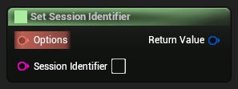

```cpp
FModioInitializeOptions SetSessionIdentifier(FModioInitializeOptions Options, FString SessionIdentifier)
```


#### Parameters
<RefTable colWidths={['30%', '70%']} stripes="odd">
| | |
|-|-|
|`Options`|The template [`ModioInitializeOptions`](#modioinitializeoptions)|
|`SessionIdentifier`|The new session id to use|
</RefTable>


#### Returns
New [`ModioInitializeOptions`](#modioinitializeoptions) object with the session identifier set to the desired value


---


### Set Session Id

Changes the session identifier for the provided Metrics Session parameters


```cpp
FModioMetricsSessionParams SetSessionId(FModioMetricsSessionParams Params, FModioGuid Id)
```


#### Parameters
<RefTable colWidths={['30%', '70%']} stripes="odd">
| | |
|-|-|
|`Params`|The template Metrics Session parameters|
|`Id`|The intended Guid to store in the Metrics Session parameters|
</RefTable>


---


### Set Portal

Changes the portal for the provided set of [`ModioInitializeOptions`](#modioinitializeoptions)


```cpp
FModioInitializeOptions SetPortal(FModioInitializeOptions Options, EModioPortal PortalToUse)
```


#### Parameters
<RefTable colWidths={['30%', '70%']} stripes="odd">
| | |
|-|-|
|`Options`|The template [`ModioInitializeOptions`](#modioinitializeoptions)|
|`PortalToUse`|The new portal to use|
</RefTable>


#### Returns
New [`ModioInitializeOptions`](#modioinitializeoptions) object with the portal set to the desired value


---


### Set Game Id

Changes the game id for the provided set of [`ModioInitializeOptions`](#modioinitializeoptions)


```cpp
FModioInitializeOptions SetGameId(FModioInitializeOptions Options, int64 GameId)
```


#### Parameters
<RefTable colWidths={['30%', '70%']} stripes="odd">
| | |
|-|-|
|`Options`|The template [`ModioInitializeOptions`](#modioinitializeoptions)|
|`GameId`|The new game id to use|
</RefTable>


#### Returns
New [`ModioInitializeOptions`](#modioinitializeoptions) object with the game id set to the desired value


---


### Set Game Environment

Changes the game environment for the provided set of [`ModioInitializeOptions`](#modioinitializeoptions)


```cpp
FModioInitializeOptions SetGameEnvironment(FModioInitializeOptions Options, EModioEnvironment GameEnvironment)
```


#### Parameters
<RefTable colWidths={['30%', '70%']} stripes="odd">
| | |
|-|-|
|`Options`|The template [`ModioInitializeOptions`](#modioinitializeoptions)|
|`GameEnvironment`|The new environment to use|
</RefTable>


#### Returns
New [`ModioInitializeOptions`](#modioinitializeoptions) object with the game environment set to the desired value


---


### Set Extended Initialization Parameters

Sets extended initialization parameters for the provided set of [`ModioInitializeOptions`](#modioinitializeoptions)


```cpp
FModioInitializeOptions SetExtendedInitializationParameters(FModioInitializeOptions Options, TMap<FString,FString> ExtendedParameters)
```


#### Parameters
<RefTable colWidths={['30%', '70%']} stripes="odd">
| | |
|-|-|
|`Options`|The template [`ModioInitializeOptions`](#modioinitializeoptions)|
|`ExtendedParameters`|The new extended parameters to use (will overwrite existing values)|
</RefTable>


#### Returns
New [`ModioInitializeOptions`](#modioinitializeoptions) object with the extended parameters set to the desired value


---


### Set Background Thread

Changes the background thread usage for the provided set of [`ModioInitializeOptions`](#modioinitializeoptions)


```cpp
FModioInitializeOptions SetBackgroundThread(FModioInitializeOptions Options, bool bUseBackgroundThread)
```


#### Parameters
<RefTable colWidths={['30%', '70%']} stripes="odd">
| | |
|-|-|
|`Options`|The template [`ModioInitializeOptions`](#modioinitializeoptions)|
|`bUseBackgroundThread`|Whether to use a background thread|
</RefTable>


#### Returns
New [`ModioInitializeOptions`](#modioinitializeoptions) object with the background thread usage set to the desired value


---


### Set API Key

Changes the API key for the provided set of [`ModioInitializeOptions`](#modioinitializeoptions)

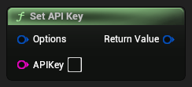

```cpp
FModioInitializeOptions SetAPIKey(FModioInitializeOptions Options, FString APIKey)
```


#### Parameters
<RefTable colWidths={['30%', '70%']} stripes="odd">
| | |
|-|-|
|`Options`|The template [`ModioInitializeOptions`](#modioinitializeoptions)|
|`APIKey`|The new API key to use|
</RefTable>


#### Returns
New [`ModioInitializeOptions`](#modioinitializeoptions) object with the API key set to the desired value


---


### ModioModID != ModioModID

Compares two mod IDs to check whether they're not equal


```cpp
bool NotEqualTo(FModioModID A, FModioModID B)
```


#### Parameters
<RefTable colWidths={['30%', '70%']} stripes="odd">
| | |
|-|-|
|`A`||
|`B`||
</RefTable>


---


### Make Metrics Session Params

Create Metrics Session parameters

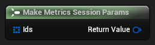

```cpp
FModioMetricsSessionParams MakeMetricsSessionParams(TArray<FModioModID> Ids)
```


#### Parameters
<RefTable colWidths={['30%', '70%']} stripes="odd">
| | |
|-|-|
|`Ids`|The list of mods to store within the Metrics Session parameters|
</RefTable>


---


### Make Initialize Options

Make [`ModioInitializeOptions`](#modioinitializeoptions). Should only be used in conjunction with [`InitializeAsync`](#initializeasync).


```cpp
FModioInitializeOptions MakeInitializeOptions(int64 GameId, FString APIKey, EModioEnvironment GameEnvironment, EModioPortal PortalInUse, bool bUseBackgroundThread)
```


#### Parameters
<RefTable colWidths={['30%', '70%']} stripes="odd">
| | |
|-|-|
|`GameId`|A positive integer that maps to your game.  This can be found in the admin section of your game's page at https://mod.io/|
|`APIKey`|The API key for your game.  This can be found in the admin section of your game's page at https://mod.io/|
|`GameEnvironment`|The environment your game has been set up on: test or live.|
|`PortalInUse`|The [`EModioPortal`](#EModioPortal) representing the store or service your game is being|
|`bUseBackgroundThread`|Whether to run the mod.io SDK on a background thread. Defaults to `true`. distributed through.  Defaults to `EModioPortal::None`.|
</RefTable>


---


### Make Guid

Create a Guid from a string


```cpp
FModioGuid MakeGuid(FString Guid)
```


#### Parameters
<RefTable colWidths={['30%', '70%']} stripes="odd">
| | |
|-|-|
|`Guid`|A string to wrap within a Guid struct|
</RefTable>


---


### Make Game Id

Create a game id from a integer. Should only be used in conjunction with [`InitializeAsync`](#initializeasync)


```cpp
FModioGameID MakeGameId(int64 GameId)
```


#### Parameters
<RefTable colWidths={['30%', '70%']} stripes="odd">
| | |
|-|-|
|`GameId`|A positive integer that maps to your game|
</RefTable>


---


### Make Entitlement Params

Create entitlement parameters


```cpp
FModioEntitlementParams MakeEntitlementParams(TMap<FString,FString> ExtendedParameters)
```


#### Parameters
<RefTable colWidths={['30%', '70%']} stripes="odd">
| | |
|-|-|
|`ExtendedParameters`|A map to store extended parameters required by some portals|
</RefTable>


---


### Make Auth Params

Creates a `ModioAuthenticationParams` object


```cpp
FModioAuthenticationParams MakeAuthParams(FString AuthToken, FString EmailAddress, bool bHasAcceptedTOS)
```


#### Parameters
<RefTable colWidths={['30%', '70%']} stripes="odd">
| | |
|-|-|
|`AuthToken`|Authentication provider-supplied OAuth token|
|`EmailAddress`|User email address, can be left blank|
|`bHasAcceptedTOS`|Has the user been shown the Terms of Service and accepted the Terms of Service?|
</RefTable>


#### Returns
The constructed `ModioAuthenticationParams` object for use with [`AuthenticateUserExternalAsync`](#authenticateuserexternalasync)


---


### Make Api Key

Create an ApiKey id from a string. Should only be used in conjunction with [`InitializeAsync`](#initializeasync)


```cpp
FModioApiKey MakeApiKey(FString ApiKey)
```


#### Parameters
<RefTable colWidths={['30%', '70%']} stripes="odd">
| | |
|-|-|
|`ApiKey`|The api key from your settings panel on mod.io|
</RefTable>


---


### Get Raw Value from Mod ID

Retrieves the raw underlying value from an `ModioModID`. `ModioModID`s are intended as opaque types, so use with care.


```cpp
int64 GetRawValueFromModID(FModioModID In)
```


#### Parameters
<RefTable colWidths={['30%', '70%']} stripes="odd">
| | |
|-|-|
|`In`|The `ModioModID` to retrieve the value for|
</RefTable>


#### Returns
The underlying value


---


### ModioModID == ModioModID

Compares two mod IDs to check whether they're equal


```cpp
bool EqualTo(FModioModID A, FModioModID B)
```


#### Parameters
<RefTable colWidths={['30%', '70%']} stripes="odd">
| | |
|-|-|
|`A`||
|`B`||
</RefTable>


---


### Set Version String

Sets the version string of the mod file


```cpp
void SetVersionString(FModioCreateModFileParams In, FString Version)
```


#### Parameters
<RefTable colWidths={['30%', '70%']} stripes="odd">
| | |
|-|-|
|`In`|The mod file creation parameters to modify|
|`Version`|The version string of the mod file|
</RefTable>


---


### Set Tags

Sets tags for the mod


```cpp
void SetTags(FModioCreateModParams In, TArray<FString> Tags)
```


#### Parameters
<RefTable colWidths={['30%', '70%']} stripes="odd">
| | |
|-|-|
|`In`|The mod creation parameters to modify|
|`Tags`|The tags for the mod|
</RefTable>


---


### Set Modfile Platforms

Sets the mod file platforms of the mod file


```cpp
void SetModfilePlatforms(FModioCreateModFileParams In, TArray<EModioModfilePlatform> Platforms)
```


#### Parameters
<RefTable colWidths={['30%', '70%']} stripes="odd">
| | |
|-|-|
|`In`|The mod file creation parameters to modify|
|`Platforms`|The mod file platforms of the mod file|
</RefTable>


---


### Set Mod File Metadata Blob

Sets the mod file metadata blob of the mod file


```cpp
void SetModFileMetadataBlob(FModioCreateModFileParams In, FString MetadataBlob)
```


#### Parameters
<RefTable colWidths={['30%', '70%']} stripes="odd">
| | |
|-|-|
|`In`|The mod file creation parameters to modify|
|`MetadataBlob`|The mod file metadata blob of the mod file|
</RefTable>


---


### Set Metadata Blob


```cpp
void SetMetadataBlob(FModioCreateModParams In, FString MetadataBlob)
```


---


### Set Maturity Flags

Sets the metadata blob of the mod


```cpp
void SetMaturityFlags(FModioCreateModParams In, EModioMaturityFlags MaturityFlags)
```


#### Parameters
<RefTable colWidths={['30%', '70%']} stripes="odd">
| | |
|-|-|
|`In`|The mod creation parameters to modify|
|`MaturityFlags`||
</RefTable>


---


### Set Mark as Active Release

Sets the MarkAsActiveRelease flag of the mod file


```cpp
void SetMarkAsActiveRelease(FModioCreateModFileParams In, bool bMarkAsActiveRelease)
```


#### Parameters
<RefTable colWidths={['30%', '70%']} stripes="odd">
| | |
|-|-|
|`In`|The mod file creation parameters to modify|
|`bMarkAsActiveRelease`|The MarkAsActiveRelease flag of the mod file|
</RefTable>


---


### Set Initial Visibility DEPRECATED


```cpp
void SetInitialVisibility_DEPRECATED(FModioCreateModParams In, bool InitialVisibility)
```


---


### Set Initial Visibility

Sets the initial visibility of the mod


```cpp
void SetInitialVisibility(FModioCreateModParams In, EModioObjectVisibilityFlags InitialVisibility)
```


#### Parameters
<RefTable colWidths={['30%', '70%']} stripes="odd">
| | |
|-|-|
|`In`|The mod creation parameters to modify|
|`InitialVisibility`|The initial visibility of the mod|
</RefTable>


---


### Set Homepage URL

Sets the homepage URL of the mod


```cpp
void SetHomepageURL(FModioCreateModParams In, FString HomepageURL)
```


#### Parameters
<RefTable colWidths={['30%', '70%']} stripes="odd">
| | |
|-|-|
|`In`|The mod creation parameters to modify|
|`HomepageURL`|The homepage URL of the mod|
</RefTable>


---


### Set Description

Sets the description of the mod

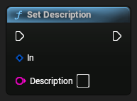

```cpp
void SetDescription(FModioCreateModParams In, FString Description)
```


#### Parameters
<RefTable colWidths={['30%', '70%']} stripes="odd">
| | |
|-|-|
|`In`|The mod creation parameters to modify|
|`Description`|The description of the mod|
</RefTable>


---


### Set Community Options Flags


```cpp
void SetCommunityOptionsFlags(FModioCreateModParams In, EModioModCommunityOptionsFlags CommunityOptionsFlags)
```


---


### Set Changelog String

Sets the changelog string of the mod file


```cpp
void SetChangelogString(FModioCreateModFileParams In, FString Changelog)
```


#### Parameters
<RefTable colWidths={['30%', '70%']} stripes="odd">
| | |
|-|-|
|`In`|The mod file creation parameters to modify|
|`Changelog`|The changelog string of the mod file|
</RefTable>


---


### Get Localized Text for Enum by Name

Returns the localized string table `FText` for a given enum value's `FName`.  Only works with enums registered via `ModioUI::RegisterEnumAsLocalizable`.


```cpp
FText GetLocalizedTextForEnumByName(FName EnumName)
```


#### Parameters
<RefTable colWidths={['30%', '70%']} stripes="odd">
| | |
|-|-|
|`EnumName`|The `FName` of the given enum value to fetch its localized string|
</RefTable>


#### Returns
Localized `FText` for the specified enum value, or a dummy FText if not found


---


### FileSizeToText (Unsigned64)

Converts an Unsigned64 filesize to a human-readable string with the appropriate unit. * The function attempts to display the size in the largest unit that will have an integral  part > 0, or in the specified unit if `Unit` is set to something other than `Largest`.


```cpp
FText FileSizeUnsigned64_ToText(FModioUnsigned64 FileSize, int32 MinDecimals, int32 MaxDecimals, TEnumAsByte<EFileSizeUnit> Unit, bool bIncludeUnitName)
```


#### Parameters
<RefTable colWidths={['30%', '70%']} stripes="odd">
| | |
|-|-|
|`FileSize`|The filesize in bytes to convert to human-readable format|
|`MinDecimals`|The minimum number of decimals to display for the filesize|
|`MaxDecimals`|The maximum number of decimals to display for the filesize|
|`Unit`|The unit to display the filesize in (defaults to the largest appropriate unit)|
|`bIncludeUnitName`|Whether or not to include the unit name in the result|
</RefTable>


#### Returns
An FText formatted with the specified filesize and unit


---


### Get Localized Text from Default Table by Key

Returns the localized string table Text for a given string key


```cpp
FText GetLocalizedTextFromDefaultTableByKey(FString StringKey)
```


#### Parameters
<RefTable colWidths={['30%', '70%']} stripes="odd">
| | |
|-|-|
|`StringKey`|The key to look up in the string table|
</RefTable>


#### Returns
Localized FText for the specified key, or StringKey itself if not found


---


### Reconstruct Error

Helper method to reconstruct a mod.io error passed via code that cannot reference mod.io types


```cpp
FModioErrorCode ReconstructError(int32 Value, int32 Category)
```


#### Parameters
<RefTable colWidths={['30%', '70%']} stripes="odd">
| | |
|-|-|
|`Value`|The numeric value of the code|
|`Category`|The category ID (populated by native code)|
</RefTable>


---


### IsError

Checks if an error code contains a error


```cpp
bool IsErrorAsExec(FModioErrorCode Error)
```


#### Parameters
<RefTable colWidths={['30%', '70%']} stripes="odd">
| | |
|-|-|
|`Error`||
</RefTable>


#### Returns
true if the error code is an error


---


### Get Value

Get underlying error code for an FModioErrorCode.


```cpp
int32 GetValue(FModioErrorCode Error)
```


#### Parameters
<RefTable colWidths={['30%', '70%']} stripes="odd">
| | |
|-|-|
|`Error`||
</RefTable>


#### Returns
The underlying error code.  0 represents no error.


---


### Get Message

Get the textual representation of the error


```cpp
FString GetMessage(FModioErrorCode Error)
```


#### Parameters
<RefTable colWidths={['30%', '70%']} stripes="odd">
| | |
|-|-|
|`Error`||
</RefTable>


#### Returns
An `FString` message describing the error


---


### Error Code Matches

Checks if the passed-in ErrorCode matches the specified error condition


```cpp
bool ErrorCodeMatches(FModioErrorCode ErrorCode, EModioErrorCondition Condition)
```


#### Parameters
<RefTable colWidths={['30%', '70%']} stripes="odd">
| | |
|-|-|
|`ErrorCode`|The code to check|
|`Condition`|The error condition to check against|
</RefTable>


#### Returns
True if the code matches the condition


---


### List User Subscription Async

Runs a filter over the user's subscription list

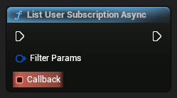

```cpp
void ListUserSubscriptionAsync(FModioFilterParams FilterParams, FOnListAllModsDelegate Callback)
```


#### Parameters
<RefTable colWidths={['30%', '70%']} stripes="odd">
| | |
|-|-|
|`FilterParams`|The filters to use on the user's subscription list|
|`Callback`|Called when mod list has been processed|
</RefTable>


---


### Get Logo Thumbnail Size


```cpp
EModioLogoSize GetLogoThumbnailSize()
```


---


### Get Logo Full Size


```cpp
EModioLogoSize GetLogoFullSize()
```


---


### Get Avatar Thumbnail Size


```cpp
EModioAvatarSize GetAvatarThumbnailSize()
```


---


### To Filter Params

Converts a preset filter into a concrete set of filter parameters that can be passed to the mod.io plugin


```cpp
FModioFilterParams ToFilterParams(FModioPresetFilterParams Preset)
```


#### Parameters
<RefTable colWidths={['30%', '70%']} stripes="odd">
| | |
|-|-|
|`Preset`|The preset to convert|
</RefTable>


#### Returns
The converted filter params


---


### Load Async

Load the texture into memory asynchronously. If it's already in memory, it will be returned immediately.


```cpp
void LoadAsync(FModioImageWrapper Image, FOnLoadImageDelegate OnImageLoaded)
```


#### Parameters
<RefTable colWidths={['30%', '70%']} stripes="odd">
| | |
|-|-|
|`Image`|The image to load|
|`On Image Loaded`|Called when the image has been loaded|
</RefTable>


---


### Get Texture

Get the texture if it has been loaded by any FModioImage instance


```cpp
UTexture2DDynamic* GetTexture(FModioImageWrapper Image)
```


#### Parameters
<RefTable colWidths={['30%', '70%']} stripes="odd">
| | |
|-|-|
|`Image`|The image to get the texture from|
</RefTable>


#### Returns
The texture if it has been loaded, otherwise nullptr


---


### Get State

Get the current state of the image


```cpp
EModioImageState GetState(FModioImageWrapper Image)
```


#### Parameters
<RefTable colWidths={['30%', '70%']} stripes="odd">
| | |
|-|-|
|`Image`|The image to get the state of|
</RefTable>


#### Returns
The state of the image


---


### Get Logo Size

If the logo size is EModioLogoSize::Original, the original logo size is returned.  Otherwise, the thumbnail size of the logo is returned.


```cpp
FVector2D GetLogoSize(UTexture* Logo, EModioLogoSize LogoSize)
```


#### Parameters
<RefTable colWidths={['30%', '70%']} stripes="odd">
| | |
|-|-|
|`Logo`|If null and `EModioLogoSize::Original` is passed, (0, 0) is returned.|
|`LogoSize`|The size of the logo to return|
</RefTable>


#### Returns
Dimensions of the logo when displayed in a 1:1 pixel ratio


---


### Get Gallery Size

If the gallery image size is EModioGallerySize::Original, the original gallery image size is returned.  Otherwise, the thumbnail size of the gallery image is returned.


```cpp
FVector2D GetGallerySize(UTexture* GalleryImage, EModioGallerySize GallerySize)
```


#### Parameters
<RefTable colWidths={['30%', '70%']} stripes="odd">
| | |
|-|-|
|`GalleryImage`|If null and EModioGallerySize::Original is passed, (0, 0) is returned.|
|`GallerySize`|The size of the gallery image to return|
</RefTable>


#### Returns
Dimensions of the gallery image when displayed in a 1:1 pixel ratio


---


### Get Avatar Size

If the avatar size is EModioAvatarSize::Original, the original avatar size is returned.  Otherwise, the thumbnail size of the avatar is returned.


```cpp
FVector2D GetAvatarSize(UTexture* Avatar, EModioAvatarSize AvatarSize)
```


#### Parameters
<RefTable colWidths={['30%', '70%']} stripes="odd">
| | |
|-|-|
|`Avatar`|If null and EModioAvatarSize::Original is passed, (0, 0) is returned.|
|`AvatarSize`|The size of the avatar to return|
</RefTable>


#### Returns
Dimensions of the avatar when displayed in a 1:1 pixel ratio


---


### Get Path

Get the installation path for a mod on disk


```cpp
FString GetPath(FModioModCollectionEntry Entry)
```


#### Parameters
<RefTable colWidths={['30%', '70%']} stripes="odd">
| | |
|-|-|
|`Entry`|The mod collection entry to retrieve the installation path from|
</RefTable>


#### Returns
A FString representing the path to the mod's installation folder.  If the mod is not yet installed, this path may not exist. Use `GetModState` to check the mod's status before accessing files.


---


### Get Mod State

Get the current state of a mod within the collection


```cpp
EModioModState GetModState(FModioModCollectionEntry Entry)
```


#### Parameters
<RefTable colWidths={['30%', '70%']} stripes="odd">
| | |
|-|-|
|`Entry`|The mod collection entry to retrieve the state from|
</RefTable>


#### Returns
An EModioModState enum representing the current state of the mod


---


### Get Mod Profile

Get the profile information of a mod


```cpp
FModioModInfo GetModProfile(FModioModCollectionEntry Entry)
```


#### Parameters
<RefTable colWidths={['30%', '70%']} stripes="odd">
| | |
|-|-|
|`Entry`|The mod collection entry to retrieve the profile information from|
</RefTable>


#### Returns
An FModioModInfo structure containing the mod's profile data


---


### Get ID

Retrieve the Mod ID from the mod collection entry


```cpp
FModioModID GetID(FModioModCollectionEntry Entry)
```


#### Parameters
<RefTable colWidths={['30%', '70%']} stripes="odd">
| | |
|-|-|
|`Entry`|The mod collection entry to retrieve the ID from|
</RefTable>


#### Returns
A FModioModID representing the ID of the mod


---


### Get Total Filesize Uncompressed

Get the total size of all uncompressed dependency files in bytes


```cpp
FModioUnsigned64 GetTotalFilesizeUncompressed(FModioModDependencyList DependencyList)
```


#### Parameters
<RefTable colWidths={['30%', '70%']} stripes="odd">
| | |
|-|-|
|`DependencyList`|The dependency list to calculate the total uncompressed file size for|
</RefTable>


#### Returns
An int64 representing the total size of all uncompressed dependency files in bytes


---


### Get Total Filesize

Get the total size of all dependency files in bytes


```cpp
FModioUnsigned64 GetTotalFilesize(FModioModDependencyList DependencyList)
```


#### Parameters
<RefTable colWidths={['30%', '70%']} stripes="odd">
| | |
|-|-|
|`DependencyList`|The dependency list to calculate the total file size for|
</RefTable>


#### Returns
An int64 representing the total size of all dependency files in bytes


---


### Get Paged Result

Retrieve paged result information for a dependency list

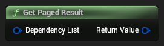

```cpp
FModioPagedResult GetPagedResult(FModioModDependencyList DependencyList)
```


#### Parameters
<RefTable colWidths={['30%', '70%']} stripes="odd">
| | |
|-|-|
|`DependencyList`|The dependency list to retrieve paged result information from|
</RefTable>


#### Returns
An FModioPagedResult containing metadata about the paginated data


---


### Get Dependencies

Retrieve the list of mod dependencies from the dependency list


```cpp
TArray<FModioModDependency> GetDependencies(FModioModDependencyList DependencyList)
```


#### Parameters
<RefTable colWidths={['30%', '70%']} stripes="odd">
| | |
|-|-|
|`DependencyList`|The dependency list to retrieve mod dependencies from|
</RefTable>


#### Returns
An array of FModioModDependency representing the dependencies of a mod


---


### Get Paged Result

Retrieve paged result information for a mod info list

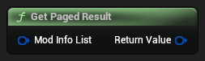

```cpp
FModioPagedResult GetPagedResult(FModioModInfoList ModInfoList)
```


#### Parameters
<RefTable colWidths={['30%', '70%']} stripes="odd">
| | |
|-|-|
|`ModInfoList`|The mod info list to retrieve paged result information from|
</RefTable>


#### Returns
An FModioPagedResult containing metadata about the paginated data


---


### Get Mods

Retrieve the list of mods from the mod info list


```cpp
TArray<FModioModInfo> GetMods(FModioModInfoList ModInfoList)
```


#### Parameters
<RefTable colWidths={['30%', '70%']} stripes="odd">
| | |
|-|-|
|`ModInfoList`|The mod info list to retrieve the mods from|
</RefTable>


#### Returns
An array of FModioModInfo objects representing the mods in the list


---


### Get Total Progress

Retrieve the total amount of progress required for a specified state


```cpp
FModioUnsigned64 GetTotalProgress(FModioModProgressInfo Info, EModioModProgressState State)
```


#### Parameters
<RefTable colWidths={['30%', '70%']} stripes="odd">
| | |
|-|-|
|`Info`|The progress struct to query|
|`State`|The state to query total progress for|
</RefTable>


#### Returns
An FModioUnsigned64 representing the total progress in bytes


---


### Get Current State

Get the current state of the mod operation


```cpp
EModioModProgressState GetCurrentState(FModioModProgressInfo Info)
```


#### Parameters
<RefTable colWidths={['30%', '70%']} stripes="odd">
| | |
|-|-|
|`Info`|The progress struct to query|
</RefTable>


#### Returns
An EModioModProgressState indicating the current state of the mod operation


---


### Get Current Progress

Retrieve the progress value for a specified state If the state has completed, `CurrentProgress` will equal `TotalProgress`. For example, if a mod  is currently in the Extracting state, querying progress for the Downloading state will return a value  equal to the total download size because the download is complete.


```cpp
FModioUnsigned64 GetCurrentProgress(FModioModProgressInfo Info, EModioModProgressState State)
```


#### Parameters
<RefTable colWidths={['30%', '70%']} stripes="odd">
| | |
|-|-|
|`Info`|The progress struct to query|
|`State`|The state to query progress information for|
</RefTable>


#### Returns
An FModioUnsigned64 representing the current progress in bytes


---


### Get Tags

Retrieve the tags from a mod tag options list


```cpp
TArray<FModioModTagInfo> GetTags(FModioModTagOptions ModTags)
```


#### Parameters
<RefTable colWidths={['30%', '70%']} stripes="odd">
| | |
|-|-|
|`ModTags`|The mod tag options list to retrieve tags from|
</RefTable>


#### Returns
An array of FModioModTagInfo representing the tags available for a mod


---


### Get Paged Result

Retrieve paged result information for a mod tag options list


```cpp
FModioPagedResult GetPagedResult(FModioModTagOptions ModTags)
```


#### Parameters
<RefTable colWidths={['30%', '70%']} stripes="odd">
| | |
|-|-|
|`ModTags`|The mod tag options list to retrieve paged result information from|
</RefTable>


#### Returns
An FModioPagedResult containing metadata about the paginated data


---


### Get Default Portal for Current Platform

Get the default portal for the platform the game is running on.


```cpp
EModioPortal GetDefaultPortalForCurrentPlatform()
```


#### Parameters
<RefTable colWidths={['30%', '70%']} stripes="odd">
| | |
|-|-|
</RefTable>


#### Returns
EModioPortal of the portal to use


---


### Get Default Auth Provider for Current Platform

Get the default Authentication Provider for the current platform the game is running on


```cpp
EModioAuthenticationProvider GetDefaultAuthProviderForCurrentPlatform()
```


#### Parameters
<RefTable colWidths={['30%', '70%']} stripes="odd">
| | |
|-|-|
</RefTable>


#### Returns
EModioAuthenticationProvider to use for authentication calls


---


### Get Current Platform

Gets the current platform that the game is running on


```cpp
EModioPlatformName GetCurrentPlatform()
```


#### Parameters
<RefTable colWidths={['30%', '70%']} stripes="odd">
| | |
|-|-|
</RefTable>


#### Returns
EModioPlatformName of the current platform


---


### Make Report for User

Creates a content report for a user.


```cpp
FModioReportParams MakeReportForUser(FModioUserID User, EModioReportType Type, FString ReportDescription, FString ReporterName, FString ReporterContact)
```


#### Parameters
<RefTable colWidths={['30%', '70%']} stripes="odd">
| | |
|-|-|
|`User`|The ID of the User being reported|
|`Type`|The nature of the content report (e.g., abuse, inappropriate behavior)|
|`ReportDescription`|A description of why the content is being reported|
|`ReporterName`|Name of the submitting user. Recommended for DMCA reports, but may be empty|
|`ReporterContact`|Contact details of the submitting user. Recommended for DMCA reports, but may be empty|
</RefTable>


#### Returns
A struct containing the report parameters


---


### Make Report for Mod

Creates a content report for a mod.


```cpp
FModioReportParams MakeReportForMod(FModioModID Mod, EModioReportType Type, FString ReportDescription, FString ReporterName, FString ReporterContact)
```


#### Parameters
<RefTable colWidths={['30%', '70%']} stripes="odd">
| | |
|-|-|
|`Mod`|The ID of the content being reported (mod)|
|`Type`|The nature of the content report (e.g., abuse, inappropriate content)|
|`ReportDescription`|A description of why the content is being reported|
|`ReporterName`|Name of the submitting user. Recommended for DMCA reports, but may be empty|
|`ReporterContact`|Contact details of the submitting user. Recommended for DMCA reports, but may be empty|
</RefTable>


#### Returns
A struct containing the report parameters


---


### Make Report for Game

Creates a content report for a game.


```cpp
FModioReportParams MakeReportForGame(FModioGameID Game, EModioReportType Type, FString ReportDescription, FString ReporterName, FString ReporterContact)
```


#### Parameters
<RefTable colWidths={['30%', '70%']} stripes="odd">
| | |
|-|-|
|`Game`|The ID of the game being reported|
|`Type`|The nature of the content report (e.g., abuse, inappropriate content)|
|`ReportDescription`|A description of why the content is being reported|
|`ReporterName`|Name of the submitting user. Recommended for DMCA reports, but may be empty|
|`ReporterContact`|Contact details of the submitting user. Recommended for DMCA reports, but may be empty|
</RefTable>


#### Returns
A struct containing the report parameters


---


### Round Number String

Round a number string based on the file size or speed.


```cpp
FText RoundNumberString(FText inputText)
```


#### Parameters
<RefTable colWidths={['30%', '70%']} stripes="odd">
| | |
|-|-|
|`inputText`|The text representing the input number.|
</RefTable>


#### Returns
The rounded number string.


---


### Get Percent (integer64/integer64)

Calculate the percentage between two `int64` values.


```cpp
float Pct_Int64Int64(int64 Dividend, int64 Divisor)
```


#### Parameters
<RefTable colWidths={['30%', '70%']} stripes="odd">
| | |
|-|-|
|`Dividend`|The numerator of the percentage calculation.|
|`Divisor`|The denominator of the percentage calculation.|
</RefTable>


#### Returns
The floating-point result of Dividend/Divisor.


---


### Is Valid Security Code Format

Check if the supplied string has the format of a valid mod.io security code.


```cpp
bool IsValidSecurityCodeFormat(FString String)
```


#### Parameters
<RefTable colWidths={['30%', '70%']} stripes="odd">
| | |
|-|-|
|`String`|The string to check.|
</RefTable>


#### Returns
True if the string matches the mod.io security code format.


---


### Is Valid Email Address Format

Validate if the supplied email address has a valid format.


```cpp
bool IsValidEmailAddressFormat(FString String)
```


#### Parameters
<RefTable colWidths={['30%', '70%']} stripes="odd">
| | |
|-|-|
|`String`|The email address to validate.|
</RefTable>


#### Returns
True if the email address is valid.


---


### Get Time Span as String

Get the time span between the present and a specified past date as a string.


```cpp
FString GetTimeSpanAsString(FString PastDateString)
```


#### Parameters
<RefTable colWidths={['30%', '70%']} stripes="odd">
| | |
|-|-|
|`PastDateString`|The past date to compare against the current time.|
</RefTable>


#### Returns
The time span as a string (e.g., "2 days ago").


---


### Get Shortened Number as String

Shorten a large number for better readability.


```cpp
FString GetShortenedNumberAsString(int64 Number)
```


#### Parameters
<RefTable colWidths={['30%', '70%']} stripes="odd">
| | |
|-|-|
|`Number`|The large number to shorten.|
</RefTable>


#### Returns
The shortened number as a string.


---


### Get Project Initialize Options for Session Id

Get the options needed to initialize the mod.io SDK specified in the project settings.


```cpp
FModioInitializeOptions GetProjectInitializeOptionsForSessionId(FString SessionId)
```


#### Parameters
<RefTable colWidths={['30%', '70%']} stripes="odd">
| | |
|-|-|
|`SessionId`|The session ID to initialize the project with.|
</RefTable>


#### Returns
The mod.io initialization options for the provided session ID.


---


### Get Project Game Id

Get the game ID specified in the mod.io project settings.


```cpp
FModioGameID GetProjectGameId()
```


#### Parameters
<RefTable colWidths={['30%', '70%']} stripes="odd">
| | |
|-|-|
</RefTable>


#### Returns
The project game ID.


---


### Get Project Environment

Get the environment specified in the mod.io project settings.


```cpp
EModioEnvironment GetProjectEnvironment()
```


#### Parameters
<RefTable colWidths={['30%', '70%']} stripes="odd">
| | |
|-|-|
</RefTable>


#### Returns
The project environment type (e.g., production, staging).


---


### Get Project Api Key

Get the API key specified in the mod.io project settings.


```cpp
FModioApiKey GetProjectApiKey()
```


#### Parameters
<RefTable colWidths={['30%', '70%']} stripes="odd">
| | |
|-|-|
</RefTable>


#### Returns
The project API key.


---


### Get Monetization Purchase Category

Get the purchase category ID for the store overlay UI for a given portal.


```cpp
FString GetMonetizationPurchaseCategory(EModioPortal Portal)
```


#### Parameters
<RefTable colWidths={['30%', '70%']} stripes="odd">
| | |
|-|-|
|`Portal`|The mod.io portal.|
</RefTable>


#### Returns
The purchase category ID as a string, or empty if not defined.


---


### Get Language Code String

Get the language code string (ISO 639-1 format) for localization purposes.


```cpp
FString GetLanguageCodeString(EModioLanguage Language)
```


#### Parameters
<RefTable colWidths={['30%', '70%']} stripes="odd">
| | |
|-|-|
|`Language`|The language enum to convert.|
</RefTable>


#### Returns
The language code as a string (e.g., "en", "fr", "de").


---


### Get Language Code from String

Convert a language code string to the corresponding language enum.


```cpp
EModioLanguage GetLanguageCodeFromString(FString LanguageCode)
```


#### Parameters
<RefTable colWidths={['30%', '70%']} stripes="odd">
| | |
|-|-|
|`LanguageCode`|The language code string (e.g., "en", "fr", "de").|
</RefTable>


#### Returns
The corresponding language enum.


---


### GetDesiredFileSizeUnit (FModioUnsigned64)

Get the appropriate file size unit based on the file size in bytes.


```cpp
TEnumAsByte<EFileSizeUnit> GetDesiredFileSizeUnit_Unsigned64(FModioUnsigned64 FileSize)
```


#### Parameters
<RefTable colWidths={['30%', '70%']} stripes="odd">
| | |
|-|-|
|`FileSize`|The file size in bytes as a FModioUnsigned64.|
</RefTable>


#### Returns
The desired file size unit.


---


### Get Default Session Id Windows

Get the session ID for Windows to initialize the SDK.


```cpp
FString GetDefaultSessionIdWindows()
```


#### Parameters
<RefTable colWidths={['30%', '70%']} stripes="odd">
| | |
|-|-|
</RefTable>


#### Returns
The Windows session ID, or an empty string if the platform is not Windows.


---


### ToString (ModioUnsigned64)

Convert a file size to a human-readable string with the appropriate unit.


```cpp
FText Filesize_ToString_Unsigned64(FModioUnsigned64 FileSize, int32 MinDecimals, int32 MaxDecimals, TEnumAsByte<EFileSizeUnit> Unit, bool bIncludeUnitName)
```


#### Parameters
<RefTable colWidths={['30%', '70%']} stripes="odd">
| | |
|-|-|
|`FileSize`|The file size in bytes as a FModioUnsigned64.|
|`MinDecimals`|Minimum number of decimal places to show.|
|`MaxDecimals`|Maximum number of decimal places to show.|
|`Unit`|The unit to use (e.g., bytes, KB, MB). If 'Largest', the unit will automatically scale to the largest possible unit.|
|`bIncludeUnitName`|Whether to include the unit name (e.g., "MB").|
</RefTable>


#### Returns
A formatted string representing the file size.


---


### Get Space by Key


```cpp
FModioUnsigned64 GetSpaceByKey(FModioStorageInfo Info, FStorageInfoKey StorageKey)
```


#### Parameters
<RefTable colWidths={['30%', '70%']} stripes="odd">
| | |
|-|-|
|`Info`||
|`StorageKey`|Where the storage has been written to and what type of usage to query|
</RefTable>


#### Returns
Total storage space in bytes


---


### Get Space


```cpp
FModioUnsigned64 GetSpace(FModioStorageInfo Info, EModioStorageLocation Location, EModioStorageUsage Usage)
```


#### Parameters
<RefTable colWidths={['30%', '70%']} stripes="odd">
| | |
|-|-|
|`Info`||
|`Location`|Where the storage has been written to|
|`Usage`|The type of storage usage recorded|
</RefTable>


#### Returns
Total storage space in bytes


---


### GetDefaultModInstallationDirectory

Returns the default mod installation directory for this game and platform, ignoring overrides and without requiring the SDK to be initialized.


```cpp
FString K2_GetDefaultModInstallationDirectory(FModioGameID GameID)
```


#### Parameters
<RefTable colWidths={['30%', '70%']} stripes="odd">
| | |
|-|-|
|`GameID`|The `ModioGameID` of the game we're fetching the default mod installation directory for.|
</RefTable>


#### Returns
The default mod installation directory for the specified game on the current platform


---


### Is Purchasable

Check if the token pack is purchasable


```cpp
bool IsPurchasable(FModioTokenPack In)
```


#### Parameters
<RefTable colWidths={['30%', '70%']} stripes="odd">
| | |
|-|-|
|`In`|The token pack to check if it is purchasable|
</RefTable>


#### Returns
True if the token pack is purchasable, false otherwise


---


### Get Title

Get the title of the token pack


```cpp
FText GetTitle(FModioTokenPack In)
```


#### Parameters
<RefTable colWidths={['30%', '70%']} stripes="odd">
| | |
|-|-|
|`In`|The token pack to retrieve the title from|
</RefTable>


#### Returns
The title text of the token pack


---


### Get Regular Price

Get the regular price of the token pack


```cpp
FText GetRegularPrice(FModioTokenPack In)
```


#### Parameters
<RefTable colWidths={['30%', '70%']} stripes="odd">
| | |
|-|-|
|`In`|The token pack to retrieve the regular price from|
</RefTable>


#### Returns
The regular price text of the token pack


---


### Get Numeric Price

Get the numeric price of the token pack


```cpp
int64 GetNumericPrice(FModioTokenPack In)
```


#### Parameters
<RefTable colWidths={['30%', '70%']} stripes="odd">
| | |
|-|-|
|`In`|The token pack to retrieve the numeric price from|
</RefTable>


#### Returns
The numeric price of the token pack


---


### Get Modio Id

Get the Modio ID for this token pack


```cpp
FModioTokenPackID GetModioId(FModioTokenPack In)
```


#### Parameters
<RefTable colWidths={['30%', '70%']} stripes="odd">
| | |
|-|-|
|`In`|The token pack to retrieve the Modio ID from|
</RefTable>


#### Returns
The Modio ID of the token pack


---


### Get Long Description

Get the long description of the token pack


```cpp
FText GetLongDescription(FModioTokenPack In)
```


#### Parameters
<RefTable colWidths={['30%', '70%']} stripes="odd">
| | |
|-|-|
|`In`|The token pack to retrieve the long description from|
</RefTable>


#### Returns
The long description text of the token pack


---


### Get Id

Get the ID of the token pack


```cpp
FString GetId(FModioTokenPack In)
```


#### Parameters
<RefTable colWidths={['30%', '70%']} stripes="odd">
| | |
|-|-|
|`In`|The token pack to retrieve the ID from|
</RefTable>


#### Returns
The ID of the token pack


---


### Get Fields

Get any dynamic fields associated with the token pack


```cpp
TMap<FString,FString> GetFields(FModioTokenPack In)
```


#### Parameters
<RefTable colWidths={['30%', '70%']} stripes="odd">
| | |
|-|-|
|`In`|The token pack to retrieve dynamic fields from|
</RefTable>


#### Returns
A map of dynamic fields for the token pack


---


### Get Display Price

Get the display price of the token pack


```cpp
FText GetDisplayPrice(FModioTokenPack In)
```


#### Parameters
<RefTable colWidths={['30%', '70%']} stripes="odd">
| | |
|-|-|
|`In`|The token pack to retrieve the display price from|
</RefTable>


#### Returns
The display price text of the token pack


---


### Get Description

Get the description of the token pack


```cpp
FText GetDescription(FModioTokenPack In)
```


#### Parameters
<RefTable colWidths={['30%', '70%']} stripes="odd">
| | |
|-|-|
|`In`|The token pack to retrieve the description from|
</RefTable>


#### Returns
The description text of the token pack


---


### ModioUnsigned64 - ModioUnsigned64

Subtracts one FModioUnsigned64 from another


```cpp
FModioUnsigned64 Subtract(FModioUnsigned64 LHS, FModioUnsigned64 RHS)
```


#### Parameters
<RefTable colWidths={['30%', '70%']} stripes="odd">
| | |
|-|-|
|`LHS`||
|`RHS`||
</RefTable>


---


### Percentage Unsigned 64

Calculates the percentage of one FModioUnsigned64 value in relation to another


```cpp
float Percentage_Unsigned64(FModioUnsigned64 LHS, FModioUnsigned64 RHS)
```


#### Parameters
<RefTable colWidths={['30%', '70%']} stripes="odd">
| | |
|-|-|
|`LHS`||
|`RHS`||
</RefTable>


---


### ModioUnsigned64 != ModioUnsigned64

Compares two FModioUnsigned64 values for inequality


```cpp
bool NotEqualTo(FModioUnsigned64 LHS, FModioUnsigned64 RHS)
```


#### Parameters
<RefTable colWidths={['30%', '70%']} stripes="odd">
| | |
|-|-|
|`LHS`||
|`RHS`||
</RefTable>


---


### Make from Components

Creates an FModioUnsigned64 from two 32-bit components


```cpp
FModioUnsigned64 MakeFromComponents(int32 High, int32 Low)
```


#### Parameters
<RefTable colWidths={['30%', '70%']} stripes="odd">
| | |
|-|-|
|`High`||
|`Low`||
</RefTable>


---


### ModioUnsigned64 < ModioUnsigned64

Compares two FModioUnsigned64 values to see if the left-hand side is less than the right-hand side


```cpp
bool LessThan(FModioUnsigned64 LHS, FModioUnsigned64 RHS)
```


#### Parameters
<RefTable colWidths={['30%', '70%']} stripes="odd">
| | |
|-|-|
|`LHS`||
|`RHS`||
</RefTable>


---


### ModioUnsigned64 > 0

Checks if FModioUnsigned64 is greater than zero


```cpp
bool GreaterThanZero(FModioUnsigned64 In)
```


#### Parameters
<RefTable colWidths={['30%', '70%']} stripes="odd">
| | |
|-|-|
|`In`||
</RefTable>


---


### ModioUnsigned64 > ModioUnsigned64

Compares two FModioUnsigned64 values to see if the left-hand side is greater than the right-hand side


```cpp
bool GreaterThan(FModioUnsigned64 LHS, FModioUnsigned64 RHS)
```


#### Parameters
<RefTable colWidths={['30%', '70%']} stripes="odd">
| | |
|-|-|
|`LHS`||
|`RHS`||
</RefTable>


---


### ModioUnsigned64 == ModioUnsigned64

Compares two FModioUnsigned64 values for equality


```cpp
bool EqualTo(FModioUnsigned64 LHS, FModioUnsigned64 RHS)
```


#### Parameters
<RefTable colWidths={['30%', '70%']} stripes="odd">
| | |
|-|-|
|`LHS`||
|`RHS`||
</RefTable>


---


### ModioUnsigned64 / ModioUnsigned64

Divides two FModioUnsigned64 values and returns the result as a float


```cpp
float DivideToFloat(FModioUnsigned64 LHS, FModioUnsigned64 RHS)
```


#### Parameters
<RefTable colWidths={['30%', '70%']} stripes="odd">
| | |
|-|-|
|`LHS`||
|`RHS`||
</RefTable>


---


### ModioUnsigned64 / float

Divides an FModioUnsigned64 by a float and returns the result as a float


```cpp
float DivideFloat(FModioUnsigned64 LHS, float RHS)
```


#### Parameters
<RefTable colWidths={['30%', '70%']} stripes="odd">
| | |
|-|-|
|`LHS`||
|`RHS`||
</RefTable>


---


### ModioUnsigned64 / ModioUnsigned64 (truncate)

Divides two FModioUnsigned64 values (truncate result)


```cpp
FModioUnsigned64 Divide(FModioUnsigned64 LHS, FModioUnsigned64 RHS)
```


#### Parameters
<RefTable colWidths={['30%', '70%']} stripes="odd">
| | |
|-|-|
|`LHS`||
|`RHS`||
</RefTable>


---


### Break to Components

Breaks a FModioUnsigned64 into two components: high and low 32-bits


```cpp
void BreakToComponents(FModioUnsigned64 In, int32 High, int32 Low)
```


#### Parameters
<RefTable colWidths={['30%', '70%']} stripes="odd">
| | |
|-|-|
|`In`||
|`High`||
|`Low`||
</RefTable>


---


### ModioUnsigned64 + ModioUnsigned64

Adds two FModioUnsigned64 values together


```cpp
FModioUnsigned64 Add(FModioUnsigned64 LHS, FModioUnsigned64 RHS)
```


#### Parameters
<RefTable colWidths={['30%', '70%']} stripes="odd">
| | |
|-|-|
|`LHS`||
|`RHS`||
</RefTable>


---


### SubmitNewModFromMemoryAsync

Submit a new mod, with its logo data coming from an in-memory buffer rather than a file.


```cpp
void K2_SubmitNewModFromMemoryAsync(FModioModCreationHandle Handle, FModioCreateModParams Params, TArray<uint8> PngData, FOnSubmitNewModDelegate Callback)
```


#### Parameters
<RefTable colWidths={['30%', '70%']} stripes="odd">
| | |
|-|-|
|`Handle`|Mod creation handle|
|`Params`|Parameters to use when creating the mod|
|`PngData`|In-memory buffer, representative of a PNG file to be used for upload|
|`Callback`|Callback once operation has completed|
</RefTable>


---


### SubmitNewModFileForModFromMemory

Queues the upload of a new mod file release for the specified mod, using the submitted parameters. This upload method accepts a block of memory `TArray<uint8>` rather than a file path. The upload's progress can be tracked in the same way as downloads; when completed, a Mod Management Event will be triggered with the result code for the upload.


```cpp
void K2_SubmitNewModFileForModFromMemory(UModioSubsystem* Target, FModioModID Mod, FModioCreateModFileMemoryParams Params)
```


#### Requirements
* _initialized-sdk_
* _authenticated-user_


#### Parameters
<RefTable colWidths={['30%', '70%']} stripes="odd">
| | |
|-|-|
|`Target`|`UModioSubsystem*`|
|`Mod`|The ID of the mod you are submitting a file for|
|`Params`|Information about the mod file being created, including the memory that wiull be uploaded as a mod|
</RefTable>


---


### LoadModFileToMemory

Loads an installed mod file into memory.


```cpp
bool K2_LoadModFileToMemory(UModioSubsystem* Target, FModioModID ModId, TArray<uint8> ModData)
```


#### Requirements
* _initialized-sdk_
* _authenticated-user_


#### Parameters
<RefTable colWidths={['30%', '70%']} stripes="odd">
| | |
|-|-|
|`Target`|`UModioSubsystem*`|
|`ModId`||
|`Mod Data`|A byte array of the mod that has been loaded|
</RefTable>


---


## Enums

### EModioModfilePlatform {#EModioModfilePlatform} 

Enum representing the platform(s) that a modfile is enabled for


<RefTable colWidths={['30%', '70%']} stripes="odd">
| | |
|-|-|
| `Windows` |  |
| `Mac` |  |
| `Linux` |  |
| `Android` |  |
| `iOS` |  |
| `XboxOne` |  |
| `XboxSeriesX` |  |
| `PS4` |  |
| `PS5` |  |
| `Switch` |  |
| `Oculus` |  |
| `Source` |  |
</RefTable>

---

### EGameMaturityFlags {#EGameMaturityFlags} 

Maturity options for a game


<RefTable colWidths={['30%', '70%']} stripes="odd">
| | |
|-|-|
| `None` | Don't allow mature content in mods (default) |
| `MatureModsAllowed` | This game allows mods containing mature content |
| `MatureAudiencesOnly` | This game is for mature audiences only |
</RefTable>

---

### EGameMonetizationFlags {#EGameMonetizationFlags} 

Monetization properties of a game


<RefTable colWidths={['30%', '70%']} stripes="odd">
| | |
|-|-|
| `None` | None set (default) |
| `Monetization` | Monetization is enabled |
| `Marketplace` | Marketplace is enabled |
| `PartnerProgram` | Partner Program is enabled |
</RefTable>

---

### EModioModServerSideStatus {#EModioModServerSideStatus} 

Enum representing a mod's server-side status


<RefTable colWidths={['30%', '70%']} stripes="odd">
| | |
|-|-|
| `NotAccepted` |  |
| `Accepted` |  |
| `Deleted` |  |
</RefTable>

---

### EModioVirusStatus {#EModioVirusStatus} 

If the file has been found to be malicious or not


<RefTable colWidths={['30%', '70%']} stripes="odd">
| | |
|-|-|
| `NoThreat` |  |
| `Malicious` |  |
</RefTable>

---

### EModioVirusScanStatus {#EModioVirusScanStatus} 

Current state of the scanned file


<RefTable colWidths={['30%', '70%']} stripes="odd">
| | |
|-|-|
| `NotScanned` |  |
| `ScanComplete` |  |
| `InProgress` |  |
| `TooLargeToScan` |  |
| `FileNotFound` |  |
| `ErrorScanning` |  |
</RefTable>

---

### EModioObjectVisibilityFlags {#EModioObjectVisibilityFlags} 

Enum representing whether or not a mod is visible to users


<RefTable colWidths={['30%', '70%']} stripes="odd">
| | |
|-|-|
| `Hidden` | Mod is concealed from users |
| `Public` | Mod is openly available |
</RefTable>

---

### EModioModCommunityOptionsFlags {#EModioModCommunityOptionsFlags} 

Enum representing community options for a mod Unreal's Enum class flags don't support uint32, so we use uint8 for bitmask handling


<RefTable colWidths={['30%', '70%']} stripes="odd">
| | |
|-|-|
| `None` | No community options |
| `EnableComments` | Comments are enabled |
| `EnablePreviews` | Enable Previews |
| `EnablePreviewURLs` | Enable Preview URLs |
| `AllowDependencies` | Allow mod dependencies |
</RefTable>

---

### EModioMaturityFlags {#EModioMaturityFlags} 

Enum representing mature content that a mod may contain


<RefTable colWidths={['30%', '70%']} stripes="odd">
| | |
|-|-|
| `None` | No maturity |
| `Alcohol` | Content contains alcohol references |
| `Drugs` | Content contains drug references |
| `Violence` | Content contains violence references |
| `Explicit` | Content contains sexual references |
</RefTable>

---

### EModioModManagementEventType {#EModioModManagementEventType} 

What type of event occurred


<RefTable colWidths={['30%', '70%']} stripes="odd">
| | |
|-|-|
| `Installed` | Mod installation to local storage completed |
| `Uninstalled` | Mod uninstallation from local storage completed |
| `Updated` | Mod local installation updated to latest version |
| `Uploaded` | Mod file was uploaded |
| `BeginInstall` | Mod download and installation has started |
| `BeginUninstall` | Mod uninstallation has started |
| `BeginUpdate` | Mod download and update has started |
| `BeginUpload` | Mod upload has started |
</RefTable>

---

### EModioAuthenticationProvider {#EModioAuthenticationProvider} 

Simple struct to encapsulate data passed to external authentication systems


<RefTable colWidths={['30%', '70%']} stripes="odd">
| | |
|-|-|
| `XboxLive` |  |
| `Steam` |  |
| `GoG` |  |
| `Itch` |  |
| `Switch` |  |
| `Discord` |  |
| `PSN` |  |
| `Epic` |  |
| `Oculus` |  |
| `OpenID` |  |
| `GoogleIDToken` |  |
| `GoogleServerSideToken` |  |
</RefTable>

---

### EModioEnvironment {#EModioEnvironment} 

Enum representing which environment the game is deployed to: `Test` or `Live`.


<RefTable colWidths={['30%', '70%']} stripes="odd">
| | |
|-|-|
| `Test` | Test (private) environment |
| `Live` | Live (public) environment |
</RefTable>

---

### EModioPortal {#EModioPortal} 

Enum representing the store or service your game is being distributed through


<RefTable colWidths={['30%', '70%']} stripes="odd">
| | |
|-|-|
| `None` |  |
| `Apple` |  |
| `EpicGamesStore` |  |
| `GOG` |  |
| `Google` |  |
| `Itchio` |  |
| `Nintendo` |  |
| `PSN` |  |
| `Steam` |  |
| `XboxLive` |  |
</RefTable>

---

### EModioPlatformName {#EModioPlatformName} 

Enum representing a named platform that the plugin is running on.


<RefTable colWidths={['30%', '70%']} stripes="odd">
| | |
|-|-|
| `Windows` |  |
| `Mac` |  |
| `Linux` |  |
| `PS4` |  |
| `PS5` |  |
| `XBoxOne` |  |
| `XSX` |  |
| `Switch` |  |
| `Unknown` |  |
| `Android` |  |
| `iOS` |  |
</RefTable>

---

### EModioLogoSize {#EModioLogoSize} 


<RefTable colWidths={['30%', '70%']} stripes="odd">
| | |
|-|-|
| `Thumb320` | 320x180px |
| `Thumb640` | 640x360px |
| `Thumb1280` | 1280x720px |
| `Original` | Original Size |
</RefTable>

---

### EModioAvatarSize {#EModioAvatarSize} 


<RefTable colWidths={['30%', '70%']} stripes="odd">
| | |
|-|-|
| `Original` | Original Size |
| `Thumb50` | 50x50px Thumbnail |
| `Thumb100` | 100x100px Thumbnail |
</RefTable>

---

### EModioGallerySize {#EModioGallerySize} 


<RefTable colWidths={['30%', '70%']} stripes="odd">
| | |
|-|-|
| `Original` | Original Size |
| `Thumb320` | 320x180px Thumbnail |
| `Thumb1280` | 1280x720 Thumbnail |
</RefTable>

---

### EModioLogLevel {#EModioLogLevel} 


<RefTable colWidths={['30%', '70%']} stripes="odd">
| | |
|-|-|
| `Trace` | Detailed low-level debugging output. Not intended for general use |
| `Detailed` | Detailed but not low-level. Generally useful for some mid-level information for debugging. |
| `Info` | Informational output containing status messages |
| `Warning` | Warnings about incorrect plugin usage, timeouts |
| `Error` | Only errors |
</RefTable>

---

### EModioLanguage {#EModioLanguage} 

Enum representing the languages mod.io supports responses in


<RefTable colWidths={['30%', '70%']} stripes="odd">
| | |
|-|-|
| `English` |  |
| `Bulgarian` |  |
| `French` |  |
| `German` |  |
| `Italian` |  |
| `Polish` |  |
| `Portuguese` |  |
| `Hungarian` |  |
| `Japanese` |  |
| `Korean` |  |
| `Russian` |  |
| `Spanish` |  |
| `Thai` |  |
| `ChineseSimplified` |  |
| `ChineseTraditional` |  |
| `Turkish` |  |
| `Ukrainian` |  |
| `Arabic` |  |
</RefTable>

---

### EModioModChangeType {#EModioModChangeType} 

Enum representing the types of changes that can occur to a mod in the user's list


<RefTable colWidths={['30%', '70%']} stripes="odd">
| | |
|-|-|
| `Added` | The user's list has a new mod to synchronize |
| `Removed` | The user's list must remove a mod to synchronize |
| `Updated` | The user's list must update a mod to synchronize |
</RefTable>

---

### EFileSizeUnit {#EFileSizeUnit} 

Enumerator with the possible memory measurement units


<RefTable colWidths={['30%', '70%']} stripes="odd">
| | |
|-|-|
| `Largest` | Will take the largest one that becomes a number larger than 1 (i.e, 1300mb becomes 1.3gb) |
| `B` | A single byte |
| `KB` | Kilobytes |
| `MB` | Megabytes |
| `GB` | Gigabytes |
</RefTable>

---

### EModioEntitlementConsumptionState {#EModioEntitlementConsumptionState} 

State of an entitlement consumption transaction


<RefTable colWidths={['30%', '70%']} stripes="odd">
| | |
|-|-|
| `Failed` |  |
| `Pending` |  |
| `Fulfilled` |  |
| `ConsumeLimitExceeded` |  |
</RefTable>

---

### EModioEntitlementType {#EModioEntitlementType} 

Type of entitlement that was consumed


<RefTable colWidths={['30%', '70%']} stripes="odd">
| | |
|-|-|
| `VirtualCurrency` |  |
</RefTable>

---

### EModioErrorCondition {#EModioErrorCondition} 


<RefTable colWidths={['30%', '70%']} stripes="odd">
| | |
|-|-|
| `NoError` |  |
| `NetworkError` | When this condition is true, the error code represents a connection or HTTP error between the client and the mod.io server. |
| `ConfigurationError` | When this condition is true, the error code indicates the SDK's configuration is not valid - the game ID or API key are incorrect or the game has been deleted. |
| `InvalidArgsError` | When this condition is true, the error code indicates the arguments passed to the function have failed validation or were otherwise invalid. |
| `FilesystemError` | When this condition is true, the error code indicates a permission or IO error when accessing local filesystem data. |
| `InternalError` | When this condition is true, the error code represents an internal SDK error - please inform mod.io of the error code value. |
| `ApiErrorRefSuccess` | When this condition is true, the error ref returned by the API indicates an implicit success because the operation has already been performed (ie a no-op is success). |
| `EntityNotFoundError` | When this condition is true, the error code indicates that a specified game, mod, user, media file or mod file was not found. |
| `UserTermsOfUseError` | When this condition is true, the error code indicates that the user has not yet accepted the mod.io Terms of Use. |
| `SubmitReportError` | When this condition is true, the error code indicates that a report for the specified content could not be submitted. |
| `UserNotAuthenticatedError` | When this condition is true, the error code indicates that a user is not authenticated. |
| `SDKNotInitialized` | When this condition is true, the error code indicates that the SDK has not been initialized. |
| `UserAlreadyAuthenticatedError` | When this condition is true, the error code indicates that the user is already authenticated. |
| `SystemError` | When this condition is true, the error code indicates that a low-level system error occurred outside of mod.io SDK control. |
| `OperationCanceled` | When this condition is true, the error code indicates that the asynchronous operation was cancelled before it completed. |
| `ModManagementDisabled` | When this condition is true, the error code indicates that Mod Management has not been enabled. |
| `RateLimited` | Too many requests made to the mod.io API within the rate-limiting window. Please wait and try again. |
| `ModBeingProcessed` | The specified mod's files are currently being updated by the SDK. Please try again later. |
| `InsufficientSpace` | There is insufficient space to install the mod. Please free up space and try again. |
| `SDKAlreadyInitialized` | When this condition is true, the error code indicates that the SDK has already been initialized. |
| `ModManagementAlreadyEnabled` | When this condition is true, the error code indicates that Mod Management has already been enabled. |
| `InsufficientPermissions` | When this condition is true, the error code indicates that the current user does not have the required permissions for this operation. |
| `EmailLoginCodeInvalid` | The email login code is incorrect, has expired, or has already been used. |
| `AlreadySubscribed` | The specified mod is already subscribed to. |
| `InstallOrUpdateCancelled` | The current mod installation or update was cancelled. |
| `UploadCancelled` | The current modfile upload was cancelled. |
| `TempModSetNotInitialized` | TempModSet need to be initialized first, call InitTempModSet. |
| `MonetizationOperationError` | An error occurred while performing a monetization operation. |
| `PaymentTransactionFailed` | The transaction requires a payment but it could not be fulfilled. Please retry with funds on the wallet |
| `IncorrectPrice` | The display price for the mod is out-of-date or incorrect. Please retry with the correct display price. |
| `ItemAlreadyOwned` | The authenticated user already has acquired this item |
| `ParentalControlRestrictions` | Parental control restrictions prevent this account from accessing UGC. |
| `MetricsSessionNotInitialized` | Metrics session has not yet been initialized. Ensure that you have a metrics secret key set for your project. |
| `MetricsSessionAlreadyInitialized` | Metrics session has already been been initialized. |
| `MetricsSessionIsActive` | Metrics session has been started. |
| `MetricsSessionIsNotActive` | Metrics session has not been started. Please call MetricsSessionStartAsync. |
| `MetricsSessionHasNoMods` | No mods have been added to the session. |
| `PremiumFeatureNotAvailable` | This premium feature is not available for your project. |
| `EmailExchangeCodeAlreadyRedeemed` | The email security code has already been redeemed. |
| `ModDependenciesNotAllowed` | Cannot add a dependency because the target mod has not opted in to dependencies. |
| `ModCannotAddDependencyMonetized` | Cannot add a dependency because the mod is monetized. |
| `ModIsDependency` | Cannot turn off mod dependencies when the mod is currently a dependency for other mods. |
| `ModCannotAllowDependencyMonetized` | This mod cannot allow dependencies because it is monetized. |
| `ModCannotDeleteDependency` | This mod is a dependency of other mods and cannot be deleted. |
| `RequestInProgress` | The asynchronous operation is already running. Please wait for it to complete before calling it again |
</RefTable>

---

### EModioSortFieldType {#EModioSortFieldType} 

Enum indicating which field should be used to sort the results


<RefTable colWidths={['30%', '70%']} stripes="odd">
| | |
|-|-|
| `ID` | Use mod ID (default) |
| `DownloadsToday` | Use number of downloads in last 24 (exposed in REST API as "popular") |
| `SubscriberCount` | Use number of subscribers |
| `Rating` | Use mod rating |
| `DateMarkedLive` | Use date mod was marked live |
| `DateUpdated` | Use date mod was last updated |
| `DownloadsTotal` | Use downloads total |
| `Alphabetical` | Use mod name |
</RefTable>

---

### EModioSortDirection {#EModioSortDirection} 

Enum indicating which direction sorting should be applied


<RefTable colWidths={['30%', '70%']} stripes="odd">
| | |
|-|-|
| `Ascending` | (default) |
| `Descending` | Sort in descending order |
</RefTable>

---

### EModioRevenueFilterType {#EModioRevenueFilterType} 

Enum indicating filtering options based off revenue type


<RefTable colWidths={['30%', '70%']} stripes="odd">
| | |
|-|-|
| `Free` | Return only free mods |
| `Paid` | Return only paid mods |
| `FreeAndPaid` | Return both free and paid mods |
</RefTable>

---

### EModioImageState {#EModioImageState} 

Enumerator to represent the possible states the image data can be, from hard drive to corrupted


<RefTable colWidths={['30%', '70%']} stripes="odd">
| | |
|-|-|
| `OnDisc` | Image data is located on hard drive |
| `LoadingIntoMemory` | Image data is transferring to a memory location |
| `InMemory` | Image data is located in memory |
| `Corrupted` | Image data is not readable |
</RefTable>

---

### EModioModState {#EModioModState} 

Enum representing the current state of a mod


<RefTable colWidths={['30%', '70%']} stripes="odd">
| | |
|-|-|
| `InstallationPending` | The mod is pending installation. This state is not saved. |
| `Installed` | The mod is installed. |
| `UpdatePending` | The mod is pending an update. This state is saved as installed. |
| `Downloading` | The mod is downloading as part of the installation process. This state is not saved. |
| `Extracting` | The mod is extracting as part of the installation process. This state is not saved. |
| `UninstallPending` | The mod is pending uninstallation. This state is saved as installed. |
</RefTable>

---

### EModioModProgressState {#EModioModProgressState} 

Enum representing the possible states of mod progress


<RefTable colWidths={['30%', '70%']} stripes="odd">
| | |
|-|-|
| `Initializing` | Download information is being retrieved from mod.io servers |
| `Downloading` | Mod archive is downloading from mod.io servers |
| `Extracting` | Mod archive is downloaded and now extracting |
| `Compressing` | Mod archive is being compressed from files on disk |
| `Uploading` | Mod archive is uploading to mod.io servers |
</RefTable>

---

### EModioOpenStoreResult {#EModioOpenStoreResult} 

Enumerator of potential results on attempting to open a native platform store


<RefTable colWidths={['30%', '70%']} stripes="odd">
| | |
|-|-|
| `Success` | Store opened successfully * |
| `FailedInactive` | Monetization not active * |
| `FailedUnsupportedPlatform` | The current platform does not support a native store * |
| `FailedUnknown` | Failed to open for an unknown reason * |
</RefTable>

---

### EModioRating {#EModioRating} 

Enumerator with the rating a mod can receive


<RefTable colWidths={['30%', '70%']} stripes="odd">
| | |
|-|-|
| `Neutral` | A neutral rating |
| `Positive` | A positive rating |
| `Negative` | A negative rating |
</RefTable>

---

### EModioReportType {#EModioReportType} 

Enumeration for the type of report that a mod can receive


<RefTable colWidths={['30%', '70%']} stripes="odd">
| | |
|-|-|
| `Generic` | A generic mod report |
| `DMCA` | Digital Millennium Copyright Act mod report |
| `NotWorking` | Not working mod report |
| `RudeContent` | Rude content mod report |
| `IllegalContent` | Illegal content mod report |
| `StolenContent` | Stolen content mod report |
| `FalseInformation` | False information mod report |
| `Other` | Other type of mod report |
</RefTable>

---

### EModioStorageLocation {#EModioStorageLocation} 


<RefTable colWidths={['30%', '70%']} stripes="odd">
| | |
|-|-|
| `Local` |  |
| `Cache` |  |
</RefTable>

---

### EModioStorageUsage {#EModioStorageUsage} 


<RefTable colWidths={['30%', '70%']} stripes="odd">
| | |
|-|-|
| `Consumed` |  |
| `Available` |  |
</RefTable>

---


