## Classes

### ModEnabledStateProvider 


##### Inheritance Hierarchy
-> Interface-> Object


#### Request Mod Enabled State Change


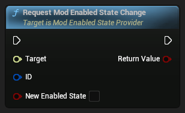

```cpp
bool RequestModEnabledStateChange(FGenericModID ID, bool bNewEnabledState)
```


##### Parameters
<RefTable colWidths={['30%', '70%']} stripes="odd">
| | |
|-|-|
|`Target`|`ModEnabledStateProvider`|
|`ID`|The raw ID for the mod to enable or disable|
|`bNewEnabledState`|the new state for the mod|
</RefTable>


##### Returns
true if the mod's state was successfully changed, else false


#### Query Is Mod Enabled


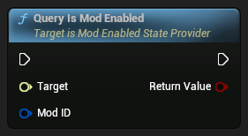

```cpp
bool QueryIsModEnabled(FGenericModID ModID)
```


##### Parameters
<RefTable colWidths={['30%', '70%']} stripes="odd">
| | |
|-|-|
|`Target`|`ModEnabledStateProvider`|
|`ModID`|the raw ID for the mod to query|
</RefTable>


##### Returns
true if the mod is enabled, else false


---

### MutatorSubsystem 


##### Inheritance Hierarchy
-> GameInstanceSubsystem-> Subsystem-> Object


#### Register Mutator


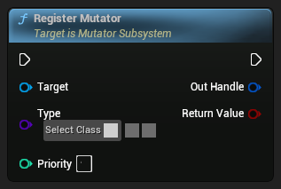

```cpp
bool RegisterMutator(TSubclassOf<UMutator> Type, int32 Priority, FMutatorHandle OutHandle)
```


##### Parameters
<RefTable colWidths={['30%', '70%']} stripes="odd">
| | |
|-|-|
|`Target`|`MutatorSubsystem`|
|`Type`|The class of mutator you want to register|
|`Priority`|Defines the order in which mutators are applied. Higher priority = more influence|
|`Out Handle`|A handle to the create mutator|
</RefTable>


#### ScorePoints


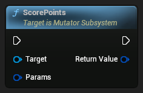

```cpp
FScorePoints_Params Mutator_ScorePoints(FScorePoints_Params Params)
```


#### PostPlayerInit


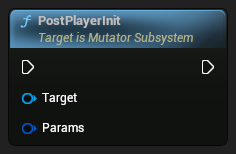

```cpp
void Mutator_PostPlayerInit(FPostPlayerInit_Params Params)
```


#### PostPawnSpawned


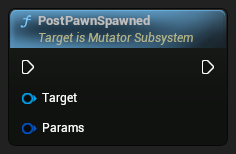

```cpp
void Mutator_PostPawnSpawned(FPostPawnSpawned_Params Params)
```


#### ModifyDamage


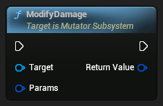

```cpp
FModifyDamage_Params Mutator_ModifyDamage(FModifyDamage_Params Params)
```


#### EnemyWaveEnded


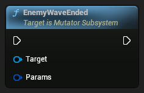

```cpp
void Mutator_EnemyWaveEnded(FEnemyWaveEnded_Params Params)
```


#### Is Registered


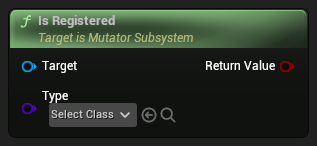

```cpp
bool IsRegistered(TSubclassOf<UMutator> Type)
```


##### Parameters
<RefTable colWidths={['30%', '70%']} stripes="odd">
| | |
|-|-|
|`Target`|`MutatorSubsystem`|
|`Type`|the type of mutator to check for|
</RefTable>


#### Get Mutator Class List


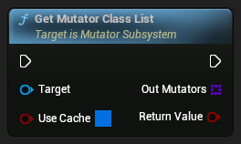

```cpp
bool GetMutatorClassList(TArray<TSubclassOf<UMutator> > OutMutators, bool bUseCache)
```


##### Parameters
<RefTable colWidths={['30%', '70%']} stripes="odd">
| | |
|-|-|
|`Target`|`MutatorSubsystem`|
|`bUseCache`|whether or not we should return the cached result or rerun the query|
|`Out Mutators`|the mutator class list|
</RefTable>


##### Returns
Was the query successful


#### Get Asset


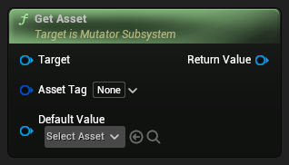

```cpp
UObject* GetAsset(FGameplayTag AssetTag, UObject* DefaultValue) const
```


##### Parameters
<RefTable colWidths={['30%', '70%']} stripes="odd">
| | |
|-|-|
|`Target`|`MutatorSubsystem`|
|`AssetTag`|The tag of the asset to retrieve|
|`DefaultValue`|The asset to use if no mutator is overriding it|
</RefTable>


#### Deregister Mutator


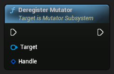

```cpp
void DeregisterMutator(FMutatorHandle Handle)
```


##### Parameters
<RefTable colWidths={['30%', '70%']} stripes="odd">
| | |
|-|-|
|`Target`|`MutatorSubsystem`|
|`Handle`||
</RefTable>


---

### UGCLibrary 


##### Inheritance Hierarchy
-> BlueprintFunctionLibrary-> Object


---

### UGCPackageWrapper 


##### Inheritance Hierarchy
-> Object


---

### UGCProvider 


##### Inheritance Hierarchy
-> Interface-> Object


#### Is Provider Enabled


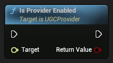

```cpp
bool IsProviderEnabled()
```


##### Parameters
<RefTable colWidths={['30%', '70%']} stripes="odd">
| | |
|-|-|
|`Target`|`UGCProvider`|
</RefTable>


##### Returns
bool indicating whether the UGC provider is enabled


#### Initialize Provider


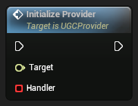

```cpp
void InitializeProvider(FOnUGCProviderInitializedDelegate Handler)
```


##### Parameters
<RefTable colWidths={['30%', '70%']} stripes="odd">
| | |
|-|-|
|`Target`|`UGCProvider`|
|`Handler`|Callback for initialization success.|
</RefTable>


#### Get Installed UGC Paths


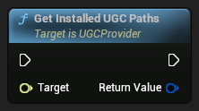

```cpp
FModUGCPathMap GetInstalledUGCPaths()
```


##### Parameters
<RefTable colWidths={['30%', '70%']} stripes="odd">
| | |
|-|-|
|`Target`|`UGCProvider`|
</RefTable>


##### Returns
A map of installed UGC paths to their IDs.


#### Deinitialize Provider


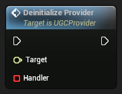

```cpp
void DeinitializeProvider(FOnUGCProviderDeinitializedDelegate Handler)
```


##### Parameters
<RefTable colWidths={['30%', '70%']} stripes="odd">
| | |
|-|-|
|`Target`|`UGCProvider`|
|`Handler`|Callback for deinitialization success.|
</RefTable>


---

### UGCSubsystem 


##### Inheritance Hierarchy
-> EngineSubsystem-> DynamicSubsystem-> Subsystem-> Object


#### Unmount UGC Package By Mod ID


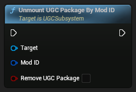

```cpp
void UnmountUGCPackageByModID(FGenericModID ModID, bool bRemoveUGCPackage)
```


##### Parameters
<RefTable colWidths={['30%', '70%']} stripes="odd">
| | |
|-|-|
|`Target`|`UGCSubsystem`|
|`ModID`|the ID of the package to unmount|
|`bRemoveUGCPackage`|should the package be removed from the registry altogether after unmounting? pass true for uninstallation|
</RefTable>


#### Unmount UGC Package


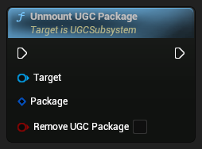

```cpp
void UnmountUGCPackage(FUGCPackage Package, bool bRemoveUGCPackage)
```


##### Parameters
<RefTable colWidths={['30%', '70%']} stripes="odd">
| | |
|-|-|
|`Target`|`UGCSubsystem`|
|`Package`||
|`bRemoveUGCPackage`|should the package be removed from the registry altogether after unmounting? pass true for uninstallation|
</RefTable>


#### Unload UGCBy Mod ID


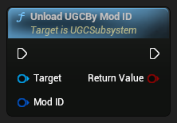

```cpp
bool UnloadUGCByModID(FGenericModID ModID)
```


##### Parameters
<RefTable colWidths={['30%', '70%']} stripes="odd">
| | |
|-|-|
|`Target`|`UGCSubsystem`|
|`ModID`|Mod ID of the mod to remove UGC for|
</RefTable>


#### Unload All UGC Packages


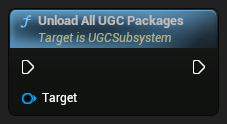

```cpp
void UnloadAllUGCPackages()
```


#### Set UGC Provider


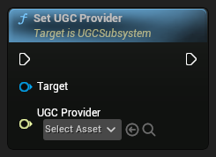

```cpp
void SetUGCProvider(TScriptInterface<IUGCProvider> InUGCProvider)
```


##### Parameters
<RefTable colWidths={['30%', '70%']} stripes="odd">
| | |
|-|-|
|`Target`|`UGCSubsystem`|
|`InUGCProvider`|The UGC provider to use|
</RefTable>


#### Set UGC Enabled State Provider


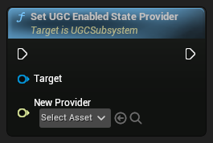

```cpp
void SetUGCEnabledStateProvider(TScriptInterface<IModEnabledStateProvider> NewProvider)
```


##### Parameters
<RefTable colWidths={['30%', '70%']} stripes="odd">
| | |
|-|-|
|`Target`|`UGCSubsystem`|
|`NewProvider`|The new object to query via IModEnabledStateProvider|
</RefTable>


#### Remove UGC Changed Handler


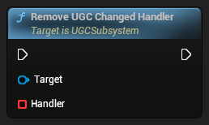

```cpp
void RemoveUGCChangedHandler(FOnUGCPackagesChangedDelegate Handler)
```


##### Parameters
<RefTable colWidths={['30%', '70%']} stripes="odd">
| | |
|-|-|
|`Target`|`UGCSubsystem`|
|`Handler`|Delegate to remove|
</RefTable>


#### Remove Mod Enabled State Change Handler


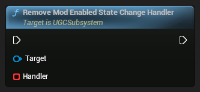

```cpp
void RemoveModEnabledStateChangeHandler(FModEnabledStateChangeHandler Handler)
```


##### Parameters
<RefTable colWidths={['30%', '70%']} stripes="odd">
| | |
|-|-|
|`Target`|`UGCSubsystem`|
|`Handler`|Delegate to be removed from the notification list|
</RefTable>


#### Refresh UGC


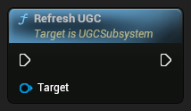

```cpp
void RefreshUGC()
```


#### Enumerate All UGC Packages


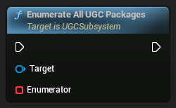

```cpp
void K2_EnumerateAllUGCPackages(FUGCPackageEnumeratorDelegate Enumerator) const
```


##### Parameters
<RefTable colWidths={['30%', '70%']} stripes="odd">
| | |
|-|-|
|`Target`|`UGCSubsystem`|
|`Enumerator`|The bound delegate to invoke|
</RefTable>


#### Is UGC Feature Enabled


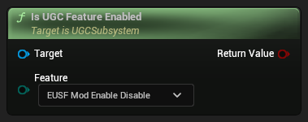

```cpp
bool IsUGCFeatureEnabled(EUGCSubsystemFeature Feature)
```


##### Parameters
<RefTable colWidths={['30%', '70%']} stripes="odd">
| | |
|-|-|
|`Target`|`UGCSubsystem`|
|`Feature`|The feature to query|
</RefTable>


##### Returns
bool indicating the state of the specified feature


#### Is UPlugin Compatible


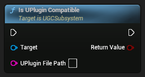

```cpp
bool IsUGCCompatible(FString UPluginFilePath)
```


##### Parameters
<RefTable colWidths={['30%', '70%']} stripes="odd">
| | |
|-|-|
|`Target`|`UGCSubsystem`|
|`UPluginFilePath`||
</RefTable>


#### Is Provider Enabled


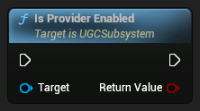

```cpp
bool IsProviderEnabled()
```


##### Parameters
<RefTable colWidths={['30%', '70%']} stripes="odd">
| | |
|-|-|
|`Target`|`UGCSubsystem`|
</RefTable>


##### Returns
bool indicating whether the UGC provider is enabled


#### Initialize UGCProvider


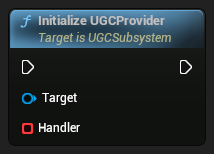

```cpp
void InitializeUGCProvider(FOnUGCProviderInitializedDelegate Handler)
```


##### Parameters
<RefTable colWidths={['30%', '70%']} stripes="odd">
| | |
|-|-|
|`Target`|`UGCSubsystem`|
|`Handler`|Callback for initialization success.|
</RefTable>


#### Get UGC Package By Mod ID


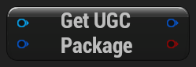

```cpp
bool GetUGCPackageByModID(FGenericModID ModID, FUGCPackage UGCPackage) const
```


##### Parameters
<RefTable colWidths={['30%', '70%']} stripes="odd">
| | |
|-|-|
|`Target`|`UGCSubsystem`|
|`ModID`|the ID of the mod to get the package for|
|`UGCPackage`|the package to populate with the UGC package data|
</RefTable>


##### Returns
true if the package was found, false otherwise


#### Get Package Names From UGC Package


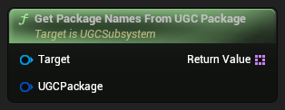

```cpp
TArray<FName> GetPackageNamesFromUGCPackage(FUGCPackage UGCPackage) const
```


##### Parameters
<RefTable colWidths={['30%', '70%']} stripes="odd">
| | |
|-|-|
|`Target`|`UGCSubsystem`|
|`UGCPackage`|The UGC package to get package names from|
</RefTable>


##### Returns
Array of package names


#### Deinitialize UGCProvider


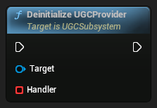

```cpp
void DeinitializeUGCProvider(FOnUGCProviderDeinitializedDelegate Handler)
```


##### Parameters
<RefTable colWidths={['30%', '70%']} stripes="odd">
| | |
|-|-|
|`Target`|`UGCSubsystem`|
|`Handler`|Callback for deinitialization success.|
</RefTable>


#### Add UGC From Path


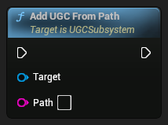

```cpp
void AddUGCFromPath(FString Path)
```


##### Parameters
<RefTable colWidths={['30%', '70%']} stripes="odd">
| | |
|-|-|
|`Target`|`UGCSubsystem`|
|`Path`|The path to the UGC package, such as "C:\Users\Public\mod.io\6532\mods\4119758". This path must contain a .uplugin file in the root directory, and .pak file in "Content/Paks/[PLATFORM]" directory|
</RefTable>


#### Add UGC Changed Handler


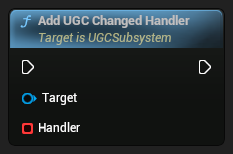

```cpp
void AddUGCChangedHandler(FOnUGCPackagesChangedDelegate Handler)
```


##### Parameters
<RefTable colWidths={['30%', '70%']} stripes="odd">
| | |
|-|-|
|`Target`|`UGCSubsystem`|
|`Handler`|Delegate to invoke|
</RefTable>


#### Add Mod Enabled State Change Handler


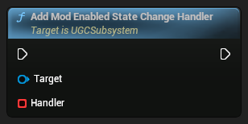

```cpp
void AddModEnabledStateChangeHandler(FModEnabledStateChangeHandler Handler)
```


##### Parameters
<RefTable colWidths={['30%', '70%']} stripes="odd">
| | |
|-|-|
|`Target`|`UGCSubsystem`|
|`Handler`|Delegate to be notified|
</RefTable>


##### Variables
<RefTable colWidths={['10%', '10%', '20%']} stripes="odd">
| | | |
|-|-|-|
| `FOnUGCPackagesChangedMulticastDelegate` | `OnUGCPackagesChanged` |  |
| `FOnModEnabledStateChangeMulticastDelegate` | `OnModEnabledStateChanged` |  |
</RefTable>


---

### UGC_Metadata 


##### Inheritance Hierarchy
-> PrimaryDataAsset-> DataAsset-> Object


##### Variables
<RefTable colWidths={['10%', '10%', '20%']} stripes="odd">
| | | |
|-|-|-|
| `FString` | `UnrealVersion` |  |
| `bool` | `bIoStoreEnabled` |  |
</RefTable>


---


## Structs

### EnemyWaveEnded_Params 


##### Variables
<RefTable colWidths={['10%', '10%', '20%']} stripes="odd">
| | | |
|-|-|-|
| `int32` | `WaveNumber` |  |
</RefTable>


---

### ModifyDamage_Params 


##### Variables
<RefTable colWidths={['10%', '10%', '20%']} stripes="odd">
| | | |
|-|-|-|
| `AActor*` | `Target` |  |
| `AActor*` | `Source` |  |
| `float` | `Amount` |  |
</RefTable>


---

### PostPawnSpawned_Params 


##### Variables
<RefTable colWidths={['10%', '10%', '20%']} stripes="odd">
| | | |
|-|-|-|
| `APawn*` | `Pawn` |  |
</RefTable>


---

### PostPlayerInit_Params 


##### Variables
<RefTable colWidths={['10%', '10%', '20%']} stripes="odd">
| | | |
|-|-|-|
| `AController*` | `Controller` |  |
</RefTable>


---

### ScorePoints_Params 


##### Variables
<RefTable colWidths={['10%', '10%', '20%']} stripes="odd">
| | | |
|-|-|-|
| `AController*` | `Scorer` |  |
| `int32` | `Amount` |  |
</RefTable>


---

### GenericModID 


##### Variables
<RefTable colWidths={['10%', '10%', '20%']} stripes="odd">
| | | |
|-|-|-|
| `int64` | `ModID` |  |
</RefTable>


---

### UGCPackage 


---

### MutatorHandle 


---

### MutatorPriorityBucket 


---

### ModUGCPathMap 


##### Variables
<RefTable colWidths={['10%', '10%', '20%']} stripes="odd">
| | | |
|-|-|-|
| `TMap<FString,FGenericModID>` | `PathToModIDMap` |  |
</RefTable>


---


## Functions 


### GetModID (FUGCPackage)


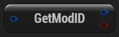

```cpp
bool GetModID(FUGCPackage UGCPackage, FGenericModID ModID)
```


---


## Enums

### EUGCPackageMountState {#EUGCPackageMountState} 


<RefTable colWidths={['30%', '70%']} stripes="odd">
| | |
|-|-|
| `EUPMS_Unmounted` |  |
| `EUPMS_Mounted` |  |
</RefTable>

---

### EUGCSubsystemFeature {#EUGCSubsystemFeature} 


<RefTable colWidths={['30%', '70%']} stripes="odd">
| | |
|-|-|
| `EUSF_ModEnableDisable` |  |
| `EUSF_Monetization` |  |
| `EUSF_ModDownvote` |  |
</RefTable>

---


