import Tabs from '@theme/Tabs';
import TabItem from '@theme/TabItem';

Documentation for each component in the mod.io UI framework contains the following sections:

* **Implementation  Requirements**  
  This section specifies any requirements that a widget must meet in order to be considered a component by the mod.io UI. The mod.io framework does not impose a specific base class on widgets; the primary requirements for each component will be specified in terms of the interfaces a widget should implement.

* **Default Component Implementations**  
  This section contains a number of sub-sections providing information that is specific to the default implementation of a given component provided by mod.io. These should be treated as implementation details from the perspective of widgets or components that consume the widget in question.

  * **Additional Interfaces**  
  This is a list of any interfaces that this particular default component implementation uses in addition to the standard implementation requirements for this component.  For example, the **Icon Button** implements all the standard interfaces of the **Button** (`IModioUIClickableWidget`, `IModioUISelectableWidget` etc.), plus the `IModioUIImageDisplayWidget` interface to display an icon.

  * **Properties**  
  This is a list of editable configuration properties that the default component implementation exposes. These properties are configurable on instances of the component, but runtime changes should be performed through the relevant interface instead.

  * **Sub-components**  
    Some components may have sub-components (for example, the default **Button** implementation provides a **Label** sub-component). This section outlines:
  
    - The getter function that's used to retrieve a reference to the sub-component in question
    - A description of the sub-component, including the type or expected interfaces that it needs to implement and how the sub-component is used in the default component implementation

  * **Event Data**  
    Components will expose interface functions for adding event handlers for various events that the component will emit. This section outlines what those events are and the data that is passed by the default implementation to delegates that are bound to those event handlers.


## UI Component Specifications


### Button

The button component is a base component in the mod.io Component UI framework. It implements interfaces to support data binding as well as click, selection and hover events.


#### Implementation Requirements

A `UWidget`-derived class must implement the following interfaces to meet the requirements of a Button Component:

|Required Interface|Purpose|
|-|-|
|IModioUIClickableWidget|Allows the widget to emit events when clicked
|IModioUISelectableWidget|Allows the widget to be configured as selectable
|IModioUIHoverableWidget|Allows the widget to emit events when hovered
|IModioUIHasTooltipWidget|Allows the widget to have its tooltip externally configured
|IModioUIDataSourceWidget|Allows the widget to data-bind to a UObject*


#### Default Component Implementations


##### Icon Button

The Icon Button is a default implementation of the button component, which extends Text Button and adds support for an image to be displayed on the button at runtime. The default blueprint implementation implements IModioUIImageDisplayWidget to allow the image to be set at runtime, and forwards those interface messages onto an Image sub-component which actually displays the image as an icon beside the button label.


###### Additional Interfaces
<RefTable stripes="odd">
| | |
|-|-|
|IModioUIImageDisplayWidget|Allows the widget to receive messages regarding displaying an image
</RefTable>

###### Properties
<RefTable stripes="odd">
| | | |
|-|-|-|
| `FText` | `LabelText` | Text to display on this button's label. For runtime changes, use IModioUIHasTextWidget::SetText |
</RefTable>


###### Sub-components
<RefTable colWidths={['20%']} stripes="odd">
| | |
|-|-|
|GetImageWidget|Gets a reference to the sub-component responsible for displaying the image. The default Blueprint implementation will forward IModioUIImageDisplayWidget messages to this widget if it is valid.
</RefTable>


###### Event Data

Icon Button emits the following interface events with the specified data:

<RefTable colWidths={['20%', '20%']} stripes="odd">
| | | |
|-|-|-|
| `FModioImageDisplayOnLoadStateChanged` | `void(UObject* LoadContext, bool bLoadSuccess)` |Passes `this` as LoadContext, `bLoadSuccess` indicates if loading succeeded
| `FModioClickableOnClicked` | `void(UObject* ClickContext)` |Passes `this` as ClickContext
| `FModioOnFocusPathChanged` | `void(UObject* FocusContext, FFocusEvent InFocusEvent, bool bIsFocused)` |Passes `this` as FocusContext, `InFocusEvent` as the focus event, `bIsFocused` as the new focus state
| `FModioSelectableOnSelectionChanged` | `void(UObject* SelectionContext, bool bNewSelectedState)` |Passes `this` as SelectionContext, `bNewSelectedState` is new selection state
| `FModioHoverableOnHoverStateChanged` | `void(UObject* HoverContext, bool bHoveredState)` |Passes `this` as HoverContext, `bHoveredState` is new hover state
</RefTable>


##### Text Button

The Text Button is a default implementation of the Button component which implements IModioUIHasTextWidget to allow an associated FText to be set at runtime. The default blueprint implementation visualizes this FText on a static text widget which functions as the button's label.


###### Additional Interfaces
<RefTable stripes="odd">
| | |
|-|-|
|IModioUIHasTextWidget|Allows the widget to be sent an FText to display at runtime
</RefTable>

###### Properties
<RefTable stripes="odd">
| | | |
|-|-|-|
| `FText` | `LabelText` | Text to display on this button's label. For runtime changes, use IModioUIHasTextWidget::SetText |
</RefTable>


###### Sub-components
<RefTable colWidths={['20%']} stripes="odd">
| | |
|-|-|
|GetLabelWidget|Gets a reference to the widget responsible for displaying the button's label. The default implementation will forward IModioUIHasTextWidget messages to this widget if it is valid
</RefTable>


###### Event Data

Text Button emits the following interface events with the specified data:

<RefTable colWidths={['20%', '20%']} stripes="odd">
| | | |
|-|-|-|
| `FModioClickableOnClicked` | `void(UObject* ClickContext)` |Passes `this` as ClickContext
| `FModioOnFocusPathChanged` | `void(UObject* FocusContext, FFocusEvent InFocusEvent, bool bIsFocused)` |Passes `this` as FocusContext, `InFocusEvent` as the focus event, `bIsFocused` as the new focus state
| `FModioSelectableOnSelectionChanged` | `void(UObject* SelectionContext, bool bNewSelectedState)` |Passes `this` as SelectionContext, `bNewSelectedState` is new selection state
| `FModioHoverableOnHoverStateChanged` | `void(UObject* HoverContext, bool bHoveredState)` |Passes `this` as HoverContext, `bHoveredState` is new hover state
</RefTable>


---


### Text

The Text component is a base component in the mod.io Component UI framework for visualizing a piece of text. The requirements for a Text component are very minimal - just the implementation of a single interface to allow for the value of the text to be set or queried at runtime.


#### Implementation Requirements

A `UWidget`-derived class must implement the following interfaces to meet the requirements of a Text Component:

|Required Interface|Purpose|
|-|-|
|IModioUIHasTextWidget|Allows the widget to have its associated text externally configured


#### Default Component Implementations


##### Text Block

The text block is a default implementation of a Text component that supports displaying a localized piece of text, which can be externally configured.


###### Additional Interfaces
<RefTable stripes="odd">
| | |
|-|-|
|IModioUIHasTextWidget|Allows the text being displayed to be set or queried at runtime
|IModioUIHasConfigurableColor|Allows the text color to be configured at runtime
</RefTable>

###### Properties
<RefTable stripes="odd">
| | | |
|-|-|-|
</RefTable>


###### Sub-components
<RefTable colWidths={['20%']} stripes="odd">
| | |
|-|-|
</RefTable>


###### Event Data

Text Block emits the following interface events with the specified data:

<RefTable colWidths={['20%', '20%']} stripes="odd">
| | | |
|-|-|-|
</RefTable>


---


### Editable Text

The Editable Text component is a widget that gathers user-specified text input. It optionally can be configured with validation rules to use to check the user input for conformity.


#### Implementation Requirements

A `UWidget`-derived class must implement the following interfaces to meet the requirements of a Editable Text Component:

|Required Interface|Purpose|
|-|-|
|IModioUIStringInputWidget|Allows the widget to have its user input retrieved, and the hint text configured
|IModioUITextValidator|Allows the widget to be externally configured with validation rules, or to be queried for the results of validation


---


### Image

The Image component is a widget that displays an externally-configurable image.


#### Implementation Requirements

A `UWidget`-derived class must implement the following interfaces to meet the requirements of a Image Component:

|Required Interface|Purpose|
|-|-|
|IModioUIImageDisplayWidget|Allows the widget to have its associated image/brush externally configured


#### Default Component Implementations


##### Image

The Image widget is a default implementation of the Image component, which uses UImage for the underlying implementation.


###### Properties
<RefTable stripes="odd">
| | | |
|-|-|-|
</RefTable>


###### Sub-components
<RefTable colWidths={['20%']} stripes="odd">
| | |
|-|-|
</RefTable>


###### Event Data

Image emits the following interface events with the specified data:

<RefTable colWidths={['20%', '20%']} stripes="odd">
| | | |
|-|-|-|
</RefTable>


---


### Progress

The Progress component is a widget that visualizes a float value between 0-1 as progress, with 0 representing no progress and 1 representing completion.


#### Implementation Requirements

A `UWidget`-derived class must implement the following interfaces to meet the requirements of a Progress Component:

|Required Interface|Purpose|
|-|-|
|IModioUIProgressWidget|Allows the widget to have its associated progress value set and queried


---


### Tag

The Tag component is a widget that visualizes a single tag from a mod.


#### Implementation Requirements

A `UWidget`-derived class must implement the following interfaces to meet the requirements of a Tag Component:

|Required Interface|Purpose|
|-|-|
|IModioUIHasTextWidget|Allows the widget to have its associated label configured with the text representation of the tag


---


### Object List

The Object List component is a widget that visualizes a group of objects in some fashion. It allows external registration of a delegate that will be called any time a widget is created to visualize an element in the associated object array.


#### Implementation Requirements

A `UWidget`-derived class must implement the following interfaces to meet the requirements of a Object List Component:

|Required Interface|Purpose|
|-|-|
|IModioUIObjectListWidget|Allows the set of objects to visualize to be configured externally and allows for callback to be registered for internal widget creation/destruction


#### Default Component Implementations


##### Object Wrap Box

The Object Wrap Box is a default implementation of the Object List component. This implementation derives from `UWrapBox` and defers to it for visualizing a set of objects. It does this by instantiating a specific `IModioUIDataSourceWidget`-implementing widget for each object in the set, using that interface to bind the widget to the object in question, and then adding the widget as a child to the wrap box implementation, which handles the positioning and layout of those widgets.


###### Properties
<RefTable stripes="odd">
| | | |
|-|-|-|
</RefTable>


###### Sub-components
<RefTable colWidths={['20%']} stripes="odd">
| | |
|-|-|
</RefTable>


###### Event Data

Object Wrap Box emits the following interface events with the specified data:

<RefTable colWidths={['20%', '20%']} stripes="odd">
| | | |
|-|-|-|
| `FModioObjectListOnObjectWidgetCreated` | `void(UWidget* ObjectWidget, UObject* Object)` |Passes the newly created widget as `ObjectWidget`, and the UObject bound to that widget as `Object`
</RefTable>


---


### Mod List

The Mod List component is a specialization of Object List that visualizes a group of mods in some fashion. It requires the objects given to the component, to implement IModioModInfoUIDetails.


#### Implementation Requirements

A `UWidget`-derived class must implement the following interfaces to meet the requirements of a Mod List Component:

|Required Interface|Purpose|
|-|-|
|IModioUIObjectListWidget|Allows the set of objects to visualize to be configured externally and allows for callback to be registered for internal widget creation/destruction


---


### Object Selector

The Object Selector component is a widget that allows a user to make a selection amongst a set of bound UObjects. It allows other objects to register for notifications when a user selects an object from the list.


#### Implementation Requirements

A `UWidget`-derived class must implement the following interfaces to meet the requirements of a Object Selector Component:

|Required Interface|Purpose|
|-|-|
|IModioUIObjectSelector|Allows the set of objects to select from, to be configured externally, and allows for callback to be registered for selection changes.


#### Default Component Implementations


##### Object Selector

The Default Object Selector is a default implementation of the Object Selector component. This implementation derives from `UListView` and defers to it for displaying a set of objects and allowing the user to select one or more of them based on the widget's configuration. It requires the widgets that represent each entry in the list to implement `IModioUIDataSourceWidget` and `IModioUIClickableWidget` in addition to the `IUserObjectListEntry` interface requirement imposed by the underlying List View.


###### Properties
<RefTable stripes="odd">
| | | |
|-|-|-|
</RefTable>


###### Sub-components
<RefTable colWidths={['20%']} stripes="odd">
| | |
|-|-|
</RefTable>


###### Event Data

Object Selector emits the following interface events with the specified data:

<RefTable colWidths={['20%', '20%']} stripes="odd">
| | | |
|-|-|-|
| `FModioOnObjectSelectionChanged` | `void(UObject* SelectedValue)` |Passes the bound value for which selection state has changed as `SelectedValue`
| `FModioObjectListOnObjectWidgetCreated` | `void(UWidget* ObjectWidget, UObject* Object)` |Passes the newly created widget as `ObjectWidget`, and the UObject bound to that widget as `Object`
</RefTable>


---


### Enum Selector

The Enum Selector component is a specialization of the Object Selector widget. Value objects passed to the selector should implement IModioEnumEntryUIDetails so that they can be queried for an associated entry in an enum.


#### Implementation Requirements

A `UWidget`-derived class must implement the following interfaces to meet the requirements of a Enum Selector Component:

|Required Interface|Purpose|
|-|-|
|IModioUIObjectSelector|Allows the widget to internally track the selection state of the passed-in enum values, which can be externally queried


#### Default Component Implementations


##### Enum Selector

The Enum Selector is a default implementation of the Enum Selector component. This default implementation uses an internal sub-component as a menu.


###### Properties
<RefTable stripes="odd">
| | | |
|-|-|-|
</RefTable>


###### Sub-components
<RefTable colWidths={['20%']} stripes="odd">
| | |
|-|-|
|GetSelectorMenuWidget|Provides a reference to the internal widget that provides a menu users can select an enum value from. The default implementation will forward IModioUIObjectSelector messages to this widget if it is valid
|GetMenuToggleClickableWidget|Provides a reference to the internal widget that will toggle the display of the menu to allow users to make a selection
</RefTable>


###### Event Data

Enum Selector emits the following interface events with the specified data:

<RefTable colWidths={['20%', '20%']} stripes="odd">
| | | |
|-|-|-|
| `FModioOnObjectSelectionChanged` | `void(UObject* SelectedValue)` |Passes `this` as SelectedValue
| `FModioOnActivationChanged` | `void(UObject* ActivationContext, bool bIsActivated)` |Passes `this` as ActivationContext, `bIsActivated` as the new activation state
| `FModioOnFocusPathChanged` | `void(UObject* FocusContext, FFocusEvent InFocusEvent, bool bIsFocused)` |Passes `this` as FocusContext, `InFocusEvent` as the focus event, `bIsFocused` as the new focus state
</RefTable>


##### Enum Selector Menu

The Enum Selector is a default implementation of the Enum Selector component. This default implementation uses an internal sub-component to display and manage selection of individual enum values.


###### Properties
<RefTable stripes="odd">
| | | |
|-|-|-|
</RefTable>


###### Sub-components
<RefTable colWidths={['20%']} stripes="odd">
| | |
|-|-|
|GetSelectorWidget|Provides a reference to the internal widget that actually displays the enum values and tracks the user's selection. The default implementation will forward IModioUIObjectSelector messages to this widget if it is valid
</RefTable>


###### Event Data

Enum Selector Menu emits the following interface events with the specified data:

<RefTable colWidths={['20%', '20%']} stripes="odd">
| | | |
|-|-|-|
| `FModioOnObjectSelectionChanged` | `void(UObject* SelectedValue)` |Passes `UObject*` as SelectedValue
| `FModioOnActivationChanged` | `void(UObject* ActivationContext, bool bIsActivated)` |Passes `this` as ActivationContext, `bIsActivated` as the new activation state
| `FModioOnFocusPathChanged` | `void(UObject* FocusContext, FFocusEvent InFocusEvent, bool bIsFocused)` |Passes `this` as FocusContext, `InFocusEvent` as the focus event, `bIsFocused` as the new focus state
</RefTable>


---


### Enum Selector Entry

The Enum Selector Entry component is a specialization of the Object Selector Entry that visualizes an enum value and allows it to be selected.


#### Implementation Requirements

A `UWidget`-derived class must implement the following interfaces to meet the requirements of a Enum Selector Entry Component:

|Required Interface|Purpose|
|-|-|
|IUserObjectListEntry|Required to allow Entry components to be used as visualization widgets in standard Unreal list and tile views
|IModioUIClickableWidget|Allows the widget to emit events when clicked to allow the enum selector to trigger a selection change
|IModioUISelectableWidget|Allows the widget to internally track the selection state of the bound enum value, which can be externally queried
|IModioUIDataSourceWidget|Allows the widget to be data-bound to a UObject implementing IModioEnumEntryUIDetails


#### Default Component Implementations


##### Enum Selector Entry

the Enum Selector Entry is a default implementation of the Enum Selector Entry component. This default implementation uses a subwidget for a text label for the enum value, a clickable subwidget to allow users to make selections, and a selectable subwidget to visually represent the selection state of the associated enum value in the selector.


###### Properties
<RefTable stripes="odd">
| | | |
|-|-|-|
</RefTable>


###### Sub-components
<RefTable colWidths={['20%']} stripes="odd">
| | |
|-|-|
|GetSelectableWidget|Provides a reference to the internal widget that will visualize the current selection state of the bound enum value
|GetLabelWidget|Provides a reference to the internal widget that is used for displaying the display string for the bound enum value
|GetClickableWidget|Provides a reference to the internal widget that will receive click/enter events so that the enclosing selector can change selection based on user input
</RefTable>


###### Event Data

Enum Selector Entry emits the following interface events with the specified data:

<RefTable colWidths={['20%', '20%']} stripes="odd">
| | | |
|-|-|-|
| `FModioClickableOnClicked` | `void(UObject* ClickContext)` |Passes `this` as ClickContext
| `FModioSelectableOnSelectionChanged` | `void(UObject* SelectionContext, bool bNewSelectedState)` |Passes `this` as SelectionContext, `bNewSelectedState` is new selection state
| `FModioOnActivationChanged` | `void(UObject* ActivationContext, bool bIsActivated)` |Passes `this` as ActivationContext, `bIsActivated` as the new activation state
| `FModioOnFocusPathChanged` | `void(UObject* FocusContext, FFocusEvent InFocusEvent, bool bIsFocused)` |Passes `this` as FocusContext, `InFocusEvent` as the focus event, `bIsFocused` as the new focus state
</RefTable>


##### Enum Selector Entry

An entry that represents a single selectable enum option.


###### Properties
<RefTable stripes="odd">
| | | |
|-|-|-|
</RefTable>


###### Sub-components
<RefTable colWidths={['20%']} stripes="odd">
| | |
|-|-|
</RefTable>


###### Event Data

Enum Selector Entry emits the following interface events with the specified data:

<RefTable colWidths={['20%', '20%']} stripes="odd">
| | | |
|-|-|-|
| `FModioClickableOnClicked` | `void(UObject* ClickContext)` |Passes `this` as ClickContext
| `FModioSelectableOnSelectionChanged` | `void(UObject* SelectionContext, bool bNewSelectedState)` |Passes `this` as SelectionContext, `bNewSelectedState` is new selection state
| `FModioOnActivationChanged` | `void(UObject* ActivationContext, bool bIsActivated)` |Passes `this` as ActivationContext, `bIsActivated` as the new activation state
| `FModioOnFocusPathChanged` | `void(UObject* FocusContext, FFocusEvent InFocusEvent, bool bIsFocused)` |Passes `this` as FocusContext, `InFocusEvent` as the focus event, `bIsFocused` as the new focus state
</RefTable>


---


### Preset Filter Selector

The Preset Filter Selector component is a specialization of Object Selector that visualizes a group of objects that implement IModioModFilterUIDetails in some fashion. It allows other widgets to register for notifications when a user selects a preset filter from the list.


#### Implementation Requirements

A `UWidget`-derived class must implement the following interfaces to meet the requirements of a Preset Filter Selector Component:

|Required Interface|Purpose|
|-|-|
|IModioUIObjectSelector|Allows the selection state of the preset filters to be queried or set externally


#### Default Component Implementations


##### Preset Filter Selector

The Preset Filter Selector is a default implementation of the Preset Filter Selector component. This implementation uses an internal sub-component to display the available presets.


###### Properties
<RefTable stripes="odd">
| | | |
|-|-|-|
</RefTable>


###### Sub-components
<RefTable colWidths={['20%']} stripes="odd">
| | |
|-|-|
|GetPresetListWidget|Gets a reference to the widget responsible for displaying and selecting the set of available presets. The default implementation will forward IModioUIObjectSelector messages to this widget if it is valid
|GetFilterPresets|Fetches the available filter presets that the selector should present to users
</RefTable>


###### Event Data

Preset Filter Selector emits the following interface events with the specified data:

<RefTable colWidths={['20%', '20%']} stripes="odd">
| | | |
|-|-|-|
| `FModioOnActivationChanged` | `void(UObject* ActivationContext, bool bIsActivated)` |Passes `this` as ActivationContext, `bIsActivated` as the new activation state
| `FModioOnFocusPathChanged` | `void(UObject* FocusContext, FFocusEvent InFocusEvent, bool bIsFocused)` |Passes `this` as FocusContext, `InFocusEvent` as the focus event, `bIsFocused` as the new focus state
</RefTable>


##### Preset Filter Selector

A selector for choosing from preset filters.


###### Properties
<RefTable stripes="odd">
| | | |
|-|-|-|
</RefTable>


###### Sub-components
<RefTable colWidths={['20%']} stripes="odd">
| | |
|-|-|
</RefTable>


###### Event Data

Preset Filter Selector emits the following interface events with the specified data:

<RefTable colWidths={['20%', '20%']} stripes="odd">
| | | |
|-|-|-|
| `FModioOnActivationChanged` | `void(UObject* ActivationContext, bool bIsActivated)` |Passes `this` as ActivationContext, `bIsActivated` as the new activation state
| `FModioOnFocusPathChanged` | `void(UObject* FocusContext, FFocusEvent InFocusEvent, bool bIsFocused)` |Passes `this` as FocusContext, `InFocusEvent` as the focus event, `bIsFocused` as the new focus state
</RefTable>


---


### Preset Filter Selector Entry

The Preset Filter Selector Entry component is a specialization of the Object Selector Entry that visualizes a named preconfigured set of filter parameters and allows it to be selected.


#### Implementation Requirements

A `UWidget`-derived class must implement the following interfaces to meet the requirements of a Preset Filter Selector Entry Component:

|Required Interface|Purpose|
|-|-|
|IUserObjectListEntry|Required to allow Entry components to be used as visualization widgets in standard Unreal list and tile views
|IModioUIClickableWidget|Allows the widget to emit events when clicked to allow the filter selector to trigger a selection change
|IModioUISelectableWidget|Allows the widget to internally track the selection state of the bound filter parameters, which can be externally queried
|IModioUIDataSourceWidget|Allows the widget to be data-bound to a UObject implementing IModioModFilterUIDetails


---


### Command Menu

The Command Menu component is a widget that visualizes a set of UObjects implementing IModioUICommandObject.


#### Implementation Requirements

A `UWidget`-derived class must implement the following interfaces to meet the requirements of a Command Menu Component:

|Required Interface|Purpose|
|-|-|
|IModioUICommandMenu|Allows the implementing widget to be externally configured with menu builder delegates, and external triggering of a refresh/rebuild of the set of commands via the menu builders.


#### Default Component Implementations


##### Command Menu

The Command Menu is a default implementation of the Command Menu component which uses an internal sub-component implementing IModioUIObjectSelector to display a set of commands to users and allow them to select one. When a command is selected, the Command Menu will query the selected command object to check if the command can be executed and invoke it if so.


###### Properties
<RefTable stripes="odd">
| | | |
|-|-|-|
</RefTable>


###### Sub-components
<RefTable colWidths={['20%']} stripes="odd">
| | |
|-|-|
|GetSelectorWidget|Provides a reference to the internal widget that actually displays the available commands and and tracks the user's selection. The default implementation will forward IModioUIObjectSelector messages to this widget if it is valid, and assumes that this widget will be responsible for data-binding the command objects to each entry widget, and that those entry widgets will be responsible for inspecting their bound object for any information they want to visualize.
</RefTable>


###### Event Data

Command Menu emits the following interface events with the specified data:

<RefTable colWidths={['20%', '20%']} stripes="odd">
| | | |
|-|-|-|
| `FModioOnActivationChanged` | `void(UObject* ActivationContext, bool bIsActivated)` |Passes `this` as ActivationContext, `bIsActivated` as the new activation state
| `FModioOnFocusPathChanged` | `void(UObject* FocusContext, FFocusEvent InFocusEvent, bool bIsFocused)` |Passes `this` as FocusContext, `InFocusEvent` as the focus event, `bIsFocused` as the new focus state
</RefTable>


##### Popup Command Menu

The Popup Command Menu is a default implementation of the Command Menu component which is intended as an abstract base class for a widget that manages an internal sub-component that can be shown and dismissed based on user input. This base class provides an overridable function to construct the internal menu sub-component that will be displayed on request, and handles forwarding IModioUICommandMenu messages to that widget. Derived classes should provide an implementation of ConstructCommandMenuWidget, and their own custom behaviour for showing and dismissing that widget instance.


###### Properties
<RefTable stripes="odd">
| | | |
|-|-|-|
</RefTable>


###### Sub-components
<RefTable colWidths={['20%']} stripes="odd">
| | |
|-|-|
|GetCommandMenuWidget|Provides a reference to the internal widget that displays the command menu
</RefTable>


###### Event Data

Popup Command Menu emits the following interface events with the specified data:

<RefTable colWidths={['20%', '20%']} stripes="odd">
| | | |
|-|-|-|
| `FModioOnActivationChanged` | `void(UObject* ActivationContext, bool bIsActivated)` |Passes `this` as ActivationContext, `bIsActivated` as the new activation state
| `FModioOnFocusPathChanged` | `void(UObject* FocusContext, FFocusEvent InFocusEvent, bool bIsFocused)` |Passes `this` as FocusContext, `InFocusEvent` as the focus event, `bIsFocused` as the new focus state
</RefTable>


##### Command Menu

A menu displaying a list of commands.


###### Properties
<RefTable stripes="odd">
| | | |
|-|-|-|
</RefTable>


###### Sub-components
<RefTable colWidths={['20%']} stripes="odd">
| | |
|-|-|
</RefTable>


###### Event Data

Command Menu emits the following interface events with the specified data:

<RefTable colWidths={['20%', '20%']} stripes="odd">
| | | |
|-|-|-|
| `FModioOnActivationChanged` | `void(UObject* ActivationContext, bool bIsActivated)` |Passes `this` as ActivationContext, `bIsActivated` as the new activation state
| `FModioOnFocusPathChanged` | `void(UObject* FocusContext, FFocusEvent InFocusEvent, bool bIsFocused)` |Passes `this` as FocusContext, `InFocusEvent` as the focus event, `bIsFocused` as the new focus state
</RefTable>


##### Mod Details More Options Menu

A menu displaying additional options for a mod in the details view, such as reporting, viewing mods by the same author, or viewing dependencies.


###### Properties
<RefTable stripes="odd">
| | | |
|-|-|-|
</RefTable>


###### Sub-components
<RefTable colWidths={['20%']} stripes="odd">
| | |
|-|-|
</RefTable>


###### Event Data

Mod Details More Options Menu emits the following interface events with the specified data:

<RefTable colWidths={['20%', '20%']} stripes="odd">
| | | |
|-|-|-|
| `FModioOnActivationChanged` | `void(UObject* ActivationContext, bool bIsActivated)` |Passes `this` as ActivationContext, `bIsActivated` as the new activation state
| `FModioOnFocusPathChanged` | `void(UObject* FocusContext, FFocusEvent InFocusEvent, bool bIsFocused)` |Passes `this` as FocusContext, `InFocusEvent` as the focus event, `bIsFocused` as the new focus state
</RefTable>


---


### Mod Property Collection Visualizer

The Mod Property Collection Visualizer is a widget that visualizes a set of properties for a FModioModInfo object.


#### Implementation Requirements

A `UWidget`-derived class must implement the following interfaces to meet the requirements of a Mod Property Collection Visualizer Component:

|Required Interface|Purpose|
|-|-|
|IModioUIDataSourceWidget|Allows the implementing widget to be externally configured with a UObject that implements IModioModInfoUIDetails, which will be queried by the individual property visualizers this widget manages.


#### Default Component Implementations


##### Mod Property Collection Visualizer

A widget that manages the visualization of a collection of mod properties


###### Properties
<RefTable stripes="odd">
| | | |
|-|-|-|
</RefTable>


###### Sub-components
<RefTable colWidths={['20%']} stripes="odd">
| | |
|-|-|
|GetModPropertyVisualizerWidgets|
</RefTable>


###### Event Data

Mod Property Collection Visualizer emits the following interface events with the specified data:

<RefTable colWidths={['20%', '20%']} stripes="odd">
| | | |
|-|-|-|
| `FModioOnActivationChanged` | `void(UObject* ActivationContext, bool bIsActivated)` |Passes `this` as ActivationContext, `bIsActivated` as the new activation state
| `FModioOnFocusPathChanged` | `void(UObject* FocusContext, FFocusEvent InFocusEvent, bool bIsFocused)` |Passes `this` as FocusContext, `InFocusEvent` as the focus event, `bIsFocused` as the new focus state
</RefTable>


##### Mod Property Collection Visualizer

Displays a collection of properties for a mod, such as downloads, rating, size, and other metadata.


###### Properties
<RefTable stripes="odd">
| | | |
|-|-|-|
</RefTable>


###### Sub-components
<RefTable colWidths={['20%']} stripes="odd">
| | |
|-|-|
</RefTable>


###### Event Data

Mod Property Collection Visualizer emits the following interface events with the specified data:

<RefTable colWidths={['20%', '20%']} stripes="odd">
| | | |
|-|-|-|
| `FModioOnActivationChanged` | `void(UObject* ActivationContext, bool bIsActivated)` |Passes `this` as ActivationContext, `bIsActivated` as the new activation state
| `FModioOnFocusPathChanged` | `void(UObject* FocusContext, FFocusEvent InFocusEvent, bool bIsFocused)` |Passes `this` as FocusContext, `InFocusEvent` as the focus event, `bIsFocused` as the new focus state
</RefTable>


---


### Mod Tile

The Mod Tile is a specialization of Button that visualizes a FModioModInfo and is suitable for use as an item widget in Mod List and Mod Tile View components.


#### Implementation Requirements

A `UWidget`-derived class must implement the following interfaces to meet the requirements of a Mod Tile Component:

|Required Interface|Purpose|
|-|-|
|IUserObjectListEntry|Required to allow Mod Tile components to be used as visualization widgets in Mod List View and Mod Tile View components
|IModioUIDataSourceWidget|Allows the implementing widget to be externally configured with a UObject that implements IModioModInfoUIDetails, which can then be displayed on this tile.


#### Default Component Implementations


##### Mod Tile

This is a default implementation of the Mod Tile component which is intended to represent an individual mod in Mod List and Mod Tile View components.


###### Properties
<RefTable stripes="odd">
| | | |
|-|-|-|
</RefTable>


###### Sub-components
<RefTable colWidths={['20%']} stripes="odd">
| | |
|-|-|
</RefTable>


###### Event Data

Mod Tile emits the following interface events with the specified data:

<RefTable colWidths={['20%', '20%']} stripes="odd">
| | | |
|-|-|-|
| `FModioClickableOnClicked` | `void(UObject* ClickContext)` |Passes `this` as ClickContext
| `FModioSelectableOnSelectionChanged` | `void(UObject* SelectionContext, bool bNewSelectedState)` |Passes `this` as SelectionContext, `bNewSelectedState` is new selection state
| `FModioHoverableOnHoverStateChanged` | `void(UObject* HoverContext, bool bHoveredState)` |Passes `this` as HoverContext, `bHoveredState` is new hover state
| `FModioOnActivationChanged` | `void(UObject* ActivationContext, bool bIsActivated)` |Passes `this` as ActivationContext, `bIsActivated` as the new activation state
| `FModioOnFocusPathChanged` | `void(UObject* FocusContext, FFocusEvent InFocusEvent, bool bIsFocused)` |Passes `this` as FocusContext, `InFocusEvent` as the focus event, `bIsFocused` as the new focus state
</RefTable>


##### Mod Tile

Displays a mod tile with key details like title, image, and relevant metadata.


###### Properties
<RefTable stripes="odd">
| | | |
|-|-|-|
</RefTable>


###### Sub-components
<RefTable colWidths={['20%']} stripes="odd">
| | |
|-|-|
</RefTable>


###### Event Data

Mod Tile emits the following interface events with the specified data:

<RefTable colWidths={['20%', '20%']} stripes="odd">
| | | |
|-|-|-|
| `FModioClickableOnClicked` | `void(UObject* ClickContext)` |Passes `this` as ClickContext
| `FModioSelectableOnSelectionChanged` | `void(UObject* SelectionContext, bool bNewSelectedState)` |Passes `this` as SelectionContext, `bNewSelectedState` is new selection state
| `FModioHoverableOnHoverStateChanged` | `void(UObject* HoverContext, bool bHoveredState)` |Passes `this` as HoverContext, `bHoveredState` is new hover state
| `FModioOnActivationChanged` | `void(UObject* ActivationContext, bool bIsActivated)` |Passes `this` as ActivationContext, `bIsActivated` as the new activation state
| `FModioOnFocusPathChanged` | `void(UObject* FocusContext, FFocusEvent InFocusEvent, bool bIsFocused)` |Passes `this` as FocusContext, `InFocusEvent` as the focus event, `bIsFocused` as the new focus state
</RefTable>


---


### User Display

The User Display component is a widget that visualizes an FModioUser object.


#### Implementation Requirements

A `UWidget`-derived class must implement the following interfaces to meet the requirements of a User Display Component:

|Required Interface|Purpose|
|-|-|
|IModioUIDataSourceWidget|Allows the implementing widget to be externally configured with a UObject that implements IModioUserUIDetails, which will be queried for properties this widget needs to display.


#### Default Component Implementations


##### Platform Username

Displays the platform username of the user.


###### Properties
<RefTable stripes="odd">
| | | |
|-|-|-|
</RefTable>


###### Sub-components
<RefTable colWidths={['20%']} stripes="odd">
| | |
|-|-|
</RefTable>


###### Event Data

Platform Username emits the following interface events with the specified data:

<RefTable colWidths={['20%', '20%']} stripes="odd">
| | | |
|-|-|-|
| `FModioOnActivationChanged` | `void(UObject* ActivationContext, bool bIsActivated)` |Passes `this` as ActivationContext, `bIsActivated` as the new activation state
| `FModioOnFocusPathChanged` | `void(UObject* FocusContext, FFocusEvent InFocusEvent, bool bIsFocused)` |Passes `this` as FocusContext, `InFocusEvent` as the focus event, `bIsFocused` as the new focus state
</RefTable>


---


## API Reference


### Classes


#### LinearColorRefLibrary 

Library of functions for working with color references

###### Inheritance Hierarchy
-> BlueprintFunctionLibrary-> Object


---

#### ModRatingStateProvider 


###### Inheritance Hierarchy
-> Interface-> Object


##### Request Mod Rating Change


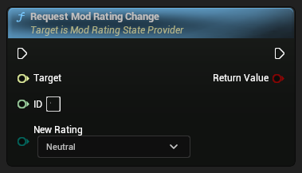

```cpp
bool RequestModRatingChange(int64 ID, EModioRating NewRating)
```


###### Parameters
<RefTable colWidths={['30%', '70%']} stripes="odd">
| | |
|-|-|
|`Target`|`ModRatingStateProvider`|
|`ID`|The raw ID for the mod to request the rating change for|
|`NewRating`|the new rating for the mod|
</RefTable>


###### Returns
true if the mod's rating was successfully changed, else false


##### Query Mod Rating


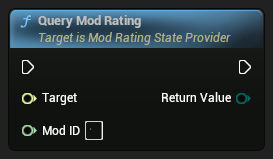

```cpp
EModioRating QueryModRating(int64 ModID)
```


###### Parameters
<RefTable colWidths={['30%', '70%']} stripes="odd">
| | |
|-|-|
|`Target`|`ModRatingStateProvider`|
|`ModID`|the raw ID for the mod to query|
</RefTable>


###### Returns
Rating of the mod


---

#### ModioActivatableWidget 

Interface indicating the implementing widget can be activated or deactivated

###### Inheritance Hierarchy
-> Interface-> Object


##### Remove Activation Changed Handler

Unregisters a delegate from receiving callbacks when the activation state changes

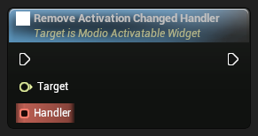

```cpp
void RemoveActivationChangedHandler(FModioOnActivationChanged Handler)
```


###### Parameters
<RefTable colWidths={['30%', '70%']} stripes="odd">
| | |
|-|-|
|`Target`|`ModioActivatableWidget`|
|`Handler`|Delegate to remove from activation state change|
</RefTable>


##### Deactivate

Deactivates the implementing widget


```cpp
void Deactivate()
```


###### Parameters
<RefTable colWidths={['30%', '70%']} stripes="odd">
| | |
|-|-|
|`Target`|`ModioActivatableWidget`|
</RefTable>


##### Add Activation Changed Handler

Registers a delegate to receive callbacks when the activation state changes


```cpp
void AddActivationChangedHandler(FModioOnActivationChanged Handler)
```


###### Parameters
<RefTable colWidths={['30%', '70%']} stripes="odd">
| | |
|-|-|
|`Target`|`ModioActivatableWidget`|
|`Handler`|Delegate to invoke on activation state change|
</RefTable>


##### Activate

Activates the implementing widget

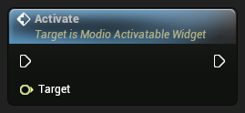

```cpp
void Activate()
```


###### Parameters
<RefTable colWidths={['30%', '70%']} stripes="odd">
| | |
|-|-|
|`Target`|`ModioActivatableWidget`|
</RefTable>


---

#### ModioButtonWidget 

The button component is a basic building block in the mod.io Component UI framework. It implements interfaces to support data binding as well as click, selection and hover events.

###### Inheritance Hierarchy
-> CommonButtonBase-> CommonUserWidget-> UserWidget-> Widget-> Visual-> Object


###### Variables
<RefTable colWidths={['10%', '10%', '20%']} stripes="odd">
| | | |
|-|-|-|
| `FModioClickableOnClickedMulticast` | `OnClicked` | Passes `this` as ClickContext |
| `TObjectPtr<UObject>` | `DataSource` | Cached object to use as the source for data binding Populated by SetDataSource |
| `bool` | `bFocusOnHover` | Whether the button should focus on hover. This is useful for gamepad navigation |
| `bool` | `bEnableKeyboardHover` | Bool to control whether keyboard navigation should visually trigger hover behavior |
| `FModioOnFocusPathChangedMulticast` | `OnModioFocusPathChanged` | Passes `this` as FocusContext, `InFocusEvent` as the focus event, `bIsFocused` as the new focus state |
| `FModioSelectableOnSelectionChangedMulticast` | `OnSelected` | Passes `this` as SelectionContext, `bNewSelectedState` is new selection state |
| `FModioHoverableOnHoverStateChangedMulticast` | `OnHoverStateChanged` | Passes `this` as HoverContext, `bHoveredState` is new hover state |
</RefTable>


---

#### ModioCommandEntry 

A UI component that represents a single command entry in a list of commands

###### Inheritance Hierarchy
-> ModioUIComponentBase-> CommonActivatableWidget-> CommonUserWidget-> UserWidget-> Widget-> Visual-> Object


##### Get Label Widget

The label widget for the command entry (e.g. the text of the command)

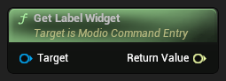

```cpp
TScriptInterface<IModioUIHasTextWidget> GetLabelWidget() const
```


###### Parameters
<RefTable colWidths={['30%', '70%']} stripes="odd">
| | |
|-|-|
|`Target`|`ModioCommandEntry`|
</RefTable>


###### Returns
The label widget


##### Get Icon Widget

The icon widget for the command entry (e.g. the icon that represents the command)

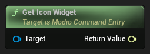

```cpp
TScriptInterface<IModioUIImageDisplayWidget> GetIconWidget() const
```


###### Parameters
<RefTable colWidths={['30%', '70%']} stripes="odd">
| | |
|-|-|
|`Target`|`ModioCommandEntry`|
</RefTable>


###### Returns
The icon widget


##### Get Clickable Widget

The clickable widget for the command entry (e.g. the button that should be clicked to execute the command)

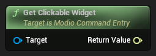

```cpp
TScriptInterface<IModioUIClickableWidget> GetClickableWidget() const
```


###### Parameters
<RefTable colWidths={['30%', '70%']} stripes="odd">
| | |
|-|-|
|`Target`|`ModioCommandEntry`|
</RefTable>


###### Returns
The clickable widget


###### Variables
<RefTable colWidths={['10%', '10%', '20%']} stripes="odd">
| | | |
|-|-|-|
</RefTable>


---

#### ModioCommandMenu 

The Command Menu is a default implementation of the Command Menu component which uses an internal sub-component implementing IModioUIObjectSelector to display a set of commands to users and allow them to select one. When a command is selected, the Command Menu will query the selected command object to check if the command can be executed and invoke it if so.

###### Inheritance Hierarchy
-> ModioUIComponentBase-> CommonActivatableWidget-> CommonUserWidget-> UserWidget-> Widget-> Visual-> Object


##### Get Selector Widget

Provides a reference to the internal widget that actually displays the available commands and and tracks the user's selection. The default implementation will forward IModioUIObjectSelector messages to this widget if it is valid, and assumes that this widget will be responsible for data-binding the command objects to each entry widget, and that those entry widgets will be responsible for inspecting their bound object for any information they want to visualize.

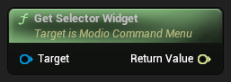

```cpp
TScriptInterface<IModioUIObjectSelector> GetSelectorWidget() const
```


###### Parameters
<RefTable colWidths={['30%', '70%']} stripes="odd">
| | |
|-|-|
|`Target`|`ModioCommandMenu`|
</RefTable>


###### Returns
The selector widget


###### Variables
<RefTable colWidths={['10%', '10%', '20%']} stripes="odd">
| | | |
|-|-|-|
</RefTable>


---

#### ModioCurrentUserAvatarWidget 

Widget that displays the current user's avatar

###### Inheritance Hierarchy
-> ModioUserDisplay-> ModioUIComponentBase-> CommonActivatableWidget-> CommonUserWidget-> UserWidget-> Widget-> Visual-> Object


##### Get Avatar Image Widget

Get the image widget that displays the avatar

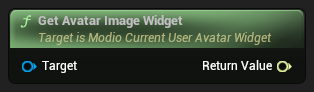

```cpp
TScriptInterface<IModioUIImageDisplayWidget> GetAvatarImageWidget() const
```


###### Parameters
<RefTable colWidths={['30%', '70%']} stripes="odd">
| | |
|-|-|
|`Target`|`ModioCurrentUserAvatarWidget`|
</RefTable>


###### Returns
The image widget


###### Variables
<RefTable colWidths={['10%', '10%', '20%']} stripes="odd">
| | | |
|-|-|-|
| `FSlateBrush` | `UnloadedBrush` | The brush to use when the avatar is not loaded |
| `FSlateBrush` | `ErroredBrush` | The brush to use when the avatar is errored (failed to load) |
| `FSlateBrush` | `LoadingBrush` | The brush to use when the avatar is loading |
</RefTable>


---

#### ModioDefaultBorder 

Default implementation of a border that can be used as a component in mod.io UI

###### Inheritance Hierarchy
-> Border-> ContentWidget-> PanelWidget-> Widget-> Visual-> Object


###### Variables
<RefTable colWidths={['10%', '10%', '20%']} stripes="odd">
| | | |
|-|-|-|
</RefTable>


---

#### ModioDefaultCheckBox 

Default implementation of a check box that can be used as a component in mod.io UI

###### Inheritance Hierarchy
-> CheckBox-> ContentWidget-> PanelWidget-> Widget-> Visual-> Object


##### Set Label

Sets the label of the Check Box

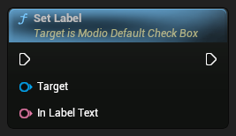

```cpp
void SetLabel(FText InLabelText)
```


###### Parameters
<RefTable colWidths={['30%', '70%']} stripes="odd">
| | |
|-|-|
|`Target`|`ModioDefaultCheckBox`|
|`InLabelText`|The label to set|
</RefTable>


##### Set Hovered


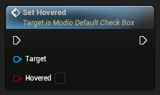

```cpp
void SetHovered(bool bHovered)
```


###### Parameters
<RefTable colWidths={['30%', '70%']} stripes="odd">
| | |
|-|-|
|`Target`|`ModioDefaultCheckBox`|
|`bHovered`|Whether the check box is hovered|
</RefTable>


##### Handle on Check State Changed


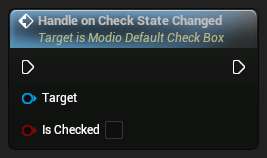

```cpp
void HandleOnCheckStateChanged(bool bIsChecked)
```


###### Parameters
<RefTable colWidths={['30%', '70%']} stripes="odd">
| | |
|-|-|
|`Target`|`ModioDefaultCheckBox`|
|`bIsChecked`|The new state of the check box|
</RefTable>


##### Get Label Text Block Text


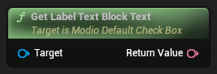

```cpp
FText GetLabelTextBlockText() const
```


###### Parameters
<RefTable colWidths={['30%', '70%']} stripes="odd">
| | |
|-|-|
|`Target`|`ModioDefaultCheckBox`|
</RefTable>


###### Returns
The label text block text


##### Get Label


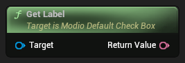

```cpp
FText GetLabel() const
```


###### Parameters
<RefTable colWidths={['30%', '70%']} stripes="odd">
| | |
|-|-|
|`Target`|`ModioDefaultCheckBox`|
</RefTable>


###### Returns
The label


##### Get Checkbox Content Padding


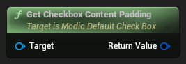

```cpp
FMargin GetCheckboxContentPadding() const
```


###### Parameters
<RefTable colWidths={['30%', '70%']} stripes="odd">
| | |
|-|-|
|`Target`|`ModioDefaultCheckBox`|
</RefTable>


###### Returns
The content padding


###### Variables
<RefTable colWidths={['10%', '10%', '20%']} stripes="odd">
| | | |
|-|-|-|
| `FMargin` | `ContentPadding` |  |
| `TSubclassOf<UWidget> ` | `LabelClass` |  |
| `FText` | `LabelText` |  |
</RefTable>


---

#### ModioDefaultCodeInputTextBox 


###### Inheritance Hierarchy
-> Widget-> Visual-> Object


##### Get Validation Error Widget


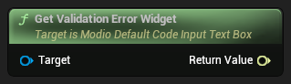

```cpp
TScriptInterface<IModioUIHasTextWidget> GetValidationErrorWidget() const
```


###### Variables
<RefTable colWidths={['10%', '10%', '20%']} stripes="odd">
| | | |
|-|-|-|
| `FModioDefaultCodeInputTextBoxStyle` | `CodeInputStyle` |  |
| `ETextFlowDirection` | `TextFlowDirection` |  |
| `EVirtualKeyboardTrigger` | `VirtualKeyboardTrigger` |  |
| `EVirtualKeyboardDismissAction` | `VirtualKeyboardDismissAction` |  |
| `FModioOnTextCommittedMulticast` | `OnModioTextCommitted` | Passes `this` as Context, `Text` as the new text, `CommitMethod` as the method used to commit the text |
| `FModioOnTextChangedMulticast` | `OnModioTextChanged` | Passes `this` as Context, `Text` as the new text |
| `int32` | `NumberOfCharacters` |  |
| `FOnCodeSubmitDynamic` | `OnCodeSubmitDynamic` |  |
</RefTable>


---

#### ModioDefaultEditableTextBox 


###### Inheritance Hierarchy
-> Text Box-> Widget-> Visual-> Object


###### Variables
<RefTable colWidths={['10%', '10%', '20%']} stripes="odd">
| | | |
|-|-|-|
| `FModioOnTextCommittedMulticast` | `OnModioTextCommitted` | Passes `this` as Context, `Text` as the new text, `CommitMethod` as the method used to commit the text |
| `FModioOnTextChangedMulticast` | `OnModioTextChanged` | Passes `this` as Context, `Text` as the new text |
| `FModioOnFocusPathChangedMulticast` | `OnModioFocusPathChanged` | Passes `this` as FocusContext, `InFocusEvent` as the focus event, `bIsFocused` as the new focus state |
</RefTable>


---

#### ModioDefaultIconButton 

The Icon Button is a default implementation of the button component, which extends Text Button and adds support for an image to be displayed on the button at runtime. The default blueprint implementation implements IModioUIImageDisplayWidget to allow the image to be set at runtime, and forwards those interface messages onto an Image sub-component which actually displays the image as an icon beside the button label.

###### Inheritance Hierarchy
-> ModioDefaultTextButton-> ModioButtonWidget-> CommonButtonBase-> CommonUserWidget-> UserWidget-> Widget-> Visual-> Object


##### Get Image Widget

Gets a reference to the sub-component responsible for displaying the image. The default Blueprint implementation will forward IModioUIImageDisplayWidget messages to this widget if it is valid.


```cpp
TScriptInterface<IModioUIImageDisplayWidget> GetImageWidget() const
```


###### Parameters
<RefTable colWidths={['30%', '70%']} stripes="odd">
| | |
|-|-|
|`Target`|`ModioDefaultIconButton`|
</RefTable>


###### Variables
<RefTable colWidths={['10%', '10%', '20%']} stripes="odd">
| | | |
|-|-|-|
| `FModioImageDisplayOnLoadStateChangedMulticast` | `OnLoadStateChanged` | Passes `this` as LoadContext, `bLoadSuccess` indicates if loading succeeded |
</RefTable>


---

#### ModioDefaultImage 

The Image widget is a default implementation of the Image component, which uses UImage for the underlying implementation.

###### Inheritance Hierarchy
-> Image-> Widget-> Visual-> Object


###### Variables
<RefTable colWidths={['10%', '10%', '20%']} stripes="odd">
| | | |
|-|-|-|
</RefTable>


---

#### ModioDefaultModListView 

A default implementation of IModioUIModListViewInterface which displays mods as a simple list. This widget inherits from UListView and forwards calls from IModioUIModListViewInterface and IModioUIObjectListWidget to the existing ListView implementation.

###### Inheritance Hierarchy
-> ListView-> ListViewBase-> Widget-> Visual-> Object


###### Variables
<RefTable colWidths={['10%', '10%', '20%']} stripes="odd">
| | | |
|-|-|-|
| `FModioOnObjectSelectionChangedMulticast` | `OnSelectedValueChanged` | Passes the bound value for which selection state has changed as `SelectedValue` |
</RefTable>


---

#### ModioDefaultModTile 

This is a default implementation of the Mod Tile component which is intended to represent an individual mod in Mod List and Mod Tile View components.

###### Inheritance Hierarchy
-> ModioUIComponentBase-> CommonActivatableWidget-> CommonUserWidget-> UserWidget-> Widget-> Visual-> Object


##### Populate Extra Options Commands


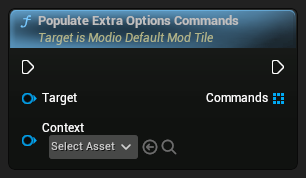

```cpp
void PopulateExtraOptionsCommands(TArray<UObject*> Commands, UObject* Context)
```


##### Notify Hover State Changed

Notifies the component that the hover state has changed

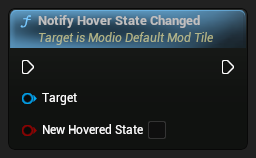

```cpp
void NotifyHoverStateChanged(bool bNewHoveredState)
```


###### Parameters
<RefTable colWidths={['30%', '70%']} stripes="odd">
| | |
|-|-|
|`Target`|`ModioDefaultModTile`|
|`bNewHoveredState`||
</RefTable>


##### Notify Clicked


```cpp
void NotifyClicked()
```


##### Get Selected State Ex

Handles both getting the selected state from an associated list if there is one, and falls back on the local state variable otherwise

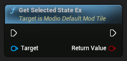

```cpp
bool GetSelectedStateEx()
```


###### Parameters
<RefTable colWidths={['30%', '70%']} stripes="odd">
| | |
|-|-|
|`Target`|`ModioDefaultModTile`|
</RefTable>


##### Get More Options Menu Widget


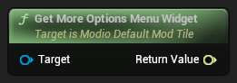

```cpp
TScriptInterface<IModioUICommandMenu> GetMoreOptionsMenuWidget() const
```


###### Variables
<RefTable colWidths={['10%', '10%', '20%']} stripes="odd">
| | | |
|-|-|-|
| `FModioClickableOnClickedMulticast` | `OnClicked` | Passes `this` as ClickContext |
| `bool` | `bSelected` |  |
| `FModioSelectableOnSelectionChangedMulticast` | `OnSelected` | Passes `this` as SelectionContext, `bNewSelectedState` is new selection state |
| `FModioHoverableOnHoverStateChangedMulticast` | `OnHoverStateChanged` | Passes `this` as HoverContext, `bHoveredState` is new hover state |
| `TObjectPtr<UObject>` | `EditorDataSource` |  |
</RefTable>


---

#### ModioDefaultModTileView 

A default implementation of IModioUIModListViewInterface which displays mods as tiles in a grid. This widget inherits from UTileView and forwards calls from IModioUIModListViewInterface and IModioUIObjectListWidget to the existing TileView implementation.

###### Inheritance Hierarchy
-> TileView-> ListView-> ListViewBase-> Widget-> Visual-> Object


###### Variables
<RefTable colWidths={['10%', '10%', '20%']} stripes="odd">
| | | |
|-|-|-|
| `FModioOnObjectSelectionChangedMulticast` | `OnSelectedValueChanged` | Passes the bound value for which selection state has changed as `SelectedValue` |
</RefTable>


---

#### ModioDefaultModalDialogImpl 

Internal helper class for making the default component implementations of Dialog. Default Dialog implementations use a Widget Blueprint deriving from this class to provide a consistent layout, the ability to data-drive button configuration, etc. See `WBP_ModioDefaultModalDialogImpl` for more information.

###### Inheritance Hierarchy
-> ModioUIComponentBase-> CommonActivatableWidget-> CommonUserWidget-> UserWidget-> Widget-> Visual-> Object


###### Variables
<RefTable colWidths={['10%', '10%', '20%']} stripes="odd">
| | | |
|-|-|-|
| `FModioDialogButtonClickedEventMulticast` | `OnDialogButtonClicked` |  |
| `bool` | `bUseGeneratedButtonContent` |  |
| `TArray<FModioDialogButtonInfo>` | `DialogButtonData` |  |
</RefTable>


---

#### ModioDefaultMultiLineEditableTextBox 


###### Inheritance Hierarchy
-> Text Box (Multi-Line)-> TextLayoutWidget-> Widget-> Visual-> Object


###### Variables
<RefTable colWidths={['10%', '10%', '20%']} stripes="odd">
| | | |
|-|-|-|
| `bool` | `IsCaretMovedWhenGainFocus` |  |
| `bool` | `SelectAllTextWhenFocused` |  |
| `bool` | `RevertTextOnEscape` |  |
| `bool` | `ClearKeyboardFocusOnCommit` |  |
| `bool` | `SelectAllTextOnCommit` |  |
| `ETextOverflowPolicy` | `OverflowPolicy` |  |
| `FModioOnTextCommittedMulticast` | `OnModioTextCommitted` | Passes `this` as Context, `Text` as the new text, `CommitMethod` as the method used to commit the text |
| `FModioOnTextChangedMulticast` | `OnModioTextChanged` | Passes `this` as Context, `Text` as the new text |
</RefTable>


---

#### ModioDefaultObjectSelector 

The Default Object Selector is a default implementation of the Object Selector component. This implementation derives from `UListView` and defers to it for displaying a set of objects and allowing the user to select one or more of them based on the widget's configuration. It requires the widgets that represent each entry in the list to implement `IModioUIDataSourceWidget` and `IModioUIClickableWidget` in addition to the `IUserObjectListEntry` interface requirement imposed by the underlying List View.

###### Inheritance Hierarchy
-> ListView-> ListViewBase-> Widget-> Visual-> Object


##### Get Entry Widget from Item


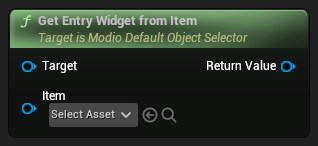

```cpp
UUserWidget* GetEntryWidgetFromItem(UObject* Item) const
```


###### Variables
<RefTable colWidths={['10%', '10%', '20%']} stripes="odd">
| | | |
|-|-|-|
| `TSubclassOf<UWidget> ` | `MultipleSelectionListItemClass` |  |
| `FModioOnObjectSelectionChangedMulticast` | `OnSelectedValueChanged` | Passes the bound value for which selection state has changed as `SelectedValue` |
| `FModioObjectListOnObjectWidgetCreatedMulticast` | `OnWidgetCreated` | Passes the newly created widget as `ObjectWidget`, and the UObject bound to that widget as `Object` |
</RefTable>


---

#### ModioDefaultProgressBar 

The Progress Bar is a default implementation of the Progress component which utilizes UProgressBar for the underlying functionality.

###### Inheritance Hierarchy
-> ProgressBar-> Widget-> Visual-> Object


###### Variables
<RefTable colWidths={['10%', '10%', '20%']} stripes="odd">
| | | |
|-|-|-|
</RefTable>


---

#### ModioDefaultScrollBox 

A widget that allows scrolling of its content. Apart from the default scroll box functionality, this scroll box also supports scrolling by controller/keyboard navigation

###### Inheritance Hierarchy
-> ScrollBox-> PanelWidget-> Widget-> Visual-> Object


##### Update Navigation Data


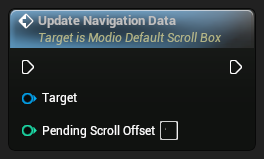

```cpp
void UpdateNavigationData(int32 PendingScrollOffset)
```


###### Parameters
<RefTable colWidths={['30%', '70%']} stripes="odd">
| | |
|-|-|
|`Target`|`ModioDefaultScrollBox`|
|`PendingScrollOffset`|The pending scroll offset (may differ from the actual current scroll offset due to ongoing scrolling animation, if any)|
</RefTable>


##### On User Scrolled Handle


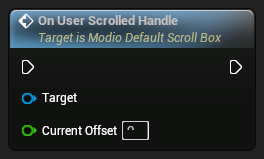

```cpp
void OnUserScrolledHandle(float CurrentOffset)
```


###### Parameters
<RefTable colWidths={['30%', '70%']} stripes="odd">
| | |
|-|-|
|`Target`|`ModioDefaultScrollBox`|
|`CurrentOffset`|The current scroll offset|
</RefTable>


###### Variables
<RefTable colWidths={['10%', '10%', '20%']} stripes="odd">
| | | |
|-|-|-|
| `bool` | `bScrollByNavigationInput` |  |
| `int32` | `NavigationScrollOffsetStep` |  |
| `float` | `NavigationScrollOffsetSpeed` |  |
| `TObjectPtr<UWidgetNavigation>` | `UserDefinedNavigation` |  |
</RefTable>


---

#### ModioDefaultTagWidget 


###### Inheritance Hierarchy
-> ModioUIComponentBase-> CommonActivatableWidget-> CommonUserWidget-> UserWidget-> Widget-> Visual-> Object


##### Get Label Widget


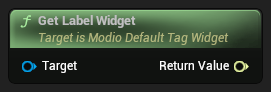

```cpp
TScriptInterface<IModioUIHasTextWidget> GetLabelWidget() const
```


###### Variables
<RefTable colWidths={['10%', '10%', '20%']} stripes="odd">
| | | |
|-|-|-|
</RefTable>


---

#### ModioDefaultTextBlock 

The text block is a default implementation of a Text component that supports displaying a localized piece of text, which can be externally configured.

###### Inheritance Hierarchy
-> Text-> TextLayoutWidget-> Widget-> Visual-> Object


###### Variables
<RefTable colWidths={['10%', '10%', '20%']} stripes="odd">
| | | |
|-|-|-|
| `FLinearColorRefOverride` | `TextColorOverride` |  |
</RefTable>


---

#### ModioDefaultTextButton 

The Text Button is a default implementation of the Button component which implements IModioUIHasTextWidget to allow an associated FText to be set at runtime. The default blueprint implementation visualizes this FText on a static text widget which functions as the button's label.

###### Inheritance Hierarchy
-> ModioButtonWidget-> CommonButtonBase-> CommonUserWidget-> UserWidget-> Widget-> Visual-> Object


##### Get Label Widget

Gets a reference to the widget responsible for displaying the button's label. The default implementation will forward IModioUIHasTextWidget messages to this widget if it is valid

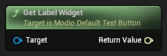

```cpp
TScriptInterface<IModioUIHasTextWidget> GetLabelWidget() const
```


###### Parameters
<RefTable colWidths={['30%', '70%']} stripes="odd">
| | |
|-|-|
|`Target`|`ModioDefaultTextButton`|
</RefTable>


###### Variables
<RefTable colWidths={['10%', '10%', '20%']} stripes="odd">
| | | |
|-|-|-|
| `FText` | `LabelText` | Text to display on this button's label. For runtime changes, use IModioUIHasTextWidget::SetText |
</RefTable>


---

#### ModioDefaultTokenPackTile 


###### Inheritance Hierarchy
-> ModioUIComponentBase-> CommonActivatableWidget-> CommonUserWidget-> UserWidget-> Widget-> Visual-> Object


##### Notify Hover State Changed

Notifies the component that the hover state has changed

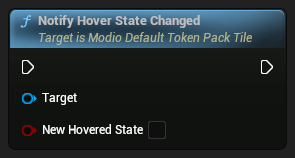

```cpp
void NotifyHoverStateChanged(bool bNewHoveredState)
```


###### Parameters
<RefTable colWidths={['30%', '70%']} stripes="odd">
| | |
|-|-|
|`Target`|`ModioDefaultTokenPackTile`|
|`bNewHoveredState`||
</RefTable>


##### Notify Clicked


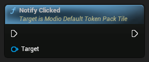

```cpp
void NotifyClicked()
```


##### Get Selected State Ex

Handles both getting the selected state from an associated list if there is one, and falls back on the local state variable otherwise

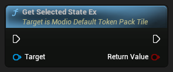

```cpp
bool GetSelectedStateEx()
```


###### Parameters
<RefTable colWidths={['30%', '70%']} stripes="odd">
| | |
|-|-|
|`Target`|`ModioDefaultTokenPackTile`|
</RefTable>


###### Variables
<RefTable colWidths={['10%', '10%', '20%']} stripes="odd">
| | | |
|-|-|-|
| `FModioClickableOnClickedMulticast` | `OnClicked` | Passes `this` as ClickContext |
| `bool` | `bSelected` |  |
| `FModioSelectableOnSelectionChangedMulticast` | `OnSelected` | Passes `this` as SelectionContext, `bNewSelectedState` is new selection state |
| `FModioHoverableOnHoverStateChangedMulticast` | `OnHoverStateChanged` | Passes `this` as HoverContext, `bHoveredState` is new hover state |
| `TObjectPtr<UObject>` | `EditorDataSource` |  |
</RefTable>


---

#### ModioDefaultTokenPackTileView 


###### Inheritance Hierarchy
-> TileView-> ListView-> ListViewBase-> Widget-> Visual-> Object


###### Variables
<RefTable colWidths={['10%', '10%', '20%']} stripes="odd">
| | | |
|-|-|-|
| `FModioOnObjectSelectionChangedMulticast` | `OnSelectedValueChanged` | Passes the bound value for which selection state has changed as `SelectedValue` |
</RefTable>


---

#### ModioDialogButtonUIDetails 


###### Inheritance Hierarchy
-> Interface-> Object


##### Get Dialog Button Info

Queries the implementing object for the dialog button parameters that the object represents

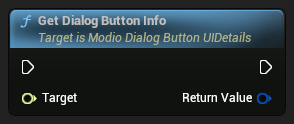

```cpp
FModioDialogButtonInfo GetDialogButtonInfo()
```


###### Parameters
<RefTable colWidths={['30%', '70%']} stripes="odd">
| | |
|-|-|
|`Target`|`ModioDialogButtonUIDetails`|
</RefTable>


###### Returns
DialogButtonInfo associated with the object


---

#### ModioDropdownAnchor 

A widget that anchors a dropdown menu to a button

###### Inheritance Hierarchy
-> MenuAnchor-> ContentWidget-> PanelWidget-> Widget-> Visual-> Object


###### Variables
<RefTable colWidths={['10%', '10%', '20%']} stripes="odd">
| | | |
|-|-|-|
</RefTable>


---

#### ModioEnumEntryUI 

Class wrapping a specific entry from an enum, suitable for use as a data source

###### Inheritance Hierarchy
-> Object


###### Variables
<RefTable colWidths={['10%', '10%', '20%']} stripes="odd">
| | | |
|-|-|-|
| `uint8` | `UnderlyingEnumValue` | Underlying enum value for this entry |
| `FText` | `UnderlyingEnumValueDisplayText` | Display text for this entry |
</RefTable>


---

#### ModioEnumEntryUIDetails 


###### Inheritance Hierarchy
-> Interface-> Object


##### Get Enum Entry Details

Queries the implementing object for it's associated enum value and display text for that value

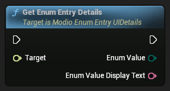

```cpp
void GetEnumEntryDetails(uint8 EnumValue, FText EnumValueDisplayText)
```


###### Parameters
<RefTable colWidths={['30%', '70%']} stripes="odd">
| | |
|-|-|
|`Target`|`ModioEnumEntryUIDetails`|
|`Enum Value`|the raw enum value the object represents|
|`Enum Value Display Text`|the display string to show for this object|
</RefTable>


---

#### ModioEnumSelector 

The Enum Selector is a default implementation of the Enum Selector component. This default implementation uses an internal sub-component as a menu.

###### Inheritance Hierarchy
-> ModioUIComponentBase-> CommonActivatableWidget-> CommonUserWidget-> UserWidget-> Widget-> Visual-> Object


##### Notify Selection Changed


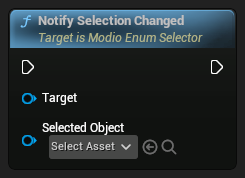

```cpp
void NotifySelectionChanged(UObject* SelectedObject)
```


##### Get Selector Menu Widget

Provides a reference to the internal widget that provides a menu users can select an enum value from. The default implementation will forward IModioUIObjectSelector messages to this widget if it is valid

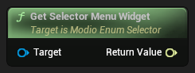

```cpp
TScriptInterface<IModioUIObjectSelector> GetSelectorMenuWidget() const
```


###### Parameters
<RefTable colWidths={['30%', '70%']} stripes="odd">
| | |
|-|-|
|`Target`|`ModioEnumSelector`|
</RefTable>


##### Get Menu Toggle Clickable Widget

Provides a reference to the internal widget that will toggle the display of the menu to allow users to make a selection


```cpp
TScriptInterface<IModioUIClickableWidget> GetMenuToggleClickableWidget() const
```


###### Parameters
<RefTable colWidths={['30%', '70%']} stripes="odd">
| | |
|-|-|
|`Target`|`ModioEnumSelector`|
</RefTable>


###### Variables
<RefTable colWidths={['10%', '10%', '20%']} stripes="odd">
| | | |
|-|-|-|
| `FModioOnObjectSelectionChangedMulticast` | `OnSelectionChanged` | Passes `this` as SelectedValue |
</RefTable>


---

#### ModioEnumSelectorEntry 

the Enum Selector Entry is a default implementation of the Enum Selector Entry component. This default implementation uses a subwidget for a text label for the enum value, a clickable subwidget to allow users to make selections, and a selectable subwidget to visually represent the selection state of the associated enum value in the selector.

###### Inheritance Hierarchy
-> ModioUIComponentBase-> CommonActivatableWidget-> CommonUserWidget-> UserWidget-> Widget-> Visual-> Object


##### Notify Selection Changed

Notifies the component that the selection state has changed

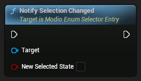

```cpp
void NotifySelectionChanged(bool bNewSelectedState)
```


###### Parameters
<RefTable colWidths={['30%', '70%']} stripes="odd">
| | |
|-|-|
|`Target`|`ModioEnumSelectorEntry`|
|`bNewSelectedState`|The new selection state|
</RefTable>


##### Notify Clicked

Notifies the component that the clickable widget has been clicked

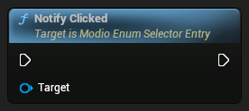

```cpp
void NotifyClicked()
```


###### Parameters
<RefTable colWidths={['30%', '70%']} stripes="odd">
| | |
|-|-|
|`Target`|`ModioEnumSelectorEntry`|
</RefTable>


##### Get Selectable Widget

Provides a reference to the internal widget that will visualize the current selection state of the bound enum value


```cpp
TScriptInterface<IModioUISelectableWidget> GetSelectableWidget() const
```


###### Parameters
<RefTable colWidths={['30%', '70%']} stripes="odd">
| | |
|-|-|
|`Target`|`ModioEnumSelectorEntry`|
</RefTable>


###### Returns
The selectable widget


##### Get Label Widget

Provides a reference to the internal widget that is used for displaying the display string for the bound enum value


```cpp
TScriptInterface<IModioUIHasTextWidget> GetLabelWidget() const
```


###### Parameters
<RefTable colWidths={['30%', '70%']} stripes="odd">
| | |
|-|-|
|`Target`|`ModioEnumSelectorEntry`|
</RefTable>


###### Returns
The label widget


##### Get Clickable Widget

Provides a reference to the internal widget that will receive click/enter events so that the enclosing selector can change selection based on user input

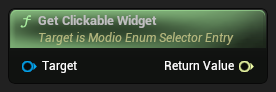

```cpp
TScriptInterface<IModioUIClickableWidget> GetClickableWidget() const
```


###### Parameters
<RefTable colWidths={['30%', '70%']} stripes="odd">
| | |
|-|-|
|`Target`|`ModioEnumSelectorEntry`|
</RefTable>


###### Returns
The clickable widget


###### Variables
<RefTable colWidths={['10%', '10%', '20%']} stripes="odd">
| | | |
|-|-|-|
| `FModioClickableOnClickedMulticast` | `OnClicked` | Passes `this` as ClickContext |
| `FModioSelectableOnSelectionChangedMulticast` | `OnSelectionChanged` | Passes `this` as SelectionContext, `bNewSelectedState` is new selection state |
</RefTable>


---

#### ModioEnumSelectorMenu 

The Enum Selector is a default implementation of the Enum Selector component. This default implementation uses an internal sub-component to display and manage selection of individual enum values.

###### Inheritance Hierarchy
-> ModioUIComponentBase-> CommonActivatableWidget-> CommonUserWidget-> UserWidget-> Widget-> Visual-> Object


##### Notify Selection Changed

Called when the selection changes

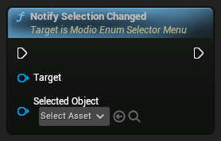

```cpp
void NotifySelectionChanged(UObject* SelectedObject)
```


###### Parameters
<RefTable colWidths={['30%', '70%']} stripes="odd">
| | |
|-|-|
|`Target`|`ModioEnumSelectorMenu`|
|`SelectedObject`|The object that was selected|
</RefTable>


##### Get Selector Widget

Provides a reference to the internal widget that actually displays the enum values and tracks the user's selection. The default implementation will forward IModioUIObjectSelector messages to this widget if it is valid


```cpp
TScriptInterface<IModioUIObjectSelector> GetSelectorWidget() const
```


###### Parameters
<RefTable colWidths={['30%', '70%']} stripes="odd">
| | |
|-|-|
|`Target`|`ModioEnumSelectorMenu`|
</RefTable>


###### Returns
The selector widget


###### Variables
<RefTable colWidths={['10%', '10%', '20%']} stripes="odd">
| | | |
|-|-|-|
| `FModioOnObjectSelectionChangedMulticast` | `OnSelectionChanged` | Passes `UObject*` as SelectedValue |
</RefTable>


---

#### ModioFeatureVisibilityWidget 

A widget that manages the visibility of its children based on the enabled state of a mod.io feature

###### Inheritance Hierarchy
-> ContentWidget-> PanelWidget-> Widget-> Visual-> Object


###### Variables
<RefTable colWidths={['10%', '10%', '20%']} stripes="odd">
| | | |
|-|-|-|
| `EModioUIFeatureFlags` | `FeatureToCheck` |  |
</RefTable>


---

#### ModioFeaturedCategoryParamsUI 

Wrapper around FModioCommonFeaturedCategoryParams for data binding to UListView etc

###### Inheritance Hierarchy
-> Object


---

#### ModioFilterCounterButton 


###### Inheritance Hierarchy
-> ModioDefaultTextButton-> ModioButtonWidget-> CommonButtonBase-> CommonUserWidget-> UserWidget-> Widget-> Visual-> Object


##### Get Filter Counter Widget


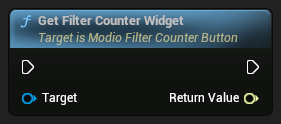

```cpp
TScriptInterface<IModioUIDataSourceWidget> GetFilterCounterWidget()
```


###### Variables
<RefTable colWidths={['10%', '10%', '20%']} stripes="odd">
| | | |
|-|-|-|
</RefTable>


---

#### ModioFilterPanel 


###### Inheritance Hierarchy
-> ModioUIComponentBase-> CommonActivatableWidget-> CommonUserWidget-> UserWidget-> Widget-> Visual-> Object


##### Get Tag Selector Widget


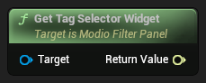

```cpp
TScriptInterface<IModioUIModTagSelector> GetTagSelectorWidget() const
```


##### Get Selected Tags


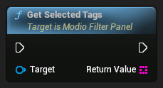

```cpp
TArray<FString> GetSelectedTags()
```


##### Get Clear Button Widget


```cpp
TScriptInterface<IModioUIClickableWidget> GetClearButtonWidget() const
```


##### Get Background Button Widget


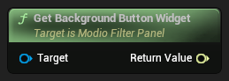

```cpp
TScriptInterface<IModioUIClickableWidget> GetBackgroundButtonWidget() const
```


##### Clear Selected Tags


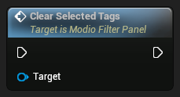

```cpp
void ClearSelectedTags()
```


##### Add Tag Selection Changed Handler


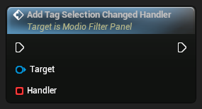

```cpp
void AddTagSelectionChangedHandler(FModioOnTagSelectionChanged Handler)
```


###### Variables
<RefTable colWidths={['10%', '10%', '20%']} stripes="odd">
| | | |
|-|-|-|
</RefTable>


---

#### ModioFilterParamsUI 

Wrapper around FModioFilterParams when consumer needs UObject-representable data (e.g. for UMG as a list item or data source)

###### Inheritance Hierarchy
-> Object


###### Variables
<RefTable colWidths={['10%', '10%', '20%']} stripes="odd">
| | | |
|-|-|-|
| `FText` | `FilterName` | Display name for this set of filter parameters. |
| `FModioFilterParams` | `Underlying` | Underlying filter parameters |
</RefTable>


---

#### ModioFocusableWidget 

Interface indicating the implementing widget (or it's children) can receive focus

###### Inheritance Hierarchy
-> Interface-> Object


##### Remove Focus Path Changed Handler

Unregisters a delegate from receiving callbacks when the focus path changes

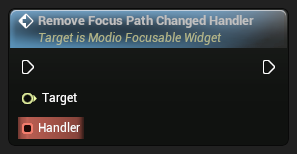

```cpp
void RemoveFocusPathChangedHandler(FModioOnFocusPathChanged Handler)
```


###### Parameters
<RefTable colWidths={['30%', '70%']} stripes="odd">
| | |
|-|-|
|`Target`|`ModioFocusableWidget`|
|`Handler`|Delegate to remove from focus path change|
</RefTable>


##### Get Widget to Focus

Queries the implementing object for the widget that should receive focus

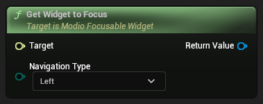

```cpp
UWidget* GetWidgetToFocus(EUINavigation NavigationType) const
```


###### Parameters
<RefTable colWidths={['30%', '70%']} stripes="odd">
| | |
|-|-|
|`Target`|`ModioFocusableWidget`|
|`NavigationType`|Navigation type to focus, if applicable|
</RefTable>


###### Returns
Widget to focus


##### Add Focus Path Changed Handler

Registers a delegate to receive callbacks when the focus path changes The delegate is assumed to be invoked both when the implementing widget gains focus and when children of the widget gain focus

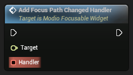

```cpp
void AddFocusPathChangedHandler(FModioOnFocusPathChanged Handler)
```


###### Parameters
<RefTable colWidths={['30%', '70%']} stripes="odd">
| | |
|-|-|
|`Target`|`ModioFocusableWidget`|
|`Handler`|Delegate to invoke on focus path change|
</RefTable>


---

#### ModioGalleryImageUI 

Wrapper around FModioImageWrapper when consumer needs UObject-representable data (e.g. for UMG as a list item or data source)

###### Inheritance Hierarchy
-> Object


###### Variables
<RefTable colWidths={['10%', '10%', '20%']} stripes="odd">
| | | |
|-|-|-|
| `FModioImageWrapper` | `UnderlyingImage` | Underlying image data |
| `int32` | `UnderlyingIndex` | Index of this image in the gallery |
</RefTable>


---

#### ModioGalleryImageUIDetails 


###### Inheritance Hierarchy
-> Interface-> Object


##### Get Index

Queries the implementing object for the image index that the object represents

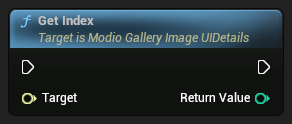

```cpp
int32 GetIndex()
```


###### Parameters
<RefTable colWidths={['30%', '70%']} stripes="odd">
| | |
|-|-|
|`Target`|`ModioGalleryImageUIDetails`|
</RefTable>


###### Returns
Index associated with the object


##### Get Image

Queries the implementing object for the image wrapper that the object represents


```cpp
FModioImageWrapper GetImage()
```


###### Parameters
<RefTable colWidths={['30%', '70%']} stripes="odd">
| | |
|-|-|
|`Target`|`ModioGalleryImageUIDetails`|
</RefTable>


###### Returns
FModioImageWrapper associated with the object


---

#### ModioGalleryListEntry 


###### Inheritance Hierarchy
-> ModioUIComponentBase-> CommonActivatableWidget-> CommonUserWidget-> UserWidget-> Widget-> Visual-> Object


###### Variables
<RefTable colWidths={['10%', '10%', '20%']} stripes="odd">
| | | |
|-|-|-|
</RefTable>


---

#### ModioImageGallery 


###### Inheritance Hierarchy
-> ModioUIComponentBase-> CommonActivatableWidget-> CommonUserWidget-> UserWidget-> Widget-> Visual-> Object


##### Refresh


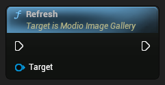

```cpp
void Refresh()
```


##### Get Increment Selection Button Widget


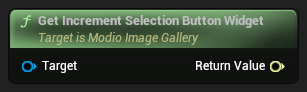

```cpp
TScriptInterface<IModioUIClickableWidget> GetIncrementSelectionButtonWidget() const
```


###### Parameters
<RefTable colWidths={['30%', '70%']} stripes="odd">
| | |
|-|-|
|`Target`|`ModioImageGallery`|
</RefTable>


###### Returns
The widget which implements IModioUIClickableWidget


##### Get Image Widget


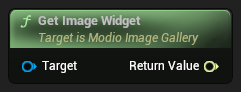

```cpp
TScriptInterface<IModioUIImageDisplayWidget> GetImageWidget() const
```


###### Parameters
<RefTable colWidths={['30%', '70%']} stripes="odd">
| | |
|-|-|
|`Target`|`ModioImageGallery`|
</RefTable>


###### Returns
The image widget which implements IModioUIImageDisplayWidget


##### Get Image Selector Widget


```cpp
TScriptInterface<IModioUIObjectSelector> GetImageSelectorWidget() const
```


###### Parameters
<RefTable colWidths={['30%', '70%']} stripes="odd">
| | |
|-|-|
|`Target`|`ModioImageGallery`|
</RefTable>


###### Returns
The widget which implements IModioUIObjectSelector


##### Get Decrement Selection Button Widget


```cpp
TScriptInterface<IModioUIClickableWidget> GetDecrementSelectionButtonWidget() const
```


###### Parameters
<RefTable colWidths={['30%', '70%']} stripes="odd">
| | |
|-|-|
|`Target`|`ModioImageGallery`|
</RefTable>


###### Returns
The widget which implements IModioUIClickableWidget


###### Variables
<RefTable colWidths={['10%', '10%', '20%']} stripes="odd">
| | | |
|-|-|-|
| `int64` | `ModIdEditor` |  |
| `FModioModInfo` | `BoundModInfo` |  |
| `bool` | `bUseLogoOnly` |  |
</RefTable>


---

#### ModioModBrowser 


###### Inheritance Hierarchy
-> ModioUIComponentBase-> CommonActivatableWidget-> CommonUserWidget-> UserWidget-> Widget-> Visual-> Object


##### Search Subscriptions and Installs with Stored Params


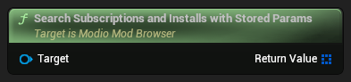

```cpp
TArray<FModioModInfo> SearchSubscriptionsAndInstallsWithStoredParams() const
```


##### Search Purchases with Stored Params


```cpp
TArray<FModioModInfo> SearchPurchasesWithStoredParams() const
```


##### Search Library with Stored Params


```cpp
TArray<FModioModInfo> SearchLibraryWithStoredParams() const
```


##### Initialize Tag Data


```cpp
void InitializeTagData(UObject* InTagData)
```


##### Initialize Library Tag Data


```cpp
void InitializeLibraryTagData(UObject* InTagData)
```


##### Increment Preset Filter Selection


```cpp
void IncrementPresetFilterSelection()
```


##### Get Wallet Button Widget


```cpp
TScriptInterface<IModioUIClickableWidget> GetWalletButtonWidget() const
```


##### Get View Description Text Widget


```cpp
TScriptInterface<IModioUIHasTextWidget> GetViewDescriptionTextWidget() const
```


##### Get View Description Image Widget


```cpp
TScriptInterface<IModioUIImageDisplayWidget> GetViewDescriptionImageWidget() const
```


##### Get Tab Right Button Widget


```cpp
TScriptInterface<IModioUIClickableWidget> GetTabRightButtonWidget() const
```


##### Get Tab Left Button Widget


```cpp
TScriptInterface<IModioUIClickableWidget> GetTabLeftButtonWidget() const
```


##### Get Search Text Widget


```cpp
TScriptInterface<IModioUIHasTextWidget> GetSearchTextWidget() const
```


##### Get Search Editable Text Box Widget


```cpp
TScriptInterface<IModioUIStringInputWidget> GetSearchEditableTextBoxWidget() const
```


##### Get Search Button Widget


```cpp
TScriptInterface<IModioUIClickableWidget> GetSearchButtonWidget() const
```


##### Get Preset Filter Selector Widget


```cpp
TScriptInterface<IModioUIObjectSelector> GetPresetFilterSelectorWidget() const
```


##### Get Mod Tile View Widget


```cpp
TScriptInterface<IModioUIModListViewInterface> GetModTileViewWidget() const
```


##### Get Library View Button Widget


```cpp
TScriptInterface<IModioUIClickableWidget> GetLibraryViewButtonWidget() const
```


##### Get Filter Button Widget


```cpp
TScriptInterface<IModioUIClickableWidget> GetFilterButtonWidget() const
```


##### Get Close Browser Button Widget


```cpp
TScriptInterface<IModioUIClickableWidget> GetCloseBrowserButtonWidget() const
```


##### Get Clear Search Button Widget


```cpp
TScriptInterface<IModioUIClickableWidget> GetClearSearchButtonWidget() const
```


##### Decrement Preset Filter Selection


```cpp
void DecrementPresetFilterSelection()
```


###### Variables
<RefTable colWidths={['10%', '10%', '20%']} stripes="odd">
| | | |
|-|-|-|
| `EModioModBrowserState` | `CurrentView` |  |
| `FString` | `StoredSearchString` |  |
| `TObjectPtr<UObject>` | `StoredTagData` |  |
| `TObjectPtr<UObject>` | `StoredLibraryTagData` |  |
</RefTable>


---

#### ModioModBrowserDialogButtonInfoUI 

Wrapper around FModioDialogButtonInfo for data binding to UListView etc

###### Inheritance Hierarchy
-> Object


---

#### ModioModCollectionEntryUI 

Wrapper around FModioModCollectionEntry when consumer needs UObject-representable data (e.g. for UMG as a list item or data source)

###### Inheritance Hierarchy
-> Object


###### Variables
<RefTable colWidths={['10%', '10%', '20%']} stripes="odd">
| | | |
|-|-|-|
| `FModioModCollectionEntry` | `Underlying` | Underlying mod collection entry |
| `bool` | `bCachedSubscriptionStatus` | Cached subscription status for this mod. This can be used to avoid unnecessary API calls |
</RefTable>


---

#### ModioModDependencyUI 

Wrapper around FModioModDependency when consumer needs UObject-representable data (e.g. for UMG as a list item or data source)

###### Inheritance Hierarchy
-> Object


---

#### ModioModDependencyUIDetails 


###### Inheritance Hierarchy
-> Interface-> Object


##### Get Mod ID


```cpp
FModioModID GetModID()
```


###### Parameters
<RefTable colWidths={['30%', '70%']} stripes="odd">
| | |
|-|-|
|`Target`|`ModioModDependencyUIDetails`|
</RefTable>


###### Returns
Mod ID for the associated mod


##### Get Mod Dependency


```cpp
FModioModDependency GetModDependency()
```


###### Parameters
<RefTable colWidths={['30%', '70%']} stripes="odd">
| | |
|-|-|
|`Target`|`ModioModDependencyUIDetails`|
</RefTable>


###### Returns
ModioModDependency for the associated mod


---

#### ModioModDetailsDialog 


###### Inheritance Hierarchy
-> ModioUIComponentBase-> CommonActivatableWidget-> CommonUserWidget-> UserWidget-> Widget-> Visual-> Object


##### Populate Extra Options Commands


```cpp
void PopulateExtraOptionsCommands(TArray<UObject*> Commands, UObject* Context)
```


##### Is User Subscribed


```cpp
bool IsUserSubscribed()
```


###### Parameters
<RefTable colWidths={['30%', '70%']} stripes="odd">
| | |
|-|-|
|`Target`|`ModioModDetailsDialog`|
</RefTable>


##### Is Mod Purchased


```cpp
bool IsModPurchased()
```


##### Get Wallet Button Widget


```cpp
TScriptInterface<IModioUIClickableWidget> GetWalletButtonWidget() const
```


##### Get Tag Display Widget


```cpp
TScriptInterface<IModioUIDataSourceWidget> GetTagDisplayWidget() const
```


##### Get Subscribe Button Widget


```cpp
TScriptInterface<IModioUIClickableWidget> GetSubscribeButtonWidget() const
```


##### Get Rate Up Button Widget


```cpp
TScriptInterface<IModioUIClickableWidget> GetRateUpButtonWidget() const
```


##### Get Rate Down Button Widget


```cpp
TScriptInterface<IModioUIClickableWidget> GetRateDownButtonWidget() const
```


##### Get Purchase Button Widget


```cpp
TScriptInterface<IModioUIClickableWidget> GetPurchaseButtonWidget() const
```


##### Get More Options Menu Widget


```cpp
TScriptInterface<IModioUICommandMenu> GetMoreOptionsMenuWidget() const
```


##### Get Mod Summary Short Text Widget


```cpp
TScriptInterface<IModioUIHasTextWidget> GetModSummaryShortTextWidget() const
```


##### Get Mod Status Widget


```cpp
TScriptInterface<IModioUIDataSourceWidget> GetModStatusWidget() const
```


##### Get Mod Properties Widget


```cpp
TScriptInterface<IModioUIDataSourceWidget> GetModPropertiesWidget() const
```


##### Get Mod Name Text Widget


```cpp
TScriptInterface<IModioUIHasTextWidget> GetModNameTextWidget() const
```


##### Get Mod Image Gallery Widget


```cpp
TScriptInterface<IModioUIMediaDownloadCompletedReceiver> GetModImageGalleryWidget() const
```


##### Get Mod Dependencies Button Widget


```cpp
TScriptInterface<IModioUIClickableWidget> GetModDependenciesButtonWidget() const
```


##### Get Mod Author Display Widget


```cpp
TScriptInterface<IModioUIDataSourceWidget> GetModAuthorDisplayWidget() const
```


##### Get Expand Description Button Widget


```cpp
TScriptInterface<IModioUIClickableWidget> GetExpandDescriptionButtonWidget() const
```


##### Get Close Dialog Button Widget


```cpp
TScriptInterface<IModioUIClickableWidget> GetCloseDialogButtonWidget() const
```


###### Variables
<RefTable colWidths={['10%', '10%', '20%']} stripes="odd">
| | | |
|-|-|-|
| `FText` | `ExpandLabelText` |  |
| `TObjectPtr<UObject>` | `EditorDataSource` |  |
| `FModioModInfo` | `BoundModInfo` |  |
| `bool` | `bHasFullDescription` |  |
</RefTable>


---

#### ModioModEnabledStatusWidget 

A widget that displays the enabled status of a mod

###### Inheritance Hierarchy
-> ModioUIComponentBase-> CommonActivatableWidget-> CommonUserWidget-> UserWidget-> Widget-> Visual-> Object


###### Variables
<RefTable colWidths={['10%', '10%', '20%']} stripes="odd">
| | | |
|-|-|-|
</RefTable>


---

#### ModioModEnabledToggleWidget 

A widget that allows the user to toggle the enabled status of a mod

###### Inheritance Hierarchy
-> ModioUIComponentBase-> CommonActivatableWidget-> CommonUserWidget-> UserWidget-> Widget-> Visual-> Object


###### Variables
<RefTable colWidths={['10%', '10%', '20%']} stripes="odd">
| | | |
|-|-|-|
</RefTable>


---

#### ModioModFilterUIDetails 


###### Inheritance Hierarchy
-> Interface-> Object


##### Get Filter Params

Queries the implementing object for the mod filter parameters that the object represents


```cpp
FModioFilterParams GetFilterParams()
```


###### Parameters
<RefTable colWidths={['30%', '70%']} stripes="odd">
| | |
|-|-|
|`Target`|`ModioModFilterUIDetails`|
</RefTable>


###### Returns
ModFilterParams associated with the object


##### Get Filter Name

Queries the implementing object for a name that may be associated with the filter


```cpp
bool GetFilterName(FText Name)
```


###### Parameters
<RefTable colWidths={['30%', '70%']} stripes="odd">
| | |
|-|-|
|`Target`|`ModioModFilterUIDetails`|
|`Name`|The name for the filter if there was one present|
</RefTable>


###### Returns
true if the implementing object provides a name for the filter


---

#### ModioModInfoUI 

Wrapper around FModioModInfo when consumer needs UObject-representable data (e.g. for UMG as a list item or data source)

###### Inheritance Hierarchy
-> Object


---

#### ModioModInfoUIDetails 


###### Inheritance Hierarchy
-> Interface-> Object


##### Get Mod ID


```cpp
FModioModID GetModID()
```


###### Parameters
<RefTable colWidths={['30%', '70%']} stripes="odd">
| | |
|-|-|
|`Target`|`ModioModInfoUIDetails`|
</RefTable>


###### Returns
Mod ID for the associated mod


##### Get Full Mod Info


```cpp
FModioModInfo GetFullModInfo()
```


###### Parameters
<RefTable colWidths={['30%', '70%']} stripes="odd">
| | |
|-|-|
|`Target`|`ModioModInfoUIDetails`|
</RefTable>


###### Returns
ModInfo for the associated mod


---

#### ModioModInstallationStatusWidget 

A widget that displays the installation status of a mod

###### Inheritance Hierarchy
-> ModioUIComponentBase-> CommonActivatableWidget-> CommonUserWidget-> UserWidget-> Widget-> Visual-> Object


##### Query Progress Value for State

Helper function to query the progress of a state-specific operation for the bound mod


```cpp
float QueryProgressValueForState(EModioModProgressState ProgressState) const
```


###### Parameters
<RefTable colWidths={['30%', '70%']} stripes="odd">
| | |
|-|-|
|`Target`|`ModioModInstallationStatusWidget`|
|`ProgressState`|The state for which to query progress|
</RefTable>


###### Returns
A float between 0 and 1 measuring progress, where 0 represents none and 1 is complete.  Returns 0 if the specified state is invalid or not in progress for this mod


###### Variables
<RefTable colWidths={['10%', '10%', '20%']} stripes="odd">
| | | |
|-|-|-|
| `FModioModInfo` | `BoundModInfo` | Full information for the mod this widget represents, based on its data source |
| `FOnModInstallationStatusChanged` | `OnInstallationStatusChanged` | Broadcasts when the mod's installation status is updated |
| `EModioModInstallationStatus` | `CurrentInstallationStatus` |  |
</RefTable>


---

#### ModioModManagementEventUI 

Wrapper around FModioModManagementEvent when consumer needs UObject-representable data (e.g. for UMG as a list item or data source)

###### Inheritance Hierarchy
-> Object


---

#### ModioModProgressInfoUI 

Wrapper around FModioModProgressInfo when consumer needs UObject-representable data (e.g. for UMG as a list item or data source)

###### Inheritance Hierarchy
-> Object


---

#### ModioModPropCollectionVisualizer 

A widget that manages the visualization of a collection of mod properties

###### Inheritance Hierarchy
-> ModioUIComponentBase-> CommonActivatableWidget-> CommonUserWidget-> UserWidget-> Widget-> Visual-> Object


##### Get Mod Property Visualizer Widgets


```cpp
TArray<TScriptInterface<IModioUIDataSourceWidget> > GetModPropertyVisualizerWidgets()
```


###### Parameters
<RefTable colWidths={['30%', '70%']} stripes="odd">
| | |
|-|-|
|`Target`|`ModioModPropCollectionVisualizer`|
</RefTable>


###### Returns
Array of widgets implementing UModioUIDataSourceWidget that will visualize individual properties


###### Variables
<RefTable colWidths={['10%', '10%', '20%']} stripes="odd">
| | | |
|-|-|-|
</RefTable>


---

#### ModioModRatingDisplay 

A widget that displays the rating of a mod

###### Inheritance Hierarchy
-> ModioUIComponentBase-> CommonActivatableWidget-> CommonUserWidget-> UserWidget-> Widget-> Visual-> Object


##### Get Rating Percentage Label Widget

Get the label widget that displays the rating percentage


```cpp
TScriptInterface<IModioUIHasTextWidget> GetRatingPercentageLabelWidget() const
```


###### Parameters
<RefTable colWidths={['30%', '70%']} stripes="odd">
| | |
|-|-|
|`Target`|`ModioModRatingDisplay`|
</RefTable>


###### Returns
The label widget


##### Get Rating Description Label Widget

Get the rating description label widget


```cpp
TScriptInterface<IModioUIHasTextWidget> GetRatingDescriptionLabelWidget() const
```


###### Parameters
<RefTable colWidths={['30%', '70%']} stripes="odd">
| | |
|-|-|
|`Target`|`ModioModRatingDisplay`|
</RefTable>


###### Returns
The label widget


###### Variables
<RefTable colWidths={['10%', '10%', '20%']} stripes="odd">
| | | |
|-|-|-|
| `TObjectPtr<UObject>` | `EditorDataSource` | The data source to use for editor preview |
</RefTable>


---

#### ModioModSubscriptionStatusWidget 

A widget that displays the subscription status of a mod

###### Inheritance Hierarchy
-> ModioUIComponentBase-> CommonActivatableWidget-> CommonUserWidget-> UserWidget-> Widget-> Visual-> Object


###### Variables
<RefTable colWidths={['10%', '10%', '20%']} stripes="odd">
| | | |
|-|-|-|
</RefTable>


---

#### ModioModTagCategoryUIDetails 


###### Inheritance Hierarchy
-> Interface-> Object


##### Get Selected Tags

Retrieves an array of strings representing tags which are selected for the associated tag category


```cpp
TArray<FString> GetSelectedTags()
```


###### Parameters
<RefTable colWidths={['30%', '70%']} stripes="odd">
| | |
|-|-|
|`Target`|`ModioModTagCategoryUIDetails`|
</RefTable>


##### Get Raw Category Name

Queries the implementing object for the raw string name for the tag category that the object represents


```cpp
FString GetRawCategoryName()
```


###### Parameters
<RefTable colWidths={['30%', '70%']} stripes="odd">
| | |
|-|-|
|`Target`|`ModioModTagCategoryUIDetails`|
</RefTable>


###### Returns
raw string name for the tag category


##### Get Localized Category Name

Queries the implementing object for the localized name for the tag category that the object represents


```cpp
FText GetLocalizedCategoryName()
```


###### Parameters
<RefTable colWidths={['30%', '70%']} stripes="odd">
| | |
|-|-|
|`Target`|`ModioModTagCategoryUIDetails`|
</RefTable>


###### Returns
localized name for the tag category


##### Get Is Category Locked

Queries the implementing object if the associated tag category is flagged as locked


```cpp
bool GetIsCategoryLocked()
```


###### Parameters
<RefTable colWidths={['30%', '70%']} stripes="odd">
| | |
|-|-|
|`Target`|`ModioModTagCategoryUIDetails`|
</RefTable>


###### Returns
True if only editable by admins


##### Get Is Category Hidden

Queries the implementing object if the associated tag category is flagged as hidden


```cpp
bool GetIsCategoryHidden()
```


###### Parameters
<RefTable colWidths={['30%', '70%']} stripes="odd">
| | |
|-|-|
|`Target`|`ModioModTagCategoryUIDetails`|
</RefTable>


###### Returns
True if only visible by admins


##### Get Category Tags

Gets the bindable tag objects for this category


```cpp
TArray<TScriptInterface<IModioModTagUIDetails> > GetCategoryTags()
```


###### Parameters
<RefTable colWidths={['30%', '70%']} stripes="odd">
| | |
|-|-|
|`Target`|`ModioModTagCategoryUIDetails`|
</RefTable>


##### Get Allow Multiple Selection

Queries the implementing object for whether the associated tag category allows multiple selection


```cpp
bool GetAllowMultipleSelection()
```


###### Parameters
<RefTable colWidths={['30%', '70%']} stripes="odd">
| | |
|-|-|
|`Target`|`ModioModTagCategoryUIDetails`|
</RefTable>


###### Returns
True if the category permits multiple values to be selected


---

#### ModioModTagDisplay 

A widget that displays the tags of a mod (e.g. "Action", "Adventure", "Singleplayer")

###### Inheritance Hierarchy
-> ModioUIComponentBase-> CommonActivatableWidget-> CommonUserWidget-> UserWidget-> Widget-> Visual-> Object


##### Get Tag Container Widget

Get the widget that will contain the tags


```cpp
TScriptInterface<IModioUIObjectListWidget> GetTagContainerWidget() const
```


###### Parameters
<RefTable colWidths={['30%', '70%']} stripes="odd">
| | |
|-|-|
|`Target`|`ModioModTagDisplay`|
</RefTable>


###### Returns
The widget


###### Variables
<RefTable colWidths={['10%', '10%', '20%']} stripes="odd">
| | | |
|-|-|-|
| `TObjectPtr<UObject>` | `EditorDataSource` | The data source to use for editor preview |
</RefTable>


---

#### ModioModTagInfoUI 

Wrapper around a FModioModTagInfo when consumer needs UObject-representable data (e.g. for UMG as a list item or data source)

###### Inheritance Hierarchy
-> Object


###### Variables
<RefTable colWidths={['10%', '10%', '20%']} stripes="odd">
| | | |
|-|-|-|
| `FModioModTagInfo` | `Underlying` | Underlying tag info |
| `FText` | `LocalizedCategoryName` | Localized tag category string |
| `TArray<UModioModTagUI*>` | `BindableTags` | Transient set of bindable tag objects for use in the UI |
</RefTable>


---

#### ModioModTagOptionsUI 

Wrapper around a FModioModTagOptions because UMG widgets expect UObjects for data sources or list items

###### Inheritance Hierarchy
-> Object


###### Variables
<RefTable colWidths={['10%', '10%', '20%']} stripes="odd">
| | | |
|-|-|-|
| `FModioModTagOptions` | `Underlying` | Underlying tag options |
| `TArray<UModioModTagInfoUI*>` | `BindableTagCategories` | Transient set of bindable tag categories for use in the UI |
</RefTable>


---

#### ModioModTagOptionsUIDetails 


###### Inheritance Hierarchy
-> Interface-> Object


##### Get Selected Tags

Retrieves an array of strings representing tags which are selected across all categories


```cpp
TArray<FString> GetSelectedTags()
```


###### Parameters
<RefTable colWidths={['30%', '70%']} stripes="odd">
| | |
|-|-|
|`Target`|`ModioModTagOptionsUIDetails`|
</RefTable>


##### Get Categories

Retrieves an array of objects representing the tag categories this game has configured


```cpp
TArray<TScriptInterface<IModioModTagCategoryUIDetails> > GetCategories()
```


###### Parameters
<RefTable colWidths={['30%', '70%']} stripes="odd">
| | |
|-|-|
|`Target`|`ModioModTagOptionsUIDetails`|
</RefTable>


##### Clear Selected Tags

Clears all selected tags across all categories


```cpp
void ClearSelectedTags()
```


###### Parameters
<RefTable colWidths={['30%', '70%']} stripes="odd">
| | |
|-|-|
|`Target`|`ModioModTagOptionsUIDetails`|
</RefTable>


---

#### ModioModTagSelector 

A widget that allows the user to select tags for a mod

###### Inheritance Hierarchy
-> ModioUIComponentBase-> CommonActivatableWidget-> CommonUserWidget-> UserWidget-> Widget-> Visual-> Object


##### Get Selector Menu Widget

Provides a reference to the internal widget that displays the tag categories and values and tracks the user's selection


```cpp
TScriptInterface<IModioUIModTagSelector> GetSelectorMenuWidget() const
```


###### Parameters
<RefTable colWidths={['30%', '70%']} stripes="odd">
| | |
|-|-|
|`Target`|`ModioModTagSelector`|
</RefTable>


###### Returns
The widget that displays the tag categories and values


##### Get Menu Toggle Clickable Widget

Provides a reference to the internal widget that can be clicked to toggle the display of the selector menu


```cpp
TScriptInterface<IModioUIClickableWidget> GetMenuToggleClickableWidget() const
```


###### Parameters
<RefTable colWidths={['30%', '70%']} stripes="odd">
| | |
|-|-|
|`Target`|`ModioModTagSelector`|
</RefTable>


###### Returns
The widget that can be clicked to toggle the display of the selector menu


###### Variables
<RefTable colWidths={['10%', '10%', '20%']} stripes="odd">
| | | |
|-|-|-|
</RefTable>


---

#### ModioModTagSelectorCategory 

A widget that displays a category of tags that can be selected

###### Inheritance Hierarchy
-> ModioUIComponentBase-> CommonActivatableWidget-> CommonUserWidget-> UserWidget-> Widget-> Visual-> Object


##### Get Tag Category Label

Get the label widget that displays the category name


```cpp
TScriptInterface<IModioUIHasTextWidget> GetTagCategoryLabel() const
```


###### Parameters
<RefTable colWidths={['30%', '70%']} stripes="odd">
| | |
|-|-|
|`Target`|`ModioModTagSelectorCategory`|
</RefTable>


###### Returns
The label widget


##### Get Category Tag List Widget

Provides a reference to the internal widget that actually displays the tags for this category


```cpp
TScriptInterface<IModioUIObjectSelector> GetCategoryTagListWidget() const
```


###### Parameters
<RefTable colWidths={['30%', '70%']} stripes="odd">
| | |
|-|-|
|`Target`|`ModioModTagSelectorCategory`|
</RefTable>


###### Returns
The widget that displays the tags


###### Variables
<RefTable colWidths={['10%', '10%', '20%']} stripes="odd">
| | | |
|-|-|-|
</RefTable>


---

#### ModioModTagSelectorEntry 

A widget that represents a tag in a tag selector

###### Inheritance Hierarchy
-> ModioUIComponentBase-> CommonActivatableWidget-> CommonUserWidget-> UserWidget-> Widget-> Visual-> Object


##### Notify Selection Changed

Notify listeners that the selection state of this entry has changed


```cpp
void NotifySelectionChanged()
```


###### Parameters
<RefTable colWidths={['30%', '70%']} stripes="odd">
| | |
|-|-|
|`Target`|`ModioModTagSelectorEntry`|
</RefTable>


##### Notify Clicked

Notify listeners that this entry has been clicked


```cpp
void NotifyClicked()
```


###### Parameters
<RefTable colWidths={['30%', '70%']} stripes="odd">
| | |
|-|-|
|`Target`|`ModioModTagSelectorEntry`|
</RefTable>


##### Get Tag Label Widget

Get the widget that displays the tag text for this entry


```cpp
TScriptInterface<IModioUIHasTextWidget> GetTagLabelWidget() const
```


###### Parameters
<RefTable colWidths={['30%', '70%']} stripes="odd">
| | |
|-|-|
|`Target`|`ModioModTagSelectorEntry`|
</RefTable>


###### Returns
The text widget


##### Get Selection Widget

Get the widget that represents the selection state of this entry


```cpp
TScriptInterface<IModioUISelectableWidget> GetSelectionWidget() const
```


###### Parameters
<RefTable colWidths={['30%', '70%']} stripes="odd">
| | |
|-|-|
|`Target`|`ModioModTagSelectorEntry`|
</RefTable>


###### Returns
The selection widget


##### Get Clickable Widget

Get the widget that can be clicked to select this entry


```cpp
TScriptInterface<IModioUIClickableWidget> GetClickableWidget() const
```


###### Parameters
<RefTable colWidths={['30%', '70%']} stripes="odd">
| | |
|-|-|
|`Target`|`ModioModTagSelectorEntry`|
</RefTable>


###### Returns
The clickable widget


###### Variables
<RefTable colWidths={['10%', '10%', '20%']} stripes="odd">
| | | |
|-|-|-|
| `FModioSelectableOnSelectionChangedMulticast` | `OnSelectionStateChanged` | Passes `this` as SelectionContext, `bNewSelectedState` is new selection state |
| `FModioClickableOnClickedMulticast` | `OnClicked` | Passes `this` as ClickContext |
</RefTable>


---

#### ModioModTagSelectorMenu 

A widget that allows the user to select tags from a list of available tags

###### Inheritance Hierarchy
-> ModioUIComponentBase-> CommonActivatableWidget-> CommonUserWidget-> UserWidget-> Widget-> Visual-> Object


##### Notify Selection Changed

Notify listeners that the selection state of the tags has changed


```cpp
void NotifySelectionChanged()
```


###### Parameters
<RefTable colWidths={['30%', '70%']} stripes="odd">
| | |
|-|-|
|`Target`|`ModioModTagSelectorMenu`|
</RefTable>


##### Get Category Container Widget

Provides a reference to the internal widget that actually displays the tag categories


```cpp
TScriptInterface<IModioUIObjectListWidget> GetCategoryContainerWidget() const
```


###### Parameters
<RefTable colWidths={['30%', '70%']} stripes="odd">
| | |
|-|-|
|`Target`|`ModioModTagSelectorMenu`|
</RefTable>


###### Returns
The widget that displays the tag categories


##### Get Allowed Tags

Filters through category tags based on their hidden/locked flags to compare with our local preferences if they should be shown


```cpp
TArray<TScriptInterface<IModioModTagCategoryUIDetails> > GetAllowedTags()
```


###### Parameters
<RefTable colWidths={['30%', '70%']} stripes="odd">
| | |
|-|-|
|`Target`|`ModioModTagSelectorMenu`|
</RefTable>


###### Returns
Array of category tags allowed to be shown


###### Variables
<RefTable colWidths={['10%', '10%', '20%']} stripes="odd">
| | | |
|-|-|-|
| `FModioOnTagSelectionChangedMulticast` | `OnTagSelectionChanged` |  |
</RefTable>


---

#### ModioModTagUI 

Wrapper around a Tag Entry (string) when consumer needs UObject-representable data (e.g. for UMG as a list item or data source)

###### Inheritance Hierarchy
-> Object


###### Variables
<RefTable colWidths={['10%', '10%', '20%']} stripes="odd">
| | | |
|-|-|-|
| `FString` | `Underlying` | Raw tag string used in the mod.io API |
| `FText` | `LocalizedText` | Localized tag string |
| `bool` | `bSelectionState` | Transient field storing selection state |
</RefTable>


---

#### ModioModTagUIDetails 


###### Inheritance Hierarchy
-> Interface-> Object


##### Set Selection State

Sets the selection state of the associated tag


```cpp
void SetSelectionState(bool bNewSelectionState)
```


###### Parameters
<RefTable colWidths={['30%', '70%']} stripes="odd">
| | |
|-|-|
|`Target`|`ModioModTagUIDetails`|
|`bNewSelectionState`|The new selection state for the tag|
</RefTable>


##### Get Selection State

Queries the implementing object for the selection state of the associated tag, if applicable


```cpp
bool GetSelectionState()
```


###### Parameters
<RefTable colWidths={['30%', '70%']} stripes="odd">
| | |
|-|-|
|`Target`|`ModioModTagUIDetails`|
</RefTable>


###### Returns
The selection state for the tag


##### Get Raw String Value

Queries the implementing object for the raw string value for the mod tag that the object represents


```cpp
FString GetRawStringValue()
```


###### Parameters
<RefTable colWidths={['30%', '70%']} stripes="odd">
| | |
|-|-|
|`Target`|`ModioModTagUIDetails`|
</RefTable>


###### Returns
raw string value for the mod tag


##### Get Localized Text

Queries the implementing object for the localized text for the mod tag that the object represents


```cpp
FText GetLocalizedText()
```


###### Parameters
<RefTable colWidths={['30%', '70%']} stripes="odd">
| | |
|-|-|
|`Target`|`ModioModTagUIDetails`|
</RefTable>


###### Returns
localized text value for the mod tag


---

#### ModioObjectWrapBox 

The Object Wrap Box is a default implementation of the Object List component. This implementation derives from `UWrapBox` and defers to it for visualizing a set of objects. It does this by instantiating a specific `IModioUIDataSourceWidget`-implementing widget for each object in the set, using that interface to bind the widget to the object in question, and then adding the widget as a child to the wrap box implementation, which handles the positioning and layout of those widgets.

###### Inheritance Hierarchy
-> WrapBox-> PanelWidget-> Widget-> Visual-> Object


###### Variables
<RefTable colWidths={['10%', '10%', '20%']} stripes="odd">
| | | |
|-|-|-|
| `FModioObjectListOnObjectWidgetCreatedMulticast` | `OnWidgetCreated` | Passes the newly created widget as `ObjectWidget`, and the UObject bound to that widget as `Object` |
</RefTable>


---

#### ModioOperationTracker 


###### Inheritance Hierarchy
-> ModioUIComponentBase-> CommonActivatableWidget-> CommonUserWidget-> UserWidget-> Widget-> Visual-> Object


##### Get Radial Progress Widget


```cpp
TScriptInterface<IModioUIProgressWidget> GetRadialProgressWidget() const
```


##### Get Queue Label Text Widget


```cpp
TScriptInterface<IModioUIHasTextWidget> GetQueueLabelTextWidget() const
```


##### Get Queue Count Text Widget


```cpp
TScriptInterface<IModioUIHasTextWidget> GetQueueCountTextWidget() const
```


##### Get Queue Count Icon Widget


```cpp
TScriptInterface<IModioUIImageDisplayWidget> GetQueueCountIconWidget() const
```


##### Get Percent Progress Text Widget


```cpp
TScriptInterface<IModioUIHasTextWidget> GetPercentProgressTextWidget() const
```


##### Get Operation Type Icon Widget


```cpp
TScriptInterface<IModioUIImageDisplayWidget> GetOperationTypeIconWidget() const
```


##### Get Download Speed Text Widget


```cpp
TScriptInterface<IModioUIHasTextWidget> GetDownloadSpeedTextWidget() const
```


##### Get Download Size Text Widget


```cpp
TScriptInterface<IModioUIHasTextWidget> GetDownloadSizeTextWidget() const
```


###### Variables
<RefTable colWidths={['10%', '10%', '20%']} stripes="odd">
| | | |
|-|-|-|
</RefTable>


---

#### ModioPlatformSpecificWidget 


###### Inheritance Hierarchy
-> ContentWidget-> PanelWidget-> Widget-> Visual-> Object


###### Variables
<RefTable colWidths={['10%', '10%', '20%']} stripes="odd">
| | | |
|-|-|-|
</RefTable>


---

#### ModioPopupCommandMenu 

The Popup Command Menu is a default implementation of the Command Menu component which is intended as an abstract base class for a widget that manages an internal sub-component that can be shown and dismissed based on user input. This base class provides an overridable function to construct the internal menu sub-component that will be displayed on request, and handles forwarding IModioUICommandMenu messages to that widget. Derived classes should provide an implementation of ConstructCommandMenuWidget, and their own custom behaviour for showing and dismissing that widget instance.

###### Inheritance Hierarchy
-> ModioUIComponentBase-> CommonActivatableWidget-> CommonUserWidget-> UserWidget-> Widget-> Visual-> Object


##### Get Command Menu Widget

Provides a reference to the internal widget that displays the command menu


```cpp
TScriptInterface<IModioUICommandMenu> GetCommandMenuWidget() const
```


###### Parameters
<RefTable colWidths={['30%', '70%']} stripes="odd">
| | |
|-|-|
|`Target`|`ModioPopupCommandMenu`|
</RefTable>


###### Returns
The widget that displays the command menu


##### Construct Command Menu Widget

Implement this function to construct the actual command menu widget that will be displayed and dismissed /// on user input. Implementing classes are responsible for holding onto this internal sub-component so it is not /// garbage collected.


```cpp
void ConstructCommandMenuWidget()
```


###### Parameters
<RefTable colWidths={['30%', '70%']} stripes="odd">
| | |
|-|-|
|`Target`|`ModioPopupCommandMenu`|
</RefTable>


###### Variables
<RefTable colWidths={['10%', '10%', '20%']} stripes="odd">
| | | |
|-|-|-|
</RefTable>


---

#### ModioPresetFilterEntryWidget 

A widget that represents a filter entry in a filter preset

###### Inheritance Hierarchy
-> ModioUIComponentBase-> CommonActivatableWidget-> CommonUserWidget-> UserWidget-> Widget-> Visual-> Object


##### Get Label Widget

Provides a reference to the internal widget that displays the label for this filter entry


```cpp
TScriptInterface<IModioUIHasTextWidget> GetLabelWidget() const
```


###### Parameters
<RefTable colWidths={['30%', '70%']} stripes="odd">
| | |
|-|-|
|`Target`|`ModioPresetFilterEntryWidget`|
</RefTable>


###### Returns
The widget that displays the label


###### Variables
<RefTable colWidths={['10%', '10%', '20%']} stripes="odd">
| | | |
|-|-|-|
</RefTable>


---

#### ModioPresetFilterSelector 

The Preset Filter Selector is a default implementation of the Preset Filter Selector component. This implementation uses an internal sub-component to display the available presets.

###### Inheritance Hierarchy
-> ModioUIComponentBase-> CommonActivatableWidget-> CommonUserWidget-> UserWidget-> Widget-> Visual-> Object


##### Get Preset List Widget

Gets a reference to the widget responsible for displaying and selecting the set of available presets. The default implementation will forward IModioUIObjectSelector messages to this widget if it is valid


```cpp
TScriptInterface<IModioUIObjectSelector> GetPresetListWidget() const
```


###### Parameters
<RefTable colWidths={['30%', '70%']} stripes="odd">
| | |
|-|-|
|`Target`|`ModioPresetFilterSelector`|
</RefTable>


###### Returns
The widget that displays the presets


##### Get Filter Presets

Fetches the available filter presets that the selector should present to users


```cpp
TArray<TScriptInterface<IModioModFilterUIDetails> > GetFilterPresets()
```


###### Parameters
<RefTable colWidths={['30%', '70%']} stripes="odd">
| | |
|-|-|
|`Target`|`ModioPresetFilterSelector`|
</RefTable>


###### Returns
Array of UObjects implementing UModioModFilterUIDetails, one for each preset


###### Variables
<RefTable colWidths={['10%', '10%', '20%']} stripes="odd">
| | | |
|-|-|-|
</RefTable>


---

#### ModioReportInfoUI 

UObject wrapper around an FModioReportParams for use as a data source

###### Inheritance Hierarchy
-> Object


###### Variables
<RefTable colWidths={['10%', '10%', '20%']} stripes="odd">
| | | |
|-|-|-|
| `FModioReportParams` | `ReportData` | Data for the report |
| `TObjectPtr<UObject>` | `ModInfo` | Mod info for the report |
</RefTable>


---

#### ModioRetryLibrary 


###### Inheritance Hierarchy
-> BlueprintFunctionLibrary-> Object


---

#### ModioScrollableWidget 

Interface for widgets that support scrolling functionality

###### Inheritance Hierarchy
-> Interface-> Object


##### Set Scroll Offset

Set the scroll offset of the widget


```cpp
void SetScrollOffset(float Offset)
```


###### Parameters
<RefTable colWidths={['30%', '70%']} stripes="odd">
| | |
|-|-|
|`Target`|`ModioScrollableWidget`|
|`Offset`|The scroll offset to set|
</RefTable>


##### Scroll to Top

Scroll the widget to the top


```cpp
void ScrollToTop()
```


###### Parameters
<RefTable colWidths={['30%', '70%']} stripes="odd">
| | |
|-|-|
|`Target`|`ModioScrollableWidget`|
</RefTable>


##### Scroll to Bottom

Scroll the widget to the bottom


```cpp
void ScrollToBottom()
```


###### Parameters
<RefTable colWidths={['30%', '70%']} stripes="odd">
| | |
|-|-|
|`Target`|`ModioScrollableWidget`|
</RefTable>


##### Get Scroll Offset

Get the current scroll offset of the widget


```cpp
float GetScrollOffset() const
```


###### Parameters
<RefTable colWidths={['30%', '70%']} stripes="odd">
| | |
|-|-|
|`Target`|`ModioScrollableWidget`|
</RefTable>


###### Returns
The current scroll offset


---

#### ModioSearchBar 


###### Inheritance Hierarchy
-> ModioUIComponentBase-> CommonActivatableWidget-> CommonUserWidget-> UserWidget-> Widget-> Visual-> Object


##### Get Search Box Widget


```cpp
TScriptInterface<IModioUIStringInputWidget> GetSearchBoxWidget() const
```


##### Get Button Widget


```cpp
TScriptInterface<IModioUIClickableWidget> GetButtonWidget() const
```


###### Variables
<RefTable colWidths={['10%', '10%', '20%']} stripes="odd">
| | | |
|-|-|-|
</RefTable>


---

#### ModioStackedBoolLibrary 

Library of functions for working with stacked bool values

###### Inheritance Hierarchy
-> BlueprintFunctionLibrary-> Object


---

#### ModioStorageTracker 


###### Inheritance Hierarchy
-> ModioUIComponentBase-> CommonActivatableWidget-> CommonUserWidget-> UserWidget-> Widget-> Visual-> Object


##### Refresh Data


```cpp
void RefreshData()
```


##### Get Storage Used Text Widget


```cpp
TScriptInterface<IModioUIHasTextWidget> GetStorageUsedTextWidget() const
```


###### Variables
<RefTable colWidths={['10%', '10%', '20%']} stripes="odd">
| | | |
|-|-|-|
</RefTable>


---

#### ModioTagCounterIcon 


###### Inheritance Hierarchy
-> ModioUIComponentBase-> CommonActivatableWidget-> CommonUserWidget-> UserWidget-> Widget-> Visual-> Object


##### Synchronize Counter


```cpp
int32 SynchronizeCounter()
```


##### Get Counter Label Widget


```cpp
TScriptInterface<IModioUIHasTextWidget> GetCounterLabelWidget()
```


###### Variables
<RefTable colWidths={['10%', '10%', '20%']} stripes="odd">
| | | |
|-|-|-|
</RefTable>


---

#### ModioToggleableWidget 

Interface for widgets that can be toggled open or closed

###### Inheritance Hierarchy
-> Interface-> Object


##### Remove Toggle State Changed Handler

Unregisters a delegate from receiving callbacks when the toggle state changes


```cpp
void RemoveToggleStateChangedHandler(FModioOnToggleStateChanged Handler)
```


###### Parameters
<RefTable colWidths={['30%', '70%']} stripes="odd">
| | |
|-|-|
|`Target`|`ModioToggleableWidget`|
|`Handler`|Delegate to remove from toggle state change|
</RefTable>


##### Open

Toggles the open state of the widget


```cpp
void Open(bool bForce, bool bFocusMenu)
```


###### Parameters
<RefTable colWidths={['30%', '70%']} stripes="odd">
| | |
|-|-|
|`Target`|`ModioToggleableWidget`|
|`bForce`|Whether to force the widget to open (e.g. it may take ShouldOpenDueToClick into account when the implementing widget is derived from UMenuAnchor)|
|`bFocusMenu`|Whether to focus the menu when opening|
</RefTable>


##### Is Open

Get the current open/close state of the widget


```cpp
bool IsOpen() const
```


###### Parameters
<RefTable colWidths={['30%', '70%']} stripes="odd">
| | |
|-|-|
|`Target`|`ModioToggleableWidget`|
</RefTable>


###### Returns
True if the widget is open, false otherwise


##### Close

Toggles the close state of the widget


```cpp
void Close()
```


###### Parameters
<RefTable colWidths={['30%', '70%']} stripes="odd">
| | |
|-|-|
|`Target`|`ModioToggleableWidget`|
</RefTable>


##### Add Toggle State Changed Handler

Registers a delegate to receive callbacks when the toggle state changes


```cpp
void AddToggleStateChangedHandler(FModioOnToggleStateChanged Handler)
```


###### Parameters
<RefTable colWidths={['30%', '70%']} stripes="odd">
| | |
|-|-|
|`Target`|`ModioToggleableWidget`|
|`Handler`|Delegate to invoke on toggle state change|
</RefTable>


---

#### ModioTokenPackBrowser 


###### Inheritance Hierarchy
-> ModioUIComponentBase-> CommonActivatableWidget-> CommonUserWidget-> UserWidget-> Widget-> Visual-> Object


##### Get Token Tile View Widget


```cpp
TScriptInterface<IModioUITokenPackListInterface> GetTokenTileViewWidget() const
```


##### Get Title Text Widget


```cpp
TScriptInterface<IModioUIHasTextWidget> GetTitleTextWidget() const
```


###### Variables
<RefTable colWidths={['10%', '10%', '20%']} stripes="odd">
| | | |
|-|-|-|
</RefTable>


---

#### ModioTokenPackUI 

Wrapper around FModioTokenPack when consumer needs UObject-representable data (e.g. for UMG as a list item or data source)

###### Inheritance Hierarchy
-> Object


---

#### ModioTokenPackUIDetails 


###### Inheritance Hierarchy
-> Interface-> Object


##### Get Token Pack ID


```cpp
FModioTokenPackID GetTokenPackID()
```


###### Parameters
<RefTable colWidths={['30%', '70%']} stripes="odd">
| | |
|-|-|
|`Target`|`ModioTokenPackUIDetails`|
</RefTable>


###### Returns
Token Pack ID for the relevant TokenPack


##### Get Full Token Pack


```cpp
FModioTokenPack GetFullTokenPack()
```


###### Parameters
<RefTable colWidths={['30%', '70%']} stripes="odd">
| | |
|-|-|
|`Target`|`ModioTokenPackUIDetails`|
</RefTable>


###### Returns
Token Pack struct


---

#### ModioUIBoundActionWidget 

Interface indicating the implementing widget has a bound action that can be clicked or held

###### Inheritance Hierarchy
-> ModioUIClickableWidget-> Interface-> Object


##### Try Get Bound Action

Tries to get the bound action for the implementing object


```cpp
bool TryGetBoundAction(FDataTableRowHandle InputActionRow) const
```


###### Parameters
<RefTable colWidths={['30%', '70%']} stripes="odd">
| | |
|-|-|
|`Target`|`ModioUIBoundActionWidget`|
|`Input Action Row`|The bound action if it exists|
</RefTable>


###### Returns
True if the bound action exists, false otherwise


##### Set Bound Action

Registers a delegate to receive progress callbacks when the implementing object's bound action is held


```cpp
void SetBoundAction(FDataTableRowHandle InputActionRow)
```


###### Parameters
<RefTable colWidths={['30%', '70%']} stripes="odd">
| | |
|-|-|
|`Target`|`ModioUIBoundActionWidget`|
|`InputActionRow`|Delegate to invoke with hold progress|
</RefTable>


##### Remove Action Progress Handler


```cpp
void RemoveActionProgressHandler(FModioBoundActionProgressed Handler)
```


###### Parameters
<RefTable colWidths={['30%', '70%']} stripes="odd">
| | |
|-|-|
|`Target`|`ModioUIBoundActionWidget`|
|`Handler`|Delegate to unsubscribe|
</RefTable>


##### Remove Action Completed Handler


```cpp
void RemoveActionCompletedHandler(FModioBoundActionCompleted Handler)
```


###### Parameters
<RefTable colWidths={['30%', '70%']} stripes="odd">
| | |
|-|-|
|`Target`|`ModioUIBoundActionWidget`|
|`Handler`|Delegate to unsubscribe|
</RefTable>


##### Clear Bound Action

Clears the bound action for the implementing object


```cpp
void ClearBoundAction()
```


###### Parameters
<RefTable colWidths={['30%', '70%']} stripes="odd">
| | |
|-|-|
|`Target`|`ModioUIBoundActionWidget`|
</RefTable>


##### Add Action Progress Handler


```cpp
void AddActionProgressHandler(FModioBoundActionProgressed Handler)
```


###### Parameters
<RefTable colWidths={['30%', '70%']} stripes="odd">
| | |
|-|-|
|`Target`|`ModioUIBoundActionWidget`|
|`Handler`|Delegate to invoke with hold progress|
</RefTable>


##### Add Action Completed Handler


```cpp
void AddActionCompletedHandler(FModioBoundActionCompleted Handler)
```


###### Parameters
<RefTable colWidths={['30%', '70%']} stripes="odd">
| | |
|-|-|
|`Target`|`ModioUIBoundActionWidget`|
|`Handler`|Delegate to invoke on a hold completed event|
</RefTable>


---

#### ModioUIClickableWidget 

Interface indicating the implementing widget can emit click events that can be enabled/disabled

###### Inheritance Hierarchy
-> Interface-> Object


##### Remove Clicked Handler

Unregisters a delegate so it will no longer receive callbacks when the implementing widget is clicked


```cpp
void RemoveClickedHandler(FModioClickableOnClicked Handler)
```


###### Parameters
<RefTable colWidths={['30%', '70%']} stripes="odd">
| | |
|-|-|
|`Target`|`ModioUIClickableWidget`|
|`Handler`|Delegate to unsubscribe|
</RefTable>


##### Enable Click

Enables click events being emitted by the implementing object


```cpp
void EnableClick()
```


###### Parameters
<RefTable colWidths={['30%', '70%']} stripes="odd">
| | |
|-|-|
|`Target`|`ModioUIClickableWidget`|
</RefTable>


##### Disable Click

Disables click events being emitted by the implementing object


```cpp
void DisableClick()
```


###### Parameters
<RefTable colWidths={['30%', '70%']} stripes="odd">
| | |
|-|-|
|`Target`|`ModioUIClickableWidget`|
</RefTable>


##### Add Clicked Handler

Registers a delegate to receive callbacks when the implementing object is clicked


```cpp
void AddClickedHandler(FModioClickableOnClicked Handler)
```


###### Parameters
<RefTable colWidths={['30%', '70%']} stripes="odd">
| | |
|-|-|
|`Target`|`ModioUIClickableWidget`|
|`Handler`|Delegate to invoke on a click event|
</RefTable>


---

#### ModioUICommandLibrary 

Library allowing easy access to mod.io UI Command data on a per-command basis

###### Inheritance Hierarchy
-> BlueprintFunctionLibrary-> Object


---

#### ModioUICommandMenu 

Interface indicating the implementing widget is responsible for visualising a list of dynamically generated command objects

###### Inheritance Hierarchy
-> Interface-> Object


##### Remove Command List Builder

Unregisters a delegate so it will no longer be invoked when RebuildCommandList is called


```cpp
void RemoveCommandListBuilder(FModioCommandListBuilder Builder)
```


###### Parameters
<RefTable colWidths={['30%', '70%']} stripes="odd">
| | |
|-|-|
|`Target`|`ModioUICommandMenu`|
|`Builder`|Delegate that will no longer be invoked|
</RefTable>


##### Rebuild Command List

Requests the implementing widget invoke all the bound command list builders to regenerate the menu options


```cpp
void RebuildCommandList()
```


###### Parameters
<RefTable colWidths={['30%', '70%']} stripes="odd">
| | |
|-|-|
|`Target`|`ModioUICommandMenu`|
</RefTable>


##### Add Command List Builder

Registers a delegate to be invoked when RebuildCommandList is called


```cpp
void AddCommandListBuilder(FModioCommandListBuilder Builder)
```


###### Parameters
<RefTable colWidths={['30%', '70%']} stripes="odd">
| | |
|-|-|
|`Target`|`ModioUICommandMenu`|
|`Builder`|Delegate that will be invoked to allow the command list to be altered|
</RefTable>


---

#### ModioUICommandObject 


###### Inheritance Hierarchy
-> Interface-> Object


##### Set Data Source

Sets an associated UObject that can be used as a data source/context object for this command


```cpp
void SetDataSource(UObject* InDataSource)
```


###### Parameters
<RefTable colWidths={['30%', '70%']} stripes="odd">
| | |
|-|-|
|`Target`|`ModioUICommandObject`|
|`InDataSource`|The object to use as a context|
</RefTable>


##### Get Command Display String

Retrieves the text to display for this command


```cpp
FText GetCommandDisplayString()
```


###### Parameters
<RefTable colWidths={['30%', '70%']} stripes="odd">
| | |
|-|-|
|`Target`|`ModioUICommandObject`|
</RefTable>


###### Returns
Localized display string for this command


##### Get Command Brush

Retrieves the brush to use as an icon for this command


```cpp
FSlateBrush GetCommandBrush()
```


###### Parameters
<RefTable colWidths={['30%', '70%']} stripes="odd">
| | |
|-|-|
|`Target`|`ModioUICommandObject`|
</RefTable>


###### Returns
The brush to use as an icon


##### Execute

Performs the command associated with this object


```cpp
void Execute(UObject* Context)
```


###### Parameters
<RefTable colWidths={['30%', '70%']} stripes="odd">
| | |
|-|-|
|`Target`|`ModioUICommandObject`|
|`Context`|Additional secondary context object for this command|
</RefTable>


##### Can Execute

Indicates if the command can currently be executed


```cpp
bool CanExecute(UObject* Context)
```


###### Parameters
<RefTable colWidths={['30%', '70%']} stripes="odd">
| | |
|-|-|
|`Target`|`ModioUICommandObject`|
|`Context`|Additional secondary context object for this command|
</RefTable>


###### Returns
True if the command can be executed


---

#### ModioUICommonButtonWidget 

Interface indicating the implementing widget can be configured like a CommonButton

###### Inheritance Hierarchy
-> ModioUIBoundActionWidget-> ModioUIClickableWidget-> Interface-> Object


##### Configure Common Button

Configures the implementing object as a CommonButton


```cpp
void ConfigureCommonButton(FModioCommonButtonParams Params)
```


###### Parameters
<RefTable colWidths={['30%', '70%']} stripes="odd">
| | |
|-|-|
|`Target`|`ModioUICommonButtonWidget`|
|`Params`|The parameters to configure the button with|
</RefTable>


---

#### ModioUICommonFunctionLibrary 

Common utility functions intended for use with the mod.io UI Components

###### Inheritance Hierarchy
-> BlueprintFunctionLibrary-> Object


---

#### ModioUIComponentBase 

Base class for all mod.io UI components that derive from UUserWidget

###### Inheritance Hierarchy
-> CommonActivatableWidget-> CommonUserWidget-> UserWidget-> Widget-> Visual-> Object


###### Variables
<RefTable colWidths={['10%', '10%', '20%']} stripes="odd">
| | | |
|-|-|-|
| `TObjectPtr<UObject>` | `DataSource` | Cached object to use as the source for data binding. Populated by SetDataSource |
| `FModioOnActivationChangedMulticast` | `OnModioActivationChanged` | Passes `this` as ActivationContext, `bIsActivated` as the new activation state |
| `FModioOnFocusPathChangedMulticast` | `OnModioFocusPathChanged` | Passes `this` as FocusContext, `InFocusEvent` as the focus event, `bIsFocused` as the new focus state |
</RefTable>


---

#### ModioUIComponentStatics 


###### Inheritance Hierarchy
-> Object


---

#### ModioUIConnectivityChangedReceiver 


###### Inheritance Hierarchy
-> Interface-> Object


---

#### ModioUIDataSourceWidget 

Interface indicating that the implementing widget can bind to a UObject-derived data source

###### Inheritance Hierarchy
-> Interface-> Object


##### Set Data Source

Sets the associated data source/data binding object for the implementing widget


```cpp
void SetDataSource(UObject* InDataSource)
```


###### Parameters
<RefTable colWidths={['30%', '70%']} stripes="odd">
| | |
|-|-|
|`Target`|`ModioUIDataSourceWidget`|
|`InDataSource`|the object to use as a data source|
</RefTable>


##### Get Data Source

Gets the associated data source/data binding object for the implementing widget


```cpp
UObject* GetDataSource()
```


###### Parameters
<RefTable colWidths={['30%', '70%']} stripes="odd">
| | |
|-|-|
|`Target`|`ModioUIDataSourceWidget`|
</RefTable>


###### Returns
the object used as a data source


---

#### ModioUIDialog 

Interface indicating that the implementing widget behaves as a modal dialog that can emit Confirmed/Canceled/Shown events

###### Inheritance Hierarchy
-> Interface-> Object


##### Show Modal

Requests that the modal dialog be displayed


```cpp
void ShowModal(bool bFocusCancelButton)
```


###### Parameters
<RefTable colWidths={['30%', '70%']} stripes="odd">
| | |
|-|-|
|`Target`|`ModioUIDialog`|
|`bFocusCancelButton`|Should the cancel button on the dialog automatically receive focus|
</RefTable>


##### Remove Dialog Shown Handler

Unregisters a callback so it no longer receives notifications when the dialog is Shown


```cpp
void RemoveDialogShownHandler(FModioDialogShownEvent Handler)
```


###### Parameters
<RefTable colWidths={['30%', '70%']} stripes="odd">
| | |
|-|-|
|`Target`|`ModioUIDialog`|
|`Handler`|Delegate that will no longer receive events when the dialog is shown|
</RefTable>


##### Remove Dialog Confirmed Handler

Unregisters a callback so it no longer receives notifications when the dialog is confirmed


```cpp
void RemoveDialogConfirmedHandler(FModioDialogEvent Handler)
```


###### Parameters
<RefTable colWidths={['30%', '70%']} stripes="odd">
| | |
|-|-|
|`Target`|`ModioUIDialog`|
|`Handler`|Delegate that will no longer receive confirmation events|
</RefTable>


##### Remove Dialog Canceled Handler

Unregisters a callback so it no longer receives notifications when the dialog is cancelled


```cpp
void RemoveDialogCanceledHandler(FModioDialogEvent Handler)
```


###### Parameters
<RefTable colWidths={['30%', '70%']} stripes="odd">
| | |
|-|-|
|`Target`|`ModioUIDialog`|
|`Handler`|Delegate that will no longer receive cancellation events|
</RefTable>


##### Remove Dialog Button Clicked Handler

Unregisters a callback so it no longer receives notifications when a dialog button is clicked


```cpp
void RemoveDialogButtonClickedHandler(FModioDialogButtonClickedEvent Handler)
```


###### Parameters
<RefTable colWidths={['30%', '70%']} stripes="odd">
| | |
|-|-|
|`Target`|`ModioUIDialog`|
|`Handler`|Delegate that will no longer receive invocations|
</RefTable>


##### Close Modal

Closes the modal dialog, removing it from display


```cpp
void CloseModal()
```


###### Parameters
<RefTable colWidths={['30%', '70%']} stripes="odd">
| | |
|-|-|
|`Target`|`ModioUIDialog`|
</RefTable>


##### Add Dialog Shown Handler

Registers a callback to receive notifications when the dialog is shown


```cpp
void AddDialogShownHandler(FModioDialogShownEvent Handler)
```


###### Parameters
<RefTable colWidths={['30%', '70%']} stripes="odd">
| | |
|-|-|
|`Target`|`ModioUIDialog`|
|`Handler`|Delegate to invoke after the dialog is shown|
</RefTable>


##### Add Dialog Confirmed Handler

Registers a callback to receive notifications when the dialog is confirmed


```cpp
void AddDialogConfirmedHandler(FModioDialogEvent Handler)
```


###### Parameters
<RefTable colWidths={['30%', '70%']} stripes="odd">
| | |
|-|-|
|`Target`|`ModioUIDialog`|
|`Handler`|Delegate to invoke on a confirmation event|
</RefTable>


##### Add Dialog Canceled Handler

Registers a callback to receive notifications when the dialog is canceled


```cpp
void AddDialogCanceledHandler(FModioDialogEvent Handler)
```


###### Parameters
<RefTable colWidths={['30%', '70%']} stripes="odd">
| | |
|-|-|
|`Target`|`ModioUIDialog`|
|`Handler`|Delegate to invoke on a cancellation event|
</RefTable>


##### Add Dialog Button Clicked Handler

Registers a callback to receive notifications when a dialog button is clicked


```cpp
void AddDialogButtonClickedHandler(FModioDialogButtonClickedEvent Handler)
```


###### Parameters
<RefTable colWidths={['30%', '70%']} stripes="odd">
| | |
|-|-|
|`Target`|`ModioUIDialog`|
|`Handler`|Delegate to invoke when a button is clicked|
</RefTable>


---

#### ModioUIDialogDisplayEventReceiver 


###### Inheritance Hierarchy
-> Interface-> Object


---

#### ModioUIDisplayFilteredModsCommand 


###### Inheritance Hierarchy
-> Object


##### Set Filter Params


```cpp
void SetFilterParams(FModioFilterParams FilterParams)
```


##### Set Display String Key


```cpp
void SetDisplayStringKey(FName InDisplayStringKey)
```


---

#### ModioUIEntitlementRefreshEventReceiver 


###### Inheritance Hierarchy
-> Interface-> Object


---

#### ModioUIHasConfigurableColor 


###### Inheritance Hierarchy
-> Interface-> Object


##### Configure Widget Color Directly


```cpp
void ConfigureWidgetColorDirectly(FName ColorName, FSlateColor ColorValue)
```


##### Configure Widget Color


```cpp
void ConfigureWidgetColor(FName ColorName, FLinearColorRef ColorValue)
```


---

#### ModioUIHasLoadStateWidget 

Interface indicating that the implementing widget has a loading state that is either internally or externally managed, and will emit events on loading state transitions

###### Inheritance Hierarchy
-> Interface-> Object


##### Set Load State

Requests the implementing widget change its load state to the specified state


```cpp
void SetLoadState(EModioUILoadState NewState)
```


###### Parameters
<RefTable colWidths={['30%', '70%']} stripes="odd">
| | |
|-|-|
|`Target`|`ModioUIHasLoadStateWidget`|
|`NewState`|the new state to change to|
</RefTable>


##### Remove Load State Changed Handler

Unregisters a delegate so it will no longer receive callbacks when the load state of the implementing widget changes


```cpp
void RemoveLoadStateChangedHandler(FModioOnLoadStateWidgetStateChanged Handler)
```


###### Parameters
<RefTable colWidths={['30%', '70%']} stripes="odd">
| | |
|-|-|
|`Target`|`ModioUIHasLoadStateWidget`|
|`Handler`|The delegate to unregister|
</RefTable>


##### Get Load State

Retrieves the implementing widget's current load state


```cpp
EModioUILoadState GetLoadState() const
```


###### Parameters
<RefTable colWidths={['30%', '70%']} stripes="odd">
| | |
|-|-|
|`Target`|`ModioUIHasLoadStateWidget`|
</RefTable>


###### Returns
The current load state for the widget


##### Add Load State Changed Handler

Registers a delegate to receive callbacks when the load state of the implementing widget changes, either from internal transitions or an external request


```cpp
void AddLoadStateChangedHandler(FModioOnLoadStateWidgetStateChanged Handler)
```


###### Parameters
<RefTable colWidths={['30%', '70%']} stripes="odd">
| | |
|-|-|
|`Target`|`ModioUIHasLoadStateWidget`|
|`Handler`|Delegate to invoke on a state change event|
</RefTable>


---

#### ModioUIHasTextWidget 

Interface indicating the implementing widget has a configurable Text

###### Inheritance Hierarchy
-> Interface-> Object


##### Set Widget Text Font

Sets the font for the implementing widget, if applicable


```cpp
void SetWidgetTextFont(FSlateFontInfo FontInfo)
```


###### Parameters
<RefTable colWidths={['30%', '70%']} stripes="odd">
| | |
|-|-|
|`Target`|`ModioUIHasTextWidget`|
|`FontInfo`|the font to use|
</RefTable>


##### Set Widget Text

Sets the value of the associated text for the implementing object


```cpp
void SetWidgetText(FText DisplayText)
```


###### Parameters
<RefTable colWidths={['30%', '70%']} stripes="odd">
| | |
|-|-|
|`Target`|`ModioUIHasTextWidget`|
|`DisplayText`|the text to display|
</RefTable>


##### Get Widget Text Font

Retrieves the font for the implementing widget, if applicable


```cpp
FSlateFontInfo GetWidgetTextFont()
```


###### Parameters
<RefTable colWidths={['30%', '70%']} stripes="odd">
| | |
|-|-|
|`Target`|`ModioUIHasTextWidget`|
</RefTable>


###### Returns
The font to use


##### Get Widget Text

Retrieves the value of the implementing widget's associated text


```cpp
FText GetWidgetText()
```


###### Parameters
<RefTable colWidths={['30%', '70%']} stripes="odd">
| | |
|-|-|
|`Target`|`ModioUIHasTextWidget`|
</RefTable>


###### Returns
The text value


---

#### ModioUIHasTooltipWidget 

Interface indicating the implementing widget has a configurable tooltip

###### Inheritance Hierarchy
-> Interface-> Object


##### Set Tooltip Enabled State

Sets whether a tooltip is enabled on the implementing object


```cpp
void SetTooltipEnabledState(bool bNewEnabledState)
```


###### Parameters
<RefTable colWidths={['30%', '70%']} stripes="odd">
| | |
|-|-|
|`Target`|`ModioUIHasTooltipWidget`|
|`bNewEnabledState`|True if tooltips should be enabled|
</RefTable>


##### Configure Tooltip

Configures the values for the associated tooltip for the implementing object


```cpp
void ConfigureTooltip(FText TitleText, FText InfoText, FText TagText)
```


###### Parameters
<RefTable colWidths={['30%', '70%']} stripes="odd">
| | |
|-|-|
|`Target`|`ModioUIHasTooltipWidget`|
|`TitleText`|The title of the tooltip|
|`InfoText`|The contents of the tooltip|
|`TagText`|The tagline of the tooltip|
</RefTable>


---

#### ModioUIHoverableWidget 

Interface indicating the implementing widget can emit hover state change events

###### Inheritance Hierarchy
-> Interface-> Object


##### Remove Hover State Changed Handler

Unregisters a delegate, preventing it from receiving hover state change callbacks


```cpp
void RemoveHoverStateChangedHandler(FModioHoverableOnHoverStateChanged Handler)
```


###### Parameters
<RefTable colWidths={['30%', '70%']} stripes="odd">
| | |
|-|-|
|`Target`|`ModioUIHoverableWidget`|
|`Handler`|Delegate to unregister|
</RefTable>


##### Enable Hover Events

Enable emitting hover state changed events on the implementing object


```cpp
void EnableHoverEvents()
```


###### Parameters
<RefTable colWidths={['30%', '70%']} stripes="odd">
| | |
|-|-|
|`Target`|`ModioUIHoverableWidget`|
</RefTable>


##### Disable Hover Events

Disable emitting hover state changed events on the implementing object


```cpp
void DisableHoverEvents()
```


###### Parameters
<RefTable colWidths={['30%', '70%']} stripes="odd">
| | |
|-|-|
|`Target`|`ModioUIHoverableWidget`|
</RefTable>


##### Add Hover State Changed Handler

Register a delegate to receive callbacks when the hover state of the implementing object changes


```cpp
void AddHoverStateChangedHandler(FModioHoverableOnHoverStateChanged Handler)
```


###### Parameters
<RefTable colWidths={['30%', '70%']} stripes="odd">
| | |
|-|-|
|`Target`|`ModioUIHoverableWidget`|
|`Handler`|Delegate to invoke on hover state change|
</RefTable>


---

#### ModioUIImageDisplayWidget 

Interface for widgets that display images

###### Inheritance Hierarchy
-> Interface-> Object


##### Set Desired Brush Size

Sets the desired size of the brush


```cpp
void SetDesiredBrushSize(FVector2D DesiredSize)
```


###### Parameters
<RefTable colWidths={['30%', '70%']} stripes="odd">
| | |
|-|-|
|`Target`|`ModioUIImageDisplayWidget`|
|`DesiredSize`|Desired size of the brush|
</RefTable>


##### Set Brush Match Texture Size

Sets whether the brush should match the size of the texture it displays


```cpp
void SetBrushMatchTextureSize(bool bMatchTextureSize)
```


###### Parameters
<RefTable colWidths={['30%', '70%']} stripes="odd">
| | |
|-|-|
|`Target`|`ModioUIImageDisplayWidget`|
|`bMatchTextureSize`|True if the brush should match the texture size, false if it should not|
</RefTable>


##### Set Brush Directly

Sets the brush directly


```cpp
void SetBrushDirectly(FSlateBrush NewBrush)
```


###### Parameters
<RefTable colWidths={['30%', '70%']} stripes="odd">
| | |
|-|-|
|`Target`|`ModioUIImageDisplayWidget`|
|`NewBrush`|The brush to set|
</RefTable>


##### Remove Image Load Event Handler

Unregisters a delegate, preventing it from receiving image loading callbacks


```cpp
void RemoveImageLoadEventHandler(FModioImageDisplayOnLoadStateChanged Handler)
```


###### Parameters
<RefTable colWidths={['30%', '70%']} stripes="odd">
| | |
|-|-|
|`Target`|`ModioUIImageDisplayWidget`|
|`Handler`|Delegate to unregister|
</RefTable>


##### Begin Load Image from File

Begins loading an image from a file path


```cpp
void BeginLoadImageFromFile(FModioImageWrapper Image)
```


###### Parameters
<RefTable colWidths={['30%', '70%']} stripes="odd">
| | |
|-|-|
|`Target`|`ModioUIImageDisplayWidget`|
|`Image`|Image data to load. Can be loaded asynchronously|
</RefTable>


##### Add Image Load Event Handler

Register a delegate to receive callbacks when the load state of the implementing object changes


```cpp
void AddImageLoadEventHandler(FModioImageDisplayOnLoadStateChanged Handler)
```


###### Parameters
<RefTable colWidths={['30%', '70%']} stripes="odd">
| | |
|-|-|
|`Target`|`ModioUIImageDisplayWidget`|
|`Handler`|Delegate to invoke on load state change|
</RefTable>


---

#### ModioUIInputValidationLibrary 

Static library of functions to validate text input

###### Inheritance Hierarchy
-> BlueprintFunctionLibrary-> Object


---

#### ModioUIManageModSubscriptionCommand 


###### Inheritance Hierarchy
-> Object


---

#### ModioUIMediaDownloadCompletedReceiver 


###### Inheritance Hierarchy
-> Interface-> Object


---

#### ModioUIModEnabledStateChangedReceiver 


###### Inheritance Hierarchy
-> Interface-> Object


---

#### ModioUIModEnabledStateProvider 

Interface for objects that can provide or store the enabled/disabled state for a mod

###### Inheritance Hierarchy
-> Interface-> Object


##### Request Mod Enabled State Change

Requests that the implementing object change the enabled/disabled state of a mod


```cpp
bool RequestModEnabledStateChange(FModioModID ID, bool bNewEnabledState)
```


###### Parameters
<RefTable colWidths={['30%', '70%']} stripes="odd">
| | |
|-|-|
|`Target`|`ModioUIModEnabledStateProvider`|
|`ID`|The ID of the mod to change the state of|
|`bNewEnabledState`|The new enabled state to set|
</RefTable>


###### Returns
True if the request was successful, false if it was not


##### Remove Mod Enabled State Change Handler


```cpp
void RemoveModEnabledStateChangeHandler(FModioModEnabledStateChangeHandler Handler)
```


###### Parameters
<RefTable colWidths={['30%', '70%']} stripes="odd">
| | |
|-|-|
|`Target`|`ModioUIModEnabledStateProvider`|
|`Handler`|Delegate to be removed from the notification list|
</RefTable>


##### Query Is Mod Enabled

Queries the implementing object for the enabled/disabled state of a mod


```cpp
bool QueryIsModEnabled(FModioModID ModID)
```


###### Parameters
<RefTable colWidths={['30%', '70%']} stripes="odd">
| | |
|-|-|
|`Target`|`ModioUIModEnabledStateProvider`|
|`ModID`|The ID of the mod to query|
</RefTable>


###### Returns
True if the mod is enabled, false if it is disabled


##### Add Mod Enabled State Change Handler


```cpp
void AddModEnabledStateChangeHandler(FModioModEnabledStateChangeHandler Handler)
```


###### Parameters
<RefTable colWidths={['30%', '70%']} stripes="odd">
| | |
|-|-|
|`Target`|`ModioUIModEnabledStateProvider`|
|`Handler`|Delegate to be notified|
</RefTable>


---

#### ModioUIModInfoReceiver 


###### Inheritance Hierarchy
-> Interface-> Object


---

#### ModioUIModListViewInterface 

Interface for any widget that can visualise a list of mods

###### Inheritance Hierarchy
-> Interface-> Object


##### Set Mods from Mod Info List

Populates the list based on the mods contained in the provided ModInfoList


```cpp
void SetModsFromModInfoList(FModioModInfoList InList, bool bAddToExisting)
```


###### Parameters
<RefTable colWidths={['30%', '70%']} stripes="odd">
| | |
|-|-|
|`Target`|`ModioUIModListViewInterface`|
|`InList`|The set of mods to populate with|
|`bAddToExisting`|Should the new set be merged with the existing mods or replace them?|
</RefTable>


##### Set Mods from Mod Info Array

Populates the list based on the provided raw array of ModInfo objects


```cpp
void SetModsFromModInfoArray(TArray<FModioModInfo> InArray, bool bAddToExisting)
```


###### Parameters
<RefTable colWidths={['30%', '70%']} stripes="odd">
| | |
|-|-|
|`Target`|`ModioUIModListViewInterface`|
|`InArray`|The set of mods to populate with|
|`bAddToExisting`|Should the new set be merged with the existing mods or replace them?|
</RefTable>


##### Set Mods from Mod Collection Entry Array

Populates the list based on the provided array of ModCollectionEntry objects


```cpp
void SetModsFromModCollectionEntryArray(TArray<FModioModCollectionEntry> InArray, bool bAddToExisting)
```


###### Parameters
<RefTable colWidths={['30%', '70%']} stripes="odd">
| | |
|-|-|
|`Target`|`ModioUIModListViewInterface`|
|`InArray`|The set of mods to populate with|
|`bAddToExisting`|Should the new set be merged with the existing mods or replace them?|
</RefTable>


##### Set Mod Selection by ID

Sets the selected mod in the list based on the passed-in Mod ID


```cpp
void SetModSelectionByID(FModioModID ModID)
```


###### Parameters
<RefTable colWidths={['30%', '70%']} stripes="odd">
| | |
|-|-|
|`Target`|`ModioUIModListViewInterface`|
|`ModID`|The mod ID to select|
</RefTable>


---

#### ModioUIModManagementEventReceiver 


###### Inheritance Hierarchy
-> Interface-> Object


---

#### ModioUIModTagSelector 

Interface class for any widget that displays a set of mod tags for a user to select

###### Inheritance Hierarchy
-> Interface-> Object


##### Set Available Tags from Mod Tag Options

Populates the tag selector with the tags specified in the provided tag options struct


```cpp
void SetAvailableTagsFromModTagOptions(FModioModTagOptions InOptions)
```


###### Parameters
<RefTable colWidths={['30%', '70%']} stripes="odd">
| | |
|-|-|
|`Target`|`ModioUIModTagSelector`|
|`InOptions`|Tag data to use to populate the selector|
</RefTable>


##### Set Available Tags from Bound Mod Tag Options

Populates the tag selector using the pre-bound tag options


```cpp
void SetAvailableTagsFromBoundModTagOptions(TScriptInterface<IModioModTagOptionsUIDetails> InOptions)
```


###### Parameters
<RefTable colWidths={['30%', '70%']} stripes="odd">
| | |
|-|-|
|`Target`|`ModioUIModTagSelector`|
|`InOptions`|Tag data to use to populate the selector|
</RefTable>


##### Remove Tag Selection Changed Handler

Unregisters a delegate so it no longer receives callbacks


```cpp
void RemoveTagSelectionChangedHandler(FModioOnTagSelectionChanged Handler)
```


###### Parameters
<RefTable colWidths={['30%', '70%']} stripes="odd">
| | |
|-|-|
|`Target`|`ModioUIModTagSelector`|
|`Handler`|Delegate that will no longer receive selection changed events|
</RefTable>


##### Get Selected Tags

Retrieves the selected tags from the implementing object


```cpp
TArray<FString> GetSelectedTags()
```


###### Parameters
<RefTable colWidths={['30%', '70%']} stripes="odd">
| | |
|-|-|
|`Target`|`ModioUIModTagSelector`|
</RefTable>


###### Returns
Array containing the selected tags' raw unlocalized values


##### Get Allow Locked Tags

Checks if locked tag categories should be shown by the implementing object


```cpp
bool GetAllowLockedTags()
```


###### Parameters
<RefTable colWidths={['30%', '70%']} stripes="odd">
| | |
|-|-|
|`Target`|`ModioUIModTagSelector`|
</RefTable>


##### Get Allow Hidden Tags

Checks if hidden tag categories should be shown by the implementing object


```cpp
bool GetAllowHiddenTags()
```


###### Parameters
<RefTable colWidths={['30%', '70%']} stripes="odd">
| | |
|-|-|
|`Target`|`ModioUIModTagSelector`|
</RefTable>


##### Clear Selected Tags

Clears the selection state of the selector


```cpp
void ClearSelectedTags()
```


###### Parameters
<RefTable colWidths={['30%', '70%']} stripes="odd">
| | |
|-|-|
|`Target`|`ModioUIModTagSelector`|
</RefTable>


##### Add Tag Selection Changed Handler

Registers a delegate to receive callbacks when the set of selected tags changes


```cpp
void AddTagSelectionChangedHandler(FModioOnTagSelectionChanged Handler)
```


###### Parameters
<RefTable colWidths={['30%', '70%']} stripes="odd">
| | |
|-|-|
|`Target`|`ModioUIModTagSelector`|
|`Handler`|Delegate to invoke on a selection changed event|
</RefTable>


---

#### ModioUIObjectListWidget 

Interface indicating that the implementing widget can bind to a list of UObject-derived items

###### Inheritance Hierarchy
-> Interface-> Object


##### Set Objects

Sets the associated data source/data binding objects for the implementing widget


```cpp
void SetObjects(TArray<UObject*> InObjects)
```


###### Parameters
<RefTable colWidths={['30%', '70%']} stripes="odd">
| | |
|-|-|
|`Target`|`ModioUIObjectListWidget`|
|`InObjects`|the objects to use as a data source|
</RefTable>


##### Remove Object Widget Created Handler

Unregisters a delegate from receiving object widget creation callbacks


```cpp
void RemoveObjectWidgetCreatedHandler(FModioObjectListOnObjectWidgetCreated Handler)
```


###### Parameters
<RefTable colWidths={['30%', '70%']} stripes="odd">
| | |
|-|-|
|`Target`|`ModioUIObjectListWidget`|
|`Handler`|Delegate to remove|
</RefTable>


##### Get Objects

Retrieves the associated data source objects for the implementing widget


```cpp
TArray<UObject*> GetObjects()
```


###### Parameters
<RefTable colWidths={['30%', '70%']} stripes="odd">
| | |
|-|-|
|`Target`|`ModioUIObjectListWidget`|
</RefTable>


###### Returns
Array of UObject-derived objects used as a data source


##### Get Object At

Retrieves the object at a specific index in the data source


```cpp
UObject* GetObjectAt(int32 Index) const
```


###### Parameters
<RefTable colWidths={['30%', '70%']} stripes="odd">
| | |
|-|-|
|`Target`|`ModioUIObjectListWidget`|
|`Index`|The index of the object to retrieve|
</RefTable>


###### Returns
The object at the specified index


##### Get First Entry Widget

Gets the first widget entry in the contained list widget, or nullptr if the list is empty.


```cpp
UWidget* GetFirstEntryWidget()
```


###### Parameters
<RefTable colWidths={['30%', '70%']} stripes="odd">
| | |
|-|-|
|`Target`|`ModioUIObjectListWidget`|
</RefTable>


##### Add Object Widget Created Handler

Registers a delegate to receive callbacks when a new object widget is created


```cpp
void AddObjectWidgetCreatedHandler(FModioObjectListOnObjectWidgetCreated Handler)
```


###### Parameters
<RefTable colWidths={['30%', '70%']} stripes="odd">
| | |
|-|-|
|`Target`|`ModioUIObjectListWidget`|
|`Handler`|Delegate to invoke when a new object widget is created|
</RefTable>


---

#### ModioUIObjectSelector 

Interface class for any widget that allows a choice between objects

###### Inheritance Hierarchy
-> Interface-> Object


##### Set Values

Sets the set of available choices that the user can select between


```cpp
void SetValues(TArray<UObject*> InValues)
```


###### Parameters
<RefTable colWidths={['30%', '70%']} stripes="odd">
| | |
|-|-|
|`Target`|`ModioUIObjectSelector`|
|`InValues`|Array of UObjects representing choices|
</RefTable>


##### Set Single Selection by Value

Sets the current selection for the implementing widget by specifying the associated value


```cpp
void SetSingleSelectionByValue(UObject* Value, bool bEmitSelectionEvent)
```


###### Parameters
<RefTable colWidths={['30%', '70%']} stripes="odd">
| | |
|-|-|
|`Target`|`ModioUIObjectSelector`|
|`Value`|The value to select|
|`bEmitSelectionEvent`|True if a selection changed event should be emitted|
</RefTable>


##### Set Single Selection by Index

Sets the current selection for the implementing widget by index


```cpp
void SetSingleSelectionByIndex(int32 Index, bool bEmitSelectionEvent)
```


###### Parameters
<RefTable colWidths={['30%', '70%']} stripes="odd">
| | |
|-|-|
|`Target`|`ModioUIObjectSelector`|
|`Index`|The 0-based index to use when determining the selected object|
|`bEmitSelectionEvent`|True if a selection changed event should be emitted|
</RefTable>


##### Set Selected State for Value

Sets the selected state for the specified value


```cpp
void SetSelectedStateForValue(UObject* Value, bool bNewSelectionState, bool bEmitSelectionEvent)
```


###### Parameters
<RefTable colWidths={['30%', '70%']} stripes="odd">
| | |
|-|-|
|`Target`|`ModioUIObjectSelector`|
|`Value`|The value to set the selection state for|
|`bNewSelectionState`|The new selection state to set|
|`bEmitSelectionEvent`|True if a selection changed event should be emitted|
</RefTable>


##### Set Selected State for Index

Sets the selected state for the specified index


```cpp
void SetSelectedStateForIndex(int32 Index, bool bNewSelectionState, bool bEmitSelectionEvent)
```


###### Parameters
<RefTable colWidths={['30%', '70%']} stripes="odd">
| | |
|-|-|
|`Target`|`ModioUIObjectSelector`|
|`Index`|The 0-based index to set the selection state for|
|`bNewSelectionState`|The new selection state to set|
|`bEmitSelectionEvent`|True if a selection changed event should be emitted|
</RefTable>


##### Set Multi Selection Allowed

Sets whether the implementing widget should allow multiple selections


```cpp
void SetMultiSelectionAllowed(bool bMultiSelectionAllowed)
```


###### Parameters
<RefTable colWidths={['30%', '70%']} stripes="odd">
| | |
|-|-|
|`Target`|`ModioUIObjectSelector`|
|`bMultiSelectionAllowed`|True if multiple selections are allowed|
</RefTable>


##### Set List Entry Widget Class

Sets the class to use for list entries in the implementing widget


```cpp
void SetListEntryWidgetClass(TSubclassOf<UWidget>  InNewEntryClass)
```


###### Parameters
<RefTable colWidths={['30%', '70%']} stripes="odd">
| | |
|-|-|
|`Target`|`ModioUIObjectSelector`|
|`InNewEntryClass`|The class to use for list entries|
</RefTable>


##### Remove Selection Changed Handler

Unregisters a delegate so it will not receive callbacks when selection state changes


```cpp
void RemoveSelectionChangedHandler(FModioOnObjectSelectionChanged Handler)
```


###### Parameters
<RefTable colWidths={['30%', '70%']} stripes="odd">
| | |
|-|-|
|`Target`|`ModioUIObjectSelector`|
|`Handler`|Delegate that will no longer receive callbacks|
</RefTable>


##### Get Widget for Value

Retrieves the widget associated with the specified value


```cpp
UUserWidget* GetWidgetForValue(UObject* Value) const
```


###### Parameters
<RefTable colWidths={['30%', '70%']} stripes="odd">
| | |
|-|-|
|`Target`|`ModioUIObjectSelector`|
|`Value`|The value to retrieve the widget for|
</RefTable>


###### Returns
The widget associated with the specified value


##### Get Single Selection Index

Gets the current selection for the implementing widget by index


```cpp
int32 GetSingleSelectionIndex()
```


###### Parameters
<RefTable colWidths={['30%', '70%']} stripes="odd">
| | |
|-|-|
|`Target`|`ModioUIObjectSelector`|
</RefTable>


###### Returns
The 0-based Index of the current selection of the implementing widget


##### Get Single Selected Value

Retrieves the selection of the implementing widget


```cpp
UObject* GetSingleSelectedValue()
```


###### Parameters
<RefTable colWidths={['30%', '70%']} stripes="odd">
| | |
|-|-|
|`Target`|`ModioUIObjectSelector`|
</RefTable>


###### Returns
UObject associated with the current selection of the implementing widget


##### Get Selected Values

Retrieves the selected values from the implementing widget


```cpp
TArray<UObject*> GetSelectedValues()
```


###### Parameters
<RefTable colWidths={['30%', '70%']} stripes="odd">
| | |
|-|-|
|`Target`|`ModioUIObjectSelector`|
</RefTable>


###### Returns
Array of UObjects representing the selected values


##### Get Num Entries

Gets the number of entries in the implementing widget


```cpp
int32 GetNumEntries()
```


###### Parameters
<RefTable colWidths={['30%', '70%']} stripes="odd">
| | |
|-|-|
|`Target`|`ModioUIObjectSelector`|
</RefTable>


###### Returns
The number of entries in the implementing widget


##### Get Multi Selection Allowed

Retrieves whether the implementing widget allows multiple selections


```cpp
bool GetMultiSelectionAllowed()
```


###### Parameters
<RefTable colWidths={['30%', '70%']} stripes="odd">
| | |
|-|-|
|`Target`|`ModioUIObjectSelector`|
</RefTable>


###### Returns
True if multiple selections are allowed


##### Get Last Selection Index

Retrieves the last valid selection index from the implementing widget This index is typically the same as the current selection index. However, if the current selection is invalid (e.g., -1), this function returns the most recent valid selection index.


```cpp
int32 GetLastSelectionIndex()
```


###### Parameters
<RefTable colWidths={['30%', '70%']} stripes="odd">
| | |
|-|-|
|`Target`|`ModioUIObjectSelector`|
</RefTable>


###### Returns
The 0-based index of the previously selected object


##### Get Index for Value

Retrieves the index of the specified value


```cpp
int32 GetIndexForValue(UObject* Value) const
```


###### Parameters
<RefTable colWidths={['30%', '70%']} stripes="odd">
| | |
|-|-|
|`Target`|`ModioUIObjectSelector`|
|`Value`|The value to retrieve the index for|
</RefTable>


###### Returns
The 0-based index of the specified value


##### Clear Selected Values

Clears the selection state on the implementing widget


```cpp
void ClearSelectedValues()
```


###### Parameters
<RefTable colWidths={['30%', '70%']} stripes="odd">
| | |
|-|-|
|`Target`|`ModioUIObjectSelector`|
</RefTable>


##### Add Selection Changed Handler

Registers a delegate to receive callbacks when the selection state of the implementing widget changes


```cpp
void AddSelectionChangedHandler(FModioOnObjectSelectionChanged Handler)
```


###### Parameters
<RefTable colWidths={['30%', '70%']} stripes="odd">
| | |
|-|-|
|`Target`|`ModioUIObjectSelector`|
|`Handler`|Delegate to invoke on selection state change|
</RefTable>


---

#### ModioUIPrioritizeModCommand 


###### Inheritance Hierarchy
-> Object


---

#### ModioUIProgressWidget 

Interface for widgets that display progress based on a scalar value 0..1

###### Inheritance Hierarchy
-> Interface-> Object


##### Set Progress

Directly sets the current progress value of the implementing widget


```cpp
void SetProgress(float NewProgressValue)
```


###### Parameters
<RefTable colWidths={['30%', '70%']} stripes="odd">
| | |
|-|-|
|`Target`|`ModioUIProgressWidget`|
|`NewProgressValue`|The new progress value|
</RefTable>


##### Set Marquee

Sets whether the progress widget should be a marquee/throbber


```cpp
void SetMarquee(bool bNewIsMarquee)
```


###### Parameters
<RefTable colWidths={['30%', '70%']} stripes="odd">
| | |
|-|-|
|`Target`|`ModioUIProgressWidget`|
|`bNewIsMarquee`|True if the progress widget should show indeterminate progress|
</RefTable>


##### Set Color Override

Overrides the current color being used to indicate progress on the widget


```cpp
void SetColorOverride(FLinearColor Override)
```


###### Parameters
<RefTable colWidths={['30%', '70%']} stripes="odd">
| | |
|-|-|
|`Target`|`ModioUIProgressWidget`|
|`Override`|The new color to use|
</RefTable>


##### Remove Value Changed Handler

Unsubscribes a delegate so it no longer receives callbacks when the implementing widget's progress value changes


```cpp
void RemoveValueChangedHandler(FModioProgressWidgetValueChanged Handler)
```


###### Parameters
<RefTable colWidths={['30%', '70%']} stripes="odd">
| | |
|-|-|
|`Target`|`ModioUIProgressWidget`|
|`Handler`|Delegate to remove from the notification list|
</RefTable>


##### Get Progress

Retrieves the current progress value of the implementing widget


```cpp
float GetProgress()
```


###### Parameters
<RefTable colWidths={['30%', '70%']} stripes="odd">
| | |
|-|-|
|`Target`|`ModioUIProgressWidget`|
</RefTable>


###### Returns
Progress Value in the range 0..1


##### Clear Color Override

Resets the color being used to indicate progress to the default implementation-defined value


```cpp
void ClearColorOverride()
```


###### Parameters
<RefTable colWidths={['30%', '70%']} stripes="odd">
| | |
|-|-|
|`Target`|`ModioUIProgressWidget`|
</RefTable>


##### Add Value Changed Handler

Registers a delegate to receive callbacks when the progress value of the implementing widget changes


```cpp
void AddValueChangedHandler(FModioProgressWidgetValueChanged Handler)
```


###### Parameters
<RefTable colWidths={['30%', '70%']} stripes="odd">
| | |
|-|-|
|`Target`|`ModioUIProgressWidget`|
|`Handler`|Delegate to receive notifications on value changed events|
</RefTable>


---

#### ModioUIPurchaseModCommand 


###### Inheritance Hierarchy
-> Object


---

#### ModioUIReportModCommand 


###### Inheritance Hierarchy
-> Object


---

#### ModioUISelectableWidget 

Interface for widgets that have a selection state

###### Inheritance Hierarchy
-> Interface-> Object


##### Toggle Selected State

Toggles the selected state of the implementing widget


```cpp
void ToggleSelectedState()
```


###### Parameters
<RefTable colWidths={['30%', '70%']} stripes="odd">
| | |
|-|-|
|`Target`|`ModioUISelectableWidget`|
</RefTable>


##### Set Toggleable

Enables or disables toggle-ability on the implementing widget


```cpp
void SetToggleable(bool bNewToggleableState)
```


###### Parameters
<RefTable colWidths={['30%', '70%']} stripes="odd">
| | |
|-|-|
|`Target`|`ModioUISelectableWidget`|
|`bNewToggleableState`|True to enable the widget's selection state being toggled|
</RefTable>


##### Set Selected State

Directly sets the selected state of the implementing widget


```cpp
void SetSelectedState(bool bNewSelectedState)
```


###### Parameters
<RefTable colWidths={['30%', '70%']} stripes="odd">
| | |
|-|-|
|`Target`|`ModioUISelectableWidget`|
|`bNewSelectedState`|The new selection state|
</RefTable>


##### Set Selectable

Sets the selectable state of the implementing widget


```cpp
void SetSelectable(bool bNewSelectableState)
```


###### Parameters
<RefTable colWidths={['30%', '70%']} stripes="odd">
| | |
|-|-|
|`Target`|`ModioUISelectableWidget`|
|`bNewSelectableState`|Whether the widget should accept selection or not|
</RefTable>


##### Remove Selected State Changed Handler

Unsubscribes a delegate from receiving state change callbacks


```cpp
void RemoveSelectedStateChangedHandler(FModioSelectableOnSelectionChanged Handler)
```


###### Parameters
<RefTable colWidths={['30%', '70%']} stripes="odd">
| | |
|-|-|
|`Target`|`ModioUISelectableWidget`|
|`Handler`|The delegate to remove|
</RefTable>


##### Get Toggleable

Retrieves the toggle-able state of the implementing widget


```cpp
void GetToggleable(bool bIsToggleable)
```


###### Parameters
<RefTable colWidths={['30%', '70%']} stripes="odd">
| | |
|-|-|
|`Target`|`ModioUISelectableWidget`|
|`Is Toggleable`|True if the widget currently can have its selection state toggled|
</RefTable>


##### Get Selected State

Retrieves the current selection state of the implementing widget


```cpp
void GetSelectedState(bool bCurrentSelectedState)
```


###### Parameters
<RefTable colWidths={['30%', '70%']} stripes="odd">
| | |
|-|-|
|`Target`|`ModioUISelectableWidget`|
|`Current Selected State`|True if the widget is currently selected|
</RefTable>


##### Get Selectable

Retrieves the selectable state of the implementing widget


```cpp
void GetSelectable(bool bIsSelectable)
```


###### Parameters
<RefTable colWidths={['30%', '70%']} stripes="odd">
| | |
|-|-|
|`Target`|`ModioUISelectableWidget`|
|`Is Selectable`|True if the implementing widget can be selected|
</RefTable>


##### Add Selected State Changed Handler

Registers a delegate that receives a callback when the selected state of the widget changes


```cpp
void AddSelectedStateChangedHandler(FModioSelectableOnSelectionChanged Handler)
```


###### Parameters
<RefTable colWidths={['30%', '70%']} stripes="odd">
| | |
|-|-|
|`Target`|`ModioUISelectableWidget`|
|`Handler`|Delegate to invoke on state change|
</RefTable>


---

#### ModioUISettings 


###### Inheritance Hierarchy
-> Object


###### Variables
<RefTable colWidths={['10%', '10%', '20%']} stripes="odd">
| | | |
|-|-|-|
| `TSoftObjectPtr<UDataTable>` | `ColorsTable` |  |
| `TSoftObjectPtr<UDataTable>` | `CommandsTable` |  |
| `TSoftObjectPtr<UMaterial>` | `UnderlineMaterial` |  |
| `TSoftObjectPtr<UMaterial>` | `FakeCaretMaterial` |  |
</RefTable>


---

#### ModioUIStringInputWidget 


###### Inheritance Hierarchy
-> Interface-> Object


##### Set Input

Directly sets/overrides the user input on the implementing widget


```cpp
void SetInput(FString Input)
```


###### Parameters
<RefTable colWidths={['30%', '70%']} stripes="odd">
| | |
|-|-|
|`Target`|`ModioUIStringInputWidget`|
|`Input`|The input string to set|
</RefTable>


##### Set Hint

Sets the hint text for the implementing widget


```cpp
void SetHint(FText HintText)
```


###### Parameters
<RefTable colWidths={['30%', '70%']} stripes="odd">
| | |
|-|-|
|`Target`|`ModioUIStringInputWidget`|
|`HintText`|Text to display|
</RefTable>


##### Remove Text Committed Handler

Unregisters a delegate so it will no longer receive callbacks when the user commits text in the implementing widget


```cpp
void RemoveTextCommittedHandler(FModioOnTextCommitted Handler)
```


###### Parameters
<RefTable colWidths={['30%', '70%']} stripes="odd">
| | |
|-|-|
|`Target`|`ModioUIStringInputWidget`|
|`Handler`|Delegate to unsubscribe|
</RefTable>


##### Remove Text Changed Handler

Unregisters a delegate so it will no longer receive callbacks when the text in the implementing widget changes


```cpp
void RemoveTextChangedHandler(FModioOnTextChanged Handler)
```


###### Parameters
<RefTable colWidths={['30%', '70%']} stripes="odd">
| | |
|-|-|
|`Target`|`ModioUIStringInputWidget`|
|`Handler`|Delegate to unsubscribe|
</RefTable>


##### Gather Input

Retrieves the user's input from the implementing widget


```cpp
FString GatherInput()
```


###### Parameters
<RefTable colWidths={['30%', '70%']} stripes="odd">
| | |
|-|-|
|`Target`|`ModioUIStringInputWidget`|
</RefTable>


###### Returns
The string that the user provided


##### Add Text Committed Handler

Registers a delegate to receive callbacks when the user commits text in the implementing widget


```cpp
void AddTextCommittedHandler(FModioOnTextCommitted Handler)
```


###### Parameters
<RefTable colWidths={['30%', '70%']} stripes="odd">
| | |
|-|-|
|`Target`|`ModioUIStringInputWidget`|
|`Handler`|Delegate to invoke on text committed event|
</RefTable>


##### Add Text Changed Handler

Registers a delegate to receive callbacks when the text in the implementing widget changes


```cpp
void AddTextChangedHandler(FModioOnTextChanged Handler)
```


###### Parameters
<RefTable colWidths={['30%', '70%']} stripes="odd">
| | |
|-|-|
|`Target`|`ModioUIStringInputWidget`|
|`Handler`|Delegate to invoke on text changed event|
</RefTable>


---

#### ModioUISubscriptionsChangedReceiver 


###### Inheritance Hierarchy
-> Interface-> Object


---

#### ModioUISubsystem 

The UI subsystem for mod.io

###### Inheritance Hierarchy
-> EngineSubsystem-> DynamicSubsystem-> Subsystem-> Object


##### Set Mod Rating State Data Provider

Sets the data provider object for handling Mod Rating actions/tracking.


```cpp
void SetModRatingStateDataProvider(TScriptInterface<IModRatingStateProvider> InModRatingStateProvider)
```


###### Parameters
<RefTable colWidths={['30%', '70%']} stripes="odd">
| | |
|-|-|
|`Target`|`ModioUISubsystem`|
|`InModRatingStateProvider`|The object implementing the IModRatingStateProvider interface that will act as the data provider.|
</RefTable>


##### Set Mod Enabled State Data Provider

Sets the data provider object for handling Mod Enable/Disable actions/tracking.


```cpp
void SetModEnabledStateDataProvider(TScriptInterface<IModioUIModEnabledStateProvider> InModEnabledStateDataProvider)
```


###### Parameters
<RefTable colWidths={['30%', '70%']} stripes="odd">
| | |
|-|-|
|`Target`|`ModioUISubsystem`|
|`InModEnabledStateDataProvider`|The object implementing the IModioUIModEnabledStateProvider interface that will act as the data provider.|
</RefTable>


##### Request Wallet Balance Refresh with Handler

Requests an update of the currently authenticated user's mod.io wallet balance, creating a wallet if one does not already exist. Also executes the given callback upon completion. Executes callbacks in implementations of IModioUIWalletBalanceUpdatedEventReceiver.


```cpp
void RequestWalletBalanceRefreshWithHandler(FOnGetUserWalletBalanceDelegate Callback)
```


###### Parameters
<RefTable colWidths={['30%', '70%']} stripes="odd">
| | |
|-|-|
|`Target`|`ModioUISubsystem`|
|`Callback`|The callback to execute upon completion.|
</RefTable>


##### Request Wallet Balance Refresh

Requests an update of the currently authenticated user's mod.io wallet balance, creating a wallet if one does not already exist. Executes callbacks in implementations of IModioUIWalletBalanceUpdatedEventReceiver.


```cpp
void RequestWalletBalanceRefresh()
```


###### Parameters
<RefTable colWidths={['30%', '70%']} stripes="odd">
| | |
|-|-|
|`Target`|`ModioUISubsystem`|
</RefTable>


##### Request User Avatar

Requests download of the currently authenticated user's Avatar. Completion of the request triggers a callback in implementations of IModioUIUserAvatarDownloadCompletedReceiver


```cpp
void RequestUserAvatar()
```


###### Parameters
<RefTable colWidths={['30%', '70%']} stripes="odd">
| | |
|-|-|
|`Target`|`ModioUISubsystem`|
</RefTable>


##### Request Subscription for Mod IDWith Handler

Subscribes the current user to the provided ModID, optionally subscribing to dependencies, executing the provided callback upon successfully subscribing.


```cpp
void RequestSubscriptionForModIDWithHandler(FModioModID ID, bool IncludeDependencies, FOnErrorOnlyDelegate Callback)
```


###### Parameters
<RefTable colWidths={['30%', '70%']} stripes="odd">
| | |
|-|-|
|`Target`|`ModioUISubsystem`|
|`ID`|The ModId of the Mod to be subscribed to.|
|`IncludeDependencies`|Boolean indicating whether Mods that the given Mod depends on should also be subscribed to.|
|`Callback`|The callback to be executed upon a successful subscription.|
</RefTable>


##### Request Subscription for Mod ID

Subscribes the current user to the provided ModID, optionally subscribing to dependencies.


```cpp
void RequestSubscriptionForModID(FModioModID ID, bool IncludeDependencies)
```


###### Parameters
<RefTable colWidths={['30%', '70%']} stripes="odd">
| | |
|-|-|
|`Target`|`ModioUISubsystem`|
|`ID`|The ModId of the Mod to be subscribed to.|
|`IncludeDependencies`|Boolean indicating whether Mods that the given Mod depends on should also be subscribed to.|
</RefTable>


##### Request Show Token Purchase UIWith Handler

Attempts to invoke the store for the current platform.


```cpp
EModioOpenStoreResult RequestShowTokenPurchaseUIWithHandler(FOnShowTokenPurchaseUIResult Callback)
```


###### Parameters
<RefTable colWidths={['30%', '70%']} stripes="odd">
| | |
|-|-|
|`Target`|`ModioUISubsystem`|
|`Callback`|A callback that returns a bool indicating whether the user made a purchase in the store|
</RefTable>


###### Returns
Indicates if the native store UI is supported on the current platform, i.e if the store has opened, *not* if a purchase was made.


##### Request Show Token Purchase UI

Attempts to invoke the store for the current platform.


```cpp
EModioOpenStoreResult RequestShowTokenPurchaseUI()
```


###### Parameters
<RefTable colWidths={['30%', '70%']} stripes="odd">
| | |
|-|-|
|`Target`|`ModioUISubsystem`|
</RefTable>


###### Returns
Indicates if the native store UI is supported on the current platform, i.e if the store has opened, *not* if a purchase was made.


##### Request Show Dialog

Requests the display of the given Dialog Type, providing the new dialog the given Data Source. Executes only in implementations of IModioDialogDisplayEventReceiver


```cpp
void RequestShowDialog(EModioUIDialogType DialogType, UObject* DataSource)
```


###### Parameters
<RefTable colWidths={['30%', '70%']} stripes="odd">
| | |
|-|-|
|`Target`|`ModioUISubsystem`|
|`DialogType`|The type of dialog to display|
|`DataSource`|The data to hand to the new dialog upon creation|
</RefTable>


##### Request Remove Subscription for Mod IDWith Handler

Unsubscribes the current user from the given ModId, executing the given callback upon completing the unsubscribing.


```cpp
void RequestRemoveSubscriptionForModIDWithHandler(FModioModID ID, FOnErrorOnlyDelegate DedicatedCallback)
```


###### Parameters
<RefTable colWidths={['30%', '70%']} stripes="odd">
| | |
|-|-|
|`Target`|`ModioUISubsystem`|
|`ID`|The ModId of the Mod to unsubscribe from.|
|`Dedicated Callback`|The callback to be executed upon a successful unsubscription.|
</RefTable>


##### Request Remove Subscription for Mod ID

Unsubscribes the current user from the given ModId.


```cpp
void RequestRemoveSubscriptionForModID(FModioModID ID)
```


###### Parameters
<RefTable colWidths={['30%', '70%']} stripes="odd">
| | |
|-|-|
|`Target`|`ModioUISubsystem`|
|`ID`|The ModId of the Mod to unsubscribe from.|
</RefTable>


##### Request Refresh Entitlements

Requests a refreshing of the currently logged in user's entitlements (consuming them if possible). This then executes callbacks in implementations of IModioUIWalletBalanceUpdatedEventReceiver.


```cpp
void RequestRefreshEntitlements()
```


###### Parameters
<RefTable colWidths={['30%', '70%']} stripes="odd">
| | |
|-|-|
|`Target`|`ModioUISubsystem`|
</RefTable>


##### Request Purchase Token Pack

Requests the purchase of the given Token Pack via the currently active online portal provider


```cpp
bool RequestPurchaseTokenPack(FModioTokenPackID TokenPackID, FOnPlatformCheckoutDelegate Callback)
```


###### Parameters
<RefTable colWidths={['30%', '70%']} stripes="odd">
| | |
|-|-|
|`Target`|`ModioUISubsystem`|
|`TokenPackID`|ID of the pack to purchase|
|`Callback`|Executed upon completion of the purchase process, indicating success and any additional information|
</RefTable>


###### Returns
Whether - the purchase process was successfully started. Does not indicate status of the purchase itself.


##### Request Purchase for Mod IDWith Handler

Purchases a mod for the current player, executing the callback upon completion.


```cpp
void RequestPurchaseForModIDWithHandler(FModioModID ID, FModioUnsigned64 ExpectedPrice, FOnPurchaseModDelegate Callback)
```


###### Parameters
<RefTable colWidths={['30%', '70%']} stripes="odd">
| | |
|-|-|
|`Target`|`ModioUISubsystem`|
|`ID`|ID of the mod to purchase|
|`ExpectedPrice`|The price the user is expected to pay for the mod, this ensures that there is consistency between the displayed price and the price in the backend. If there is a mismatch, the purchase will fail.|
|`Callback`|Callback invoked with purchase information once the purchase is completed.|
</RefTable>


##### Request Mod Info for Mod IDs

Requests a list of all Mods for the current game that match the given IDs. Executes callbacks in implementations of IModioUIModInfoReceiver


```cpp
void RequestModInfoForModIDs(TArray<FModioModID> IDs)
```


###### Parameters
<RefTable colWidths={['30%', '70%']} stripes="odd">
| | |
|-|-|
|`Target`|`ModioUISubsystem`|
|`IDs`|Array of ModIds to request information on.|
</RefTable>


##### Request Mod Enabled State Change

Requests to change the Enabled state of the given Mod to the given State


```cpp
bool RequestModEnabledStateChange(FModioModID ID, bool bNewEnabledState)
```


###### Parameters
<RefTable colWidths={['30%', '70%']} stripes="odd">
| | |
|-|-|
|`Target`|`ModioUISubsystem`|
|`ID`|The ModID of the Mod to update|
|`bNewEnabledState`|The state to apply to the given Mod.|
</RefTable>


##### Request Logo Download for Mod ID

Downloads the logo for the specified ModId. Executes callbacks in implementations of IModioUIMediaDownloadCompletedReceiver


```cpp
void RequestLogoDownloadForModID(FModioModID ID, EModioLogoSize LogoSize)
```


###### Parameters
<RefTable colWidths={['30%', '70%']} stripes="odd">
| | |
|-|-|
|`Target`|`ModioUISubsystem`|
|`ID`|Mod ID for use in logo retrieval|
|`LogoSize`|Parameter indicating the size of logo that's required|
</RefTable>


##### Request List All Token Packs

Requests a list of all purchasable Token Packs via the currently active online portal provider The result is received by any class implementing the ModioTokenPackReceiver interface via OnListAllTokenPacksRequestCompleted


```cpp
void RequestListAllTokenPacks()
```


###### Parameters
<RefTable colWidths={['30%', '70%']} stripes="odd">
| | |
|-|-|
|`Target`|`ModioUISubsystem`|
</RefTable>


##### Request List All Mods

Requests a list of all Mods for the current game. Executes callbacks in implementations of IModioUIModInfoReceiver.


```cpp
void RequestListAllMods(FModioFilterParams Params, FString RequestIdentifier)
```


###### Parameters
<RefTable colWidths={['30%', '70%']} stripes="odd">
| | |
|-|-|
|`Target`|`ModioUISubsystem`|
|`Params`|A filter to apply to the results, returning only Mods that match it|
|`RequestIdentifier`|For requesters to tell if a set of results or an error belongs to them|
</RefTable>


##### Request Gallery Image Download for Mod ID

Get a gallery image for the specified mod ID. Executes callbacks in implementations of IModioUIMediaDownloadCompletedReceiver


```cpp
void RequestGalleryImageDownloadForModID(FModioModID ID, int32 Index, EModioGallerySize ImageSize)
```


###### Parameters
<RefTable colWidths={['30%', '70%']} stripes="odd">
| | |
|-|-|
|`Target`|`ModioUISubsystem`|
|`ID`|The mod you want to retrieve an image for|
|`Index`|The zero-based index of the image you want to retrieve|
|`ImageSize`|Size of the image you want to retrieve|
</RefTable>


##### Request Email Authentication with Handler

Requests the authentication of a provided Authentication Code that has been entered by the user. Calls the callback upon completion.


```cpp
void RequestEmailAuthenticationWithHandler(FModioEmailAuthCode Code, FOnErrorOnlyDelegate Callback)
```


###### Parameters
<RefTable colWidths={['30%', '70%']} stripes="odd">
| | |
|-|-|
|`Target`|`ModioUISubsystem`|
|`Code`|The authentication code that has been entered.|
|`Callback`|The callback to be executed upon completion.|
</RefTable>


##### Query Is Mod Enabled

Queries whether the given Mod is enabled. Not to be confused with whether a Mod is Subscribed to.


```cpp
bool QueryIsModEnabled(FModioModID ID)
```


###### Parameters
<RefTable colWidths={['30%', '70%']} stripes="odd">
| | |
|-|-|
|`Target`|`ModioUISubsystem`|
|`ID`|The Id of the Mod to query the Enabled status of.|
</RefTable>


###### Returns
Whether the Mod is enabled or not.


##### Query Connectivity State

Gets the current Connectivity State


```cpp
bool QueryConnectivityState()
```


###### Parameters
<RefTable colWidths={['30%', '70%']} stripes="odd">
| | |
|-|-|
|`Target`|`ModioUISubsystem`|
</RefTable>


###### Returns
The current connectivity State.


##### Notify Connectivity Change

Updates the current Connectivity state, and notifies implementations of IMOdioUIConnectivityChangedReceiver *only* if the state changes.


```cpp
void NotifyConnectivityChange(bool bNewConnectivityState)
```


###### Parameters
<RefTable colWidths={['30%', '70%']} stripes="odd">
| | |
|-|-|
|`Target`|`ModioUISubsystem`|
|`bNewConnectivityState`|the new Connectivity state|
</RefTable>


##### Is UGCFeature Enabled

Indicates whether a UGC subsystem feature is enabled


```cpp
bool IsUGCFeatureEnabled(EModioUIFeatureFlags Feature)
```


###### Parameters
<RefTable colWidths={['30%', '70%']} stripes="odd">
| | |
|-|-|
|`Target`|`ModioUISubsystem`|
|`Feature`|The feature to query|
</RefTable>


###### Returns
bool indicating the state of the specified feature


##### Get Current DPIScale Value

Gets the current DPI scale value of the UI based on the viewport size.


```cpp
float GetCurrentDPIScaleValue()
```


###### Parameters
<RefTable colWidths={['30%', '70%']} stripes="odd">
| | |
|-|-|
|`Target`|`ModioUISubsystem`|
</RefTable>


###### Returns
The scale of the UI.


##### Enable Mod Management

Enables mod management, installing the UI subsystem as the mod management event handler so notifications can be broadcast to UI


```cpp
FModioErrorCode EnableModManagement()
```


###### Parameters
<RefTable colWidths={['30%', '70%']} stripes="odd">
| | |
|-|-|
|`Target`|`ModioUISubsystem`|
</RefTable>


###### Returns
An error code indicating success or failure of enabling mod management.  Note that this is independent of error codes for mod management events.  Inspect the `Callback` for information on each mod management event.


##### Disable Mod Management

Disables mod management.


```cpp
void DisableModManagement()
```


###### Parameters
<RefTable colWidths={['30%', '70%']} stripes="odd">
| | |
|-|-|
|`Target`|`ModioUISubsystem`|
</RefTable>


---

#### ModioUISupportsCustomNavigation 

Interface indicating that the implementing widget can query a custom delegate to provide navigation logic

###### Inheritance Hierarchy
-> Interface-> Object


##### Set Navigation Delegate

Sets a custom delegate to determine what should be focused during navigation


```cpp
void SetNavigationDelegate(uint8 Context, FCustomWidgetNavigationDelegate ContentNavigationDelegate)
```


###### Parameters
<RefTable colWidths={['30%', '70%']} stripes="odd">
| | |
|-|-|
|`Target`|`ModioUISupportsCustomNavigation`|
|`Context`||
|`Content Navigation Delegate`||
</RefTable>


---

#### ModioUITextValidator 

Interface indicating that the implementing widget can be configured with validation rules to check text. The widget can optionally visualize a validation error if one occurs, or requested to show a specific error from and external source.

###### Inheritance Hierarchy
-> Interface-> Object


##### Validate Text

Performs validation on the text passed in, storing the validation message of the first rule that failed validation in ValidationMessageText if validation failed


```cpp
bool ValidateText(FText InputText, FText ValidationMessageText)
```


###### Parameters
<RefTable colWidths={['30%', '70%']} stripes="odd">
| | |
|-|-|
|`Target`|`ModioUITextValidator`|
|`InputText`|the text to validate|
|`Validation Message Text`|FText containing the localised failure message|
</RefTable>


##### Set Validation Error

SChange the validation error with new text


```cpp
void SetValidationError(FText ErrorText)
```


###### Parameters
<RefTable colWidths={['30%', '70%']} stripes="odd">
| | |
|-|-|
|`Target`|`ModioUITextValidator`|
|`ErrorText`|The new string to set on this instance|
</RefTable>


##### Remove Text Validation Completed Handler

Unregisters a delegate so it no longer receives callbacks


```cpp
void RemoveTextValidationCompletedHandler(FModioOnTextValidationCompleted Handler)
```


###### Parameters
<RefTable colWidths={['30%', '70%']} stripes="odd">
| | |
|-|-|
|`Target`|`ModioUITextValidator`|
|`Handler`|Delegate that will no longer receive text validation events|
</RefTable>


##### Get Text Validation Rules

SRetrieve the validation rules stored in this instance


```cpp
void GetTextValidationRules(TArray<FModioTextValidationRule> Rules)
```


###### Parameters
<RefTable colWidths={['30%', '70%']} stripes="odd">
| | |
|-|-|
|`Target`|`ModioUITextValidator`|
|`Rules`|Reference array where the rules will be stored|
</RefTable>


##### Add Text Validation Completed Handler

SRegisters a delegate to receive callbacks when text validation completes


```cpp
void AddTextValidationCompletedHandler(FModioOnTextValidationCompleted Handler)
```


###### Parameters
<RefTable colWidths={['30%', '70%']} stripes="odd">
| | |
|-|-|
|`Target`|`ModioUITextValidator`|
|`Handler`|Delegate to invoke on a text validation event|
</RefTable>


---

#### ModioUIToggleModEnabledCommand 


###### Inheritance Hierarchy
-> Object


---

#### ModioUITokenPackListInterface 

Interface for any widget that can visualise a list of token packs

###### Inheritance Hierarchy
-> Interface-> Object


##### Set Token Packs from Token Pack List

Populates the list based on the token packs contained in the provided TokenPackList


```cpp
void SetTokenPacksFromTokenPackList(FModioTokenPackList InList, bool bAddToExisting)
```


###### Parameters
<RefTable colWidths={['30%', '70%']} stripes="odd">
| | |
|-|-|
|`Target`|`ModioUITokenPackListInterface`|
|`InList`|The set of token packs to populate with|
|`bAddToExisting`|Should the new set be merged with the existing token packs or replace them?|
</RefTable>


##### Set Token Packs from Token Pack Array

Populates the list based on the provided raw array of Token Pack objects


```cpp
void SetTokenPacksFromTokenPackArray(TArray<FModioTokenPack> InArray, bool bAddToExisting)
```


###### Parameters
<RefTable colWidths={['30%', '70%']} stripes="odd">
| | |
|-|-|
|`Target`|`ModioUITokenPackListInterface`|
|`InArray`|The set of token packs to populate with|
|`bAddToExisting`|Should the new set be merged with the existing token packs or replace them?|
</RefTable>


##### Set Token Pack Selection by ID

Sets the selected token pack in the list based on the passed-in Token Pack ID


```cpp
void SetTokenPackSelectionByID(FModioTokenPackID TokenPackID)
```


###### Parameters
<RefTable colWidths={['30%', '70%']} stripes="odd">
| | |
|-|-|
|`Target`|`ModioUITokenPackListInterface`|
|`TokenPackID`|The token pack ID to select|
</RefTable>


---

#### ModioUITokenPackReceiver 


###### Inheritance Hierarchy
-> Interface-> Object


---

#### ModioUIUserAvatarDownloadCompletedReceiver 


###### Inheritance Hierarchy
-> Interface-> Object


---

#### ModioUIUserChangedReceiver 


###### Inheritance Hierarchy
-> Interface-> Object


---

#### ModioUIViewModCommand 


###### Inheritance Hierarchy
-> Object


---

#### ModioUIWalletBalanceUpdatedEventReceiver 


###### Inheritance Hierarchy
-> Interface-> Object


---

#### ModioUserDisplay 

The User Display component is a widget that visualizes an FModioUser object.

###### Inheritance Hierarchy
-> ModioUIComponentBase-> CommonActivatableWidget-> CommonUserWidget-> UserWidget-> Widget-> Visual-> Object


###### Variables
<RefTable colWidths={['10%', '10%', '20%']} stripes="odd">
| | | |
|-|-|-|
| `TObjectPtr<UObject>` | `EditorDataSource` |  |
</RefTable>


---

#### ModioUserUI 

Wrapper around FModioUser when consumer needs UObject-representable data (e.g. for UMG as a list item or data source)

###### Inheritance Hierarchy
-> Object


---

#### ModioUserUIDetails 


###### Inheritance Hierarchy
-> Interface-> Object


##### Get User ID

Queries the implementing object for the User ID for the user that the object represents


```cpp
FModioUserID GetUserID()
```


###### Parameters
<RefTable colWidths={['30%', '70%']} stripes="odd">
| | |
|-|-|
|`Target`|`ModioUserUIDetails`|
</RefTable>


###### Returns
User ID for the associated user


##### Get Full User

Queries the implementing object for the user that the object represents


```cpp
FModioUser GetFullUser()
```


###### Parameters
<RefTable colWidths={['30%', '70%']} stripes="odd">
| | |
|-|-|
|`Target`|`ModioUserUIDetails`|
</RefTable>


###### Returns
FModioUser for the associated user


---

#### PropertyOverridesLibrary 

Library of functions for resolving and applying property overrides in UMG components. These functions are intended to be used in UMG components to allow conditional editing of properties based on an override flag.

###### Inheritance Hierarchy
-> BlueprintFunctionLibrary-> Object


---

#### WBP_DefaultTagButton 


###### Inheritance Hierarchy
-> ModioDefaultIconButton-> ModioDefaultTextButton-> ModioButtonWidget-> CommonButtonBase-> CommonUserWidget-> UserWidget-> Widget-> Visual-> Object


##### On Hovered


```cpp
void OnHovered()
```


##### On Unhovered


```cpp
void OnUnhovered()
```


##### Set Background Color


```cpp
void SetBackgroundColor(FLinearColorRef NewColor)
```


##### Set Hovered Visual State


```cpp
void SetHoveredVisualState()
```


##### Set Normal Visual State


```cpp
void SetNormalVisualState()
```


##### Set Selected Visual State


```cpp
void SetSelectedVisualState()
```


##### On Selection State Changed


```cpp
void OnSelectionStateChanged(bool bNewSelectionState, FSlateBrush UnselectedBrush, FSlateBrush SelectedBrush)
```


##### Get Background Widget


```cpp
void GetBackgroundWidget(TScriptInterface<IModioUIHasConfigurableColor> Background) const
```


###### Variables
<RefTable colWidths={['10%', '10%', '20%']} stripes="odd">
| | | |
|-|-|-|
| `FLinearColorRef` | `NormalColor` |  |
| `FLinearColorRef` | `SelectedColor` |  |
| `FLinearColorRef` | `HoveredColor` |  |
</RefTable>


---

#### WBP_ModioActionBarButton 


###### Inheritance Hierarchy
-> CommonBoundActionButton-> CommonButtonBase-> CommonUserWidget-> UserWidget-> Widget-> Visual-> Object


###### Variables
<RefTable colWidths={['10%', '10%', '20%']} stripes="odd">
| | | |
|-|-|-|
</RefTable>


---

#### WBP_ModioActionWidgetButton 

A button widget for triggering various actions across the UI.

###### Inheritance Hierarchy
-> ModioButtonWidget-> CommonButtonBase-> CommonUserWidget-> UserWidget-> Widget-> Visual-> Object


###### Variables
<RefTable colWidths={['10%', '10%', '20%']} stripes="odd">
| | | |
|-|-|-|
</RefTable>


---

#### WBP_ModioDefaultButton 

A standard button used across the UI.

###### Inheritance Hierarchy
-> ModioDefaultTextButton-> ModioButtonWidget-> CommonButtonBase-> CommonUserWidget-> UserWidget-> Widget-> Visual-> Object


##### On Hovered


```cpp
void OnHovered()
```


##### On Unhovered


```cpp
void OnUnhovered()
```


##### Set Text Color


```cpp
void SetTextColor(FLinearColorRef Target)
```


##### Set Hovered Visual State


```cpp
void SetHoveredVisualState()
```


##### Set Normal Visual State


```cpp
void SetNormalVisualState()
```


##### Set Selected Visual State


```cpp
void SetSelectedVisualState()
```


##### On Selection State Changed


```cpp
void OnSelectionStateChanged(bool bNewSelectionState)
```


##### Set Border


```cpp
void SetBorder(UBorder* AsBorder)
```


##### Set Text Size


```cpp
void SetTextSize(FSlateFontInfo FontCopy)
```


##### Set Text Overrides


```cpp
void SetTextOverrides()
```


##### Get Highlight Border Widget


```cpp
void GetHighlightBorderWidget(TScriptInterface<IModioUIHasConfigurableColor> Border) const
```


##### Get Background Border Widget


```cpp
void GetBackgroundBorderWidget(TScriptInterface<IModioUIHasConfigurableColor> Border) const
```


##### Set Hover Border Color


```cpp
void SetHoverBorderColor(FLinearColorRef NewColor)
```


##### Set Background Color


```cpp
void SetBackgroundColor(FLinearColorRef NewColor)
```


##### Set Border Brushes


```cpp
void SetBorderBrushes()
```


###### Variables
<RefTable colWidths={['10%', '10%', '20%']} stripes="odd">
| | | |
|-|-|-|
| `FLinearColorRef` | `NormalColor` |  |
| `FLinearColorRef` | `SelectedColor` |  |
| `FLinearColorRef` | `HoveredColor` |  |
| `FLinearColorRef` | `TextColor` |  |
| `FLinearColorRef` | `SelectedTextColor` |  |
| `bool` | `bUseBorder` |  |
| `FIntegerOverride` | ~`TextSize_DEPRECATED`~ | Use size member of FontProperties instead |
| `FSlateFontInfoOverride` | `FontProperties` |  |
| `FHAlignOverride` | `TextAlignment` |  |
| `FTextTransformOverride` | `TextTransform` |  |
| `UObject*` | `HighlightBorderOverrideImage` |  |
| `UObject*` | `BackgroundBorderOverrideImage` |  |
| `FLinearColorRef` | `NormalBorderColor` |  |
| `FLinearColorRef` | `SelectedBorderColor` |  |
| `FLinearColorRef` | `HoveredBorderColor` |  |
| `FMargin` | `ContentPadding` |  |
</RefTable>


---

#### WBP_ModioDefaultCommandEntry 

Represents a single command entry.

###### Inheritance Hierarchy
-> ModioCommandEntry-> ModioUIComponentBase-> CommonActivatableWidget-> CommonUserWidget-> UserWidget-> Widget-> Visual-> Object


##### Item Selection Changed Handler


```cpp
void ItemSelectionChangedHandler(bool bIsSelected)
```


###### Variables
<RefTable colWidths={['10%', '10%', '20%']} stripes="odd">
| | | |
|-|-|-|
</RefTable>


---

#### WBP_ModioDefaultCommandList 

A list of available commands.

###### Inheritance Hierarchy
-> ModioUIComponentBase-> CommonActivatableWidget-> CommonUserWidget-> UserWidget-> Widget-> Visual-> Object


##### Set Values

Sets the set of available choices that the user can select between


```cpp
void SetValues(TArray<UObject*> InValues)
```


###### Parameters
<RefTable colWidths={['30%', '70%']} stripes="odd">
| | |
|-|-|
|`Target`|`WBP_ModioDefaultCommandList_C`|
|`InValues`|Array of UObjects representing choices|
</RefTable>


##### Add Selection Changed Handler

Registers a delegate to receive callbacks when the selection state of the implementing widget changes


```cpp
void AddSelectionChangedHandler(FModioOnObjectSelectionChanged Handler)
```


###### Parameters
<RefTable colWidths={['30%', '70%']} stripes="odd">
| | |
|-|-|
|`Target`|`WBP_ModioDefaultCommandList_C`|
|`Handler`|Delegate to invoke on selection state change|
</RefTable>


##### Remove Selection Changed Handler

Unregisters a delegate so it will not receive callbacks when selection state changes


```cpp
void RemoveSelectionChangedHandler(FModioOnObjectSelectionChanged Handler)
```


###### Parameters
<RefTable colWidths={['30%', '70%']} stripes="odd">
| | |
|-|-|
|`Target`|`WBP_ModioDefaultCommandList_C`|
|`Handler`|Delegate that will no longer receive callbacks|
</RefTable>


##### Set Selected State for Index

Sets the selected state for the specified index


```cpp
void SetSelectedStateForIndex(int32 Index, bool bNewSelectionState, bool bEmitSelectionEvent)
```


###### Parameters
<RefTable colWidths={['30%', '70%']} stripes="odd">
| | |
|-|-|
|`Target`|`WBP_ModioDefaultCommandList_C`|
|`Index`|The 0-based index to set the selection state for|
|`bNewSelectionState`|The new selection state to set|
|`bEmitSelectionEvent`|True if a selection changed event should be emitted|
</RefTable>


##### On Entry Clicked


```cpp
void OnEntryClicked(UObject* ClickContext)
```


##### Get Command List Widget


```cpp
TScriptInterface<IModioUIObjectSelector> GetCommandListWidget() const
```


##### On Set Values


```cpp
void OnSetValues(TArray<UObject*> InValues, int32 SelectionIndex)
```


##### Get Command List Widget Object List


```cpp
TScriptInterface<IModioUIObjectListWidget> GetCommandListWidget_ObjectList() const
```


##### On Entry Generated


```cpp
void OnEntryGenerated(UWidget* ObjectWidget, UObject* Object)
```


##### On Set Selected State for Index


```cpp
void OnSetSelectedStateForIndex(int32 Index, bool NewSelectionState, bool EmitSelectionEvent)
```


##### Get Single Selected Value

Retrieves the selection of the implementing widget


```cpp
UObject* GetSingleSelectedValue()
```


###### Parameters
<RefTable colWidths={['30%', '70%']} stripes="odd">
| | |
|-|-|
|`Target`|`WBP_ModioDefaultCommandList_C`|
</RefTable>


###### Returns
UObject associated with the current selection of the implementing widget


##### Get Selected Values

Retrieves the selected values from the implementing widget


```cpp
TArray<UObject*> GetSelectedValues()
```


###### Parameters
<RefTable colWidths={['30%', '70%']} stripes="odd">
| | |
|-|-|
|`Target`|`WBP_ModioDefaultCommandList_C`|
</RefTable>


###### Returns
Array of UObjects representing the selected values


##### Get Multi Selection Allowed

Retrieves whether the implementing widget allows multiple selections


```cpp
bool GetMultiSelectionAllowed()
```


###### Parameters
<RefTable colWidths={['30%', '70%']} stripes="odd">
| | |
|-|-|
|`Target`|`WBP_ModioDefaultCommandList_C`|
</RefTable>


###### Returns
True if multiple selections are allowed


##### Get Single Selection Index

Gets the current selection for the implementing widget by index


```cpp
int32 GetSingleSelectionIndex()
```


###### Parameters
<RefTable colWidths={['30%', '70%']} stripes="odd">
| | |
|-|-|
|`Target`|`WBP_ModioDefaultCommandList_C`|
</RefTable>


###### Returns
The 0-based Index of the current selection of the implementing widget


##### Get Num Entries

Gets the number of entries in the implementing widget


```cpp
int32 GetNumEntries()
```


###### Parameters
<RefTable colWidths={['30%', '70%']} stripes="odd">
| | |
|-|-|
|`Target`|`WBP_ModioDefaultCommandList_C`|
</RefTable>


###### Returns
The number of entries in the implementing widget


##### Get Index for Value

Retrieves the index of the specified value


```cpp
int32 GetIndexForValue(UObject* Value) const
```


###### Parameters
<RefTable colWidths={['30%', '70%']} stripes="odd">
| | |
|-|-|
|`Target`|`WBP_ModioDefaultCommandList_C`|
|`Value`|The value to retrieve the index for|
</RefTable>


###### Returns
The 0-based index of the specified value


##### Get Widget for Value

Retrieves the widget associated with the specified value


```cpp
UUserWidget* GetWidgetForValue(UObject* Value) const
```


###### Parameters
<RefTable colWidths={['30%', '70%']} stripes="odd">
| | |
|-|-|
|`Target`|`WBP_ModioDefaultCommandList_C`|
|`Value`|The value to retrieve the widget for|
</RefTable>


###### Returns
The widget associated with the specified value


##### Set Single Selection by Value

Sets the current selection for the implementing widget by specifying the associated value


```cpp
void SetSingleSelectionByValue(UObject* Value, bool bEmitSelectionEvent)
```


###### Parameters
<RefTable colWidths={['30%', '70%']} stripes="odd">
| | |
|-|-|
|`Target`|`WBP_ModioDefaultCommandList_C`|
|`Value`|The value to select|
|`bEmitSelectionEvent`|True if a selection changed event should be emitted|
</RefTable>


##### Set Single Selection by Index

Sets the current selection for the implementing widget by index


```cpp
void SetSingleSelectionByIndex(int32 Index, bool bEmitSelectionEvent)
```


###### Parameters
<RefTable colWidths={['30%', '70%']} stripes="odd">
| | |
|-|-|
|`Target`|`WBP_ModioDefaultCommandList_C`|
|`Index`|The 0-based index to use when determining the selected object|
|`bEmitSelectionEvent`|True if a selection changed event should be emitted|
</RefTable>


##### Set Selected State for Value

Sets the selected state for the specified value


```cpp
void SetSelectedStateForValue(UObject* Value, bool bNewSelectionState, bool bEmitSelectionEvent)
```


###### Parameters
<RefTable colWidths={['30%', '70%']} stripes="odd">
| | |
|-|-|
|`Target`|`WBP_ModioDefaultCommandList_C`|
|`Value`|The value to set the selection state for|
|`bNewSelectionState`|The new selection state to set|
|`bEmitSelectionEvent`|True if a selection changed event should be emitted|
</RefTable>


##### Set Multi Selection Allowed

Sets whether the implementing widget should allow multiple selections


```cpp
void SetMultiSelectionAllowed(bool bMultiSelectionAllowed)
```


###### Parameters
<RefTable colWidths={['30%', '70%']} stripes="odd">
| | |
|-|-|
|`Target`|`WBP_ModioDefaultCommandList_C`|
|`bMultiSelectionAllowed`|True if multiple selections are allowed|
</RefTable>


##### Set List Entry Widget Class

Sets the class to use for list entries in the implementing widget


```cpp
void SetListEntryWidgetClass(TSubclassOf<UWidget>  InNewEntryClass)
```


###### Parameters
<RefTable colWidths={['30%', '70%']} stripes="odd">
| | |
|-|-|
|`Target`|`WBP_ModioDefaultCommandList_C`|
|`InNewEntryClass`|The class to use for list entries|
</RefTable>


##### Get Last Selection Index

Retrieves the last valid selection index from the implementing widget This index is typically the same as the current selection index. However, if the current selection is invalid (e.g., -1), this function returns the most recent valid selection index.


```cpp
int32 GetLastSelectionIndex()
```


###### Parameters
<RefTable colWidths={['30%', '70%']} stripes="odd">
| | |
|-|-|
|`Target`|`WBP_ModioDefaultCommandList_C`|
</RefTable>


###### Returns
The 0-based index of the previously selected object


##### Clear Selected Values

Clears the selection state on the implementing widget


```cpp
void ClearSelectedValues()
```


###### Parameters
<RefTable colWidths={['30%', '70%']} stripes="odd">
| | |
|-|-|
|`Target`|`WBP_ModioDefaultCommandList_C`|
</RefTable>


###### Variables
<RefTable colWidths={['10%', '10%', '20%']} stripes="odd">
| | | |
|-|-|-|
| `FOnSelectionChanged` | `OnSelectionChanged` |  |
</RefTable>


---

#### WBP_ModioDefaultCommandMenu 

A menu displaying a list of commands.

###### Inheritance Hierarchy
-> ModioCommandMenu-> ModioUIComponentBase-> CommonActivatableWidget-> CommonUserWidget-> UserWidget-> Widget-> Visual-> Object


##### Get Background Widget


```cpp
void GetBackgroundWidget(TScriptInterface<IModioUIHasConfigurableColor> BackgroundWidget) const
```


###### Variables
<RefTable colWidths={['10%', '10%', '20%']} stripes="odd">
| | | |
|-|-|-|
| `FLinearColorRef` | `BackgroundColor` |  |
</RefTable>


---

#### WBP_ModioDefaultConfirmPurchaseDialog 

The Confirm Purchase Dialog allows users to confirm the purchase of a selected mod.

###### Inheritance Hierarchy
-> ModioUIComponentBase-> CommonActivatableWidget-> CommonUserWidget-> UserWidget-> Widget-> Visual-> Object


##### Set Load State

Requests the implementing widget change its load state to the specified state


```cpp
void SetLoadState(EModioUILoadState NewState)
```


###### Parameters
<RefTable colWidths={['30%', '70%']} stripes="odd">
| | |
|-|-|
|`Target`|`WBP_ModioDefaultConfirmPurchaseDialog_C`|
|`NewState`|the new state to change to|
</RefTable>


##### On Set Data Source


```cpp
void OnSetDataSource(UObject* InDataSource, FString RawModName, FModioModID CurrentModID, FModioUnsigned64 CurrentModPrice)
```


##### Logo Download Completed Handler


```cpp
void LogoDownloadCompletedHandler(FModioModID ModID, FModioErrorCode ErrorCode, FModioOptionalImage Image, EModioLogoSize Size)
```


##### On Dialog Button Clicked


```cpp
void OnDialogButtonClicked(int32 ButtonIndex)
```


##### Confirm Dialog Handler


```cpp
void ConfirmDialogHandler()
```


##### Cancel Dialog Handler


```cpp
void CancelDialogHandler()
```


##### On Request Purchase Mod Complete


```cpp
void OnRequestPurchaseModComplete(FModioErrorCode ErrorCode, FModioOptionalTransactionRecord Transaction)
```


##### Get Confirm Purchase Dialog Impl Widget


```cpp
TScriptInterface<IModioUIDialog> GetConfirmPurchaseDialogImplWidget() const
```


##### Get Mod Name Widget


```cpp
TScriptInterface<IModioUIHasTextWidget> GetModNameWidget() const
```


##### Get Mod Price Widget


```cpp
TScriptInterface<IModioUIHasTextWidget> GetModPriceWidget() const
```


##### Get Mod Logo Widget


```cpp
TScriptInterface<IModioUIImageDisplayWidget> GetModLogoWidget() const
```


##### On Load State Changed


```cpp
void OnLoadStateChanged(EModioUILoadState NewState)
```


##### Get Wait Dialog Stack Widget


```cpp
void GetWaitDialogStackWidget(UCommonActivatableWidgetStack* WidgetStack) const
```


##### Get Wallet Button Widget


```cpp
void GetWalletButtonWidget(TScriptInterface<IModioUIClickableWidget> Button) const
```


##### On Wallet Button Clicked


```cpp
void On Wallet Button Clicked(UObject* ClickContext)
```


##### Open Store Result Handler


```cpp
void Open Store Result Handler(bool bResult, FString Message)
```


##### Wallet Balance Updated Handler


```cpp
void WalletBalanceUpdatedHandler(FModioUnsigned64 WalletBalance)
```


##### Get Token Icon Widget


```cpp
TScriptInterface<IModioUIHasConfigurableColor> GetTokenIconWidget() const
```


##### Get Load State

Retrieves the implementing widget's current load state


```cpp
EModioUILoadState GetLoadState() const
```


###### Parameters
<RefTable colWidths={['30%', '70%']} stripes="odd">
| | |
|-|-|
|`Target`|`WBP_ModioDefaultConfirmPurchaseDialog_C`|
</RefTable>


###### Returns
The current load state for the widget


##### Remove Load State Changed Handler

Unregisters a delegate so it will no longer receive callbacks when the load state of the implementing widget changes


```cpp
void RemoveLoadStateChangedHandler(FModioOnLoadStateWidgetStateChanged Handler)
```


###### Parameters
<RefTable colWidths={['30%', '70%']} stripes="odd">
| | |
|-|-|
|`Target`|`WBP_ModioDefaultConfirmPurchaseDialog_C`|
|`Handler`|The delegate to unregister|
</RefTable>


##### Add Load State Changed Handler

Registers a delegate to receive callbacks when the load state of the implementing widget changes, either from internal transitions or an external request


```cpp
void AddLoadStateChangedHandler(FModioOnLoadStateWidgetStateChanged Handler)
```


###### Parameters
<RefTable colWidths={['30%', '70%']} stripes="odd">
| | |
|-|-|
|`Target`|`WBP_ModioDefaultConfirmPurchaseDialog_C`|
|`Handler`|Delegate to invoke on a state change event|
</RefTable>


###### Variables
<RefTable colWidths={['10%', '10%', '20%']} stripes="odd">
| | | |
|-|-|-|
| `FOnDialogConfirmed` | `OnDialogConfirmed` |  |
| `FOnDialogCanceled` | `OnDialogCanceled` |  |
| `EModioUILoadState` | `PurchaseResultsLoadingState` |  |
| `FLinearColorRef` | `TokenIconColor` |  |
</RefTable>


---

#### WBP_ModioDefaultDialogButton 

A button used within dialog windows.

###### Inheritance Hierarchy
-> WBP_ModioDefaultButton-> ModioDefaultTextButton-> ModioButtonWidget-> CommonButtonBase-> CommonUserWidget-> UserWidget-> Widget-> Visual-> Object


##### On Set Data Source


```cpp
void OnSetDataSource(UObject* NewDataSource)
```


###### Variables
<RefTable colWidths={['10%', '10%', '20%']} stripes="odd">
| | | |
|-|-|-|
</RefTable>


---

#### WBP_ModioDefaultEmailAuthDialog 

The Email Authentication Dialog prompts users to enter their email address and the authentication code sent to that address.

###### Inheritance Hierarchy
-> ModioUIComponentBase-> CommonActivatableWidget-> CommonUserWidget-> UserWidget-> Widget-> Visual-> Object


##### Add Dialog Confirmed Handler

Registers a callback to receive notifications when the dialog is confirmed


```cpp
void AddDialogConfirmedHandler(FModioDialogEvent Handler)
```


###### Parameters
<RefTable colWidths={['30%', '70%']} stripes="odd">
| | |
|-|-|
|`Target`|`WBP_ModioDefaultEmailAuthDialog_C`|
|`Handler`|Delegate to invoke on a confirmation event|
</RefTable>


##### Add Dialog Canceled Handler

Registers a callback to receive notifications when the dialog is canceled


```cpp
void AddDialogCanceledHandler(FModioDialogEvent Handler)
```


###### Parameters
<RefTable colWidths={['30%', '70%']} stripes="odd">
| | |
|-|-|
|`Target`|`WBP_ModioDefaultEmailAuthDialog_C`|
|`Handler`|Delegate to invoke on a cancellation event|
</RefTable>


##### Transition to Email Subdialog


```cpp
void TransitionToEmailSubdialog()
```


##### Transition to Code Subdialog


```cpp
void TransitionToCodeSubdialog()
```


##### Bind Button Clicked Handlers


```cpp
void BindButtonClickedHandlers()
```


##### On Send Code Clicked


```cpp
void OnSendCodeClicked(UObject* ClickContext)
```


##### On Change Email Clicked


```cpp
void OnChangeEmailClicked(UObject* ClickContext)
```


##### On Submit Code Clicked


```cpp
void OnSubmitCodeClicked(UObject* ClickContext)
```


##### On Email Code Requested


```cpp
void OnEmailCodeRequested(FModioErrorCode ErrorCode)
```


##### On Enter Code Directly Clicked


```cpp
void OnEnterCodeDirectlyClicked(UObject* ClickContext)
```


##### On Cancel Button Clicked


```cpp
void OnCancelButtonClicked(UObject* ClickContext)
```


##### Do Navigate to Footer


```cpp
UWidget* DoNavigateToFooter(EUINavigation Navigation)
```


##### Do Navigation from Footer to Primary


```cpp
UWidget* DoNavigationFromFooterToPrimary(EUINavigation Navigation)
```


##### Get Email Input Widget


```cpp
TScriptInterface<IModioUIStringInputWidget> GetEmailInputWidget() const
```


##### Get Code Input Widget


```cpp
TScriptInterface<IModioUIStringInputWidget> GetCodeInputWidget() const
```


##### Get Send Code Button Widget


```cpp
TScriptInterface<IModioUIClickableWidget> GetSendCodeButtonWidget() const
```


##### Get Change Email Button Widget


```cpp
TScriptInterface<IModioUIClickableWidget> GetChangeEmailButtonWidget() const
```


##### Get Submit Code Button Widget


```cpp
TScriptInterface<IModioUIClickableWidget> GetSubmitCodeButtonWidget() const
```


##### Get Enter Code Button Widget


```cpp
TScriptInterface<IModioUIClickableWidget> GetEnterCodeButtonWidget() const
```


##### Get Cancel Email Button Widget


```cpp
TScriptInterface<IModioUIClickableWidget> GetCancelEmailButtonWidget() const
```


##### Get Cancel Code Button Widget


```cpp
TScriptInterface<IModioUIClickableWidget> GetCancelCodeButtonWidget() const
```


##### Get Sub Dialog Switcher Widget


```cpp
void GetSubDialogSwitcherWidget(UWidgetSwitcher* Switcher) const
```


##### Get Terms Button Group Widget


```cpp
void GetTermsButtonGroupWidget(TScriptInterface<IModioUIDataSourceWidget> NewParam) const
```


##### On Email Authentication Complete


```cpp
void OnEmailAuthenticationComplete(FModioErrorCode ErrorCode)
```


##### Get Email Input Error Text Widget


```cpp
TScriptInterface<IModioUIHasTextWidget> GetEmailInputErrorTextWidget() const
```


##### Get Code Input Error Text Widget


```cpp
TScriptInterface<IModioUIHasTextWidget> GetCodeInputErrorTextWidget() const
```


##### Get Invisible Focus Button Email Input Widget


```cpp
UWidget* GetInvisibleFocusButtonEmailInputWidget() const
```


##### Get Invisible Focus Button Code Input Widget


```cpp
UWidget* GetInvisibleFocusButtonCodeInputWidget() const
```


##### Show Modal

Requests that the modal dialog be displayed


```cpp
void ShowModal(bool bFocusCancelButton)
```


###### Parameters
<RefTable colWidths={['30%', '70%']} stripes="odd">
| | |
|-|-|
|`Target`|`WBP_ModioDefaultEmailAuthDialog_C`|
|`bFocusCancelButton`|Should the cancel button on the dialog automatically receive focus|
</RefTable>


##### Remove Dialog Shown Handler

Unregisters a callback so it no longer receives notifications when the dialog is Shown


```cpp
void RemoveDialogShownHandler(FModioDialogShownEvent Handler)
```


###### Parameters
<RefTable colWidths={['30%', '70%']} stripes="odd">
| | |
|-|-|
|`Target`|`WBP_ModioDefaultEmailAuthDialog_C`|
|`Handler`|Delegate that will no longer receive events when the dialog is shown|
</RefTable>


##### Remove Dialog Confirmed Handler

Unregisters a callback so it no longer receives notifications when the dialog is confirmed


```cpp
void RemoveDialogConfirmedHandler(FModioDialogEvent Handler)
```


###### Parameters
<RefTable colWidths={['30%', '70%']} stripes="odd">
| | |
|-|-|
|`Target`|`WBP_ModioDefaultEmailAuthDialog_C`|
|`Handler`|Delegate that will no longer receive confirmation events|
</RefTable>


##### Remove Dialog Canceled Handler

Unregisters a callback so it no longer receives notifications when the dialog is cancelled


```cpp
void RemoveDialogCanceledHandler(FModioDialogEvent Handler)
```


###### Parameters
<RefTable colWidths={['30%', '70%']} stripes="odd">
| | |
|-|-|
|`Target`|`WBP_ModioDefaultEmailAuthDialog_C`|
|`Handler`|Delegate that will no longer receive cancellation events|
</RefTable>


##### Remove Dialog Button Clicked Handler

Unregisters a callback so it no longer receives notifications when a dialog button is clicked


```cpp
void RemoveDialogButtonClickedHandler(FModioDialogButtonClickedEvent Handler)
```


###### Parameters
<RefTable colWidths={['30%', '70%']} stripes="odd">
| | |
|-|-|
|`Target`|`WBP_ModioDefaultEmailAuthDialog_C`|
|`Handler`|Delegate that will no longer receive invocations|
</RefTable>


##### Close Modal

Closes the modal dialog, removing it from display


```cpp
void CloseModal()
```


###### Parameters
<RefTable colWidths={['30%', '70%']} stripes="odd">
| | |
|-|-|
|`Target`|`WBP_ModioDefaultEmailAuthDialog_C`|
</RefTable>


##### Add Dialog Shown Handler

Registers a callback to receive notifications when the dialog is shown


```cpp
void AddDialogShownHandler(FModioDialogShownEvent Handler)
```


###### Parameters
<RefTable colWidths={['30%', '70%']} stripes="odd">
| | |
|-|-|
|`Target`|`WBP_ModioDefaultEmailAuthDialog_C`|
|`Handler`|Delegate to invoke after the dialog is shown|
</RefTable>


##### Add Dialog Button Clicked Handler

Registers a callback to receive notifications when a dialog button is clicked


```cpp
void AddDialogButtonClickedHandler(FModioDialogButtonClickedEvent Handler)
```


###### Parameters
<RefTable colWidths={['30%', '70%']} stripes="odd">
| | |
|-|-|
|`Target`|`WBP_ModioDefaultEmailAuthDialog_C`|
|`Handler`|Delegate to invoke when a button is clicked|
</RefTable>


###### Variables
<RefTable colWidths={['10%', '10%', '20%']} stripes="odd">
| | | |
|-|-|-|
| `int32` | `EmailInputSubdialogIndex` |  |
| `int32` | `CodeInputSubdialogIndex` |  |
| `FOnDialogConfirmed` | `OnDialogConfirmed` |  |
| `FOnDialogCancelled` | `OnDialogCancelled` |  |
</RefTable>


---

#### WBP_ModioDefaultEnumSelectorEntry 

An entry that represents a single selectable enum option.

###### Inheritance Hierarchy
-> ModioEnumSelectorEntry-> ModioUIComponentBase-> CommonActivatableWidget-> CommonUserWidget-> UserWidget-> Widget-> Visual-> Object


###### Variables
<RefTable colWidths={['10%', '10%', '20%']} stripes="odd">
| | | |
|-|-|-|
</RefTable>


---

#### WBP_ModioDefaultEnumSelectorMenu 

A menu that displays selectable enum options.

###### Inheritance Hierarchy
-> ModioEnumSelectorMenu-> ModioUIComponentBase-> CommonActivatableWidget-> CommonUserWidget-> UserWidget-> Widget-> Visual-> Object


##### Get Background Widget


```cpp
void GetBackgroundWidget(TScriptInterface<IModioUIHasConfigurableColor> BackgroundWidget) const
```


###### Variables
<RefTable colWidths={['10%', '10%', '20%']} stripes="odd">
| | | |
|-|-|-|
| `FLinearColorRef` | `BackgroundColor` |  |
</RefTable>


---

#### WBP_ModioDefaultIconButton 

A button that displays only an icon, without text.

###### Inheritance Hierarchy
-> ModioDefaultIconButton-> ModioDefaultTextButton-> ModioButtonWidget-> CommonButtonBase-> CommonUserWidget-> UserWidget-> Widget-> Visual-> Object


##### On Hovered


```cpp
void OnHovered()
```


##### On Unhovered


```cpp
void OnUnhovered()
```


##### Set Text Color


```cpp
void SetTextColor(FLinearColorRef Target)
```


##### Set Hovered Visual State


```cpp
void SetHoveredVisualState()
```


##### Set Normal Visual State


```cpp
void SetNormalVisualState()
```


##### Set Selected Visual State


```cpp
void SetSelectedVisualState()
```


##### On Selection State Changed


```cpp
void OnSelectionStateChanged(bool bNewSelectionState)
```


##### Set Icon Side


```cpp
void SetIconSide()
```


##### Apply Content Alignment Override


```cpp
void ApplyContentAlignmentOverride()
```


##### Set Icon Color


```cpp
void SetIconColor(FLinearColorRef Target, FSlateBrush DynamicIconBrush)
```


##### Get Highlight Border Widget


```cpp
void GetHighlightBorderWidget(TScriptInterface<IModioUIHasConfigurableColor> Border) const
```


##### Get Background Border Widget


```cpp
void GetBackgroundBorderWidget(TScriptInterface<IModioUIHasConfigurableColor> Border) const
```


##### Set Background Color


```cpp
void SetBackgroundColor(FLinearColorRef NewColor)
```


##### Set Hover Border Color


```cpp
void SetHoverBorderColor(FLinearColorRef NewColor)
```


##### Freeze Border Color


```cpp
void FreezeBorderColor(bool bFreeze, FLinearColorRef ColorToFreeze)
```


##### Set Border


```cpp
void SetBorder(UBorder* AsBorder)
```


##### Set Border Brushes


```cpp
void SetBorderBrushes()
```


###### Variables
<RefTable colWidths={['10%', '10%', '20%']} stripes="odd">
| | | |
|-|-|-|
| `FLinearColorRef` | `NormalColor` |  |
| `FLinearColorRef` | `SelectedColor` |  |
| `FLinearColorRef` | `HoveredColor` |  |
| `bool` | `bFreezeBorderColorOnSelection` |  |
| `FLinearColorRef` | `TextColor` |  |
| `FLinearColorRef` | `SelectedTextColor` |  |
| `bool` | `bSwapIconSide` |  |
| `FSlateBrush` | `Icon` |  |
| `FHAlignOverride` | `HorizontalAlignmentOverride` |  |
| `FSlateFontInfoOverride` | `FontProperties` |  |
| `FHAlignOverride` | `TextAlignment` |  |
| `FTextTransformOverride` | `TextTransform` |  |
| `FLinearColorRef` | `IconColor` |  |
| `FLinearColorRef` | `SelectedIconColor` |  |
| `bool` | `bDisplayText` |  |
| `FLinearColorRef` | `BorderColorToFreeze` |  |
| `bool` | `bFreezeBorderColor` |  |
| `bool` | `bUseBorder` |  |
| `UObject*` | `HighlightBorderOverrideImage` |  |
| `UObject*` | `BackgroundBorderOverrideImage` |  |
| `FLinearColorRef` | `SelectedBorderColor` |  |
| `FMargin` | `ContentPadding` |  |
| `FLinearColorRef` | `NormalBorderColor` |  |
</RefTable>


---

#### WBP_ModioDefaultInsufficientTokensDialog 

The Insufficient Tokens Dialog informs users that they do not have enough tokens to proceed.

###### Inheritance Hierarchy
-> ModioUIComponentBase-> CommonActivatableWidget-> CommonUserWidget-> UserWidget-> Widget-> Visual-> Object


##### On Set Data Source


```cpp
void OnSetDataSource(UObject* InDataSource, FString RawModName, FModioModID CurrentModID, FModioUnsigned64 CurrentModPrice)
```


##### Logo Download Completed Handler


```cpp
void LogoDownloadCompletedHandler(FModioModID ModID, FModioErrorCode ErrorCode, FModioOptionalImage Image, EModioLogoSize Size)
```


##### Get Insufficient Dialog Impl Widget


```cpp
void GetInsufficientDialogImplWidget(TScriptInterface<IModioUIDialog> DialogImplWidget) const
```


##### Get Mod Logo Image Widget


```cpp
void GetModLogoImageWidget(TScriptInterface<IModioUIImageDisplayWidget> LogoWidget) const
```


##### Get Mod Name Label Widget


```cpp
void GetModNameLabelWidget(TScriptInterface<IModioUIHasTextWidget> ModNameWidget) const
```


##### Get Mod Price Label Widget


```cpp
void GetModPriceLabelWidget(TScriptInterface<IModioUIHasTextWidget> ModPriceWidget) const
```


##### Get Wallet Button Widget


```cpp
void GetWalletButtonWidget(TScriptInterface<IModioUIClickableWidget> StoreButton) const
```


##### On Open Store Button Clicked


```cpp
void OnOpenStoreButtonClicked(UObject* ClickContext)
```


##### Open Store Result Handler


```cpp
void OpenStoreResultHandler(bool bResult, FString Message)
```


##### Open Store


```cpp
void OpenStore()
```


##### Get Token Pack Button Widget


```cpp
void GetTokenPackButtonWidget(TScriptInterface<IModioUIClickableWidget> Button) const
```


##### Get Cancel Button Widget


```cpp
void GetCancelButtonWidget(TScriptInterface<IModioUIClickableWidget> Button)
```


##### On Cancel Button Clicked


```cpp
void OnCancelButtonClicked(UObject* ClickContext)
```


##### Wallet Balance Updated Handler


```cpp
void WalletBalanceUpdatedHandler(FModioUnsigned64 Balance)
```


##### Show Modal

Requests that the modal dialog be displayed


```cpp
void ShowModal(bool bFocusCancelButton)
```


###### Parameters
<RefTable colWidths={['30%', '70%']} stripes="odd">
| | |
|-|-|
|`Target`|`WBP_ModioDefaultInsufficientTokensDialog_C`|
|`bFocusCancelButton`|Should the cancel button on the dialog automatically receive focus|
</RefTable>


##### Remove Dialog Shown Handler

Unregisters a callback so it no longer receives notifications when the dialog is Shown


```cpp
void RemoveDialogShownHandler(FModioDialogShownEvent Handler)
```


###### Parameters
<RefTable colWidths={['30%', '70%']} stripes="odd">
| | |
|-|-|
|`Target`|`WBP_ModioDefaultInsufficientTokensDialog_C`|
|`Handler`|Delegate that will no longer receive events when the dialog is shown|
</RefTable>


##### Remove Dialog Confirmed Handler

Unregisters a callback so it no longer receives notifications when the dialog is confirmed


```cpp
void RemoveDialogConfirmedHandler(FModioDialogEvent Handler)
```


###### Parameters
<RefTable colWidths={['30%', '70%']} stripes="odd">
| | |
|-|-|
|`Target`|`WBP_ModioDefaultInsufficientTokensDialog_C`|
|`Handler`|Delegate that will no longer receive confirmation events|
</RefTable>


##### Remove Dialog Canceled Handler

Unregisters a callback so it no longer receives notifications when the dialog is cancelled


```cpp
void RemoveDialogCanceledHandler(FModioDialogEvent Handler)
```


###### Parameters
<RefTable colWidths={['30%', '70%']} stripes="odd">
| | |
|-|-|
|`Target`|`WBP_ModioDefaultInsufficientTokensDialog_C`|
|`Handler`|Delegate that will no longer receive cancellation events|
</RefTable>


##### Remove Dialog Button Clicked Handler

Unregisters a callback so it no longer receives notifications when a dialog button is clicked


```cpp
void RemoveDialogButtonClickedHandler(FModioDialogButtonClickedEvent Handler)
```


###### Parameters
<RefTable colWidths={['30%', '70%']} stripes="odd">
| | |
|-|-|
|`Target`|`WBP_ModioDefaultInsufficientTokensDialog_C`|
|`Handler`|Delegate that will no longer receive invocations|
</RefTable>


##### Close Modal

Closes the modal dialog, removing it from display


```cpp
void CloseModal()
```


###### Parameters
<RefTable colWidths={['30%', '70%']} stripes="odd">
| | |
|-|-|
|`Target`|`WBP_ModioDefaultInsufficientTokensDialog_C`|
</RefTable>


##### Add Dialog Shown Handler

Registers a callback to receive notifications when the dialog is shown


```cpp
void AddDialogShownHandler(FModioDialogShownEvent Handler)
```


###### Parameters
<RefTable colWidths={['30%', '70%']} stripes="odd">
| | |
|-|-|
|`Target`|`WBP_ModioDefaultInsufficientTokensDialog_C`|
|`Handler`|Delegate to invoke after the dialog is shown|
</RefTable>


##### Add Dialog Confirmed Handler

Registers a callback to receive notifications when the dialog is confirmed


```cpp
void AddDialogConfirmedHandler(FModioDialogEvent Handler)
```


###### Parameters
<RefTable colWidths={['30%', '70%']} stripes="odd">
| | |
|-|-|
|`Target`|`WBP_ModioDefaultInsufficientTokensDialog_C`|
|`Handler`|Delegate to invoke on a confirmation event|
</RefTable>


##### Add Dialog Canceled Handler

Registers a callback to receive notifications when the dialog is canceled


```cpp
void AddDialogCanceledHandler(FModioDialogEvent Handler)
```


###### Parameters
<RefTable colWidths={['30%', '70%']} stripes="odd">
| | |
|-|-|
|`Target`|`WBP_ModioDefaultInsufficientTokensDialog_C`|
|`Handler`|Delegate to invoke on a cancellation event|
</RefTable>


##### Add Dialog Button Clicked Handler

Registers a callback to receive notifications when a dialog button is clicked


```cpp
void AddDialogButtonClickedHandler(FModioDialogButtonClickedEvent Handler)
```


###### Parameters
<RefTable colWidths={['30%', '70%']} stripes="odd">
| | |
|-|-|
|`Target`|`WBP_ModioDefaultInsufficientTokensDialog_C`|
|`Handler`|Delegate to invoke when a button is clicked|
</RefTable>


###### Variables
<RefTable colWidths={['10%', '10%', '20%']} stripes="odd">
| | | |
|-|-|-|
</RefTable>


---

#### WBP_ModioDefaultModDependenciesConfirmDialog 

The Mod Dependencies Confirm Dialog displays the required dependencies for a mod and allows users to confirm their acknowledgment.

###### Inheritance Hierarchy
-> ModioUIComponentBase-> CommonActivatableWidget-> CommonUserWidget-> UserWidget-> Widget-> Visual-> Object


##### Add Dialog Confirmed Handler

Registers a callback to receive notifications when the dialog is confirmed


```cpp
void AddDialogConfirmedHandler(FModioDialogEvent Handler)
```


###### Parameters
<RefTable colWidths={['30%', '70%']} stripes="odd">
| | |
|-|-|
|`Target`|`WBP_ModioDefaultModDependenciesConfirmDialog_C`|
|`Handler`|Delegate to invoke on a confirmation event|
</RefTable>


##### Add Dialog Canceled Handler

Registers a callback to receive notifications when the dialog is canceled


```cpp
void AddDialogCanceledHandler(FModioDialogEvent Handler)
```


###### Parameters
<RefTable colWidths={['30%', '70%']} stripes="odd">
| | |
|-|-|
|`Target`|`WBP_ModioDefaultModDependenciesConfirmDialog_C`|
|`Handler`|Delegate to invoke on a cancellation event|
</RefTable>


##### Remove Dialog Confirmed Handler

Unregisters a callback so it no longer receives notifications when the dialog is confirmed


```cpp
void RemoveDialogConfirmedHandler(FModioDialogEvent Handler)
```


###### Parameters
<RefTable colWidths={['30%', '70%']} stripes="odd">
| | |
|-|-|
|`Target`|`WBP_ModioDefaultModDependenciesConfirmDialog_C`|
|`Handler`|Delegate that will no longer receive confirmation events|
</RefTable>


##### Remove Dialog Canceled Handler

Unregisters a callback so it no longer receives notifications when the dialog is cancelled


```cpp
void RemoveDialogCanceledHandler(FModioDialogEvent Handler)
```


###### Parameters
<RefTable colWidths={['30%', '70%']} stripes="odd">
| | |
|-|-|
|`Target`|`WBP_ModioDefaultModDependenciesConfirmDialog_C`|
|`Handler`|Delegate that will no longer receive cancellation events|
</RefTable>


##### On Set Data Source


```cpp
void OnSetDataSource(UObject* InDataSource, FString RawModName, int32 CurrentModPrice, FString CurrentModName, FModioUnsigned64 CurrentModSizeOnDisk)
```


##### On Dialog Button Clicked


```cpp
void OnDialogButtonClicked(int32 ButtonIndex)
```


##### On Mod Dependencies Fetched


```cpp
void OnModDependenciesFetched(FModioErrorCode ErrorCode, FModioOptionalModDependencyList Dependencies, TArray<FModioModID> DependencyIDs, FModioModDependencyList DependencyList)
```


##### Get Dependency Mod List Widget


```cpp
TScriptInterface<IModioUIObjectSelector> GetDependencyModListWidget() const
```


##### Get Dependencies Dialog Widget


```cpp
TScriptInterface<IModioUIDialog> GetDependenciesDialogWidget() const
```


##### Get Mod Name Widget


```cpp
TScriptInterface<IModioUIHasTextWidget> GetModNameWidget() const
```


##### Get Mod Size Widget


```cpp
TScriptInterface<IModioUIHasTextWidget> GetModSizeWidget()
```


##### On Confirm Subscription


```cpp
void On Confirm Subscription()
```


##### On Fetch External Updates Complete


```cpp
void On Fetch External Updates Complete(FModioErrorCode ErrorCode)
```


##### Do Navigation to Dialog


```cpp
UWidget* DoNavigationToDialog(EUINavigation Navigation)
```


##### Get Total Background Border


```cpp
void GetTotalBackgroundBorder(TScriptInterface<IModioUIHasConfigurableColor> NewParam) const
```


##### Get Total Mod Size Text Widget


```cpp
void GetTotalModSizeTextWidget(TScriptInterface<IModioUIHasTextWidget> TextWidget) const
```


##### On Mod Logo Fetched


```cpp
void OnModLogoFetched(FModioErrorCode ErrorCode, FModioOptionalImage Path)
```


##### Get Mod Logo Widget


```cpp
TScriptInterface<IModioUIImageDisplayWidget> GetModLogoWidget() const
```


##### Show Modal

Requests that the modal dialog be displayed


```cpp
void ShowModal(bool bFocusCancelButton)
```


###### Parameters
<RefTable colWidths={['30%', '70%']} stripes="odd">
| | |
|-|-|
|`Target`|`WBP_ModioDefaultModDependenciesConfirmDialog_C`|
|`bFocusCancelButton`|Should the cancel button on the dialog automatically receive focus|
</RefTable>


##### Remove Dialog Shown Handler

Unregisters a callback so it no longer receives notifications when the dialog is Shown


```cpp
void RemoveDialogShownHandler(FModioDialogShownEvent Handler)
```


###### Parameters
<RefTable colWidths={['30%', '70%']} stripes="odd">
| | |
|-|-|
|`Target`|`WBP_ModioDefaultModDependenciesConfirmDialog_C`|
|`Handler`|Delegate that will no longer receive events when the dialog is shown|
</RefTable>


##### Remove Dialog Button Clicked Handler

Unregisters a callback so it no longer receives notifications when a dialog button is clicked


```cpp
void RemoveDialogButtonClickedHandler(FModioDialogButtonClickedEvent Handler)
```


###### Parameters
<RefTable colWidths={['30%', '70%']} stripes="odd">
| | |
|-|-|
|`Target`|`WBP_ModioDefaultModDependenciesConfirmDialog_C`|
|`Handler`|Delegate that will no longer receive invocations|
</RefTable>


##### Close Modal

Closes the modal dialog, removing it from display


```cpp
void CloseModal()
```


###### Parameters
<RefTable colWidths={['30%', '70%']} stripes="odd">
| | |
|-|-|
|`Target`|`WBP_ModioDefaultModDependenciesConfirmDialog_C`|
</RefTable>


##### Add Dialog Shown Handler

Registers a callback to receive notifications when the dialog is shown


```cpp
void AddDialogShownHandler(FModioDialogShownEvent Handler)
```


###### Parameters
<RefTable colWidths={['30%', '70%']} stripes="odd">
| | |
|-|-|
|`Target`|`WBP_ModioDefaultModDependenciesConfirmDialog_C`|
|`Handler`|Delegate to invoke after the dialog is shown|
</RefTable>


##### Add Dialog Button Clicked Handler

Registers a callback to receive notifications when a dialog button is clicked


```cpp
void AddDialogButtonClickedHandler(FModioDialogButtonClickedEvent Handler)
```


###### Parameters
<RefTable colWidths={['30%', '70%']} stripes="odd">
| | |
|-|-|
|`Target`|`WBP_ModioDefaultModDependenciesConfirmDialog_C`|
|`Handler`|Delegate to invoke when a button is clicked|
</RefTable>


###### Variables
<RefTable colWidths={['10%', '10%', '20%']} stripes="odd">
| | | |
|-|-|-|
| `FOnDialogConfirmed` | `OnDialogConfirmed` |  |
| `FOnDialogCanceled` | `OnDialogCanceled` |  |
| `FLinearColorRef` | `TotalBackgroundColor` |  |
| `FModioModID` | `CurrentModID` |  |
| `double` | `TargetModDependencyListScrollOffset` |  |
| `FModioUnsigned64` | `TotalSizeToInstall` |  |
</RefTable>


---

#### WBP_ModioDefaultModDependenciesDisplayDialog 

The Mod Dependencies Display Dialog shows a list of dependencies required for a selected mod.

###### Inheritance Hierarchy
-> ModioUIComponentBase-> CommonActivatableWidget-> CommonUserWidget-> UserWidget-> Widget-> Visual-> Object


##### Add Dialog Confirmed Handler

Registers a callback to receive notifications when the dialog is confirmed


```cpp
void AddDialogConfirmedHandler(FModioDialogEvent Handler)
```


###### Parameters
<RefTable colWidths={['30%', '70%']} stripes="odd">
| | |
|-|-|
|`Target`|`WBP_ModioDefaultModDependenciesDisplayDialog_C`|
|`Handler`|Delegate to invoke on a confirmation event|
</RefTable>


##### Add Dialog Canceled Handler

Registers a callback to receive notifications when the dialog is canceled


```cpp
void AddDialogCanceledHandler(FModioDialogEvent Handler)
```


###### Parameters
<RefTable colWidths={['30%', '70%']} stripes="odd">
| | |
|-|-|
|`Target`|`WBP_ModioDefaultModDependenciesDisplayDialog_C`|
|`Handler`|Delegate to invoke on a cancellation event|
</RefTable>


##### Remove Dialog Confirmed Handler

Unregisters a callback so it no longer receives notifications when the dialog is confirmed


```cpp
void RemoveDialogConfirmedHandler(FModioDialogEvent Handler)
```


###### Parameters
<RefTable colWidths={['30%', '70%']} stripes="odd">
| | |
|-|-|
|`Target`|`WBP_ModioDefaultModDependenciesDisplayDialog_C`|
|`Handler`|Delegate that will no longer receive confirmation events|
</RefTable>


##### Remove Dialog Canceled Handler

Unregisters a callback so it no longer receives notifications when the dialog is cancelled


```cpp
void RemoveDialogCanceledHandler(FModioDialogEvent Handler)
```


###### Parameters
<RefTable colWidths={['30%', '70%']} stripes="odd">
| | |
|-|-|
|`Target`|`WBP_ModioDefaultModDependenciesDisplayDialog_C`|
|`Handler`|Delegate that will no longer receive cancellation events|
</RefTable>


##### On Set Data Source


```cpp
void OnSetDataSource(UObject* InDataSource, FString RawModName, FString CurrentModName, int32 CurrentModPrice, FModioUnsigned64 CurrentModSizeOnDisk)
```


##### On Dialog Button Clicked


```cpp
void OnDialogButtonClicked(int32 ButtonIndex)
```


##### On Mod Dependencies Fetched


```cpp
void OnModDependenciesFetched(FModioErrorCode ErrorCode, FModioOptionalModDependencyList Dependencies, FModioModDependencyList DependencyList)
```


##### Get Dependency Mod List Widget


```cpp
TScriptInterface<IModioUIObjectSelector> GetDependencyModListWidget() const
```


##### Get Mod Name Widget


```cpp
TScriptInterface<IModioUIHasTextWidget> GetModNameWidget() const
```


##### Get Dependencies Dialog Widget


```cpp
TScriptInterface<IModioUIDialog> GetDependenciesDialogWidget() const
```


##### Get Mod Size Widget


```cpp
TScriptInterface<IModioUIHasTextWidget> GetModSizeWidget()
```


##### Get Total Background Border


```cpp
void GetTotalBackgroundBorder(TScriptInterface<IModioUIHasConfigurableColor> Border) const
```


##### Get Total Mod Size Text Block Widget


```cpp
void GetTotalModSizeTextBlockWidget(TScriptInterface<IModioUIHasTextWidget> NewParam) const
```


##### Get Close Dialog Widget


```cpp
TScriptInterface<IModioUIClickableWidget> GetCloseDialogWidget() const
```


##### Close Mod Dependencies Dialog


```cpp
void CloseModDependenciesDialog(UObject* ClickContext)
```


##### Get Mod Logo Widget


```cpp
TScriptInterface<IModioUIImageDisplayWidget> GetModLogoWidget() const
```


##### On Mod Logo Fetched


```cpp
void On Mod Logo Fetched(FModioErrorCode ErrorCode, FModioOptionalImage Path)
```


##### Show Modal

Requests that the modal dialog be displayed


```cpp
void ShowModal(bool bFocusCancelButton)
```


###### Parameters
<RefTable colWidths={['30%', '70%']} stripes="odd">
| | |
|-|-|
|`Target`|`WBP_ModioDefaultModDependenciesDisplayDialog_C`|
|`bFocusCancelButton`|Should the cancel button on the dialog automatically receive focus|
</RefTable>


##### Remove Dialog Shown Handler

Unregisters a callback so it no longer receives notifications when the dialog is Shown


```cpp
void RemoveDialogShownHandler(FModioDialogShownEvent Handler)
```


###### Parameters
<RefTable colWidths={['30%', '70%']} stripes="odd">
| | |
|-|-|
|`Target`|`WBP_ModioDefaultModDependenciesDisplayDialog_C`|
|`Handler`|Delegate that will no longer receive events when the dialog is shown|
</RefTable>


##### Remove Dialog Button Clicked Handler

Unregisters a callback so it no longer receives notifications when a dialog button is clicked


```cpp
void RemoveDialogButtonClickedHandler(FModioDialogButtonClickedEvent Handler)
```


###### Parameters
<RefTable colWidths={['30%', '70%']} stripes="odd">
| | |
|-|-|
|`Target`|`WBP_ModioDefaultModDependenciesDisplayDialog_C`|
|`Handler`|Delegate that will no longer receive invocations|
</RefTable>


##### Close Modal

Closes the modal dialog, removing it from display


```cpp
void CloseModal()
```


###### Parameters
<RefTable colWidths={['30%', '70%']} stripes="odd">
| | |
|-|-|
|`Target`|`WBP_ModioDefaultModDependenciesDisplayDialog_C`|
</RefTable>


##### Add Dialog Shown Handler

Registers a callback to receive notifications when the dialog is shown


```cpp
void AddDialogShownHandler(FModioDialogShownEvent Handler)
```


###### Parameters
<RefTable colWidths={['30%', '70%']} stripes="odd">
| | |
|-|-|
|`Target`|`WBP_ModioDefaultModDependenciesDisplayDialog_C`|
|`Handler`|Delegate to invoke after the dialog is shown|
</RefTable>


##### Add Dialog Button Clicked Handler

Registers a callback to receive notifications when a dialog button is clicked


```cpp
void AddDialogButtonClickedHandler(FModioDialogButtonClickedEvent Handler)
```


###### Parameters
<RefTable colWidths={['30%', '70%']} stripes="odd">
| | |
|-|-|
|`Target`|`WBP_ModioDefaultModDependenciesDisplayDialog_C`|
|`Handler`|Delegate to invoke when a button is clicked|
</RefTable>


###### Variables
<RefTable colWidths={['10%', '10%', '20%']} stripes="odd">
| | | |
|-|-|-|
| `FOnDialogConfirmed` | `OnDialogConfirmed` |  |
| `FOnDialogCanceled` | `OnDialogCanceled` |  |
| `FLinearColorRef` | `TotalBackgroundColor` |  |
| `FModioModID` | `CurrentModID` |  |
| `double` | `TargetModDependencyListScrollOffset` |  |
| `FModioUnsigned64` | `TotalSizeToInstall` |  |
</RefTable>


---

#### WBP_ModioDefaultModDependencyEntry 

An entry displaying a single dependency for a mod.

###### Inheritance Hierarchy
-> ModioUIComponentBase-> CommonActivatableWidget-> CommonUserWidget-> UserWidget-> Widget-> Visual-> Object


##### On Set Data Source


```cpp
void OnSetDataSource(UObject* InDataSource, FModioModID CurrentModID_OLD, FString CurrentModName, FModioUnsigned64 CurrentModSizeOnDisk)
```


##### Mod Logo Download Completed Handler


```cpp
void ModLogoDownloadCompletedHandler(FModioModID ModID, FModioErrorCode ErrorCode, FModioOptionalImage Image, EModioLogoSize LogoSize)
```


##### Get Mod Name Widget


```cpp
TScriptInterface<IModioUIHasTextWidget> GetModNameWidget() const
```


##### Get Mod Size Widget


```cpp
TScriptInterface<IModioUIHasTextWidget> GetModSizeWidget() const
```


##### Get Mod Status Image Widget


```cpp
TScriptInterface<IModioUIImageDisplayWidget> GetModStatusImageWidget() const
```


##### Get Background Widget


```cpp
void GetBackgroundWidget(TScriptInterface<IModioUIHasConfigurableColor> Background)
```


##### Get Mod Logo Thumbnail Widget


```cpp
void GetModLogoThumbnailWidget(TScriptInterface<IModioUIImageDisplayWidget> Image) const
```


##### Set Installed Visual State


```cpp
void SetInstalledVisualState()
```


##### Set Not Installed Visual State


```cpp
void SetNotInstalledVisualState(FModioUnsigned64 ModFileSize)
```


##### Get Toggleable

Retrieves the toggle-able state of the implementing widget


```cpp
void GetToggleable(bool bIsToggleable)
```


###### Parameters
<RefTable colWidths={['30%', '70%']} stripes="odd">
| | |
|-|-|
|`Target`|`WBP_ModioDefaultModDependencyEntry_C`|
|`Is Toggleable`|True if the widget currently can have its selection state toggled|
</RefTable>


##### Get Selected State

Retrieves the current selection state of the implementing widget


```cpp
void GetSelectedState(bool bCurrentSelectedState)
```


###### Parameters
<RefTable colWidths={['30%', '70%']} stripes="odd">
| | |
|-|-|
|`Target`|`WBP_ModioDefaultModDependencyEntry_C`|
|`Current Selected State`|True if the widget is currently selected|
</RefTable>


##### Get Selectable

Retrieves the selectable state of the implementing widget


```cpp
void GetSelectable(bool bIsSelectable)
```


###### Parameters
<RefTable colWidths={['30%', '70%']} stripes="odd">
| | |
|-|-|
|`Target`|`WBP_ModioDefaultModDependencyEntry_C`|
|`Is Selectable`|True if the implementing widget can be selected|
</RefTable>


##### Toggle Selected State

Toggles the selected state of the implementing widget


```cpp
void ToggleSelectedState()
```


###### Parameters
<RefTable colWidths={['30%', '70%']} stripes="odd">
| | |
|-|-|
|`Target`|`WBP_ModioDefaultModDependencyEntry_C`|
</RefTable>


##### Set Toggleable

Enables or disables toggle-ability on the implementing widget


```cpp
void SetToggleable(bool bNewToggleableState)
```


###### Parameters
<RefTable colWidths={['30%', '70%']} stripes="odd">
| | |
|-|-|
|`Target`|`WBP_ModioDefaultModDependencyEntry_C`|
|`bNewToggleableState`|True to enable the widget's selection state being toggled|
</RefTable>


##### Set Selected State

Directly sets the selected state of the implementing widget


```cpp
void SetSelectedState(bool bNewSelectedState)
```


###### Parameters
<RefTable colWidths={['30%', '70%']} stripes="odd">
| | |
|-|-|
|`Target`|`WBP_ModioDefaultModDependencyEntry_C`|
|`bNewSelectedState`|The new selection state|
</RefTable>


##### Set Selectable

Sets the selectable state of the implementing widget


```cpp
void SetSelectable(bool bNewSelectableState)
```


###### Parameters
<RefTable colWidths={['30%', '70%']} stripes="odd">
| | |
|-|-|
|`Target`|`WBP_ModioDefaultModDependencyEntry_C`|
|`bNewSelectableState`|Whether the widget should accept selection or not|
</RefTable>


##### Remove Selected State Changed Handler

Unsubscribes a delegate from receiving state change callbacks


```cpp
void RemoveSelectedStateChangedHandler(FModioSelectableOnSelectionChanged Handler)
```


###### Parameters
<RefTable colWidths={['30%', '70%']} stripes="odd">
| | |
|-|-|
|`Target`|`WBP_ModioDefaultModDependencyEntry_C`|
|`Handler`|The delegate to remove|
</RefTable>


##### Add Selected State Changed Handler

Registers a delegate that receives a callback when the selected state of the widget changes


```cpp
void AddSelectedStateChangedHandler(FModioSelectableOnSelectionChanged Handler)
```


###### Parameters
<RefTable colWidths={['30%', '70%']} stripes="odd">
| | |
|-|-|
|`Target`|`WBP_ModioDefaultModDependencyEntry_C`|
|`Handler`|Delegate to invoke on state change|
</RefTable>


##### Remove Clicked Handler

Unregisters a delegate so it will no longer receive callbacks when the implementing widget is clicked


```cpp
void RemoveClickedHandler(FModioClickableOnClicked Handler)
```


###### Parameters
<RefTable colWidths={['30%', '70%']} stripes="odd">
| | |
|-|-|
|`Target`|`WBP_ModioDefaultModDependencyEntry_C`|
|`Handler`|Delegate to unsubscribe|
</RefTable>


##### Enable Click

Enables click events being emitted by the implementing object


```cpp
void EnableClick()
```


###### Parameters
<RefTable colWidths={['30%', '70%']} stripes="odd">
| | |
|-|-|
|`Target`|`WBP_ModioDefaultModDependencyEntry_C`|
</RefTable>


##### Disable Click

Disables click events being emitted by the implementing object


```cpp
void DisableClick()
```


###### Parameters
<RefTable colWidths={['30%', '70%']} stripes="odd">
| | |
|-|-|
|`Target`|`WBP_ModioDefaultModDependencyEntry_C`|
</RefTable>


##### Add Clicked Handler

Registers a delegate to receive callbacks when the implementing object is clicked


```cpp
void AddClickedHandler(FModioClickableOnClicked Handler)
```


###### Parameters
<RefTable colWidths={['30%', '70%']} stripes="odd">
| | |
|-|-|
|`Target`|`WBP_ModioDefaultModDependencyEntry_C`|
|`Handler`|Delegate to invoke on a click event|
</RefTable>


###### Variables
<RefTable colWidths={['10%', '10%', '20%']} stripes="odd">
| | | |
|-|-|-|
| `FLinearColorRef` | `BackgroundColor` |  |
| `UMaterialInterface*` | `InstalledStatusMaterial` |  |
| `FModioModID` | `CurrentModID` |  |
| `EModioLogoSize` | `DesiredLogoSize` |  |
| `FText` | `InstalledStatusText` |  |
| `FLinearColorRef` | `InstalledStatusColor` |  |
| `FLinearColorRef` | `NotInstalledStatusColor` |  |
</RefTable>


---

#### WBP_ModioDefaultModDependencyList 

A list displaying all dependencies for a selected mod.

###### Inheritance Hierarchy
-> ModioUIComponentBase-> CommonActivatableWidget-> CommonUserWidget-> UserWidget-> Widget-> Visual-> Object


##### Set Values

Sets the set of available choices that the user can select between


```cpp
void SetValues(TArray<UObject*> InValues)
```


###### Parameters
<RefTable colWidths={['30%', '70%']} stripes="odd">
| | |
|-|-|
|`Target`|`WBP_ModioDefaultModDependencyList_C`|
|`InValues`|Array of UObjects representing choices|
</RefTable>


##### Add Selection Changed Handler

Registers a delegate to receive callbacks when the selection state of the implementing widget changes


```cpp
void AddSelectionChangedHandler(FModioOnObjectSelectionChanged Handler)
```


###### Parameters
<RefTable colWidths={['30%', '70%']} stripes="odd">
| | |
|-|-|
|`Target`|`WBP_ModioDefaultModDependencyList_C`|
|`Handler`|Delegate to invoke on selection state change|
</RefTable>


##### Remove Selection Changed Handler

Unregisters a delegate so it will not receive callbacks when selection state changes


```cpp
void RemoveSelectionChangedHandler(FModioOnObjectSelectionChanged Handler)
```


###### Parameters
<RefTable colWidths={['30%', '70%']} stripes="odd">
| | |
|-|-|
|`Target`|`WBP_ModioDefaultModDependencyList_C`|
|`Handler`|Delegate that will no longer receive callbacks|
</RefTable>


##### On Entry Clicked


```cpp
void OnEntryClicked(UObject* ClickContext)
```


##### Get Dependency List Widget Selector


```cpp
TScriptInterface<IModioUIObjectSelector> Get Dependency List Widget_Selector() const
```


##### Get Dependency List Widget Object List


```cpp
TScriptInterface<IModioUIObjectListWidget> Get Dependency List Widget_ObjectList() const
```


##### On Entry Generated


```cpp
void OnEntryGenerated(UWidget* ObjectWidget, UObject* Object)
```


##### Get Single Selected Value

Retrieves the selection of the implementing widget


```cpp
UObject* GetSingleSelectedValue()
```


###### Parameters
<RefTable colWidths={['30%', '70%']} stripes="odd">
| | |
|-|-|
|`Target`|`WBP_ModioDefaultModDependencyList_C`|
</RefTable>


###### Returns
UObject associated with the current selection of the implementing widget


##### Get Selected Values

Retrieves the selected values from the implementing widget


```cpp
TArray<UObject*> GetSelectedValues()
```


###### Parameters
<RefTable colWidths={['30%', '70%']} stripes="odd">
| | |
|-|-|
|`Target`|`WBP_ModioDefaultModDependencyList_C`|
</RefTable>


###### Returns
Array of UObjects representing the selected values


##### Get Multi Selection Allowed

Retrieves whether the implementing widget allows multiple selections


```cpp
bool GetMultiSelectionAllowed()
```


###### Parameters
<RefTable colWidths={['30%', '70%']} stripes="odd">
| | |
|-|-|
|`Target`|`WBP_ModioDefaultModDependencyList_C`|
</RefTable>


###### Returns
True if multiple selections are allowed


##### Get Single Selection Index

Gets the current selection for the implementing widget by index


```cpp
int32 GetSingleSelectionIndex()
```


###### Parameters
<RefTable colWidths={['30%', '70%']} stripes="odd">
| | |
|-|-|
|`Target`|`WBP_ModioDefaultModDependencyList_C`|
</RefTable>


###### Returns
The 0-based Index of the current selection of the implementing widget


##### Get Num Entries

Gets the number of entries in the implementing widget


```cpp
int32 GetNumEntries()
```


###### Parameters
<RefTable colWidths={['30%', '70%']} stripes="odd">
| | |
|-|-|
|`Target`|`WBP_ModioDefaultModDependencyList_C`|
</RefTable>


###### Returns
The number of entries in the implementing widget


##### Get Index for Value

Retrieves the index of the specified value


```cpp
int32 GetIndexForValue(UObject* Value) const
```


###### Parameters
<RefTable colWidths={['30%', '70%']} stripes="odd">
| | |
|-|-|
|`Target`|`WBP_ModioDefaultModDependencyList_C`|
|`Value`|The value to retrieve the index for|
</RefTable>


###### Returns
The 0-based index of the specified value


##### Get Widget for Value

Retrieves the widget associated with the specified value


```cpp
UUserWidget* GetWidgetForValue(UObject* Value) const
```


###### Parameters
<RefTable colWidths={['30%', '70%']} stripes="odd">
| | |
|-|-|
|`Target`|`WBP_ModioDefaultModDependencyList_C`|
|`Value`|The value to retrieve the widget for|
</RefTable>


###### Returns
The widget associated with the specified value


##### Get Last Selection Index

Retrieves the last valid selection index from the implementing widget This index is typically the same as the current selection index. However, if the current selection is invalid (e.g., -1), this function returns the most recent valid selection index.


```cpp
int32 GetLastSelectionIndex()
```


###### Parameters
<RefTable colWidths={['30%', '70%']} stripes="odd">
| | |
|-|-|
|`Target`|`WBP_ModioDefaultModDependencyList_C`|
</RefTable>


###### Returns
The 0-based index of the previously selected object


##### Set Single Selection by Value

Sets the current selection for the implementing widget by specifying the associated value


```cpp
void SetSingleSelectionByValue(UObject* Value, bool bEmitSelectionEvent)
```


###### Parameters
<RefTable colWidths={['30%', '70%']} stripes="odd">
| | |
|-|-|
|`Target`|`WBP_ModioDefaultModDependencyList_C`|
|`Value`|The value to select|
|`bEmitSelectionEvent`|True if a selection changed event should be emitted|
</RefTable>


##### Set Single Selection by Index

Sets the current selection for the implementing widget by index


```cpp
void SetSingleSelectionByIndex(int32 Index, bool bEmitSelectionEvent)
```


###### Parameters
<RefTable colWidths={['30%', '70%']} stripes="odd">
| | |
|-|-|
|`Target`|`WBP_ModioDefaultModDependencyList_C`|
|`Index`|The 0-based index to use when determining the selected object|
|`bEmitSelectionEvent`|True if a selection changed event should be emitted|
</RefTable>


##### Set Selected State for Value

Sets the selected state for the specified value


```cpp
void SetSelectedStateForValue(UObject* Value, bool bNewSelectionState, bool bEmitSelectionEvent)
```


###### Parameters
<RefTable colWidths={['30%', '70%']} stripes="odd">
| | |
|-|-|
|`Target`|`WBP_ModioDefaultModDependencyList_C`|
|`Value`|The value to set the selection state for|
|`bNewSelectionState`|The new selection state to set|
|`bEmitSelectionEvent`|True if a selection changed event should be emitted|
</RefTable>


##### Set Selected State for Index

Sets the selected state for the specified index


```cpp
void SetSelectedStateForIndex(int32 Index, bool bNewSelectionState, bool bEmitSelectionEvent)
```


###### Parameters
<RefTable colWidths={['30%', '70%']} stripes="odd">
| | |
|-|-|
|`Target`|`WBP_ModioDefaultModDependencyList_C`|
|`Index`|The 0-based index to set the selection state for|
|`bNewSelectionState`|The new selection state to set|
|`bEmitSelectionEvent`|True if a selection changed event should be emitted|
</RefTable>


##### Set Multi Selection Allowed

Sets whether the implementing widget should allow multiple selections


```cpp
void SetMultiSelectionAllowed(bool bMultiSelectionAllowed)
```


###### Parameters
<RefTable colWidths={['30%', '70%']} stripes="odd">
| | |
|-|-|
|`Target`|`WBP_ModioDefaultModDependencyList_C`|
|`bMultiSelectionAllowed`|True if multiple selections are allowed|
</RefTable>


##### Set List Entry Widget Class

Sets the class to use for list entries in the implementing widget


```cpp
void SetListEntryWidgetClass(TSubclassOf<UWidget>  InNewEntryClass)
```


###### Parameters
<RefTable colWidths={['30%', '70%']} stripes="odd">
| | |
|-|-|
|`Target`|`WBP_ModioDefaultModDependencyList_C`|
|`InNewEntryClass`|The class to use for list entries|
</RefTable>


##### Clear Selected Values

Clears the selection state on the implementing widget


```cpp
void ClearSelectedValues()
```


###### Parameters
<RefTable colWidths={['30%', '70%']} stripes="odd">
| | |
|-|-|
|`Target`|`WBP_ModioDefaultModDependencyList_C`|
</RefTable>


###### Variables
<RefTable colWidths={['10%', '10%', '20%']} stripes="odd">
| | | |
|-|-|-|
| `FOnSelectionChanged` | `OnSelectionChanged` |  |
</RefTable>


---

#### WBP_ModioDefaultModDescriptionDialog 

The Mod Description Dialog displays the description of a selected mod.

###### Inheritance Hierarchy
-> ModioUIComponentBase-> CommonActivatableWidget-> CommonUserWidget-> UserWidget-> Widget-> Visual-> Object


##### On Set Data Source


```cpp
void OnSetDataSource(UObject* InDataSource)
```


##### Do Scroll Up


```cpp
UWidget* DoScrollUp(EUINavigation Navigation)
```


##### Do Scroll Down


```cpp
UWidget* DoScrollDown(EUINavigation Navigation)
```


##### Get Mod Description Text Widget


```cpp
TScriptInterface<IModioUIHasTextWidget> GetModDescriptionTextWidget() const
```


##### Get Close Dialog Button Widget


```cpp
TScriptInterface<IModioUIClickableWidget> GetCloseDialogButtonWidget() const
```


##### Close Mod Description Dialog


```cpp
void CloseModDescriptionDialog(UObject* ClickContext)
```


##### Get Scroll Navigation Button Widget


```cpp
void GetScrollNavigationButtonWidget(TScriptInterface<IModioUIClickableWidget> NavButton) const
```


##### Get Description Scroll Box Widget


```cpp
void GetDescriptionScrollBoxWidget(UModioDefaultScrollBox* ScrollBox) const
```


###### Variables
<RefTable colWidths={['10%', '10%', '20%']} stripes="odd">
| | | |
|-|-|-|
| `int32` | `NavigationScrollOffsetStep` |  |
</RefTable>


---

#### WBP_ModioDefaultModDetailsCommandEntry 

An entry representing a single command available in the mod details view.

###### Inheritance Hierarchy
-> ModioCommandEntry-> ModioUIComponentBase-> CommonActivatableWidget-> CommonUserWidget-> UserWidget-> Widget-> Visual-> Object


##### Item Selection Changed Handler


```cpp
void ItemSelectionChangedHandler(bool bIsSelected)
```


###### Variables
<RefTable colWidths={['10%', '10%', '20%']} stripes="odd">
| | | |
|-|-|-|
</RefTable>


---

#### WBP_ModioDefaultModDetailsCommandList 

A list of available commands within the mod details view.

###### Inheritance Hierarchy
-> ModioUIComponentBase-> CommonActivatableWidget-> CommonUserWidget-> UserWidget-> Widget-> Visual-> Object


##### Set Values

Sets the set of available choices that the user can select between


```cpp
void SetValues(TArray<UObject*> InValues)
```


###### Parameters
<RefTable colWidths={['30%', '70%']} stripes="odd">
| | |
|-|-|
|`Target`|`WBP_ModioDefaultModDetailsCommandList_C`|
|`InValues`|Array of UObjects representing choices|
</RefTable>


##### Add Selection Changed Handler

Registers a delegate to receive callbacks when the selection state of the implementing widget changes


```cpp
void AddSelectionChangedHandler(FModioOnObjectSelectionChanged Handler)
```


###### Parameters
<RefTable colWidths={['30%', '70%']} stripes="odd">
| | |
|-|-|
|`Target`|`WBP_ModioDefaultModDetailsCommandList_C`|
|`Handler`|Delegate to invoke on selection state change|
</RefTable>


##### Remove Selection Changed Handler

Unregisters a delegate so it will not receive callbacks when selection state changes


```cpp
void RemoveSelectionChangedHandler(FModioOnObjectSelectionChanged Handler)
```


###### Parameters
<RefTable colWidths={['30%', '70%']} stripes="odd">
| | |
|-|-|
|`Target`|`WBP_ModioDefaultModDetailsCommandList_C`|
|`Handler`|Delegate that will no longer receive callbacks|
</RefTable>


##### Set Selected State for Index

Sets the selected state for the specified index


```cpp
void SetSelectedStateForIndex(int32 Index, bool bNewSelectionState, bool bEmitSelectionEvent)
```


###### Parameters
<RefTable colWidths={['30%', '70%']} stripes="odd">
| | |
|-|-|
|`Target`|`WBP_ModioDefaultModDetailsCommandList_C`|
|`Index`|The 0-based index to set the selection state for|
|`bNewSelectionState`|The new selection state to set|
|`bEmitSelectionEvent`|True if a selection changed event should be emitted|
</RefTable>


##### On Entry Clicked


```cpp
void OnEntryClicked(UObject* ClickContext)
```


##### Get Command List Widget Selector


```cpp
TScriptInterface<IModioUIObjectSelector> GetCommandListWidget_Selector() const
```


##### Get Command List Widget Object List


```cpp
TScriptInterface<IModioUIObjectListWidget> GetCommandListWidget_ObjectList() const
```


##### On Entry Generated


```cpp
void OnEntryGenerated(UWidget* ObjectWidget, UObject* Object)
```


##### Get Single Selected Value

Retrieves the selection of the implementing widget


```cpp
UObject* GetSingleSelectedValue()
```


###### Parameters
<RefTable colWidths={['30%', '70%']} stripes="odd">
| | |
|-|-|
|`Target`|`WBP_ModioDefaultModDetailsCommandList_C`|
</RefTable>


###### Returns
UObject associated with the current selection of the implementing widget


##### Get Selected Values

Retrieves the selected values from the implementing widget


```cpp
TArray<UObject*> GetSelectedValues()
```


###### Parameters
<RefTable colWidths={['30%', '70%']} stripes="odd">
| | |
|-|-|
|`Target`|`WBP_ModioDefaultModDetailsCommandList_C`|
</RefTable>


###### Returns
Array of UObjects representing the selected values


##### Get Multi Selection Allowed

Retrieves whether the implementing widget allows multiple selections


```cpp
bool GetMultiSelectionAllowed()
```


###### Parameters
<RefTable colWidths={['30%', '70%']} stripes="odd">
| | |
|-|-|
|`Target`|`WBP_ModioDefaultModDetailsCommandList_C`|
</RefTable>


###### Returns
True if multiple selections are allowed


##### Get Single Selection Index

Gets the current selection for the implementing widget by index


```cpp
int32 GetSingleSelectionIndex()
```


###### Parameters
<RefTable colWidths={['30%', '70%']} stripes="odd">
| | |
|-|-|
|`Target`|`WBP_ModioDefaultModDetailsCommandList_C`|
</RefTable>


###### Returns
The 0-based Index of the current selection of the implementing widget


##### Get Num Entries

Gets the number of entries in the implementing widget


```cpp
int32 GetNumEntries()
```


###### Parameters
<RefTable colWidths={['30%', '70%']} stripes="odd">
| | |
|-|-|
|`Target`|`WBP_ModioDefaultModDetailsCommandList_C`|
</RefTable>


###### Returns
The number of entries in the implementing widget


##### Get Index for Value

Retrieves the index of the specified value


```cpp
int32 GetIndexForValue(UObject* Value) const
```


###### Parameters
<RefTable colWidths={['30%', '70%']} stripes="odd">
| | |
|-|-|
|`Target`|`WBP_ModioDefaultModDetailsCommandList_C`|
|`Value`|The value to retrieve the index for|
</RefTable>


###### Returns
The 0-based index of the specified value


##### Get Widget for Value

Retrieves the widget associated with the specified value


```cpp
UUserWidget* GetWidgetForValue(UObject* Value) const
```


###### Parameters
<RefTable colWidths={['30%', '70%']} stripes="odd">
| | |
|-|-|
|`Target`|`WBP_ModioDefaultModDetailsCommandList_C`|
|`Value`|The value to retrieve the widget for|
</RefTable>


###### Returns
The widget associated with the specified value


##### Get Last Selection Index

Retrieves the last valid selection index from the implementing widget This index is typically the same as the current selection index. However, if the current selection is invalid (e.g., -1), this function returns the most recent valid selection index.


```cpp
int32 GetLastSelectionIndex()
```


###### Parameters
<RefTable colWidths={['30%', '70%']} stripes="odd">
| | |
|-|-|
|`Target`|`WBP_ModioDefaultModDetailsCommandList_C`|
</RefTable>


###### Returns
The 0-based index of the previously selected object


##### Set Single Selection by Value

Sets the current selection for the implementing widget by specifying the associated value


```cpp
void SetSingleSelectionByValue(UObject* Value, bool bEmitSelectionEvent)
```


###### Parameters
<RefTable colWidths={['30%', '70%']} stripes="odd">
| | |
|-|-|
|`Target`|`WBP_ModioDefaultModDetailsCommandList_C`|
|`Value`|The value to select|
|`bEmitSelectionEvent`|True if a selection changed event should be emitted|
</RefTable>


##### Set Single Selection by Index

Sets the current selection for the implementing widget by index


```cpp
void SetSingleSelectionByIndex(int32 Index, bool bEmitSelectionEvent)
```


###### Parameters
<RefTable colWidths={['30%', '70%']} stripes="odd">
| | |
|-|-|
|`Target`|`WBP_ModioDefaultModDetailsCommandList_C`|
|`Index`|The 0-based index to use when determining the selected object|
|`bEmitSelectionEvent`|True if a selection changed event should be emitted|
</RefTable>


##### Set Selected State for Value

Sets the selected state for the specified value


```cpp
void SetSelectedStateForValue(UObject* Value, bool bNewSelectionState, bool bEmitSelectionEvent)
```


###### Parameters
<RefTable colWidths={['30%', '70%']} stripes="odd">
| | |
|-|-|
|`Target`|`WBP_ModioDefaultModDetailsCommandList_C`|
|`Value`|The value to set the selection state for|
|`bNewSelectionState`|The new selection state to set|
|`bEmitSelectionEvent`|True if a selection changed event should be emitted|
</RefTable>


##### Set Multi Selection Allowed

Sets whether the implementing widget should allow multiple selections


```cpp
void SetMultiSelectionAllowed(bool bMultiSelectionAllowed)
```


###### Parameters
<RefTable colWidths={['30%', '70%']} stripes="odd">
| | |
|-|-|
|`Target`|`WBP_ModioDefaultModDetailsCommandList_C`|
|`bMultiSelectionAllowed`|True if multiple selections are allowed|
</RefTable>


##### Set List Entry Widget Class

Sets the class to use for list entries in the implementing widget


```cpp
void SetListEntryWidgetClass(TSubclassOf<UWidget>  InNewEntryClass)
```


###### Parameters
<RefTable colWidths={['30%', '70%']} stripes="odd">
| | |
|-|-|
|`Target`|`WBP_ModioDefaultModDetailsCommandList_C`|
|`InNewEntryClass`|The class to use for list entries|
</RefTable>


##### Clear Selected Values

Clears the selection state on the implementing widget


```cpp
void ClearSelectedValues()
```


###### Parameters
<RefTable colWidths={['30%', '70%']} stripes="odd">
| | |
|-|-|
|`Target`|`WBP_ModioDefaultModDetailsCommandList_C`|
</RefTable>


###### Variables
<RefTable colWidths={['10%', '10%', '20%']} stripes="odd">
| | | |
|-|-|-|
| `FOnSelectionChanged` | `OnSelectionChanged` |  |
</RefTable>


---

#### WBP_ModioDefaultModDetailsMoreOptionsMenu 

A menu displaying additional options for a mod in the details view, such as reporting, viewing mods by the same author, or viewing dependencies.

###### Inheritance Hierarchy
-> ModioCommandMenu-> ModioUIComponentBase-> CommonActivatableWidget-> CommonUserWidget-> UserWidget-> Widget-> Visual-> Object


##### Get Background Widget


```cpp
void GetBackgroundWidget(TScriptInterface<IModioUIHasConfigurableColor> Background) const
```


###### Variables
<RefTable colWidths={['10%', '10%', '20%']} stripes="odd">
| | | |
|-|-|-|
| `FLinearColorRef` | `BackgroundColor` |  |
</RefTable>


---

#### WBP_ModioDefaultModDetailsMoreOptionsPopupMenu 

A popup menu with additional options available in the mod details view.

###### Inheritance Hierarchy
-> ModioPopupCommandMenu-> ModioUIComponentBase-> CommonActivatableWidget-> CommonUserWidget-> UserWidget-> Widget-> Visual-> Object


##### On Get Menu Content


```cpp
UWidget* OnGetMenuContent(UModioCommandMenu* NewCommandMenuWidget)
```


##### On Menu Button Clicked


```cpp
void OnMenuButtonClicked(UObject* ClickContext)
```


##### Get Menu Button Widget


```cpp
TScriptInterface<IModioUIClickableWidget> GetMenuButtonWidget() const
```


##### Get Dropdown Anchor Widget


```cpp
TScriptInterface<IModioToggleableWidget> GetDropdownAnchorWidget() const
```


##### Get Back Button Widget


```cpp
TScriptInterface<IModioUIBoundActionWidget> GetBackButtonWidget() const
```


##### Get Dropdown Anchor


```cpp
TScriptInterface<IModioToggleableWidget> GetDropdownAnchor() const
```


##### On Dropdown Anchor Toggle State Changed


```cpp
void OnDropdownAnchorToggleStateChanged(UObject* Context, bool bIsOpen)
```


##### Do Navigation to Dropdown Menu


```cpp
UWidget* DoNavigationToDropdownMenu(EUINavigation Navigation)
```


###### Variables
<RefTable colWidths={['10%', '10%', '20%']} stripes="odd">
| | | |
|-|-|-|
</RefTable>


---

#### WBP_ModioDefaultModDownloadVisualizer 

Displays the download count for a mod.

###### Inheritance Hierarchy
-> ModioUIComponentBase-> CommonActivatableWidget-> CommonUserWidget-> UserWidget-> Widget-> Visual-> Object


##### Initialize Editor Preview


```cpp
void InitializeEditorPreview(bool bIsDesignTime)
```


##### On Set Data Source


```cpp
void OnSetDataSource(UObject* InDataSource)
```


##### Get Value Text Widget


```cpp
TScriptInterface<IModioUIHasTextWidget> GetValueTextWidget() const
```


##### Get Label Text Widget


```cpp
TScriptInterface<IModioUIHasTextWidget> GetLabelTextWidget() const
```


###### Variables
<RefTable colWidths={['10%', '10%', '20%']} stripes="odd">
| | | |
|-|-|-|
| `FText` | `LabelTextValue` |  |
| `UObject*` | `EditorDataSource` |  |
| `FText` | `DownloadFormatText` |  |
| `bool` | `bShowPropertyLabel` |  |
| `FLinearColorRef` | `PropertyLabelColor` |  |
</RefTable>


---

#### WBP_ModioDefaultModDownloadVisualizer_Horizontal 


###### Inheritance Hierarchy
-> ModioUIComponentBase-> CommonActivatableWidget-> CommonUserWidget-> UserWidget-> Widget-> Visual-> Object


##### Initialize Editor Preview


```cpp
void InitializeEditorPreview(bool bIsDesignTime)
```


##### On Set Data Source


```cpp
void OnSetDataSource(UObject* InDataSource)
```


##### Get Value Text Widget


```cpp
TScriptInterface<IModioUIHasTextWidget> GetValueTextWidget() const
```


##### Get Label Text Widget


```cpp
TScriptInterface<IModioUIHasTextWidget> GetLabelTextWidget() const
```


###### Variables
<RefTable colWidths={['10%', '10%', '20%']} stripes="odd">
| | | |
|-|-|-|
| `FText` | `LabelTextValue` |  |
| `UObject*` | `EditorDataSource` |  |
| `FText` | `DownloadFormatText` |  |
| `bool` | `bShowPropertyLabel` |  |
| `FLinearColorRef` | `PropertyLabelColor` |  |
</RefTable>


---

#### WBP_ModioDefaultModEnabledStatusWidget 

Displays the current enabled/disabled status of a mod.

###### Inheritance Hierarchy
-> ModioModEnabledStatusWidget-> ModioUIComponentBase-> CommonActivatableWidget-> CommonUserWidget-> UserWidget-> Widget-> Visual-> Object


##### Mod Enabled State Changed Handler


```cpp
void ModEnabledStateChangedHandler(FModioModID ModID, bool bNewState)
```


##### Apply Status Image


```cpp
void ApplyStatusImage(UMaterialInterface* Material)
```


##### Get Status Image


```cpp
TScriptInterface<IModioUIImageDisplayWidget> GetStatusImage() const
```


##### Get Background Widget


```cpp
TScriptInterface<IModioUIHasConfigurableColor> GetBackgroundWidget() const
```


###### Variables
<RefTable colWidths={['10%', '10%', '20%']} stripes="odd">
| | | |
|-|-|-|
| `FLinearColorRef` | `BackgroundColor` |  |
| `UMaterialInterface*` | `DisabledImage` |  |
| `UMaterialInterface*` | `EnabledImage` |  |
</RefTable>


---

#### WBP_ModioDefaultModEnabledToggleWidget 

A widget to toggle the enabled/disabled status of a mod.

###### Inheritance Hierarchy
-> ModioModEnabledToggleWidget-> ModioUIComponentBase-> CommonActivatableWidget-> CommonUserWidget-> UserWidget-> Widget-> Visual-> Object


##### Mod Enabled State Changed Handler


```cpp
void ModEnabledStateChangedHandler(FModioModID ModID, bool bNewEnabledState)
```


##### Get Enable Disable Action Label Widget


```cpp
TScriptInterface<IModioUIHasTextWidget> GetEnableDisableActionLabelWidget() const
```


##### Get Mod Enabled Status Widget


```cpp
TScriptInterface<IModioUIDataSourceWidget> GetModEnabledStatusWidget() const
```


##### On Set Data Source


```cpp
void OnSetDataSource(UObject* InDataSource)
```


##### On Inner Button Clicked


```cpp
void OnInnerButtonClicked(FModioModID AssociatedModID)
```


##### Get Background Widget


```cpp
TScriptInterface<IModioUIHasConfigurableColor> GetBackgroundWidget() const
```


###### Variables
<RefTable colWidths={['10%', '10%', '20%']} stripes="odd">
| | | |
|-|-|-|
| `FLinearColorRef` | `BackgroundColor` |  |
| `FText` | `DisableModText` |  |
| `FText` | `EnableModText` |  |
</RefTable>


---

#### WBP_ModioDefaultModInstallationProgressBar 


###### Inheritance Hierarchy
-> ModioModInstallationStatusWidget-> ModioUIComponentBase-> CommonActivatableWidget-> CommonUserWidget-> UserWidget-> Widget-> Visual-> Object


##### On Installation Status Change


```cpp
void OnInstallationStatusChange(EModioModInstallationStatus NewStatus)
```


##### Update Status Bar Value


```cpp
void UpdateStatusBarValue(EModioModInstallationStatus Status)
```


##### Get Progress Widget


```cpp
TScriptInterface<IModioUIProgressWidget> GetProgressWidget() const
```


##### Update Visibility


```cpp
void UpdateVisibility(EModioModInstallationStatus Status)
```


###### Variables
<RefTable colWidths={['10%', '10%', '20%']} stripes="odd">
| | | |
|-|-|-|
</RefTable>


---

#### WBP_ModioDefaultModInstallationStatusWidget 

Displays the installation status of a mod.

###### Inheritance Hierarchy
-> ModioModInstallationStatusWidget-> ModioUIComponentBase-> CommonActivatableWidget-> CommonUserWidget-> UserWidget-> Widget-> Visual-> Object


##### Apply Text Visibility Override


```cpp
void ApplyTextVisibilityOverride()
```


##### Get Status Text Widget


```cpp
TScriptInterface<IModioUIHasTextWidget> GetStatusTextWidget() const
```


##### Get Progress Widget


```cpp
TScriptInterface<IModioUIProgressWidget> GetProgressWidget() const
```


##### Get Status Icon Widget


```cpp
TScriptInterface<IModioUIImageDisplayWidget> GetStatusIconWidget() const
```


##### Get Background Border Widget


```cpp
void GetBackgroundBorderWidget(TScriptInterface<IModioUIHasConfigurableColor> BackgroundBorder) const
```


##### Set Extracting Progress Bar Color


```cpp
void SetExtractingProgressBarColor()
```


##### Set Default Progress Bar Color


```cpp
void SetDefaultProgressBarColor()
```


##### Installation Status Changed


```cpp
void InstallationStatusChanged(EModioModInstallationStatus NewStatus)
```


##### Update Visibility


```cpp
void UpdateVisibility(EModioModInstallationStatus NewStatus)
```


##### Update Sub Widget Colors


```cpp
void UpdateSubWidgetColors(EModioModInstallationStatus NewStatus)
```


##### Update Label Text


```cpp
void UpdateLabelText(EModioModInstallationStatus NewState)
```


##### Update Icon


```cpp
void UpdateIcon(EModioModInstallationStatus NewState)
```


##### Apply Status Visibility Override


```cpp
void ApplyStatusVisibilityOverride(EModioModInstallationStatus NewStatus)
```


##### Update Progress Bar Value


```cpp
void UpdateProgressBarValue(EModioModInstallationStatus NewStatus)
```


###### Variables
<RefTable colWidths={['10%', '10%', '20%']} stripes="odd">
| | | |
|-|-|-|
| `bool` | `bDisplayStatusText` |  |
| `FLinearColorRef` | `DefaultBackgroundColor` |  |
| `FLinearColorRef` | `ErrorBackgroundColor` |  |
| `FLinearColorRef` | `DefaultTextColor` |  |
| `FLinearColorRef` | `DisabledTextColor` |  |
| `FLinearColorRef` | `ProcessingTextColor` |  |
| `FLinearColorRef` | `DefaultIconColor` |  |
| `FLinearColorRef` | `DisabledIconColor` |  |
| `FLinearColorRef` | `EnabledIconColor` |  |
| `FLinearColorRef` | `ExtractingProgressBarColor` |  |
| `FText` | `EnabledStatusText` |  |
| `FText` | `DisabledStatusText` |  |
| `FText` | `ErrorStatusText` |  |
| `FText` | `QueuedStatusText` |  |
| `FText` | `DownloadingStatusText` |  |
| `FText` | `ExtractingStatusText` |  |
| `FText` | `PurchasedStatusText` |  |
| `FText` | `InitializingStatusText` |  |
| `FText` | `UploadingStatusText` |  |
| `FText` | `UploadedStatusText` |  |
| `FText` | `SystemInstallStatusText` |  |
| `FSlateBrush` | `SystemInstallStatusIcon` |  |
| `FSlateBrush` | `EnabledStatusIcon` |  |
| `FSlateBrush` | `DisabledStatusIcon` |  |
| `FSlateBrush` | `ErrorStatusIcon` |  |
| `FSlateBrush` | `QueuedStatusIcon` |  |
| `FSlateBrush` | `DownloadingStatusIcon` |  |
| `FSlateBrush` | `ExtractingStatusIcon` |  |
| `FSlateBrush` | `PurchasedStatusIcon` |  |
| `FSlateBrush` | `InitializingStatusIcon` |  |
| `FSlateBrush` | `UploadingStatusIcon` |  |
| `FSlateBrush` | `UploadedStatusIcon` |  |
| `bool` | `bDisplayPurchasedState` |  |
</RefTable>


---

#### WBP_ModioDefaultModPropCollectionVisualizer 

Displays a collection of properties for a mod, such as downloads, rating, size, and other metadata.

###### Inheritance Hierarchy
-> ModioModPropCollectionVisualizer-> ModioUIComponentBase-> CommonActivatableWidget-> CommonUserWidget-> UserWidget-> Widget-> Visual-> Object


##### On Set Data Source


```cpp
void OnSetDataSource(UObject* InDataSource)
```


##### Initialize Editor Preview


```cpp
void InitializeEditorPreview(bool bIsDesignTime)
```


##### Get Background Widget


```cpp
void GetBackgroundWidget(TScriptInterface<IModioUIHasConfigurableColor> Background) const
```


###### Variables
<RefTable colWidths={['10%', '10%', '20%']} stripes="odd">
| | | |
|-|-|-|
| `UObject*` | `EditorDataSource` |  |
| `FLinearColorRef` | `BackgroundColor` |  |
</RefTable>


---

#### WBP_ModioDefaultModRatingVisualizer 

Displays the rating of a mod.

###### Inheritance Hierarchy
-> ModioUIComponentBase-> CommonActivatableWidget-> CommonUserWidget-> UserWidget-> Widget-> Visual-> Object


##### Initialize Editor Preview


```cpp
void InitializeEditorPreview(bool bIsDesignTime)
```


##### On Set Data Source


```cpp
void OnSetDataSource(UObject* InDataSource)
```


##### Get Value Text Widget


```cpp
TScriptInterface<IModioUIHasTextWidget> GetValueTextWidget() const
```


##### Get Label Text Widget


```cpp
TScriptInterface<IModioUIHasTextWidget> GetLabelTextWidget() const
```


###### Variables
<RefTable colWidths={['10%', '10%', '20%']} stripes="odd">
| | | |
|-|-|-|
| `FText` | `FilesizeLabelText` |  |
| `UObject*` | `EditorDataSource` |  |
| `bool` | `bShowPropertyLabel` |  |
| `FLinearColorRef` | `PropertyLabelColor` |  |
</RefTable>


---

#### WBP_ModioDefaultModRatingVisualizer_Horizontal 


###### Inheritance Hierarchy
-> ModioUIComponentBase-> CommonActivatableWidget-> CommonUserWidget-> UserWidget-> Widget-> Visual-> Object


##### Initialize Editor Preview


```cpp
void InitializeEditorPreview(bool bIsDesignTime)
```


##### On Set Data Source


```cpp
void OnSetDataSource(UObject* InDataSource)
```


##### Get Value Text Widget


```cpp
TScriptInterface<IModioUIHasTextWidget> GetValueTextWidget() const
```


##### Get Label Text Widget


```cpp
TScriptInterface<IModioUIHasTextWidget> GetLabelTextWidget() const
```


###### Variables
<RefTable colWidths={['10%', '10%', '20%']} stripes="odd">
| | | |
|-|-|-|
| `FText` | `FilesizeLabelText` |  |
| `UObject*` | `EditorDataSource` |  |
| `bool` | `bShowPropertyLabel` |  |
| `FLinearColorRef` | `PropertyLabelColor` |  |
</RefTable>


---

#### WBP_ModioDefaultModReleaseDateVisualizer 

Displays the release date of a mod.

###### Inheritance Hierarchy
-> ModioUIComponentBase-> CommonActivatableWidget-> CommonUserWidget-> UserWidget-> Widget-> Visual-> Object


##### Initialize Editor Preview


```cpp
void InitializeEditorPreview(bool bIsDesignTime)
```


##### On Set Data Source


```cpp
void OnSetDataSource(UObject* InDataSource)
```


##### Get Value Text Widget


```cpp
TScriptInterface<IModioUIHasTextWidget> GetValueTextWidget() const
```


##### Get Label Text Widget


```cpp
TScriptInterface<IModioUIHasTextWidget> GetLabelTextWidget() const
```


###### Variables
<RefTable colWidths={['10%', '10%', '20%']} stripes="odd">
| | | |
|-|-|-|
| `FText` | `LabelTextValue` |  |
| `UObject*` | `EditorDataSource` |  |
| `bool` | `bShowPropertyLabel` |  |
| `FLinearColorRef` | `PropertyLabelColor` |  |
</RefTable>


---

#### WBP_ModioDefaultModSizeVisualizer 

Displays the file size of a mod.

###### Inheritance Hierarchy
-> ModioUIComponentBase-> CommonActivatableWidget-> CommonUserWidget-> UserWidget-> Widget-> Visual-> Object


##### Initialize Editor Preview


```cpp
void InitializeEditorPreview(bool bIsDesignTime)
```


##### On Set Data Source


```cpp
void OnSetDataSource(UObject* InDataSource)
```


##### Get Label Text Widget


```cpp
TScriptInterface<IModioUIHasTextWidget> GetLabelTextWidget() const
```


###### Variables
<RefTable colWidths={['10%', '10%', '20%']} stripes="odd">
| | | |
|-|-|-|
| `FText` | `FilesizeLabelText` |  |
| `UObject*` | `EditorDataSource` |  |
| `bool` | `bShowPropertyLabel` |  |
| `FLinearColorRef` | `PropertyLabelColor` |  |
</RefTable>


---

#### WBP_ModioDefaultModSizeVisualizer_Horizontal 


###### Inheritance Hierarchy
-> ModioUIComponentBase-> CommonActivatableWidget-> CommonUserWidget-> UserWidget-> Widget-> Visual-> Object


##### Initialize Editor Preview


```cpp
void InitializeEditorPreview(bool bIsDesignTime)
```


##### On Set Data Source


```cpp
void OnSetDataSource(UObject* InDataSource)
```


##### Get Label Text Widget


```cpp
TScriptInterface<IModioUIHasTextWidget> GetLabelTextWidget() const
```


###### Variables
<RefTable colWidths={['10%', '10%', '20%']} stripes="odd">
| | | |
|-|-|-|
| `FText` | `FilesizeLabelText` |  |
| `UObject*` | `EditorDataSource` |  |
| `bool` | `bShowPropertyLabel` |  |
| `FLinearColorRef` | `PropertyLabelColor` |  |
</RefTable>


---

#### WBP_ModioDefaultModSubscribersVisualizer 

Displays the subscriber count for a mod.

###### Inheritance Hierarchy
-> ModioUIComponentBase-> CommonActivatableWidget-> CommonUserWidget-> UserWidget-> Widget-> Visual-> Object


##### Initialize Editor Preview


```cpp
void InitializeEditorPreview(bool bIsDesignTime)
```


##### On Set Data Source


```cpp
void OnSetDataSource(UObject* InDataSource)
```


##### Get Value Text Widget


```cpp
TScriptInterface<IModioUIHasTextWidget> GetValueTextWidget() const
```


##### Get Label Text Widget


```cpp
TScriptInterface<IModioUIHasTextWidget> GetLabelTextWidget() const
```


###### Variables
<RefTable colWidths={['10%', '10%', '20%']} stripes="odd">
| | | |
|-|-|-|
| `FText` | `LabelTextValue` |  |
| `UObject*` | `EditorDataSource` |  |
| `FText` | `SubscriberCountFormatText` |  |
| `bool` | `bShowPropertyLabel` |  |
| `FLinearColorRef` | `PropertyLabelColor` |  |
</RefTable>


---

#### WBP_ModioDefaultModSubscriptionStatusWidget 

Displays the subscription status of a mod.

###### Inheritance Hierarchy
-> ModioModSubscriptionStatusWidget-> ModioUIComponentBase-> CommonActivatableWidget-> CommonUserWidget-> UserWidget-> Widget-> Visual-> Object


##### On Set Data Source


```cpp
void OnSetDataSource(UObject* InDataSource, FModioModID RelevantModID)
```


##### Mod Subscriptions Changed Handler


```cpp
void ModSubscriptionsChangedHandler(FModioModID ModID, bool bNewSubscriptionState, FModioModID RelevantModID)
```


##### Get Subscription Status Icon Widget


```cpp
TScriptInterface<IModioUIImageDisplayWidget> GetSubscriptionStatusIconWidget() const
```


###### Variables
<RefTable colWidths={['10%', '10%', '20%']} stripes="odd">
| | | |
|-|-|-|
</RefTable>


---

#### WBP_ModioDefaultModTile 

Displays a mod tile with key details like title, image, and relevant metadata.

###### Inheritance Hierarchy
-> ModioDefaultModTile-> ModioUIComponentBase-> CommonActivatableWidget-> CommonUserWidget-> UserWidget-> Widget-> Visual-> Object


##### Set Border Color


```cpp
void SetBorderColor(FLinearColorRef Color)
```


##### Set Background Color


```cpp
void SetBackgroundColor(FLinearColorRef Color)
```


##### Set Normal Visual State


```cpp
void SetNormalVisualState()
```


##### Set Selected Visual State


```cpp
void SetSelectedVisualState()
```


##### Mod Logo Download Completed Handler


```cpp
void Mod Logo Download Completed Handler(FModioModID ModID, FModioErrorCode ErrorCode, FModioOptionalImage Image, EModioLogoSize LogoSize)
```


##### Logo Download Error Handler


```cpp
void LogoDownloadErrorHandler()
```


##### On Overlay Button Clicked


```cpp
void OnOverlayButtonClicked(UObject* ClickContext)
```


##### On Mod Logo Texture Loaded


```cpp
void OnModLogoTextureLoaded(UTexture2DDynamic* Texture, FSlateBrush LogoThumbBrush)
```


##### On Set Data Source


```cpp
void OnSetDataSource(UObject* InDataSource)
```


##### Update Mod Logo Thumbnail


```cpp
void UpdateModLogoThumbnail()
```


##### Update Mod Name Label


```cpp
void UpdateModNameLabel()
```


##### Get Mod Prop Visualizer Widget


```cpp
void GetModPropVisualizerWidget(TScriptInterface<IModioUIDataSourceWidget> ModPropVisualizer)
```


##### Get Mod Installation Status Widget


```cpp
void GetModInstallationStatusWidget(TScriptInterface<IModioUIDataSourceWidget> StatusWidget)
```


##### Update Premium Details


```cpp
void UpdatePremiumDetails(FModioUnsigned64 ModPrice, FModioModID ModID)
```


##### Set Text Color


```cpp
void SetTextColor(TScriptInterface<IModioUIHasTextWidget> Target, FLinearColorRef Color)
```


##### Get Outer Border Widget


```cpp
void GetOuterBorderWidget(TScriptInterface<IModioUIHasConfigurableColor> BorderWidget)
```


##### Get Background Widget


```cpp
void GetBackgroundWidget(TScriptInterface<IModioUIHasConfigurableColor> BorderWidget)
```


##### Get Mod Name Label


```cpp
void GetModNameLabel(TScriptInterface<IModioUIHasTextWidget> LabelWidget)
```


##### Get Premium Badge Background Widget


```cpp
void GetPremiumBadgeBackgroundWidget(TScriptInterface<IModioUIHasConfigurableColor> BorderWidget)
```


##### Get Mod Price Label


```cpp
void GetModPriceLabel(TScriptInterface<IModioUIHasTextWidget> LabelWidget)
```


##### Get Mod Logo Image


```cpp
void GetModLogoImage(TScriptInterface<IModioUIImageDisplayWidget> LabelWidget)
```


##### Mod Management Event Handler


```cpp
void ModManagementEventHandler(FModioModManagementEvent Event)
```


##### Get Mod Overlay Button


```cpp
void GetModOverlayButton(TScriptInterface<IModioUIClickableWidget> ClickableWidget) const
```


##### Rebuild Command List if Needed


```cpp
void RebuildCommandListIfNeeded(FModioModID InModID, FModioModID ForModID)
```


##### On Subscriptions Changed Handler


```cpp
void OnSubscriptionsChangedHandler(FModioModID InModID)
```


##### Register Event Receivers


```cpp
void RegisterEventReceivers()
```


##### Configure Colors


```cpp
void Configure Colors()
```


##### Deregister Event Receivers


```cpp
void Deregister Event Receivers()
```


##### Register Click Handlers


```cpp
void RegisterClickHandlers()
```


##### Set Mod Options Menu Visibility


```cpp
void SetModOptionsMenuVisibility(bool bShow)
```


##### Update Premium Details if Needed


```cpp
void UpdatePremiumDetailsIfNeeded(FModioModID InModID, FModioUnsigned64 ModPrice, FModioModID ModID)
```


##### On Menu Toggle State Changed


```cpp
void OnMenuToggleStateChanged(UObject* Context, bool bIsOpen)
```


##### Get Mod Download Progress Widget


```cpp
void GetModDownloadProgressWidget(TScriptInterface<IModioUIDataSourceWidget> Widget)
```


###### Variables
<RefTable colWidths={['10%', '10%', '20%']} stripes="odd">
| | | |
|-|-|-|
| `FLinearColorRef` | `NormalBorderColor` |  |
| `FLinearColorRef` | `SelectedBorderColor` |  |
| `FLinearColorRef` | `NormalBackgroundColor` |  |
| `FLinearColorRef` | `SelectedBackgroundColor` |  |
| `FLinearColorRef` | `PremiumBackgroundColor` |  |
| `FLinearColorRef` | `NormalTextColor` |  |
| `FLinearColorRef` | `SelectedTextColor` |  |
| `FLinearColorRef` | `PriceTextColor` |  |
| `FText` | `PurchasedLabelText` |  |
</RefTable>


---

#### WBP_ModioDefaultModTileModPropCollectionVisualizer 

Displays properties associated with a mod tile, such as size, download count, and rating.

###### Inheritance Hierarchy
-> ModioModPropCollectionVisualizer-> ModioUIComponentBase-> CommonActivatableWidget-> CommonUserWidget-> UserWidget-> Widget-> Visual-> Object


##### On Set Data Source


```cpp
void OnSetDataSource(UObject* InDataSource)
```


##### Initialize Editor Preview


```cpp
void InitializeEditorPreview(bool bIsDesignTime)
```


##### Get Background Widget


```cpp
void GetBackgroundWidget(TScriptInterface<IModioUIHasConfigurableColor> Background)
```


###### Variables
<RefTable colWidths={['10%', '10%', '20%']} stripes="odd">
| | | |
|-|-|-|
| `UObject*` | `EditorDataSource` |  |
| `FLinearColorRef` | `BackgroundColor` |  |
</RefTable>


---

#### WBP_ModioDefaultModUpdatedVisualizer 

Displays the last updated date for a mod.

###### Inheritance Hierarchy
-> ModioUIComponentBase-> CommonActivatableWidget-> CommonUserWidget-> UserWidget-> Widget-> Visual-> Object


##### Initialize Editor Preview


```cpp
void InitializeEditorPreview(bool bIsDesignTime)
```


##### On Set Data Source


```cpp
void OnSetDataSource(UObject* InDataSource, FDateTime DateUpdated, FTimespan TimeSinceDateUpdated)
```


##### Get Value Text Widget


```cpp
TScriptInterface<IModioUIHasTextWidget> GetValueTextWidget() const
```


##### Get Label Text Widget


```cpp
TScriptInterface<IModioUIHasTextWidget> GetLabelTextWidget() const
```


###### Variables
<RefTable colWidths={['10%', '10%', '20%']} stripes="odd">
| | | |
|-|-|-|
| `FText` | `LabelTextValue` |  |
| `UObject*` | `EditorDataSource` |  |
| `bool` | `bShowPropertyLabel` |  |
| `FLinearColorRef` | `PropertyLabelColor` |  |
| `FText` | `ValueFormatText` |  |
| `bool` | `bUseTimeElapsed` |  |
| `FText` | `Year Format` |  |
| `FText` | `Month Format` |  |
| `FText` | `Day Format` |  |
| `FText` | `Today Format` |  |
</RefTable>


---

#### WBP_ModioDefaultModVersionVisualizer 

Displays the current version of a mod.

###### Inheritance Hierarchy
-> ModioUIComponentBase-> CommonActivatableWidget-> CommonUserWidget-> UserWidget-> Widget-> Visual-> Object


##### Initialize Editor Preview


```cpp
void InitializeEditorPreview(bool bIsDesignTime)
```


##### On Set Data Source


```cpp
void OnSetDataSource(UObject* InDataSource, FString ModVersionString)
```


##### Get Value Text Widget


```cpp
TScriptInterface<IModioUIHasTextWidget> GetValueTextWidget() const
```


##### Get Label Text Widget


```cpp
TScriptInterface<IModioUIHasTextWidget> GetLabelTextWidget() const
```


###### Variables
<RefTable colWidths={['10%', '10%', '20%']} stripes="odd">
| | | |
|-|-|-|
| `FText` | `LabelTextValue` |  |
| `UObject*` | `EditorDataSource` |  |
| `bool` | `bShowPropertyLabel` |  |
| `FLinearColorRef` | `PropertyLabelColor` |  |
</RefTable>


---

#### WBP_ModioDefaultModalDialogImpl 

The base implementation for modal dialogs.

###### Inheritance Hierarchy
-> ModioDefaultModalDialogImpl-> ModioUIComponentBase-> CommonActivatableWidget-> CommonUserWidget-> UserWidget-> Widget-> Visual-> Object


##### Apply Colors


```cpp
void ApplyColors()
```


##### Apply Default Text


```cpp
void ApplyDefaultText()
```


##### Get Heading Text Widget


```cpp
void GetHeadingTextWidget(TScriptInterface<IModioUIHasTextWidget> HeadingTextWidget)
```


##### Get Primary Text Widget


```cpp
void GetPrimaryTextWidget(TScriptInterface<IModioUIHasTextWidget> HeadingTextWidget)
```


##### Apply Button Configuration


```cpp
void ApplyButtonConfiguration(TArray<UModioModBrowserDialogButtonInfoUI*> BoundButtonInfos)
```


##### On Generated Dialog Button Clicked


```cpp
void OnGeneratedDialogButtonClicked(UObject* ClickContext)
```


##### Apply Size Overrides


```cpp
void ApplySizeOverrides()
```


##### Configure Generated Dialog Button


```cpp
void ConfigureGeneratedDialogButton(UWidget* GeneratedButton)
```


##### Get Header Background


```cpp
void GetHeaderBackground(TScriptInterface<IModioUIHasConfigurableColor> Background)
```


##### Get Footer Background


```cpp
void GetFooterBackground(TScriptInterface<IModioUIHasConfigurableColor> Background)
```


##### Get Primary Background


```cpp
void GetPrimaryBackground(TScriptInterface<IModioUIHasConfigurableColor> Background)
```


##### Get Button Background


```cpp
void GetButtonBackground(TScriptInterface<IModioUIHasConfigurableColor> Background)
```


##### Get Button Container


```cpp
TScriptInterface<IModioUIObjectSelector> GetButtonContainer() const
```


##### Hide Default Widgets


```cpp
void HideDefaultWidgets()
```


##### On Entry Generated


```cpp
void OnEntryGenerated(UWidget* ObjectWidget, UObject* Object)
```


###### Variables
<RefTable colWidths={['10%', '10%', '20%']} stripes="odd">
| | | |
|-|-|-|
| `FLinearColorRef` | `HeaderBackgroundColor` |  |
| `FLinearColorRef` | `PrimaryBackgroundColor` |  |
| `FLinearColorRef` | `ButtonBackgroundColor` |  |
| `FLinearColorRef` | `FooterBackgroundColor` |  |
| `FText` | `DefaultHeadingText` |  |
| `FText` | `DefaultPrimaryText` |  |
| `FFloatOverride` | `MinimumWidth` |  |
| `FFloatOverride` | `MinimumHeight` |  |
</RefTable>


---

#### WBP_ModioDefaultMultiTagSelectorEntry 

Represents a selectable tag entry that allows multiple tags to be selected.

###### Inheritance Hierarchy
-> ModioModTagSelectorEntry-> ModioUIComponentBase-> CommonActivatableWidget-> CommonUserWidget-> UserWidget-> Widget-> Visual-> Object


##### Update Selected Visual State


```cpp
void UpdateSelectedVisualState(bool Index)
```


##### On Set Data Source


```cpp
void OnSetDataSource(UObject* InDataSource)
```


##### Get Checkbox Image Widget


```cpp
void GetCheckboxImageWidget(TScriptInterface<IModioUIImageDisplayWidget> CheckboxImage) const
```


##### Item Selection Changed Handler


```cpp
void ItemSelectionChangedHandler(bool bIsSelected)
```


###### Variables
<RefTable colWidths={['10%', '10%', '20%']} stripes="odd">
| | | |
|-|-|-|
| `FSlateBrush` | `CheckboxImage_Unselected` |  |
| `FSlateBrush` | `CheckboxImage_Selected` |  |
</RefTable>


---

#### WBP_ModioDefaultPlatformUsername 

Displays the platform username of the user.

###### Inheritance Hierarchy
-> ModioUserDisplay-> ModioUIComponentBase-> CommonActivatableWidget-> CommonUserWidget-> UserWidget-> Widget-> Visual-> Object


##### Get Modio User Name Text Widget


```cpp
void GetModioUserNameTextWidget(TScriptInterface<IModioUIHasTextWidget> Widget)
```


##### On Set Data Source


```cpp
void OnSetDataSource(UObject* InDataSource, FString PlatformUserNameString)
```


##### Get Platform User Name Text Widget


```cpp
void GetPlatformUserNameTextWidget(TScriptInterface<IModioUIHasTextWidget> Widget)
```


###### Variables
<RefTable colWidths={['10%', '10%', '20%']} stripes="odd">
| | | |
|-|-|-|
| `FText` | `PlatformUserNameFormat` |  |
</RefTable>


---

#### WBP_ModioDefaultPopupCommandMenu 

A popup menu displaying commands.

###### Inheritance Hierarchy
-> ModioPopupCommandMenu-> ModioUIComponentBase-> CommonActivatableWidget-> CommonUserWidget-> UserWidget-> Widget-> Visual-> Object


##### Add Toggle State Changed Handler

Registers a delegate to receive callbacks when the toggle state changes


```cpp
void AddToggleStateChangedHandler(FModioOnToggleStateChanged Handler)
```


###### Parameters
<RefTable colWidths={['30%', '70%']} stripes="odd">
| | |
|-|-|
|`Target`|`WBP_ModioDefaultPopupCommandMenu_C`|
|`Handler`|Delegate to invoke on toggle state change|
</RefTable>


##### Remove Toggle State Changed Handler

Unregisters a delegate from receiving callbacks when the toggle state changes


```cpp
void RemoveToggleStateChangedHandler(FModioOnToggleStateChanged Handler)
```


###### Parameters
<RefTable colWidths={['30%', '70%']} stripes="odd">
| | |
|-|-|
|`Target`|`WBP_ModioDefaultPopupCommandMenu_C`|
|`Handler`|Delegate to remove from toggle state change|
</RefTable>


##### Close

Toggles the close state of the widget


```cpp
void Close()
```


###### Parameters
<RefTable colWidths={['30%', '70%']} stripes="odd">
| | |
|-|-|
|`Target`|`WBP_ModioDefaultPopupCommandMenu_C`|
</RefTable>


##### Open

Toggles the open state of the widget


```cpp
void Open(bool bForce, bool bFocusMenu)
```


###### Parameters
<RefTable colWidths={['30%', '70%']} stripes="odd">
| | |
|-|-|
|`Target`|`WBP_ModioDefaultPopupCommandMenu_C`|
|`bForce`|Whether to force the widget to open (e.g. it may take ShouldOpenDueToClick into account when the implementing widget is derived from UMenuAnchor)|
|`bFocusMenu`|Whether to focus the menu when opening|
</RefTable>


##### On Get Menu Content


```cpp
UWidget* OnGetMenuContent(UModioCommandMenu* NewCommandMenuWidget)
```


##### On Menu Button Clicked


```cpp
void OnMenuButtonClicked(UObject* ClickContext)
```


##### Get Menu Button


```cpp
TScriptInterface<IModioUIClickableWidget> GetMenuButton() const
```


##### Get Back Button Widget


```cpp
TScriptInterface<IModioUIBoundActionWidget> GetBackButtonWidget() const
```


##### Get Dropdown Anchor Widget


```cpp
TScriptInterface<IModioToggleableWidget> GetDropdownAnchorWidget() const
```


##### On Back Button Clicked


```cpp
void OnBackButtonClicked(UObject* ClickContext)
```


##### On Dropdown Anchor Toggle State Changed


```cpp
void OnDropdownAnchorToggleStateChanged(UObject* Context, bool bIsOpen)
```


##### Is Open

Get the current open/close state of the widget


```cpp
bool IsOpen() const
```


###### Parameters
<RefTable colWidths={['30%', '70%']} stripes="odd">
| | |
|-|-|
|`Target`|`WBP_ModioDefaultPopupCommandMenu_C`|
</RefTable>


###### Returns
True if the widget is open, false otherwise


###### Variables
<RefTable colWidths={['10%', '10%', '20%']} stripes="odd">
| | | |
|-|-|-|
| `FOnToggleStateChanged` | `OnToggleStateChanged` |  |
</RefTable>


---

#### WBP_ModioDefaultPresetFilterEntryWidget 

Represents an entry for a preset filter option.

###### Inheritance Hierarchy
-> ModioPresetFilterEntryWidget-> ModioUIComponentBase-> CommonActivatableWidget-> CommonUserWidget-> UserWidget-> Widget-> Visual-> Object


##### Notify Clicked


```cpp
void NotifyClicked()
```


##### On Internal Button Clicked


```cpp
void OnInternalButtonClicked(UObject* ClickContext)
```


###### Variables
<RefTable colWidths={['10%', '10%', '20%']} stripes="odd">
| | | |
|-|-|-|
| `FLinearColorRef` | `BackgroundColor` |  |
| `FOnClicked` | `OnClicked` |  |
</RefTable>


---

#### WBP_ModioDefaultPresetFilterSelectorWidget 

A selector for choosing from preset filters.

###### Inheritance Hierarchy
-> ModioPresetFilterSelector-> ModioUIComponentBase-> CommonActivatableWidget-> CommonUserWidget-> UserWidget-> Widget-> Visual-> Object


###### Variables
<RefTable colWidths={['10%', '10%', '20%']} stripes="odd">
| | | |
|-|-|-|
</RefTable>


---

#### WBP_ModioDefaultPurchaseTermsButtonsGroup 

A group of buttons related to terms and conditions for purchases.

###### Inheritance Hierarchy
-> ModioUIComponentBase-> CommonActivatableWidget-> CommonUserWidget-> UserWidget-> Widget-> Visual-> Object


##### Get Terms Button Widget


```cpp
TScriptInterface<IModioUIClickableWidget> GetTermsButtonWidget() const
```


##### Get Refund Button Widget


```cpp
TScriptInterface<IModioUIClickableWidget> GetRefundButtonWidget() const
```


##### On Terms Button Clicked


```cpp
void OnTermsButtonClicked(UObject* ClickContext)
```


##### On Refund Button Clicked


```cpp
void OnRefundButtonClicked(UObject* ClickContext)
```


##### Add Button Event Handlers


```cpp
void AddButtonEventHandlers()
```


##### Terms Retrieved Completed Handler


```cpp
void TermsRetrievedCompletedHandler(FModioErrorCode ErrorCode, FModioOptionalTerms Terms)
```


##### Get Terms Button Text Widget


```cpp
TScriptInterface<IModioUIHasTextWidget> GetTermsButtonTextWidget() const
```


##### Get Refund Button Text Widget


```cpp
TScriptInterface<IModioUIHasTextWidget> GetRefundButtonTextWidget() const
```


###### Variables
<RefTable colWidths={['10%', '10%', '20%']} stripes="odd">
| | | |
|-|-|-|
| `FString` | `TermsURL` |  |
| `FString` | `RefundURL` |  |
</RefTable>


---

#### WBP_ModioDefaultRadialProgressWidget 

A widget displaying radial progress, used for loading or progress indicators.

###### Inheritance Hierarchy
-> ModioUIComponentBase-> CommonActivatableWidget-> CommonUserWidget-> UserWidget-> Widget-> Visual-> Object


##### Set Progress

Directly sets the current progress value of the implementing widget


```cpp
void SetProgress(float NewProgressValue)
```


###### Parameters
<RefTable colWidths={['30%', '70%']} stripes="odd">
| | |
|-|-|
|`Target`|`WBP_ModioDefaultRadialProgressWidget_C`|
|`NewProgressValue`|The new progress value|
</RefTable>


##### Set Color Override

Overrides the current color being used to indicate progress on the widget


```cpp
void SetColorOverride(FLinearColor Override)
```


###### Parameters
<RefTable colWidths={['30%', '70%']} stripes="odd">
| | |
|-|-|
|`Target`|`WBP_ModioDefaultRadialProgressWidget_C`|
|`Override`|The new color to use|
</RefTable>


##### Clear Color Override

Resets the color being used to indicate progress to the default implementation-defined value


```cpp
void ClearColorOverride()
```


###### Parameters
<RefTable colWidths={['30%', '70%']} stripes="odd">
| | |
|-|-|
|`Target`|`WBP_ModioDefaultRadialProgressWidget_C`|
</RefTable>


##### Apply Material Instance


```cpp
void ApplyMaterialInstance()
```


##### Get Progress Image Widget


```cpp
TScriptInterface<IModioUIImageDisplayWidget> GetProgressImageWidget() const
```


##### On Set Progress


```cpp
void OnSetProgress(double NewProgressValue)
```


##### On Set Color Override


```cpp
void OnSetColorOverride(FLinearColor NewColor)
```


##### Apply Preview Progress


```cpp
void ApplyPreviewProgress()
```


##### Get Progress

Retrieves the current progress value of the implementing widget


```cpp
float GetProgress()
```


###### Parameters
<RefTable colWidths={['30%', '70%']} stripes="odd">
| | |
|-|-|
|`Target`|`WBP_ModioDefaultRadialProgressWidget_C`|
</RefTable>


###### Returns
Progress Value in the range 0..1


##### Set Marquee

Sets whether the progress widget should be a marquee/throbber


```cpp
void SetMarquee(bool bNewIsMarquee)
```


###### Parameters
<RefTable colWidths={['30%', '70%']} stripes="odd">
| | |
|-|-|
|`Target`|`WBP_ModioDefaultRadialProgressWidget_C`|
|`bNewIsMarquee`|True if the progress widget should show indeterminate progress|
</RefTable>


##### Remove Value Changed Handler

Unsubscribes a delegate so it no longer receives callbacks when the implementing widget's progress value changes


```cpp
void RemoveValueChangedHandler(FModioProgressWidgetValueChanged Handler)
```


###### Parameters
<RefTable colWidths={['30%', '70%']} stripes="odd">
| | |
|-|-|
|`Target`|`WBP_ModioDefaultRadialProgressWidget_C`|
|`Handler`|Delegate to remove from the notification list|
</RefTable>


##### Add Value Changed Handler

Registers a delegate to receive callbacks when the progress value of the implementing widget changes


```cpp
void AddValueChangedHandler(FModioProgressWidgetValueChanged Handler)
```


###### Parameters
<RefTable colWidths={['30%', '70%']} stripes="odd">
| | |
|-|-|
|`Target`|`WBP_ModioDefaultRadialProgressWidget_C`|
|`Handler`|Delegate to receive notifications on value changed events|
</RefTable>


###### Variables
<RefTable colWidths={['10%', '10%', '20%']} stripes="odd">
| | | |
|-|-|-|
| `UMaterialInterface*` | `RadialProgressMaterial` |  |
| `UMaterialInstanceDynamic*` | `ProgressMaterialInstance` |  |
| `double` | `CurrentProgressValue` |  |
| `FLinearColor` | `OriginalColor` |  |
| `double` | `PreviewProgress` |  |
</RefTable>


---

#### WBP_ModioDefaultRatingDisplay 

Displays the rating of a mod.

###### Inheritance Hierarchy
-> ModioModRatingDisplay-> ModioUIComponentBase-> CommonActivatableWidget-> CommonUserWidget-> UserWidget-> Widget-> Visual-> Object


##### On Set Data Source


```cpp
void OnSetDataSource(UObject* DataSource, int64 RatingPercentagepositive)
```


##### Set Background Colors


```cpp
void SetBackgroundColors(FLinearColorRef BackgroundColor, FLinearColor ResolvedColor)
```


##### Get Percentage Border Widget


```cpp
void GetPercentageBorderWidget(TScriptInterface<IModioUIHasConfigurableColor> Border) const
```


##### Get Description Border Widget


```cpp
void GetDescriptionBorderWidget(TScriptInterface<IModioUIHasConfigurableColor> Border) const
```


###### Variables
<RefTable colWidths={['10%', '10%', '20%']} stripes="odd">
| | | |
|-|-|-|
| `FLinearColorRef` | `PositiveColor` |  |
| `FLinearColorRef` | `MixedColor` |  |
| `FLinearColorRef` | `NegativeColor` |  |
| `TArray<FInt32Range>` | `RatingColorRange` |  |
</RefTable>


---

#### WBP_ModioDefaultReportContentDialog 

The Report Content Dialog allows users to report inappropriate content related to a mod.

###### Inheritance Hierarchy
-> ModioUIComponentBase-> CommonActivatableWidget-> CommonUserWidget-> UserWidget-> Widget-> Visual-> Object


##### On Set Data Source


```cpp
void OnSetDataSource(UObject* InDataSource, FModioModID DataSourceModID, FString ModName, FString ModVersion)
```


##### Logo Download Completed Handler


```cpp
void LogoDownloadCompletedHandler(FModioModID ModID, FModioErrorCode ErrorCode, FModioOptionalImage ImageOptional, EModioLogoSize LogoSize)
```


##### Display Loading Cog


```cpp
void DisplayLoadingCog()
```


##### On Submit Clicked


```cpp
void OnSubmitClicked(UObject* ClickContext, FModioModID ModID, uint8 ReportType, FString ReportDescription, FString ReporterContact)
```


##### Return to Reason Select


```cpp
void ReturnToReasonSelect()
```


##### Initialize Report Content Dialog


```cpp
void InitializeReportContentDialog()
```


##### Cancel Report Dialog


```cpp
void CancelReportDialog(UObject* ClickContext)
```


##### On Back Button Clicked


```cpp
void OnBackButtonClicked(UObject* ClickContext)
```


##### Get Report Reason Selector Widget


```cpp
TScriptInterface<IModioUIObjectSelector> GetReportReasonSelectorWidget() const
```


##### Get Mod Name Label Widget


```cpp
TScriptInterface<IModioUIHasTextWidget> GetModNameLabelWidget() const
```


##### Get Mod Logo Image


```cpp
void GetModLogoImage(TScriptInterface<IModioUIImageDisplayWidget> LabelWidget) const
```


##### Get Back Button Widget


```cpp
TScriptInterface<IModioUIClickableWidget> GetBackButtonWidget() const
```


##### Get Cancel Button Widget


```cpp
TScriptInterface<IModioUIClickableWidget> GetCancelButtonWidget() const
```


##### Get Submit Button Widget


```cpp
TScriptInterface<IModioUIClickableWidget> GetSubmitButtonWidget() const
```


##### Get Report Details Editable Text Box Widget


```cpp
void GetReportDetailsEditableTextBoxWidget(TScriptInterface<IModioUIStringInputWidget> ReportDetailsEditableTextBox) const
```


##### Get Email Address Editable Text Box Widget


```cpp
void GetEmailAddressEditableTextBoxWidget(TScriptInterface<IModioUIStringInputWidget> EmailAddressEditableTextBox) const
```


##### On Report Details Text Changed


```cpp
void OnReportDetailsTextChanged(UObject* Context, FText Text)
```


##### On Report Reason Selection Changed


```cpp
void OnReportReasonSelectionChanged(UObject* SelectedValue)
```


##### Report Submission Complete Handler


```cpp
void ReportSubmissionCompleteHandler(FModioErrorCode ErrorCode)
```


##### Get Version Number Text Block


```cpp
void GetVersionNumberTextBlock(TScriptInterface<IModioUIHasTextWidget> VersionNumber) const
```


##### Get Dialog Switcher Widget


```cpp
void GetDialogSwitcherWidget(UWidgetSwitcher* NewParam) const
```


##### Set Version Info Visibility


```cpp
void SetVersionInfoVisibility(ESlateVisibility NewVisibility)
```


##### Get Version Label Text Block Widget


```cpp
void GetVersionLabelTextBlockWidget(TScriptInterface<IModioUIHasTextWidget> TextWidget) const
```


##### Transition to Details View


```cpp
void TransitionToDetailsView()
```


##### On Email Entry Text Changed


```cpp
void OnEmailEntryTextChanged(UObject* Context, FText Text, bool NewSubmitButtonEnabledState)
```


##### Validate Report Content


```cpp
bool ValidateReportContent(bool bEmailValid)
```


##### Update Submit Button Enabled State


```cpp
void UpdateSubmitButtonEnabledState(bool NewSubmitButtonEnabledState)
```


##### Get Error Text Widget


```cpp
TScriptInterface<IModioUIHasTextWidget> GetErrorTextWidget() const
```


##### Get Invisible Focus Button Widget


```cpp
UWidget* GetInvisibleFocusButtonWidget() const
```


###### Variables
<RefTable colWidths={['10%', '10%', '20%']} stripes="odd">
| | | |
|-|-|-|
| `FSlateBrush` | `LoadingCog` |  |
</RefTable>


---

#### WBP_ModioDefaultSingleTagSelectorEntry 

Represents a selectable tag entry that allows only one tag to be selected at a time.

###### Inheritance Hierarchy
-> ModioModTagSelectorEntry-> ModioUIComponentBase-> CommonActivatableWidget-> CommonUserWidget-> UserWidget-> Widget-> Visual-> Object


##### Update Selected Visual State


```cpp
void UpdateSelectedVisualState(bool Index)
```


##### On Set Data Source


```cpp
void OnSetDataSource(UObject* InDataSource)
```


##### Get Radio Button Image Widget


```cpp
void GetRadioButtonImageWidget(TScriptInterface<IModioUIImageDisplayWidget> RadioButtonImage) const
```


##### Item Selection Changed Handler


```cpp
void ItemSelectionChangedHandler(bool bIsSelected)
```


###### Variables
<RefTable colWidths={['10%', '10%', '20%']} stripes="odd">
| | | |
|-|-|-|
| `FSlateBrush` | `RadioButton_Selected` |  |
| `FSlateBrush` | `RadioButton_Unselected` |  |
</RefTable>


---

#### WBP_ModioDefaultSlottedButton 

A customizable button that can display different content based on the slot.

###### Inheritance Hierarchy
-> ModioButtonWidget-> CommonButtonBase-> CommonUserWidget-> UserWidget-> Widget-> Visual-> Object


##### On Hovered


```cpp
void OnHovered()
```


##### On Unhovered


```cpp
void OnUnhovered()
```


##### Set Hovered Visual State


```cpp
void SetHoveredVisualState()
```


##### Set Normal Visual State


```cpp
void SetNormalVisualState()
```


##### Set Selected Visual State


```cpp
void SetSelectedVisualState()
```


##### On Selection State Changed


```cpp
void OnSelectionStateChanged(bool bNewSelectionState)
```


##### Get Background Border Widget


```cpp
void GetBackgroundBorderWidget(TScriptInterface<IModioUIHasConfigurableColor> NewParam) const
```


###### Variables
<RefTable colWidths={['10%', '10%', '20%']} stripes="odd">
| | | |
|-|-|-|
| `FLinearColorRef` | `NormalColor` |  |
| `FLinearColorRef` | `SelectedColor` |  |
| `FLinearColorRef` | `HoveredColor` |  |
| `FLinearColorRef` | `TextColor` |  |
</RefTable>


---

#### WBP_ModioDefaultSpecialButton 

A specialized button with unique styling.

###### Inheritance Hierarchy
-> ModioDefaultTextButton-> ModioButtonWidget-> CommonButtonBase-> CommonUserWidget-> UserWidget-> Widget-> Visual-> Object


##### On Hovered


```cpp
void OnHovered()
```


##### On Unhovered


```cpp
void OnUnhovered()
```


##### Set Background Color


```cpp
void SetBackgroundColor(FLinearColorRef NewColor)
```


##### Set Hover Border Color


```cpp
void SetHoverBorderColor(FLinearColorRef NewColor)
```


##### Set Text Color


```cpp
void SetTextColor(FLinearColorRef Target)
```


##### Set Hovered Visual State


```cpp
void SetHoveredVisualState()
```


##### Set Normal Visual State


```cpp
void SetNormalVisualState()
```


##### Set Selected Visual State


```cpp
void SetSelectedVisualState()
```


##### On Selection State Changed


```cpp
void OnSelectionStateChanged(bool bNewSelectionState)
```


##### Get Background Border Widget


```cpp
void GetBackgroundBorderWidget(TScriptInterface<IModioUIHasConfigurableColor> Border) const
```


##### Get Highlight Border Widget


```cpp
void GetHighlightBorderWidget(TScriptInterface<IModioUIHasConfigurableColor> Border) const
```


##### Set Border Brushes


```cpp
void SetBorderBrushes()
```


###### Variables
<RefTable colWidths={['10%', '10%', '20%']} stripes="odd">
| | | |
|-|-|-|
| `FLinearColorRef` | `NormalColor` |  |
| `FLinearColorRef` | `SelectedColor` |  |
| `FLinearColorRef` | `HoveredColor` |  |
| `FLinearColorRef` | `TextColor` |  |
| `FLinearColorRef` | `SelectedTextColor` |  |
| `bool` | `bUseBorder` |  |
| `FLinearColorRef` | `SelectedBorderColor` |  |
| `UObject*` | `HighlightBorderOverrideImage` |  |
| `UObject*` | `BackgroundBorderOverrideImage` |  |
</RefTable>


---

#### WBP_ModioDefaultTOSDialog 

The Terms of Service Dialog presents the terms and conditions for using the platform.

###### Inheritance Hierarchy
-> ModioUIComponentBase-> CommonActivatableWidget-> CommonUserWidget-> UserWidget-> Widget-> Visual-> Object


##### Add Dialog Confirmed Handler

Registers a callback to receive notifications when the dialog is confirmed


```cpp
void AddDialogConfirmedHandler(FModioDialogEvent Handler)
```


###### Parameters
<RefTable colWidths={['30%', '70%']} stripes="odd">
| | |
|-|-|
|`Target`|`WBP_ModioDefaultTOSDialog_C`|
|`Handler`|Delegate to invoke on a confirmation event|
</RefTable>


##### Add Dialog Canceled Handler

Registers a callback to receive notifications when the dialog is canceled


```cpp
void AddDialogCanceledHandler(FModioDialogEvent Handler)
```


###### Parameters
<RefTable colWidths={['30%', '70%']} stripes="odd">
| | |
|-|-|
|`Target`|`WBP_ModioDefaultTOSDialog_C`|
|`Handler`|Delegate to invoke on a cancellation event|
</RefTable>


##### Remove Dialog Confirmed Handler

Unregisters a callback so it no longer receives notifications when the dialog is confirmed


```cpp
void RemoveDialogConfirmedHandler(FModioDialogEvent Handler)
```


###### Parameters
<RefTable colWidths={['30%', '70%']} stripes="odd">
| | |
|-|-|
|`Target`|`WBP_ModioDefaultTOSDialog_C`|
|`Handler`|Delegate that will no longer receive confirmation events|
</RefTable>


##### Remove Dialog Canceled Handler

Unregisters a callback so it no longer receives notifications when the dialog is cancelled


```cpp
void RemoveDialogCanceledHandler(FModioDialogEvent Handler)
```


###### Parameters
<RefTable colWidths={['30%', '70%']} stripes="odd">
| | |
|-|-|
|`Target`|`WBP_ModioDefaultTOSDialog_C`|
|`Handler`|Delegate that will no longer receive cancellation events|
</RefTable>


##### Terms Retrieved Completed Handler


```cpp
void TermsRetrievedCompletedHandler(FModioErrorCode ErrorCode, FModioOptionalTerms Terms)
```


##### Get Terms Text Widget


```cpp
void GetTermsTextWidget(TScriptInterface<IModioUIHasTextWidget> TermsTextWidget) const
```


##### On Dialog Button Clicked


```cpp
void OnDialogButtonClicked(int32 ButtonIndex)
```


##### Get TOSDialog Widget


```cpp
TScriptInterface<IModioUIDialog> GetTOSDialogWidget() const
```


##### Get Agree Dialog Button Widget


```cpp
void GetAgreeDialogButtonWidget(TScriptInterface<IModioUIHasTextWidget> Button) const
```


##### Get Disagree Dialog Button Widget


```cpp
void GetDisagreeDialogButtonWidget(TScriptInterface<IModioUIHasTextWidget> Button) const
```


##### On Agree Button Clicked


```cpp
void OnAgreeButtonClicked(UObject* ClickContext)
```


##### On Disagree Button Clicked


```cpp
void OnDisagreeButtonClicked(UObject* ClickContext)
```


##### Do Custom Navigation


```cpp
UWidget* DoCustomNavigation(EUINavigation Navigation)
```


##### Get Loading Switcher Widget


```cpp
UWidgetSwitcher* GetLoadingSwitcherWidget() const
```


##### Set Loading Screen Visibility


```cpp
void SetLoadingScreenVisibility(bool bIsVisible)
```


##### Show Modal

Requests that the modal dialog be displayed


```cpp
void ShowModal(bool bFocusCancelButton)
```


###### Parameters
<RefTable colWidths={['30%', '70%']} stripes="odd">
| | |
|-|-|
|`Target`|`WBP_ModioDefaultTOSDialog_C`|
|`bFocusCancelButton`|Should the cancel button on the dialog automatically receive focus|
</RefTable>


##### Remove Dialog Shown Handler

Unregisters a callback so it no longer receives notifications when the dialog is Shown


```cpp
void RemoveDialogShownHandler(FModioDialogShownEvent Handler)
```


###### Parameters
<RefTable colWidths={['30%', '70%']} stripes="odd">
| | |
|-|-|
|`Target`|`WBP_ModioDefaultTOSDialog_C`|
|`Handler`|Delegate that will no longer receive events when the dialog is shown|
</RefTable>


##### Remove Dialog Button Clicked Handler

Unregisters a callback so it no longer receives notifications when a dialog button is clicked


```cpp
void RemoveDialogButtonClickedHandler(FModioDialogButtonClickedEvent Handler)
```


###### Parameters
<RefTable colWidths={['30%', '70%']} stripes="odd">
| | |
|-|-|
|`Target`|`WBP_ModioDefaultTOSDialog_C`|
|`Handler`|Delegate that will no longer receive invocations|
</RefTable>


##### Close Modal

Closes the modal dialog, removing it from display


```cpp
void CloseModal()
```


###### Parameters
<RefTable colWidths={['30%', '70%']} stripes="odd">
| | |
|-|-|
|`Target`|`WBP_ModioDefaultTOSDialog_C`|
</RefTable>


##### Add Dialog Shown Handler

Registers a callback to receive notifications when the dialog is shown


```cpp
void AddDialogShownHandler(FModioDialogShownEvent Handler)
```


###### Parameters
<RefTable colWidths={['30%', '70%']} stripes="odd">
| | |
|-|-|
|`Target`|`WBP_ModioDefaultTOSDialog_C`|
|`Handler`|Delegate to invoke after the dialog is shown|
</RefTable>


##### Add Dialog Button Clicked Handler

Registers a callback to receive notifications when a dialog button is clicked


```cpp
void AddDialogButtonClickedHandler(FModioDialogButtonClickedEvent Handler)
```


###### Parameters
<RefTable colWidths={['30%', '70%']} stripes="odd">
| | |
|-|-|
|`Target`|`WBP_ModioDefaultTOSDialog_C`|
|`Handler`|Delegate to invoke when a button is clicked|
</RefTable>


###### Variables
<RefTable colWidths={['10%', '10%', '20%']} stripes="odd">
| | | |
|-|-|-|
| `FOnDialogConfirmed` | `OnDialogConfirmed` |  |
| `FOnDialogCancelled` | `OnDialogCancelled` |  |
</RefTable>


---

#### WBP_ModioDefaultTagCategoryContainer 

A container for grouping related tags within a category.

###### Inheritance Hierarchy
-> ModioModTagSelectorCategory-> ModioUIComponentBase-> CommonActivatableWidget-> CommonUserWidget-> UserWidget-> Widget-> Visual-> Object


##### Get Category Button Widget


```cpp
void GetCategoryButtonWidget(TScriptInterface<IModioUIClickableWidget> ClickableWidget) const
```


##### Get Category Icon Widget


```cpp
void GetCategoryIconWidget(TScriptInterface<IModioUIImageDisplayWidget> ClickableWidget)
```


##### Set Icon Colors


```cpp
void SetIconColors()
```


##### Set Visual State


```cpp
void SetVisualState(bool bCollapsed)
```


##### Do Navigation Outside Bounds Down


```cpp
UWidget* DoNavigationOutsideBoundsDown(EUINavigation Navigation)
```


##### Do Navigation Outside Bounds Up


```cpp
UWidget* DoNavigationOutsideBoundsUp(EUINavigation Navigation)
```


##### Process Navigation from Outside


```cpp
void ProcessNavigationFromOutside(bool bFromDown, UWidget* TagListView_AsWidget)
```


##### Do Navigation from Tag Category Button Down


```cpp
UWidget* DoNavigationFromTagCategoryButtonDown(EUINavigation Navigation, UWidget* TagList_AsWidget)
```


##### On Category Button Clicked


```cpp
void OnCategoryButtonClicked(UObject* ClickContext)
```


##### Get Widget to Focus Selected Item


```cpp
UWidget* GetWidgetToFocus_SelectedItem() const
```


##### Get Widget to Focus Last Item


```cpp
UWidget* GetWidgetToFocus_LastItem() const
```


##### Do Navigation to Tag Category Button


```cpp
UWidget* DoNavigationToTagCategoryButton(EUINavigation Navigation)
```


##### Remove Clicked Handler

Unregisters a delegate so it will no longer receive callbacks when the implementing widget is clicked


```cpp
void RemoveClickedHandler(FModioClickableOnClicked Handler)
```


###### Parameters
<RefTable colWidths={['30%', '70%']} stripes="odd">
| | |
|-|-|
|`Target`|`WBP_ModioDefaultTagCategoryContainer_C`|
|`Handler`|Delegate to unsubscribe|
</RefTable>


##### Enable Click

Enables click events being emitted by the implementing object


```cpp
void EnableClick()
```


###### Parameters
<RefTable colWidths={['30%', '70%']} stripes="odd">
| | |
|-|-|
|`Target`|`WBP_ModioDefaultTagCategoryContainer_C`|
</RefTable>


##### Disable Click

Disables click events being emitted by the implementing object


```cpp
void DisableClick()
```


###### Parameters
<RefTable colWidths={['30%', '70%']} stripes="odd">
| | |
|-|-|
|`Target`|`WBP_ModioDefaultTagCategoryContainer_C`|
</RefTable>


##### Add Clicked Handler

Registers a delegate to receive callbacks when the implementing object is clicked


```cpp
void AddClickedHandler(FModioClickableOnClicked Handler)
```


###### Parameters
<RefTable colWidths={['30%', '70%']} stripes="odd">
| | |
|-|-|
|`Target`|`WBP_ModioDefaultTagCategoryContainer_C`|
|`Handler`|Delegate to invoke on a click event|
</RefTable>


##### Get Toggleable

Retrieves the toggle-able state of the implementing widget


```cpp
void GetToggleable(bool bIsToggleable)
```


###### Parameters
<RefTable colWidths={['30%', '70%']} stripes="odd">
| | |
|-|-|
|`Target`|`WBP_ModioDefaultTagCategoryContainer_C`|
|`Is Toggleable`|True if the widget currently can have its selection state toggled|
</RefTable>


##### Get Selected State

Retrieves the current selection state of the implementing widget


```cpp
void GetSelectedState(bool bCurrentSelectedState)
```


###### Parameters
<RefTable colWidths={['30%', '70%']} stripes="odd">
| | |
|-|-|
|`Target`|`WBP_ModioDefaultTagCategoryContainer_C`|
|`Current Selected State`|True if the widget is currently selected|
</RefTable>


##### Get Selectable

Retrieves the selectable state of the implementing widget


```cpp
void GetSelectable(bool bIsSelectable)
```


###### Parameters
<RefTable colWidths={['30%', '70%']} stripes="odd">
| | |
|-|-|
|`Target`|`WBP_ModioDefaultTagCategoryContainer_C`|
|`Is Selectable`|True if the implementing widget can be selected|
</RefTable>


##### Toggle Selected State

Toggles the selected state of the implementing widget


```cpp
void ToggleSelectedState()
```


###### Parameters
<RefTable colWidths={['30%', '70%']} stripes="odd">
| | |
|-|-|
|`Target`|`WBP_ModioDefaultTagCategoryContainer_C`|
</RefTable>


##### Set Toggleable

Enables or disables toggle-ability on the implementing widget


```cpp
void SetToggleable(bool bNewToggleableState)
```


###### Parameters
<RefTable colWidths={['30%', '70%']} stripes="odd">
| | |
|-|-|
|`Target`|`WBP_ModioDefaultTagCategoryContainer_C`|
|`bNewToggleableState`|True to enable the widget's selection state being toggled|
</RefTable>


##### Set Selected State

Directly sets the selected state of the implementing widget


```cpp
void SetSelectedState(bool bNewSelectedState)
```


###### Parameters
<RefTable colWidths={['30%', '70%']} stripes="odd">
| | |
|-|-|
|`Target`|`WBP_ModioDefaultTagCategoryContainer_C`|
|`bNewSelectedState`|The new selection state|
</RefTable>


##### Set Selectable

Sets the selectable state of the implementing widget


```cpp
void SetSelectable(bool bNewSelectableState)
```


###### Parameters
<RefTable colWidths={['30%', '70%']} stripes="odd">
| | |
|-|-|
|`Target`|`WBP_ModioDefaultTagCategoryContainer_C`|
|`bNewSelectableState`|Whether the widget should accept selection or not|
</RefTable>


##### Remove Selected State Changed Handler

Unsubscribes a delegate from receiving state change callbacks


```cpp
void RemoveSelectedStateChangedHandler(FModioSelectableOnSelectionChanged Handler)
```


###### Parameters
<RefTable colWidths={['30%', '70%']} stripes="odd">
| | |
|-|-|
|`Target`|`WBP_ModioDefaultTagCategoryContainer_C`|
|`Handler`|The delegate to remove|
</RefTable>


##### Add Selected State Changed Handler

Registers a delegate that receives a callback when the selected state of the widget changes


```cpp
void AddSelectedStateChangedHandler(FModioSelectableOnSelectionChanged Handler)
```


###### Parameters
<RefTable colWidths={['30%', '70%']} stripes="odd">
| | |
|-|-|
|`Target`|`WBP_ModioDefaultTagCategoryContainer_C`|
|`Handler`|Delegate to invoke on state change|
</RefTable>


###### Variables
<RefTable colWidths={['10%', '10%', '20%']} stripes="odd">
| | | |
|-|-|-|
| `bool` | `bSelectable` |  |
| `bool` | `bSelected` |  |
| `bool` | `bToggleable` |  |
| `FSlateBrush` | `ExpandedIconBrush` |  |
| `FSlateBrush` | `ClosedIconBrush` |  |
| `FLinearColorRef` | `IconColor` |  |
| `FOnNavigationOutsideBounds` | `OnNavigationOutsideBounds` |  |
</RefTable>


---

#### WBP_ModioDefaultTagDisplay 

Displays a tag associated with a mod.

###### Inheritance Hierarchy
-> ModioModTagDisplay-> ModioUIComponentBase-> CommonActivatableWidget-> CommonUserWidget-> UserWidget-> Widget-> Visual-> Object


###### Variables
<RefTable colWidths={['10%', '10%', '20%']} stripes="odd">
| | | |
|-|-|-|
</RefTable>


---

#### WBP_ModioDefaultTagSelectorMenu 

A menu displaying available tags for selection.

###### Inheritance Hierarchy
-> ModioModTagSelectorMenu-> ModioUIComponentBase-> CommonActivatableWidget-> CommonUserWidget-> UserWidget-> Widget-> Visual-> Object


##### Get Category Container Widget Object Selector


```cpp
void GetCategoryContainerWidget_ObjectSelector(TScriptInterface<IModioUIObjectSelector> TagCategoryContainer) const
```


##### Get Widget to Focus from Bottom


```cpp
UWidget* GetWidgetToFocus_FromBottom() const
```


##### On Object Widget Created


```cpp
void OnObjectWidgetCreated(UWidget* ObjectWidget, UObject* Object)
```


##### Handle Navigation Outside Bounds


```cpp
void HandleNavigationOutsideBounds(bool bDown, UObject* ListItem, int32 NumEntries, int32 SelectionIndex)
```


###### Variables
<RefTable colWidths={['10%', '10%', '20%']} stripes="odd">
| | | |
|-|-|-|
| `FOnNavigationOutsideBounds` | `OnNavigationOutsideBounds` |  |
</RefTable>


---

#### WBP_ModioDefaultTagWidget 

A widget representing an individual mod tag.

###### Inheritance Hierarchy
-> ModioDefaultTagWidget-> ModioUIComponentBase-> CommonActivatableWidget-> CommonUserWidget-> UserWidget-> Widget-> Visual-> Object


##### Get Tag Button


```cpp
void GetTagButton(TScriptInterface<IModioUIClickableWidget> Button)
```


##### On Tag Button Clicked Handler


```cpp
void OnTagButtonClickedHandler(UObject* ClickContext)
```


###### Variables
<RefTable colWidths={['10%', '10%', '20%']} stripes="odd">
| | | |
|-|-|-|
</RefTable>


---

#### WBP_ModioDefaultTermsButtonsGroup 

A group of buttons related to general terms and conditions.

###### Inheritance Hierarchy
-> ModioUIComponentBase-> CommonActivatableWidget-> CommonUserWidget-> UserWidget-> Widget-> Visual-> Object


##### Get Terms Button Widget


```cpp
TScriptInterface<IModioUIClickableWidget> GetTermsButtonWidget() const
```


##### Get Privacy Button Widget


```cpp
TScriptInterface<IModioUIClickableWidget> GetPrivacyButtonWidget() const
```


##### On Terms Button Clicked


```cpp
void OnTermsButtonClicked(UObject* ClickContext)
```


##### On Privacy Button Clicked


```cpp
void OnPrivacyButtonClicked(UObject* ClickContext)
```


##### Add Button Event Handlers


```cpp
void AddButtonEventHandlers()
```


##### Terms Retrieved Completed Handler


```cpp
void TermsRetrievedCompletedHandler(FModioErrorCode ErrorCode, FModioOptionalTerms Terms)
```


##### Get Terms Button Text Widget


```cpp
TScriptInterface<IModioUIHasTextWidget> GetTermsButtonTextWidget() const
```


##### Get Privacy Button Text Widget


```cpp
TScriptInterface<IModioUIHasTextWidget> GetPrivacyButtonTextWidget() const
```


###### Variables
<RefTable colWidths={['10%', '10%', '20%']} stripes="odd">
| | | |
|-|-|-|
| `FString` | `TermsURL` |  |
| `FString` | `PrivacyURL` |  |
</RefTable>


---

#### WBP_ModioDefaultTokenPackBrowser 


###### Inheritance Hierarchy
-> ModioTokenPackBrowser-> ModioUIComponentBase-> CommonActivatableWidget-> CommonUserWidget-> UserWidget-> Widget-> Visual-> Object


##### Select First List Item


```cpp
void SelectFirstListItem()
```


##### Get Token Pack Tile Widget


```cpp
void GetTokenPackTileWidget(TScriptInterface<IModioUITokenPackListInterface> Widget)
```


##### Get Close Button


```cpp
void GetCloseButton(TScriptInterface<IModioUIClickableWidget> Widget)
```


##### Get Token Pack Tile Object List Widget


```cpp
void GetTokenPackTileObjectListWidget(TScriptInterface<IModioUIObjectListWidget> Widget) const
```


##### Get Confirm Purchase Button


```cpp
void GetConfirmPurchaseButton(TScriptInterface<IModioUIClickableWidget> Widget)
```


##### Get Cancel Confirm Purchase Button


```cpp
void GetCancelConfirmPurchaseButton(TScriptInterface<IModioUIClickableWidget> Widget)
```


##### Get Token Pack Description Text


```cpp
void GetTokenPackDescriptionText(TScriptInterface<IModioUIHasTextWidget> widget)
```


##### Initialize Token Packs


```cpp
void InitializeTokenPacks()
```


##### Show Token Pack List


```cpp
void ShowTokenPackList()
```


##### Show Token Pack Purchase Confirmation


```cpp
void ShowTokenPackPurchaseConfirmation()
```


##### Update Confirmation Token Data


```cpp
void UpdateConfirmationTokenData(FModioTokenPack TokenPackData)
```


##### Do Custom Navigation from Close Button


```cpp
UWidget* DoCustomNavigationFromCloseButton(EUINavigation Navigation)
```


##### On Cancel Purchase Confirmation Handler


```cpp
void OnCancelPurchaseConfirmationHandler(UObject* ClickContext)
```


##### On Confirm Purchase Handler


```cpp
void OnConfirmPurchaseHandler(UObject* ClickContext)
```


##### On Purchase Token Pack Response


```cpp
void OnPurchaseTokenPackResponse(bool bSuccess, FString Message)
```


##### On Token Pack Entry Clicked


```cpp
void OnTokenPackEntryClicked(UObject* ClickContext)
```


##### On Token Pack List Object Created Handler


```cpp
void OnTokenPackListObjectCreatedHandler(UWidget* ObjectWidget, UObject* Object)
```


##### On Close Button Clicked Handler


```cpp
void OnCloseButtonClickedHandler(UObject* ClickContext)
```


##### Bind Handlers


```cpp
void BindHandlers()
```


##### On Refresh User Entitlements Response


```cpp
void OnRefreshUserEntitlementsResponse(bool bSuccess, FString Message)
```


###### Variables
<RefTable colWidths={['10%', '10%', '20%']} stripes="odd">
| | | |
|-|-|-|
| `FModioTokenPackID` | `PackToPurchase` |  |
</RefTable>


---

#### WBP_ModioDefaultTokenPackTile 


###### Inheritance Hierarchy
-> ModioDefaultTokenPackTile-> ModioUIComponentBase-> CommonActivatableWidget-> CommonUserWidget-> UserWidget-> Widget-> Visual-> Object


##### Get Token Pack Overlay Button


```cpp
void GetTokenPackOverlayButton(TScriptInterface<IModioUIClickableWidget> Widget) const
```


##### Get Quantity Text Widget


```cpp
void GetQuantityTextWidget(TScriptInterface<IModioUIHasTextWidget> Widget)
```


##### Get Price Text Widget


```cpp
void GetPriceTextWidget(TScriptInterface<IModioUIHasTextWidget> Widget)
```


##### Update Quantity


```cpp
void UpdateQuantity()
```


##### Update Price


```cpp
void UpdatePrice()
```


##### Bind Handlers


```cpp
void BindHandlers()
```


##### On Token Pack Button Clicked Handler


```cpp
void OnTokenPackButtonClickedHandler(UObject* ClickContext)
```


##### Deregister Event Listeners


```cpp
void DeregisterEventListeners()
```


##### Register Event Receivers


```cpp
void RegisterEventReceivers()
```


##### Debug Data


```cpp
void DebugData(FString Fields)
```


##### On Set Data Source


```cpp
void OnSetDataSource(UObject* InDataSource)
```


###### Variables
<RefTable colWidths={['10%', '10%', '20%']} stripes="odd">
| | | |
|-|-|-|
</RefTable>


---

#### WBP_ModioDefaultWaitDialog 

The Wait Dialog indicates to users that a process is ongoing.

###### Inheritance Hierarchy
-> ModioUIComponentBase-> CommonActivatableWidget-> CommonUserWidget-> UserWidget-> Widget-> Visual-> Object


###### Variables
<RefTable colWidths={['10%', '10%', '20%']} stripes="odd">
| | | |
|-|-|-|
</RefTable>


---

#### WBP_ModioFilterCounterButton 

Displays a filter button with a counter indicating the number of currently applied filters.

###### Inheritance Hierarchy
-> ModioFilterCounterButton-> ModioDefaultTextButton-> ModioButtonWidget-> CommonButtonBase-> CommonUserWidget-> UserWidget-> Widget-> Visual-> Object


##### On Hovered


```cpp
void OnHovered()
```


##### On Unhovered


```cpp
void OnUnhovered()
```


##### Set Hovered Visual State


```cpp
void SetHoveredVisualState()
```


##### Set Normal Visual State


```cpp
void SetNormalVisualState()
```


##### Set Selected Visual State


```cpp
void SetSelectedVisualState()
```


##### On Selection State Changed


```cpp
void OnSelectionStateChanged(bool bNewSelectionState)
```


##### Get Background Border


```cpp
void GetBackgroundBorder(TScriptInterface<IModioUIHasConfigurableColor> Border) const
```


##### Get Highlight Border


```cpp
void GetHighlightBorder(TScriptInterface<IModioUIHasConfigurableColor> Border) const
```


##### Get Label Widget Configurable Color


```cpp
void GetLabelWidget_ConfigurableColor(TScriptInterface<IModioUIHasConfigurableColor> Border) const
```


##### On Pre Construct


```cpp
void OnPreConstruct()
```


###### Variables
<RefTable colWidths={['10%', '10%', '20%']} stripes="odd">
| | | |
|-|-|-|
| `FLinearColorRef` | `NormalColor` |  |
| `FLinearColorRef` | `SelectedColor` |  |
| `FLinearColorRef` | `HoveredColor` |  |
| `FLinearColorRef` | `TextColor` |  |
| `FLinearColorRef` | `SelectedTextColor` |  |
| `FHAlignOverride` | `HorizontalAlignmentOverride` |  |
| `FLinearColorRef` | `NormalBorderColor` |  |
</RefTable>


---

#### WBP_ModioFilterPanel 

Displays a panel where users can select filter tags and includes a button to clear all applied filters.

###### Inheritance Hierarchy
-> ModioFilterPanel-> ModioUIComponentBase-> CommonActivatableWidget-> CommonUserWidget-> UserWidget-> Widget-> Visual-> Object


##### On Clear All Button Clicked


```cpp
void OnClearAllButtonClicked(UObject* ClickContext)
```


##### Deactivate Panel


```cpp
void DeactivatePanel(UObject* ClickContext)
```


##### Get Filter Panel Background Widget


```cpp
void GetFilterPanelBackgroundWidget(TScriptInterface<IModioUIHasConfigurableColor> Border) const
```


##### Get Filter Panel Header Border Widget


```cpp
void GetFilterPanelHeaderBorderWidget(TScriptInterface<IModioUIHasConfigurableColor> Border) const
```


###### Variables
<RefTable colWidths={['10%', '10%', '20%']} stripes="odd">
| | | |
|-|-|-|
| `FLinearColorRef` | `FilterPanelBackgroundColor` |  |
| `FLinearColorRef` | `FilterPanelHeaderColor` |  |
</RefTable>


---

#### WBP_ModioGalleryListEntry 

A gallery entry for displaying an individual item in a list.

###### Inheritance Hierarchy
-> ModioGalleryListEntry-> ModioUIComponentBase-> CommonActivatableWidget-> CommonUserWidget-> UserWidget-> Widget-> Visual-> Object


##### Get Icon Image


```cpp
TScriptInterface<IModioUIImageDisplayWidget> GetIconImage() const
```


##### Get Icon Image Configurable Color


```cpp
TScriptInterface<IModioUIHasConfigurableColor> GetIconImage_ConfigurableColor() const
```


##### Update Icon Color


```cpp
void UpdateIconColor(bool bIsSelected)
```


###### Variables
<RefTable colWidths={['10%', '10%', '20%']} stripes="odd">
| | | |
|-|-|-|
| `FLinearColorRef` | `UnselectedColor` |  |
| `FLinearColorRef` | `SelectedColor` |  |
</RefTable>


---

#### WBP_ModioImageGallery 

A gallery displaying a collection of images.

###### Inheritance Hierarchy
-> ModioImageGallery-> ModioUIComponentBase-> CommonActivatableWidget-> CommonUserWidget-> UserWidget-> Widget-> Visual-> Object


##### Display Loading Cog


```cpp
void DisplayLoadingCog()
```


##### On Image Selection Changed


```cpp
void OnImageSelectionChanged(UObject* SelectedValue)
```


##### On Increment Gallery Selection


```cpp
void OnIncrementGallerySelection(UObject* ClickContext)
```


##### On Decrement Gallery Selection


```cpp
void OnDecrementGallerySelection(UObject* ClickContext)
```


##### Bind Selector Handlers


```cpp
void BindSelectorHandlers()
```


##### On Set Data Source


```cpp
void OnSetDataSource(UObject* InDataSource)
```


###### Variables
<RefTable colWidths={['10%', '10%', '20%']} stripes="odd">
| | | |
|-|-|-|
| `FSlateBrush` | `LoadingCog` |  |
| `bool` | `bTouchInteractionActive` |  |
</RefTable>


---

#### WBP_ModioLibraryCategorySelector 


###### Inheritance Hierarchy
-> ModioUIComponentBase-> CommonActivatableWidget-> CommonUserWidget-> UserWidget-> Widget-> Visual-> Object


##### Get Category Button Widget


```cpp
void GetCategoryButtonWidget(TScriptInterface<IModioUIClickableWidget> ClickableWidget) const
```


##### Get Category Icon Widget


```cpp
void GetCategoryIconWidget(TScriptInterface<IModioUIImageDisplayWidget> ClickableWidget)
```


##### Set Icon Colors


```cpp
void SetIconColors()
```


##### Set Visual State


```cpp
void SetVisualState(bool bCollapsed)
```


##### On Category Button Clicked


```cpp
void OnCategoryButtonClicked(UObject* ClickContext)
```


##### Get All Mods Selector Entry


```cpp
void GetAllModsSelectorEntry(TScriptInterface<IModioUISelectableWidget> SelectableWidget) const
```


##### Get Installed Selector Entry


```cpp
void GetInstalledSelectorEntry(TScriptInterface<IModioUISelectableWidget> SelectableWidget) const
```


##### Get Purchased Selector Entry


```cpp
void GetPurchasedSelectorEntry(TScriptInterface<IModioUISelectableWidget> SelectableWidget) const
```


##### On All Mods Selection Changed


```cpp
void OnAllModsSelectionChanged(UObject* SelectionContext, bool bNewSelectedState)
```


##### On Purchased Selection Changed


```cpp
void OnPurchasedSelectionChanged(UObject* SelectionContext, bool bNewSelectedState)
```


##### On Installed Selection Changed


```cpp
void OnInstalledSelectionChanged(UObject* SelectionContext, bool bNewSelectedState)
```


##### Initialize Appearance


```cpp
void InitializeAppearance()
```


##### Add Handlers


```cpp
void AddHandlers()
```


##### Check Default All Mods Selection


```cpp
void CheckDefaultAllModsSelection()
```


##### Do Navigation from Tag Category Button Down


```cpp
UWidget* DoNavigationFromTagCategoryButtonDown(EUINavigation Navigation, UWidget* TagList_AsWidget)
```


##### Do Navigation to Installed Entry


```cpp
UWidget* DoNavigationToInstalledEntry(EUINavigation Navigation)
```


##### Do Navigation to All Mods Entry


```cpp
UWidget* DoNavigationToAllModsEntry(EUINavigation Navigation)
```


##### Do Navigation to Purchased Mods


```cpp
UWidget* DoNavigationToPurchasedMods(EUINavigation Navigation)
```


##### Do Navigation to Outside Bounds


```cpp
UWidget* DoNavigationToOutsideBounds(EUINavigation Navigation)
```


##### Get Widget for Value

Retrieves the widget associated with the specified value


```cpp
UUserWidget* GetWidgetForValue(UObject* Value) const
```


###### Parameters
<RefTable colWidths={['30%', '70%']} stripes="odd">
| | |
|-|-|
|`Target`|`WBP_ModioLibraryCategorySelector_C`|
|`Value`|The value to retrieve the widget for|
</RefTable>


###### Returns
The widget associated with the specified value


##### Get Single Selection Index

Gets the current selection for the implementing widget by index


```cpp
int32 GetSingleSelectionIndex()
```


###### Parameters
<RefTable colWidths={['30%', '70%']} stripes="odd">
| | |
|-|-|
|`Target`|`WBP_ModioLibraryCategorySelector_C`|
</RefTable>


###### Returns
The 0-based Index of the current selection of the implementing widget


##### Get Single Selected Value

Retrieves the selection of the implementing widget


```cpp
UObject* GetSingleSelectedValue()
```


###### Parameters
<RefTable colWidths={['30%', '70%']} stripes="odd">
| | |
|-|-|
|`Target`|`WBP_ModioLibraryCategorySelector_C`|
</RefTable>


###### Returns
UObject associated with the current selection of the implementing widget


##### Get Selected Values

Retrieves the selected values from the implementing widget


```cpp
TArray<UObject*> GetSelectedValues(TArray<UObject*> SelectedValues)
```


###### Parameters
<RefTable colWidths={['30%', '70%']} stripes="odd">
| | |
|-|-|
|`Target`|`WBP_ModioLibraryCategorySelector_C`|
</RefTable>


###### Returns
Array of UObjects representing the selected values


##### Get Num Entries

Gets the number of entries in the implementing widget


```cpp
int32 GetNumEntries()
```


###### Parameters
<RefTable colWidths={['30%', '70%']} stripes="odd">
| | |
|-|-|
|`Target`|`WBP_ModioLibraryCategorySelector_C`|
</RefTable>


###### Returns
The number of entries in the implementing widget


##### Get Multi Selection Allowed

Retrieves whether the implementing widget allows multiple selections


```cpp
bool GetMultiSelectionAllowed()
```


###### Parameters
<RefTable colWidths={['30%', '70%']} stripes="odd">
| | |
|-|-|
|`Target`|`WBP_ModioLibraryCategorySelector_C`|
</RefTable>


###### Returns
True if multiple selections are allowed


##### Get Index for Value

Retrieves the index of the specified value


```cpp
int32 GetIndexForValue(UObject* Value) const
```


###### Parameters
<RefTable colWidths={['30%', '70%']} stripes="odd">
| | |
|-|-|
|`Target`|`WBP_ModioLibraryCategorySelector_C`|
|`Value`|The value to retrieve the index for|
</RefTable>


###### Returns
The 0-based index of the specified value


##### Get Last Selection Index

Retrieves the last valid selection index from the implementing widget This index is typically the same as the current selection index. However, if the current selection is invalid (e.g., -1), this function returns the most recent valid selection index.


```cpp
int32 GetLastSelectionIndex()
```


###### Parameters
<RefTable colWidths={['30%', '70%']} stripes="odd">
| | |
|-|-|
|`Target`|`WBP_ModioLibraryCategorySelector_C`|
</RefTable>


###### Returns
The 0-based index of the previously selected object


##### Set Values

Sets the set of available choices that the user can select between


```cpp
void SetValues(TArray<UObject*> InValues)
```


###### Parameters
<RefTable colWidths={['30%', '70%']} stripes="odd">
| | |
|-|-|
|`Target`|`WBP_ModioLibraryCategorySelector_C`|
|`InValues`|Array of UObjects representing choices|
</RefTable>


##### Set Single Selection by Value

Sets the current selection for the implementing widget by specifying the associated value


```cpp
void SetSingleSelectionByValue(UObject* Value, bool bEmitSelectionEvent)
```


###### Parameters
<RefTable colWidths={['30%', '70%']} stripes="odd">
| | |
|-|-|
|`Target`|`WBP_ModioLibraryCategorySelector_C`|
|`Value`|The value to select|
|`bEmitSelectionEvent`|True if a selection changed event should be emitted|
</RefTable>


##### Set Single Selection by Index

Sets the current selection for the implementing widget by index


```cpp
void SetSingleSelectionByIndex(int32 Index, bool bEmitSelectionEvent)
```


###### Parameters
<RefTable colWidths={['30%', '70%']} stripes="odd">
| | |
|-|-|
|`Target`|`WBP_ModioLibraryCategorySelector_C`|
|`Index`|The 0-based index to use when determining the selected object|
|`bEmitSelectionEvent`|True if a selection changed event should be emitted|
</RefTable>


##### Set Selected State for Value

Sets the selected state for the specified value


```cpp
void SetSelectedStateForValue(UObject* Value, bool bNewSelectionState, bool bEmitSelectionEvent)
```


###### Parameters
<RefTable colWidths={['30%', '70%']} stripes="odd">
| | |
|-|-|
|`Target`|`WBP_ModioLibraryCategorySelector_C`|
|`Value`|The value to set the selection state for|
|`bNewSelectionState`|The new selection state to set|
|`bEmitSelectionEvent`|True if a selection changed event should be emitted|
</RefTable>


##### Set Selected State for Index

Sets the selected state for the specified index


```cpp
void SetSelectedStateForIndex(int32 Index, bool bNewSelectionState, bool bEmitSelectionEvent)
```


###### Parameters
<RefTable colWidths={['30%', '70%']} stripes="odd">
| | |
|-|-|
|`Target`|`WBP_ModioLibraryCategorySelector_C`|
|`Index`|The 0-based index to set the selection state for|
|`bNewSelectionState`|The new selection state to set|
|`bEmitSelectionEvent`|True if a selection changed event should be emitted|
</RefTable>


##### Set Multi Selection Allowed

Sets whether the implementing widget should allow multiple selections


```cpp
void SetMultiSelectionAllowed(bool bMultiSelectionAllowed)
```


###### Parameters
<RefTable colWidths={['30%', '70%']} stripes="odd">
| | |
|-|-|
|`Target`|`WBP_ModioLibraryCategorySelector_C`|
|`bMultiSelectionAllowed`|True if multiple selections are allowed|
</RefTable>


##### Set List Entry Widget Class

Sets the class to use for list entries in the implementing widget


```cpp
void SetListEntryWidgetClass(TSubclassOf<UWidget>  InNewEntryClass)
```


###### Parameters
<RefTable colWidths={['30%', '70%']} stripes="odd">
| | |
|-|-|
|`Target`|`WBP_ModioLibraryCategorySelector_C`|
|`InNewEntryClass`|The class to use for list entries|
</RefTable>


##### Remove Selection Changed Handler

Unregisters a delegate so it will not receive callbacks when selection state changes


```cpp
void RemoveSelectionChangedHandler(FModioOnObjectSelectionChanged Handler)
```


###### Parameters
<RefTable colWidths={['30%', '70%']} stripes="odd">
| | |
|-|-|
|`Target`|`WBP_ModioLibraryCategorySelector_C`|
|`Handler`|Delegate that will no longer receive callbacks|
</RefTable>


##### Clear Selected Values

Clears the selection state on the implementing widget


```cpp
void ClearSelectedValues()
```


###### Parameters
<RefTable colWidths={['30%', '70%']} stripes="odd">
| | |
|-|-|
|`Target`|`WBP_ModioLibraryCategorySelector_C`|
</RefTable>


##### Add Selection Changed Handler

Registers a delegate to receive callbacks when the selection state of the implementing widget changes


```cpp
void AddSelectionChangedHandler(FModioOnObjectSelectionChanged Handler)
```


###### Parameters
<RefTable colWidths={['30%', '70%']} stripes="odd">
| | |
|-|-|
|`Target`|`WBP_ModioLibraryCategorySelector_C`|
|`Handler`|Delegate to invoke on selection state change|
</RefTable>


###### Variables
<RefTable colWidths={['10%', '10%', '20%']} stripes="odd">
| | | |
|-|-|-|
| `bool` | `bSelectable` |  |
| `bool` | `bSelected` |  |
| `bool` | `bToggleable` |  |
| `FSlateBrush` | `ExpandedIconBrush` |  |
| `FSlateBrush` | `ClosedIconBrush` |  |
| `FLinearColorRef` | `IconColor` |  |
| `FOnNavigationOutsideBounds` | `OnNavigationOutsideBounds` |  |
</RefTable>


---

#### WBP_ModioLibraryFilterPanel 


###### Inheritance Hierarchy
-> ModioFilterPanel-> ModioUIComponentBase-> CommonActivatableWidget-> CommonUserWidget-> UserWidget-> Widget-> Visual-> Object


##### On Clear All Button Clicked


```cpp
void OnClearAllButtonClicked(UObject* ClickContext)
```


##### Deactivate Panel


```cpp
void DeactivatePanel(UObject* ClickContext)
```


##### Get Library Category Selector Widget


```cpp
void GetLibraryCategorySelectorWidget(TScriptInterface<IModioUIObjectSelector> LibraryCategorySelector) const
```


##### Get Filter Panel Background Border


```cpp
void GetFilterPanelBackgroundBorder(TScriptInterface<IModioUIHasConfigurableColor> Border) const
```


##### Get Filter Panel Header Border


```cpp
void GetFilterPanelHeaderBorder(TScriptInterface<IModioUIHasConfigurableColor> Border) const
```


##### Do Navigation to Library Category from Bottom


```cpp
UWidget* DoNavigationToLibraryCategoryFromBottom(EUINavigation Navigation)
```


##### Get Widget for Value

Retrieves the widget associated with the specified value


```cpp
UUserWidget* GetWidgetForValue(UObject* Value) const
```


###### Parameters
<RefTable colWidths={['30%', '70%']} stripes="odd">
| | |
|-|-|
|`Target`|`WBP_ModioLibraryFilterPanel_C`|
|`Value`|The value to retrieve the widget for|
</RefTable>


###### Returns
The widget associated with the specified value


##### Get Single Selection Index

Gets the current selection for the implementing widget by index


```cpp
int32 GetSingleSelectionIndex()
```


###### Parameters
<RefTable colWidths={['30%', '70%']} stripes="odd">
| | |
|-|-|
|`Target`|`WBP_ModioLibraryFilterPanel_C`|
</RefTable>


###### Returns
The 0-based Index of the current selection of the implementing widget


##### Get Single Selected Value

Retrieves the selection of the implementing widget


```cpp
UObject* GetSingleSelectedValue()
```


###### Parameters
<RefTable colWidths={['30%', '70%']} stripes="odd">
| | |
|-|-|
|`Target`|`WBP_ModioLibraryFilterPanel_C`|
</RefTable>


###### Returns
UObject associated with the current selection of the implementing widget


##### Get Selected Values

Retrieves the selected values from the implementing widget


```cpp
TArray<UObject*> GetSelectedValues()
```


###### Parameters
<RefTable colWidths={['30%', '70%']} stripes="odd">
| | |
|-|-|
|`Target`|`WBP_ModioLibraryFilterPanel_C`|
</RefTable>


###### Returns
Array of UObjects representing the selected values


##### Get Num Entries

Gets the number of entries in the implementing widget


```cpp
int32 GetNumEntries()
```


###### Parameters
<RefTable colWidths={['30%', '70%']} stripes="odd">
| | |
|-|-|
|`Target`|`WBP_ModioLibraryFilterPanel_C`|
</RefTable>


###### Returns
The number of entries in the implementing widget


##### Get Multi Selection Allowed

Retrieves whether the implementing widget allows multiple selections


```cpp
bool GetMultiSelectionAllowed()
```


###### Parameters
<RefTable colWidths={['30%', '70%']} stripes="odd">
| | |
|-|-|
|`Target`|`WBP_ModioLibraryFilterPanel_C`|
</RefTable>


###### Returns
True if multiple selections are allowed


##### Get Index for Value

Retrieves the index of the specified value


```cpp
int32 GetIndexForValue(UObject* Value) const
```


###### Parameters
<RefTable colWidths={['30%', '70%']} stripes="odd">
| | |
|-|-|
|`Target`|`WBP_ModioLibraryFilterPanel_C`|
|`Value`|The value to retrieve the index for|
</RefTable>


###### Returns
The 0-based index of the specified value


##### Get Last Selection Index

Retrieves the last valid selection index from the implementing widget This index is typically the same as the current selection index. However, if the current selection is invalid (e.g., -1), this function returns the most recent valid selection index.


```cpp
int32 GetLastSelectionIndex()
```


###### Parameters
<RefTable colWidths={['30%', '70%']} stripes="odd">
| | |
|-|-|
|`Target`|`WBP_ModioLibraryFilterPanel_C`|
</RefTable>


###### Returns
The 0-based index of the previously selected object


##### Set Values

Sets the set of available choices that the user can select between


```cpp
void SetValues(TArray<UObject*> InValues)
```


###### Parameters
<RefTable colWidths={['30%', '70%']} stripes="odd">
| | |
|-|-|
|`Target`|`WBP_ModioLibraryFilterPanel_C`|
|`InValues`|Array of UObjects representing choices|
</RefTable>


##### Set Single Selection by Value

Sets the current selection for the implementing widget by specifying the associated value


```cpp
void SetSingleSelectionByValue(UObject* Value, bool bEmitSelectionEvent)
```


###### Parameters
<RefTable colWidths={['30%', '70%']} stripes="odd">
| | |
|-|-|
|`Target`|`WBP_ModioLibraryFilterPanel_C`|
|`Value`|The value to select|
|`bEmitSelectionEvent`|True if a selection changed event should be emitted|
</RefTable>


##### Set Single Selection by Index

Sets the current selection for the implementing widget by index


```cpp
void SetSingleSelectionByIndex(int32 Index, bool bEmitSelectionEvent)
```


###### Parameters
<RefTable colWidths={['30%', '70%']} stripes="odd">
| | |
|-|-|
|`Target`|`WBP_ModioLibraryFilterPanel_C`|
|`Index`|The 0-based index to use when determining the selected object|
|`bEmitSelectionEvent`|True if a selection changed event should be emitted|
</RefTable>


##### Set Selected State for Value

Sets the selected state for the specified value


```cpp
void SetSelectedStateForValue(UObject* Value, bool bNewSelectionState, bool bEmitSelectionEvent)
```


###### Parameters
<RefTable colWidths={['30%', '70%']} stripes="odd">
| | |
|-|-|
|`Target`|`WBP_ModioLibraryFilterPanel_C`|
|`Value`|The value to set the selection state for|
|`bNewSelectionState`|The new selection state to set|
|`bEmitSelectionEvent`|True if a selection changed event should be emitted|
</RefTable>


##### Set Selected State for Index

Sets the selected state for the specified index


```cpp
void SetSelectedStateForIndex(int32 Index, bool bNewSelectionState, bool bEmitSelectionEvent)
```


###### Parameters
<RefTable colWidths={['30%', '70%']} stripes="odd">
| | |
|-|-|
|`Target`|`WBP_ModioLibraryFilterPanel_C`|
|`Index`|The 0-based index to set the selection state for|
|`bNewSelectionState`|The new selection state to set|
|`bEmitSelectionEvent`|True if a selection changed event should be emitted|
</RefTable>


##### Set Multi Selection Allowed

Sets whether the implementing widget should allow multiple selections


```cpp
void SetMultiSelectionAllowed(bool bMultiSelectionAllowed)
```


###### Parameters
<RefTable colWidths={['30%', '70%']} stripes="odd">
| | |
|-|-|
|`Target`|`WBP_ModioLibraryFilterPanel_C`|
|`bMultiSelectionAllowed`|True if multiple selections are allowed|
</RefTable>


##### Set List Entry Widget Class

Sets the class to use for list entries in the implementing widget


```cpp
void SetListEntryWidgetClass(TSubclassOf<UWidget>  InNewEntryClass)
```


###### Parameters
<RefTable colWidths={['30%', '70%']} stripes="odd">
| | |
|-|-|
|`Target`|`WBP_ModioLibraryFilterPanel_C`|
|`InNewEntryClass`|The class to use for list entries|
</RefTable>


##### Remove Selection Changed Handler

Unregisters a delegate so it will not receive callbacks when selection state changes


```cpp
void RemoveSelectionChangedHandler(FModioOnObjectSelectionChanged Handler)
```


###### Parameters
<RefTable colWidths={['30%', '70%']} stripes="odd">
| | |
|-|-|
|`Target`|`WBP_ModioLibraryFilterPanel_C`|
|`Handler`|Delegate that will no longer receive callbacks|
</RefTable>


##### Clear Selected Values

Clears the selection state on the implementing widget


```cpp
void ClearSelectedValues()
```


###### Parameters
<RefTable colWidths={['30%', '70%']} stripes="odd">
| | |
|-|-|
|`Target`|`WBP_ModioLibraryFilterPanel_C`|
</RefTable>


##### Add Selection Changed Handler

Registers a delegate to receive callbacks when the selection state of the implementing widget changes


```cpp
void AddSelectionChangedHandler(FModioOnObjectSelectionChanged Handler)
```


###### Parameters
<RefTable colWidths={['30%', '70%']} stripes="odd">
| | |
|-|-|
|`Target`|`WBP_ModioLibraryFilterPanel_C`|
|`Handler`|Delegate to invoke on selection state change|
</RefTable>


###### Variables
<RefTable colWidths={['10%', '10%', '20%']} stripes="odd">
| | | |
|-|-|-|
| `FLinearColorRef` | `FilterPanelBackgroundColor` |  |
| `FLinearColorRef` | `FilterPanelHeaderColor` |  |
</RefTable>


---

#### WBP_ModioModBrowser 

Main widget that displays available mods and includes features for search, filtering, sorting, toggling between installed mods and all available mods, preset filter selectors, and other mod-related actions.

###### Inheritance Hierarchy
-> ModioModBrowser-> ModioUIComponentBase-> CommonActivatableWidget-> CommonUserWidget-> UserWidget-> Widget-> Visual-> Object


##### Select First List Item


```cpp
void SelectFirstListItem()
```


##### Focus Search Editable Text Box


```cpp
void FocusSearchEditableTextBox()
```


##### On Clear Search Button Clicked


```cpp
void OnClearSearchButtonClicked(UObject* ClickContext)
```


##### On Filter Button Clicked


```cpp
void OnFilterButtonClicked(UObject* ClickContext)
```


##### On Filter Panel Activation Changed


```cpp
void OnFilterPanelActivationChanged(UObject* ActivationContext, bool bIsActivated)
```


##### On Preset Filter Changed


```cpp
void OnPresetFilterChanged(UObject* SelectedValue)
```


##### On Subscriptions Filter Button Clicked


```cpp
void OnSubscriptionsFilterButtonClicked(UObject* ClickContext)
```


##### On Purchases Filter Button Clicked


```cpp
void OnPurchasesFilterButtonClicked(UObject* ClickContext)
```


##### On Preset Filter Tab Right Button Clicked


```cpp
void OnPresetFilterTabRightButtonClicked(UObject* ClickContext)
```


##### Bind Widget Handlers


```cpp
void BindWidgetHandlers()
```


##### Clear All Search Data


```cpp
void ClearAllSearchData()
```


##### Display Filter Panel


```cpp
void DisplayFilterPanel(UWBP_ModioFilterPanel_C* FilterPanelWidget)
```


##### Set Filter Params to Default


```cpp
void SetFilterParamsToDefault(FModioFilterParams Default Filter Params)
```


##### Add Revenue Type Filter Param


```cpp
void AddRevenueTypeFilterParam(FModioFilterParams InFilterParams, FModioFilterParams OutFilterParams)
```


##### Initialize Library View


```cpp
void InitializeLibraryView()
```


##### Initialize Mods View


```cpp
void InitializeModsView()
```


##### On Preset Filter Tab Left Button Clicked


```cpp
void OnPresetFilterTabLeftButtonClicked(UObject* ClickContext)
```


##### On Library View Button Clicked


```cpp
void OnLibraryViewButtonClicked(UObject* ClickContext)
```


##### On Search Button Clicked


```cpp
void OnSearchButtonClicked(UObject* ClickContext, UWidget* EditableTextBoxWidget_Local, UWidget* SearchButtonWidget_Local)
```


##### On Mod Tile Clicked


```cpp
void OnModTileClicked(UObject* ClickContext)
```


##### Error Handler


```cpp
void ErrorHandler(FModioErrorCode ErrorCode)
```


##### Dialog Display Event Handler


```cpp
void DialogDisplayEventHandler(EModioUIDialogType DialogRequested, UObject* InDataSource)
```


##### Wallet Balance Updated Handler


```cpp
void WalletBalanceUpdatedHandler(FModioUnsigned64 NewWalletBalance)
```


##### Initialize for User


```cpp
void InitializeForUser(FModioUser User)
```


##### Display Purchase Mod Dialog


```cpp
void DisplayPurchaseModDialog(UObject* InDataSource)
```


##### Display Mod Details Dialog


```cpp
void DisplayModDetailsDialog(UObject* InDataSource)
```


##### Display Report Mod Dialog


```cpp
void DisplayReportModDialog(UObject* InDataSource)
```


##### List All Mods Request Complete Handler


```cpp
void ListAllModsRequestCompleteHandler(FString RequestIdentifier, FModioErrorCode ErrorCode, FModioOptionalModInfoList List)
```


##### On Close Browser Button Clicked


```cpp
void OnCloseBrowserButtonClicked(UObject* ClickContext)
```


##### Get Background Border Widget


```cpp
void GetBackgroundBorderWidget(TScriptInterface<IModioUIHasConfigurableColor> BorderWidget)
```


##### Set Colors


```cpp
void SetColors()
```


##### Do Navigation from Left Header to Down


```cpp
UWidget* DoNavigationFromLeftHeaderToDown(EUINavigation Navigation)
```


##### Do Navigation from Mod Tile to Up


```cpp
UWidget* DoNavigationFromModTileToUp(EUINavigation Navigation)
```


##### Do Navigation to Mod View


```cpp
UWidget* DoNavigationToModView(EUINavigation Navigation) const
```


##### Do Navigation to Sub Header


```cpp
UWidget* DoNavigationToSubHeader(EUINavigation Navigation)
```


##### Do Navigation from Header to Down


```cpp
UWidget* DoNavigationFromHeaderToDown(EUINavigation Navigation)
```


##### Handle More from Creator Search


```cpp
void HandleMoreFromCreatorSearch(FModioOptionalModInfoList OptionalModInfoList, FModioUserID CreatorUserID, FString CreatorUsername)
```


##### Search Mods


```cpp
void SearchMods()
```


##### On Search Editable Text Box Widget Focus Changed


```cpp
void OnSearchEditableTextBoxWidgetFocusChanged(UObject* FocusContext, FFocusEvent InFocusEvent, bool bIsFocused, TScriptInterface<IModioUIBoundActionWidget> SearchBoundActionWidget)
```


##### Search Mods Online


```cpp
void SearchModsOnline(FModioFilterParams ParamsToApply, FString RequestIdentifier)
```


##### Search Mods Locally


```cpp
void SearchModsLocally()
```


##### Do Navigation from Search


```cpp
UWidget* DoNavigationFromSearch(EUINavigation Navigation)
```


##### Get Mod Tile View Widget Object List


```cpp
void GetModTileViewWidget_ObjectList(TScriptInterface<IModioUIObjectListWidget> ModTileViewWidget) const
```


##### Get Confirm Search Hidden Button


```cpp
TScriptInterface<IModioUIClickableWidget> GetConfirmSearchHiddenButton() const
```


##### On Confirm Search Button Clicked


```cpp
void OnConfirmSearchButtonClicked(UObject* ClickContext)
```


##### Get Main Content Stack Widget


```cpp
void GetMainContentStackWidget(UCommonActivatableWidgetStack* Stack) const
```


##### On Mod Tile Entry Generated


```cpp
void OnModTileEntryGenerated(UWidget* ObjectWidget, UObject* Object)
```


##### On Subscriptions Changed Handler


```cpp
void OnSubscriptionsChangedHandler(FModioModID ModID, bool NewSubscriptionState, FModioModID Mod, int32 ModIndexToRemove, TArray<FModioModInfo> SearchedMods)
```


##### Get Mod Tile View Widget Object Selector


```cpp
void GetModTileViewWidget_ObjectSelector(TScriptInterface<IModioUIObjectSelector> ModTileViewWidget) const
```


##### On Search Editable Text Box Text Committed


```cpp
void OnSearchEditableTextBoxTextCommitted(UObject* CommitContext, FText Text, TEnumAsByte<ETextCommit::Type> CommitMethod)
```


##### Set Search Text Box Visibility


```cpp
void SetSearchTextBoxVisibility(bool bIsVisible)
```


##### Set Search Hover Freeze State


```cpp
void SetSearchHoverFreezeState(bool bFreezeEnabled, bool bHovered, FSlateBrush NewLocalVar_0)
```


##### Do Navigation to Search


```cpp
UWidget* DoNavigationToSearch(EUINavigation Navigation)
```


##### On Fetch External Updates Done


```cpp
void OnFetchExternalUpdatesDone(FModioErrorCode ErrorCode)
```


##### Toggle Close Button Visibility


```cpp
void ToggleCloseButtonVisibility(bool bVisible)
```


##### On Filter Panel Deactivated


```cpp
void OnFilterPanelDeactivated()
```


##### On Wallet Button Clicked


```cpp
void OnWalletButtonClicked(UObject* ClickContext)
```


##### Display Token Pack Store Dialog


```cpp
void DisplayTokenPackStoreDialog()
```


##### On Open Store Result Handler


```cpp
void OnOpenStoreResultHandler(bool bResult, FString Message)
```


##### Get Wallet Button Visibility


```cpp
ESlateVisibility Get_WalletButton_Visibility()
```


##### Display Library Filter Panel


```cpp
void DisplayLibraryFilterPanel(UWBP_ModioLibraryFilterPanel_C* LibraryFilterPanelWidget)
```


##### Update View Description Header


```cpp
void UpdateViewDescriptionHeader()
```


##### Clear All Tag Data


```cpp
void ClearAllTagData()
```


##### Get Header Separator Image Widget


```cpp
void GetHeaderSeparatorImageWidget(TScriptInterface<IModioUIHasConfigurableColor> BorderWidget)
```


##### Display Token Store Dialog


```cpp
void DisplayTokenStoreDialog()
```


##### On Tab Left Button Clicked


```cpp
void On Tab Left Button Clicked(UObject* ClickContext)
```


##### On Tab Right Button Clicked


```cpp
void On Tab Right Button Clicked(UObject* ClickContext, int32 CurrentSelectedIndex)
```


##### Handle More with Tag Search


```cpp
void HandleMoreWithTagSearch(FModioOptionalModInfoList OptionalModInfoList)
```


##### Do Navigation to Preset Filter Selector


```cpp
UWidget* DoNavigationToPresetFilterSelector(EUINavigation Navigation)
```


##### Do Navigation from Close to Left


```cpp
UWidget* DoNavigationFromCloseToLeft(EUINavigation Navigation)
```


##### Get Search Box Overlay Widget


```cpp
UWidget* GetSearchBoxOverlayWidget() const
```


##### On Search Detection Button Focus Changed


```cpp
void OnSearchDetectionButtonFocusChanged(UObject* FocusContext, FFocusEvent InFocusEvent, bool bIsFocused)
```


##### Get Search Detection Button Widget Focusable


```cpp
TScriptInterface<IModioFocusableWidget> GetSearchDetectionButtonWidget_Focusable() const
```


##### Get Search Detection Button Widget Hoverable


```cpp
TScriptInterface<IModioUIHoverableWidget> GetSearchDetectionButtonWidget_Hoverable() const
```


##### On Search Detection Button Hover Changed


```cpp
void OnSearchDetectionButtonHoverChanged(UObject* HoverContext, bool bHoveredState)
```


##### Display Dependency Download Dialog


```cpp
void DisplayDependencyDownloadDialog(UObject* InDataSource)
```


##### Get Secondary Content Stack Widget


```cpp
void GetSecondaryContentStackWidget(UCommonActivatableWidgetStack* Stack) const
```


###### Variables
<RefTable colWidths={['10%', '10%', '20%']} stripes="odd">
| | | |
|-|-|-|
| `FModioFilterParams` | `SearchParams` |  |
| `FModioUnsigned64` | `Wallet Balance` |  |
| `FLinearColorRef` | `BackgroundColor` |  |
| `FSlateBrush` | `LibraryIcon` |  |
| `FSlateBrush` | `RecentIcon` |  |
| `FSlateBrush` | `TrendingIcon` |  |
| `int32` | `SelectedLibraryCategoryIndex` |  |
| `FLinearColorRef` | `HeaderSeparatorColor` |  |
| `bool` | `bSearchBoxIsExpanded` |  |
| `FModioFilterParams` | `PreviouslyApplieedSearchParams` |  |
</RefTable>


---

#### WBP_ModioModDetailsDialog 

The Mod Details Dialog displays information about a mod, including the title, author, summary, subscription options, likes/dislikes, tags, images, file size, download count, and other relevant details.

###### Inheritance Hierarchy
-> ModioModDetailsDialog-> ModioUIComponentBase-> CommonActivatableWidget-> CommonUserWidget-> UserWidget-> Widget-> Visual-> Object


##### On Set Data Source


```cpp
void OnSetDataSource(UObject* InDataSource)
```


##### Bind on Clicked Events


```cpp
void BindOnClickedEvents()
```


##### Update Mod Name


```cpp
void UpdateModName()
```


##### Update Mod Author


```cpp
void UpdateModAuthor()
```


##### Update Mod Summary


```cpp
void UpdateModSummary()
```


##### Update Mod Properties


```cpp
void UpdateModProperties()
```


##### Update Subscribe Button Label


```cpp
void UpdateSubscribeButtonLabel(FText SubscribeLabelText, FText UnsubscribeLabelText)
```


##### Update Tag Display


```cpp
void UpdateTagDisplay()
```


##### Update Rate Button Labels and State


```cpp
void UpdateRateButtonLabelsAndState(UObject* RateUpButtonLocalRef, UObject* RateDownButtonLocalRef)
```


##### Update Mod Dependencies Button


```cpp
void UpdateModDependenciesButton()
```


##### Update Monetization Features


```cpp
void UpdateMonetizationFeatures()
```


##### On Subscribe Button Clicked


```cpp
void OnSubscribeButtonClicked(UObject* ClickContext)
```


##### On Rate Up Button Clicked


```cpp
void OnRateUpButtonClicked(UObject* ClickContext)
```


##### On Rate Down Button Clicked


```cpp
void OnRateDownButtonClicked(UObject* ClickContext)
```


##### Do Navigation Down from Expand Description


```cpp
UWidget* DoNavigationDownFromExpandDescription(EUINavigation Navigation)
```


##### Configure Colors


```cpp
void ConfigureColors()
```


##### On Expand Description Button Clicked


```cpp
void OnExpandDescriptionButtonClicked(UObject* ClickContext)
```


##### On Mod Dependencies Button Clicked


```cpp
void OnModDependenciesButtonClicked(UObject* ClickContext)
```


##### On Close Dialog Button Clicked


```cpp
void OnCloseDialogButtonClicked(UObject* ClickContext)
```


##### On More from Creator Clicked


```cpp
void OnMoreFromCreatorClicked(UObject* ClickContext)
```


##### On Purchase Button Clicked


```cpp
void OnPurchaseButtonClicked(UObject* ClickContext)
```


##### On Rating Change Submitted


```cpp
void On Rating Change Submitted(FModioErrorCode ErrorCode)
```


##### Wallet Balance Updated Handler


```cpp
void WalletBalanceUpdatedHandler(FModioUnsigned64 WalletBalance)
```


##### Get Background Border Widget


```cpp
void GetBackgroundBorderWidget(TScriptInterface<IModioUIHasConfigurableColor> Border) const
```


##### Get Premium Badge Border Widget


```cpp
void GetPremiumBadgeBorderWidget(TScriptInterface<IModioUIHasConfigurableColor> Border) const
```


##### Get Mod Properties Border Widget


```cpp
void GetModPropertiesBorderWidget(TScriptInterface<IModioUIHasConfigurableColor> Border) const
```


##### Navigate Up from Dependencies


```cpp
UWidget* NavigateUpFromDependencies(EUINavigation Navigation)
```


##### Do Navigation Up from Subscribe


```cpp
UWidget* DoNavigationUpFromSubscribe(EUINavigation Navigation)
```


##### Do Navigation from Vote to Down


```cpp
UWidget* DoNavigationFromVoteToDown(EUINavigation Navigation)
```


##### Do Navigation to Subscribe or Purchase


```cpp
UWidget* DoNavigationToSubscribeOrPurchase(EUINavigation Navigation)
```


##### Get More from Creator Button Widget


```cpp
void GetMoreFromCreatorButtonWidget(TScriptInterface<IModioUIClickableWidget> MoreFromCreatorButton) const
```


##### Subscriptions Changed Handler


```cpp
void SubscriptionsChangedHandler(FModioModID ModID, bool bNewSubscriptionState)
```


##### Mod Management Event Handler


```cpp
void ModManagementEventHandler(FModioModManagementEvent Event)
```


##### Mod Enabled State Changed Handler


```cpp
void ModEnabledStateChangedHandler(FModioModID ModID, bool NewEnabledState)
```


##### Error Handler


```cpp
void ErrorHandler(FModioErrorCode Error)
```


##### Submit Mod Rating


```cpp
void SubmitModRating(EModioRating Rating)
```


##### Get Purchase Price Text Block Widget


```cpp
void GetPurchasePriceTextBlockWidget(TScriptInterface<IModioUIHasTextWidget> NewParam) const
```


##### Get Mod Description Stack Widget


```cpp
void GetModDescriptionStackWidget(UCommonActivatableWidgetStack* WidgetStack) const
```


##### Get Subscribe or Purchase Switcher Widget


```cpp
void GetSubscribeOrPurchaseSwitcherWidget(UWidgetSwitcher* WidgetSwitcher) const
```


##### Get Open Store Button Widget


```cpp
void GetOpenStoreButtonWidget(TScriptInterface<IModioUIClickableWidget> StoreButton) const
```


##### On Open Store Button Clicked


```cpp
void OnOpenStoreButtonClicked(UObject* ClickContext)
```


##### Open Store Result Handler


```cpp
void OpenStoreResultHandler(bool bResult, FString Message)
```


##### Do Navigation from Vote to Tags


```cpp
UWidget* DoNavigationFromVoteToTags(EUINavigation Navigation)
```


##### Do Navigation Down from Creator


```cpp
UWidget* DoNavigationDownFromCreator(EUINavigation Navigation)
```


##### Do Navigation Up from Creator


```cpp
UWidget* DoNavigationUpFromCreator(EUINavigation Navigation)
```


##### Do Navigation to More Options


```cpp
UWidget* DoNavigationToMoreOptions(EUINavigation Navigation)
```


###### Variables
<RefTable colWidths={['10%', '10%', '20%']} stripes="odd">
| | | |
|-|-|-|
| `FLinearColorRef` | `PremiumBadgeColor` |  |
| `FLinearColorRef` | `BackgroundColor` |  |
| `EModioRating` | `CurrentModRating` |  |
| `EModioRating` | `NewRating` |  |
</RefTable>


---

#### WBP_ModioOperationTracker 

Tracks the status and progress of ongoing mod-related operations.

###### Inheritance Hierarchy
-> ModioOperationTracker-> ModioUIComponentBase-> CommonActivatableWidget-> CommonUserWidget-> UserWidget-> Widget-> Visual-> Object


##### On Operation Complete


```cpp
void OnOperationComplete()
```


##### On Preconstruct


```cpp
void OnPreconstruct()
```


##### On Refresh Queue Data


```cpp
void OnRefreshQueueData()
```


##### Update Progress Icon by Mod Progress State


```cpp
void UpdateProgressIconByModProgressState(EModioModProgressState ModProgressState)
```


##### On Operation Begin


```cpp
void OnOperationBegin(FModioModManagementEvent Event)
```


###### Variables
<RefTable colWidths={['10%', '10%', '20%']} stripes="odd">
| | | |
|-|-|-|
| `FSlateBrush` | `DownloadingImageBrush` |  |
| `FSlateBrush` | `ExtractingImageBrush` |  |
| `FSlateBrush` | `QueueCountImageBrush` |  |
| `FLinearColorRef` | `DownloadingIconColor` |  |
| `FLinearColorRef` | `QueueCountIconColor` |  |
| `FLinearColorRef` | `ExtractingIconColor` |  |
</RefTable>


---

#### WBP_ModioStorageTracker 

Tracks storage usage and availability for downloaded mods.

###### Inheritance Hierarchy
-> ModioStorageTracker-> ModioUIComponentBase-> CommonActivatableWidget-> CommonUserWidget-> UserWidget-> Widget-> Visual-> Object


###### Variables
<RefTable colWidths={['10%', '10%', '20%']} stripes="odd">
| | | |
|-|-|-|
</RefTable>


---

#### WBP_ModioTagCounterIcon 

Icon used within the Filter Counter Button to display the active filter count.

###### Inheritance Hierarchy
-> ModioTagCounterIcon-> ModioUIComponentBase-> CommonActivatableWidget-> CommonUserWidget-> UserWidget-> Widget-> Visual-> Object


##### On Tag Selection Changed


```cpp
void OnTagSelectionChanged()
```


##### Get Background Widget


```cpp
void GetBackgroundWidget(TScriptInterface<IModioUIHasConfigurableColor> Background)
```


###### Variables
<RefTable colWidths={['10%', '10%', '20%']} stripes="odd">
| | | |
|-|-|-|
| `FLinearColorRef` | `BackgroundColor` |  |
</RefTable>


---


### Structs

#### ModioDefaultCodeInputTextBoxStyle 


###### Inheritance Hierarchy
-> Text Block Style-> Slate Widget Style


###### Variables
<RefTable colWidths={['10%', '10%', '20%']} stripes="odd">
| | | |
|-|-|-|
| `FSlateBrush` | `CharacterBorderBrushBase` |  |
| `FSlateBrush` | `CharacterBorderBrushFocused` |  |
| `FMargin` | `CharacterBorderPadding` |  |
| `FSlateBrush` | `FakeCaretBrush` |  |
| `TEnumAsByte<EHorizontalAlignment>` | `FakeCaretHorizontalAlignment` |  |
| `TEnumAsByte<EVerticalAlignment>` | `FakeCaretVerticalAlignment` |  |
| `FMargin` | `CharacterPadding` |  |
| `FMargin` | `CharacterSpacing` |  |
| `float` | `MinimumCharacterWidth` |  |
</RefTable>


---

#### ModioUICommandAssetEntry 

Data table struct containing information for a specific mod.io UI Command

###### Inheritance Hierarchy
-> Table Row Base


###### Variables
<RefTable colWidths={['10%', '10%', '20%']} stripes="odd">
| | | |
|-|-|-|
| `TMap<FName,FText>` | `CommandTexts` | Map of command-specific key names to command-specific localized text |
| `TMap<FName,FSlateBrush>` | `CommandIconBrushes` | Map of command-specific key names to command-specific brushes for use as icons |
</RefTable>


---

#### ModioTextValidationRule 

Strong type struct with the necessary details to create a text validation rule


###### Variables
<RefTable colWidths={['10%', '10%', '20%']} stripes="odd">
| | | |
|-|-|-|
| `EModioTextValidationRule` | `RuleToUse` | The base rule to use in this instance. One of the many listed in EModioTextValidationRule |
| `FText` | `ValidationMessage` | Message to display if validation fails |
| `int32` | `MinimumLength` | SApply the validation rule to at least minimum length |
| `int32` | `MaximumLength` | SApply the validation rule to a maximum length |
</RefTable>


---

#### ModioUIColorEntry 

Struct representing a color entry in a data table

###### Inheritance Hierarchy
-> Table Row Base


###### Variables
<RefTable colWidths={['10%', '10%', '20%']} stripes="odd">
| | | |
|-|-|-|
| `FLinearColor` | `Color` | The color to use for the entry |
</RefTable>


---

#### LinearColorRef 

Blueprint-compatible truct representing a color reference


###### Variables
<RefTable colWidths={['10%', '10%', '20%']} stripes="odd">
| | | |
|-|-|-|
| `FName` | `ReferencedColorName` | The name of the color to reference |
| `FLinearColor` | `FallbackColor` | The color to use if the reference is not found |
</RefTable>


---

#### LinearColorRefOverride 

Blueprint-compatible struct representing a color reference override


###### Variables
<RefTable colWidths={['10%', '10%', '20%']} stripes="odd">
| | | |
|-|-|-|
| `bool` | `bOverride` | Whether the color reference is overridden |
| `FLinearColorRef` | `Color` | The color to use if the reference is overridden |
</RefTable>


---

#### ModioCommonButtonParams 

Struct representing either a spacer or a common button - primarily intended for use in shortcut widgets


###### Variables
<RefTable colWidths={['10%', '10%', '20%']} stripes="odd">
| | | |
|-|-|-|
| `bool` | `bIsSpacer` | Whether this button is a spacer or a common button |
| `int32` | `Width` | Width and height of the button - only used if a spacer |
| `int32` | `Height` | Width and height of the button - only used if a spacer |
| `FTextOverride` | `ButtonRoleDescription` | Description of the role of the button - only used if not a spacer, but a button |
| `int32` | `MinWidth` | Minimum width of the button - only used if not a spacer, but a button |
| `int32` | `MinHeight` | Minimum height of the button - only used if not a spacer, but a button |
| `FClassPathOverride` | `Style` | Style to apply to the button - only used if not a spacer, but a button |
| `FDataTableRowHandle` | `TriggeringInputAction` | Action to apply for the button click - only used if not a spacer, but a button |
| `bool` | `bConsumePointerInput` | Whether to consume pointer input when the button is clicked - only used if not a spacer, but a button |
| `bool` | `bShouldUseFallbackDefaultInputAction` | Whether to use the default input action if TriggeringInputAction is not set - only used if not a spacer, but a button |
</RefTable>


---

#### ClassPathOverride 

Struct for conveniently handling class path overrides in UMG components. Allows conditional editing of a class path value based on the bOverride flag that is displayed inline as an edit condition toggle. See UPropertyOverridesLibrary for functions to resolve and apply overrides (ResolveClassPathOverride, ApplyClassPathOverride).


###### Variables
<RefTable colWidths={['10%', '10%', '20%']} stripes="odd">
| | | |
|-|-|-|
| `bool` | `bOverride` | Whether the value is overridden |
| `FSoftClassPath` | `Value` | The overridden value |
</RefTable>


---

#### TextOverride 

Struct for conveniently handling text overrides in UMG components. Allows conditional editing of a text value based on the bOverride flag that is displayed inline as an edit condition toggle. See UPropertyOverridesLibrary for functions to resolve and apply overrides (ResolveTextOverride, ApplyTextOverride).


###### Variables
<RefTable colWidths={['10%', '10%', '20%']} stripes="odd">
| | | |
|-|-|-|
| `bool` | `bOverride` | Whether the value is overridden |
| `FText` | `Value` | The overridden value |
</RefTable>


---

#### ModioDialogButtonInfo 

Data structure representing a dialog button


###### Variables
<RefTable colWidths={['10%', '10%', '20%']} stripes="odd">
| | | |
|-|-|-|
| `FText` | `ButtonLabel` | Label for the button |
| `FClassPathOverride` | `StyleOverride` | Style to apply to the button |
| `FInputActionOverride` | `InputActionOverride` | Action to apply for the button click |
| `bool` | `bShowTooltip` | Whether to show a tooltip for the button |
| `FText` | `TooltipTitleText` | Title for the tooltip, if shown |
| `FText` | `TooltipInfoText` | Info text for the tooltip, if shown |
| `FText` | `TooltipTagText` | Tag text for the tooltip, if shown |
| `bool` | `bFocusedByDefault` | Whether the button should be focused by default |
</RefTable>


---

#### InputActionOverride 

Struct for conveniently handling input action overrides in UMG components. Allows conditional editing of an input action value based on the bOverride flag that is displayed inline as an edit condition toggle. See UPropertyOverridesLibrary for functions to resolve and apply overrides (ResolveInputActionOverride, ApplyInputActionOverride).


###### Variables
<RefTable colWidths={['10%', '10%', '20%']} stripes="odd">
| | | |
|-|-|-|
| `bool` | `bOverride` | Whether the value is overridden |
| `FDataTableRowHandle` | `Value` | The overridden value |
</RefTable>


---

#### ModioFeaturedCategoryParams 

Struct wrapping common query settings to be visualized as a featured search


###### Variables
<RefTable colWidths={['10%', '10%', '20%']} stripes="odd">
| | | |
|-|-|-|
| `FText` | `CategoryName` | Name of the category (e.g. "Popular Mods") |
| `TArray<FString>` | `Tags` | Tags to include in the filter (e.g. "RPG", "Fantasy") |
| `TArray<FString>` | `ExcludedTags` | Tags to exclude from the filter (e.g. "RPG", "Fantasy") |
| `EModioSortDirection` | `Direction` | Sort direction for the category |
| `EModioSortFieldType` | `SortField` | Sort field for the category |
| `int64` | `Count` | Number of mods to display in the category |
</RefTable>


---

#### IntegerOverride 

Struct for conveniently handling integer overrides in UMG components. Allows conditional editing of an integer value based on the bOverride flag that is displayed inline as an edit condition toggle. See UPropertyOverridesLibrary for functions to resolve and apply overrides (ResolveIntOverride, ApplyIntOverride).


###### Variables
<RefTable colWidths={['10%', '10%', '20%']} stripes="odd">
| | | |
|-|-|-|
| `bool` | `bOverride` | Whether the value is overridden |
| `int32` | `Value` | The overridden value |
</RefTable>


---

#### FloatOverride 

Struct for conveniently handling float overrides in UMG components. Allows conditional editing of a float value based on the bOverride flag that is displayed inline as an edit condition toggle. See UPropertyOverridesLibrary for functions to resolve and apply overrides (ResolveFloatOverride, ApplyFloatOverride).


###### Variables
<RefTable colWidths={['10%', '10%', '20%']} stripes="odd">
| | | |
|-|-|-|
| `bool` | `bOverride` | Whether the value is overridden |
| `float` | `Value` | The overridden value |
</RefTable>


---

#### HAlignOverride 

Struct for conveniently handling horizontal alignment overrides in UMG components. Allows conditional editing of a horizontal alignment value based on the bOverride flag that is displayed inline as an edit condition toggle. See UPropertyOverridesLibrary for functions to resolve and apply overrides (ResolveHAlignOverride, ApplyHAlignOverride).


###### Variables
<RefTable colWidths={['10%', '10%', '20%']} stripes="odd">
| | | |
|-|-|-|
| `bool` | `bOverride` | Whether the value is overridden |
| `TEnumAsByte<EHorizontalAlignment>` | `Value` | The overridden value |
</RefTable>


---

#### SlateFontInfoOverride 

Struct for conveniently handling font info overrides in UMG components. Allows conditional editing of a font info value based on the bOverride flag that is displayed inline as an edit condition toggle. See UPropertyOverridesLibrary for functions to resolve and apply overrides (ResolveFontInfoOverride, ApplyFontInfoOverride).


###### Variables
<RefTable colWidths={['10%', '10%', '20%']} stripes="odd">
| | | |
|-|-|-|
| `bool` | `bOverride` | Whether the value is overridden |
| `FSlateFontInfo` | `Value` | The overridden value |
</RefTable>


---

#### TextTransformOverride 

Struct for conveniently handling text transform overrides in UMG components. Allows conditional editing of a text transform value based on the bOverride flag that is displayed inline as an edit condition toggle. See UPropertyOverridesLibrary for functions to resolve and apply overrides (ResolveTextTransformOverride, ApplyTextTransformOverride).


###### Variables
<RefTable colWidths={['10%', '10%', '20%']} stripes="odd">
| | | |
|-|-|-|
| `bool` | `bOverride` | Whether the value is overridden |
| `ETextTransformPolicy` | `Value` | The overridden value |
</RefTable>


---

#### ModioRetryCounter 

A simple retry counter that can be used to limit the number of retries for a given operation


###### Variables
<RefTable colWidths={['10%', '10%', '20%']} stripes="odd">
| | | |
|-|-|-|
| `int32` | `RetriesRemaining` | Number of retries remaining |
</RefTable>


---

#### ModioStackedBool 

A stack of boolean values


---


### Functions 


#### Get Command Text

Retrieves a specific localized string for the specified command


```cpp
FText GetCommandText(FString CommandID, FName TextName, bool bResolved)
```


##### Parameters
<RefTable colWidths={['30%', '70%']} stripes="odd">
| | |
|-|-|
|`CommandID`|ID for the command to search within|
|`TextName`|Name of the string to retrieve|
|`Resolved`|Set to true if the string was found in the data table|
</RefTable>


##### Returns
The resolved text, or an empty one if bResolved is false


---


#### Get Command Brush

Retrieves a specific brush for the specified command


```cpp
FSlateBrush GetCommandBrush(FString CommandID, FName BrushName, bool bResolved)
```


##### Parameters
<RefTable colWidths={['30%', '70%']} stripes="odd">
| | |
|-|-|
|`CommandID`|ID for the command to search within|
|`BrushName`|Name of the brush to retrieve|
|`Resolved`|Set to true if the brush was found in the data table|
</RefTable>


##### Returns
The resolved brush, or an empty one if bResolved is false


---


#### Get Command Asset Entry

Retrieves a data table row for the specified command


```cpp
FModioUICommandAssetEntry GetCommandAssetEntry(FString CommandID, bool bResolved)
```


##### Parameters
<RefTable colWidths={['30%', '70%']} stripes="odd">
| | |
|-|-|
|`CommandID`|ID for the command to retrieve|
|`Resolved`|Set to true if the command was found in the data table|
</RefTable>


##### Returns
The resolved data table row, or an empty row if bResolved is false


---


#### Validate Using Rule

SConvenience function to check a rule against a text and returns a validation text when the rule was not matched


```cpp
bool ValidateUsingRule(FModioTextValidationRule Rule, FText TextToValidate, FText ValidationMessageText)
```


##### Parameters
<RefTable colWidths={['30%', '70%']} stripes="odd">
| | |
|-|-|
|`Rule`|The text validation rule to apply|
|`TextToValidate`|The string to apply a rule to|
|`Validation Message Text`|A string that receives a formatted value when rule checks fail|
</RefTable>


##### Returns
True when string validation passes, false otherwise


---


#### Validate No Whitespace

SConfirm the text provided matches the lack of whitespace rule


```cpp
bool ValidateNoWhitespace(FText TextToValidate)
```


##### Parameters
<RefTable colWidths={['30%', '70%']} stripes="odd">
| | |
|-|-|
|`TextToValidate`|String to check against the lack of whitespace rule|
</RefTable>


##### Returns
True when string validation passes, false otherwise


---


#### Validate Not Empty

SConfirm the text provided matches the not-empty rule


```cpp
bool ValidateNotEmpty(FText TextToValidate)
```


##### Parameters
<RefTable colWidths={['30%', '70%']} stripes="odd">
| | |
|-|-|
|`TextToValidate`|String to check against the not-empty rule|
</RefTable>


##### Returns
True when string validation passes, false otherwise


---


#### Validate Not Blank

SConfirm the text provided matches the not blank rule


```cpp
bool ValidateNotBlank(FText TextToValidate)
```


##### Parameters
<RefTable colWidths={['30%', '70%']} stripes="odd">
| | |
|-|-|
|`TextToValidate`|String to check against the not blank rule|
</RefTable>


##### Returns
True when string validation passes, false otherwise


---


#### Validate Length

SConfirm the text provided matches the length rule


```cpp
bool ValidateLength(FText TextToValidate, int32 DesiredMaximumLength, int32 DesiredMinimumLength)
```


##### Parameters
<RefTable colWidths={['30%', '70%']} stripes="odd">
| | |
|-|-|
|`TextToValidate`|String to check against the length rule|
|`DesiredMaximumLength`||
|`DesiredMinimumLength`||
</RefTable>


##### Returns
True when string validation passes, false otherwise


---


#### Validate Email Address

SConfirm the text provided matches an email address


```cpp
bool ValidateEmailAddress(FText TextToValidate)
```


##### Parameters
<RefTable colWidths={['30%', '70%']} stripes="odd">
| | |
|-|-|
|`TextToValidate`|String to check against email pattern|
</RefTable>


##### Returns
True when string contains a valid email, false otherwise


---


#### Validate Alphanumeric

SConfirm the text provided matches the alphanumeric rule


```cpp
bool ValidateAlphanumeric(FText TextToValidate)
```


##### Parameters
<RefTable colWidths={['30%', '70%']} stripes="odd">
| | |
|-|-|
|`TextToValidate`|String to check against the alphanumeric rule|
</RefTable>


##### Returns
True when string validation passes, false otherwise


---


#### Validate All Numeric

SConfirm the text provided matches an all numeric rule


```cpp
bool ValidateAllNumeric(FText TextToValidate)
```


##### Parameters
<RefTable colWidths={['30%', '70%']} stripes="odd">
| | |
|-|-|
|`TextToValidate`|String to check against all numeric rule|
</RefTable>


##### Returns
True when string validation passes, false otherwise


---


#### Validate All Letters

SConfirm the text provided matches an all letters rule


```cpp
bool ValidateAllLetters(FText TextToValidate)
```


##### Parameters
<RefTable colWidths={['30%', '70%']} stripes="odd">
| | |
|-|-|
|`TextToValidate`|String to check against all letters rule|
</RefTable>


##### Returns
True when string validation passes, false otherwise


---


#### Default Validate Text

Helper function that contains the default implementation of ValidateText for widgets implementing IModioUITextValidator. This implmentation is called by default for native classes that implement IModioUITextValidator, but requires an explicit call for classes that implement that interface via Blueprint only


```cpp
bool DefaultValidateText(TScriptInterface<IModioUITextValidator> TargetObject, FText InputText, FText ValidationMessageText)
```


##### Parameters
<RefTable colWidths={['30%', '70%']} stripes="odd">
| | |
|-|-|
|`TargetObject`|Object that implements IModioUITextValidator and will receive `GetTextValidationRules` and `SetValidationError` interface calls as necessary|
|`InputText`|The text to validate|
|`Validation Message Text`|FText that will be initialized by this function to an appropriate error message if validation fails|
</RefTable>


##### Returns
True if validation succeeded, false if it failed


---


#### Resolve Color Override As Exec

Resolves a color reference to a color value


```cpp
FLinearColor ResolveOverrideAsExec(FLinearColorRefOverride Target, bool bOverrideSet)
```


##### Parameters
<RefTable colWidths={['30%', '70%']} stripes="odd">
| | |
|-|-|
|`Target`|`FLinearColorRefOverride`|
</RefTable>


##### Returns
The resolved color value


---


#### Resolve Color Override

Resolves a color reference to a color value


```cpp
FLinearColor ResolveOverride(FLinearColorRefOverride Target, bool bOverrideSet)
```


##### Parameters
<RefTable colWidths={['30%', '70%']} stripes="odd">
| | |
|-|-|
|`Target`|`FLinearColorRefOverride`|
|`Override Set`|True if the color reference was overridden, false if the fallback color was used|
</RefTable>


##### Returns
The resolved color value


---


#### Resolve

Resolves a color reference to a color value


```cpp
FLinearColor Resolve(FLinearColorRef Target, bool bResolved)
```


##### Parameters
<RefTable colWidths={['30%', '70%']} stripes="odd">
| | |
|-|-|
|`Target`|`FLinearColorRef`|
|`Resolved`|True if the color reference was resolved, false if the fallback color was used|
</RefTable>


##### Returns
The resolved color value


---


#### Remove Color Change Handler

Removes a handler from the list of handlers to be called when the color table changes


```cpp
void RemoveColorChangeHandler(FLinearColorRefColorChangeHandler Handler)
```


##### Parameters
<RefTable colWidths={['30%', '70%']} stripes="odd">
| | |
|-|-|
|`Handler`|The handler to remove|
</RefTable>


---


#### Get Valid Color Keys

Gets the list of valid color keys


```cpp
TArray<FName> GetValidColorKeys()
```


##### Parameters
<RefTable colWidths={['30%', '70%']} stripes="odd">
| | |
|-|-|
</RefTable>


##### Returns
The list of valid color keys


---


#### Add Color Change Handler

Adds a handler to be called when the color table changes


```cpp
void AddColorChangeHandler(FLinearColorRefColorChangeHandler Handler)
```


##### Parameters
<RefTable colWidths={['30%', '70%']} stripes="odd">
| | |
|-|-|
|`Handler`|The handler to add|
</RefTable>


---


#### Do Filter Params Include User Id


```cpp
bool DoFilterParamsIncludeUserId(FModioFilterParams Params)
```


---


#### Get Override Value(TextTransform) As Exec

Resolve a text transform policy override value, with an exec pin for flow control.


```cpp
ETextTransformPolicy ResolveTextTransformOverrideAsExec(FTextTransformOverride Target, bool bOverrideSet)
```


##### Parameters
<RefTable colWidths={['30%', '70%']} stripes="odd">
| | |
|-|-|
|`Target`|`FTextTransformOverride`|
</RefTable>


##### Returns
The resolved text transform policy value, or ETextTransformPolicy::ToUpper if no override is set.


---


#### Get Override Value(TextTransform)

Resolve a text transform policy override value.


```cpp
ETextTransformPolicy ResolveTextTransformOverride(FTextTransformOverride Target, bool bOverrideSet)
```


##### Parameters
<RefTable colWidths={['30%', '70%']} stripes="odd">
| | |
|-|-|
|`Target`|`FTextTransformOverride`|
|`Override Set`|Whether the override is set.|
</RefTable>


##### Returns
The resolved text transform policy value, or ETextTransformPolicy::ToUpper if no override is set.


---


#### Get Override Value(Text) As Exec

Resolve a text override value, with an exec pin for flow control.


```cpp
FText ResolveTextOverrideAsExec(FTextOverride Target, bool bOverrideSet)
```


##### Parameters
<RefTable colWidths={['30%', '70%']} stripes="odd">
| | |
|-|-|
|`Target`|`FTextOverride`|
</RefTable>


##### Returns
The resolved text value, or an empty text if no override is set.


---


#### Get Override Value(Text)

Resolve a text override value.


```cpp
FText ResolveTextOverride(FTextOverride Target, bool bOverrideSet)
```


##### Parameters
<RefTable colWidths={['30%', '70%']} stripes="odd">
| | |
|-|-|
|`Target`|`FTextOverride`|
|`Override Set`|Whether the override is set.|
</RefTable>


##### Returns
The resolved text value, or an empty text if no override is set.


---


#### Get Override Value(Integer) As Exec

Resolve an integer override value, with an exec pin for flow control.


```cpp
int32 ResolveIntOverrideAsExec(FIntegerOverride Target, bool bOverrideSet)
```


##### Parameters
<RefTable colWidths={['30%', '70%']} stripes="odd">
| | |
|-|-|
|`Target`|`FIntegerOverride`|
</RefTable>


##### Returns
The resolved integer value, or 0 if no override is set.


---


#### Get Override Value(Integer)

Resolve an integer override value.


```cpp
int32 ResolveIntOverride(FIntegerOverride Target, bool bOverrideSet)
```


##### Parameters
<RefTable colWidths={['30%', '70%']} stripes="odd">
| | |
|-|-|
|`Target`|`FIntegerOverride`|
|`Override Set`|Whether the override is set.|
</RefTable>


##### Returns
The resolved integer value, or 0 if no override is set.


---


#### Get Override Value(InputAction) As Exec

Resolve an input action override value, with an exec pin for flow control.


```cpp
FDataTableRowHandle ResolveInputActionOverrideAsExec(FInputActionOverride Target, bool bOverrideSet)
```


##### Parameters
<RefTable colWidths={['30%', '70%']} stripes="odd">
| | |
|-|-|
|`Target`|`FInputActionOverride`|
</RefTable>


##### Returns
The resolved input action row handle, or an empty handle if no override is set.


---


#### Get Override Value(InputAction)

Resolve an input action override value.


```cpp
FDataTableRowHandle ResolveInputActionOverride(FInputActionOverride Target, bool bOverrideSet)
```


##### Parameters
<RefTable colWidths={['30%', '70%']} stripes="odd">
| | |
|-|-|
|`Target`|`FInputActionOverride`|
|`Override Set`|Whether the override is set.|
</RefTable>


##### Returns
The resolved input action row handle, or an empty handle if no override is set.


---


#### Get Override Value(HAlign) As Exec

Resolve a horizontal alignment override value, with an exec pin for flow control.


```cpp
TEnumAsByte<EHorizontalAlignment> ResolveHAlignOverrideAsExec(FHAlignOverride Target, bool bOverrideSet)
```


##### Parameters
<RefTable colWidths={['30%', '70%']} stripes="odd">
| | |
|-|-|
|`Target`|`FHAlignOverride`|
</RefTable>


##### Returns
The resolved horizontal alignment value, or empty if no override is set.


---


#### Get Override Value(HAlign)

Resolve a horizontal alignment override value.


```cpp
TEnumAsByte<EHorizontalAlignment> ResolveHAlignOverride(FHAlignOverride Target, bool bOverrideSet)
```


##### Parameters
<RefTable colWidths={['30%', '70%']} stripes="odd">
| | |
|-|-|
|`Target`|`FHAlignOverride`|
|`Override Set`|Whether the override is set.|
</RefTable>


##### Returns
The resolved horizontal alignment value, or empty if no override is set.


---


#### Get Override Value(FSlateFontInfo) As Exec

Resolve a font info override value, with an exec pin for flow control.


```cpp
FSlateFontInfo ResolveFontInfoOverrideAsExec(FSlateFontInfoOverride Target, bool bOverrideSet)
```


##### Parameters
<RefTable colWidths={['30%', '70%']} stripes="odd">
| | |
|-|-|
|`Target`|`FSlateFontInfoOverride`|
</RefTable>


##### Returns
The resolved font info value, or an empty font info if no override is set.


---


#### Get Override Value(FSlateFontInfo)

Resolve a font info override value.


```cpp
FSlateFontInfo ResolveFontInfoOverride(FSlateFontInfoOverride Target, bool bOverrideSet)
```


##### Parameters
<RefTable colWidths={['30%', '70%']} stripes="odd">
| | |
|-|-|
|`Target`|`FSlateFontInfoOverride`|
|`Override Set`|Whether the override is set.|
</RefTable>


##### Returns
The resolved font info value, or an empty font info if no override is set.


---


#### Get Override Value(Float) As Exec

Resolve a float override value, with an exec pin for flow control.


```cpp
float ResolveFloatOverrideAsExec(FFloatOverride Target, bool bOverrideSet)
```


##### Parameters
<RefTable colWidths={['30%', '70%']} stripes="odd">
| | |
|-|-|
|`Target`|`FFloatOverride`|
</RefTable>


##### Returns
The resolved float value, or 0.0 if no override is set.


---


#### Get Override Value(Float)

Resolve a float override value.


```cpp
float ResolveFloatOverride(FFloatOverride Target, bool bOverrideSet)
```


##### Parameters
<RefTable colWidths={['30%', '70%']} stripes="odd">
| | |
|-|-|
|`Target`|`FFloatOverride`|
|`Override Set`|Whether the override is set.|
</RefTable>


##### Returns
The resolved float value, or 0.0 if no override is set.


---


#### Get and Load Override Value(ClassPath) As Exec

Resolve a class path override value, casting it to a specific class, with an exec pin for flow control.


```cpp
UClass* ResolveClassPathOverrideAsExec_Casted(FClassPathOverride Target, TSubclassOf<UObject>  BaseClass, bool bOverrideSet)
```


##### Parameters
<RefTable colWidths={['30%', '70%']} stripes="odd">
| | |
|-|-|
|`Target`|`FClassPathOverride`|
|`BaseClass`|The base class to check the loaded class against.|
</RefTable>


##### Returns
The loaded class if it matches the BaseClass, otherwise nullptr.


---


#### Get Override Value(ClassPath) As Exec

Resolve a class path override value, with an exec pin for flow control.


```cpp
FSoftClassPath ResolveClassPathOverrideAsExec(FClassPathOverride Target, bool bOverrideSet)
```


##### Parameters
<RefTable colWidths={['30%', '70%']} stripes="odd">
| | |
|-|-|
|`Target`|`FClassPathOverride`|
</RefTable>


##### Returns
The resolved class path value, or an empty path if no override is set.


---


#### Get and Load Override Value(ClassPath)

Resolve a class path override value, casting it to a specific class.


```cpp
UClass* ResolveClassPathOverride_Casted(FClassPathOverride Target, TSubclassOf<UObject>  BaseClass, bool bOverrideSet)
```


##### Parameters
<RefTable colWidths={['30%', '70%']} stripes="odd">
| | |
|-|-|
|`Target`|`FClassPathOverride`|
|`BaseClass`|The base class to check the loaded class against.|
|`Override Set`|Whether the override is set.|
</RefTable>


##### Returns
The loaded class if it matches the BaseClass, otherwise nullptr.


---


#### Get Override Value(ClassPath)

Resolve a class path override value.


```cpp
FSoftClassPath ResolveClassPathOverride(FClassPathOverride Target, bool bOverrideSet)
```


##### Parameters
<RefTable colWidths={['30%', '70%']} stripes="odd">
| | |
|-|-|
|`Target`|`FClassPathOverride`|
|`Override Set`|Whether the override is set.|
</RefTable>


##### Returns
The resolved class path value, or an empty path if no override is set.


---


#### Apply Override to Value(TextTransform)

Apply a text transform policy override value.


```cpp
ETextTransformPolicy ApplyTextTransformOverride(FTextTransformOverride Target, ETextTransformPolicy DefaultValue)
```


##### Parameters
<RefTable colWidths={['30%', '70%']} stripes="odd">
| | |
|-|-|
|`Target`|`FTextTransformOverride`|
|`DefaultValue`|The default value to use if no override is set.|
</RefTable>


##### Returns
The overridden text transform policy value or the default value.


---


#### Apply Override to Value(Text)

Apply a text override value.


```cpp
FText ApplyTextOverride(FTextOverride Target, FText DefaultValue)
```


##### Parameters
<RefTable colWidths={['30%', '70%']} stripes="odd">
| | |
|-|-|
|`Target`|`FTextOverride`|
|`DefaultValue`|The default value to use if no override is set.|
</RefTable>


##### Returns
The overridden text value or the default value.


---


#### Apply Override to Value(Integer)


```cpp
int32 ApplyIntOverride(FIntegerOverride Target, int32 DefaultValue)
```


##### Parameters
<RefTable colWidths={['30%', '70%']} stripes="odd">
| | |
|-|-|
|`Target`|`FIntegerOverride`|
|`DefaultValue`|The default value to use if no override is set.|
</RefTable>


##### Returns
The overridden integer value or the default value.


---


#### Apply Override to Value(InputAction)

Apply an input action override value.


```cpp
FDataTableRowHandle ApplyInputActionOverride(FInputActionOverride Target, FDataTableRowHandle DefaultValue)
```


##### Parameters
<RefTable colWidths={['30%', '70%']} stripes="odd">
| | |
|-|-|
|`Target`|`FInputActionOverride`|
|`DefaultValue`|The default value to use if no override is set.|
</RefTable>


##### Returns
The overridden input action row handle or the default value.


---


#### Apply Override to Value(HAlign)

Apply a horizontal alignment override value.


```cpp
TEnumAsByte<EHorizontalAlignment> ApplyHAlignOverride(FHAlignOverride Target, TEnumAsByte<EHorizontalAlignment> DefaultValue)
```


##### Parameters
<RefTable colWidths={['30%', '70%']} stripes="odd">
| | |
|-|-|
|`Target`|`FHAlignOverride`|
|`DefaultValue`|The default value to use if no override is set.|
</RefTable>


##### Returns
The overridden horizontal alignment value or the default value.


---


#### Apply Override to Value(FSlateFontInfo)

Apply a font info override value.


```cpp
FSlateFontInfo ApplyFontInfoOverride(FSlateFontInfoOverride Target, FSlateFontInfo DefaultValue)
```


##### Parameters
<RefTable colWidths={['30%', '70%']} stripes="odd">
| | |
|-|-|
|`Target`|`FSlateFontInfoOverride`|
|`DefaultValue`|The default value to use if no override is set.|
</RefTable>


##### Returns
The overridden font info value or the default value.


---


#### Apply Override to Value(Float)

Apply a float override value.


```cpp
float ApplyFloatOverride(FFloatOverride Target, float DefaultValue)
```


##### Parameters
<RefTable colWidths={['30%', '70%']} stripes="odd">
| | |
|-|-|
|`Target`|`FFloatOverride`|
|`DefaultValue`|The default value to use if no override is set.|
</RefTable>


##### Returns
The overridden float value or the default value.


---


#### Apply and Load Override to Value(ClassPath)

Apply a class path override value, casting it to a specific class.


```cpp
UClass* ApplyClassPathOverride_Casted(FClassPathOverride Target, TSubclassOf<UObject>  BaseClass, UClass* DefaultValue)
```


##### Parameters
<RefTable colWidths={['30%', '70%']} stripes="odd">
| | |
|-|-|
|`Target`|`FClassPathOverride`|
|`BaseClass`|The base class to check the loaded class against.|
|`DefaultValue`|The default value to use if no override is set.|
</RefTable>


##### Returns
The overridden class if it matches the BaseClass, otherwise the default value.


---


#### Apply Override to Value(ClassPath)

Apply a class path override value.


```cpp
FSoftClassPath ApplyClassPathOverride(FClassPathOverride Target, FSoftClassPath DefaultValue)
```


##### Parameters
<RefTable colWidths={['30%', '70%']} stripes="odd">
| | |
|-|-|
|`Target`|`FClassPathOverride`|
|`DefaultValue`|The default value to use if no override is set.|
</RefTable>


##### Returns
The overridden class path value or the default value.


---


#### Retry

Attempts to retry the operation, decrementing the retry counter if successful


```cpp
bool Retry(FModioRetryCounter Target)
```


##### Parameters
<RefTable colWidths={['30%', '70%']} stripes="odd">
| | |
|-|-|
|`Target`|`FModioRetryCounter`|
</RefTable>


##### Returns
True if the operation should be retried


---


#### Reset Retry Count

Resets the retry counter


```cpp
FModioRetryCounter ResetRetryCountPure(FModioRetryCounter Target)
```


##### Parameters
<RefTable colWidths={['30%', '70%']} stripes="odd">
| | |
|-|-|
|`Target`|`FModioRetryCounter`|
</RefTable>


##### Returns
The reset retry counter


---


#### Reset Retry Count

Resets the retry counter


```cpp
void ResetRetryCount(FModioRetryCounter Target)
```


##### Parameters
<RefTable colWidths={['30%', '70%']} stripes="odd">
| | |
|-|-|
|`Target`|`FModioRetryCounter`|
</RefTable>


---


#### Can Retry as Exec

Checks if the retry counter has retries remaining, returning an exec enum


```cpp
bool CanRetryAsExec(FModioRetryCounter Target)
```


##### Parameters
<RefTable colWidths={['30%', '70%']} stripes="odd">
| | |
|-|-|
|`Target`|`FModioRetryCounter`|
</RefTable>


##### Returns
True if the retry counter has retries remaining


---


#### Can Retry

Checks if the retry counter has retries remaining


```cpp
bool CanRetry(FModioRetryCounter Target)
```


##### Parameters
<RefTable colWidths={['30%', '70%']} stripes="odd">
| | |
|-|-|
|`Target`|`FModioRetryCounter`|
</RefTable>


##### Returns
True if the retry counter has retries remaining


---


#### Push Value on Stack(bool)

Pushes a new value onto the stack


```cpp
void PushBoolValue(FModioStackedBool Target, bool bNewValue)
```


##### Parameters
<RefTable colWidths={['30%', '70%']} stripes="odd">
| | |
|-|-|
|`Target`|`FModioStackedBool`|
|`bNewValue`|The value to push onto the stack|
</RefTable>


---


#### Pop Value from Stack(bool)

Pops a value from the stack


```cpp
bool PopBoolValue(FModioStackedBool Target, bool bDidPopSuccessfully)
```


##### Parameters
<RefTable colWidths={['30%', '70%']} stripes="odd">
| | |
|-|-|
|`Target`|`FModioStackedBool`|
|`Did Pop Successfully`|True if the pop was successful|
</RefTable>


##### Returns
The popped value


---


#### Peek Value from Stack(bool)

Peeks at the top value of the stack


```cpp
bool PeekBoolValue(FModioStackedBool Target, bool bDidPeekSuccessfully)
```


##### Parameters
<RefTable colWidths={['30%', '70%']} stripes="odd">
| | |
|-|-|
|`Target`|`FModioStackedBool`|
|`Did Peek Successfully`|True if the peek was successful|
</RefTable>


##### Returns
The peeked value


---


#### Validate Widget


```cpp
UWidget* ValidateWidget(TScriptInterface<IInterface> TargetWidget)
```


---


#### Map Value Into Range Index

Searches the specified value ranges and returns the index of the first range which contains the provided /// value //


```cpp
bool MapValueIntoRangeIndex(TArray<FInt32Range> ValueRanges, int32 Value, int32 OutIndex)
```


##### Parameters
<RefTable colWidths={['30%', '70%']} stripes="odd">
| | |
|-|-|
|`ValueRanges`|The ranges to search through|
|`Value`|The value to locate|
|`Out Index`|The index of the first range that contains Value|
</RefTable>


##### Returns
True if the value was located


---


#### Is Design Time as Exec

Returns true if the widget is currently being viewed in the UMG editor //


```cpp
bool IsDesignTimeAsExec(UWidget* Target)
```


##### Parameters
<RefTable colWidths={['30%', '70%']} stripes="odd">
| | |
|-|-|
|`Target`|`UWidget*`|
</RefTable>


##### Returns
True if Target has design-time flags set


---


#### Is Design Time

Returns true if the widget is currently being viewed in the UMG editor //


```cpp
bool IsDesignTime(UWidget* Target)
```


##### Parameters
<RefTable colWidths={['30%', '70%']} stripes="odd">
| | |
|-|-|
|`Target`|`UWidget*`|
</RefTable>


##### Returns
True if Target has design-time flags set


---


#### Get Modio Text

Utility method to dynamically resolve an FText from the primary mod.io string table //


```cpp
FText GetModioText(FName StringKey)
```


##### Parameters
<RefTable colWidths={['30%', '70%']} stripes="odd">
| | |
|-|-|
|`StringKey`|Name of the text to retrieve|
</RefTable>


##### Returns
The resolved FText or empty FText if not found


---


#### Get Localized Tag Value

Localizes the specified tag value //


```cpp
FText GetLocalizedTagValue(FModioModTagLocalizationData InTagLocalizationData)
```


##### Parameters
<RefTable colWidths={['30%', '70%']} stripes="odd">
| | |
|-|-|
|`InTagLocalizationData`|The tag localization data from which to localize the tag value|
</RefTable>


##### Returns
The localized tag value


---


#### Get Localized Tag Category

Localizes the specified tag category //


```cpp
FText GetLocalizedTagCategory(FModioModTagInfo InTagInfo)
```


##### Parameters
<RefTable colWidths={['30%', '70%']} stripes="odd">
| | |
|-|-|
|`InTagInfo`|The tag info from which to localize the category|
</RefTable>


##### Returns
The localized category name


---


#### Format Timespan

Formats the provided timespan to text based on the specified resolution and specified format texts. This /// function passes positional values to the format text in the following order: Years, Months, Days, Hours, /// Minutes. //


```cpp
FText FormatTimespan(FTimespan Timespan, FText YearFormat, FText MonthFormat, FText DaysFormat, FText TodayFormat)
```


##### Parameters
<RefTable colWidths={['30%', '70%']} stripes="odd">
| | |
|-|-|
|`Timespan`|The timespan to format|
|`YearFormat`|Format text to use if the timespan is > 1 year|
|`MonthFormat`|Format text to use if the timespan is > 1 month|
|`DaysFormat`|Format text to use if the timespan is > 1 day|
|`TodayFormat`|Format text to use if the time is today|
</RefTable>


##### Returns
The formatted text


---


#### Format Number with SIUnit

Localizes the specified value using the supplied formatting options and format string. Will calculate the /// appropriate SI unit and pass a character indicating that unit to the format call. //


```cpp
FText FormatNumberWithSIUnit(int64 Value, FText FormatText)
```


##### Parameters
<RefTable colWidths={['30%', '70%']} stripes="odd">
| | |
|-|-|
|`Value`|The raw value to localize|
|`FormatText`|FText specifying the formatted output pattern. This will be passed the value as placeholder 0 and the units as placeholder 1|
</RefTable>


##### Returns
The formatted text


---


#### Create Bindable User

//


```cpp
UModioUserUI* CreateBindableUser(FModioUser InRawUser)
```


##### Parameters
<RefTable colWidths={['30%', '70%']} stripes="odd">
| | |
|-|-|
|`InRawUser`||
</RefTable>


##### Returns


---


#### Create Bindable Report Type Enum Array

//


```cpp
TArray<UModioEnumEntryUI*> CreateBindableReportTypeEnumArray()
```


##### Parameters
<RefTable colWidths={['30%', '70%']} stripes="odd">
| | |
|-|-|
</RefTable>


##### Returns


---


#### Create Bindable Mod Tag Raw Value

Creates a data-bindable UObject wrapper around a mod tag sourced from a FModioModInfo //


```cpp
UModioModTagUI* CreateBindableModTagRawValue(FModioModTag InTag)
```


##### Parameters
<RefTable colWidths={['30%', '70%']} stripes="odd">
| | |
|-|-|
|`InTag`|The tag to make bindable|
</RefTable>


##### Returns
UObject suitable for use as a DataSource


---


#### Create Bindable Mod Tag Options

Creates a data-bindable UObject wrapper around a FModioModTagOptions struct, including child UObjects /// that are data-bindable wrappers for individual tag categories and tags //


```cpp
UModioModTagOptionsUI* CreateBindableModTagOptions(FModioModTagOptions InRawOptions)
```


##### Parameters
<RefTable colWidths={['30%', '70%']} stripes="odd">
| | |
|-|-|
|`InRawOptions`|The struct containing tag data to bind to|
</RefTable>


##### Returns
UObject wrapper suitable for use as a DataSource


---


#### Create Bindable Mod Tag Info

Creates a data-bindable UObject wrapper around a FModioModTagInfo struct (aka a tag category), including /// child UObjects that are data-bindable wrappers for individual tags //


```cpp
UModioModTagInfoUI* CreateBindableModTagInfo(FModioModTagInfo InRawTagInfo)
```


##### Parameters
<RefTable colWidths={['30%', '70%']} stripes="odd">
| | |
|-|-|
|`InRawTagInfo`|The struct containing tag data to bind to|
</RefTable>


##### Returns
UObject wrapper suitable for use as a DataSource


---


#### Create Bindable Mod Tag Array

Creates an array of data-bindable UObject wrappers around mod tags coming from a FModioModInfo, ie for /// display on the mod details //


```cpp
TArray<UModioModTagUI*> CreateBindableModTagArray(TArray<FModioModTag> InTags)
```


##### Parameters
<RefTable colWidths={['30%', '70%']} stripes="odd">
| | |
|-|-|
|`InTags`|The array of tags to make bindable|
</RefTable>


##### Returns
Array of UObjects suitable for use as a DataSource


---


#### Create Bindable Mod Tag

Creates a data-bindable UObject wrapper around an individual mod tag value //


```cpp
UModioModTagUI* CreateBindableModTag(FModioModTagLocalizationData InTagLocalizationData)
```


##### Parameters
<RefTable colWidths={['30%', '70%']} stripes="odd">
| | |
|-|-|
|`InTagLocalizationData`|The tag value to make bindable|
</RefTable>


##### Returns
UObject suitable for use as a DataSource


---


#### Create Bindable Mod Dependency Array from List

Creates an array of data-bindable UObject wrappers around mod dependencies coming from a FModioModDependencyList //


```cpp
TArray<UModioModDependencyUI*> CreateBindableModDependencyArrayFromList(FModioModDependencyList InModDependencyList)
```


##### Parameters
<RefTable colWidths={['30%', '70%']} stripes="odd">
| | |
|-|-|
|`InModDependencyList`|The array of tags to make bindable|
</RefTable>


##### Returns
Array of UObjects suitable for use as a DataSource


---


#### Create Bindable Mod Dependency Array from Array

Creates an array of data-bindable UObject wrappers around mod dependencies coming from an array //


```cpp
TArray<UModioModDependencyUI*> CreateBindableModDependencyArrayFromArray(TArray<FModioModDependency> InModDependencyArray)
```


##### Parameters
<RefTable colWidths={['30%', '70%']} stripes="odd">
| | |
|-|-|
|`InModDependencyArray`|The array of tags to make bindable|
</RefTable>


##### Returns
Array of UObjects suitable for use as a DataSource


---


#### Create Bindable Mod Dependency

Creates a data-bindable UObject wrapper around an individual mod dependency value //


```cpp
UModioModDependencyUI* CreateBindableModDependency(FModioModDependency InModDependency)
```


##### Parameters
<RefTable colWidths={['30%', '70%']} stripes="odd">
| | |
|-|-|
|`InModDependency`|The raw string value of the tag|
</RefTable>


##### Returns
UObject suitable for use as a DataSource


---


#### Create Bindable Enum

//


```cpp
UModioEnumEntryUI* CreateBindableEnum(uint8 InValue, FText InText)
```


##### Parameters
<RefTable colWidths={['30%', '70%']} stripes="odd">
| | |
|-|-|
|`InValue`||
|`InText`||
</RefTable>


##### Returns


---


#### Check Logo Download Event for Data Source

Utility method to validate if a logo download event is relevant for the given data source and requested /// size //


```cpp
bool CheckLogoDownloadEventForDataSource(FModioModID EventModID, EModioLogoSize EventLogoSize, UObject* DataSource, EModioLogoSize RequestedSize)
```


##### Parameters
<RefTable colWidths={['30%', '70%']} stripes="odd">
| | |
|-|-|
|`EventModID`|The event's associated mod ID|
|`EventLogoSize`|The event's associated download size|
|`DataSource`|The data source containing the relevant mod ID|
|`RequestedSize`|the size that the widget requested|
</RefTable>


##### Returns


---


#### Check Logo Download Event

Utility method to validate if a logo download event is relevant for the given mod ID and requested size //


```cpp
bool CheckLogoDownloadEvent(FModioModID EventModID, EModioLogoSize EventLogoSize, FModioModID RequestedModID, EModioLogoSize RequestedSize)
```


##### Parameters
<RefTable colWidths={['30%', '70%']} stripes="odd">
| | |
|-|-|
|`EventModID`|The event's associated mod ID|
|`EventLogoSize`|The event's associated download size|
|`RequestedModID`|The relevant mod ID for the widget that is making the check|
|`RequestedSize`|The relevant size for the widget that is making the check|
</RefTable>


##### Returns


---


#### As Object Array

Converts an array of Interface references to an array of UObjects //


```cpp
TArray<UObject*> AsObjectArray(TArray<int32> TargetArray)
```


##### Parameters
<RefTable colWidths={['30%', '70%']} stripes="odd">
| | |
|-|-|
|`TargetArray`|The array containing Interface references|
</RefTable>


##### Returns
Array of UObject


---


#### Apply Text Property Overrides Helper


```cpp
void ApplyTextPropertyOverridesHelper(FSlateFontInfoOverride FontPropertiesOverride, FHAlignOverride TextJustificationOverride, FTextTransformOverride TextTransformOverride, UObject* Target)
```


---


#### Get Metadata for Component


```cpp
FModioUIComponentMetadata GetMetadataForComponent(EModioUIComponentID ComponentType, bool bComponentTypeFound)
```


---


#### Get All Component Metadata


```cpp
TMap<EModioUIComponentID,FModioUIComponentMetadata> GetAllComponentMetadata()
```


---


### Enums


#### EModioUILoadState {#EModioUILoadState} 


<RefTable colWidths={['30%', '70%']} stripes="odd">
| | |
|-|-|
| `NotLoaded` |  |
| `Loading` |  |
| `Loaded` |  |
| `Errored` |  |
</RefTable>

---

#### EModioModInstallationStatus {#EModioModInstallationStatus} 


<RefTable colWidths={['30%', '70%']} stripes="odd">
| | |
|-|-|
| `NotInstalled` | Not installed by any user on the current system |
| `Error` | Mod has encountered an error during processing |
| `Enabled` | Installed and enabled by the current user |
| `Disabled` | Installed but disabled by the current user |
| `Purchased` | Purchased by the current user, but not installed by any user on the current system |
| `SystemInstall` | Installed by another user on the current system. This status takes precedence over Purchased. |
| `Queued` | Mod is queued for processing |
| `Initializing` | Beginning a new mod processing state |
| `Downloading` | Mod is currently downloading |
| `Extracting` | Mod is currently extracting |
| `Uploading` | Mod is currently uploading |
| `Uploaded` | Mod upload has completed |
</RefTable>

---

#### EModioUIDialogType {#EModioUIDialogType} 

Enum for specific dialog types, can be extended if there are additional dialog types added


<RefTable colWidths={['30%', '70%']} stripes="odd">
| | |
|-|-|
| `ModDetails` |  |
| `ReportMod` |  |
| `EnableDisableManagement` |  |
| `PurchaseMod` |  |
| `StoreUi` |  |
| `ConfirmDependencyDownload` | Dialog to inform users that the mod they want to download has dependencies, which will be downloaded automatically along with the selected mod |
</RefTable>

---

#### EModioUIMediaDownloadEventType {#EModioUIMediaDownloadEventType} 

Enumerator with different events when an image is downloaded


<RefTable colWidths={['30%', '70%']} stripes="odd">
| | |
|-|-|
| `ModGalleryImages` | Downloading gallery images * |
| `ModCreatorAvatarImage` | Downloading an avatar * |
| `ModLogo` | Downloading a logo * |
</RefTable>

---

#### EModioUIModInfoEventType {#EModioUIModInfoEventType} 

Enumerator of the information envents


<RefTable colWidths={['30%', '70%']} stripes="odd">
| | |
|-|-|
| `ListAllMods` | Event to list all mods * |
| `GetModInfo` | Event to retrieve the mod information * |
</RefTable>

---

#### EModioTextValidationRule {#EModioTextValidationRule} 

Enumeration for the possible validation rules ScriptName meta specifier suppresses a duplicate name LogPython warning


<RefTable colWidths={['30%', '70%']} stripes="odd">
| | |
|-|-|
| `ETVR_ValidateEmailAddress` | Validate as an email  * |
| `ETVR_ValidateAllLetters` | Validate that every character is a letter * |
| `ETVR_ValidateAllNumeric` | Validate that every character is a number * |
| `ETVR_ValidateAlphanumeric` | Validate characters as numbers or letters * |
| `ETVR_ValidateLength` | Validate the length of the stream * |
| `ETVR_ValidateNotEmpty` | Validate that has some content * |
| `ETVR_ValidateNoWhitespace` | Validate the lack of spaces * |
| `ETVR_ValidateNotBlank` | Validate that there is not only whitespace * |
</RefTable>

---

#### EModioUITokenPackEventType {#EModioUITokenPackEventType} 

Enumerator of the information envents


<RefTable colWidths={['30%', '70%']} stripes="odd">
| | |
|-|-|
| `ListAllTokenPacks` | Event to list all token packs * |
| `GetTokenPack` | Event to retrieve the token pack information * |
</RefTable>

---

#### EModioModBrowserState {#EModioModBrowserState} 


<RefTable colWidths={['30%', '70%']} stripes="odd">
| | |
|-|-|
| `ModsView` |  |
| `LibraryView` |  |
</RefTable>

---

#### EModioUIComponentID {#EModioUIComponentID} 


<RefTable colWidths={['30%', '70%']} stripes="odd">
| | |
|-|-|
| `Button` |  |
| `StaticText` |  |
| `EditableText` |  |
| `MultilineEditableText` |  |
| `CodeInputText` |  |
| `EnumSelector` |  |
| `PresetFilterSelector` |  |
| `ModTile` |  |
| `ModalDialog` |  |
| `Image` |  |
| `ProgressWidget` |  |
| `CheckBox` |  |
| `ModList` |  |
| `TagDisplay` |  |
| `ObjectList` |  |
| `EnumSelectorEntry` |  |
| `CommandMenu` |  |
| `FilterSelectorEntry` |  |
| `ModPropertyCollection` |  |
| `UserDisplay` |  |
| `ObjectSelector` |  |
</RefTable>

---

#### EModioUIFeatureFlags {#EModioUIFeatureFlags} 


<RefTable colWidths={['30%', '70%']} stripes="odd">
| | |
|-|-|
| `ModEnableDisable` |  |
| `Monetization` |  |
| `ModDownvote` |  |
</RefTable>

---


