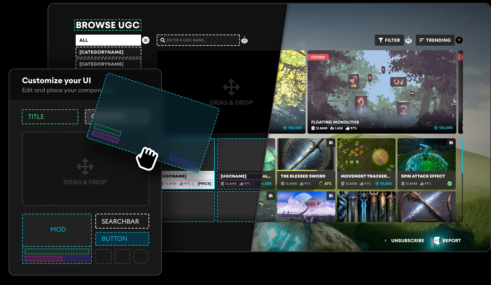
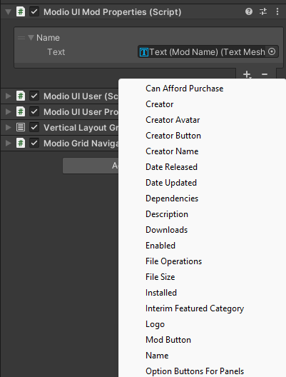
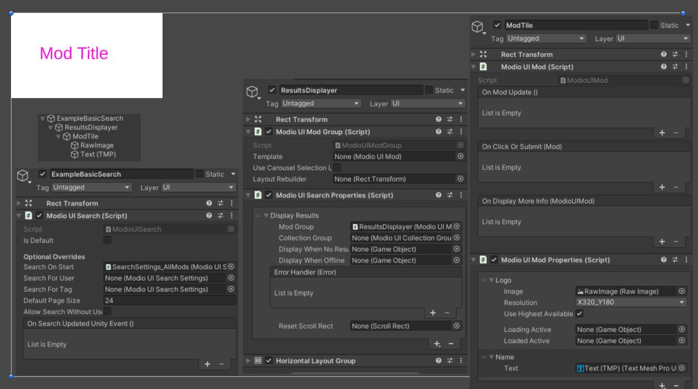

# Component UI for Unity

Component UI for the [Unity Plugin](/unity) is a backbone for any [in-game UGC UI](https://docs.mod.io/in-game-ui) you want to create. It can be completely customized to suit your brand and game.

### Explore components with Template UI

Component UI is essentially a collection of parts that you can utilize to create in-game UI. The best way to learn what is available for the Unity Plugin is to explore [Template UI](/unity/template-ui/integration), which is a fully featured UGC browser built using Component UI.

By tweaking the prefabs and components of Template UI, you'll be able to better understand what is available to you. If you would like assistance or to learn more about Component UI within the Unity Plugin, don't hesitate to contact us at developers@mod.io.

## Key concepts in Component UI
### Resource objects
###### ModioUIMod, ModioUIUser, ModioUISearch, ...
Resource object components are used to control what's displayed.
By assigning a Mod to a ModioUIMod, any children of this component
can be informed and update text, images, and anything else needed.

### Property Containers
###### ModioUIModProperties, ModioUIUserProperties, ...
These components subscribe to a Resource component (ModioUIMod etc.) on a parent GameObject and
provide a single point to hook up all supported customisation.
These are provided via a drop down list when you click the `+` button.

### Properties
###### IModProperty and inheritors (ModPropertyName, ModPropertySubscriptionToggle, ...), IUserProperty, ISearchProperty, ...
These are added to a Property Container and update parts of the UI when their owning resource changes.
This can be as simple as setting a mod's name to a TMP_Text,
or more complex, like changing button behaviour based on subscription state.

Most I..Properties with multiple fields treat all fields as optional, so you can just fill in the ones you need.

:::note
You can create your own mod properties by extending IModProperty and implementing `void OnModUpdate(Mod mod)`
It will then be automatically detected by the editor.
:::

### ModioUIModGroup
This component will instantiate and assign a list of mods.
It automatically grabs the first ModioUIMod on its children as a template,
and instantiates more siblings for that template as needed.

You can hook it up to a search with a SearchPropertyDisplayResults.

Typically, the parent of the template UIMod will have a LayoutGroup of some kind.
If the UIModGroup is able to recognise it, and it's within a scrollview, it will use placeholders when the mods are offscreen
and dynamically swap them out as they near the visible area.

### ModioUISearch
This manages any searches run by the plugin.
Unlike Mods, it doesn't have a non-UI component, but is instead given
ModioUISearchSettings which specify what to search for.

This follows a similar logic for children observing changes to mods via ModioUISearchProperties.

A ModioUiSearch is used for the main search by the plugin (the browse screen) as well as a separate one per carousel.
It's also used for showing a mods dependencies and a collection's contents.

## Other useful components
### ModioUIFilterDisplay
Handles displaying all of the tag options that can modify the default search.

### ModioUIModGallery
Displays the gallery for a mod, supporting scrolling through the images.

## Creating a Search from Scratch

### Basic setup
:::important
Note that this example requires that you're initializing the mod.io plugin already, and focuses only on the UI
:::

This example needs to be placed as a child of a Canvas.

### Create and configure the ModioUISearch
This will contain everything that displays the search results, as well as everything that displays filter information
1. Create an "ExampleBasicSearch" GameObject as a child of the Canvas
2. Add a `ModioUISearch` component to it.
3. Assign the Search On Start field with a SearchSettings. You can create your own, but there are some premade such as
   "SearchSettings_AllMods" in "Modio/Unity/UI/Prefabs/SearchSettings/"

### Create a ModGroup to display the results
This will listen to the Search, and manage instantiating individual Mod objects

1. Create a "ResultsDisplayer" GameObject as a child of "ExampleBasicSearch"
2. Add `ModioUIModGroup` and `ModioUISearchProperties` components to it
3. On the `ModioUISearchProperties`, press the `+` button and select "Display Results" to add that property
4. Expand the Display Results section and drag the ModioUIModGroup component into the "Mod Group" field
5. Add a `HorizontalLayoutGroup`, or any other LayoutGroup you prefer

### Create a ModTile to display an individual mod
This contains information about a particular mod

1. Create a "ModTile" GameObject as a child of "ResultsDisplayer". Resize it to 320x180
2. Add `ModioUIMod` and `ModioUIModProperties` components to it
3. Add a child RawImage (right click the GameObject, select "UI/Raw Image") and make it the size of the parent
4. Add a child TextMeshPro ("UI/Text - TextMeshPro")
5. On the UIModProperties, press the '+' button and
    1. Select "Logo". Expand the new Logo property and add your RawImage to the "Image" field
    2. Select "Name". Expand the new Name property and add your Text (TMP) to the "Text" field

:::note
You could add a ModioUIModProperties to the RawImage and Text GameObjects directly if you prefer.
They can be on any child GameObject of the UIMod
:::

You could also use our example "Mod Tile" or "Mod Tile Featured" prefabs to display your mods (just drop it in and it'll be
detected and work automatically), or "ModTile(Dependencies)" for a less detailed version (note it's designed for a VerticalLayout)

You now have a functional page of results!

## Other considerations when not using TemplateUI
Consider looking at TemplateUI for specific panels or example prefabs.

Authentication is a complicated process, and you may find using ModioAuthenticationPanel useful,
even if you don't use the rest of TUI

Many TUI Prefabs are built to function standalone. Consider modifying these rather than building from scratch.
This would be particularly helpful if you are dealing with console platforms, to ensure you're handling things like
the display of usernames correctly