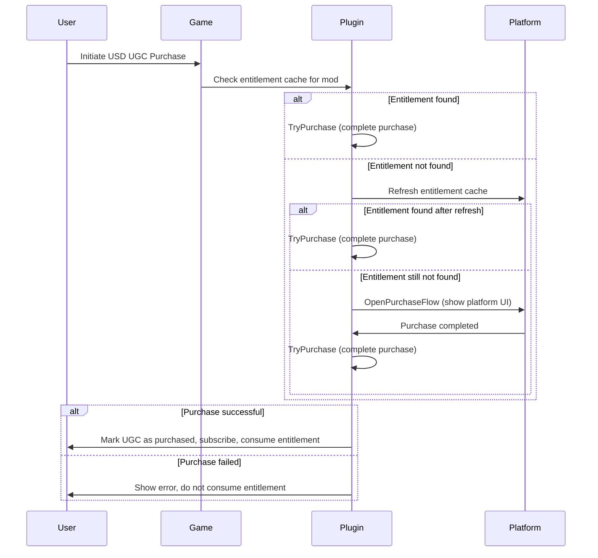

# Marketplace for Unity

The Unity Plugin supports a range of [Monetization](https://docs.mod.io/monetization) features, allowing you to sell a per-game virtual currency to your players that they can use to purchase UGC, with a share of the revenue split between creators and your studio.

This guide covers the end-to-end flow for implementing mod.io [Marketplace](https://docs.mod.io/monetization/marketplace) into your Unity title, a feature that exposes the data and functions required to build a UGC store in-game. We recommend reading this guide for a thorough understanding of the plugin's features so you can decide what is the best approach for your game.

## Initial Setup

Please follow the below guides for setting up Virtual Currency for mod.io Marketplace on your required platforms:

| Platform | Virtual Currency Support | USD Support |
|----------|--------------------------|-------------|
| [Steam](/platforms/steam/marketplace) | ✅ | ✅ |
| [Epic](/platforms/epic/marketplace) | ✅ | ✅ |
| [Apple (iOS)](/platforms/apple/marketplace) | ✅ | ❌ |
| [Google Play (Android)](/platforms/google/marketplace) | ✅ | ❌ |
| [Meta Quest](/platforms/meta/marketplace) | ✅ | ❌ |

:::note[Mobile Setup]
If you are implementing Marketplace for mobile platforms such as Google or Apple, refer to our [Mobile In-App Purchases Guide](/unity/marketplace-mobile-iap).
:::

The following platforms require approval, see [Console SDKs](/platforms/console-sdks) for details:

| Platform | Virtual Currency Support | USD Support |
|----------|--------------------------|-------------|
| [PlayStation®4](https://docs.mod.io/partners/ps4/marketplace) | ✅ | ❌ |
| [PlayStation®5](https://docs.mod.io/partners/ps5/marketplace) | ✅ | ❌ |
| [Xbox](https://docs.mod.io/partners/xbox/marketplace) | ✅ | ❌ |

## Template UI

The mod.io Unity Plugin features [Component UI](https://docs.mod.io/in-game-ui/component) & [Template UI](https://docs.mod.io/in-game-ui/template) which both have built-in support for [Monetization](https://docs.mod.io/monetization), including conveniently purchasing through multiple platform storefronts. Once mod.io & your platform are configured with your SKUs, no additional work is required to integrate this into the UI solutions!

## Marketplace Overview
* [Purchasing UGC](#purchasing-ugc)
* [Getting the user's purchases](#getting-the-users-purchases)
* [Virtual Currency Integration](#virtual-currency-integration)
  * [Purchasing Virtual Currency](#purchasing-virtual-currency)
  * [User Wallet Balance](#user-wallet-balance)
* [USD Integration](#usd-integration)


## Purchasing UGC

Purchasing UGC is straight-forward, and uses `Mod.Purchase()`. This method takes a boolean argument for whether to subscribe on purchase.
The underlying way the purchase is made depends on the platform and storefront services that have been implemented and configured.

```csharp
async void PurchaseModExample()
{
    (Error error, Mod mod) = await Mod.GetMod(1234); //Gets the mod either from cache or the server

    if (error){
        // ... error handling
        return;
    }

    error = await mod.Purchase(true);
    if (error){
        // ... error handling   
    }
}
```

If you have previously called `ModInstallationManagement.Activate()`, the UGC will be added to the download queue and installed.

## Getting the user's purchases

To install purchased UGC, the user needs to be subscribed to the UGC they have purchased (this happens automatically on purchase). The UGC will also be automatically installed and updated after enabling UGC management. See [Installing UGC](/unity/subscribing#installing-ugc) for more information.

To get a list of all the authenticated user's purchased UGC, use the synchronous method `User.Current.ModRepository.GetPurchased()`:

```csharp
void GetUserPurchases()
{
    IEnumerable<Mod> purchasedMods = User.Current.ModRepository.GetPurchased();
}
```

## Virtual Currency Integration

The mod.io Unity Engine plugin makes it simple to implement Marketplace into your game. Below we'll cover the key elements required to enable in-game Marketplace functionality:

### Purchasing Virtual Currency

Purchasing Virtual Currency is achieved using the relevant `IModioStorefrontService` or `IModioVirtualCurrencyProviderService` implementation, available for each supported storefront platform.

For `IModioStorefrontService`, all that needs to be done is to call `OpenPlatformPurchaseFlow()`.

```csharp
async void OpenPurchaseFlow()
{
    Error error = await ModioServices.Resolve<IModioStorefrontService>().OpenPlatformPurchaseFlow();
    if(!error)
        return;
    // ... error handling logic
}
```

For `IModioVirtualCurrencyProviderService`, it's a little more involved. Some platforms do not provide storefront overlay functionality, and instead requires your game's UI to present the user with available SKUs. Once one is selected in-game, we can then open the platforms checkout flow.

This interface utilizes the platform agnostic `PortalSku` struct, which provides a localized price in string format, the value of the virtual currency pack, the SKU code and the portal it originated from.

To get available SKUs for purchase, call `GetCurrencyPacks()`. To then checkout a specific SKU, call `OpenCheckoutFlow(PortalSku sku)`, like below:

```csharp
async void OpenPurchaseFlow()
{
    var virtualCurrencyProviderService = ModioServices.Resolve<IModioVirtualCurrencyProviderService>();
    (Error error, PortalSku[] skus) = await ModioServices.Resolve<IModioVirtualCurrencyProviderService>().GetCurrencyPackSkus();

    if (error)
    {
        // ... error handling
        return;
    }

    // Deliver information to your UI here
    (bool cancelled, PortalSku selectedSku) = await SomeUIImplementation.ShowSkus(skuResult.value);
    if (cancelled)
        return;

    error = virtualCurrencyProviderService.OpenCheckoutFlow(selectedSku);

    if (error){
        // ... error handling
    }
}
```

The implementations of `IModioStorefrontService` and `IModioVirtualCurrencyProviderService` should also automatically SyncEntitlements for the user without manual intervention. However, you can force this by calling `User.Current.SyncEntitlements()`. This will use the current platforms `IModioEntitlementService`.

```csharp
async void SyncEntitlements()
{
    Error error = await User.Current.SyncEntitlements();

    if (error){
        // ... error handling
    }
}
```

We've successfully purchased a Virtual Currency pack and consumed it using mod.io's services, your wallet balance now contains the purchased Virtual Currency! You can see this immediately from your game's mod.io page, however below we're going to cover fetching that balance in game.

### User Wallet Balance

The implementations of `IModioStorefrontService` and `IModioVirtualCurrencyProviderService` should automatically sync the current User's Wallet. However, you can force the sync by calling `User.Current.SyncWallet()`.

```csharp
async void GetUserWalletBalanceExample()
{
    Error error = await User.Current.SyncEntitlements();

    if (error){
        // ... error handling
    }
}
```

## USD Integration

The mod.io Unity Engine plugin makes it simple to implement USD Marketplace into your game.

### Purchasing with USD Entitlements

In order to allow USD purchases, you must also enable the setting in the Unity Plugin's Mod.io Settings window.

When a UGC is purchased using USD, the plugin will first check a cache of entitlements to see if the user has a relevant entitlement for the UGC.
This can happen if the user has previously purchased outside the plugin, for example directly through the platform's storefront, or if there was an interruption during the purchase flow.
If an entitlement is not found, it will refresh the entitlement cache from the platform's entitlement service to ensure the latest data is being used.
If an entitlement is still not found, `IModioUsdMarketplace.OpenPurchaseFlow()` will be called with the mod's USD SKU to initiate the purchase flow.
Once an entitlement has been found, `IModioUsdMarketplace.TryPurchase()` will be called to complete the purchase within mod.io.

Until a purchase has been completed successfully, the entitlement will not be consumed, the UGC will not be marked as purchased within mod.io, and the user will not be subscribed to the mod.




## Support and Contact

We've now successfully integrated [Marketplace](https://docs.mod.io/monetization/marketplace)! All that's left is to invite your creators to start making premium UGC.

For any support queries, please join us in our [Discord server](https://discord.mod.io), we'd love to chat and help support you.

If you're interested in discussing how Marketplace can benefit your game, please reach out to us at [developers@mod.io](mailto:developers@mod.io).