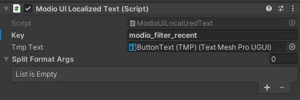

# Template UI Integration


[Template UI](https://docs.mod.io/in-game-ui/template) has two key goals: provide a series of components that are easier to integrate into all designs, and a robust UI suitable for dropping into your project as is or with as much customization as you'd like.

Check out the [Template UI Functionality](/unity/template-ui) and [Template UI Layouts](/unity/template-ui/layouts) guides for a full list of Template UI has to offer. 

:::important
Template UI relies on the config file that is configured during the following setup instructions on the main [Unity Plugin Installation Guide](/unity/installation). Please ensure you have completed all of those steps before proceeding.
:::  

This guide covers:

* [Example scene](#example-scene)
* [Key components](#key-components)
* [Customization](#customization)

## Example scene

The Example Scene for Template UI will show you the basic setup for this feature. It can be found in **unity/ui/examplescene**. 

Let's take a look at some key pieces:


There's a few key things in the scene to note, which you'll need to copy into your scene or create a suitable alternative.

- Canvas (Mods) contains the prefab **ModBrowser**. This is the core of the UI, and can be dropped into your menu scene as is
    - Either duplicate the Canvas, or add the ModBrowser prefab to a canvas of your own. It's designed to look best on a "Scale with Screen Size" canvas with ``Reference Resolution`` 1920x1080 and ``Match`` set to 1 (Height)
- **ModioUI_InputCapture** will load an EventSystem at runtime, as well as integrating it with our UI. It also maps icons for use in the UI
    - You will need to have one of the EventSystems it references available, or create your own in scene
    - If you are using Unity's InputSystem, you can extract ModioInputListener_InputSystem.zip
- **ExamplePlatformIntegration** loads example integrations (such as Steam (via the Facepunch library) or console integrations). You will likely want to create or modify your own implementations based on these.
- **ModioUI_Localization** provides an example localization implementation. It's possible to bypass this and use your own loc system if desired
- Canvas (Title) is a basic menu and settings page that gives some more control of the demo

#### Opening the Browser
- You can open the browser by calling ``OpenPanel()`` on the instance of ``ModBrowserPanel`` in your scene.
    - You can also get that instance by calling ``ModioPanelManager.GetPanelOfType<ModBrowserPanel>()``.


## Key components
### ModioUIMod and similar

We use monobehaviours like ModioUIMod to act as containers for ``ModioUI.Data.Mod``, which holds all the details you may wish to know about the UGC. Children of that gameobject will add ``ModioUIModProperties`` monoBehaviours, which have properties added to update UI or add listeners to buttons (such as to subscribe or get ratings)

There's also

- **ModioUISearch** and **ModioUISearchProperties**, which contain and modify the current search filter (tags, search text, pagination) and access the resulting UGC
    - There's currently two ModioUISearches in our example. One exists on the ModBrowser root object, and controls the main search. All children use this by default
    - **ModPanel_Dependencies** has its own ModioUISearch and its children will display the results of a dependency search instead
- **ModioUIUser** and **ModioUIUserProperties**, which has details about either the logged in local user or the author of the UGC.
    - If you want to display UGC authors, use a ``ModProperties`` with the Creator property, pointed at a ModioUIUser on the same GameObject. You can then use ModioUIUserProperties to display details like the name or icon
    - See "Title and Creator" on the "ModContent_ModDetails" prefab for an example

### ModioPanels
We use a panels system, which handles the basics of pushing and popping panels as they're opened by the user

- There's only ever one panel focused, and they handle registering and unregistering from input events when focus changes.
-. This includes interactive screens like ModDisplay or the main ModBrowser, as well as non-interactive states like a waiting screen (ModioWaitingPanelGeneric)

### Localization
\
We have a basic localization implementation in the ModioUI_Localization prefab. This allows all of our buttons to look up a key in a CSV, but lacks the advanced features typical in most localization packages.

-   The localization solution looks at ``Settings.server.languageCode`` to determine the language. Please re-initialise the plugin via ``ModIOUnity.InitializeForUser`` if you change the language. See ``ModioExampleSettingsPanel`` for an example.
-   If you are using a localization package, you can override the implementation by calling ``ModioUI_Localization.SetCustomHandler(YourHandlerMethod)``
-   Alternatively, you can leave both localization solutions running
-   The component UI does not handle RTL text to avoid conflicts. If your game supports RTL language, you'll need to apply your solution to the Component UI yourself


## Customization

Customizing Template UI is achieved through two methods:

1. [Theme System](#theme-system)
2. [Editing Component UI prefabs](#editing-component-ui-prefabs)

### Theme System

Template UI comes with a theming system designed to centralize making sweeping changes to the colors and fonts of the whole UI. This centrality makes it far easier to customize the UI without any prefab or code changes, and can even be done live during play mode.


#### Theme Sheets

You can find two examples of Theme Sheets in `Modio/Unity/UI/ThemeSheets`, the default sheet and an example viking theme sheet. It's recommended you duplicate one of these scriptable objects and edit it in your own workspace, with these sheets serving as a template for customizing the browser.

To set the theme sheet, navigate to your mod.io config object and add a new platform settings object called `ModioThemeSystemSettings `. Simply drag your desired theme sheet into the serialized field of this object and it'll be applied to Template UI. This will also update when configured during play mode, allowing you to swap themes live to compare changes.


In order to see the changes live, during play mode simply select the desired theme sheet scriptable object and start making changes. Being a scriptable object, all changes will be applied to the scriptable object, persisting after play mode has concluded. All mod.io prefabs utilize the theme system, so creating custom layouts or even custom panels disconnected from the mod browser will still respect the theming as long as an instance of `ModioThemeController` is in the scene.

:::warning
Scriptable Object changes are not always captured by Unity, it's important to click **File** > **Save Project** after making changes to the scriptable object to make sure Unity correctly saves the changes. Otherwise changes could potentially be lost upon closing the editor or not seen by version control.
:::

The Theme Sheet system utilizes 'Targets' and 'Options', borrowing conventions from CSS. A Target is a type of element being themed, all targets must extend another until they reach default, which should extend 'None'. Themes will be applied starting from the last extended target to the actual target to capture all theme options and allow options to be overridden. 

For example, a Primary Action Button extends a Button, but changes the colors to be inverted. First, the Default options are applied, then the Button options override those, then finally the Primary Action Button options override those to create the final style.


Options are the various different styling options that can be applied to targets. There can be multiple of the same option including of the same type, however is often not recommended save for Color Scheme Options. Clicking the **+** will show the different types of options that can be set, simply select one for the target you're editing and then set the Option it will be applying to.

This allows for a great deal of flexibility and granularity, you can add as many targets and options to the sheet as you'd like with incredibly granular targeting to allow for a dynamic theme tailored exactly to your game.

#### Custom Theme Options

Custom Options can also be created quite easily by implementing either `IStyleOption` or `BaseStyleOption`, with the latter providing a bit more convenience to implementations:

```C#
[Serializable]
public abstract class BaseStyleOption<T> : IStyleOption
{
    public ThemeOptions OptionType => _option;

    [SerializeField] ThemeOptions _option;

    public void TryStyleComponent(Object component)
    {
        if (component is T superType) StyleComponent(superType);
    }

    protected abstract void StyleComponent(T component);
}

public interface IStyleOption
{
    ThemeOptions OptionType { get; }
    void TryStyleComponent(UnityEngine.Object component);
}
```

Any object implementing this interface can be added to the theme sheet straight away as an option, any object that implements `UnityEngine.Object` (such as components) can be passed through the system, allowing you to introduce custom UI objects that can also be themed. Once you have created your implementation of the above, you will need to assign your corresponding component to `ModioUIThemeProperties` components on your prefabs:


### Editing Component UI prefabs

#### Basic Recoloring

The Component UI is built using a small set of prefabs stored in ``ModioUI/Prefabs/Widgets/UIBasics/Components/``.


- The majority of background elements are ButtonBackground or PanelBackground
    - In addition to changing the Image component's Color, you'll need to change the values on ``ModioUISelectableTransitions`` which controls the various selection states
    - ButtonBackground is also used in locations other than buttons, with some of its functionality (like SelectableTransitions) disabled
- Most text is based on the ``ButtonText (TMP)`` prefab. You can change its font, and change colors in the same way as above

#### Adding ModioUIModProperties options

To add a new property, simply extend IModProperty and respond to the OnModUpdate property, which will be called whenever the UGC is changed or 'dirtied' (such as by changing subscription or file state, rating UGC, or dependencies being fetched from the server)

```csharp
[Serializable]
public class ModPropertySummary : IModProperty
{
    [SerializeField] TMP_Text _text;

    public void OnModUpdate(Mod mod) => _text.text = mod.Summary;
}
```